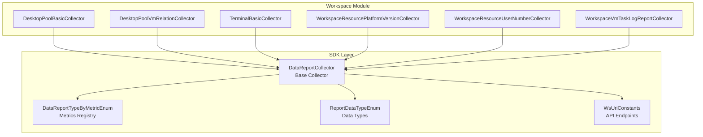
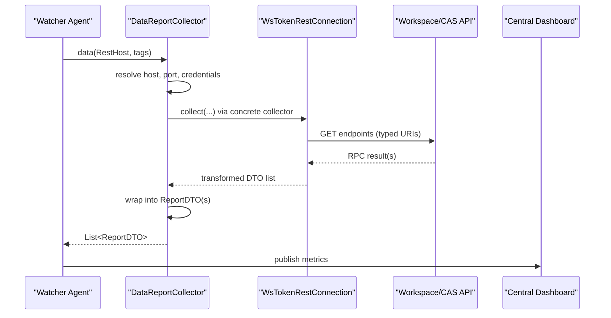
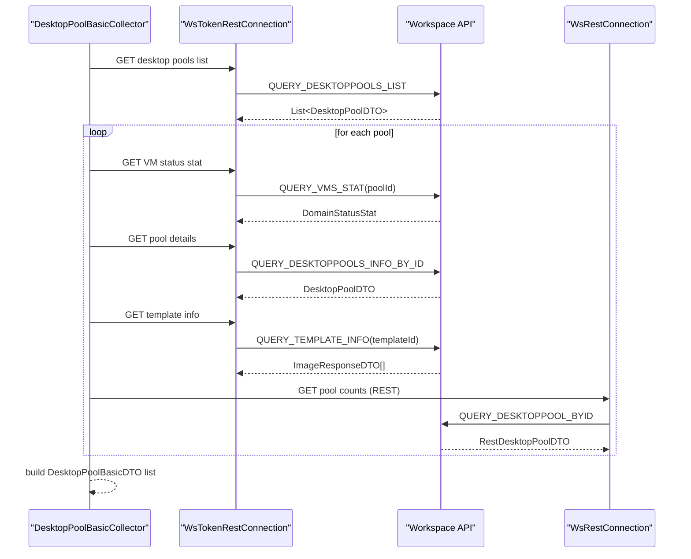
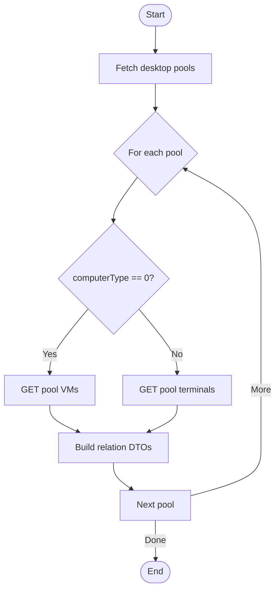
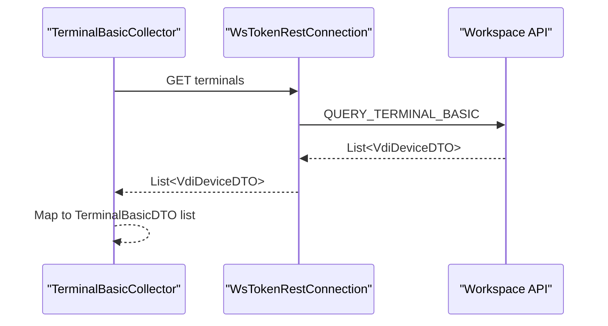
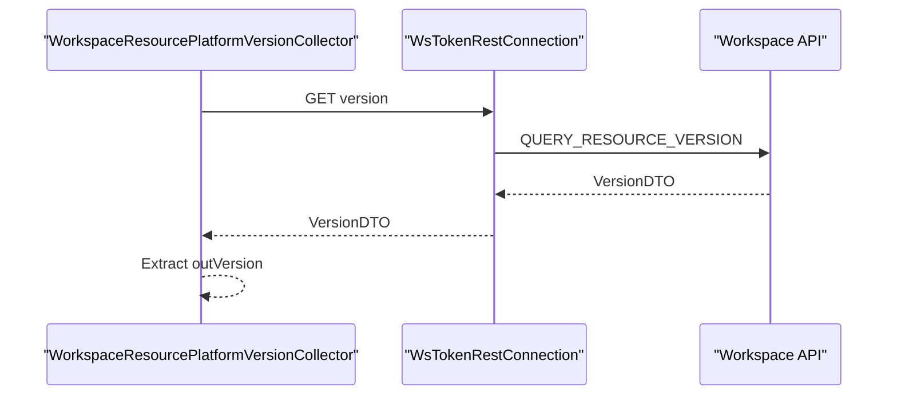
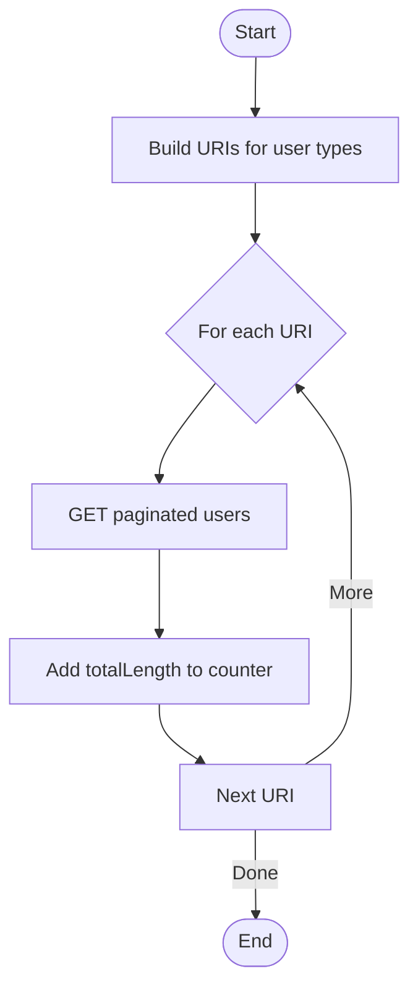
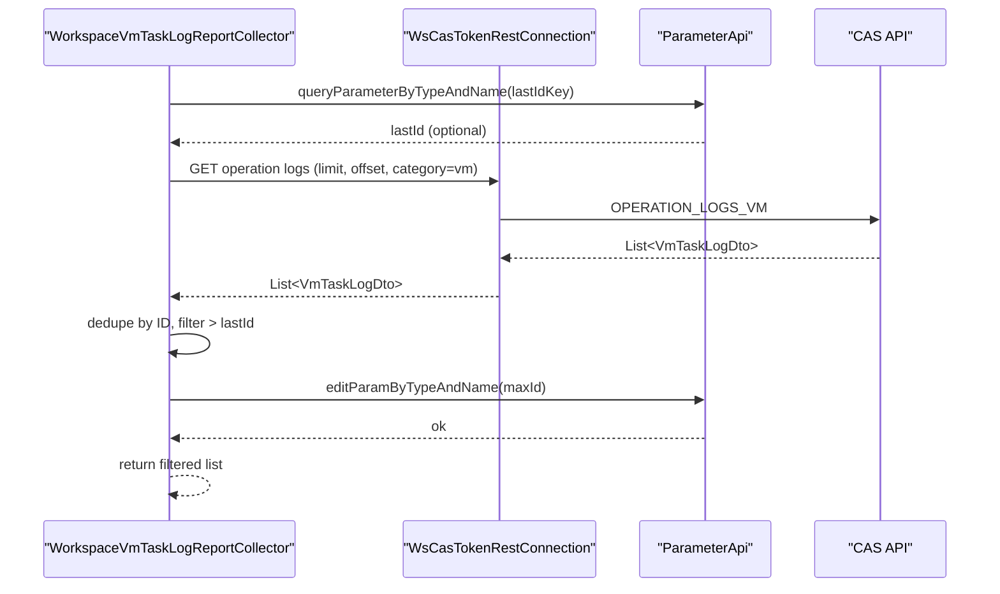
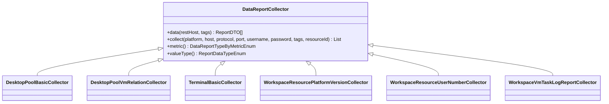

# Reporting System

<cite>
**Referenced Files in This Document**
- [DesktopPoolBasicCollector.java](file://watcher-workspace/src/main/java/com/virtual/cloud/om/workspace/service/report/DesktopPoolBasicCollector.java)
- [DesktopPoolVmRelationCollector.java](file://watcher-workspace/src/main/java/com/virtual/cloud/om/workspace/service/report/DesktopPoolVmRelationCollector.java)
- [TerminalBasicCollector.java](file://watcher-workspace/src/main/java/com/virtual/cloud/om/workspace/service/report/TerminalBasicCollector.java)
- [WorkspaceResourcePlatformVersionCollector.java](file://watcher-workspace/src/main/java/com/virtual/cloud/om/workspace/service/report/WorkspaceResourcePlatformVersionCollector.java)
- [WorkspaceResourceUserNumberCollector.java](file://watcher-workspace/src/main/java/com/virtual/cloud/om/workspace/service/report/WorkspaceResourceUserNumberCollector.java)
- [WorkspaceVmTaskLogReportCollector.java](file://watcher-workspace/src/main/java/com/virtual/cloud/om/workspace/service/report/WorkspaceVmTaskLogReportCollector.java)
- [DataReportCollector.java](file://watcher-sdk/src/main/java/com/virtual/cloud/om/sdk/api/DataReportCollector.java)
- [WsUriConstants.java](file://watcher-sdk/src/main/java/com/virtual/cloud/om/sdk/constant/uri/WsUriConstants.java)
- [DataReportTypeByMetricEnum.java](file://watcher-sdk/src/main/java/com/virtual/cloud/om/sdk/constant/DataReportTypeByMetricEnum.java)
- [ReportDataTypeEnum.java](file://watcher-sdk/src/main/java/com/virtual/cloud/om/sdk/constant/report/ReportDataTypeEnum.java)
</cite>

## Table of Contents
1. [Introduction](#introduction)
2. [Project Structure](#project-structure)
3. [Core Components](#core-components)
4. [Architecture Overview](#architecture-overview)
5. [Detailed Component Analysis](#detailed-component-analysis)
6. [Dependency Analysis](#dependency-analysis)
7. [Performance Considerations](#performance-considerations)
8. [Troubleshooting Guide](#troubleshooting-guide)
9. [Conclusion](#conclusion)
10. [Appendices](#appendices)

## Introduction
This document describes the Workspace reporting system responsible for desktop pool monitoring and resource analytics. It focuses on six collectors:
- DesktopPoolBasicCollector: desktop pool fundamentals and VM counts
- DesktopPoolVmRelationCollector: mapping between desktop pools and VMs/terminals
- TerminalBasicCollector: terminal device statistics
- WorkspaceResourcePlatformVersionCollector: platform version tracking
- WorkspaceResourceUserNumberCollector: user count monitoring
- WorkspaceVmTaskLogReportCollector: VM operation task logs

It explains data collection patterns, metric calculations, reporting intervals, configuration examples, data transformation processes, and integration with the central monitoring dashboard. It also provides troubleshooting guidance and performance optimization tips.

## Project Structure
The Workspace reporting system resides under the workspace module and leverages SDK abstractions for data collection and reporting. The collectors extend a common base class and use typed URIs and enums to define metrics and data types.

**Diagram sources**
- [DataReportCollector.java:1-118](file://watcher-sdk/src/main/java/com/virtual/cloud/om/sdk/api/DataReportCollector.java#L1-L118)
- [DataReportTypeByMetricEnum.java:21-155](file://watcher-sdk/src/main/java/com/virtual/cloud/om/sdk/constant/DataReportTypeByMetricEnum.java#L21-L155)
- [ReportDataTypeEnum.java:3-10](file://watcher-sdk/src/main/java/com/virtual/cloud/om/sdk/constant/report/ReportDataTypeEnum.java#L3-L10)
- [WsUriConstants.java:1-195](file://watcher-sdk/src/main/java/com/virtual/cloud/om/sdk/constant/uri/WsUriConstants.java#L1-L195)

**Section sources**
- [DataReportCollector.java:1-118](file://watcher-sdk/src/main/java/com/virtual/cloud/om/sdk/api/DataReportCollector.java#L1-L118)
- [WsUriConstants.java:1-195](file://watcher-sdk/src/main/java/com/virtual/cloud/om/sdk/constant/uri/WsUriConstants.java#L1-L195)

## Core Components
This section documents each collector’s responsibilities, data sources, transformations, and reporting characteristics.

- DesktopPoolBasicCollector
  - Purpose: Collect desktop pool metadata and VM status counts per pool.
  - Data sources: Desktop pools list, VM status stats, desktop pool details, template info, and running/paused/abnormal counts via REST endpoints.
  - Transformation: Aggregates per-pool info into a structured DTO list; enriches with template CPU/memory and CVK name.
  - Output type: JSON array of desktop pool records.
  - Metric: desktop_pool_basic.

- DesktopPoolVmRelationCollector
  - Purpose: Build relations between desktop pools and underlying VMs or terminals depending on computer type.
  - Data sources: Desktop pools list; VMs for computer type 0; terminals for other types.
  - Transformation: Produces relation DTOs linking pool ID to VM UUID or terminal device ID.
  - Output type: JSON array of relation records.
  - Metric: desktop_pool_vm_relation.

- TerminalBasicCollector
  - Purpose: Retrieve terminal device statistics.
  - Data sources: Terminal devices endpoint returning device metadata.
  - Transformation: Maps raw device DTOs to terminal basic DTOs.
  - Output type: JSON array of terminal records.
  - Metric: terminal_basic.

- WorkspaceResourcePlatformVersionCollector
  - Purpose: Track platform version string.
  - Data sources: Resource version endpoint.
  - Transformation: Extracts version string from response.
  - Output type: Text.
  - Metric: workspace_resource_plat_version.

- WorkspaceResourceUserNumberCollector
  - Purpose: Monitor total user count across local, domain, LDAP users and operators.
  - Data sources: Paginated user queries for each category.
  - Transformation: Sums total lengths from paginated responses.
  - Output type: Gauge (integer).
  - Metric: workspace_resource_user_number.

- WorkspaceVmTaskLogReportCollector
  - Purpose: Stream VM operation task logs with deduplication and incremental reporting.
  - Data sources: CAS operation logs endpoint; persisted last ID parameter.
  - Transformation: Deduplicates by ID, filters out previously reported entries, and persists the latest ID.
  - Output type: JSON array of task log records.
  - Metric: workspace_operation_log.

**Section sources**
- [DesktopPoolBasicCollector.java:32-150](file://watcher-workspace/src/main/java/com/virtual/cloud/om/workspace/service/report/DesktopPoolBasicCollector.java#L32-L150)
- [DesktopPoolVmRelationCollector.java:33-116](file://watcher-workspace/src/main/java/com/virtual/cloud/om/workspace/service/report/DesktopPoolVmRelationCollector.java#L33-L116)
- [TerminalBasicCollector.java:30-97](file://watcher-workspace/src/main/java/com/virtual/cloud/om/workspace/service/report/TerminalBasicCollector.java#L30-L97)
- [WorkspaceResourcePlatformVersionCollector.java:23-51](file://watcher-workspace/src/main/java/com/virtual/cloud/om/workspace/service/report/WorkspaceResourcePlatformVersionCollector.java#L23-L51)
- [WorkspaceResourceUserNumberCollector.java:25-62](file://watcher-workspace/src/main/java/com/virtual/cloud/om/workspace/service/report/WorkspaceResourceUserNumberCollector.java#L25-L62)
- [WorkspaceVmTaskLogReportCollector.java:29-77](file://watcher-workspace/src/main/java/com/virtual/cloud/om/workspace/service/report/WorkspaceVmTaskLogReportCollector.java#L29-L77)

## Architecture Overview
The collectors follow a common pattern: extend the base collector, fetch data from Workspace/CAS endpoints via typed connections, transform into DTOs, and return structured reports with tags and timestamps.

**Diagram sources**
- [DataReportCollector.java:48-86](file://watcher-sdk/src/main/java/com/virtual/cloud/om/sdk/api/DataReportCollector.java#L48-L86)
- [WsUriConstants.java:34-178](file://watcher-sdk/src/main/java/com/virtual/cloud/om/sdk/constant/uri/WsUriConstants.java#L34-L178)

## Detailed Component Analysis

### DesktopPoolBasicCollector
- Responsibilities
  - Enumerate desktop pools
  - Fetch per-pool VM status counts
  - Retrieve desktop pool details (name, types, cluster, templates)
  - Enrich with template CPU/memory and first CVK host name
  - Aggregate into JSON output with tags and timestamp

- Data collection pattern
  - Single-list fetch for desktop pools
  - Parallel per-pool requests using futures
  - Multiple downstream endpoints per pool

- Metric calculation
  - Counts: allocation, online, no-allocation, running, paused, abnormal, unknown, shut off, VM total
  - Metadata: pool name, user/target types, cluster, prefixes, storage pools, template CPU/memory

- Reporting interval
  - Controlled by scheduling orchestration; typical cadence aligns with policy-driven triggers.

**Diagram sources**
- [DesktopPoolBasicCollector.java:36-139](file://watcher-workspace/src/main/java/com/virtual/cloud/om/workspace/service/report/DesktopPoolBasicCollector.java#L36-L139)
- [WsUriConstants.java:48-103](file://watcher-sdk/src/main/java/com/virtual/cloud/om/sdk/constant/uri/WsUriConstants.java#L48-L103)

**Section sources**
- [DesktopPoolBasicCollector.java:32-150](file://watcher-workspace/src/main/java/com/virtual/cloud/om/workspace/service/report/DesktopPoolBasicCollector.java#L32-L150)
- [WsUriConstants.java:48-103](file://watcher-sdk/src/main/java/com/virtual/cloud/om/sdk/constant/uri/WsUriConstants.java#L48-L103)

### DesktopPoolVmRelationCollector
- Responsibilities
  - Map desktop pools to VMs or terminals based on computer type
  - Emit relation records linking pool ID to VM/terminal identifiers

- Data collection pattern
  - Single-list fetch for desktop pools
  - Conditional downstream fetch: VMs for computer type 0, terminals otherwise
  - Parallel per-pool relations building

- Metric calculation
  - Relation tuples: poolId → vmUuid or poolId → device id

- Reporting interval
  - Policy-driven; typically periodic alongside desktop pool discovery

**Diagram sources**
- [DesktopPoolVmRelationCollector.java:36-104](file://watcher-workspace/src/main/java/com/virtual/cloud/om/workspace/service/report/DesktopPoolVmRelationCollector.java#L36-L104)
- [WsUriConstants.java:95-103](file://watcher-sdk/src/main/java/com/virtual/cloud/om/sdk/constant/uri/WsUriConstants.java#L95-L103)

**Section sources**
- [DesktopPoolVmRelationCollector.java:33-116](file://watcher-workspace/src/main/java/com/virtual/cloud/om/workspace/service/report/DesktopPoolVmRelationCollector.java#L33-L116)
- [WsUriConstants.java:95-103](file://watcher-sdk/src/main/java/com/virtual/cloud/om/sdk/constant/uri/WsUriConstants.java#L95-L103)

### TerminalBasicCollector
- Responsibilities
  - Retrieve terminal device list
  - Transform raw device DTOs into terminal basic DTOs

- Data collection pattern
  - Single request to terminal devices endpoint
  - Stream mapping to terminal DTOs

- Metric calculation
  - Flat list of terminal records with attributes (UUID, IP, MAC, OS, vendor, model, versions, status, group)

- Reporting interval
  - Periodic refresh aligned with policy

**Diagram sources**
- [TerminalBasicCollector.java:34-75](file://watcher-workspace/src/main/java/com/virtual/cloud/om/workspace/service/report/TerminalBasicCollector.java#L34-L75)
- [WsUriConstants.java:34-35](file://watcher-sdk/src/main/java/com/virtual/cloud/om/sdk/constant/uri/WsUriConstants.java#L34-L35)

**Section sources**
- [TerminalBasicCollector.java:30-97](file://watcher-workspace/src/main/java/com/virtual/cloud/om/workspace/service/report/TerminalBasicCollector.java#L30-L97)
- [WsUriConstants.java:34-35](file://watcher-sdk/src/main/java/com/virtual/cloud/om/sdk/constant/uri/WsUriConstants.java#L34-L35)

### WorkspaceResourcePlatformVersionCollector
- Responsibilities
  - Fetch platform release version string

- Data collection pattern
  - Single request to version endpoint

- Metric calculation
  - Plain text version string

- Reporting interval
  - Infrequent; typically on-demand or low-frequency refresh

**Diagram sources**
- [WorkspaceResourcePlatformVersionCollector.java:26-39](file://watcher-workspace/src/main/java/com/virtual/cloud/om/workspace/service/report/WorkspaceResourcePlatformVersionCollector.java#L26-L39)
- [WsUriConstants.java:37-37](file://watcher-sdk/src/main/java/com/virtual/cloud/om/sdk/constant/uri/WsUriConstants.java#L37-L37)

**Section sources**
- [WorkspaceResourcePlatformVersionCollector.java:23-51](file://watcher-workspace/src/main/java/com/virtual/cloud/om/workspace/service/report/WorkspaceResourcePlatformVersionCollector.java#L23-L51)
- [WsUriConstants.java:37-37](file://watcher-sdk/src/main/java/com/virtual/cloud/om/sdk/constant/uri/WsUriConstants.java#L37-L37)

### WorkspaceResourceUserNumberCollector
- Responsibilities
  - Count total users across categories: local, domain, LDAP users and operators

- Data collection pattern
  - Paginated queries for each user category
  - Sum total lengths

- Metric calculation
  - Integer gauge representing total user count

- Reporting interval
  - Periodic refresh aligned with policy

**Diagram sources**
- [WorkspaceResourceUserNumberCollector.java:29-50](file://watcher-workspace/src/main/java/com/virtual/cloud/om/workspace/service/report/WorkspaceResourceUserNumberCollector.java#L29-L50)
- [WsUriConstants.java:171-174](file://watcher-sdk/src/main/java/com/virtual/cloud/om/sdk/constant/uri/WsUriConstants.java#L171-L174)

**Section sources**
- [WorkspaceResourceUserNumberCollector.java:25-62](file://watcher-workspace/src/main/java/com/virtual/cloud/om/workspace/service/report/WorkspaceResourceUserNumberCollector.java#L25-L62)
- [WsUriConstants.java:171-174](file://watcher-sdk/src/main/java/com/virtual/cloud/om/sdk/constant/uri/WsUriConstants.java#L171-L174)

### WorkspaceVmTaskLogReportCollector
- Responsibilities
  - Fetch VM operation logs from CAS
  - Deduplicate by ID and filter out previously reported entries
  - Persist the highest seen ID for incremental reporting

- Data collection pattern
  - Paginate with limit/offset
  - Deduplicate using ID comparator
  - Compare against stored last ID and filter

- Metric calculation
  - JSON array of task log records after filtering

- Reporting interval
  - Frequent; optimized to minimize payload by incremental reporting

**Diagram sources**
- [WorkspaceVmTaskLogReportCollector.java:37-65](file://watcher-workspace/src/main/java/com/virtual/cloud/om/workspace/service/report/WorkspaceVmTaskLogReportCollector.java#L37-L65)
- [WsUriConstants.java:176-178](file://watcher-sdk/src/main/java/com/virtual/cloud/om/sdk/constant/uri/WsUriConstants.java#L176-L178)

**Section sources**
- [WorkspaceVmTaskLogReportCollector.java:29-77](file://watcher-workspace/src/main/java/com/virtual/cloud/om/workspace/service/report/WorkspaceVmTaskLogReportCollector.java#L29-L77)
- [WsUriConstants.java:176-178](file://watcher-sdk/src/main/java/com/virtual/cloud/om/sdk/constant/uri/WsUriConstants.java#L176-L178)

## Dependency Analysis
- Base abstraction
  - All collectors inherit from DataReportCollector, ensuring consistent data shaping and reporting envelope creation.
- Metrics registry
  - DataReportTypeByMetricEnum defines the canonical metric names and platform scoping for Workspace collectors.
- Data types
  - ReportDataTypeEnum governs whether values are JSON, text, gauge, etc.
- Endpoint registry
  - WsUriConstants centralizes Workspace/CAS API endpoints used by collectors.

**Diagram sources**
- [DataReportCollector.java:19-118](file://watcher-sdk/src/main/java/com/virtual/cloud/om/sdk/api/DataReportCollector.java#L19-L118)
- [DesktopPoolBasicCollector.java:32-150](file://watcher-workspace/src/main/java/com/virtual/cloud/om/workspace/service/report/DesktopPoolBasicCollector.java#L32-L150)
- [DesktopPoolVmRelationCollector.java:33-116](file://watcher-workspace/src/main/java/com/virtual/cloud/om/workspace/service/report/DesktopPoolVmRelationCollector.java#L33-L116)
- [TerminalBasicCollector.java:30-97](file://watcher-workspace/src/main/java/com/virtual/cloud/om/workspace/service/report/TerminalBasicCollector.java#L30-L97)
- [WorkspaceResourcePlatformVersionCollector.java:23-51](file://watcher-workspace/src/main/java/com/virtual/cloud/om/workspace/service/report/WorkspaceResourcePlatformVersionCollector.java#L23-L51)
- [WorkspaceResourceUserNumberCollector.java:25-62](file://watcher-workspace/src/main/java/com/virtual/cloud/om/workspace/service/report/WorkspaceResourceUserNumberCollector.java#L25-L62)
- [WorkspaceVmTaskLogReportCollector.java:29-77](file://watcher-workspace/src/main/java/com/virtual/cloud/om/workspace/service/report/WorkspaceVmTaskLogReportCollector.java#L29-L77)

**Section sources**
- [DataReportCollector.java:19-118](file://watcher-sdk/src/main/java/com/virtual/cloud/om/sdk/api/DataReportCollector.java#L19-L118)
- [DataReportTypeByMetricEnum.java:21-155](file://watcher-sdk/src/main/java/com/virtual/cloud/om/sdk/constant/DataReportTypeByMetricEnum.java#L21-L155)
- [ReportDataTypeEnum.java:3-10](file://watcher-sdk/src/main/java/com/virtual/cloud/om/sdk/constant/report/ReportDataTypeEnum.java#L3-L10)
- [WsUriConstants.java:1-195](file://watcher-sdk/src/main/java/com/virtual/cloud/om/sdk/constant/uri/WsUriConstants.java#L1-L195)

## Performance Considerations
- Parallelization
  - DesktopPoolBasicCollector and DesktopPoolVmRelationCollector use parallel futures per pool to reduce total collection latency.
- Deduplication and incremental reporting
  - WorkspaceVmTaskLogReportCollector deduplicates by ID and filters by last reported ID to minimize payload and avoid redundant uploads.
- Pagination
  - WorkspaceResourceUserNumberCollector paginates user queries to avoid oversized responses.
- Payload sizing
  - WorkspaceVmTaskLogReportCollector caps initial fetch size and filters before reporting.

[No sources needed since this section provides general guidance]

## Troubleshooting Guide
- Authentication failures
  - Symptoms: HTTP response errors or AppException during endpoint calls.
  - Actions: Verify host credentials and protocol/port; confirm token-based connections are authorized.
- Empty or missing data
  - Symptoms: Empty lists returned for desktop pools or terminals.
  - Actions: Confirm endpoint availability and that the target platform has active resources; check tags and resource IDs.
- Excessive latency
  - Symptoms: Slow collection times for desktop pools.
  - Actions: Review network connectivity; consider adjusting parallelism or reducing per-call payloads.
- Duplicate logs
  - Symptoms: Repeated task logs in dashboard.
  - Actions: Ensure last ID persistence is functioning; verify deduplication logic and parameter updates.
- Version or user count anomalies
  - Symptoms: Incorrect version string or user totals.
  - Actions: Validate endpoint responses; confirm pagination limits and total length aggregation.

**Section sources**
- [DesktopPoolBasicCollector.java:121-129](file://watcher-workspace/src/main/java/com/virtual/cloud/om/workspace/service/report/DesktopPoolBasicCollector.java#L121-L129)
- [DesktopPoolVmRelationCollector.java:86-96](file://watcher-workspace/src/main/java/com/virtual/cloud/om/workspace/service/report/DesktopPoolVmRelationCollector.java#L86-L96)
- [WorkspaceVmTaskLogReportCollector.java:53-57](file://watcher-workspace/src/main/java/com/virtual/cloud/om/workspace/service/report/WorkspaceVmTaskLogReportCollector.java#L53-L57)

## Conclusion
The Workspace reporting system provides robust, modular collectors for desktop pool monitoring, VM/terminal relations, terminal statistics, platform version tracking, user counts, and VM operation logs. By leveraging a shared base collector, typed metrics, and centralized endpoint definitions, the system ensures consistent data shaping and efficient integration with the central monitoring dashboard. Proper configuration, incremental reporting, and parallel processing enable reliable and scalable analytics.

[No sources needed since this section summarizes without analyzing specific files]

## Appendices

### Configuration Examples
- Collector registration and scheduling
  - Configure collectors via policy-driven triggers so that each collector runs at its intended cadence.
- Endpoint configuration
  - Ensure host, protocol, port, and credentials are set in RestHost; tags carry resource identifiers and filters.
- Incremental reporting
  - For VM task logs, maintain a last-seen ID parameter keyed by resource ID to enable delta reporting.

[No sources needed since this section provides general guidance]

### Data Transformation Reference
- DesktopPoolBasicCollector
  - Input: DesktopPoolDTO, DomainStatusStat, ImageResponseDTO, RestDesktopPoolDTO
  - Output: DesktopPoolBasicDTO list
- DesktopPoolVmRelationCollector
  - Input: DesktopPoolDTO, DomainDTO or VdiDeviceDTO
  - Output: DesktopPoolVmRelationDTO list
- TerminalBasicCollector
  - Input: VdiDeviceDTO list
  - Output: TerminalBasicDTO list
- WorkspaceResourcePlatformVersionCollector
  - Input: VersionDTO
  - Output: version string
- WorkspaceResourceUserNumberCollector
  - Input: Paginated user lists
  - Output: integer gauge
- WorkspaceVmTaskLogReportCollector
  - Input: VmTaskLogDto list
  - Output: filtered VmTaskLogDto list

**Section sources**
- [DesktopPoolBasicCollector.java:53-134](file://watcher-workspace/src/main/java/com/virtual/cloud/om/workspace/service/report/DesktopPoolBasicCollector.java#L53-L134)
- [DesktopPoolVmRelationCollector.java:52-99](file://watcher-workspace/src/main/java/com/virtual/cloud/om/workspace/service/report/DesktopPoolVmRelationCollector.java#L52-L99)
- [TerminalBasicCollector.java:35-75](file://watcher-workspace/src/main/java/com/virtual/cloud/om/workspace/service/report/TerminalBasicCollector.java#L35-L75)
- [WorkspaceResourcePlatformVersionCollector.java:26-39](file://watcher-workspace/src/main/java/com/virtual/cloud/om/workspace/service/report/WorkspaceResourcePlatformVersionCollector.java#L26-L39)
- [WorkspaceResourceUserNumberCollector.java:29-50](file://watcher-workspace/src/main/java/com/virtual/cloud/om/workspace/service/report/WorkspaceResourceUserNumberCollector.java#L29-L50)
- [WorkspaceVmTaskLogReportCollector.java:37-65](file://watcher-workspace/src/main/java/com/virtual/cloud/om/workspace/service/report/WorkspaceVmTaskLogReportCollector.java#L37-L65)