# Workspace Platform Module

<cite>
**Referenced Files in This Document**
- [pom.xml](file://watcher-workspace/pom.xml)
- [NativeController.java](file://watcher-workspace/src/main/java/com/virtual/cloud/om/workspace/web/NativeController.java)
- [WorkspaceTestConnectionApi.java](file://watcher-workspace/src/main/java/com/virtual/cloud/om/workspace/service/WorkspaceTestConnectionApi.java)
- [WsHostHandler.java](file://watcher-workspace/src/main/java/com/virtual/cloud/om/workspace/service/WsHostHandler.java)
- [DesktopPoolBasicCollector.java](file://watcher-workspace/src/main/java/com/virtual/cloud/om/workspace/service/report/DesktopPoolBasicCollector.java)
- [DesktopPoolVmRelationCollector.java](file://watcher-workspace/src/main/java/com/virtual/cloud/om/workspace/service/report/DesktopPoolVmRelationCollector.java)
- [TerminalBasicCollector.java](file://watcher-workspace/src/main/java/com/virtual/cloud/om/workspace/service/report/TerminalBasicCollector.java)
- [WorkspaceDesktopPoolOperateCommandExecutor.java](file://watcher-workspace/src/main/java/com/virtual/cloud/om/workspace/service/operate/WorkspaceDesktopPoolOperateCommandExecutor.java)
- [WorkspaceTerminalOperateCommandExecutor.java](file://watcher-workspace/src/main/java/com/virtual/cloud/om/workspace/service/operate/WorkspaceTerminalOperateCommandExecutor.java)
- [WorkspaceHostLogCollector.java](file://watcher-workspace/src/main/java/com/virtual/cloud/om/workspace/service/batchlog/WorkspaceHostLogCollector.java)
- [WorkspaceTerminalLogCollector.java](file://watcher-workspace/src/main/java/com/virtual/cloud/om/workspace/service/batchlog/WorkspaceTerminalLogCollector.java)
- [WorkspaceVmLogCollector.java](file://watcher-workspace/src/main/java/com/virtual/cloud/om/workspace/service/batchlog/WorkspaceVmLogCollector.java)
- [WorkspaceControllerLogPatternHandler.java](file://watcher-workspace/src/main/java/com/virtual/cloud/om/workspace/service/realtimelog/WorkspaceControllerLogPatternHandler.java)
- [WorkspaceGrpcLogPatternHandler.java](file://watcher-workspace/src/main/java/com/virtual/cloud/om/workspace/service/realtimelog/WorkspaceGrpcLogPatternHandler.java)
- [WorkspaceServerLogPatternHandler.java](file://watcher-workspace/src/main/java/com/virtual/cloud/om/workspace/service/realtimelog/WorkspaceServerLogPatternHandler.java)
- [OthersPatternHandler.java](file://watcher-workspace/src/main/java/com/virtual/cloud/om/workspace/service/realtimelog/OthersPatternHandler.java)
- [WorkspaceSshService.java](file://watcher-workspace/src/main/java/com/virtual/cloud/om/workspace/service/ssh/WorkspaceSshService.java)
</cite>

## Table of Contents
1. [Introduction](#introduction)
2. [Project Structure](#project-structure)
3. [Core Components](#core-components)
4. [Architecture Overview](#architecture-overview)
5. [Detailed Component Analysis](#detailed-component-analysis)
6. [Dependency Analysis](#dependency-analysis)
7. [Performance Considerations](#performance-considerations)
8. [Troubleshooting Guide](#troubleshooting-guide)
9. [Conclusion](#conclusion)
10. [Appendices](#appendices)

## Introduction
This document describes the Workspace platform monitoring module responsible for desktop pool management and terminal monitoring. It covers the comprehensive reporting system for desktop pools and terminals, VM relation tracking, batch log collection for hosts, terminals, and VMs, specialized real-time log pattern handlers for controller, gRPC, and server-side logs, operational command executors for desktop pool and terminal management, test connection APIs, and integration with Workspace REST services. It also includes configuration examples, log parsing patterns, and operational management workflows.

## Project Structure
The Workspace module is a Spring Boot application packaged as a Maven artifact. It integrates with the shared SDK to communicate with Workspace REST endpoints, issue batch log requests, and parse real-time logs.

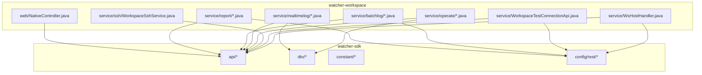

**Diagram sources**
- [pom.xml:14-30](file://watcher-workspace/pom.xml#L14-L30)
- [NativeController.java:1-19](file://watcher-workspace/src/main/java/com/virtual/cloud/om/workspace/web/NativeController.java#L1-L19)
- [DesktopPoolBasicCollector.java:1-150](file://watcher-workspace/src/main/java/com/virtual/cloud/om/workspace/service/report/DesktopPoolBasicCollector.java#L1-L150)
- [WorkspaceHostLogCollector.java:1-95](file://watcher-workspace/src/main/java/com/virtual/cloud/om/workspace/service/batchlog/WorkspaceHostLogCollector.java#L1-L95)
- [WorkspaceControllerLogPatternHandler.java:1-58](file://watcher-workspace/src/main/java/com/virtual/cloud/om/workspace/service/realtimelog/WorkspaceControllerLogPatternHandler.java#L1-L58)

**Section sources**
- [pom.xml:1-45](file://watcher-workspace/pom.xml#L1-L45)

## Core Components
- Reporting collectors for desktop pools, VM relations, and terminals
- Batch log collectors for hosts, terminals, and VMs
- Real-time log pattern handlers for Workspace controller, gRPC, and server logs
- Operational command executors for desktop pools and terminals
- Test connection API and host handler for Workspace
- SSH service for Workspace-managed environments

**Section sources**
- [DesktopPoolBasicCollector.java:1-150](file://watcher-workspace/src/main/java/com/virtual/cloud/om/workspace/service/report/DesktopPoolBasicCollector.java#L1-L150)
- [DesktopPoolVmRelationCollector.java:1-116](file://watcher-workspace/src/main/java/com/virtual/cloud/om/workspace/service/report/DesktopPoolVmRelationCollector.java#L1-L116)
- [TerminalBasicCollector.java:1-97](file://watcher-workspace/src/main/java/com/virtual/cloud/om/workspace/service/report/TerminalBasicCollector.java#L1-L97)
- [WorkspaceHostLogCollector.java:1-95](file://watcher-workspace/src/main/java/com/virtual/cloud/om/workspace/service/batchlog/WorkspaceHostLogCollector.java#L1-L95)
- [WorkspaceTerminalLogCollector.java:1-153](file://watcher-workspace/src/main/java/com/virtual/cloud/om/workspace/service/batchlog/WorkspaceTerminalLogCollector.java#L1-L153)
- [WorkspaceVmLogCollector.java:1-153](file://watcher-workspace/src/main/java/com/virtual/cloud/om/workspace/service/batchlog/WorkspaceVmLogCollector.java#L1-L153)
- [WorkspaceControllerLogPatternHandler.java:1-58](file://watcher-workspace/src/main/java/com/virtual/cloud/om/workspace/service/realtimelog/WorkspaceControllerLogPatternHandler.java#L1-L58)
- [WorkspaceGrpcLogPatternHandler.java:1-58](file://watcher-workspace/src/main/java/com/virtual/cloud/om/workspace/service/realtimelog/WorkspaceGrpcLogPatternHandler.java#L1-L58)
- [WorkspaceServerLogPatternHandler.java:1-59](file://watcher-workspace/src/main/java/com/virtual/cloud/om/workspace/service/realtimelog/WorkspaceServerLogPatternHandler.java#L1-L59)
- [WorkspaceDesktopPoolOperateCommandExecutor.java:131-303](file://watcher-workspace/src/main/java/com/virtual/cloud/om/workspace/service/operate/WorkspaceDesktopPoolOperateCommandExecutor.java#L131-L303)
- [WorkspaceTerminalOperateCommandExecutor.java](file://watcher-workspace/src/main/java/com/virtual/cloud/om/workspace/service/operate/WorkspaceTerminalOperateCommandExecutor.java)
- [WorkspaceTestConnectionApi.java:1-44](file://watcher-workspace/src/main/java/com/virtual/cloud/om/workspace/service/WorkspaceTestConnectionApi.java#L1-L44)
- [WsHostHandler.java:1-63](file://watcher-workspace/src/main/java/com/virtual/cloud/om/workspace/service/WsHostHandler.java#L1-L63)
- [WorkspaceSshService.java](file://watcher-workspace/src/main/java/com/virtual/cloud/om/workspace/service/ssh/WorkspaceSshService.java)

## Architecture Overview
The Workspace module orchestrates monitoring and operations via:
- REST connections to Workspace services for data retrieval and log collection
- Asynchronous parallelization for efficient data gathering
- Specialized log pattern handlers for structured real-time log parsing
- Operational executors to trigger actions against desktop pools and terminals

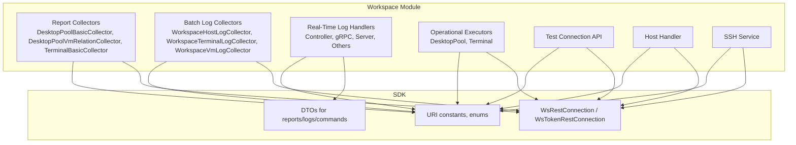

**Diagram sources**
- [DesktopPoolBasicCollector.java:32-149](file://watcher-workspace/src/main/java/com/virtual/cloud/om/workspace/service/report/DesktopPoolBasicCollector.java#L32-L149)
- [WorkspaceHostLogCollector.java:30-93](file://watcher-workspace/src/main/java/com/virtual/cloud/om/workspace/service/batchlog/WorkspaceHostLogCollector.java#L30-L93)
- [WorkspaceControllerLogPatternHandler.java:18-57](file://watcher-workspace/src/main/java/com/virtual/cloud/om/workspace/service/realtimelog/WorkspaceControllerLogPatternHandler.java#L18-L57)
- [WorkspaceDesktopPoolOperateCommandExecutor.java:131-303](file://watcher-workspace/src/main/java/com/virtual/cloud/om/workspace/service/operate/WorkspaceDesktopPoolOperateCommandExecutor.java#L131-L303)
- [WorkspaceTestConnectionApi.java:20-43](file://watcher-workspace/src/main/java/com/virtual/cloud/om/workspace/service/WorkspaceTestConnectionApi.java#L20-L43)
- [WsHostHandler.java:25-62](file://watcher-workspace/src/main/java/com/virtual/cloud/om/workspace/service/WsHostHandler.java#L25-L62)

## Detailed Component Analysis

### Reporting System: Desktop Pool Basics
- Retrieves desktop pool list and enriches metrics such as allocation counts, online/offline stats, template info, and cluster/host details.
- Uses asynchronous futures per desktop pool to parallelize queries and reduce total collection latency.
- Emits JSON-formatted metrics tagged with collection metadata.

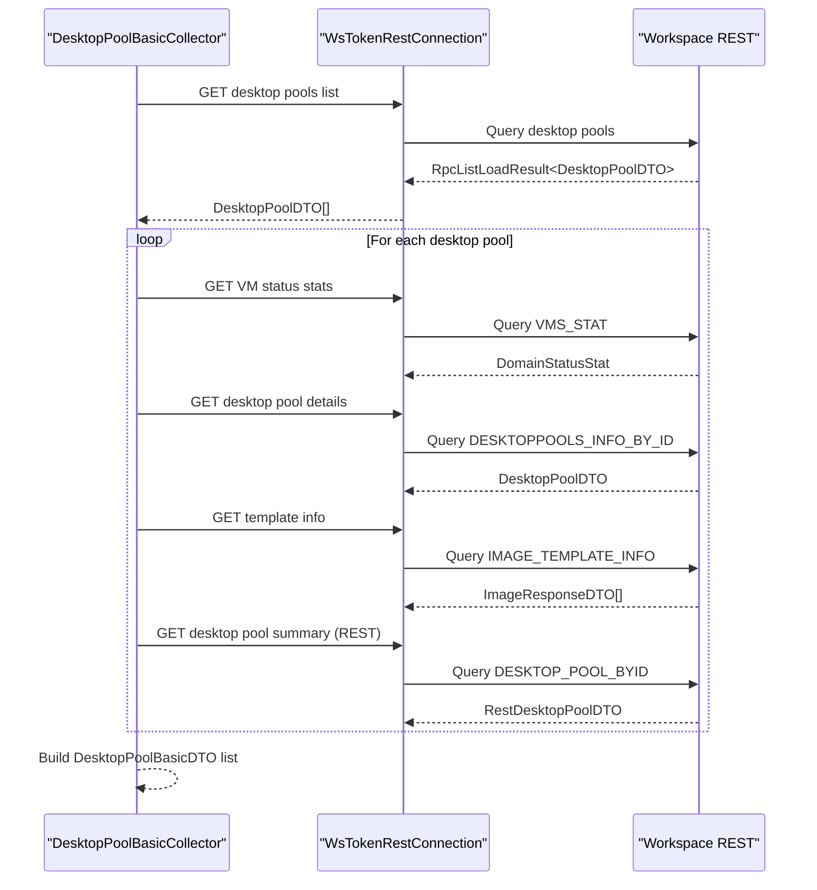

**Diagram sources**
- [DesktopPoolBasicCollector.java:36-139](file://watcher-workspace/src/main/java/com/virtual/cloud/om/workspace/service/report/DesktopPoolBasicCollector.java#L36-L139)

**Section sources**
- [DesktopPoolBasicCollector.java:1-150](file://watcher-workspace/src/main/java/com/virtual/cloud/om/workspace/service/report/DesktopPoolBasicCollector.java#L1-L150)

### Reporting System: VM Relation Tracking
- Enumerates desktop pools and determines whether each belongs to VMs or terminals.
- For VM-type pools, fetches VM UUIDs; for terminal-type pools, fetches terminal IDs.
- Produces a flat relation dataset linking desktop pools to underlying VMs or terminals.

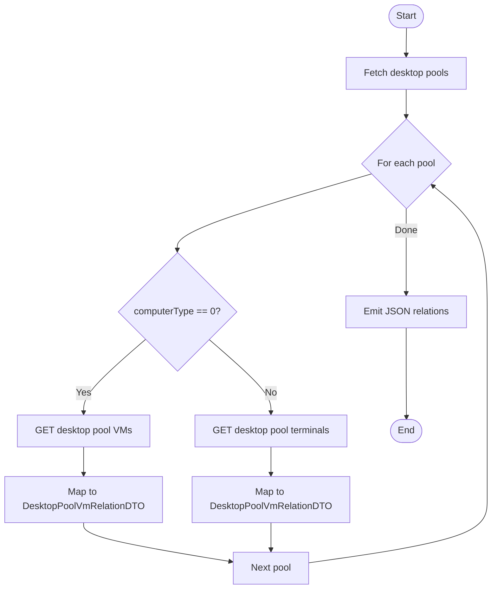

**Diagram sources**
- [DesktopPoolVmRelationCollector.java:36-104](file://watcher-workspace/src/main/java/com/virtual/cloud/om/workspace/service/report/DesktopPoolVmRelationCollector.java#L36-L104)

**Section sources**
- [DesktopPoolVmRelationCollector.java:1-116](file://watcher-workspace/src/main/java/com/virtual/cloud/om/workspace/service/report/DesktopPoolVmRelationCollector.java#L1-L116)

### Reporting System: Terminal Statistics
- Retrieves all terminals and maps fields such as device ID, MAC/IP, OS/arch, vendor/model, client/space agent versions, registration time, auth type, status, and group info.
- Returns a JSON payload suitable for downstream analytics.

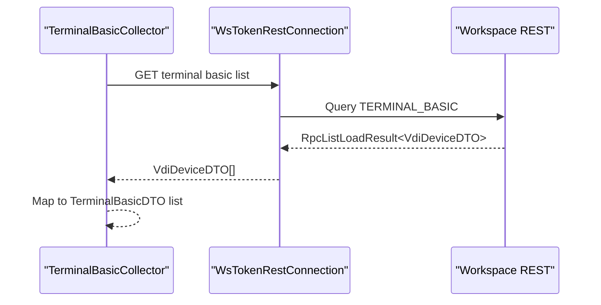

**Diagram sources**
- [TerminalBasicCollector.java:34-85](file://watcher-workspace/src/main/java/com/virtual/cloud/om/workspace/service/report/TerminalBasicCollector.java#L34-L85)

**Section sources**
- [TerminalBasicCollector.java:1-97](file://watcher-workspace/src/main/java/com/virtual/cloud/om/workspace/service/report/TerminalBasicCollector.java#L1-L97)

### Batch Log Collection: Host Logs
- Applies a log-gathering job to target hosts, polls for completion, and downloads the resulting archive.
- Uses a token-based REST connection and supports configurable time windows.

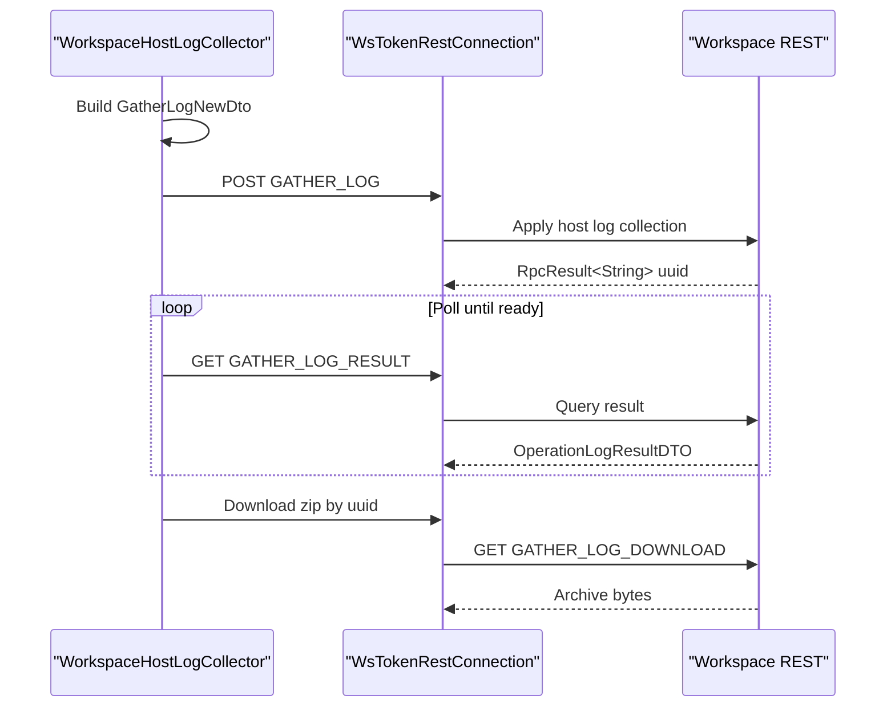

**Diagram sources**
- [WorkspaceHostLogCollector.java:34-87](file://watcher-workspace/src/main/java/com/virtual/cloud/om/workspace/service/batchlog/WorkspaceHostLogCollector.java#L34-L87)

**Section sources**
- [WorkspaceHostLogCollector.java:1-95](file://watcher-workspace/src/main/java/com/virtual/cloud/om/workspace/service/batchlog/WorkspaceHostLogCollector.java#L1-L95)

### Batch Log Collection: Terminal Logs
- Initiates terminal log collection per target, recursively waits for completion, deduplicates by filename, and downloads successful archives.

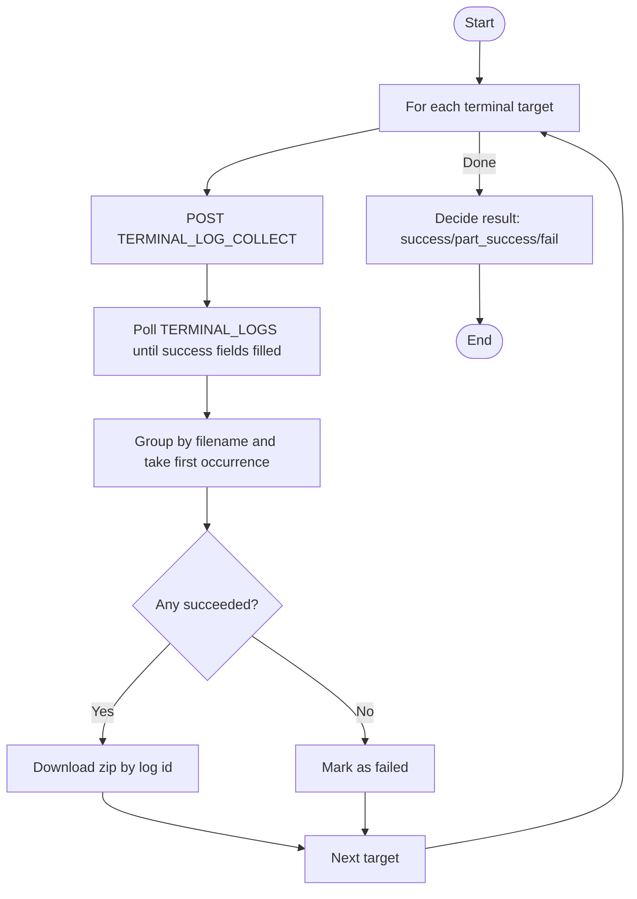

**Diagram sources**
- [WorkspaceTerminalLogCollector.java:34-96](file://watcher-workspace/src/main/java/com/virtual/cloud/om/workspace/service/batchlog/WorkspaceTerminalLogCollector.java#L34-L96)

**Section sources**
- [WorkspaceTerminalLogCollector.java:1-153](file://watcher-workspace/src/main/java/com/virtual/cloud/om/workspace/service/batchlog/WorkspaceTerminalLogCollector.java#L1-L153)

### Batch Log Collection: VM Logs
- Triggers VM log collection per VM title/id, polls for completion, and downloads successful archives.

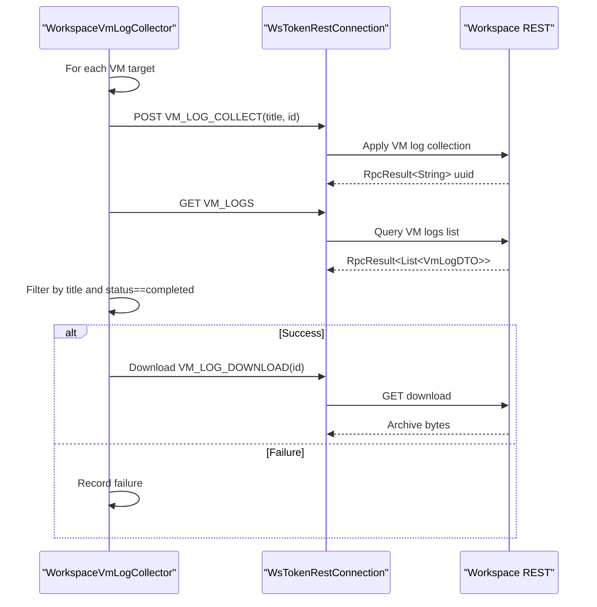

**Diagram sources**
- [WorkspaceVmLogCollector.java:36-89](file://watcher-workspace/src/main/java/com/virtual/cloud/om/workspace/service/batchlog/WorkspaceVmLogCollector.java#L36-L89)

**Section sources**
- [WorkspaceVmLogCollector.java:1-153](file://watcher-workspace/src/main/java/com/virtual/cloud/om/workspace/service/batchlog/WorkspaceVmLogCollector.java#L1-L153)

### Real-Time Log Processing: Pattern Handlers
- Controller logs: Parses structured lines with timestamp, level, thread, request UUID, IP/port, method, line number, and message.
- gRPC logs: Similar structure tailored for gRPC request contexts.
- Server logs: Parses server-side entries with similar fields.
- Others: Fallback handler for unhandled patterns.

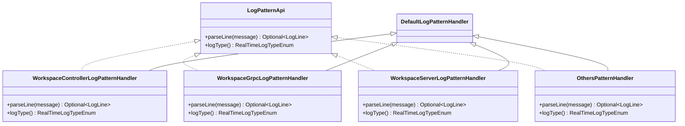

**Diagram sources**
- [WorkspaceControllerLogPatternHandler.java:18-57](file://watcher-workspace/src/main/java/com/virtual/cloud/om/workspace/service/realtimelog/WorkspaceControllerLogPatternHandler.java#L18-L57)
- [WorkspaceGrpcLogPatternHandler.java:18-57](file://watcher-workspace/src/main/java/com/virtual/cloud/om/workspace/service/realtimelog/WorkspaceGrpcLogPatternHandler.java#L18-L57)
- [WorkspaceServerLogPatternHandler.java:18-58](file://watcher-workspace/src/main/java/com/virtual/cloud/om/workspace/service/realtimelog/WorkspaceServerLogPatternHandler.java#L18-L58)
- [OthersPatternHandler.java](file://watcher-workspace/src/main/java/com/virtual/cloud/om/workspace/service/realtimelog/OthersPatternHandler)

**Section sources**
- [WorkspaceControllerLogPatternHandler.java:1-58](file://watcher-workspace/src/main/java/com/virtual/cloud/om/workspace/service/realtimelog/WorkspaceControllerLogPatternHandler.java#L1-L58)
- [WorkspaceGrpcLogPatternHandler.java:1-58](file://watcher-workspace/src/main/java/com/virtual/cloud/om/workspace/service/realtimelog/WorkspaceGrpcLogPatternHandler.java#L1-L58)
- [WorkspaceServerLogPatternHandler.java:1-59](file://watcher-workspace/src/main/java/com/virtual/cloud/om/workspace/service/realtimelog/WorkspaceServerLogPatternHandler.java#L1-L59)
- [OthersPatternHandler.java](file://watcher-workspace/src/main/java/com/virtual/cloud/om/workspace/service/realtimelog/OthersPatternHandler)

### Operational Command Executors: Desktop Pool and Terminals
- Desktop pool executor: Lists terminals in a pool and executes operations (e.g., power actions) in parallel across devices, aggregating results and emitting status refresh events.
- Terminal executor: Executes targeted operations on individual terminals.

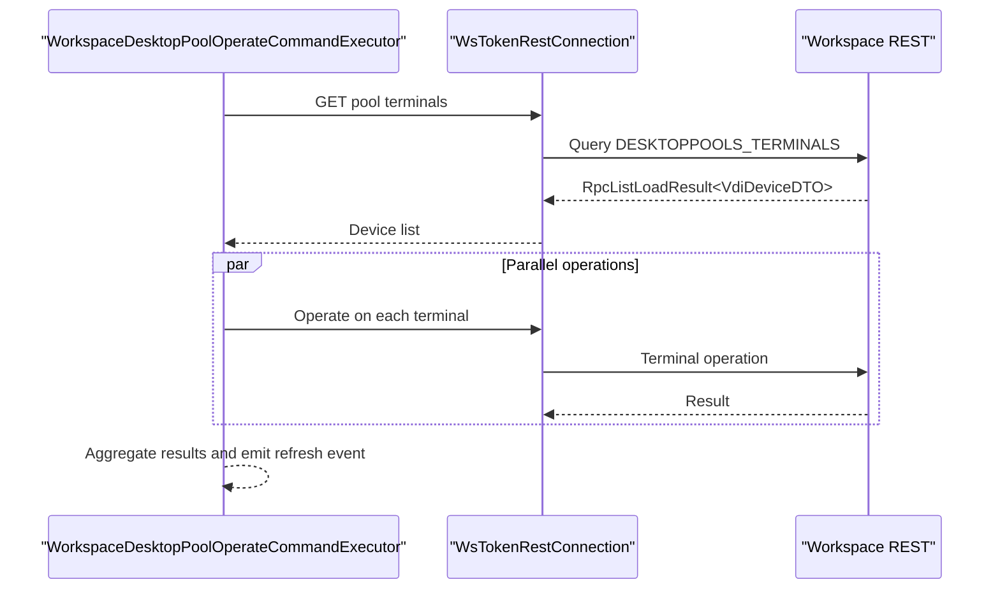

**Diagram sources**
- [WorkspaceDesktopPoolOperateCommandExecutor.java:131-303](file://watcher-workspace/src/main/java/com/virtual/cloud/om/workspace/service/operate/WorkspaceDesktopPoolOperateCommandExecutor.java#L131-L303)

**Section sources**
- [WorkspaceDesktopPoolOperateCommandExecutor.java:131-303](file://watcher-workspace/src/main/java/com/virtual/cloud/om/workspace/service/operate/WorkspaceDesktopPoolOperateCommandExecutor.java#L131-L303)
- [WorkspaceTerminalOperateCommandExecutor.java](file://watcher-workspace/src/main/java/com/virtual/cloud/om/workspace/service/operate/WorkspaceTerminalOperateCommandExecutor.java)

### Test Connection API and Host Handler
- Test connection API: Encrypts credentials and validates connectivity to Workspace via a test endpoint, returning error messages on failure.
- Host handler: Resolves SSH host credentials for Workspace-managed hosts, supporting both management platform and specific host endpoints.

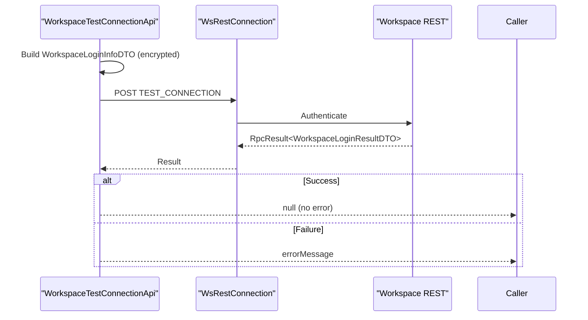

**Diagram sources**
- [WorkspaceTestConnectionApi.java:23-37](file://watcher-workspace/src/main/java/com/virtual/cloud/om/workspace/service/WorkspaceTestConnectionApi.java#L23-L37)

**Section sources**
- [WorkspaceTestConnectionApi.java:1-44](file://watcher-workspace/src/main/java/com/virtual/cloud/om/workspace/service/WorkspaceTestConnectionApi.java#L1-L44)
- [WsHostHandler.java:25-62](file://watcher-workspace/src/main/java/com/virtual/cloud/om/workspace/service/WsHostHandler.java#L25-L62)

### Native Controller and SSH Service
- Native controller: Provides a simple health/home endpoint under /home.
- SSH service: Offers SSH-related capabilities integrated with Workspace-managed environments.

**Section sources**
- [NativeController.java:1-19](file://watcher-workspace/src/main/java/com/virtual/cloud/om/workspace/web/NativeController.java#L1-L19)
- [WorkspaceSshService.java](file://watcher-workspace/src/main/java/com/virtual/cloud/om/workspace/service/ssh/WorkspaceSshService.java)

## Dependency Analysis
The Workspace module depends on the SDK for:
- REST connection abstractions (token and non-token)
- DTOs for reports, logs, and commands
- Constants for URIs and enumerations
- Utilities and exception handling

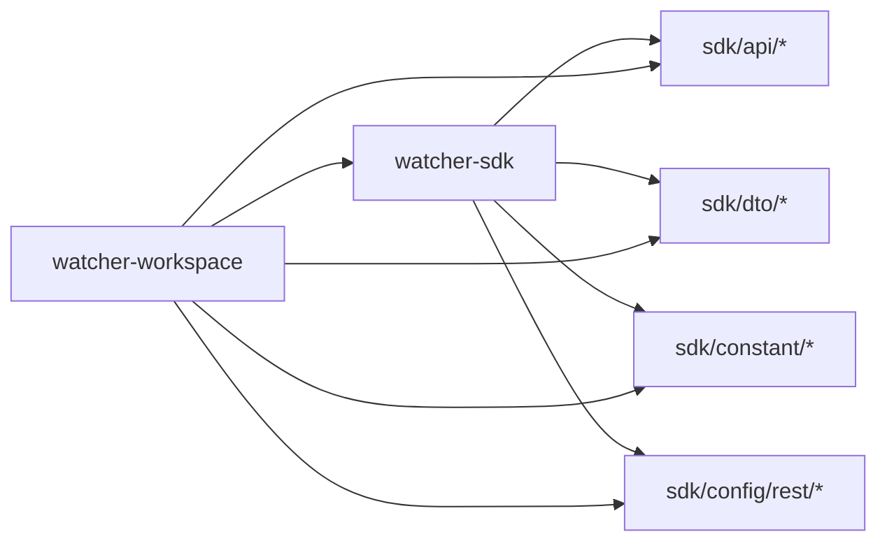

**Diagram sources**
- [pom.xml:22-29](file://watcher-workspace/pom.xml#L22-L29)

**Section sources**
- [pom.xml:1-45](file://watcher-workspace/pom.xml#L1-L45)

## Performance Considerations
- Parallelization: Desktop pool and relation collectors use asynchronous futures to minimize total collection time.
- Polling cadence: Batch log collectors implement bounded retries with short sleeps to balance responsiveness and load.
- Result deduplication: Terminal log collector groups by filename to avoid redundant downloads.
- JSON parsing: Real-time log handlers rely on lightweight regex parsing; ensure log formats remain stable to avoid re-parsing overhead.

[No sources needed since this section provides general guidance]

## Troubleshooting Guide
- Authentication failures: Verify encrypted credentials and endpoint reachability in the test connection API.
- Empty collections: Desktop pool collectors handle empty lists gracefully; confirm pool existence and permissions.
- Batch log timeouts: Increase polling intervals or adjust maximum retry counts in log collectors.
- Parsing mismatches: Validate log line formats against pattern handlers; update regex if Workspace log format changes.

**Section sources**
- [WorkspaceTestConnectionApi.java:23-37](file://watcher-workspace/src/main/java/com/virtual/cloud/om/workspace/service/WorkspaceTestConnectionApi.java#L23-L37)
- [DesktopPoolBasicCollector.java:50-52](file://watcher-workspace/src/main/java/com/virtual/cloud/om/workspace/service/report/DesktopPoolBasicCollector.java#L50-L52)
- [WorkspaceTerminalLogCollector.java:127-140](file://watcher-workspace/src/main/java/com/virtual/cloud/om/workspace/service/batchlog/WorkspaceTerminalLogCollector.java#L127-L140)
- [WorkspaceVmLogCollector.java:120-141](file://watcher-workspace/src/main/java/com/virtual/cloud/om/workspace/service/batchlog/WorkspaceVmLogCollector.java#L120-L141)

## Conclusion
The Workspace platform module provides a robust foundation for desktop pool and terminal monitoring, including comprehensive reporting, batch log collection, and real-time log parsing. Its integration with Workspace REST services and SDK enables scalable, parallelized operations and reliable diagnostics across hosts, VMs, and terminals.

[No sources needed since this section summarizes without analyzing specific files]

## Appendices

### Configuration Examples
- REST endpoints: Use URI constants from the SDK to construct requests for desktop pools, terminals, VMs, and logs.
- Credentials: The test connection API encrypts username/password before sending to Workspace.
- Log patterns: Ensure log formats match the Workspace-specific handlers for accurate parsing.

**Section sources**
- [WorkspaceTestConnectionApi.java:24-36](file://watcher-workspace/src/main/java/com/virtual/cloud/om/workspace/service/WorkspaceTestConnectionApi.java#L24-L36)
- [WorkspaceControllerLogPatternHandler.java:21-51](file://watcher-workspace/src/main/java/com/virtual/cloud/om/workspace/service/realtimelog/WorkspaceControllerLogPatternHandler.java#L21-L51)
- [WorkspaceGrpcLogPatternHandler.java:20-50](file://watcher-workspace/src/main/java/com/virtual/cloud/om/workspace/service/realtimelog/WorkspaceGrpcLogPatternHandler.java#L20-L50)
- [WorkspaceServerLogPatternHandler.java:21-51](file://watcher-workspace/src/main/java/com/virtual/cloud/om/workspace/service/realtimelog/WorkspaceServerLogPatternHandler.java#L21-L51)

### Operational Management Workflows
- Desktop pool operations: Enumerate terminals and dispatch operations in parallel; aggregate results and push status updates.
- Terminal operations: Target individual terminals for lifecycle actions.
- Host/VM log collection: Initiate jobs, poll for completion, and download archives.

**Section sources**
- [WorkspaceDesktopPoolOperateCommandExecutor.java:131-303](file://watcher-workspace/src/main/java/com/virtual/cloud/om/workspace/service/operate/WorkspaceDesktopPoolOperateCommandExecutor.java#L131-L303)
- [WorkspaceTerminalOperateCommandExecutor.java](file://watcher-workspace/src/main/java/com/virtual/cloud/om/workspace/service/operate/WorkspaceTerminalOperateCommandExecutor.java)
- [WorkspaceHostLogCollector.java:34-87](file://watcher-workspace/src/main/java/com/virtual/cloud/om/workspace/service/batchlog/WorkspaceHostLogCollector.java#L34-L87)
- [WorkspaceTerminalLogCollector.java:34-96](file://watcher-workspace/src/main/java/com/virtual/cloud/om/workspace/service/batchlog/WorkspaceTerminalLogCollector.java#L34-L96)
- [WorkspaceVmLogCollector.java:36-89](file://watcher-workspace/src/main/java/com/virtual/cloud/om/workspace/service/batchlog/WorkspaceVmLogCollector.java#L36-L89)