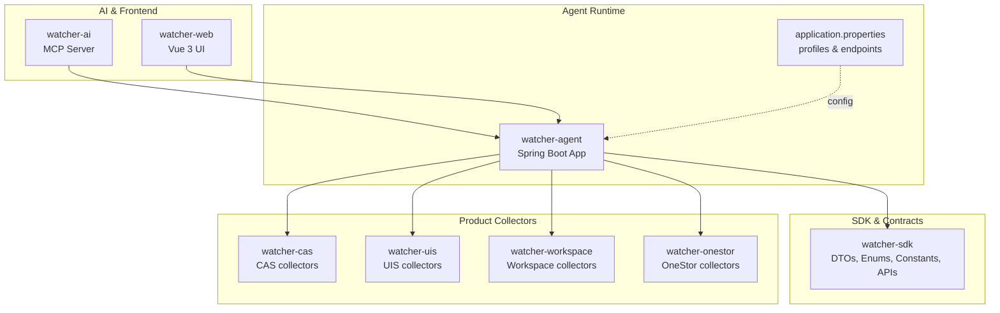
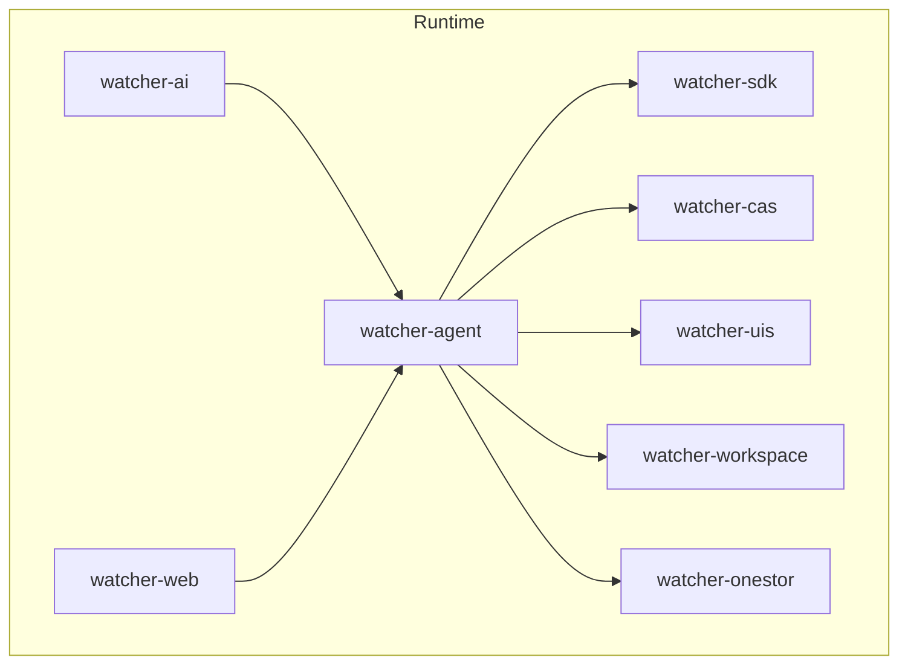
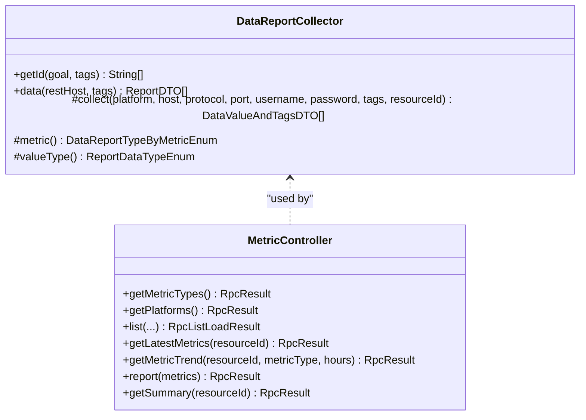
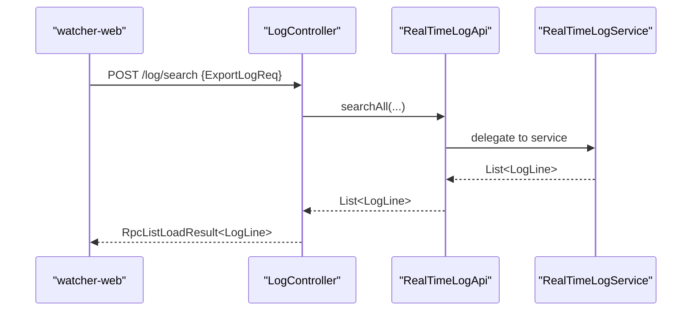
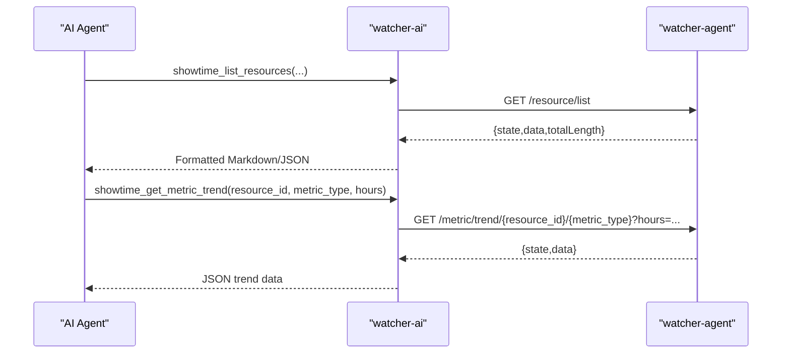
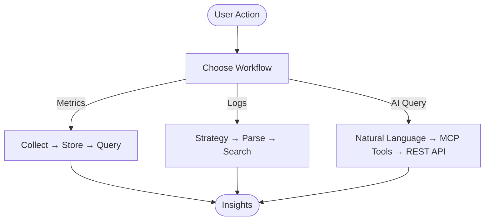
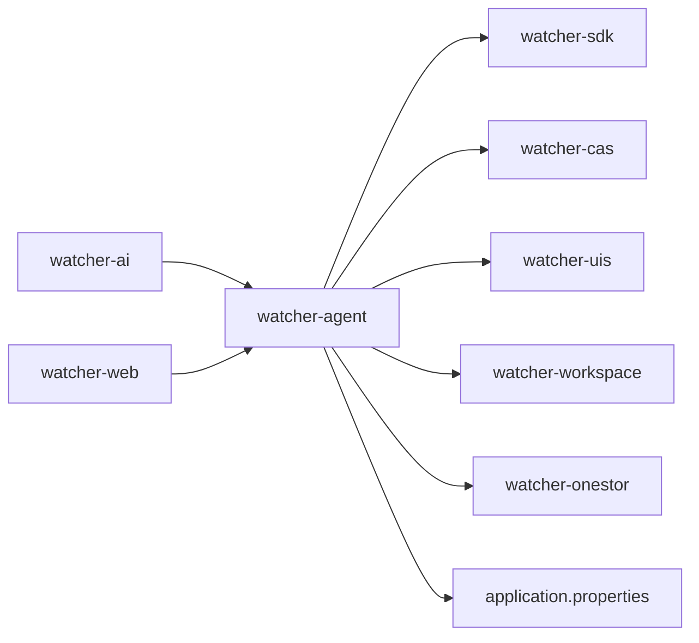

# Project Overview

<cite>
**Referenced Files in This Document**
- [Readme.md](file://Readme.md)
- [WatcherAgentApplication.java](file://watcher-agent/src/main/java/com/virtual/cloud/om/agent/WatcherAgentApplication.java)
- [application.properties](file://watcher-agent/src/main/resources/application.properties)
- [MetricController.java](file://watcher-agent/src/main/java/com/virtual/cloud/om/agent/controller/MetricController.java)
- [LogController.java](file://watcher-agent/src/main/java/com/virtual/cloud/om/agent/controller/LogController.java)
- [RealTimeLogApi.java](file://watcher-sdk/src/main/java/com/virtual/cloud/om/sdk/api/RealTimeLogApi.java)
- [DataReportCollector.java](file://watcher-sdk/src/main/java/com/virtual/cloud/om/sdk/api/DataReportCollector.java)
- [Constant.java](file://watcher-sdk/src/main/java/com/virtual/cloud/om/sdk/constant/Constant.java)
- [RealTimeLogService.java](file://watcher-agent/src/main/java/com/virtual/cloud/om/agent/service/logs/RealTimeLogService.java)
- [showtime_mcp.py](file://watcher-ai/src/showtime_mcp.py)
- [README.md (watcher-ai)](file://watcher-ai/README.md)
- [package.json](file://watcher-web/package.json)
</cite>

## Table of Contents
1. [Introduction](#introduction)
2. [Project Structure](#project-structure)
3. [Core Components](#core-components)
4. [Architecture Overview](#architecture-overview)
5. [Detailed Component Analysis](#detailed-component-analysis)
6. [Dependency Analysis](#dependency-analysis)
7. [Performance Considerations](#performance-considerations)
8. [Troubleshooting Guide](#troubleshooting-guide)
9. [Conclusion](#conclusion)
10. [Appendices](#appendices)

## Introduction
ShowTime is a unified monitoring platform designed for H3C cloud product lines. It centralizes log and metric collection to power time-series data visualization and intelligent query experiences. The platform’s purpose is to present “Show” (display) of “Time” (time-series data), enabling operators to observe, diagnose, and maintain cloud environments efficiently.

Key value propositions:
- Unified observability across H3C product families (CAS, UIS, Workspace, OneStor)
- Integrated log collection and metric monitoring with extensible collectors
- Natural language query via an AI MCP server for intuitive analytics
- Operational tooling for real-time log strategies and resource orchestration

Target audiences:
- System administrators responsible for cloud infrastructure health
- DevOps teams needing rapid insights into performance and anomalies

Differentiators:
- Modular collector architecture per product family
- AI-powered natural language processing for monitoring queries
- Flexible deployment profiles supporting local development and production-like setups

## Project Structure
The repository is organized into multiple Maven modules, each serving a distinct role in the monitoring lifecycle:

- watcher-agent: Central Spring Boot service orchestrating data collection, scheduling, and API exposure
- watcher-sdk: Shared DTOs, enums, constants, and APIs used across collectors and agents
- watcher-cas / watcher-uis / watcher-workspace / watcher-onestor: Product-specific collectors and log parsers
- watcher-ai: Python MCP server exposing monitoring data to AI agents
- watcher-web: Vue 3 frontend for operational tasks and dashboards
- watcher-builder: Packaging and deployment artifacts

**Diagram sources**
- [WatcherAgentApplication.java:14-27](file://watcher-agent/src/main/java/com/virtual/cloud/om/agent/WatcherAgentApplication.java#L14-L27)
- [application.properties:1-80](file://watcher-agent/src/main/resources/application.properties#L1-L80)
- [package.json:1-72](file://watcher-web/package.json#L1-L72)

**Section sources**
- [Readme.md:27-45](file://Readme.md#L27-L45)
- [WatcherAgentApplication.java:14-27](file://watcher-agent/src/main/java/com/virtual/cloud/om/agent/WatcherAgentApplication.java#L14-L27)
- [application.properties:1-80](file://watcher-agent/src/main/resources/application.properties#L1-L80)
- [package.json:1-72](file://watcher-web/package.json#L1-L72)

## Core Components
- Data reporting and metric collection
  - Collector abstraction defines how metrics are gathered per platform and serialized for upstream consumption
  - MetricController exposes endpoints to list metric types, platforms, trends, summaries, and latest values
- Log collection and real-time strategies
  - RealTimeLogApi defines the contract for real-time log handling, parsing, and search
  - RealTimeLogService coordinates strategies and integrates with product-specific log handlers
- AI-powered query processing
  - watcher-ai provides an MCP server with tools for listing resources, metrics, and retrieving trends and summaries
- Frontend and operational UI
  - watcher-web offers Vue 3-based dashboards and operational pages

Practical scenarios:
- View CPU usage trends for a CAS host over the last 24 hours
- Search application logs across Workspace servers for errors during a deployment window
- Ask an AI agent to summarize health across all OneStor clusters

**Section sources**
- [DataReportCollector.java:18-118](file://watcher-sdk/src/main/java/com/virtual/cloud/om/sdk/api/DataReportCollector.java#L18-L118)
- [MetricController.java:46-271](file://watcher-agent/src/main/java/com/virtual/cloud/om/agent/controller/MetricController.java#L46-L271)
- [RealTimeLogApi.java:15-58](file://watcher-sdk/src/main/java/com/virtual/cloud/om/sdk/api/RealTimeLogApi.java#L15-L58)
- [RealTimeLogService.java:125-278](file://watcher-agent/src/main/java/com/virtual/cloud/om/agent/service/logs/RealTimeLogService.java#L125-L278)
- [showtime_mcp.py:184-556](file://watcher-ai/src/showtime_mcp.py#L184-L556)

## Architecture Overview
ShowTime follows a modular, product-family-centric architecture:
- watcher-agent runs as a Spring Boot application with scheduled tasks and REST endpoints
- watcher-sdk defines shared contracts and data structures
- Product modules implement platform-specific collectors and log parsers
- watcher-ai consumes watcher-agent APIs to enable natural language queries
- watcher-web provides operational UI and dashboards

**Diagram sources**
- [WatcherAgentApplication.java:14-27](file://watcher-agent/src/main/java/com/virtual/cloud/om/agent/WatcherAgentApplication.java#L14-L27)
- [MetricController.java:30-35](file://watcher-agent/src/main/java/com/virtual/cloud/om/agent/controller/MetricController.java#L30-L35)
- [LogController.java:20-26](file://watcher-agent/src/main/java/com/virtual/cloud/om/agent/controller/LogController.java#L20-L26)
- [showtime_mcp.py:18-24](file://watcher-ai/src/showtime_mcp.py#L18-L24)

## Detailed Component Analysis

### Metric Collection and Exposure
- Collector pattern
  - DataReportCollector encapsulates metric collection logic, tag extraction, and serialization into ReportDTO
  - Each product module extends this to implement platform-specific metrics
- MetricController
  - Provides endpoints to enumerate metric types and platforms
  - Supports listing metrics, latest values, trends, and summaries
  - Accepts ad-hoc reports and persists them for visualization

**Diagram sources**
- [DataReportCollector.java:18-118](file://watcher-sdk/src/main/java/com/virtual/cloud/om/sdk/api/DataReportCollector.java#L18-L118)
- [MetricController.java:46-271](file://watcher-agent/src/main/java/com/virtual/cloud/om/agent/controller/MetricController.java#L46-L271)

**Section sources**
- [DataReportCollector.java:18-118](file://watcher-sdk/src/main/java/com/virtual/cloud/om/sdk/api/DataReportCollector.java#L18-L118)
- [MetricController.java:46-271](file://watcher-agent/src/main/java/com/virtual/cloud/om/agent/controller/MetricController.java#L46-L271)

### Log Collection and Real-Time Strategies
- RealTimeLogApi defines the contract for real-time log handling, including strategy application, parsing, and search
- RealTimeLogService coordinates strategies and integrates with product-specific log handlers
- Current implementation indicates that certain integrations (Kafka, Elasticsearch, MongoDB) are disabled in local profiles, with warnings logged

**Diagram sources**
- [LogController.java:27-34](file://watcher-agent/src/main/java/com/virtual/cloud/om/agent/controller/LogController.java#L27-L34)
- [RealTimeLogApi.java:57-58](file://watcher-sdk/src/main/java/com/virtual/cloud/om/sdk/api/RealTimeLogApi.java#L57-L58)
- [RealTimeLogService.java:266-272](file://watcher-agent/src/main/java/com/virtual/cloud/om/agent/service/logs/RealTimeLogService.java#L266-L272)

**Section sources**
- [RealTimeLogApi.java:15-58](file://watcher-sdk/src/main/java/com/virtual/cloud/om/sdk/api/RealTimeLogApi.java#L15-L58)
- [RealTimeLogService.java:125-278](file://watcher-agent/src/main/java/com/virtual/cloud/om/agent/service/logs/RealTimeLogService.java#L125-L278)

### AI-Powered Query Processing
- watcher-ai implements an MCP server with tools for:
  - Listing resources and retrieving details
  - Listing metric types and retrieving latest metrics, summaries, and trends
- Tools communicate with watcher-agent via HTTP, returning structured results consumable by AI agents

**Diagram sources**
- [showtime_mcp.py:184-556](file://watcher-ai/src/showtime_mcp.py#L184-L556)
- [MetricController.java:196-214](file://watcher-agent/src/main/java/com/virtual/cloud/om/agent/controller/MetricController.java#L196-L214)

**Section sources**
- [showtime_mcp.py:184-556](file://watcher-ai/src/showtime_mcp.py#L184-L556)
- [README.md (watcher-ai):1-72](file://watcher-ai/README.md#L1-L72)

### Conceptual Overview
High-level workflows:
- Metric ingestion: Product collectors gather metrics → watcher-agent stores and exposes via REST
- Log ingestion: Real-time strategies coordinate log collection and parsing → search endpoints return parsed lines
- AI query: Natural language prompts are translated into structured API calls → results returned to the agent

[No sources needed since this diagram shows conceptual workflow, not actual code structure]

## Dependency Analysis
- watcher-agent depends on watcher-sdk for shared contracts and on product modules for collectors
- watcher-ai depends on watcher-agent for data retrieval
- watcher-web depends on watcher-agent for operational UI and dashboards
- Local application profile disables several integrations (Elasticsearch, Kafka, MongoDB, ClickHouse, Quartz) to support lightweight development

**Diagram sources**
- [WatcherAgentApplication.java:14-27](file://watcher-agent/src/main/java/com/virtual/cloud/om/agent/WatcherAgentApplication.java#L14-L27)
- [application.properties:14-29](file://watcher-agent/src/main/resources/application.properties#L14-L29)

**Section sources**
- [WatcherAgentApplication.java:14-27](file://watcher-agent/src/main/java/com/virtual/cloud/om/agent/WatcherAgentApplication.java#L14-L27)
- [application.properties:14-29](file://watcher-agent/src/main/resources/application.properties#L14-L29)

## Performance Considerations
- Prefer batched metric reporting to reduce API overhead
- Use pagination and time-range filters for log searches to control payload sizes
- Cache frequently accessed metadata (e.g., resource lists) at the UI layer when appropriate
- Monitor endpoint latency and adjust collector intervals based on resource constraints

[No sources needed since this section provides general guidance]

## Troubleshooting Guide
Common issues and resolutions:
- Local profile disabled integrations
  - Symptoms: Log search returns empty results, real-time strategies do not deploy
  - Cause: Elasticsearch, Kafka, MongoDB, and ClickHouse are disabled in local profile
  - Resolution: Configure remote services or switch to a production-like profile
- Authentication failures
  - Symptoms: 401/403 responses from watcher-ai tools
  - Cause: Missing or invalid API token
  - Resolution: Set SHOWTIME_API_TOKEN and ensure token-based authentication is enabled
- Endpoint timeouts
  - Symptoms: HTTP timeouts when querying metrics or logs
  - Cause: Slow backend or network latency
  - Resolution: Increase timeouts, optimize queries, or move closer to backend services

**Section sources**
- [application.properties:14-29](file://watcher-agent/src/main/resources/application.properties#L14-L29)
- [showtime_mcp.py:141-158](file://watcher-ai/src/showtime_mcp.py#L141-L158)

## Conclusion
ShowTime consolidates H3C cloud observability through modular collectors, robust metric and log pipelines, and an AI-enabled query layer. Its architecture supports both traditional dashboards and natural language interactions, making it suitable for diverse operational needs. By leveraging product-specific collectors and standardized SDK contracts, teams can scale monitoring coverage while maintaining simplicity and reliability.

[No sources needed since this section summarizes without analyzing specific files]

## Appendices

### High-Level Feature Descriptions
- Log collection and full-text search
  - Real-time log strategies and parsing via product-specific handlers
  - Search endpoints for filtering and sorting
- Metric monitoring and reporting
  - Extensible collector framework per product family
  - REST endpoints for types, platforms, trends, summaries, and latest values
- Real-time dashboards
  - Vue 3-based UI for visualization and operations
- AI-powered query processing
  - MCP tools for listing resources, metrics, and retrieving trends and summaries

**Section sources**
- [LogController.java:27-34](file://watcher-agent/src/main/java/com/virtual/cloud/om/agent/controller/LogController.java#L27-L34)
- [MetricController.java:46-271](file://watcher-agent/src/main/java/com/virtual/cloud/om/agent/controller/MetricController.java#L46-L271)
- [showtime_mcp.py:184-556](file://watcher-ai/src/showtime_mcp.py#L184-L556)
- [package.json:20-54](file://watcher-web/package.json#L20-L54)