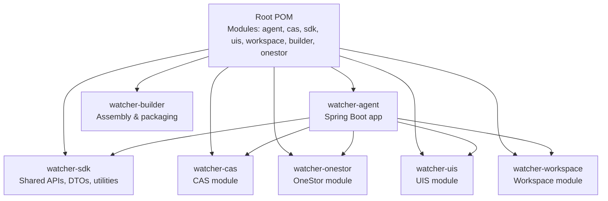
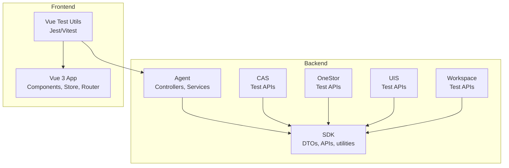
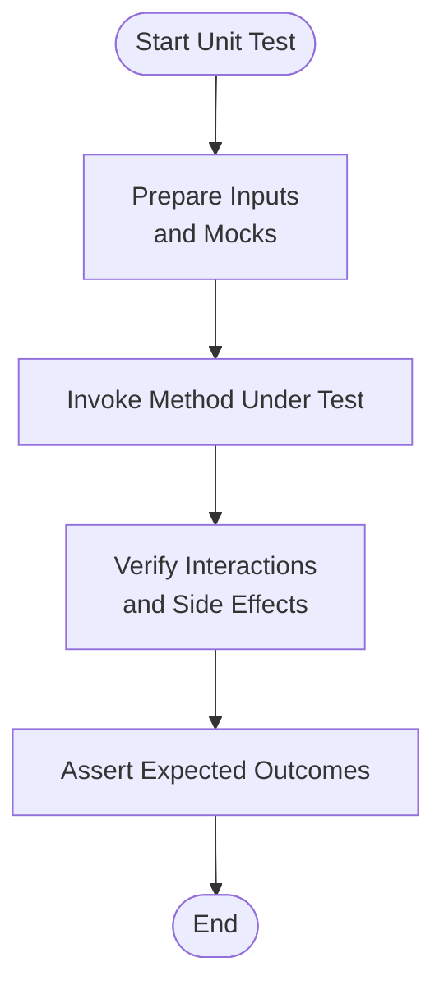
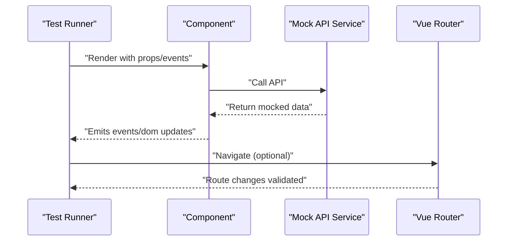
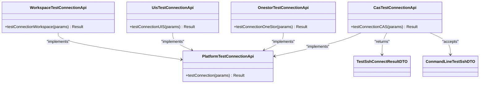
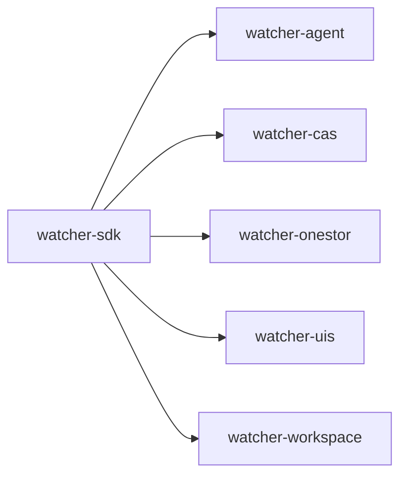

# Testing Strategy

<cite>
**Referenced Files in This Document**
- [pom.xml](file://pom.xml)
- [pipeline.groovy](file://pipeline.groovy)
- [watcher-agent/pom.xml](file://watcher-agent/pom.xml)
- [watcher-sdk/pom.xml](file://watcher-sdk/pom.xml)
- [watcher-cas/pom.xml](file://watcher-cas/pom.xml)
- [watcher-web/package.json](file://watcher-web/package.json)
- [watcher-web/vite.config.ts](file://watcher-web/vite.config.ts)
- [watcher-cas/src/main/java/com/virtual/cloud/om/cas/service/CasTestConnectionApi.java](file://watcher-cas/src/main/java/com/virtual/cloud/om/cas/service/CasTestConnectionApi.java)
- [watcher-onestor/src/main/java/com/virtual/cloud/om/onestor/service/OnestorTestConnectionApi.java](file://watcher-onestor/src/main/java/com/virtual/cloud/om/onestor/service/OnestorTestConnectionApi.java)
- [watcher-uis/src/main/java/com/virtual/cloud/om/uis/service/UisTestConnectionApi.java](file://watcher-uis/src/main/java/com/virtual/cloud/om/uis/service/UisTestConnectionApi.java)
- [watcher-workspace/src/main/java/com/virtual/cloud/om/workspace/service/WorkspaceTestConnectionApi.java](file://watcher-workspace/src/main/java/com/virtual/cloud/om/workspace/service/WorkspaceTestConnectionApi.java)
- [watcher-sdk/src/main/java/com/virtual/cloud/om/sdk/api/PlatformTestConnectionApi.java](file://watcher-sdk/src/main/java/com/virtual/cloud/om/sdk/api/PlatformTestConnectionApi.java)
- [watcher-agent/src/main/java/com/virtual/cloud/om/agent/dto/TestSshConnectResultDTO.java](file://watcher-agent/src/main/java/com/virtual/cloud/om/agent/dto/TestSshConnectResultDTO.java)
- [watcher-agent/src/main/java/com/virtual/cloud/om/agent/dto/ConmandLineTestSshDTO.java](file://watcher-agent/src/main/java/com/virtual/cloud/om/agent/dto/ConmandLineTestSshDTO.java)
- [watcher-agent/src/main/java/com/virtual/cloud/om/agent/service/onestor/HostBasicTest.java](file://watcher-agent/src/main/java/com/virtual/cloud/om/agent/service/onestor/HostBasicTest.java)
</cite>

## Table of Contents
1. [Introduction](#introduction)
2. [Project Structure](#project-structure)
3. [Core Components](#core-components)
4. [Architecture Overview](#architecture-overview)
5. [Detailed Component Analysis](#detailed-component-analysis)
6. [Dependency Analysis](#dependency-analysis)
7. [Performance Considerations](#performance-considerations)
8. [Troubleshooting Guide](#troubleshooting-guide)
9. [Conclusion](#conclusion)
10. [Appendices](#appendices)

## Introduction
This document defines a comprehensive testing strategy for the ShowTime monitoring platform. It covers backend unit testing with JUnit and Mockito, frontend component and integration testing with Vue Test Utils, platform-specific testing for CAS, OneStor, UIS, and Workspace modules, API testing strategies, database testing with Testcontainers, and end-to-end testing workflows. It also outlines continuous integration via the Jenkins pipeline, coverage expectations, and quality assurance processes, with references to concrete implementation patterns and debugging techniques.

## Project Structure
The platform is a multi-module Maven project with a frontend built on Vue 3 and Vite. Modules include the agent, SDK, CAS, OneStor, UIS, Workspace, and builder. The CI pipeline packages and stages artifacts for backend and frontend.

**Diagram sources**
- [pom.xml:11-20](file://pom.xml#L11-L20)
- [watcher-agent/pom.xml:24-50](file://watcher-agent/pom.xml#L24-L50)

**Section sources**
- [pom.xml:11-20](file://pom.xml#L11-L20)
- [pipeline.groovy:1-33](file://pipeline.groovy#L1-L33)

## Core Components
- Backend unit testing: Use JUnit 5 and Mockito to isolate services and repositories. Favor constructor injection and interface-based mocks to decouple tests from implementation details.
- Frontend component testing: Use Vue Test Utils with Jest or Vitest to test Vue 3 components in isolation, stubbing API services and Vuex stores.
- Platform-specific testing: Implement targeted connection tests per module using dedicated test APIs and DTOs.
- API testing: Complement unit tests with contract-style API tests against real endpoints or controlled test servers.
- Database testing: Use Testcontainers to spin up lightweight databases for integration tests; configure Flyway/Hibernate for schema initialization.
- E2E testing: Use Playwright or Cypress to automate browser-driven workflows across the Vue frontend and backend APIs.
- CI/CD: The Jenkins pipeline stages artifact packaging for backend and frontend; extend it with automated test execution and coverage reporting.

**Section sources**
- [watcher-sdk/pom.xml:132-154](file://watcher-sdk/pom.xml#L132-L154)
- [watcher-agent/pom.xml:102-103](file://watcher-agent/pom.xml#L102-L103)
- [watcher-web/package.json:55-70](file://watcher-web/package.json#L55-L70)

## Architecture Overview
The testing architecture aligns with the modular Maven design. Each module’s tests run independently, while shared SDK utilities support cross-module testing.

**Diagram sources**
- [pom.xml:11-20](file://pom.xml#L11-L20)
- [watcher-sdk/pom.xml:24-48](file://watcher-sdk/pom.xml#L24-L48)
- [watcher-agent/pom.xml:24-50](file://watcher-agent/pom.xml#L24-L50)

## Detailed Component Analysis

### Backend Unit Testing with JUnit and Mockito
- Test scope: Controllers, Services, Repositories, and utility classes.
- Mocking strategy:
  - Mock repositories and external clients (HTTP/SFTP/SSH) with Mockito.
  - Use @Mock/@InjectMocks for services; use @Spy for partial mocking when needed.
  - Prefer constructor injection to enable easy test-time dependency substitution.
- Test case organization:
  - Group by feature area (e.g., auth, metrics, logs).
  - Separate happy-path, boundary, and failure tests.
  - Use parameterized tests for repetitive scenarios.
- Assertions: Combine Hamcrest matchers with JUnit assertions for expressive checks.

**Section sources**
- [watcher-sdk/pom.xml:132-154](file://watcher-sdk/pom.xml#L132-L154)
- [watcher-agent/pom.xml:102-103](file://watcher-agent/pom.xml#L102-L103)

### Frontend Testing with Vue Test Utils
- Component testing:
  - Render components in isolation with Vue Test Utils.
  - Stub axios-based API services and Vuex modules.
  - Simulate user interactions (clicks, input changes) and assert DOM updates.
- Integration testing:
  - Mount pages and simulate navigation via Vue Router.
  - Use mock servers to validate API requests and response handling.
- Configuration:
  - Leverage Vite aliases and dev server proxy for realistic network behavior.

**Section sources**
- [watcher-web/package.json:55-70](file://watcher-web/package.json#L55-L70)
- [watcher-web/vite.config.ts:23-34](file://watcher-web/vite.config.ts#L23-L34)

### Platform-Specific Testing: CAS, OneStor, UIS, Workspace
- Shared test entrypoints:
  - PlatformTestConnectionApi in SDK provides a unified contract for connectivity verification across platforms.
  - Module-specific APIs (CasTestConnectionApi, OnestorTestConnectionApi, UisTestConnectionApi, WorkspaceTestConnectionApi) encapsulate platform-specific logic.
- Test patterns:
  - Validate credentials and endpoint reachability.
  - Verify response shape and error handling for invalid inputs.
  - Use DTOs like TestSshConnectResultDTO and ConmandLineTestSshDTO to model test inputs and outcomes.
  - For OneStor, leverage HostBasicTest to validate host-level collectors during tests.

**Diagram sources**
- [watcher-sdk/src/main/java/com/virtual/cloud/om/sdk/api/PlatformTestConnectionApi.java](file://watcher-sdk/src/main/java/com/virtual/cloud/om/sdk/api/PlatformTestConnectionApi.java)
- [watcher-cas/src/main/java/com/virtual/cloud/om/cas/service/CasTestConnectionApi.java](file://watcher-cas/src/main/java/com/virtual/cloud/om/cas/service/CasTestConnectionApi.java)
- [watcher-onestor/src/main/java/com/virtual/cloud/om/onestor/service/OnestorTestConnectionApi.java](file://watcher-onestor/src/main/java/com/virtual/cloud/om/onestor/service/OnestorTestConnectionApi.java)
- [watcher-uis/src/main/java/com/virtual/cloud/om/uis/service/UisTestConnectionApi.java](file://watcher-uis/src/main/java/com/virtual/cloud/om/uis/service/UisTestConnectionApi.java)
- [watcher-workspace/src/main/java/com/virtual/cloud/om/workspace/service/WorkspaceTestConnectionApi.java](file://watcher-workspace/src/main/java/com/virtual/cloud/om/workspace/service/WorkspaceTestConnectionApi.java)
- [watcher-agent/src/main/java/com/virtual/cloud/om/agent/dto/TestSshConnectResultDTO.java](file://watcher-agent/src/main/java/com/virtual/cloud/om/agent/dto/TestSshConnectResultDTO.java)
- [watcher-agent/src/main/java/com/virtual/cloud/om/agent/dto/ConmandLineTestSshDTO.java](file://watcher-agent/src/main/java/com/virtual/cloud/om/agent/dto/ConmandLineTestSshDTO.java)

**Section sources**
- [watcher-sdk/pom.xml:24-48](file://watcher-sdk/pom.xml#L24-L48)
- [watcher-cas/pom.xml:24-26](file://watcher-cas/pom.xml#L24-L26)
- [watcher-agent/src/main/java/com/virtual/cloud/om/agent/dto/TestSshConnectResultDTO.java](file://watcher-agent/src/main/java/com/virtual/cloud/om/agent/dto/TestSshConnectResultDTO.java)
- [watcher-agent/src/main/java/com/virtual/cloud/om/agent/dto/ConmandLineTestSshDTO.java](file://watcher-agent/src/main/java/com/virtual/cloud/om/agent/dto/ConmandLineTestSshDTO.java)
- [watcher-agent/src/main/java/com/virtual/cloud/om/agent/service/onestor/HostBasicTest.java](file://watcher-agent/src/main/java/com/virtual/cloud/om/agent/service/onestor/HostBasicTest.java)

### API Testing Strategies
- Contract-first testing: Define expected request/response shapes and validate adherence.
- Endpoint coverage: Include CRUD operations, error codes, and rate-limiting behavior.
- Authentication and authorization: Test JWT handling, permissions, and forbidden access.
- Idempotency: Validate idempotent endpoints behave consistently under retries.

[No sources needed since this section provides general guidance]

### Database Testing with Testcontainers
- Spin up a lightweight database container (MySQL/MariaDB) for integration tests.
- Initialize schema via Flyway or MyBatis migrations.
- Use transaction rollback or truncate tables after each test to maintain isolation.
- Configure datasource in test profiles and ensure deterministic seed data.

[No sources needed since this section provides general guidance]

### End-to-End Testing Workflows
- Browser automation: Use Playwright or Cypress to simulate real user journeys.
- Cross-module flows: Validate data movement from agent collection to UI dashboards.
- Network conditions: Emulate latency and failures to test resilience.
- Accessibility and responsiveness: Validate rendering across devices and locales.

[No sources needed since this section provides general guidance]

## Dependency Analysis
Module-level dependencies influence testability. The agent depends on SDK and multiple platform modules, which in turn depend on SDK. Tests should mirror this dependency graph to avoid tight coupling.

**Diagram sources**
- [watcher-agent/pom.xml:24-50](file://watcher-agent/pom.xml#L24-L50)
- [watcher-cas/pom.xml:24-26](file://watcher-cas/pom.xml#L24-L26)
- [watcher-sdk/pom.xml:67-69](file://watcher-sdk/pom.xml#L67-L69)

**Section sources**
- [pom.xml:11-20](file://pom.xml#L11-L20)
- [watcher-agent/pom.xml:24-50](file://watcher-agent/pom.xml#L24-L50)

## Performance Considerations
- Favor fast unit tests over slow integration tests; keep heavy IO out of unit tests.
- Use in-memory databases for integration tests and minimize container startup overhead.
- Parallelize independent tests; avoid shared mutable state.
- Profile test suites to identify hotspots and refactor heavy fixtures.

[No sources needed since this section provides general guidance]

## Troubleshooting Guide
- Backend debugging:
  - Use Mockito.verify to confirm interactions and detect missing mocks.
  - Add logging in test setup to capture inputs and outputs.
  - Isolate flaky tests by disabling them temporarily and focusing on reproducible failures.
- Frontend debugging:
  - Inspect rendered DOM snapshots and event emissions with Vue Test Utils.
  - Stub network calls to control error paths and timeouts.
- CI/CD:
  - Extend the Jenkins pipeline to run tests and publish coverage reports.
  - Archive artifacts for failed builds to facilitate local reproduction.

**Section sources**
- [pipeline.groovy:1-33](file://pipeline.groovy#L1-L33)

## Conclusion
A robust testing strategy for ShowTime combines disciplined unit testing across modules, focused platform-specific validations, comprehensive frontend component and integration tests, and end-to-end workflows. By leveraging Maven modules, SDK abstractions, and the existing CI pipeline, teams can achieve reliable releases with strong quality signals.

[No sources needed since this section summarizes without analyzing specific files]

## Appendices

### Continuous Integration and Coverage
- Pipeline stages:
  - Artifact packaging for backend and frontend.
  - Extend with test execution and coverage publishing.
- Coverage targets:
  - Aim for >80% line coverage and >70% branch coverage in critical modules.
- Quality gates:
  - Fail builds on test failures or coverage drops below thresholds.

**Section sources**
- [pipeline.groovy:1-33](file://pipeline.groovy#L1-L33)
- [watcher-sdk/pom.xml:132-154](file://watcher-sdk/pom.xml#L132-L154)