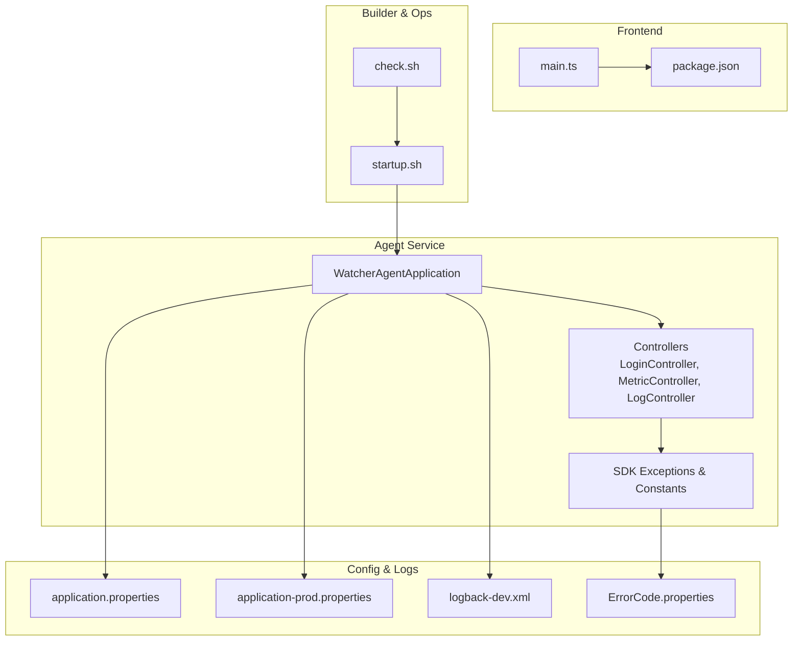
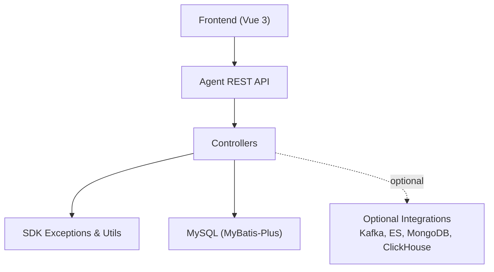
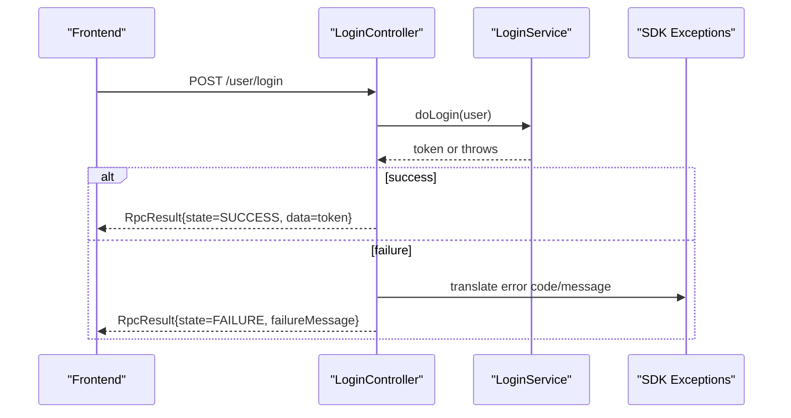
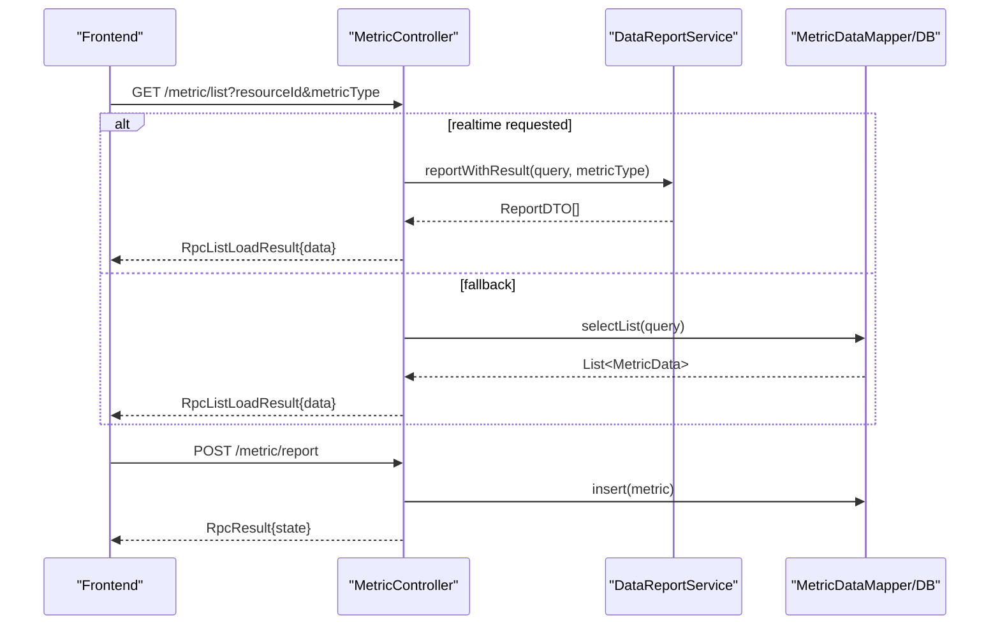
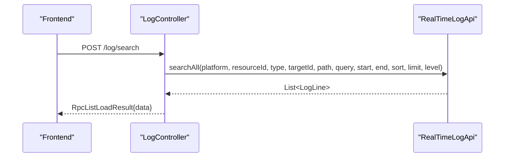
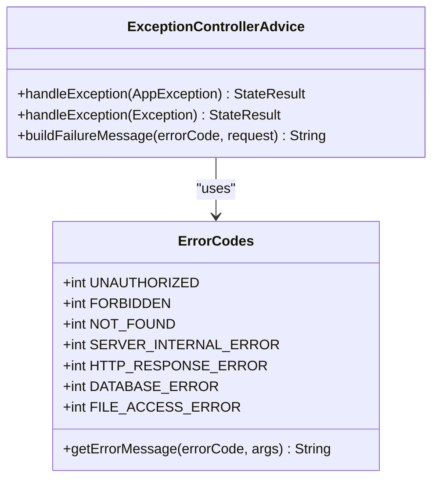
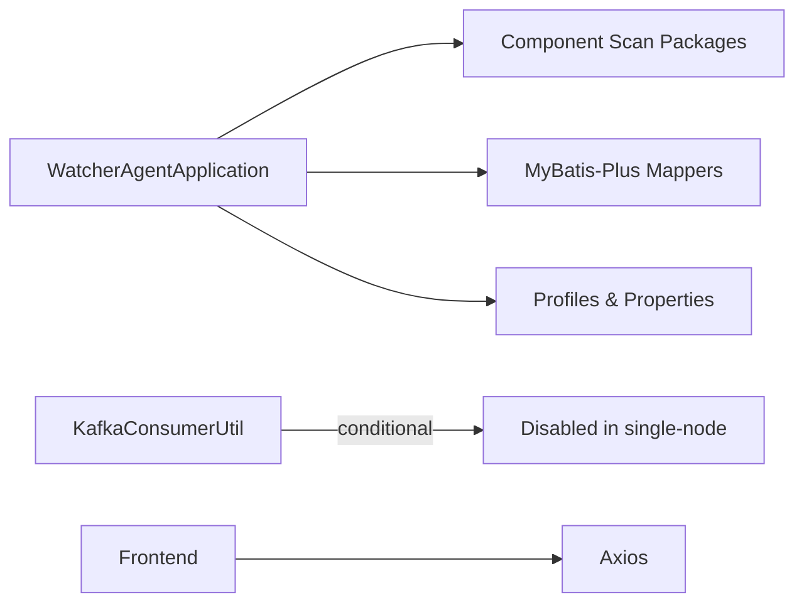

# Troubleshooting & Maintenance

<cite>
**Referenced Files in This Document**
- [application.properties](file://watcher-agent/src/main/resources/application.properties)
- [application-prod.properties](file://watcher-agent/src/main/resources/application-prod.properties)
- [logback-dev.xml](file://watcher-agent/src/main/resources/logback-dev.xml)
- [ErrorCode.properties](file://watcher-agent/src/main/resources/messages/ErrorCode.properties)
- [ErrorCodes.java](file://watcher-sdk/src/main/java/com/virtual/cloud/om/sdk/exception/ErrorCodes.java)
- [ExceptionControllerAdvice.java](file://watcher-sdk/src/main/java/com/virtual/cloud/om/sdk/exception/ExceptionControllerAdvice.java)
- [WatcherAgentApplication.java](file://watcher-agent/src/main/java/com/virtual/cloud/om/agent/WatcherAgentApplication.java)
- [startup.sh](file://watcher-builder/assembly/bin/startup.sh)
- [check.sh](file://watcher-builder/assembly/bin/check.sh)
- [LoginController.java](file://watcher-agent/src/main/java/com/virtual/cloud/om/agent/controller/LoginController.java)
- [MetricController.java](file://watcher-agent/src/main/java/com/virtual/cloud/om/agent/controller/MetricController.java)
- [LogController.java](file://watcher-agent/src/main/java/com/virtual/cloud/om/agent/controller/LogController.java)
- [main.ts](file://watcher-web/src/main.ts)
- [package.json](file://watcher-web/package.json)
- [KafkaConsumerUtil.java](file://watcher-sdk/src/main/java/com/virtual/cloud/om/sdk/utils/KafkaConsumerUtil.java)
</cite>

## Table of Contents
1. [Introduction](#introduction)
2. [Project Structure](#project-structure)
3. [Core Components](#core-components)
4. [Architecture Overview](#architecture-overview)
5. [Detailed Component Analysis](#detailed-component-analysis)
6. [Dependency Analysis](#dependency-analysis)
7. [Performance Considerations](#performance-considerations)
8. [Troubleshooting Guide](#troubleshooting-guide)
9. [Maintenance Procedures](#maintenance-procedures)
10. [Conclusion](#conclusion)
11. [Appendices](#appendices)

## Introduction
This document provides comprehensive troubleshooting and maintenance guidance for the ShowTime monitoring platform. It covers error scenarios and resolution strategies across backend services, frontend application, and platform integrations. It also details logging strategies, log analysis techniques, diagnostic procedures, performance monitoring, bottleneck identification, optimization strategies, maintenance tasks (database cleanup, log rotation, system updates), debugging tools, monitoring dashboards, alerting mechanisms, and preventive maintenance schedules.

## Project Structure
The platform consists of:
- Backend agent service exposing REST APIs for metrics, logs, deployment, and authentication.
- SDK module providing shared DTOs, exceptions, constants, and utilities.
- Frontend web application built with Vue 3 and Element Plus.
- Builder scripts for packaging, startup, and health checks.
- Optional integrations (plugins and middleware) disabled by default in single-node mode.

**Diagram sources**
- [WatcherAgentApplication.java:14-27](file://watcher-agent/src/main/java/com/virtual/cloud/om/agent/WatcherAgentApplication.java#L14-L27)
- [LoginController.java:13-92](file://watcher-agent/src/main/java/com/virtual/cloud/om/agent/controller/LoginController.java#L13-L92)
- [MetricController.java:30-271](file://watcher-agent/src/main/java/com/virtual/cloud/om/agent/controller/MetricController.java#L30-L271)
- [LogController.java:16-36](file://watcher-agent/src/main/java/com/virtual/cloud/om/agent/controller/LogController.java#L16-L36)
- [main.ts:1-37](file://watcher-web/src/main.ts#L1-L37)
- [package.json:1-72](file://watcher-web/package.json#L1-L72)
- [startup.sh:1-81](file://watcher-builder/assembly/bin/startup.sh#L1-L81)
- [check.sh:1-27](file://watcher-builder/assembly/bin/check.sh#L1-L27)
- [application.properties:1-80](file://watcher-agent/src/main/resources/application.properties#L1-L80)
- [application-prod.properties:1-70](file://watcher-agent/src/main/resources/application-prod.properties#L1-L70)
- [logback-dev.xml:1-44](file://watcher-agent/src/main/resources/logback-dev.xml#L1-L44)
- [ErrorCode.properties:1-103](file://watcher-agent/src/main/resources/messages/ErrorCode.properties#L1-L103)

**Section sources**
- [WatcherAgentApplication.java:14-27](file://watcher-agent/src/main/java/com/virtual/cloud/om/agent/WatcherAgentApplication.java#L14-L27)
- [application.properties:1-80](file://watcher-agent/src/main/resources/application.properties#L1-L80)
- [application-prod.properties:1-70](file://watcher-agent/src/main/resources/application-prod.properties#L1-L70)
- [logback-dev.xml:1-44](file://watcher-agent/src/main/resources/logback-dev.xml#L1-L44)
- [ErrorCode.properties:1-103](file://watcher-agent/src/main/resources/messages/ErrorCode.properties#L1-L103)
- [main.ts:1-37](file://watcher-web/src/main.ts#L1-L37)
- [package.json:1-72](file://watcher-web/package.json#L1-L72)
- [startup.sh:1-81](file://watcher-builder/assembly/bin/startup.sh#L1-L81)
- [check.sh:1-27](file://watcher-builder/assembly/bin/check.sh#L1-L27)

## Core Components
- Agent REST Controllers: expose endpoints for login, metrics retrieval/reporting, and log search.
- SDK Exception Layer: centralized error code definitions and global exception handling.
- Logging: structured rolling logs with correlation IDs and console output.
- Configuration: environment-specific profiles and optional integrations toggled via flags.
- Frontend: Vue 3 application bootstrapped with routing, i18n, and Element Plus.

Key responsibilities:
- Authentication and user management endpoints.
- Metrics ingestion and querying with fallback to database.
- Real-time log search via integrated services.
- Global error translation and standardized responses.

**Section sources**
- [LoginController.java:13-92](file://watcher-agent/src/main/java/com/virtual/cloud/om/agent/controller/LoginController.java#L13-L92)
- [MetricController.java:30-271](file://watcher-agent/src/main/java/com/virtual/cloud/om/agent/controller/MetricController.java#L30-L271)
- [LogController.java:16-36](file://watcher-agent/src/main/java/com/virtual/cloud/om/agent/controller/LogController.java#L16-L36)
- [ErrorCodes.java:10-190](file://watcher-sdk/src/main/java/com/virtual/cloud/om/sdk/exception/ErrorCodes.java#L10-L190)
- [ExceptionControllerAdvice.java:25-96](file://watcher-sdk/src/main/java/com/virtual/cloud/om/sdk/exception/ExceptionControllerAdvice.java#L25-L96)
- [logback-dev.xml:1-44](file://watcher-agent/src/main/resources/logback-dev.xml#L1-L44)

## Architecture Overview
The system follows a layered architecture:
- Presentation: Vue 3 frontend interacts with backend REST APIs.
- Application: Spring Boot agent exposes controllers and integrates with SDK utilities.
- Persistence: MyBatis-Plus mapper layer for metric data and resource metadata.
- Integrations: Optional middleware and plugin clients disabled by default in single-node mode.

**Diagram sources**
- [main.ts:1-37](file://watcher-web/src/main.ts#L1-L37)
- [WatcherAgentApplication.java:14-27](file://watcher-agent/src/main/java/com/virtual/cloud/om/agent/WatcherAgentApplication.java#L14-L27)
- [MetricController.java:30-271](file://watcher-agent/src/main/java/com/virtual/cloud/om/agent/controller/MetricController.java#L30-L271)
- [application.properties:46-71](file://watcher-agent/src/main/resources/application.properties#L46-L71)
- [application-prod.properties:3-70](file://watcher-agent/src/main/resources/application-prod.properties#L3-L70)

## Detailed Component Analysis

### Authentication Flow

**Diagram sources**
- [LoginController.java:25-44](file://watcher-agent/src/main/java/com/virtual/cloud/om/agent/controller/LoginController.java#L25-L44)
- [ErrorCodes.java:77-120](file://watcher-sdk/src/main/java/com/virtual/cloud/om/sdk/exception/ErrorCodes.java#L77-L120)
- [ExceptionControllerAdvice.java:44-48](file://watcher-sdk/src/main/java/com/virtual/cloud/om/sdk/exception/ExceptionControllerAdvice.java#L44-L48)

**Section sources**
- [LoginController.java:13-92](file://watcher-agent/src/main/java/com/virtual/cloud/om/agent/controller/LoginController.java#L13-L92)
- [ErrorCodes.java:77-120](file://watcher-sdk/src/main/java/com/virtual/cloud/om/sdk/exception/ErrorCodes.java#L77-L120)
- [ExceptionControllerAdvice.java:25-96](file://watcher-sdk/src/main/java/com/virtual/cloud/om/sdk/exception/ExceptionControllerAdvice.java#L25-L96)

### Metrics Retrieval and Reporting

**Diagram sources**
- [MetricController.java:77-161](file://watcher-agent/src/main/java/com/virtual/cloud/om/agent/controller/MetricController.java#L77-L161)
- [MetricController.java:216-238](file://watcher-agent/src/main/java/com/virtual/cloud/om/agent/controller/MetricController.java#L216-L238)

**Section sources**
- [MetricController.java:30-271](file://watcher-agent/src/main/java/com/virtual/cloud/om/agent/controller/MetricController.java#L30-L271)

### Log Search Endpoint

**Diagram sources**
- [LogController.java:27-34](file://watcher-agent/src/main/java/com/virtual/cloud/om/agent/controller/LogController.java#L27-L34)

**Section sources**
- [LogController.java:16-36](file://watcher-agent/src/main/java/com/virtual/cloud/om/agent/controller/LogController.java#L16-L36)

### Error Codes and Translation

**Diagram sources**
- [ErrorCodes.java:10-190](file://watcher-sdk/src/main/java/com/virtual/cloud/om/sdk/exception/ErrorCodes.java#L10-L190)
- [ExceptionControllerAdvice.java:25-96](file://watcher-sdk/src/main/java/com/virtual/cloud/om/sdk/exception/ExceptionControllerAdvice.java#L25-L96)

**Section sources**
- [ErrorCodes.java:10-190](file://watcher-sdk/src/main/java/com/virtual/cloud/om/sdk/exception/ErrorCodes.java#L10-L190)
- [ErrorCode.properties:1-103](file://watcher-agent/src/main/resources/messages/ErrorCode.properties#L1-L103)
- [ExceptionControllerAdvice.java:25-96](file://watcher-sdk/src/main/java/com/virtual/cloud/om/sdk/exception/ExceptionControllerAdvice.java#L25-L96)

## Dependency Analysis
- Agent application scans packages for components and mappers, enabling scheduling and disabling Quartz by default.
- Optional integrations are controlled by flags and environment variables; Kafka consumers are conditionally enabled.
- Frontend depends on Vue 3 ecosystem and Axios for HTTP requests.

**Diagram sources**
- [WatcherAgentApplication.java:14-27](file://watcher-agent/src/main/java/com/virtual/cloud/om/agent/WatcherAgentApplication.java#L14-L27)
- [application.properties:14-29](file://watcher-agent/src/main/resources/application.properties#L14-L29)
- [application-prod.properties:3-70](file://watcher-agent/src/main/resources/application-prod.properties#L3-L70)
- [KafkaConsumerUtil.java:3-14](file://watcher-sdk/src/main/java/com/virtual/cloud/om/sdk/utils/KafkaConsumerUtil.java#L3-L14)
- [main.ts:1-37](file://watcher-web/src/main.ts#L1-L37)

**Section sources**
- [WatcherAgentApplication.java:14-27](file://watcher-agent/src/main/java/com/virtual/cloud/om/agent/WatcherAgentApplication.java#L14-L27)
- [application.properties:14-29](file://watcher-agent/src/main/resources/application.properties#L14-L29)
- [application-prod.properties:3-70](file://watcher-agent/src/main/resources/application-prod.properties#L3-L70)
- [KafkaConsumerUtil.java:3-14](file://watcher-sdk/src/main/java/com/virtual/cloud/om/sdk/utils/KafkaConsumerUtil.java#L3-L14)
- [main.ts:1-37](file://watcher-web/src/main.ts#L1-L37)

## Performance Considerations
- JVM tuning and GC logging are configured in the startup script for heap sizing and GC rotation.
- Rolling log policy limits file sizes and total archive size to manage disk usage.
- Optional middleware and plugin clients are disabled by default to reduce overhead in single-node deployments.

Recommendations:
- Monitor GC logs and heap dumps for memory pressure.
- Adjust JVM memory parameters based on workload.
- Enable middleware only when required; disable unused integrations.
- Use pagination and time-range filters for metrics queries to avoid large result sets.

**Section sources**
- [startup.sh:60-72](file://watcher-builder/assembly/bin/startup.sh#L60-L72)
- [logback-dev.xml:17-25](file://watcher-agent/src/main/resources/logback-dev.xml#L17-L25)
- [application.properties:14-29](file://watcher-agent/src/main/resources/application.properties#L14-L29)

## Troubleshooting Guide

### Authentication Failures
Symptoms:
- Login returns failure with localized message.
- Unauthorized or forbidden responses.

Common causes and resolutions:
- Incorrect credentials or empty fields.
  - Verify username/password and ensure they are not null or blank.
- Token-related errors or expired sessions.
  - Regenerate tokens and re-authenticate.
- Insufficient permissions for requested resources.
  - Confirm user role and tenant access.

Diagnostic steps:
- Review agent logs around login endpoints for stack traces.
- Translate error codes using the error message bundle.
- Validate SDK exception handling responses.

**Section sources**
- [LoginController.java:25-44](file://watcher-agent/src/main/java/com/virtual/cloud/om/agent/controller/LoginController.java#L25-L44)
- [ErrorCodes.java:77-120](file://watcher-sdk/src/main/java/com/virtual/cloud/om/sdk/exception/ErrorCodes.java#L77-L120)
- [ExceptionControllerAdvice.java:44-48](file://watcher-sdk/src/main/java/com/virtual/cloud/om/sdk/exception/ExceptionControllerAdvice.java#L44-L48)

### Data Collection Problems
Symptoms:
- Empty metric lists or missing latest metrics.
- Errors during metrics reporting.

Common causes and resolutions:
- Missing or invalid resource ID.
  - Ensure resource exists and is correctly referenced.
- Database connectivity or mapper issues.
  - Check datasource configuration and connection timeouts.
- Real-time report service failures.
  - Validate integration endpoints and network reachability.

Diagnostic steps:
- Use metrics list endpoint with filters to isolate issues.
- Inspect database queries and mapper logs.
- Confirm integration client URLs and ports.

**Section sources**
- [MetricController.java:77-161](file://watcher-agent/src/main/java/com/virtual/cloud/om/agent/controller/MetricController.java#L77-L161)
- [MetricController.java:163-214](file://watcher-agent/src/main/java/com/virtual/cloud/om/agent/controller/MetricController.java#L163-L214)
- [MetricController.java:216-238](file://watcher-agent/src/main/java/com/virtual/cloud/om/agent/controller/MetricController.java#L216-L238)
- [application.properties:46-58](file://watcher-agent/src/main/resources/application.properties#L46-L58)

### UI Rendering Issues
Symptoms:
- Blank pages, missing assets, or runtime errors.

Common causes and resolutions:
- Incorrect build mode or missing dependencies.
  - Ensure production build is used in non-development environments.
- Missing i18n or theme resources.
  - Verify locale bundles and theme files are present.
- Routing or permission issues preventing route resolution.
  - Confirm permission routes initialization.

Diagnostic steps:
- Check browser console for JavaScript errors.
- Validate asset loading and network requests.
- Review frontend bootstrapping and plugin registration.

**Section sources**
- [main.ts:1-37](file://watcher-web/src/main.ts#L1-L37)
- [package.json:1-72](file://watcher-web/package.json#L1-L72)

### Service Health and Startup
Symptoms:
- Agent not running or intermittent failures.

Common causes and resolutions:
- Java version mismatch or missing JDK.
  - Ensure Java 1.8+ is installed and detected.
- Process flag not recognized.
  - Confirm process flag presence and startup script invocation.
- Health check detects service down.
  - Restart agent via startup script if needed.

Diagnostic steps:
- Use health check script to verify service status.
- Review startup logs and error.out redirection.
- Validate environment variables and profile activation.

**Section sources**
- [startup.sh:1-81](file://watcher-builder/assembly/bin/startup.sh#L1-L81)
- [check.sh:1-27](file://watcher-builder/assembly/bin/check.sh#L1-L27)

## Maintenance Procedures

### Database Cleanup
- Archive or purge old metric data using time-based queries and batch deletion.
- Monitor table sizes and set retention policies aligned with compliance needs.
- Back up before large-scale deletions.

### Log Rotation and Management
- Rolling policy rotates logs by size and time with capped total archive size.
- Ensure sufficient disk space for log partitions.
- Compress rotated logs to save space.

**Section sources**
- [logback-dev.xml:17-25](file://watcher-agent/src/main/resources/logback-dev.xml#L17-L25)

### System Updates
- Apply updates in non-production environments first.
- Validate Java and Node versions meet minimum requirements.
- Restart services after configuration changes.

**Section sources**
- [startup.sh:15-25](file://watcher-builder/assembly/bin/startup.sh#L15-L25)
- [package.json:17-19](file://watcher-web/package.json#L17-L19)

### Preventive Maintenance Schedule
- Daily: health checks, log rotation verification, and basic connectivity tests.
- Weekly: metrics retention cleanup, database index checks, and backup verification.
- Monthly: full system audit, dependency updates, and performance profiling.

## Conclusion
This guide consolidates troubleshooting and maintenance practices for the ShowTime monitoring platform. By leveraging structured logging, centralized error codes, and robust controllers, operators can quickly diagnose and resolve issues across backend services, frontend application, and platform integrations. Adhering to the recommended maintenance procedures ensures system reliability, performance, and long-term operability.

## Appendices

### Logging Strategies and Analysis
- Correlation IDs and remote address are embedded in log entries for traceability.
- Console and file appenders are both enabled for development; adjust levels per environment.
- Use log rotation to prevent disk exhaustion and enable compression for archival.

**Section sources**
- [logback-dev.xml:8-40](file://watcher-agent/src/main/resources/logback-dev.xml#L8-L40)

### Monitoring Dashboards and Alerting
- Expose management endpoints for health and metrics.
- Integrate with external monitoring systems using health check scripts.
- Alert on service downtime, excessive errors, and slow response times.

**Section sources**
- [application.properties:10-11](file://watcher-agent/src/main/resources/application.properties#L10-L11)
- [check.sh:1-27](file://watcher-builder/assembly/bin/check.sh#L1-L27)

### Debugging Tools
- JVM GC logs and heap dumps for memory diagnostics.
- Frontend developer tools for network and console inspection.
- Centralized error translation via message bundles for consistent user feedback.

**Section sources**
- [startup.sh:60-72](file://watcher-builder/assembly/bin/startup.sh#L60-L72)
- [main.ts:1-37](file://watcher-web/src/main.ts#L1-L37)
- [ErrorCode.properties:1-103](file://watcher-agent/src/main/resources/messages/ErrorCode.properties#L1-L103)