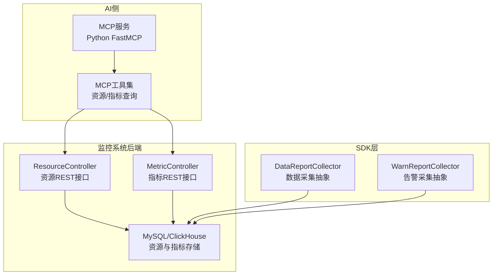
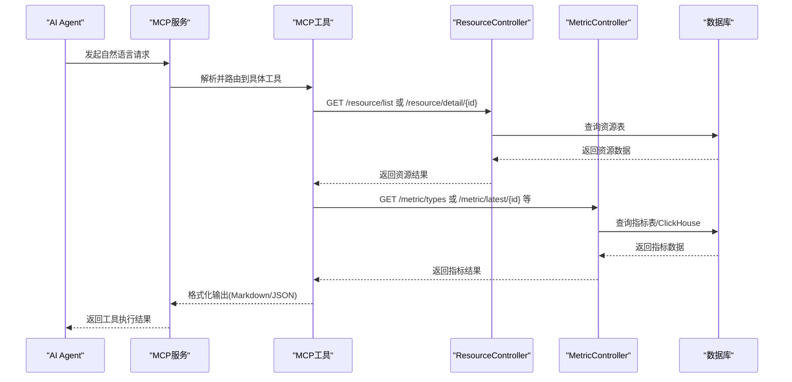
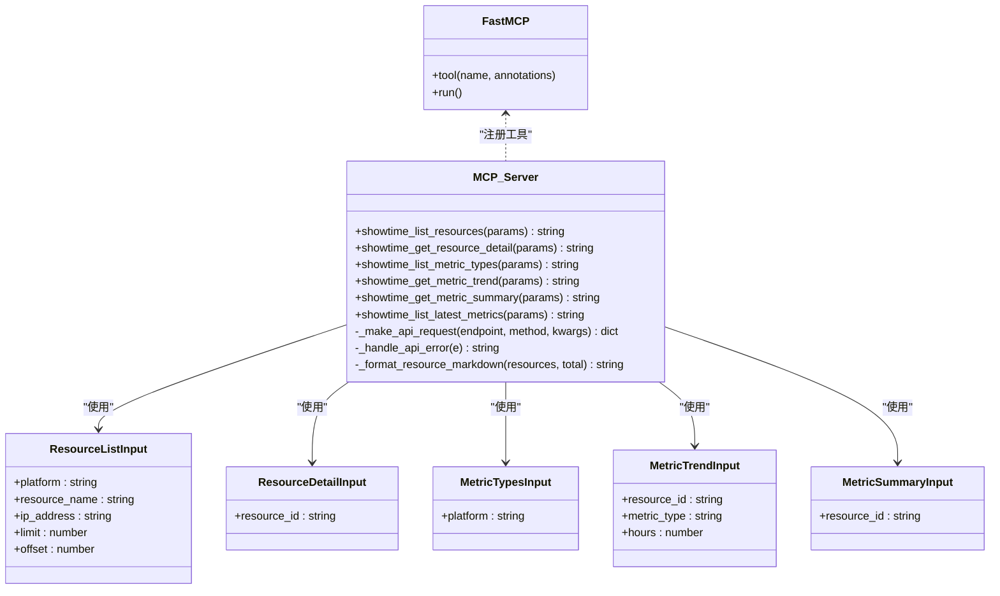
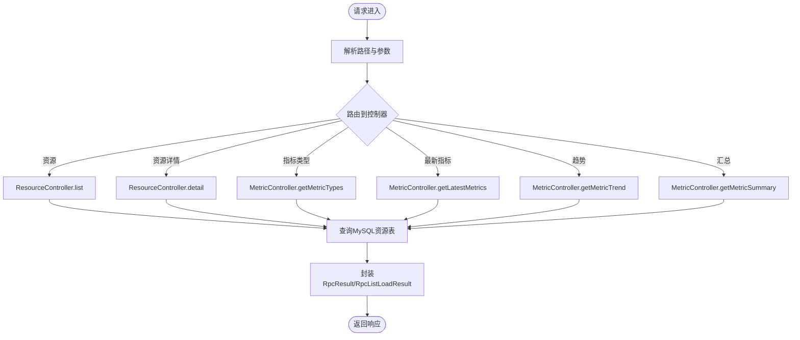
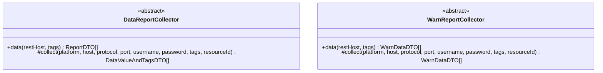
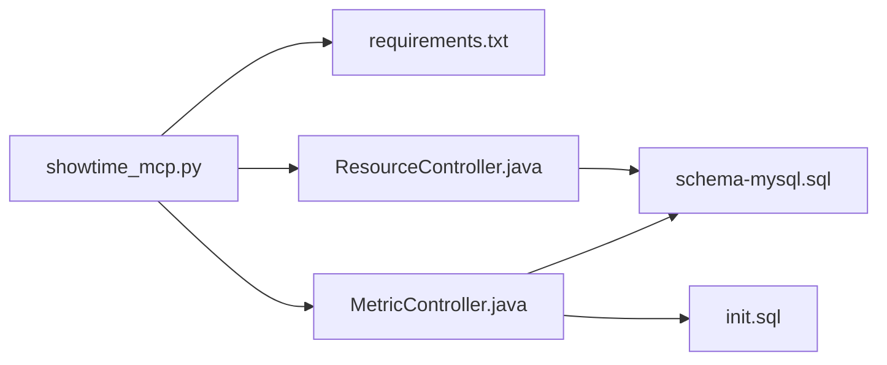

# AI智能监控

<cite>
**本文引用的文件**
- [README.md](file://watcher-ai/README.md)
- [showtime_mcp.py](file://watcher-ai/src/showtime_mcp.py)
- [requirements.txt](file://watcher-ai/requirements.txt)
- [schema-mysql.sql](file://watcher-agent/src/main/resources/schema-mysql.sql)
- [init.sql](file://watcher-agent/src/main/resources/database/init.sql)
- [MetricController.java](file://watcher-agent/src/main/java/com/virtual/cloud/om/agent/controller/MetricController.java)
- [ResourceController.java](file://watcher-agent/src/main/java/com/virtual/cloud/om/agent/controller/ResourceController.java)
- [DataReportCollector.java](file://watcher-sdk/src/main/java/com/virtual/cloud/om/sdk/api/DataReportCollector.java)
- [WarnReportCollector.java](file://watcher-sdk/src/main/java/com/virtual/cloud/om/sdk/api/WarnReportCollector.java)
- [ShowTime_Sprint1_开发计划_63935fbd.md](file://.codebuddy/plans/ShowTime_Sprint1_开发计划_63935fbd.md)
</cite>

## 目录
1. [简介](#简介)
2. [项目结构](#项目结构)
3. [核心组件](#核心组件)
4. [架构总览](#架构总览)
5. [详细组件分析](#详细组件分析)
6. [依赖分析](#依赖分析)
7. [性能考量](#性能考量)
8. [故障排查指南](#故障排查指南)
9. [结论](#结论)
10. [附录](#附录)

## 简介
本技术文档面向ShowTime监控系统的AI智能监控能力，聚焦于MCP（Model Context Protocol）服务架构与AI Agent集成方案。文档从系统架构、组件职责、数据流与处理逻辑入手，详细阐述Python FastMCP框架下的AI服务实现方式，包括模型上下文管理、对话状态跟踪、自然语言接口设计与工具定义规范；并给出AI技能开发指南、部署配置、性能优化与故障排查方法。通过与监控系统后端REST API的对接，AI Agent可完成资源查询、指标趋势分析、最新指标获取、指标汇总统计等核心功能，并为智能故障诊断、趋势预测、异常检测等高级分析奠定基础。

## 项目结构
- watcher-ai：AI MCP服务实现，提供一组面向监控系统的工具函数，封装对后端REST API的调用。
- watcher-agent：监控系统后端，提供资源与指标的REST接口，支撑MCP工具调用。
- watcher-sdk：采集与告警抽象层，定义数据上报与告警采集的通用策略。
- .codebuddy：AI技能与开发计划相关文档，指导MCP工具开发与Agent扩展。

**图示来源**
- [showtime_mcp.py:184-553](file://watcher-ai/src/showtime_mcp.py#L184-L553)
- [ResourceController.java:34-65](file://watcher-agent/src/main/java/com/virtual/cloud/om/agent/controller/ResourceController.java#L34-L65)
- [MetricController.java:29-101](file://watcher-agent/src/main/java/com/virtual/cloud/om/agent/controller/MetricController.java#L29-L101)
- [schema-mysql.sql:153-204](file://watcher-agent/src/main/resources/schema-mysql.sql#L153-L204)
- [init.sql:1-12](file://watcher-agent/src/main/resources/database/init.sql#L1-L12)

**章节来源**
- [README.md:1-72](file://watcher-ai/README.md#L1-L72)
- [showtime_mcp.py:1-557](file://watcher-ai/src/showtime_mcp.py#L1-L557)
- [ResourceController.java:1-235](file://watcher-agent/src/main/java/com/virtual/cloud/om/agent/controller/ResourceController.java#L1-L235)
- [MetricController.java:1-103](file://watcher-agent/src/main/java/com/virtual/cloud/om/agent/controller/MetricController.java#L1-L103)
- [schema-mysql.sql:1-204](file://watcher-agent/src/main/resources/schema-mysql.sql#L1-L204)
- [init.sql:1-12](file://watcher-agent/src/main/resources/database/init.sql#L1-L12)

## 核心组件
- MCP服务与工具集
  - 使用Python FastMCP初始化服务实例，定义6个MCP工具：列出资源、获取资源详情、列出指标类型、获取指标趋势、获取指标汇总、获取最新指标。
  - 工具输入采用Pydantic模型进行参数校验与序列化，输出支持Markdown表格与JSON格式。
- 监控系统后端REST接口
  - ResourceController提供资源列表与详情查询接口，支持按平台、名称、IP过滤与分页。
  - MetricController提供指标类型、最新指标、趋势数据、汇总统计等接口。
- 数据与告警采集抽象
  - DataReportCollector与WarnReportCollector定义了采集策略与数据结构抽象，便于扩展不同平台的采集实现。
- 存储层
  - MySQL资源表与指标表，ClickHouse聚合表用于高效查询与可视化。

**章节来源**
- [showtime_mcp.py:18-557](file://watcher-ai/src/showtime_mcp.py#L18-L557)
- [ResourceController.java:34-65](file://watcher-agent/src/main/java/com/virtual/cloud/om/agent/controller/ResourceController.java#L34-L65)
- [MetricController.java:29-101](file://watcher-agent/src/main/java/com/virtual/cloud/om/agent/controller/MetricController.java#L29-L101)
- [DataReportCollector.java:1-118](file://watcher-sdk/src/main/java/com/virtual/cloud/om/sdk/api/DataReportCollector.java#L1-L118)
- [WarnReportCollector.java:1-80](file://watcher-sdk/src/main/java/com/virtual/cloud/om/sdk/api/WarnReportCollector.java#L1-L80)
- [schema-mysql.sql:153-204](file://watcher-agent/src/main/resources/schema-mysql.sql#L153-L204)
- [init.sql:1-12](file://watcher-agent/src/main/resources/database/init.sql#L1-L12)

## 架构总览
下图展示了AI Agent通过MCP工具访问监控系统后端REST接口的总体流程，强调模型上下文、工具调用与后端响应之间的关系。

**图示来源**
- [showtime_mcp.py:184-553](file://watcher-ai/src/showtime_mcp.py#L184-L553)
- [ResourceController.java:34-65](file://watcher-agent/src/main/java/com/virtual/cloud/om/agent/controller/ResourceController.java#L34-L65)
- [MetricController.java:29-101](file://watcher-agent/src/main/java/com/virtual/cloud/om/agent/controller/MetricController.java#L29-L101)

## 详细组件分析

### MCP服务与工具定义
- 服务初始化与配置
  - 使用FastMCP创建服务实例，读取环境变量SHOWTIME_API_URL与SHOWTIME_API_TOKEN作为后端API地址与鉴权令牌。
- 工具输入模型
  - 资源列表：支持平台、名称、IP过滤，分页参数限制。
  - 资源详情：按资源ID查询。
  - 指标类型：支持按平台过滤。
  - 指标趋势：指定资源ID、指标类型与小时窗口。
  - 指标汇总：按资源ID获取汇总统计。
  - 最新指标：按资源ID获取各指标最新值。
- 工具实现要点
  - 统一的HTTP客户端封装与错误处理，覆盖超时、连接失败、鉴权失败、限流等场景。
  - 输出格式化：资源列表返回Markdown表格，其余工具返回JSON字符串。
  - 注解标注工具属性（只读、幂等、世界可见性等），便于Agent正确推理与调用。

**图示来源**
- [showtime_mcp.py:18-557](file://watcher-ai/src/showtime_mcp.py#L18-L557)

**章节来源**
- [showtime_mcp.py:18-557](file://watcher-ai/src/showtime_mcp.py#L18-L557)

### 监控系统后端REST接口
- 资源接口
  - 列表：支持按平台、名称、IP过滤与分页。
  - 详情：按ID查询资源完整信息。
- 指标接口
  - 类型：查询可用指标清单，支持按平台过滤。
  - 最新：按资源ID查询各指标最新值。
  - 趋势：按资源ID与指标类型查询历史趋势，支持小时窗口。
  - 汇总：按资源ID查询指标汇总统计。
- 存储
  - 资源表与指标表位于MySQL，ClickHouse聚合表用于高性能查询与可视化。

**图示来源**
- [ResourceController.java:34-65](file://watcher-agent/src/main/java/com/virtual/cloud/om/agent/controller/ResourceController.java#L34-L65)
- [MetricController.java:29-101](file://watcher-agent/src/main/java/com/virtual/cloud/om/agent/controller/MetricController.java#L29-L101)
- [schema-mysql.sql:153-204](file://watcher-agent/src/main/resources/schema-mysql.sql#L153-L204)
- [init.sql:1-12](file://watcher-agent/src/main/resources/database/init.sql#L1-L12)

**章节来源**
- [ResourceController.java:34-65](file://watcher-agent/src/main/java/com/virtual/cloud/om/agent/controller/ResourceController.java#L34-L65)
- [MetricController.java:29-101](file://watcher-agent/src/main/java/com/virtual/cloud/om/agent/controller/MetricController.java#L29-L101)
- [schema-mysql.sql:153-204](file://watcher-agent/src/main/resources/schema-mysql.sql#L153-L204)
- [init.sql:1-12](file://watcher-agent/src/main/resources/database/init.sql#L1-L12)

### 数据与告警采集抽象
- DataReportCollector
  - 定义采集策略入口，负责将采集到的数据转换为上报结构体，统一时间戳处理。
- WarnReportCollector
  - 定义告警采集策略入口，输出标准化告警数据结构。

**图示来源**
- [DataReportCollector.java:1-118](file://watcher-sdk/src/main/java/com/virtual/cloud/om/sdk/api/DataReportCollector.java#L1-L118)
- [WarnReportCollector.java:1-80](file://watcher-sdk/src/main/java/com/virtual/cloud/om/sdk/api/WarnReportCollector.java#L1-L80)

**章节来源**
- [DataReportCollector.java:1-118](file://watcher-sdk/src/main/java/com/virtual/cloud/om/sdk/api/DataReportCollector.java#L1-L118)
- [WarnReportCollector.java:1-80](file://watcher-sdk/src/main/java/com/virtual/cloud/om/sdk/api/WarnReportCollector.java#L1-L80)

### AI技能开发指南
- 技能定义语法
  - 使用FastMCP的@mcp.tool装饰器注册工具，声明工具名称与注解（只读、幂等、世界可见性等）。
  - 输入参数使用Pydantic模型定义，包含字段描述、最小/最大值、必填约束等。
- 参数配置
  - 环境变量：SHOWTIME_API_URL（后端API地址）、SHOWTIME_API_TOKEN（鉴权令牌）。
  - 工具参数：遵循对应输入模型的约束，例如分页大小限制、时间窗口范围等。
- 调用示例
  - 在MCP客户端中通过工具名称发起调用，工具内部完成参数校验、HTTP请求与结果格式化。
  - 参考MCP工具清单与使用示例，结合后端接口文档进行调试与验证。

**章节来源**
- [showtime_mcp.py:184-553](file://watcher-ai/src/showtime_mcp.py#L184-L553)
- [README.md:42-71](file://watcher-ai/README.md#L42-L71)

### AI监控应用场景
- 智能故障诊断
  - 结合资源详情与最新指标，定位异常资源；通过趋势分析识别异常波动。
- 趋势预测
  - 基于历史趋势数据，构建时间序列分析模型，预测未来指标走向。
- 异常检测
  - 利用阈值规则与统计模型，自动发现偏离正常范围的指标变化。
- 告警自然语言描述
  - 将告警信息映射为自然语言描述，辅助运维人员快速理解问题背景与影响面。

（本节为概念性说明，不直接分析具体代码文件）

## 依赖分析
- 外部依赖
  - fastmcp：MCP服务框架。
  - httpx：异步HTTP客户端。
  - pydantic：参数校验与序列化。
  - python-dotenv：环境变量加载。
- 内部依赖
  - MCP工具依赖后端REST接口；后端控制器依赖MySQL与ClickHouse存储。

**图示来源**
- [requirements.txt:1-5](file://watcher-ai/requirements.txt#L1-L5)
- [showtime_mcp.py:1-557](file://watcher-ai/src/showtime_mcp.py#L1-L557)
- [ResourceController.java:1-235](file://watcher-agent/src/main/java/com/virtual/cloud/om/agent/controller/ResourceController.java#L1-L235)
- [MetricController.java:1-103](file://watcher-agent/src/main/java/com/virtual/cloud/om/agent/controller/MetricController.java#L1-L103)
- [schema-mysql.sql:1-204](file://watcher-agent/src/main/resources/schema-mysql.sql#L1-L204)
- [init.sql:1-12](file://watcher-agent/src/main/resources/database/init.sql#L1-L12)

**章节来源**
- [requirements.txt:1-5](file://watcher-ai/requirements.txt#L1-L5)
- [showtime_mcp.py:1-557](file://watcher-ai/src/showtime_mcp.py#L1-L557)
- [ResourceController.java:1-235](file://watcher-agent/src/main/java/com/virtual/cloud/om/agent/controller/ResourceController.java#L1-L235)
- [MetricController.java:1-103](file://watcher-agent/src/main/java/com/virtual/cloud/om/agent/controller/MetricController.java#L1-L103)
- [schema-mysql.sql:1-204](file://watcher-agent/src/main/resources/schema-mysql.sql#L1-L204)
- [init.sql:1-12](file://watcher-agent/src/main/resources/database/init.sql#L1-L12)

## 性能考量
- 请求超时与重试
  - 统一设置HTTP超时，避免阻塞；对临时性错误进行指数退避重试。
- 分页与批量
  - 工具输入限制分页大小，避免一次性返回过多数据；后端接口支持分页查询。
- 缓存与去重
  - 对频繁查询的指标类型与资源列表进行缓存，降低后端压力。
- 存储优化
  - MySQL用于结构化数据管理，ClickHouse用于高吞吐趋势查询与可视化。
- 并发与异步
  - 使用异步HTTP客户端减少等待时间，提升工具并发处理能力。

（本节为通用性能建议，不直接分析具体代码文件）

## 故障排查指南
- 常见错误与处理
  - 404：资源不存在，检查ID或过滤条件。
  - 403/401：鉴权失败，检查SHOWTIME_API_TOKEN与后端认证配置。
  - 429：请求限流，降低调用频率或增加等待。
  - 超时/连接失败：检查SHOWTIME_API_URL可达性与网络连通性。
- 日志与追踪
  - 后端控制器记录关键请求参数与耗时，便于定位问题。
  - MCP工具统一错误格式化输出，便于Agent侧展示与上报。
- 配置核对
  - 确认环境变量设置正确，MCP工具清单与后端接口一致。

**章节来源**
- [showtime_mcp.py:141-158](file://watcher-ai/src/showtime_mcp.py#L141-L158)
- [MetricController.java:59-101](file://watcher-agent/src/main/java/com/virtual/cloud/om/agent/controller/MetricController.java#L59-L101)
- [ResourceController.java:57-65](file://watcher-agent/src/main/java/com/virtual/cloud/om/agent/controller/ResourceController.java#L57-L65)

## 结论
通过MCP服务与FastMCP框架，AI Agent能够以自然语言方式无缝调用ShowTime监控系统的资源与指标查询能力。配合后端REST接口与存储层设计，系统实现了从资源发现、指标趋势分析到最新指标与汇总统计的全链路能力。在此基础上，可进一步拓展智能故障诊断、趋势预测与异常检测等高级分析功能，为运维智能化提供坚实支撑。

## 附录
- 部署与运行
  - 安装依赖后，可通过stdio或HTTP模式启动MCP服务；在客户端中配置MCP服务器命令与环境变量即可接入。
- 开发与测试
  - 基于Pydantic模型完善工具输入校验，结合后端接口文档进行联调测试；关注错误处理与输出格式一致性。

**章节来源**
- [README.md:14-41](file://watcher-ai/README.md#L14-L41)
- [ShowTime_Sprint1_开发计划_63935fbd.md:90-145](file://.codebuddy/plans/ShowTime_Sprint1_开发计划_63935fbd.md#L90-L145)