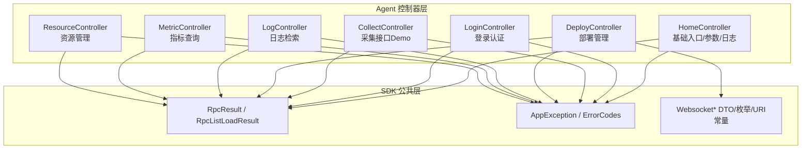
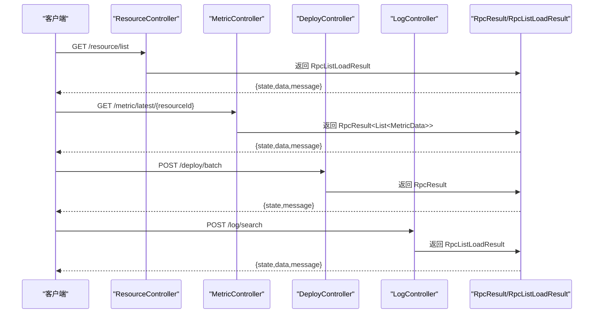
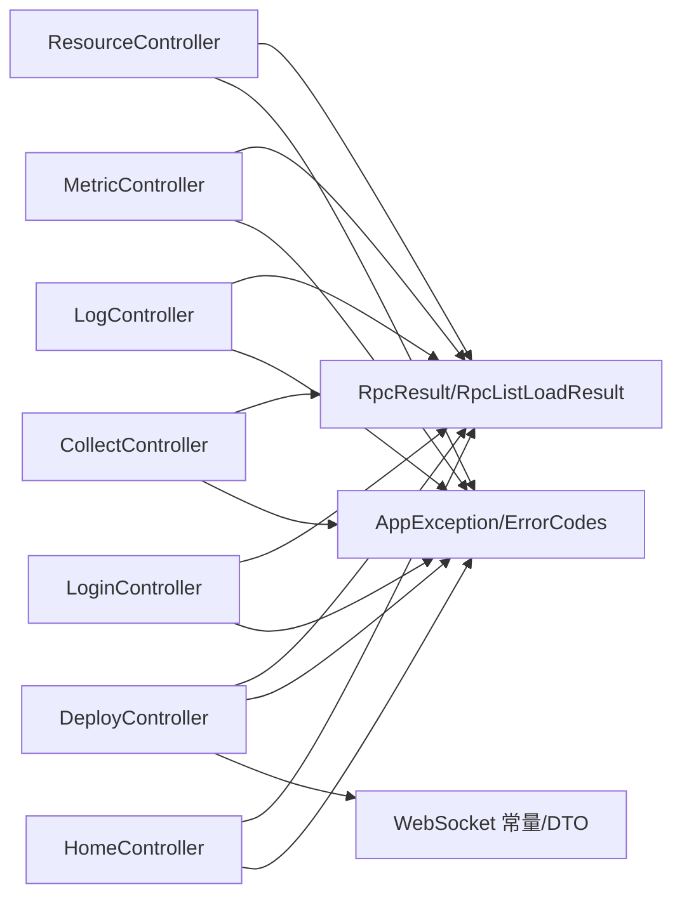

# API接口文档

<cite>
**本文引用的文件**
- [ResourceController.java](file://watcher-agent/src/main/java/com/virtual/cloud/om/agent/controller/ResourceController.java)
- [MetricController.java](file://watcher-agent/src/main/java/com/virtual/cloud/om/agent/controller/MetricController.java)
- [LogController.java](file://watcher-agent/src/main/java/com/virtual/cloud/om/agent/controller/LogController.java)
- [DeployController.java](file://watcher-agent/src/main/java/com/virtual/cloud/om/agent/controller/DeployController.java)
- [CollectController.java](file://watcher-agent/src/main/java/com/virtual/cloud/om/agent/controller/CollectController.java)
- [LoginController.java](file://watcher-agent/src/main/java/com/virtual/cloud/om/agent/controller/LoginController.java)
- [HomeController.java](file://watcher-agent/src/main/java/com/virtual/cloud/om/agent/controller/HomeController.java)
- [DataCenterService.java](file://watcher-agent/src/main/java/com/virtual/cloud/om/agent/service/datacenter/DataCenterService.java)
- [BatchDeployVO.java](file://watcher-sdk/src/main/java/com/virtual/cloud/om/sdk/dto/deploy/BatchDeployVO.java)
- [DeployVO.java](file://watcher-sdk/src/main/java/com/virtual/cloud/om/sdk/dto/deploy/DeployVO.java)
- [RpcResult.java](file://watcher-sdk/src/main/java/com/virtual/cloud/om/sdk/dto/RpcResult.java)
- [RpcListLoadResult.java](file://watcher-sdk/src/main/java/com/virtual/cloud/om/sdk/dto/RpcListLoadResult.java)
- [AppException.java](file://watcher-sdk/src/main/java/com/virtual/cloud/om/sdk/exception/AppException.java)
- [ErrorCodes.java](file://watcher-sdk/src/main/java/com/virtual/cloud/om/sdk/exception/ErrorCodes.java)
- [WebsocketAuthDTO.java](file://watcher-sdk/src/main/java/com/virtual/cloud/om/sdk/dto/websocket/WebsocketAuthDTO.java)
- [WebsocketPushTypeEnum.java](file://watcher-sdk/src/main/java/com/virtual/cloud/om/sdk/constant/WebsocketPushTypeEnum.java)
- [DataCenterWebcocketUriConstants.java](file://watcher-sdk/src/main/java/com/virtual/cloud/om/sdk/constant/uri/DataCenterWebcocketUriConstants.java)
- [WebsocketStateDTO.java](file://watcher-sdk/src/main/java/com/virtual/cloud/om/sdk/dto/websocket/WebsocketStateDTO.java)
- [WarnMgrApimpl.java](file://watcher-agent/src/main/java/com/virtual/cloud/om/agent/service/warn/WarnMgrApimpl.java)
- [WarnReportService.java](file://watcher-agent/src/main/java/com/virtual/cloud/om/agent/service/warn/WarnReportService.java)
</cite>

## 目录
1. [简介](#简介)
2. [项目结构](#项目结构)
3. [核心组件](#核心组件)
4. [架构总览](#架构总览)
5. [详细组件分析](#详细组件分析)
6. [依赖分析](#依赖分析)
7. [性能考虑](#性能考虑)
8. [故障排查指南](#故障排查指南)
9. [结论](#结论)
10. [附录](#附录)

## 简介
本文件为 ShowTime 监控系统的完整 API 接口文档，覆盖资源管理、指标查询、日志检索、部署管理、登录认证、以及 WebSocket 实时通信等模块。文档基于实际代码实现进行梳理，明确各端点的 HTTP 方法、URL 模式、请求参数、响应格式与状态码，并提供使用示例、错误处理策略、安全与性能优化建议。

## 项目结构
后端采用 Spring Boot 控制器层暴露 REST API，SDK 层提供统一的 DTO、异常与常量定义，Agent 侧提供具体业务实现与服务集成。

图表来源
- [ResourceController.java:24-235](file://watcher-agent/src/main/java/com/virtual/cloud/om/agent/controller/ResourceController.java#L24-L235)
- [MetricController.java:19-103](file://watcher-agent/src/main/java/com/virtual/cloud/om/agent/controller/MetricController.java#L19-L103)
- [LogController.java:20-36](file://watcher-agent/src/main/java/com/virtual/cloud/om/agent/controller/LogController.java#L20-L36)
- [DeployController.java:34-325](file://watcher-agent/src/main/java/com/virtual/cloud/om/agent/controller/DeployController.java#L34-L325)
- [CollectController.java:27-67](file://watcher-agent/src/main/java/com/virtual/cloud/om/agent/controller/CollectController.java#L27-L67)
- [LoginController.java:13-92](file://watcher-agent/src/main/java/com/virtual/cloud/om/agent/controller/LoginController.java#L13-L92)
- [HomeController.java:24-100](file://watcher-agent/src/main/java/com/virtual/cloud/om/agent/controller/HomeController.java#L24-L100)
- [RpcResult.java:1-88](file://watcher-sdk/src/main/java/com/virtual/cloud/om/sdk/dto/RpcResult.java#L1-L88)
- [RpcListLoadResult.java:1-57](file://watcher-sdk/src/main/java/com/virtual/cloud/om/sdk/dto/RpcListLoadResult.java#L1-L57)
- [AppException.java:1-64](file://watcher-sdk/src/main/java/com/virtual/cloud/om/sdk/exception/AppException.java#L1-L64)
- [ErrorCodes.java:1-190](file://watcher-sdk/src/main/java/com/virtual/cloud/om/sdk/exception/ErrorCodes.java#L1-L190)
- [WebsocketAuthDTO.java:1-22](file://watcher-sdk/src/main/java/com/virtual/cloud/om/sdk/dto/websocket/WebsocketAuthDTO.java#L1-L22)
- [WebsocketPushTypeEnum.java:1-21](file://watcher-sdk/src/main/java/com/virtual/cloud/om/sdk/constant/WebsocketPushTypeEnum.java#L1-L21)
- [DataCenterWebcocketUriConstants.java:1-13](file://watcher-sdk/src/main/java/com/virtual/cloud/om/sdk/constant/uri/DataCenterWebcocketUriConstants.java#L1-L13)

章节来源
- [ResourceController.java:24-235](file://watcher-agent/src/main/java/com/virtual/cloud/om/agent/controller/ResourceController.java#L24-L235)
- [MetricController.java:19-103](file://watcher-agent/src/main/java/com/virtual/cloud/om/agent/controller/MetricController.java#L19-L103)
- [LogController.java:20-36](file://watcher-agent/src/main/java/com/virtual/cloud/om/agent/controller/LogController.java#L20-L36)
- [DeployController.java:34-325](file://watcher-agent/src/main/java/com/virtual/cloud/om/agent/controller/DeployController.java#L34-L325)
- [CollectController.java:27-67](file://watcher-agent/src/main/java/com/virtual/cloud/om/agent/controller/CollectController.java#L27-L67)
- [LoginController.java:13-92](file://watcher-agent/src/main/java/com/virtual/cloud/om/agent/controller/LoginController.java#L13-L92)
- [HomeController.java:24-100](file://watcher-agent/src/main/java/com/virtual/cloud/om/agent/controller/HomeController.java#L24-L100)

## 核心组件
- 统一响应封装
  - RpcResult：单对象响应，包含状态、消息与数据字段
  - RpcListLoadResult：列表响应，包含状态、消息与数据列表
- 异常体系
  - AppException：运行期异常，携带错误码与国际化消息
  - ErrorCodes：集中定义各类错误码与消息键
- WebSocket 支持
  - WebsocketAuthDTO：鉴权与心跳载荷
  - WebsocketPushTypeEnum：推送事件类型枚举
  - DataCenterWebcocketUriConstants：WebSocket URI 前缀与端点

章节来源
- [RpcResult.java:1-88](file://watcher-sdk/src/main/java/com/virtual/cloud/om/sdk/dto/RpcResult.java#L1-L88)
- [RpcListLoadResult.java:1-57](file://watcher-sdk/src/main/java/com/virtual/cloud/om/sdk/dto/RpcListLoadResult.java#L1-L57)
- [AppException.java:1-64](file://watcher-sdk/src/main/java/com/virtual/cloud/om/sdk/exception/AppException.java#L1-L64)
- [ErrorCodes.java:1-190](file://watcher-sdk/src/main/java/com/virtual/cloud/om/sdk/exception/ErrorCodes.java#L1-L190)
- [WebsocketAuthDTO.java:1-22](file://watcher-sdk/src/main/java/com/virtual/cloud/om/sdk/dto/websocket/WebsocketAuthDTO.java#L1-L22)
- [WebsocketPushTypeEnum.java:1-21](file://watcher-sdk/src/main/java/com/virtual/cloud/om/sdk/constant/WebsocketPushTypeEnum.java#L1-L21)
- [DataCenterWebcocketUriConstants.java:1-13](file://watcher-sdk/src/main/java/com/virtual/cloud/om/sdk/constant/uri/DataCenterWebcocketUriConstants.java#L1-L13)

## 架构总览
下图展示 API 的典型调用链路：客户端通过 REST 调用控制器，控制器使用 SDK 统一响应封装返回；部分控制器依赖服务层或外部 API；WebSocket 用于实时事件推送。

图表来源
- [ResourceController.java:34-55](file://watcher-agent/src/main/java/com/virtual/cloud/om/agent/controller/ResourceController.java#L34-L55)
- [MetricController.java:59-67](file://watcher-agent/src/main/java/com/virtual/cloud/om/agent/controller/MetricController.java#L59-L67)
- [DeployController.java:46-61](file://watcher-agent/src/main/java/com/virtual/cloud/om/agent/controller/DeployController.java#L46-L61)
- [LogController.java:27-34](file://watcher-agent/src/main/java/com/virtual/cloud/om/agent/controller/LogController.java#L27-L34)
- [RpcResult.java:1-88](file://watcher-sdk/src/main/java/com/virtual/cloud/om/sdk/dto/RpcResult.java#L1-L88)
- [RpcListLoadResult.java:1-57](file://watcher-sdk/src/main/java/com/virtual/cloud/om/sdk/dto/RpcListLoadResult.java#L1-L57)

## 详细组件分析

### 资源管理 API
- 基础路径：/resource
- 列表查询
  - 方法：GET
  - 路径：/resource/list
  - 查询参数：
    - platform（可选，字符串，过滤平台）
    - resourceName（可选，字符串，模糊匹配资源名）
    - ipAddress（可选，字符串，按IP过滤）
    - page（可选，默认0）
    - size（可选，默认10）
  - 响应：RpcListLoadResult<Resource>
  - 状态码：200 成功；异常时由统一异常处理映射
- 详情查询
  - 方法：GET
  - 路径：/resource/detail/{id}
  - 路径参数：id（字符串）
  - 响应：RpcResult<Resource>
- 创建资源
  - 方法：POST
  - 路径：/resource/create
  - 请求体：ResourceDTO
  - 响应：RpcResult<Void>
- 批量创建
  - 方法：POST
  - 路径：/resource/batchCreate
  - 请求体：List<ResourceDTO>
  - 响应：RpcResult<Void>
- 更新资源
  - 方法：PUT
  - 路径：/resource/update
  - 请求体：ResourceDTO
  - 响应：RpcResult<Void>
- 删除资源
  - 方法：DELETE
  - 路径：/resource/delete/{id}
  - 路径参数：id（字符串）
  - 响应：RpcResult<Void>
- 更新可用状态
  - 方法：PUT
  - 路径：/resource/usable/{id}
  - 路径参数：id（字符串）
  - 查询参数：usable（整数）
  - 响应：RpcResult<Void>
- 更新远程权限
  - 方法：PUT
  - 路径：/resource/remote/{id}
  - 路径参数：id（字符串）
  - 查询参数：remote（整数）
  - 响应：RpcResult<Void>

章节来源
- [ResourceController.java:34-235](file://watcher-agent/src/main/java/com/virtual/cloud/om/agent/controller/ResourceController.java#L34-L235)

### 指标查询 API
- 基础路径：/metric
- 指标类型列表
  - 方法：GET
  - 路径：/metric/types
  - 响应：RpcResult<List<Map<String,String>>>
- 平台类型列表
  - 方法：GET
  - 路径：/metric/platforms
  - 响应：RpcResult<List<Map<String,String>>>
- 指标数据列表
  - 方法：GET
  - 路径：/metric/list
  - 查询参数：
    - resourceId（可选）
    - platform（可选）
    - metricType（可选）
    - startTime（可选）
    - endTime（可选）
    - page（默认0）
    - size（默认100）
  - 响应：RpcListLoadResult<Map<String,Object>>
- 最新指标
  - 方法：GET
  - 路径：/metric/latest/{resourceId}
  - 路径参数：resourceId（字符串）
  - 响应：RpcResult<List<MetricData>>
- 指标趋势
  - 方法：GET
  - 路径：/metric/trend/{resourceId}/{metricType}
  - 路径参数：resourceId（字符串）、metricType（字符串）
  - 查询参数：hours（默认1小时）
  - 响应：RpcResult<List<MetricData>>
- 上报指标
  - 方法：POST
  - 路径：/metric/report
  - 请求体：List<MetricData>
  - 响应：RpcResult<Void>
- 资源指标汇总
  - 方法：GET
  - 路径：/metric/summary/{resourceId}
  - 路径参数：resourceId（字符串）
  - 响应：RpcResult<Map<String,Object>>

章节来源
- [MetricController.java:29-102](file://watcher-agent/src/main/java/com/virtual/cloud/om/agent/controller/MetricController.java#L29-L102)

### 日志查询 API
- 基础路径：/log
- 在线检索日志
  - 方法：POST
  - 路径：/log/search
  - 请求体：ExportLogReq（包含 platform、resourceId、type、targetId、path、query、startTime、endTime、sortDir、logNum、level 等字段）
  - 响应：RpcListLoadResult<LogLine>
  - 说明：内部委托 RealTimeLogApi 执行搜索

章节来源
- [LogController.java:27-34](file://watcher-agent/src/main/java/com/virtual/cloud/om/agent/controller/LogController.java#L27-L34)

### 部署管理 API
- 基础路径：/deploy
- 多节点部署
  - 方法：POST
  - 路径：/deploy/batch
  - 请求体：BatchDeployVO（包含 vip、mask、nodes 等）
  - 响应：RpcResult<Void>
  - 说明：同时更新数据中心步骤
- 单节点部署
  - 方法：POST
  - 路径：/deploy/single
  - 请求体：DeployVO（包含 ip、username、password、isMaster）
  - 响应：RpcResult<Void>
- 节点状态查询
  - 方法：GET
  - 路径：/deploy
  - 响应：RpcListLoadResult<DeployQueryVO>
- 组件服务管理
  - 方法：PUT
  - 路径：/deploy/manage
  - 请求体：ComponentManage
  - 响应：RpcResult<Void>
- 应用刷新（重启Spring Boot）
  - 方法：GET
  - 路径：/deploy/refresh
  - 响应：RpcResult<Void>
- 主机信息查询
  - 方法：GET
  - 路径：/deploy/host
  - 响应：String
- 本地IP列表
  - 方法：GET
  - 路径：/deploy/localIps
  - 响应：RpcListLoadResult<String>
- Keepalived 通知
  - 方法：PUT
  - 路径：/deploy/keepalived/notify/{masterOrBackup}
  - 路径参数：masterOrBackup（字符串，master 或 backup）
  - 响应：RpcResult<Void>
- 修改部署步骤
  - 方法：PUT
  - 路径：/deploy/step
  - 请求体：UpdateStepDTO
  - 响应：RpcResult<Void>
- 本地网卡信息
  - 方法：GET
  - 路径：/deploy/network
  - 响应：RpcResult
- 配置本地网卡
  - 方法：POST
  - 路径：/deploy/network
  - 请求体：NetworkInfoVO
  - 响应：RpcResult
- 编辑外网网卡
  - 方法：PUT
  - 路径：/deploy/network
  - 请求体：NetworkInfoVO
  - 响应：RpcResult
- 检查是否为部署前主节点
  - 方法：GET
  - 路径：/deploy/network/master
  - 响应：RpcResult
- 获取所有节点网络配置
  - 方法：GET
  - 路径：/deploy/network/config/nodes
  - 响应：RpcResult
- 获取指定节点网络配置
  - 方法：GET
  - 路径：/deploy/network/config/node
  - 查询参数：nodeName（字符串）
  - 响应：RpcResult
- 获取WiFi列表
  - 方法：GET
  - 路径：/deploy/network/wifis
  - 响应：RpcResult
- 添加路由前连通性检查
  - 方法：POST
  - 路径：/deploy/route/add/check
  - 请求体：RouteVo
  - 响应：RpcResult
- 编辑路由前连通性检查
  - 方法：POST
  - 路径：/deploy/route/edit/check
  - 请求体：RouteVo
  - 响应：RpcResult
- 路由连通性检查
  - 方法：POST
  - 路径：/deploy/route/check
  - 请求体：RouteCheckPingVo
  - 响应：RpcResult
- 路由列表
  - 方法：GET
  - 路径：/deploy/route
  - 响应：RpcResult
- 添加路由
  - 方法：POST
  - 路径：/deploy/route
  - 请求体：RouteVo
  - 响应：RpcResult
- 修改路由
  - 方法：PUT
  - 路径：/deploy/route
  - 请求体：RouteVo
  - 响应：RpcResult
- 删除路由
  - 方法：DELETE
  - 路径：/deploy/route
  - 请求体：List<String>（路由ID列表）
  - 响应：RpcResult

章节来源
- [DeployController.java:46-325](file://watcher-agent/src/main/java/com/virtual/cloud/om/agent/controller/DeployController.java#L46-L325)
- [BatchDeployVO.java:14-39](file://watcher-sdk/src/main/java/com/virtual/cloud/om/sdk/dto/deploy/BatchDeployVO.java#L14-L39)
- [DeployVO.java:10-34](file://watcher-sdk/src/main/java/com/virtual/cloud/om/sdk/dto/deploy/DeployVO.java#L10-L34)

### 登录认证 API
- 基础路径：/user
- 用户登录
  - 方法：POST
  - 路径：/user/login
  - 请求体：SysUserDTO
  - 响应：RpcResult<String>（token）
- 修改用户
  - 方法：PUT
  - 路径：/user/modifyUser
  - 请求体：ModifyUser
  - 响应：RpcResult<Void>
- 用户登出
  - 方法：POST
  - 路径：/user/logout
  - 响应：RpcResult<Void>
- 密码复杂度查询
  - 方法：GET
  - 路径：/user/search/complexity
  - 响应：RpcResult<Integer>

章节来源
- [LoginController.java:25-92](file://watcher-agent/src/main/java/com/virtual/cloud/om/agent/controller/LoginController.java#L25-L92)

### 采集接口 Demo
- 基础路径：/collect
- 实时日志策略下发
  - 方法：POST
  - 路径：/collect/realtime-log
  - 请求体：List<RealTimeLogStrategyRequest>
  - 响应：RpcResult
- 资源同步
  - 方法：POST
  - 路径：/collect/resources
  - 请求体：List<ResourceDTO>
  - 响应：RpcResult<Void>
- 批量部署
  - 方法：POST
  - 路径：/collect/batch
  - 请求体：BatchDeployVO
  - 响应：RpcResult<Void>

章节来源
- [CollectController.java:45-66](file://watcher-agent/src/main/java/com/virtual/cloud/om/agent/controller/CollectController.java#L45-L66)

### 基础入口与运维
- 根路径：/
- 测试 Workspace 桌面池
  - 方法：GET
  - 路径：/workspace/desktoppools
  - 查询参数：RestHost
  - 响应：String
- 测试 CAS 主机
  - 方法：GET
  - 路径：/cas/hosts
  - 查询参数：RestHost
  - 响应：String
- 基础问候
  - 方法：GET
  - 路径：/
  - 响应：String
- 参数配置
  - 方法：POST
  - 路径：/parameter
  - 请求体：Parameter
  - 响应：RpcResult<Parameter>
- 日志查询
  - 方法：GET
  - 路径：/log
  - 查询参数：OperationLog
  - 响应：RpcListLoadResult<OperationLog>
- 清理日志
  - 方法：DELETE
  - 路径：/log
  - 查询参数：time（清理到该时间之前）、per（是否持久化）
  - 响应：RpcResult<Long>
- 启用 Kafka 调试
  - 方法：GET
  - 路径：/enableKafkaDebug
  - 查询参数：ip
  - 响应：RpcResult<String>

章节来源
- [HomeController.java:52-99](file://watcher-agent/src/main/java/com/virtual/cloud/om/agent/controller/HomeController.java#L52-L99)

### WebSocket 实时通信 API
- 基础路径：/api
- 中央 WebSocket
  - 路径：/api/oad-center/websocket
  - 认证载荷：WebsocketAuthDTO（token、heartbeat、watcherCode）
  - 事件类型：WebsocketPushTypeEnum（心跳、SSH限制、测试连接、状态上报、路由相关等）
  - 状态反馈：WebsocketStateDTO（state、successMessage、failureMessage）
- SSH Socket
  - 路径：/api/oad-center/sshSocket
  - 用途：SSH 相关实时通信

章节来源
- [DataCenterWebcocketUriConstants.java:8-13](file://watcher-sdk/src/main/java/com/virtual/cloud/om/sdk/constant/uri/DataCenterWebcocketUriConstants.java#L8-L13)
- [WebsocketAuthDTO.java:15-22](file://watcher-sdk/src/main/java/com/virtual/cloud/om/sdk/dto/websocket/WebsocketAuthDTO.java#L15-L22)
- [WebsocketPushTypeEnum.java:4-21](file://watcher-sdk/src/main/java/com/virtual/cloud/om/sdk/constant/WebsocketPushTypeEnum.java#L4-L21)
- [WebsocketStateDTO.java:15-23](file://watcher-sdk/src/main/java/com/virtual/cloud/om/sdk/dto/websocket/WebsocketStateDTO.java#L15-L23)

### 告警管理 API（简化实现）
- 当前实现为简化版本，MongoDB 相关功能已禁用
  - 查询告警：已禁用（返回空）
  - 编辑告警：已禁用（无操作）
  - 告警上报：已简化（仅记录日志）

章节来源
- [WarnMgrApimpl.java:14-50](file://watcher-agent/src/main/java/com/virtual/cloud/om/agent/service/warn/WarnMgrApimpl.java#L14-L50)
- [WarnReportService.java:20-48](file://watcher-agent/src/main/java/com/virtual/cloud/om/agent/service/warn/WarnReportService.java#L20-L48)

## 依赖分析
- 控制器与响应封装
  - 所有控制器均依赖 RpcResult/RpcListLoadResult 进行统一响应
- 错误处理
  - 统一异常 AppException 与错误码 ErrorCodes 提供一致的错误语义
- 部署参数模型
  - BatchDeployVO、DeployVO 作为部署相关请求体的标准模型
- WebSocket 常量
  - DataCenterWebcocketUriConstants 定义 WebSocket 前缀与端点

图表来源
- [RpcResult.java:1-88](file://watcher-sdk/src/main/java/com/virtual/cloud/om/sdk/dto/RpcResult.java#L1-L88)
- [RpcListLoadResult.java:1-57](file://watcher-sdk/src/main/java/com/virtual/cloud/om/sdk/dto/RpcListLoadResult.java#L1-L57)
- [AppException.java:1-64](file://watcher-sdk/src/main/java/com/virtual/cloud/om/sdk/exception/AppException.java#L1-L64)
- [ErrorCodes.java:1-190](file://watcher-sdk/src/main/java/com/virtual/cloud/om/sdk/exception/ErrorCodes.java#L1-L190)
- [DataCenterWebcocketUriConstants.java:1-13](file://watcher-sdk/src/main/java/com/virtual/cloud/om/sdk/constant/uri/DataCenterWebcocketUriConstants.java#L1-L13)

章节来源
- [RpcResult.java:1-88](file://watcher-sdk/src/main/java/com/virtual/cloud/om/sdk/dto/RpcResult.java#L1-L88)
- [RpcListLoadResult.java:1-57](file://watcher-sdk/src/main/java/com/virtual/cloud/om/sdk/dto/RpcListLoadResult.java#L1-L57)
- [AppException.java:1-64](file://watcher-sdk/src/main/java/com/virtual/cloud/om/sdk/exception/AppException.java#L1-L64)
- [ErrorCodes.java:1-190](file://watcher-sdk/src/main/java/com/virtual/cloud/om/sdk/exception/ErrorCodes.java#L1-L190)
- [DataCenterWebcocketUriConstants.java:1-13](file://watcher-sdk/src/main/java/com/virtual/cloud/om/sdk/constant/uri/DataCenterWebcocketUriConstants.java#L1-L13)

## 性能考虑
- 分页与大小
  - 指标列表默认 size=100，建议根据前端需求合理设置，避免过大导致延迟
- 加密与敏感字段
  - 资源密码与 CI 字段采用 SM4 加密存储，注意解密与传输安全
- 网络配置与路由
  - 网络配置涉及系统命令执行与重启，建议在维护窗口执行并做好回滚预案
- WebSocket 心跳
  - 建议客户端定期发送心跳，避免连接中断

## 故障排查指南
- 常见错误码
  - 400 参数错误：如参数为空、非法
  - 401 未授权：token 失效或缺失
  - 403 禁止访问：权限不足
  - 404 资源不存在：ID 无效
  - 500 内部错误：服务器异常
  - 部署相关错误：如网络不通、VIP占用、路由添加失败等
- 统一异常处理
  - 使用 AppException 与 ErrorCodes 获取国际化错误消息
- 日志清理
  - 可通过 /log 接口清理历史日志，避免磁盘压力

章节来源
- [ErrorCodes.java:15-190](file://watcher-sdk/src/main/java/com/virtual/cloud/om/sdk/exception/ErrorCodes.java#L15-L190)
- [AppException.java:1-64](file://watcher-sdk/src/main/java/com/virtual/cloud/om/sdk/exception/AppException.java#L1-L64)
- [HomeController.java:82-91](file://watcher-agent/src/main/java/com/virtual/cloud/om/agent/controller/HomeController.java#L82-L91)

## 结论
本 API 文档基于实际代码梳理，覆盖资源、指标、日志、部署、认证与 WebSocket 等核心能力。当前实现中部分 MongoDB 相关功能已简化或禁用，部署与网络配置涉及系统级操作需谨慎执行。建议结合分页、缓存与心跳机制提升性能与稳定性。

## 附录
- 使用示例（路径参考）
  - 资源列表：GET /resource/list?platform=xxx&resourceName=xxx&page=0&size=10
  - 创建资源：POST /resource/create（Body：ResourceDTO）
  - 指标趋势：GET /metric/trend/{resourceId}/{metricType}?hours=1
  - 日志检索：POST /log/search（Body：ExportLogReq）
  - 多节点部署：POST /deploy/batch（Body：BatchDeployVO）
  - 登录：POST /user/login（Body：SysUserDTO）
  - WebSocket：ws://host:port/api/oad-center/websocket（鉴权：WebsocketAuthDTO）
- 安全建议
  - 使用 HTTPS 与 JWT 认证
  - 对敏感字段进行加密存储与传输
  - 严格校验与过滤输入参数
- 性能优化建议
  - 合理设置分页大小与时间范围
  - 对高频查询增加缓存
  - WebSocket 心跳与断线重连策略