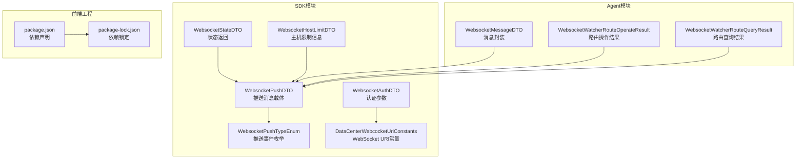
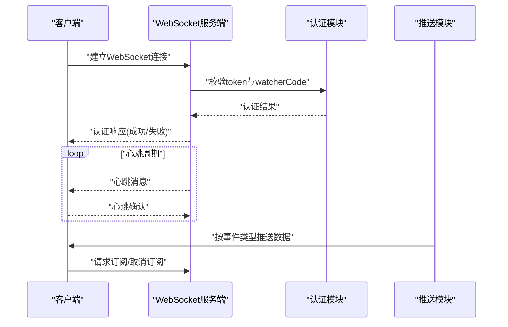
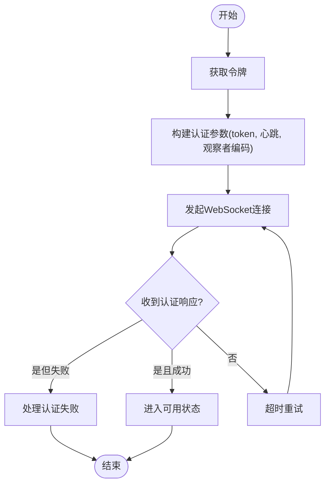
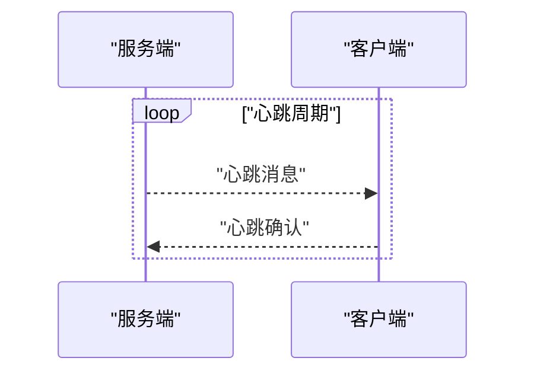
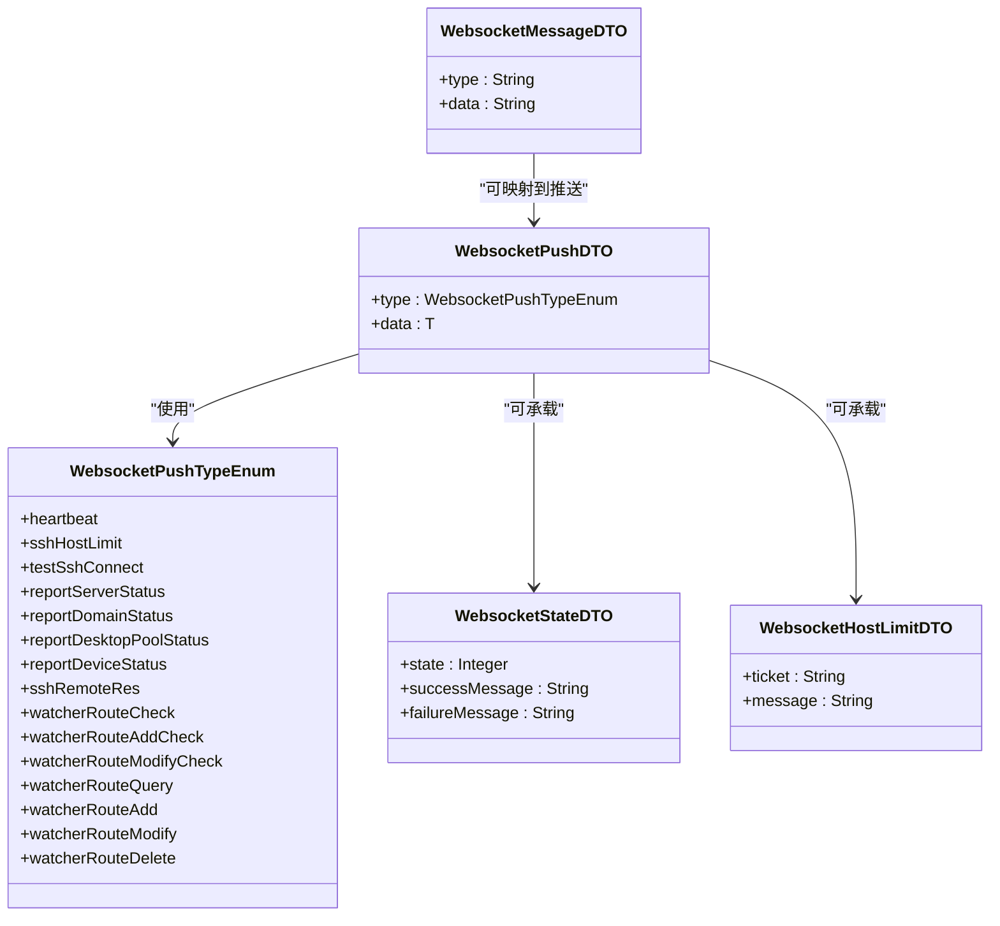
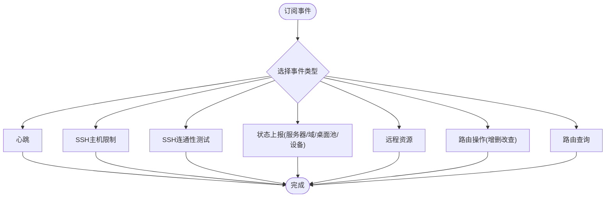
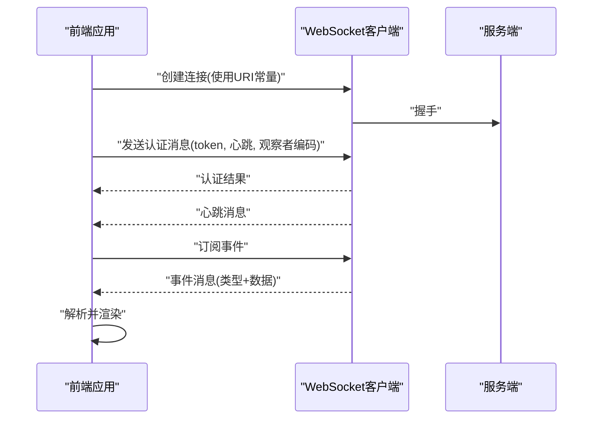
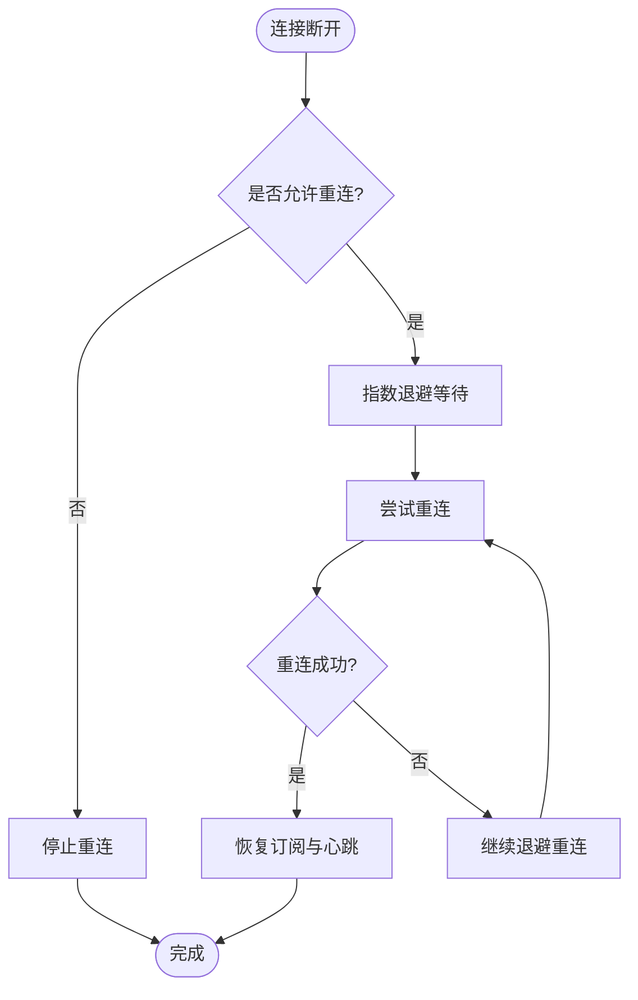
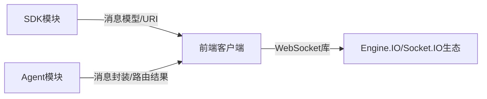

# WebSocket实时通信API

<cite>
**本文引用的文件**
- [WebsocketAuthDTO.java](file://watcher-sdk/src/main/java/com/virtual/cloud/om/sdk/dto/websocket/WebsocketAuthDTO.java)
- [WebsocketPushDTO.java](file://watcher-sdk/src/main/java/com/virtual/cloud/om/sdk/dto/websocket/WebsocketPushDTO.java)
- [WebsocketPushTypeEnum.java](file://watcher-sdk/src/main/java/com/virtual/cloud/om/sdk/constant/WebsocketPushTypeEnum.java)
- [WebsocketStateDTO.java](file://watcher-sdk/src/main/java/com/virtual/cloud/om/sdk/dto/websocket/WebsocketStateDTO.java)
- [WebsocketHostLimitDTO.java](file://watcher-sdk/src/main/java/com/virtual/cloud/om/sdk/dto/websocket/WebsocketHostLimitDTO.java)
- [WebsocketMessageDTO.java](file://watcher-agent/src/main/java/com/virtual/cloud/om/agent/dto/WebsocketMessageDTO.java)
- [DataCenterWebcocketUriConstants.java](file://watcher-sdk/src/main/java/com/virtual/cloud/om/sdk/constant/uri/DataCenterWebcocketUriConstants.java)
- [WebsocketWatcherRouteOperateResult.java](file://watcher-agent/src/main/java/com/virtual/cloud/om/agent/dto/WebsocketWatcherRouteOperateResult.java)
- [WebsocketWatcherRouteQueryResult.java](file://watcher-agent/src/main/java/com/virtual/cloud/om/agent/dto/WebsocketWatcherRouteQueryResult.java)
- [package.json](file://watcher-web/package.json)
- [package-lock.json](file://watcher-web/package-lock.json)
</cite>

## 目录
1. [简介](#简介)
2. [项目结构](#项目结构)
3. [核心组件](#核心组件)
4. [架构总览](#架构总览)
5. [详细组件分析](#详细组件分析)
6. [依赖关系分析](#依赖关系分析)
7. [性能考虑](#性能考虑)
8. [故障排查指南](#故障排查指南)
9. [结论](#结论)
10. [附录](#附录)

## 简介
本文件面向WebSocket实时通信API，系统性梳理实时数据推送、状态同步与事件通知的连接与消息处理机制。重点覆盖以下方面：
- 连接建立流程、认证方式与心跳保持
- 消息格式规范（消息类型、数据结构、事件编码）
- 实时日志推送、指标数据更新、告警通知、系统状态变化等事件类型
- 客户端连接示例、消息订阅方法与错误处理策略
- 连接重试机制、断线恢复与性能优化建议
- WebSocket与RESTful API的区别与适用场景

## 项目结构
围绕WebSocket能力，涉及SDK侧的消息模型与URI常量、Agent侧的消息封装与路由结果模型，以及前端工程对WebSocket客户端库的依赖。

图表来源
- [WebsocketAuthDTO.java:1-23](file://watcher-sdk/src/main/java/com/virtual/cloud/om/sdk/dto/websocket/WebsocketAuthDTO.java#L1-L23)
- [WebsocketPushDTO.java:1-14](file://watcher-sdk/src/main/java/com/virtual/cloud/om/sdk/dto/websocket/WebsocketPushDTO.java#L1-L14)
- [WebsocketPushTypeEnum.java:1-22](file://watcher-sdk/src/main/java/com/virtual/cloud/om/sdk/constant/WebsocketPushTypeEnum.java#L1-L22)
- [WebsocketStateDTO.java:1-24](file://watcher-sdk/src/main/java/com/virtual/cloud/om/sdk/dto/websocket/WebsocketStateDTO.java#L1-L24)
- [WebsocketHostLimitDTO.java:1-11](file://watcher-sdk/src/main/java/com/virtual/cloud/om/sdk/dto/websocket/WebsocketHostLimitDTO.java#L1-L11)
- [WebsocketMessageDTO.java:1-23](file://watcher-agent/src/main/java/com/virtual/cloud/om/agent/dto/WebsocketMessageDTO.java#L1-L23)
- [WebsocketWatcherRouteOperateResult.java:1-13](file://watcher-agent/src/main/java/com/virtual/cloud/om/agent/dto/WebsocketWatcherRouteOperateResult.java#L1-L13)
- [WebsocketWatcherRouteQueryResult.java:1-16](file://watcher-agent/src/main/java/com/virtual/cloud/om/agent/dto/WebsocketWatcherRouteQueryResult.java#L1-L16)
- [DataCenterWebcocketUriConstants.java:1-14](file://watcher-sdk/src/main/java/com/virtual/cloud/om/sdk/constant/uri/DataCenterWebcocketUriConstants.java#L1-L14)
- [package.json](file://watcher-web/package.json)
- [package-lock.json](file://watcher-web/package-lock.json)

章节来源
- [DataCenterWebcocketUriConstants.java:1-14](file://watcher-sdk/src/main/java/com/virtual/cloud/om/sdk/constant/uri/DataCenterWebcocketUriConstants.java#L1-L14)

## 核心组件
- 认证参数模型：用于建立WebSocket连接时的身份与心跳参数传递
- 推送消息载体：统一承载事件类型与业务数据
- 事件类型枚举：定义可推送的事件集合
- 状态返回模型：标准化连接/操作成功或失败的反馈
- 主机限制信息模型：用于推送主机访问限制相关事件
- 消息封装模型：Agent侧对消息的通用封装
- 路由操作/查询结果模型：用于推送路由相关的操作与查询结果
- URI常量：定义WebSocket服务端点路径

章节来源
- [WebsocketAuthDTO.java:1-23](file://watcher-sdk/src/main/java/com/virtual/cloud/om/sdk/dto/websocket/WebsocketAuthDTO.java#L1-L23)
- [WebsocketPushDTO.java:1-14](file://watcher-sdk/src/main/java/com/virtual/cloud/om/sdk/dto/websocket/WebsocketPushDTO.java#L1-L14)
- [WebsocketPushTypeEnum.java:1-22](file://watcher-sdk/src/main/java/com/virtual/cloud/om/sdk/constant/WebsocketPushTypeEnum.java#L1-L22)
- [WebsocketStateDTO.java:1-24](file://watcher-sdk/src/main/java/com/virtual/cloud/om/sdk/dto/websocket/WebsocketStateDTO.java#L1-L24)
- [WebsocketHostLimitDTO.java:1-11](file://watcher-sdk/src/main/java/com/virtual/cloud/om/sdk/dto/websocket/WebsocketHostLimitDTO.java#L1-L11)
- [WebsocketMessageDTO.java:1-23](file://watcher-agent/src/main/java/com/virtual/cloud/om/agent/dto/WebsocketMessageDTO.java#L1-L23)
- [WebsocketWatcherRouteOperateResult.java:1-13](file://watcher-agent/src/main/java/com/virtual/cloud/om/agent/dto/WebsocketWatcherRouteOperateResult.java#L1-L13)
- [WebsocketWatcherRouteQueryResult.java:1-16](file://watcher-agent/src/main/java/com/virtual/cloud/om/agent/dto/WebsocketWatcherRouteQueryResult.java#L1-L16)
- [DataCenterWebcocketUriConstants.java:1-14](file://watcher-sdk/src/main/java/com/virtual/cloud/om/sdk/constant/uri/DataCenterWebcocketUriConstants.java#L1-L14)

## 架构总览
WebSocket实时通信由前端通过指定URI建立长连接，后端在认证通过后按事件类型向客户端推送消息；客户端根据事件类型解析数据并执行相应UI更新或交互逻辑。

图表来源
- [DataCenterWebcocketUriConstants.java:8-13](file://watcher-sdk/src/main/java/com/virtual/cloud/om/sdk/constant/uri/DataCenterWebcocketUriConstants.java#L8-L13)
- [WebsocketAuthDTO.java:15-22](file://watcher-sdk/src/main/java/com/virtual/cloud/om/sdk/dto/websocket/WebsocketAuthDTO.java#L15-L22)
- [WebsocketPushTypeEnum.java:4-21](file://watcher-sdk/src/main/java/com/virtual/cloud/om/sdk/constant/WebsocketPushTypeEnum.java#L4-L21)

## 详细组件分析

### 认证与连接建立
- 认证参数包含令牌、心跳间隔与观察者编码，用于标识身份与维持会话
- 建议在连接前完成令牌获取与有效性校验
- 建议在连接建立后立即发送认证消息，并监听认证结果

图表来源
- [WebsocketAuthDTO.java:15-22](file://watcher-sdk/src/main/java/com/virtual/cloud/om/sdk/dto/websocket/WebsocketAuthDTO.java#L15-L22)
- [DataCenterWebcocketUriConstants.java:11-12](file://watcher-sdk/src/main/java/com/virtual/cloud/om/sdk/constant/uri/DataCenterWebcocketUriConstants.java#L11-L12)

章节来源
- [WebsocketAuthDTO.java:1-23](file://watcher-sdk/src/main/java/com/virtual/cloud/om/sdk/dto/websocket/WebsocketAuthDTO.java#L1-L23)
- [DataCenterWebcocketUriConstants.java:1-14](file://watcher-sdk/src/main/java/com/virtual/cloud/om/sdk/constant/uri/DataCenterWebcocketUriConstants.java#L1-L14)

### 心跳保持机制
- 心跳消息用于维持连接活性与检测异常断开
- 建议客户端在收到心跳消息后及时回传确认
- 心跳周期应与服务端配置一致，避免不必要的资源消耗

图表来源
- [WebsocketPushTypeEnum.java:5-5](file://watcher-sdk/src/main/java/com/virtual/cloud/om/sdk/constant/WebsocketPushTypeEnum.java#L5-L5)
- [WebsocketPushDTO.java:10-13](file://watcher-sdk/src/main/java/com/virtual/cloud/om/sdk/dto/websocket/WebsocketPushDTO.java#L10-L13)

章节来源
- [WebsocketPushTypeEnum.java:1-22](file://watcher-sdk/src/main/java/com/virtual/cloud/om/sdk/constant/WebsocketPushTypeEnum.java#L1-L22)
- [WebsocketPushDTO.java:1-14](file://watcher-sdk/src/main/java/com/virtual/cloud/om/sdk/dto/websocket/WebsocketPushDTO.java#L1-L14)

### 消息格式规范
- 统一推送载体包含事件类型与数据体
- 事件类型由枚举限定，确保两端一致性
- 状态返回模型用于标准化成功/失败反馈
- 主机限制信息模型用于推送访问限制相关事件
- Agent侧消息封装提供通用字段（类型、数据）

图表来源
- [WebsocketPushDTO.java:1-14](file://watcher-sdk/src/main/java/com/virtual/cloud/om/sdk/dto/websocket/WebsocketPushDTO.java#L1-L14)
- [WebsocketPushTypeEnum.java:1-22](file://watcher-sdk/src/main/java/com/virtual/cloud/om/sdk/constant/WebsocketPushTypeEnum.java#L1-L22)
- [WebsocketStateDTO.java:1-24](file://watcher-sdk/src/main/java/com/virtual/cloud/om/sdk/dto/websocket/WebsocketStateDTO.java#L1-L24)
- [WebsocketHostLimitDTO.java:1-11](file://watcher-sdk/src/main/java/com/virtual/cloud/om/sdk/dto/websocket/WebsocketHostLimitDTO.java#L1-L11)
- [WebsocketMessageDTO.java:1-23](file://watcher-agent/src/main/java/com/virtual/cloud/om/agent/dto/WebsocketMessageDTO.java#L1-L23)

章节来源
- [WebsocketPushDTO.java:1-14](file://watcher-sdk/src/main/java/com/virtual/cloud/om/sdk/dto/websocket/WebsocketPushDTO.java#L1-L14)
- [WebsocketPushTypeEnum.java:1-22](file://watcher-sdk/src/main/java/com/virtual/cloud/om/sdk/constant/WebsocketPushTypeEnum.java#L1-L22)
- [WebsocketStateDTO.java:1-24](file://watcher-sdk/src/main/java/com/virtual/cloud/om/sdk/dto/websocket/WebsocketStateDTO.java#L1-L24)
- [WebsocketHostLimitDTO.java:1-11](file://watcher-sdk/src/main/java/com/virtual/cloud/om/sdk/dto/websocket/WebsocketHostLimitDTO.java#L1-L11)
- [WebsocketMessageDTO.java:1-23](file://watcher-agent/src/main/java/com/virtual/cloud/om/agent/dto/WebsocketMessageDTO.java#L1-L23)

### 事件类型与订阅
- 支持心跳、SSH主机限制、SSH连通性测试、服务器/域/桌面池/设备状态上报、远程资源、路由检查/增删改查等事件
- 客户端应在连接建立后订阅所需事件，避免遗漏关键信息
- 对于路由类事件，Agent侧提供操作与查询结果模型，便于客户端进行状态同步

图表来源
- [WebsocketPushTypeEnum.java:4-21](file://watcher-sdk/src/main/java/com/virtual/cloud/om/sdk/constant/WebsocketPushTypeEnum.java#L4-L21)
- [WebsocketWatcherRouteOperateResult.java:6-13](file://watcher-agent/src/main/java/com/virtual/cloud/om/agent/dto/WebsocketWatcherRouteOperateResult.java#L6-L13)
- [WebsocketWatcherRouteQueryResult.java:9-16](file://watcher-agent/src/main/java/com/virtual/cloud/om/agent/dto/WebsocketWatcherRouteQueryResult.java#L9-L16)

章节来源
- [WebsocketPushTypeEnum.java:1-22](file://watcher-sdk/src/main/java/com/virtual/cloud/om/sdk/constant/WebsocketPushTypeEnum.java#L1-L22)
- [WebsocketWatcherRouteOperateResult.java:1-13](file://watcher-agent/src/main/java/com/virtual/cloud/om/agent/dto/WebsocketWatcherRouteOperateResult.java#L1-L13)
- [WebsocketWatcherRouteQueryResult.java:1-16](file://watcher-agent/src/main/java/com/virtual/cloud/om/agent/dto/WebsocketWatcherRouteQueryResult.java#L1-L16)

### 客户端连接与消息处理示例
- 前端工程依赖WebSocket客户端库，建议使用稳定版本以保证兼容性
- 连接示例步骤：构造URI（基于常量）、建立连接、发送认证消息、处理心跳与事件消息、订阅所需事件
- 错误处理策略：捕获连接异常、认证失败、消息解析错误、网络中断等

图表来源
- [DataCenterWebcocketUriConstants.java:8-13](file://watcher-sdk/src/main/java/com/virtual/cloud/om/sdk/constant/uri/DataCenterWebcocketUriConstants.java#L8-L13)
- [WebsocketAuthDTO.java:15-22](file://watcher-sdk/src/main/java/com/virtual/cloud/om/sdk/dto/websocket/WebsocketAuthDTO.java#L15-L22)
- [WebsocketPushTypeEnum.java:4-21](file://watcher-sdk/src/main/java/com/virtual/cloud/om/sdk/constant/WebsocketPushTypeEnum.java#L4-L21)

章节来源
- [package.json](file://watcher-web/package.json)
- [package-lock.json](file://watcher-web/package-lock.json)
- [DataCenterWebcocketUriConstants.java:1-14](file://watcher-sdk/src/main/java/com/virtual/cloud/om/sdk/constant/uri/DataCenterWebcocketUriConstants.java#L1-L14)
- [WebsocketAuthDTO.java:1-23](file://watcher-sdk/src/main/java/com/virtual/cloud/om/sdk/dto/websocket/WebsocketAuthDTO.java#L1-L23)

### 断线恢复与重试机制
- 建议实现指数退避重连策略，避免雪崩效应
- 在认证失败时提示用户重新登录或刷新令牌
- 对于路由类事件，客户端应具备幂等处理能力，避免重复状态更新

图表来源
- [WebsocketPushTypeEnum.java:5-5](file://watcher-sdk/src/main/java/com/virtual/cloud/om/sdk/constant/WebsocketPushTypeEnum.java#L5-L5)
- [WebsocketPushDTO.java:10-13](file://watcher-sdk/src/main/java/com/virtual/cloud/om/sdk/dto/websocket/WebsocketPushDTO.java#L10-L13)

章节来源
- [WebsocketPushTypeEnum.java:1-22](file://watcher-sdk/src/main/java/com/virtual/cloud/om/sdk/constant/WebsocketPushTypeEnum.java#L1-L22)
- [WebsocketPushDTO.java:1-14](file://watcher-sdk/src/main/java/com/virtual/cloud/om/sdk/dto/websocket/WebsocketPushDTO.java#L1-L14)

## 依赖关系分析
- SDK侧提供消息模型与URI常量，Agent侧提供消息封装与路由结果模型
- 前端工程通过包管理器引入WebSocket客户端库，确保版本稳定与安全

图表来源
- [WebsocketPushDTO.java:1-14](file://watcher-sdk/src/main/java/com/virtual/cloud/om/sdk/dto/websocket/WebsocketPushDTO.java#L1-L14)
- [DataCenterWebcocketUriConstants.java:8-13](file://watcher-sdk/src/main/java/com/virtual/cloud/om/sdk/constant/uri/DataCenterWebcocketUriConstants.java#L8-L13)
- [WebsocketMessageDTO.java:1-23](file://watcher-agent/src/main/java/com/virtual/cloud/om/agent/dto/WebsocketMessageDTO.java#L1-L23)
- [package.json](file://watcher-web/package.json)

章节来源
- [package.json](file://watcher-web/package.json)
- [package-lock.json](file://watcher-web/package-lock.json)

## 性能考虑
- 合理设置心跳周期，避免频繁的心跳造成带宽与CPU压力
- 对高频事件采用批量聚合或去抖策略，减少消息风暴
- 控制消息体大小，优先传输必要字段，避免冗余数据
- 使用二进制或压缩协议（如需要）提升传输效率
- 在客户端实现背压控制，避免一次性处理过多事件导致阻塞

## 故障排查指南
- 认证失败：检查令牌有效期、观察者编码与服务端白名单
- 连接超时：检查网络连通性、代理与防火墙策略
- 心跳异常：确认客户端是否正确回传心跳确认
- 消息解析错误：核对事件类型与数据结构一致性
- 路由操作失败：检查Agent侧返回的状态码与UUID匹配

章节来源
- [WebsocketStateDTO.java:15-23](file://watcher-sdk/src/main/java/com/virtual/cloud/om/sdk/dto/websocket/WebsocketStateDTO.java#L15-L23)
- [WebsocketWatcherRouteOperateResult.java:6-13](file://watcher-agent/src/main/java/com/virtual/cloud/om/agent/dto/WebsocketWatcherRouteOperateResult.java#L6-L13)
- [WebsocketWatcherRouteQueryResult.java:9-16](file://watcher-agent/src/main/java/com/virtual/cloud/om/agent/dto/WebsocketWatcherRouteQueryResult.java#L9-L16)

## 结论
本文档从连接建立、认证与心跳、消息格式与事件类型、客户端处理与错误策略、断线恢复与性能优化等方面，系统化梳理了WebSocket实时通信API的设计与使用要点。建议在实际集成中严格遵循消息契约与事件边界，结合业务场景优化订阅范围与传输策略，确保系统的稳定性与可维护性。

## 附录
- 适用场景对比
  - WebSocket适用于：实时日志推送、指标流式更新、告警通知、系统状态变化等低延迟、高并发的双向通信场景
  - RESTful API适用于：状态查询、批处理任务、非实时性操作等请求-响应模式明确的场景