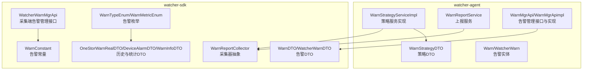
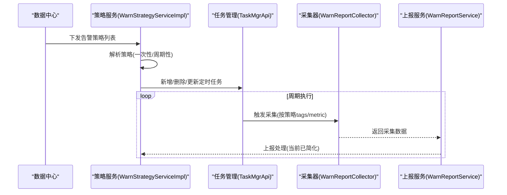
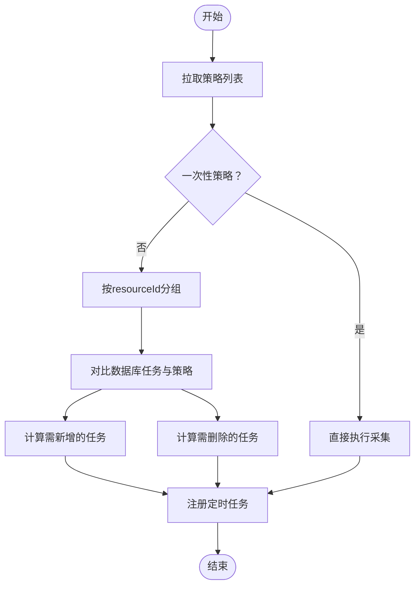
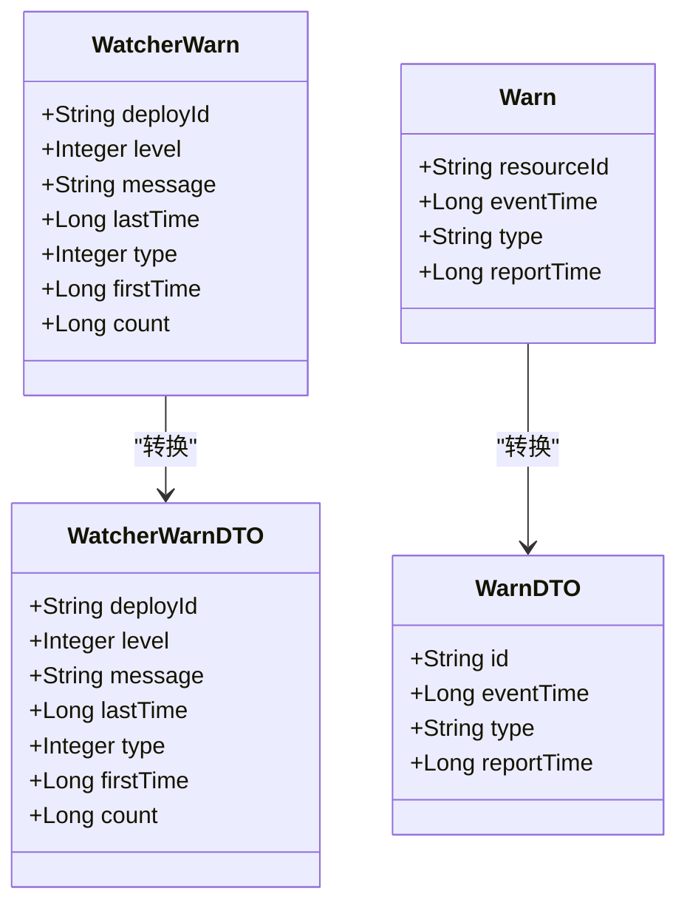
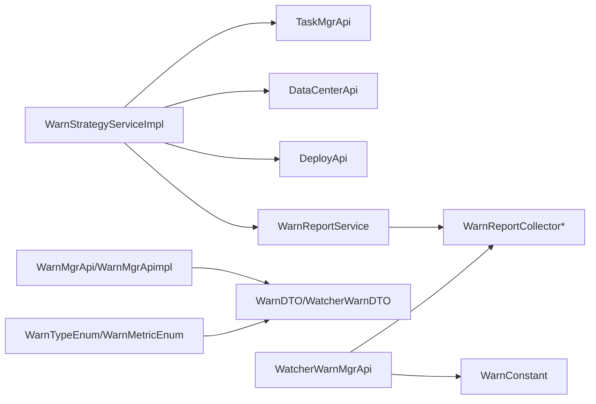

# 告警管理API

<cite>
**本文引用的文件**
- [WarnStrategyServiceImpl.java](file://watcher-agent/src/main/java/com/virtual/cloud/om/agent/service/warn/WarnStrategyServiceImpl.java)
- [WarnReportService.java](file://watcher-agent/src/main/java/com/virtual/cloud/om/agent/service/warn/WarnReportService.java)
- [WarnMgrApi.java](file://watcher-agent/src/main/java/com/virtual/cloud/om/agent/service/warn/WarnMgrApi.java)
- [WarnMgrApimpl.java](file://watcher-agent/src/main/java/com/virtual/cloud/om/agent/service/warn/WarnMgrApimpl.java)
- [WarnStrategyDTO.java](file://watcher-agent/src/main/java/com/virtual/cloud/om/agent/dto/WarnStrategyDTO.java)
- [Warn.java](file://watcher-agent/src/main/java/com/virtual/cloud/om/agent/entity/Warn.java)
- [WatcherWarn.java](file://watcher-agent/src/main/java/com/virtual/cloud/om/agent/entity/WatcherWarn.java)
- [WarnDTO.java](file://watcher-sdk/src/main/java/com/virtual/cloud/om/sdk/dto/WarnDTO.java)
- [WatcherWarnDTO.java](file://watcher-sdk/src/main/java/com/virtual/cloud/om/sdk/dto/WatcherWarnDTO.java)
- [WatcherWarnMgrApi.java](file://watcher-sdk/src/main/java/com/virtual/cloud/om/sdk/api/WatcherWarnMgrApi.java)
- [WarnReportCollector.java](file://watcher-sdk/src/main/java/com/virtual/cloud/om/sdk/api/WarnReportCollector.java)
- [WarnConstant.java](file://watcher-sdk/src/main/java/com/virtual/cloud/om/sdk/constant/warn/WarnConstant.java)
- [WarnTypeEnum.java](file://watcher-sdk/src/main/java/com/virtual/cloud/om/sdk/constant/WarnTypeEnum.java)
- [WarnMetricEnum.java](file://watcher-sdk/src/main/java/com/virtual/cloud/om/sdk/constant/WarnMetricEnum.java)
- [OneStorWarnRealDTO.java](file://watcher-sdk/src/main/java/com/virtual/cloud/om/sdk/dto/dataReport/onestor/OneStorWarnRealDTO.java)
- [DeviceAlarmDTO.java](file://watcher-sdk/src/main/java/com/virtual/cloud/om/sdk/dto/dataReport/workspace/DeviceAlarmDTO.java)
- [WarnInfoDTO.java](file://watcher-sdk/src/main/java/com/virtual/cloud/om/sdk/dto/dataReport/workspace/WarnInfoDTO.java)
</cite>

## 目录
1. [简介](#简介)
2. [项目结构](#项目结构)
3. [核心组件](#核心组件)
4. [架构总览](#架构总览)
5. [详细组件分析](#详细组件分析)
6. [依赖关系分析](#依赖关系分析)
7. [性能考量](#性能考量)
8. [故障排除指南](#故障排除指南)
9. [结论](#结论)
10. [附录](#附录)

## 简介
本文件面向告警管理API，系统性梳理告警规则配置、告警状态查询、告警处理与历史记录管理、通知机制与升级策略等能力。基于仓库中的告警相关实现，重点覆盖以下方面：
- 告警规则配置与下发：策略拉取、定时任务编排、策略变更对比与任务增删
- 告警上报与采集：按策略采集并上报，支持多平台指标
- 告警状态管理：采集端告警状态（级别、类型、首次/最新时间、重复次数）
- 历史与统计：终端侧告警事件、统计与报表字段定义
- 通知与升级：告警级别映射、事件类型枚举与常量约定

说明：
- 当前仓库中未发现名为“/warn/rule”的REST控制器或路由；告警规则的下发与任务编排由内部服务完成，不暴露对外HTTP接口。
- 告警状态查询与处理接口在当前代码中未发现对应控制器或服务实现，建议后续补充。

## 项目结构
告警相关代码主要分布在以下模块：
- watcher-agent：告警策略服务、上报服务、采集端告警实体与管理接口
- watcher-sdk：告警DTO、常量、枚举、采集器抽象类与对外API接口

图表来源
- [WarnStrategyServiceImpl.java:1-304](file://watcher-agent/src/main/java/com/virtual/cloud/om/agent/service/warn/WarnStrategyServiceImpl.java#L1-L304)
- [WarnReportService.java:1-49](file://watcher-agent/src/main/java/com/virtual/cloud/om/agent/service/warn/WarnReportService.java#L1-L49)
- [WarnMgrApi.java:1-28](file://watcher-agent/src/main/java/com/virtual/cloud/om/agent/service/warn/WarnMgrApi.java#L1-L28)
- [WarnMgrApimpl.java:1-50](file://watcher-agent/src/main/java/com/virtual/cloud/om/agent/service/warn/WarnMgrApimpl.java#L1-L50)
- [WarnStrategyDTO.java:1-38](file://watcher-agent/src/main/java/com/virtual/cloud/om/agent/dto/WarnStrategyDTO.java#L1-L38)
- [Warn.java:1-38](file://watcher-agent/src/main/java/com/virtual/cloud/om/agent/entity/Warn.java#L1-L38)
- [WatcherWarn.java:1-48](file://watcher-agent/src/main/java/com/virtual/cloud/om/agent/entity/WatcherWarn.java#L1-L48)
- [WarnReportCollector.java:1-80](file://watcher-sdk/src/main/java/com/virtual/cloud/om/sdk/api/WarnReportCollector.java#L1-L80)
- [WarnDTO.java:1-29](file://watcher-sdk/src/main/java/com/virtual/cloud/om/sdk/dto/WarnDTO.java#L1-L29)
- [WatcherWarnDTO.java:1-38](file://watcher-sdk/src/main/java/com/virtual/cloud/om/sdk/dto/WatcherWarnDTO.java#L1-L38)
- [WatcherWarnMgrApi.java:1-36](file://watcher-sdk/src/main/java/com/virtual/cloud/om/sdk/api/WatcherWarnMgrApi.java#L1-L36)
- [WarnConstant.java:36-92](file://watcher-sdk/src/main/java/com/virtual/cloud/om/sdk/constant/warn/WarnConstant.java#L36-L92)
- [WarnTypeEnum.java](file://watcher-sdk/src/main/java/com/virtual/cloud/om/sdk/constant/WarnTypeEnum.java)
- [WarnMetricEnum.java](file://watcher-sdk/src/main/java/com/virtual/cloud/om/sdk/constant/WarnMetricEnum.java)
- [OneStorWarnRealDTO.java:34-137](file://watcher-sdk/src/main/java/com/virtual/cloud/om/sdk/dto/dataReport/onestor/OneStorWarnRealDTO.java#L34-L137)
- [DeviceAlarmDTO.java:1-39](file://watcher-sdk/src/main/java/com/virtual/cloud/om/sdk/dto/dataReport/workspace/DeviceAlarmDTO.java#L1-L39)
- [WarnInfoDTO.java:30-67](file://watcher-sdk/src/main/java/com/virtual/cloud/om/sdk/dto/dataReport/workspace/WarnInfoDTO.java#L30-L67)

章节来源
- [WarnStrategyServiceImpl.java:1-304](file://watcher-agent/src/main/java/com/virtual/cloud/om/agent/service/warn/WarnStrategyServiceImpl.java#L1-L304)
- [WarnReportService.java:1-49](file://watcher-agent/src/main/java/com/virtual/cloud/om/agent/service/warn/WarnReportService.java#L1-L49)
- [WarnReportCollector.java:1-80](file://watcher-sdk/src/main/java/com/virtual/cloud/om/sdk/api/WarnReportCollector.java#L1-L80)

## 核心组件
- 告警策略服务：负责从数据中心拉取策略、生成一次性与周期性任务、比较策略变更并增删任务
- 告警上报服务：负责按策略采集并上报，当前实现已简化
- 告警管理接口：采集端告警状态读写接口与实现（查询/编辑）
- 告警实体与DTO：采集端告警状态、资源告警状态、历史与统计字段
- 采集器抽象：统一采集入口，按平台与指标返回数据
- 常量与枚举：告警级别、类型、事件名等约定

章节来源
- [WarnStrategyServiceImpl.java:30-304](file://watcher-agent/src/main/java/com/virtual/cloud/om/agent/service/warn/WarnStrategyServiceImpl.java#L30-L304)
- [WarnReportService.java:20-49](file://watcher-agent/src/main/java/com/virtual/cloud/om/agent/service/warn/WarnReportService.java#L20-L49)
- [WarnMgrApi.java:6-28](file://watcher-agent/src/main/java/com/virtual/cloud/om/agent/service/warn/WarnMgrApi.java#L6-L28)
- [WarnMgrApimpl.java:10-50](file://watcher-agent/src/main/java/com/virtual/cloud/om/agent/service/warn/WarnMgrApimpl.java#L10-L50)
- [WarnStrategyDTO.java:10-38](file://watcher-agent/src/main/java/com/virtual/cloud/om/agent/dto/WarnStrategyDTO.java#L10-L38)
- [Warn.java:18-36](file://watcher-agent/src/main/java/com/virtual/cloud/om/agent/entity/Warn.java#L18-L36)
- [WatcherWarn.java:18-46](file://watcher-agent/src/main/java/com/virtual/cloud/om/agent/entity/WatcherWarn.java#L18-L46)
- [WarnReportCollector.java:13-80](file://watcher-sdk/src/main/java/com/virtual/cloud/om/sdk/api/WarnReportCollector.java#L13-L80)
- [WarnConstant.java:36-92](file://watcher-sdk/src/main/java/com/virtual/cloud/om/sdk/constant/warn/WarnConstant.java#L36-L92)
- [WarnTypeEnum.java](file://watcher-sdk/src/main/java/com/virtual/cloud/om/sdk/constant/WarnTypeEnum.java)
- [WarnMetricEnum.java](file://watcher-sdk/src/main/java/com/virtual/cloud/om/sdk/constant/WarnMetricEnum.java)
- [OneStorWarnRealDTO.java:34-137](file://watcher-sdk/src/main/java/com/virtual/cloud/om/sdk/dto/dataReport/onestor/OneStorWarnRealDTO.java#L34-L137)
- [DeviceAlarmDTO.java:1-39](file://watcher-sdk/src/main/java/com/virtual/cloud/om/sdk/dto/dataReport/workspace/DeviceAlarmDTO.java#L1-L39)
- [WarnInfoDTO.java:30-67](file://watcher-sdk/src/main/java/com/virtual/cloud/om/sdk/dto/dataReport/workspace/WarnInfoDTO.java#L30-L67)

## 架构总览
告警管理整体流程：策略下发与任务编排 → 采集与上报 → 状态管理与历史统计。

图表来源
- [WarnStrategyServiceImpl.java:88-179](file://watcher-agent/src/main/java/com/virtual/cloud/om/agent/service/warn/WarnStrategyServiceImpl.java#L88-L179)
- [WarnReportService.java:42-47](file://watcher-agent/src/main/java/com/virtual/cloud/om/agent/service/warn/WarnReportService.java#L42-L47)
- [WarnReportCollector.java:42-70](file://watcher-sdk/src/main/java/com/virtual/cloud/om/sdk/api/WarnReportCollector.java#L42-L70)

## 详细组件分析

### 组件A：告警策略服务（策略拉取与任务编排）
职责
- 从数据中心拉取策略，区分一次性与周期性
- 对比数据库中已有任务与策略差异，动态增删改任务
- 为每个资源维度生成任务ID并注册到任务管理器

关键流程
- 初始化主节点任务与拉取任务
- 解析策略并分组（按resourceId）
- 计算需删除的任务与需新增的任务
- 生成任务ID并注册定时任务

图表来源
- [WarnStrategyServiceImpl.java:88-179](file://watcher-agent/src/main/java/com/virtual/cloud/om/agent/service/warn/WarnStrategyServiceImpl.java#L88-L179)
- [WarnStrategyServiceImpl.java:203-277](file://watcher-agent/src/main/java/com/virtual/cloud/om/agent/service/warn/WarnStrategyServiceImpl.java#L203-L277)

章节来源
- [WarnStrategyServiceImpl.java:54-85](file://watcher-agent/src/main/java/com/virtual/cloud/om/agent/service/warn/WarnStrategyServiceImpl.java#L54-L85)
- [WarnStrategyServiceImpl.java:93-138](file://watcher-agent/src/main/java/com/virtual/cloud/om/agent/service/warn/WarnStrategyServiceImpl.java#L93-L138)
- [WarnStrategyServiceImpl.java:140-179](file://watcher-agent/src/main/java/com/virtual/cloud/om/agent/service/warn/WarnStrategyServiceImpl.java#L140-L179)
- [WarnStrategyServiceImpl.java:246-261](file://watcher-agent/src/main/java/com/virtual/cloud/om/agent/service/warn/WarnStrategyServiceImpl.java#L246-L261)
- [WarnStrategyServiceImpl.java:263-267](file://watcher-agent/src/main/java/com/virtual/cloud/om/agent/service/warn/WarnStrategyServiceImpl.java#L263-L267)
- [WarnStrategyServiceImpl.java:269-288](file://watcher-agent/src/main/java/com/virtual/cloud/om/agent/service/warn/WarnStrategyServiceImpl.java#L269-L288)

### 组件B：告警上报服务（采集与上报）
职责
- 初始化采集器映射
- 提供上报入口（当前实现已简化）

注意
- 上报逻辑在当前版本被简化，仅保留初始化与日志提示

章节来源
- [WarnReportService.java:33-47](file://watcher-agent/src/main/java/com/virtual/cloud/om/agent/service/warn/WarnReportService.java#L33-L47)

### 组件C：采集器抽象（统一采集入口）
职责
- 通过标签解析获取目标ID集合
- 统一data字段构造，调用子类具体采集方法
- 暴露metric标识用于策略匹配

章节来源
- [WarnReportCollector.java:22-70](file://watcher-sdk/src/main/java/com/virtual/cloud/om/sdk/api/WarnReportCollector.java#L22-L70)

### 组件D：告警管理接口与实现（采集端告警状态）
职责
- 采集端告警状态查询与编辑接口
- 实现中包含转换方法（实体与DTO互转）
- 当前实现对查询与编辑均标记为“已禁用”（MongoDB迁移至MySQL单机版）

章节来源
- [WarnMgrApi.java:6-28](file://watcher-agent/src/main/java/com/virtual/cloud/om/agent/service/warn/WarnMgrApi.java#L6-L28)
- [WarnMgrApimpl.java:20-37](file://watcher-agent/src/main/java/com/virtual/cloud/om/agent/service/warn/WarnMgrApimpl.java#L20-L37)
- [WarnMgrApimpl.java:39-50](file://watcher-agent/src/main/java/com/virtual/cloud/om/agent/service/warn/WarnMgrApimpl.java#L39-L50)
- [WatcherWarnMgrApi.java:9-35](file://watcher-sdk/src/main/java/com/virtual/cloud/om/sdk/api/WatcherWarnMgrApi.java#L9-L35)

### 组件E：告警实体与DTO（状态与历史）
- 采集端告警状态：级别、类型、首次/最新时间、重复次数
- 资源告警状态：资源ID、最新告警时间、告警类型、最新上报时间
- 历史与统计：终端告警、Onestor告警、通用告警事件字段

图表来源
- [WatcherWarn.java:18-46](file://watcher-agent/src/main/java/com/virtual/cloud/om/agent/entity/WatcherWarn.java#L18-L46)
- [Warn.java:18-36](file://watcher-agent/src/main/java/com/virtual/cloud/om/agent/entity/Warn.java#L18-L36)
- [WatcherWarnDTO.java:11-38](file://watcher-sdk/src/main/java/com/virtual/cloud/om/sdk/dto/WatcherWarnDTO.java#L11-L38)
- [WarnDTO.java:11-29](file://watcher-sdk/src/main/java/com/virtual/cloud/om/sdk/dto/WarnDTO.java#L11-L29)

章节来源
- [WatcherWarn.java:18-46](file://watcher-agent/src/main/java/com/virtual/cloud/om/agent/entity/WatcherWarn.java#L18-L46)
- [Warn.java:18-36](file://watcher-agent/src/main/java/com/virtual/cloud/om/agent/entity/Warn.java#L18-L36)
- [WatcherWarnDTO.java:11-38](file://watcher-sdk/src/main/java/com/virtual/cloud/om/sdk/dto/WatcherWarnDTO.java#L11-L38)
- [WarnDTO.java:11-29](file://watcher-sdk/src/main/java/com/virtual/cloud/om/sdk/dto/WarnDTO.java#L11-L29)

### 组件F：历史与统计DTO（终端、Onestor、通用）
- 终端告警：设备名、事件类型、状态、首次/最后告警时间、恢复时间、来源、描述、租户信息
- Onestor告警：服务日志、恢复时间、告警级别、模块、时间、内容、状态、确认时间、索引ID、来源、节点池名、级别/类型/对象类别
- 通用告警事件：告警ID、确认状态、级别、类型、名称、来源、时间、描述、次数、确认时间、分类等

章节来源
- [DeviceAlarmDTO.java:1-39](file://watcher-sdk/src/main/java/com/virtual/cloud/om/sdk/dto/dataReport/workspace/DeviceAlarmDTO.java#L1-L39)
- [OneStorWarnRealDTO.java:34-137](file://watcher-sdk/src/main/java/com/virtual/cloud/om/sdk/dto/dataReport/onestor/OneStorWarnRealDTO.java#L34-L137)
- [WarnInfoDTO.java:30-67](file://watcher-sdk/src/main/java/com/virtual/cloud/om/sdk/dto/dataReport/workspace/WarnInfoDTO.java#L30-L67)

## 依赖关系分析
- 策略服务依赖任务管理器、数据中心接口、部署服务、采集器集合
- 上报服务依赖资源接口与采集器集合
- 告警管理接口面向SDK层，提供采集端告警状态读写
- DTO与枚举/常量为跨模块共享的数据契约

图表来源
- [WarnStrategyServiceImpl.java:36-52](file://watcher-agent/src/main/java/com/virtual/cloud/om/agent/service/warn/WarnStrategyServiceImpl.java#L36-L52)
- [WarnReportService.java:28-39](file://watcher-agent/src/main/java/com/virtual/cloud/om/agent/service/warn/WarnReportService.java#L28-L39)
- [WarnMgrApi.java:3-4](file://watcher-agent/src/main/java/com/virtual/cloud/om/agent/service/warn/WarnMgrApi.java#L3-L4)
- [WatcherWarnMgrApi.java:3-4](file://watcher-sdk/src/main/java/com/virtual/cloud/om/sdk/api/WatcherWarnMgrApi.java#L3-L4)
- [WarnConstant.java:36-92](file://watcher-sdk/src/main/java/com/virtual/cloud/om/sdk/constant/warn/WarnConstant.java#L36-L92)
- [WarnTypeEnum.java](file://watcher-sdk/src/main/java/com/virtual/cloud/om/sdk/constant/WarnTypeEnum.java)
- [WarnMetricEnum.java](file://watcher-sdk/src/main/java/com/virtual/cloud/om/sdk/constant/WarnMetricEnum.java)

章节来源
- [WarnStrategyServiceImpl.java:36-52](file://watcher-agent/src/main/java/com/virtual/cloud/om/agent/service/warn/WarnStrategyServiceImpl.java#L36-L52)
- [WarnReportService.java:28-39](file://watcher-agent/src/main/java/com/virtual/cloud/om/agent/service/warn/WarnReportService.java#L28-L39)
- [WarnMgrApi.java:3-4](file://watcher-agent/src/main/java/com/virtual/cloud/om/agent/service/warn/WarnMgrApi.java#L3-L4)
- [WatcherWarnMgrApi.java:3-4](file://watcher-sdk/src/main/java/com/virtual/cloud/om/sdk/api/WatcherWarnMgrApi.java#L3-L4)
- [WarnConstant.java:36-92](file://watcher-sdk/src/main/java/com/virtual/cloud/om/sdk/constant/warn/WarnConstant.java#L36-L92)

## 性能考量
- 策略任务分组与去重：按resourceId分组后进行哈希对比，避免重复任务
- 任务注册间隔：策略分组后插入任务存在固定等待，降低并发压力
- 采集器初始化：按枚举构建映射，减少运行时查找成本
- 上报简化：当前版本仅保留初始化，避免额外IO开销

章节来源
- [WarnStrategyServiceImpl.java:246-261](file://watcher-agent/src/main/java/com/virtual/cloud/om/agent/service/warn/WarnStrategyServiceImpl.java#L246-L261)
- [WarnReportService.java:33-40](file://watcher-agent/src/main/java/com/virtual/cloud/om/agent/service/warn/WarnReportService.java#L33-L40)

## 故障排除指南
常见问题与定位建议
- 策略拉取失败
  - 检查主节点判定与定时任务初始化是否成功
  - 关注策略为空时的任务清理逻辑
- 任务未生效或重复
  - 核对resourceId分组与哈希对比逻辑
  - 确认任务ID生成规则与MD5一致性
- 上报未触发
  - 确认采集器映射是否正确初始化
  - 检查策略unit与frequency是否符合预期
- 告警状态查询/编辑无效
  - 当前实现标记为“已禁用”，需评估迁移至MySQL后的接口补全

章节来源
- [WarnStrategyServiceImpl.java:54-69](file://watcher-agent/src/main/java/com/virtual/cloud/om/agent/service/warn/WarnStrategyServiceImpl.java#L54-L69)
- [WarnStrategyServiceImpl.java:93-138](file://watcher-agent/src/main/java/com/virtual/cloud/om/agent/service/warn/WarnStrategyServiceImpl.java#L93-L138)
- [WarnReportService.java:33-40](file://watcher-agent/src/main/java/com/virtual/cloud/om/agent/service/warn/WarnReportService.java#L33-L40)
- [WarnMgrApimpl.java:20-37](file://watcher-agent/src/main/java/com/virtual/cloud/om/agent/service/warn/WarnMgrApimpl.java#L20-L37)

## 结论
- 告警规则配置与下发：已在策略服务中完整实现，支持一次性与周期性策略、任务增删改与资源维度分组
- 告警上报：采集器抽象完善，当前版本上报逻辑已简化
- 告警状态管理：采集端状态接口存在但实现标记为“已禁用”，建议后续补全
- 历史与统计：终端、Onestor与通用告警事件字段完备，可支撑报表与统计需求
- 通知与升级：通过告警级别与类型常量约定，建议结合业务扩展通知渠道与升级策略

## 附录

### 接口与端点说明
- 告警规则配置
  - 当前未发现名为“/warn/rule”的控制器或路由；策略下发与任务编排由内部服务完成
- 告警状态查询与处理
  - 当前未发现对应控制器或服务实现；采集端状态接口位于SDK层，实现位于agent层且标记为“已禁用”
- 历史与统计
  - 终端告警：见终端告警DTO字段
  - Onestor告警：见Onestor告警DTO字段
  - 通用告警事件：见通用告警事件DTO字段

章节来源
- [WarnStrategyServiceImpl.java:88-179](file://watcher-agent/src/main/java/com/virtual/cloud/om/agent/service/warn/WarnStrategyServiceImpl.java#L88-L179)
- [WarnMgrApi.java:6-28](file://watcher-agent/src/main/java/com/virtual/cloud/om/agent/service/warn/WarnMgrApi.java#L6-L28)
- [WarnMgrApimpl.java:20-37](file://watcher-agent/src/main/java/com/virtual/cloud/om/agent/service/warn/WarnMgrApimpl.java#L20-L37)
- [DeviceAlarmDTO.java:1-39](file://watcher-sdk/src/main/java/com/virtual/cloud/om/sdk/dto/dataReport/workspace/DeviceAlarmDTO.java#L1-L39)
- [OneStorWarnRealDTO.java:34-137](file://watcher-sdk/src/main/java/com/virtual/cloud/om/sdk/dto/dataReport/onestor/OneStorWarnRealDTO.java#L34-L137)
- [WarnInfoDTO.java:30-67](file://watcher-sdk/src/main/java/com/virtual/cloud/om/sdk/dto/dataReport/workspace/WarnInfoDTO.java#L30-L67)

### 告警规则配置示例（概念性）
- 平台：workspace/cas/uis
- 指标：如CPU使用率、内存使用率、磁盘使用率
- 频率：单位与数值（分钟/小时等）
- 标签：按资源ID过滤
- 策略哈希：用于任务去重与变更检测

章节来源
- [WarnStrategyDTO.java:10-38](file://watcher-agent/src/main/java/com/virtual/cloud/om/agent/dto/WarnStrategyDTO.java#L10-L38)
- [WarnStrategyServiceImpl.java:269-288](file://watcher-agent/src/main/java/com/virtual/cloud/om/agent/service/warn/WarnStrategyServiceImpl.java#L269-L288)

### 告警处理流程（概念性）
- 策略下发 → 任务注册 → 周期执行 → 采集上报 → 状态更新 → 历史归档

章节来源
- [WarnStrategyServiceImpl.java:88-179](file://watcher-agent/src/main/java/com/virtual/cloud/om/agent/service/warn/WarnStrategyServiceImpl.java#L88-L179)
- [WarnReportService.java:42-47](file://watcher-agent/src/main/java/com/virtual/cloud/om/agent/service/warn/WarnReportService.java#L42-L47)

### 通知机制与升级策略（建议）
- 告警级别映射：参考告警常量中的级别定义
- 事件类型：参考告警类型枚举
- 升级策略：建议按级别阈值与重复次数进行升级与抑制

章节来源
- [WarnConstant.java:36-92](file://watcher-sdk/src/main/java/com/virtual/cloud/om/sdk/constant/warn/WarnConstant.java#L36-L92)
- [WarnTypeEnum.java](file://watcher-sdk/src/main/java/com/virtual/cloud/om/sdk/constant/WarnTypeEnum.java)
- [WarnMetricEnum.java](file://watcher-sdk/src/main/java/com/virtual/cloud/om/sdk/constant/WarnMetricEnum.java)