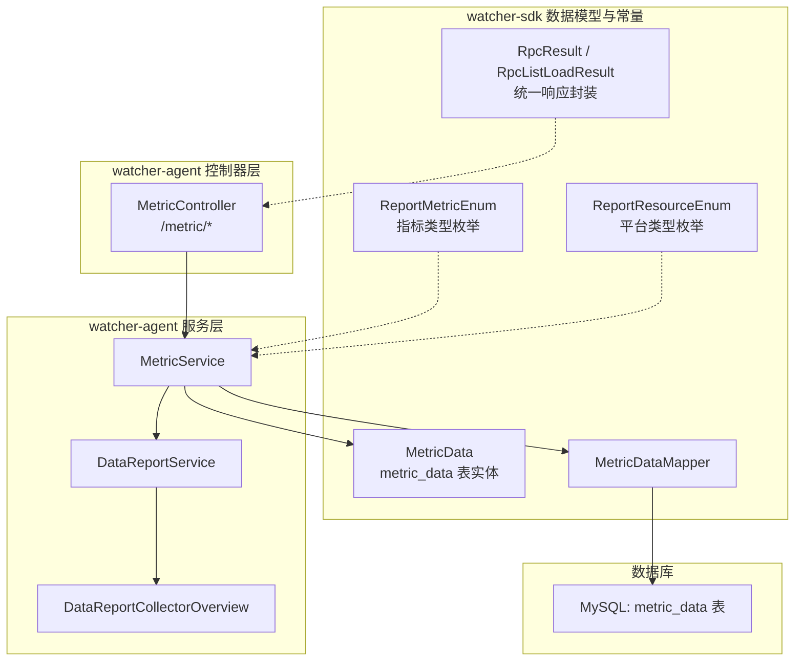
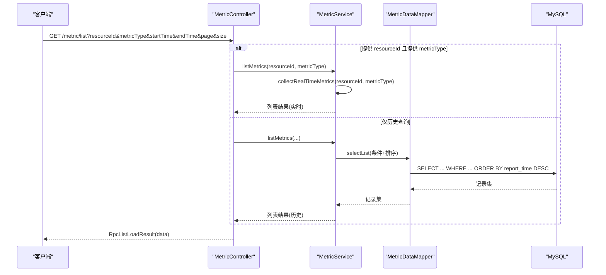
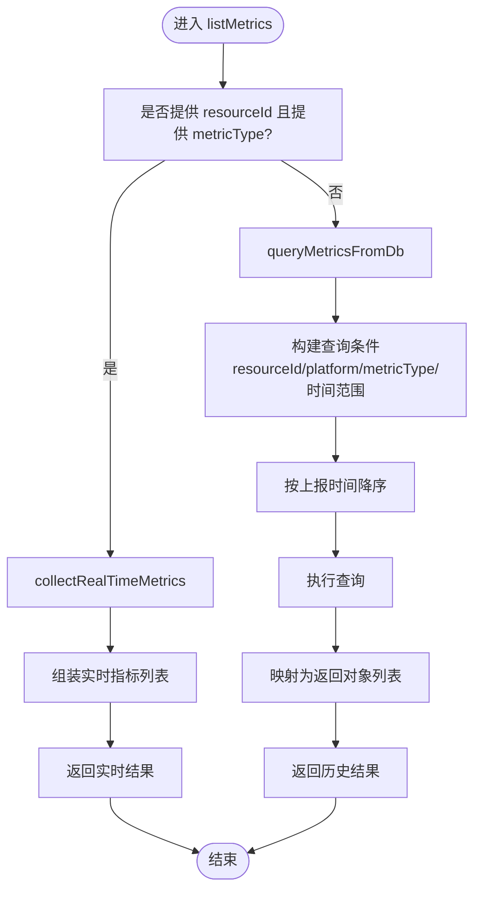
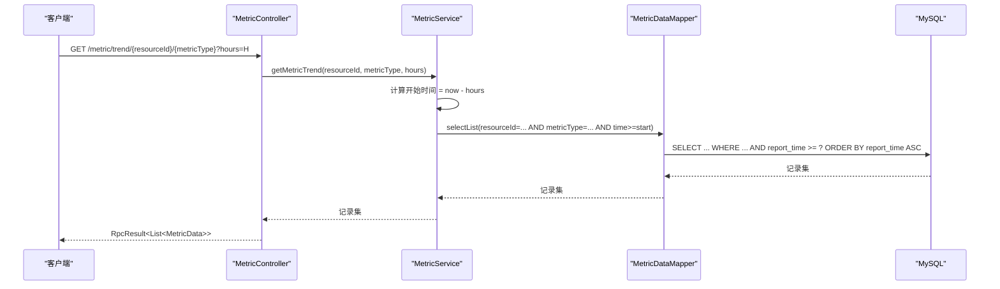
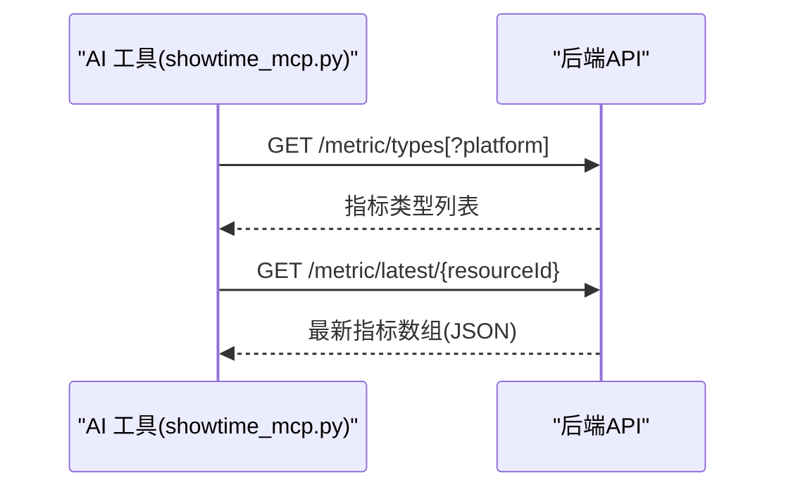
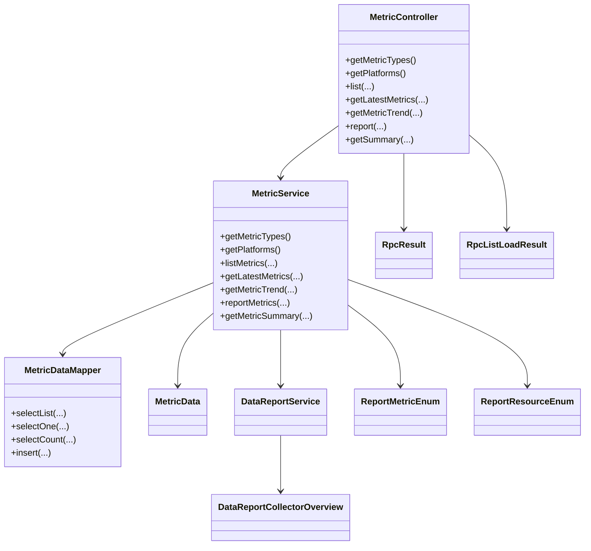

# 指标查询API

<cite>
**本文引用的文件**
- [MetricController.java](file://watcher-agent/src/main/java/com/virtual/cloud/om/agent/controller/MetricController.java)
- [MetricService.java](file://watcher-agent/src/main/java/com/virtual/cloud/om/agent/service/report/MetricService.java)
- [MetricData.java](file://watcher-sdk/src/main/java/com/virtual/cloud/om/sdk/entity/mysql/MetricData.java)
- [MetricDataMapper.java](file://watcher-sdk/src/main/java/com/virtual/cloud/om/sdk/mapper/MetricDataMapper.java)
- [ReportMetricEnum.java](file://watcher-sdk/src/main/java/com/virtual/cloud/om/sdk/constant/report/ReportMetricEnum.java)
- [ReportResourceEnum.java](file://watcher-sdk/src/main/java/com/virtual/cloud/om/sdk/constant/ReportResourceEnum.java)
- [RpcResult.java](file://watcher-sdk/src/main/java/com/virtual/cloud/om/sdk/dto/RpcResult.java)
- [RpcListLoadResult.java](file://watcher-sdk/src/main/java/com/virtual/cloud/om/sdk/dto/RpcListLoadResult.java)
- [DataReportService.java](file://watcher-agent/src/main/java/com/virtual/cloud/om/agent/service/report/DataReportService.java)
- [DataReportCollectorOverview.java](file://watcher-agent/src/main/java/com/virtual/cloud/om/agent/service/DataReportCollectorOverview.java)
- [showtime_mcp.py](file://watcher-ai/src/showtime_mcp.py)
</cite>

## 目录
1. [简介](#简介)
2. [项目结构](#项目结构)
3. [核心组件](#核心组件)
4. [架构总览](#架构总览)
5. [详细组件分析](#详细组件分析)
6. [依赖分析](#依赖分析)
7. [性能考虑](#性能考虑)
8. [故障排查指南](#故障排查指南)
9. [结论](#结论)
10. [附录](#附录)

## 简介
本文件为指标查询API的完整接口文档，覆盖主机性能指标、存储指标、网络指标以及平台版本信息等查询能力。内容包括：
- 所有监控指标查询端点的请求方法、路径、参数与返回格式
- 时间范围、资源标识符、指标类型过滤等查询参数说明
- 分页查询机制、排序规则与数据格式化选项
- 单指标查询、多指标组合查询与趋势分析查询示例
- 指标数据的时间序列格式、精度要求与缓存策略
- 性能优化建议与大数据量查询最佳实践

## 项目结构
指标查询API位于 watcher-agent 模块的控制器层，业务逻辑由 MetricService 提供，并通过 MyBatis-Plus 访问 MySQL 中的 metric_data 表；指标类型与平台类型来源于 SDK 常量枚举。

图表来源
- [MetricController.java:19-102](file://watcher-agent/src/main/java/com/virtual/cloud/om/agent/controller/MetricController.java#L19-L102)
- [MetricService.java:26-266](file://watcher-agent/src/main/java/com/virtual/cloud/om/agent/service/report/MetricService.java#L26-L266)
- [MetricData.java:14-42](file://watcher-sdk/src/main/java/com/virtual/cloud/om/sdk/entity/mysql/MetricData.java#L14-L42)
- [MetricDataMapper.java:10-13](file://watcher-sdk/src/main/java/com/virtual/cloud/om/sdk/mapper/MetricDataMapper.java#L10-L13)
- [ReportMetricEnum.java:9-117](file://watcher-sdk/src/main/java/com/virtual/cloud/om/sdk/constant/report/ReportMetricEnum.java#L9-L117)
- [ReportResourceEnum.java:3-6](file://watcher-sdk/src/main/java/com/virtual/cloud/om/sdk/constant/ReportResourceEnum.java#L3-L6)
- [RpcResult.java:3-87](file://watcher-sdk/src/main/java/com/virtual/cloud/om/sdk/dto/RpcResult.java#L3-L87)
- [RpcListLoadResult.java:9-56](file://watcher-sdk/src/main/java/com/virtual/cloud/om/sdk/dto/RpcListLoadResult.java#L9-L56)

章节来源
- [MetricController.java:19-102](file://watcher-agent/src/main/java/com/virtual/cloud/om/agent/controller/MetricController.java#L19-L102)
- [MetricService.java:26-266](file://watcher-agent/src/main/java/com/virtual/cloud/om/agent/service/report/MetricService.java#L26-L266)
- [MetricData.java:14-42](file://watcher-sdk/src/main/java/com/virtual/cloud/om/sdk/entity/mysql/MetricData.java#L14-L42)
- [MetricDataMapper.java:10-13](file://watcher-sdk/src/main/java/com/virtual/cloud/om/sdk/mapper/MetricDataMapper.java#L10-L13)
- [ReportMetricEnum.java:9-117](file://watcher-sdk/src/main/java/com/virtual/cloud/om/sdk/constant/report/ReportMetricEnum.java#L9-L117)
- [ReportResourceEnum.java:3-6](file://watcher-sdk/src/main/java/com/virtual/cloud/om/sdk/constant/ReportResourceEnum.java#L3-L6)
- [RpcResult.java:3-87](file://watcher-sdk/src/main/java/com/virtual/cloud/om/sdk/dto/RpcResult.java#L3-L87)
- [RpcListLoadResult.java:9-56](file://watcher-sdk/src/main/java/com/virtual/cloud/om/sdk/dto/RpcListLoadResult.java#L9-L56)

## 核心组件
- 指标控制器：提供指标类型、平台类型查询，指标列表查询，最新指标查询，趋势查询，指标上报与资源指标汇总。
- 指标服务：实现查询逻辑（实时采集或数据库查询）、趋势分析、汇总统计与上报处理。
- 数据模型与映射：MetricData 实体映射 metric_data 表，MetricDataMapper 提供基础查询能力。
- 枚举与常量：ReportMetricEnum 定义指标类型与静态/动态属性；ReportResourceEnum 定义平台类型。
- 统一响应：RpcResult/RpcListLoadResult 封装统一的响应结构。

章节来源
- [MetricController.java:29-101](file://watcher-agent/src/main/java/com/virtual/cloud/om/agent/controller/MetricController.java#L29-L101)
- [MetricService.java:35-264](file://watcher-agent/src/main/java/com/virtual/cloud/om/agent/service/report/MetricService.java#L35-L264)
- [MetricData.java:14-42](file://watcher-sdk/src/main/java/com/virtual/cloud/om/sdk/entity/mysql/MetricData.java#L14-L42)
- [MetricDataMapper.java:10-13](file://watcher-sdk/src/main/java/com/virtual/cloud/om/sdk/mapper/MetricDataMapper.java#L10-L13)
- [ReportMetricEnum.java:9-117](file://watcher-sdk/src/main/java/com/virtual/cloud/om/sdk/constant/report/ReportMetricEnum.java#L9-L117)
- [ReportResourceEnum.java:3-6](file://watcher-sdk/src/main/java/com/virtual/cloud/om/sdk/constant/ReportResourceEnum.java#L3-L6)
- [RpcResult.java:3-87](file://watcher-sdk/src/main/java/com/virtual/cloud/om/sdk/dto/RpcResult.java#L3-L87)
- [RpcListLoadResult.java:9-56](file://watcher-sdk/src/main/java/com/virtual/cloud/om/sdk/dto/RpcListLoadResult.java#L9-L56)

## 架构总览
指标查询API采用“控制器-服务-数据访问”的分层设计，支持两类数据来源：
- 实时采集：当提供 resourceId 与 metricType 时，通过 DataReportService 调用对应采集器即时采集。
- 历史查询：基于时间范围与过滤条件从 metric_data 表查询并按上报时间倒序返回。

图表来源
- [MetricController.java:41-57](file://watcher-agent/src/main/java/com/virtual/cloud/om/agent/controller/MetricController.java#L41-L57)
- [MetricService.java:70-158](file://watcher-agent/src/main/java/com/virtual/cloud/om/agent/service/report/MetricService.java#L70-L158)
- [MetricDataMapper.java:10-13](file://watcher-sdk/src/main/java/com/virtual/cloud/om/sdk/mapper/MetricDataMapper.java#L10-L13)

## 详细组件分析

### 指标查询端点一览
- GET /metric/types
  - 功能：查询支持的指标类型列表（含静态/动态标记）
  - 返回：RpcResult<List<指标类型>>
- GET /metric/platforms
  - 功能：查询支持的平台类型列表
  - 返回：RpcResult<List<平台类型>>
- GET /metric/list
  - 功能：查询指标数据列表（支持实时采集与历史查询）
  - 参数：resourceId、platform、metricType、startTime、endTime、page、size
  - 返回：RpcListLoadResult<List<指标项>>
- GET /metric/latest/{resourceId}
  - 功能：查询资源最新指标数据（按指标类型取最新一条）
  - 返回：RpcResult<List<MetricData>>
- GET /metric/trend/{resourceId}/{metricType}?hours=...
  - 功能：查询指标趋势数据（按上报时间升序）
  - 返回：RpcResult<List<MetricData>>
- POST /metric/report
  - 功能：上报指标数据
  - 请求体：List<MetricData>
  - 返回：RpcResult<String>
- GET /metric/summary/{resourceId}
  - 功能：获取资源指标汇总（总数、最后上报时间等）
  - 返回：RpcResult<Map<String,Object>>

章节来源
- [MetricController.java:29-101](file://watcher-agent/src/main/java/com/virtual/cloud/om/agent/controller/MetricController.java#L29-L101)
- [RpcResult.java:3-87](file://watcher-sdk/src/main/java/com/virtual/cloud/om/sdk/dto/RpcResult.java#L3-L87)
- [RpcListLoadResult.java:9-56](file://watcher-sdk/src/main/java/com/virtual/cloud/om/sdk/dto/RpcListLoadResult.java#L9-L56)

### 查询参数与过滤规则
- 资源标识符
  - resourceId：用于定位具体资源，配合 metricType 可触发实时采集
- 平台类型
  - platform：过滤平台来源（如 cas、workspace、onestor 等）
- 指标类型
  - metricType：过滤具体指标类型（如 cpu_usage、mem_usage、disk_iops 等）
- 时间范围
  - startTime、endTime：按上报时间过滤（格式：ISO-8601 字符串）
- 分页与排序
  - page、size：分页参数（page 默认 0，size 默认 100）
  - 历史查询默认按上报时间降序；趋势查询按上报时间升序
- 实时采集优先
  - 当同时提供 resourceId 与 metricType 时，直接走实时采集流程，忽略 platform、startTime、endTime 的过滤作用

章节来源
- [MetricController.java:41-78](file://watcher-agent/src/main/java/com/virtual/cloud/om/agent/controller/MetricController.java#L41-L78)
- [MetricService.java:70-158](file://watcher-agent/src/main/java/com/virtual/cloud/om/agent/service/report/MetricService.java#L70-L158)

### 数据模型与字段说明
- MetricData（metric_data 表）
  - 关键字段：resourceId、resourceIp、platform、metricType、metricName、metricValue、metricUnit、tags、reportTime、createTime
  - 用途：存储上报的指标数据与元信息
- 返回数据格式
  - 历史查询：返回包含 id、metricName、metricType、metricValue、metricUnit、resourceId、platform、reportTime 的对象列表
  - 最新指标：返回 MetricData 列表（每种指标类型各取最新一条）
  - 趋势查询：返回 MetricData 列表（按上报时间升序）

章节来源
- [MetricData.java:14-42](file://watcher-sdk/src/main/java/com/virtual/cloud/om/sdk/entity/mysql/MetricData.java#L14-L42)
- [MetricService.java:118-158](file://watcher-agent/src/main/java/com/virtual/cloud/om/agent/service/report/MetricService.java#L118-L158)

### 实时采集与历史查询流程

图表来源
- [MetricService.java:70-158](file://watcher-agent/src/main/java/com/virtual/cloud/om/agent/service/report/MetricService.java#L70-L158)

### 趋势分析流程

图表来源
- [MetricController.java:69-78](file://watcher-agent/src/main/java/com/virtual/cloud/om/agent/controller/MetricController.java#L69-L78)
- [MetricService.java:197-207](file://watcher-agent/src/main/java/com/virtual/cloud/om/agent/service/report/MetricService.java#L197-L207)
- [MetricDataMapper.java:10-13](file://watcher-sdk/src/main/java/com/virtual/cloud/om/sdk/mapper/MetricDataMapper.java#L10-L13)

### 指标类型与平台类型
- 指标类型（部分示例）
  - 主机性能：cpu_usage、mem_usage、disk_iops、disk_latency、disk_throughput、net_throughput 等
  - 存储指标：storage_iops、storage_bandwidth、node_*、host_*、diskpool_* 等
  - 平台版本：resource_plat_version
  - 静态指标：描述性信息，如 host_basic、cluster_basic 等
- 平台类型
  - 支持 cas、workspace、onestor、hccAgent、normal_host 等

章节来源
- [ReportMetricEnum.java:9-117](file://watcher-sdk/src/main/java/com/virtual/cloud/om/sdk/constant/report/ReportMetricEnum.java#L9-L117)
- [ReportResourceEnum.java:3-6](file://watcher-sdk/src/main/java/com/virtual/cloud/om/sdk/constant/ReportResourceEnum.java#L3-L6)
- [MetricService.java:35-63](file://watcher-agent/src/main/java/com/virtual/cloud/om/agent/service/report/MetricService.java#L35-L63)

### 统一响应结构
- 成功：RpcResult.success(data)/RpcListLoadResult.success(list)
- 失败：RpcResult.fail(message)/RpcListLoadResult.fail(code,message)
- 部分成功/错误：对应 fail/partialSuccess/error 方法族

章节来源
- [RpcResult.java:3-87](file://watcher-sdk/src/main/java/com/virtual/cloud/om/sdk/dto/RpcResult.java#L3-L87)
- [RpcListLoadResult.java:9-56](file://watcher-sdk/src/main/java/com/virtual/cloud/om/sdk/dto/RpcListLoadResult.java#L9-L56)

### 实时采集链路（AI工具对接）
AI 工具通过 /metric/types 与 /metric/latest/{resourceId} 等端点获取指标类型与最新指标，内部以异步方式调用后端 API 并解析返回。

图表来源
- [showtime_mcp.py:339-343](file://watcher-ai/src/showtime_mcp.py#L339-L343)
- [showtime_mcp.py:544-549](file://watcher-ai/src/showtime_mcp.py#L544-L549)

## 依赖分析
- 控制器依赖服务层，服务层依赖数据访问层与采集服务
- 指标类型与平台类型来自 SDK 枚举，服务层在运行时生成可查询的类型列表
- 采集器注册通过 DataReportCollectorOverview 在应用启动时完成映射

图表来源
- [MetricController.java:26-101](file://watcher-agent/src/main/java/com/virtual/cloud/om/agent/controller/MetricController.java#L26-L101)
- [MetricService.java:28-30](file://watcher-agent/src/main/java/com/virtual/cloud/om/agent/service/report/MetricService.java#L28-L30)
- [MetricDataMapper.java:10-13](file://watcher-sdk/src/main/java/com/virtual/cloud/om/sdk/mapper/MetricDataMapper.java#L10-L13)
- [MetricData.java:14-42](file://watcher-sdk/src/main/java/com/virtual/cloud/om/sdk/entity/mysql/MetricData.java#L14-L42)
- [DataReportService.java:186-273](file://watcher-agent/src/main/java/com/virtual/cloud/om/agent/service/report/DataReportService.java#L186-L273)
- [DataReportCollectorOverview.java:23-44](file://watcher-agent/src/main/java/com/virtual/cloud/om/agent/service/DataReportCollectorOverview.java#L23-L44)
- [ReportMetricEnum.java:9-117](file://watcher-sdk/src/main/java/com/virtual/cloud/om/sdk/constant/report/ReportMetricEnum.java#L9-L117)
- [ReportResourceEnum.java:3-6](file://watcher-sdk/src/main/java/com/virtual/cloud/om/sdk/constant/ReportResourceEnum.java#L3-L6)
- [RpcResult.java:3-87](file://watcher-sdk/src/main/java/com/virtual/cloud/om/sdk/dto/RpcResult.java#L3-L87)
- [RpcListLoadResult.java:9-56](file://watcher-sdk/src/main/java/com/virtual/cloud/om/sdk/dto/RpcListLoadResult.java#L9-L56)

## 性能考虑
- 查询优化
  - 历史查询默认按上报时间降序，建议结合时间范围与指标类型精确过滤，减少扫描
  - 分页参数 page 与 size 控制返回量，默认 100 条，大数据量场景建议缩小 size 或增加时间窗口
- 实时采集
  - 仅在提供 resourceId 与 metricType 时启用实时采集，避免不必要的全量扫描
  - 实时采集通过 DataReportService 并行聚合多种类型，注意资源与线程池配置
- 存储与索引
  - 建议在 metric_data 表上对 resourceId、metricType、reportTime 建立复合索引以提升查询性能
- 缓存策略
  - 最新指标接口按指标类型取最新记录，适合短期缓存（如 1 分钟）以降低数据库压力
  - 趋势查询建议客户端缓存近期数据，避免重复拉取相同时间段
- 大数据量最佳实践
  - 优先使用时间范围与指标类型过滤
  - 分页拉取，避免一次性加载过多数据
  - 对趋势分析使用更长的时间间隔聚合（如每 5 分钟），减少点数

## 故障排查指南
- 资源不存在
  - 最新指标与资源汇总接口在资源不存在时返回失败状态，请检查 resourceId 是否正确
- 实时采集异常
  - 当提供 resourceId 与 metricType 时，若采集器未注册或不可用，实时采集会返回空结果或错误
  - 检查 DataReportCollectorOverview 是否已注册对应采集器
- 响应结构
  - 使用 RpcResult/RpcListLoadResult 的状态码与消息判断请求是否成功
- 日志定位
  - 控制器与服务层均输出详细日志，便于定位问题

章节来源
- [MetricController.java:61-67](file://watcher-agent/src/main/java/com/virtual/cloud/om/agent/controller/MetricController.java#L61-L67)
- [MetricController.java:95-101](file://watcher-agent/src/main/java/com/virtual/cloud/om/agent/controller/MetricController.java#L95-L101)
- [MetricService.java:163-192](file://watcher-agent/src/main/java/com/virtual/cloud/om/agent/service/report/MetricService.java#L163-L192)
- [DataReportCollectorOverview.java:23-44](file://watcher-agent/src/main/java/com/virtual/cloud/om/agent/service/DataReportCollectorOverview.java#L23-L44)
- [RpcResult.java:31-45](file://watcher-sdk/src/main/java/com/virtual/cloud/om/sdk/dto/RpcResult.java#L31-L45)

## 结论
指标查询API提供了从实时采集到历史查询的完整能力，支持主机、存储、网络等多维度指标的查询与趋势分析。通过明确的过滤参数、分页与排序机制，以及统一的响应结构，能够满足不同场景下的监控需求。建议在生产环境中结合索引优化、缓存策略与分页拉取，确保高并发与大数据量下的稳定性能。

## 附录

### 接口清单与示例指引
- 查询支持的指标类型
  - GET /metric/types
  - 示例：GET /metric/types?platform=cas
- 查询支持的平台类型
  - GET /metric/platforms
- 查询指标数据列表
  - GET /metric/list
  - 示例：GET /metric/list?resourceId=host-001&metricType=cpu_usage&startTime=2024-01-01T00:00:00&endTime=2024-01-02T00:00:00&page=0&size=50
- 查询资源最新指标
  - GET /metric/latest/{resourceId}
  - 示例：GET /metric/latest/host-001
- 查询指标趋势
  - GET /metric/trend/{resourceId}/{metricType}?hours=24
  - 示例：GET /metric/trend/host-001/cpu_usage?hours=24
- 上报指标数据
  - POST /metric/report
  - 请求体：List<MetricData>
- 获取资源指标汇总
  - GET /metric/summary/{resourceId}
  - 示例：GET /metric/summary/host-001

章节来源
- [MetricController.java:29-101](file://watcher-agent/src/main/java/com/virtual/cloud/om/agent/controller/MetricController.java#L29-L101)
- [showtime_mcp.py:339-343](file://watcher-ai/src/showtime_mcp.py#L339-L343)
- [showtime_mcp.py:544-549](file://watcher-ai/src/showtime_mcp.py#L544-L549)
- [showtime_mcp.py:440-443](file://watcher-ai/src/showtime_mcp.py#L440-L443)