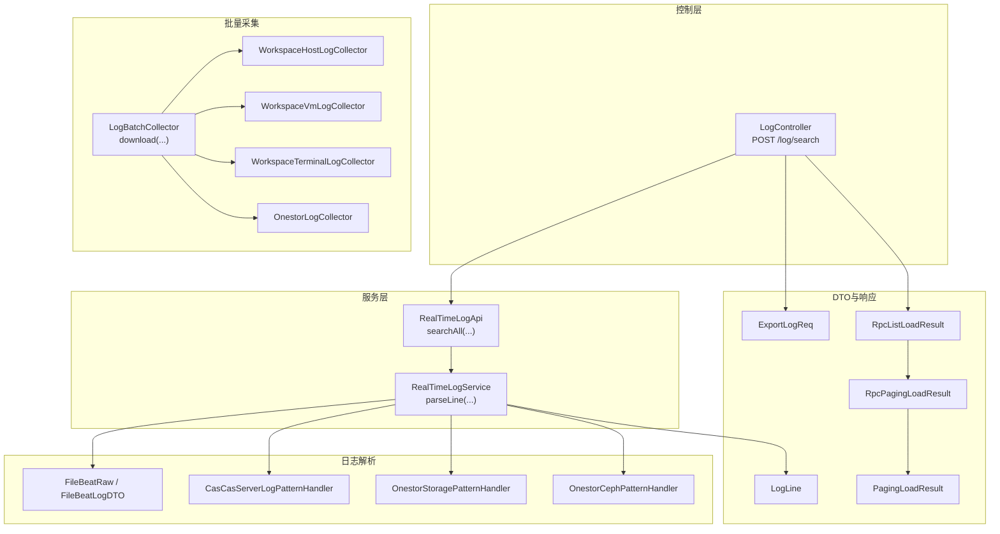
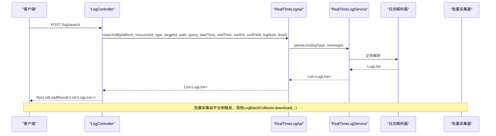
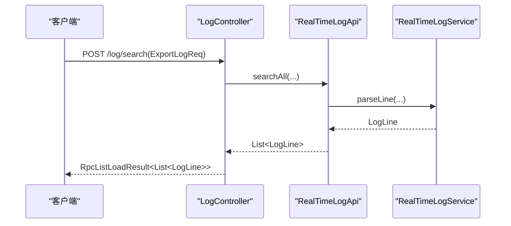
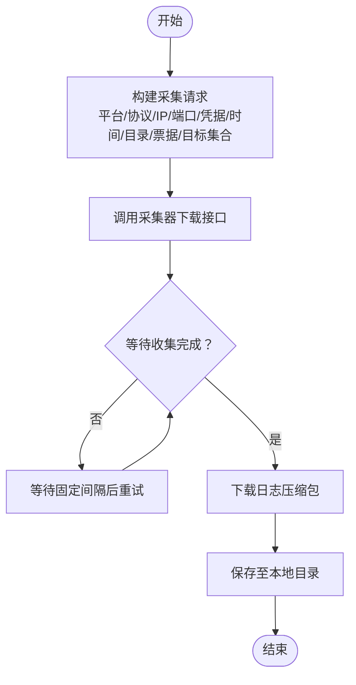
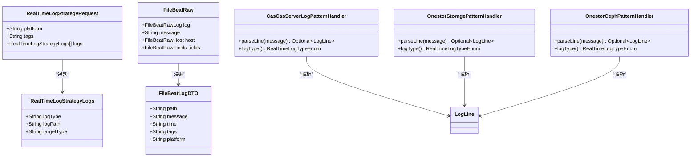
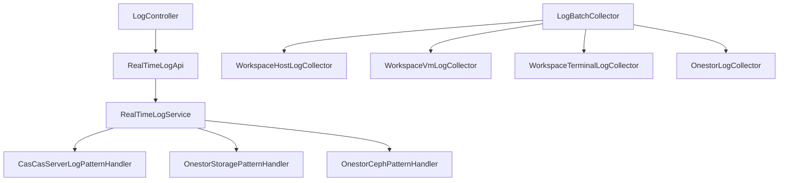

# 日志查询API

<cite>
**本文引用的文件**
- [LogController.java](file://watcher-agent/src/main/java/com/virtual/cloud/om/agent/controller/LogController.java)
- [RealTimeLogApi.java](file://watcher-sdk/src/main/java/com/virtual/cloud/om/sdk/api/RealTimeLogApi.java)
- [ExportLogReq.java](file://watcher-sdk/src/main/java/com/virtual/cloud/om/sdk/dto/ExportLogReq.java)
- [LogLine.java](file://watcher-sdk/src/main/java/com/virtual/cloud/om/sdk/dto/LogLine.java)
- [RpcListLoadResult.java](file://watcher-sdk/src/main/java/com/virtual/cloud/om/sdk/dto/RpcListLoadResult.java)
- [RpcPagingLoadResult.java](file://watcher-sdk/src/main/java/com/virtual/cloud/om/sdk/dto/RpcPagingLoadResult.java)
- [PagingLoadResult.java](file://watcher-sdk/src/main/java/com/virtual/cloud/om/sdk/dto/PagingLoadResult.java)
- [RealTimeLogStrategyRequest.java](file://watcher-sdk/src/main/java/com/virtual/cloud/om/sdk/dto/RealTimeLogStrategyRequest.java)
- [RealTimeLogStrategyLogs.java](file://watcher-sdk/src/main/java/com/virtual/cloud/om/sdk/dto/RealTimeLogStrategyLogs.java)
- [FileBeatLogDTO.java](file://watcher-sdk/src/main/java/com/virtual/cloud/om/sdk/dto/FileBeatLogDTO.java)
- [FileBeatRaw.java](file://watcher-sdk/src/main/java/com/virtual/cloud/om/sdk/dto/FileBeatRaw.java)
- [FileBeatRawLog.java](file://watcher-sdk/src/main/java/com/virtual/cloud/om/sdk/dto/FileBeatRawLog.java)
- [FileBeatRawLogFile.java](file://watcher-sdk/src/main/java/com/virtual/cloud/om/sdk/dto/FileBeatRawLogFile.java)
- [FileBeatRawHost.java](file://watcher-sdk/src/main/java/com/virtual/cloud/om/sdk/dto/FileBeatRawHost.java)
- [FileBeatRawFields.java](file://watcher-sdk/src/main/java/com/virtual/cloud/om/sdk/dto/FileBeatRawFields.java)
- [LogBatchCollector.java](file://watcher-sdk/src/main/java/com/virtual/cloud/om/sdk/api/LogBatchCollector.java)
- [WorkspaceHostLogCollector.java](file://watcher-workspace/src/main/java/com/virtual/cloud/om/workspace/service/batchlog/WorkspaceHostLogCollector.java)
- [WorkspaceVmLogCollector.java](file://watcher-workspace/src/main/java/com/virtual/cloud/om/workspace/service/batchlog/WorkspaceVmLogCollector.java)
- [WorkspaceTerminalLogCollector.java](file://watcher-workspace/src/main/java/com/virtual/cloud/om/workspace/service/batchlog/WorkspaceTerminalLogCollector.java)
- [OnestorLogCollector.java](file://watcher-onestor/src/main/java/com/virtual/cloud/om/onestor/service/log/OnestorLogCollector.java)
- [LogBatchDTO.java](file://watcher-sdk/src/main/java/com/virtual/cloud/om/sdk/dto/logBatch/LogBatchDTO.java)
- [LogBatchTargetsQueryDTO.java](file://watcher-sdk/src/main/java/com/virtual/cloud/om/sdk/dto/logBatch/LogBatchTargetsQueryDTO.java)
- [LogMetaData.java](file://watcher-agent/src/main/java/com/virtual/cloud/om/agent/entity/LogMetaData.java)
- [RealTimeLogService.java](file://watcher-agent/src/main/java/com/virtual/cloud/om/agent/service/logs/RealTimeLogService.java)
- [CasCasServerLogPatternHandler.java](file://watcher-cas/src/main/java/com/virtual/cloud/om/cas/service/CasCasServerLogPatternHandler.java)
- [OnestorStoragePatternHandler.java](file://watcher-onestor/src/main/java/com/virtual/cloud/om/onestor/service/OnestorStoragePatternHandler.java)
- [OnestorCephPatternHandler.java](file://watcher-onestor/src/main/java/com/virtual/cloud/om/onestor/service/OnestorCephPatternHandler.java)
</cite>

## 目录
1. [简介](#简介)
2. [项目结构](#项目结构)
3. [核心组件](#核心组件)
4. [架构总览](#架构总览)
5. [详细组件分析](#详细组件分析)
6. [依赖分析](#依赖分析)
7. [性能考虑](#性能考虑)
8. [故障排查指南](#故障排查指南)
9. [结论](#结论)
10. [附录](#附录)

## 简介
本文件面向日志查询API的使用者与维护者，系统性梳理日志采集、检索与导出的端到端能力，覆盖以下关键接口与能力：
- 在线检索接口：POST /log/search（用于全文检索、时间范围过滤、级别筛选、关键字匹配等）
- 批量采集接口：由平台侧通过日志采集器统一调度，支持多平台、多资源类型
- 导出接口：基于KQL查询与时间范围，支持CSV/JSON格式导出
- 实时推送与解析：基于WebSocket与Filebeat原始日志，按日志类型进行正则解析
- 分页与结果集限制：统一响应体支持分页与总量统计
- 查询语法与过滤条件：KQL查询语句、时间范围、资源类型、日志级别、关键字匹配等

## 项目结构
围绕日志查询API的关键模块分布如下：
- 控制层：Agent侧控制器负责接收请求并调用实时日志服务
- DTO与响应：统一的请求/响应数据结构，支持分页与列表加载
- 实时日志接口：定义实时策略、解析、查询与清理等能力
- 批量采集：不同平台的采集器实现，统一下载流程
- 日志解析：按日志类型（如CAS、Onestor存储/Ceph）的正则解析器

图表来源
- [LogController.java:20-35](file://watcher-agent/src/main/java/com/virtual/cloud/om/agent/controller/LogController.java#L20-L35)
- [RealTimeLogApi.java:15-58](file://watcher-sdk/src/main/java/com/virtual/cloud/om/sdk/api/RealTimeLogApi.java#L15-L58)
- [RealTimeLogService.java:208-249](file://watcher-agent/src/main/java/com/virtual/cloud/om/agent/service/logs/RealTimeLogService.java#L208-L249)
- [ExportLogReq.java:10-46](file://watcher-sdk/src/main/java/com/virtual/cloud/om/sdk/dto/ExportLogReq.java#L10-L46)
- [LogLine.java:6-55](file://watcher-sdk/src/main/java/com/virtual/cloud/om/sdk/dto/LogLine.java#L6-L55)
- [RpcListLoadResult.java:10-56](file://watcher-sdk/src/main/java/com/virtual/cloud/om/sdk/dto/RpcListLoadResult.java#L10-L56)
- [RpcPagingLoadResult.java:9-79](file://watcher-sdk/src/main/java/com/virtual/cloud/om/sdk/dto/RpcPagingLoadResult.java#L9-L79)
- [PagingLoadResult.java:8-38](file://watcher-sdk/src/main/java/com/virtual/cloud/om/sdk/dto/PagingLoadResult.java#L8-L38)
- [LogBatchCollector.java:6-32](file://watcher-sdk/src/main/java/com/virtual/cloud/om/sdk/api/LogBatchCollector.java#L6-L32)
- [WorkspaceHostLogCollector.java:51-94](file://watcher-workspace/src/main/java/com/virtual/cloud/om/workspace/service/batchlog/WorkspaceHostLogCollector.java#L51-L94)
- [WorkspaceVmLogCollector.java:31-34](file://watcher-workspace/src/main/java/com/virtual/cloud/om/workspace/service/batchlog/WorkspaceVmLogCollector.java#L31-L34)
- [WorkspaceTerminalLogCollector.java:31-32](file://watcher-workspace/src/main/java/com/virtual/cloud/om/workspace/service/batchlog/WorkspaceTerminalLogCollector.java#L31-L32)
- [OnestorLogCollector.java:32-82](file://watcher-onestor/src/main/java/com/virtual/cloud/om/onestor/service/log/OnestorLogCollector.java#L32-L82)
- [FileBeatLogDTO.java:19-35](file://watcher-sdk/src/main/java/com/virtual/cloud/om/sdk/dto/FileBeatLogDTO.java#L19-L35)
- [FileBeatRaw.java:10-19](file://watcher-sdk/src/main/java/com/virtual/cloud/om/sdk/dto/FileBeatRaw.java#L10-L19)
- [CasCasServerLogPatternHandler.java:16-51](file://watcher-cas/src/main/java/com/virtual/cloud/om/cas/service/CasCasServerLogPatternHandler.java#L16-L51)
- [OnestorStoragePatternHandler.java:16-51](file://watcher-onestor/src/main/java/com/virtual/cloud/om/onestor/service/OnestorStoragePatternHandler.java#L16-L51)
- [OnestorCephPatternHandler.java:16-51](file://watcher-onestor/src/main/java/com/virtual/cloud/om/onestor/service/OnestorCephPatternHandler.java#L16-L51)

章节来源
- [LogController.java:20-35](file://watcher-agent/src/main/java/com/virtual/cloud/om/agent/controller/LogController.java#L20-L35)
- [RealTimeLogApi.java:15-58](file://watcher-sdk/src/main/java/com/virtual/cloud/om/sdk/api/RealTimeLogApi.java#L15-L58)

## 核心组件
- 控制器与路由
  - POST /log/search：接收检索请求，调用实时日志接口执行全文检索与过滤
- 实时日志接口
  - searchAll(...)：统一检索入口，支持平台、资源、类型、目标、路径、KQL、时间范围、排序、数量、级别等参数
  - parseLine(...)：按日志类型解析原始日志行
- 请求与响应DTO
  - ExportLogReq：检索请求体，包含平台、资源、类型、目标、路径、KQL、时间范围、排序方向、数量、级别等
  - LogLine：日志行模型，包含时间、级别、线程、方法、消息、主机、平台、资源等字段
  - RpcListLoadResult/RpcPagingLoadResult：统一响应封装，支持分页与总量统计
- 批量采集接口
  - LogBatchCollector.download(...)：统一批量下载入口，按平台/协议/IP/端口/凭据/时间范围/目标集合下载日志
  - 各平台采集器实现：WorkspaceHost/Vm/Terminal、Onestor等
- 日志解析器
  - 基于正则的解析器：CAS服务器、Onestor存储、Onestor Ceph等，按日志类型提取时间、级别、线程、方法、消息等

章节来源
- [LogController.java:27-34](file://watcher-agent/src/main/java/com/virtual/cloud/om/agent/controller/LogController.java#L27-L34)
- [RealTimeLogApi.java:57-57](file://watcher-sdk/src/main/java/com/virtual/cloud/om/sdk/api/RealTimeLogApi.java#L57-L57)
- [ExportLogReq.java:10-46](file://watcher-sdk/src/main/java/com/virtual/cloud/om/sdk/dto/ExportLogReq.java#L10-L46)
- [LogLine.java:6-55](file://watcher-sdk/src/main/java/com/virtual/cloud/om/sdk/dto/LogLine.java#L6-L55)
- [RpcListLoadResult.java:10-56](file://watcher-sdk/src/main/java/com/virtual/cloud/om/sdk/dto/RpcListLoadResult.java#L10-L56)
- [RpcPagingLoadResult.java:9-79](file://watcher-sdk/src/main/java/com/virtual/cloud/om/sdk/dto/RpcPagingLoadResult.java#L9-L79)
- [PagingLoadResult.java:8-38](file://watcher-sdk/src/main/java/com/virtual/cloud/om/sdk/dto/PagingLoadResult.java#L8-L38)
- [LogBatchCollector.java:12-12](file://watcher-sdk/src/main/java/com/virtual/cloud/om/sdk/api/LogBatchCollector.java#L12-L12)
- [WorkspaceHostLogCollector.java:51-94](file://watcher-workspace/src/main/java/com/virtual/cloud/om/workspace/service/batchlog/WorkspaceHostLogCollector.java#L51-L94)
- [OnestorLogCollector.java:32-82](file://watcher-onestor/src/main/java/com/virtual/cloud/om/onestor/service/log/OnestorLogCollector.java#L32-L82)
- [CasCasServerLogPatternHandler.java:16-51](file://watcher-cas/src/main/java/com/virtual/cloud/om/cas/service/CasCasServerLogPatternHandler.java#L16-L51)
- [OnestorStoragePatternHandler.java:16-51](file://watcher-onestor/src/main/java/com/virtual/cloud/om/onestor/service/OnestorStoragePatternHandler.java#L16-L51)
- [OnestorCephPatternHandler.java:16-51](file://watcher-onestor/src/main/java/com/virtual/cloud/om/onestor/service/OnestorCephPatternHandler.java#L16-L51)

## 架构总览
下图展示从客户端到Agent控制器、实时日志服务、解析器与批量采集器的整体交互。

图表来源
- [LogController.java:27-34](file://watcher-agent/src/main/java/com/virtual/cloud/om/agent/controller/LogController.java#L27-L34)
- [RealTimeLogApi.java:57-57](file://watcher-sdk/src/main/java/com/virtual/cloud/om/sdk/api/RealTimeLogApi.java#L57-L57)
- [RealTimeLogService.java:221-229](file://watcher-agent/src/main/java/com/virtual/cloud/om/agent/service/logs/RealTimeLogService.java#L221-L229)
- [CasCasServerLogPatternHandler.java:22-45](file://watcher-cas/src/main/java/com/virtual/cloud/om/cas/service/CasCasServerLogPatternHandler.java#L22-L45)
- [OnestorStoragePatternHandler.java:22-45](file://watcher-onestor/src/main/java/com/virtual/cloud/om/onestor/service/OnestorStoragePatternHandler.java#L22-L45)
- [OnestorCephPatternHandler.java:22-45](file://watcher-onestor/src/main/java/com/virtual/cloud/om/onestor/service/OnestorCephPatternHandler.java#L22-L45)
- [LogBatchCollector.java:12-12](file://watcher-sdk/src/main/java/com/virtual/cloud/om/sdk/api/LogBatchCollector.java#L12-L12)

## 详细组件分析

### 在线检索接口：POST /log/search
- 功能概述
  - 接收KQL查询语句与时间范围，结合平台、资源、类型、目标、路径、排序方向、数量、级别等参数，返回匹配的日志行列表
- 请求参数
  - 平台类型、资源ID、资源类型、目标ID、日志路径、KQL查询语句、起止时间、排序方向、排序字段、日志数量、日志级别
- 响应结构
  - 统一列表响应体，包含数据列表；若需分页，可使用分页响应体
- 典型流程
  - 控制器接收请求后，调用实时日志接口执行检索，并将结果封装为统一响应返回

图表来源
- [LogController.java:27-34](file://watcher-agent/src/main/java/com/virtual/cloud/om/agent/controller/LogController.java#L27-L34)
- [RealTimeLogApi.java:57-57](file://watcher-sdk/src/main/java/com/virtual/cloud/om/sdk/api/RealTimeLogApi.java#L57-L57)
- [RealTimeLogService.java:221-229](file://watcher-agent/src/main/java/com/virtual/cloud/om/agent/service/logs/RealTimeLogService.java#L221-L229)

章节来源
- [LogController.java:27-34](file://watcher-agent/src/main/java/com/virtual/cloud/om/agent/controller/LogController.java#L27-L34)
- [ExportLogReq.java:10-46](file://watcher-sdk/src/main/java/com/virtual/cloud/om/sdk/dto/ExportLogReq.java#L10-L46)
- [RpcListLoadResult.java:10-56](file://watcher-sdk/src/main/java/com/virtual/cloud/om/sdk/dto/RpcListLoadResult.java#L10-L56)

### 批量采集接口：LogBatchCollector.download
- 功能概述
  - 统一的批量日志采集入口，按平台、协议、主机、端口、凭据、时间范围、目标集合下载日志包
- 参数要点
  - 平台、协议、主机、端口、用户名、密码、采集时长（单位：天）、本地保存目录、票据、目标集合
- 结果状态
  - 成功/部分成功/失败，便于上层判断后续处理策略
- 平台实现
  - Workspace：主机/虚拟机/终端三类采集器，统一轮询等待收集完成并下载压缩包
  - Onestor：向平台发起收集任务，轮询状态直至完成，随后下载生成的压缩包

图表来源
- [LogBatchCollector.java:12-12](file://watcher-sdk/src/main/java/com/virtual/cloud/om/sdk/api/LogBatchCollector.java#L12-L12)
- [WorkspaceHostLogCollector.java:51-94](file://watcher-workspace/src/main/java/com/virtual/cloud/om/workspace/service/batchlog/WorkspaceHostLogCollector.java#L51-L94)
- [OnestorLogCollector.java:32-82](file://watcher-onestor/src/main/java/com/virtual/cloud/om/onestor/service/log/OnestorLogCollector.java#L32-L82)

章节来源
- [LogBatchCollector.java:12-12](file://watcher-sdk/src/main/java/com/virtual/cloud/om/sdk/api/LogBatchCollector.java#L12-L12)
- [WorkspaceHostLogCollector.java:51-94](file://watcher-workspace/src/main/java/com/virtual/cloud/om/workspace/service/batchlog/WorkspaceHostLogCollector.java#L51-L94)
- [WorkspaceVmLogCollector.java:31-34](file://watcher-workspace/src/main/java/com/virtual/cloud/om/workspace/service/batchlog/WorkspaceVmLogCollector.java#L31-L34)
- [WorkspaceTerminalLogCollector.java:31-32](file://watcher-workspace/src/main/java/com/virtual/cloud/om/workspace/service/batchlog/WorkspaceTerminalLogCollector.java#L31-L32)
- [OnestorLogCollector.java:32-82](file://watcher-onestor/src/main/java/com/virtual/cloud/om/onestor/service/log/OnestorLogCollector.java#L32-L82)

### 导出接口：KQL查询与格式化输出
- 查询语法与过滤
  - KQL查询语句：支持在日志内容中进行全文检索
  - 时间范围：起始与结束时间戳
  - 资源过滤：平台、资源ID、资源类型、目标ID
  - 关键字匹配：可通过KQL表达式组合字段匹配
  - 日志级别：按级别筛选
- 输出格式
  - CSV/JSON两种格式，由请求参数指定
- 结果集限制
  - 可限制返回日志条数，避免超大数据量传输
- 分页机制
  - 使用分页响应体可获取总量与页码信息，便于前端分页展示

章节来源
- [ExportLogReq.java:10-46](file://watcher-sdk/src/main/java/com/virtual/cloud/om/sdk/dto/ExportLogReq.java#L10-L46)
- [RpcPagingLoadResult.java:9-79](file://watcher-sdk/src/main/java/com/virtual/cloud/om/sdk/dto/RpcPagingLoadResult.java#L9-L79)
- [PagingLoadResult.java:8-38](file://watcher-sdk/src/main/java/com/virtual/cloud/om/sdk/dto/PagingLoadResult.java#L8-L38)

### 实时推送与解析：WebSocket与Filebeat
- 实时策略
  - 定义平台、标签、日志类型与路径、目标类型等策略，下发到Agent
- WebSocket推送
  - 通过WebSocket推送日志流，支持心跳、状态上报等消息类型
- Filebeat原始日志
  - 原始日志包含文件路径、消息、主机、字段（标签、平台、模式）等
- 日志解析
  - 按日志类型选择对应解析器，提取时间、级别、线程、方法、消息等字段
  - 解析失败时回退到通用解析器

图表来源
- [RealTimeLogStrategyRequest.java:12-19](file://watcher-sdk/src/main/java/com/virtual/cloud/om/sdk/dto/RealTimeLogStrategyRequest.java#L12-L19)
- [RealTimeLogStrategyLogs.java:10-18](file://watcher-sdk/src/main/java/com/virtual/cloud/om/sdk/dto/RealTimeLogStrategyLogs.java#L10-L18)
- [FileBeatRaw.java:10-19](file://watcher-sdk/src/main/java/com/virtual/cloud/om/sdk/dto/FileBeatRaw.java#L10-L19)
- [FileBeatLogDTO.java:19-35](file://watcher-sdk/src/main/java/com/virtual/cloud/om/sdk/dto/FileBeatLogDTO.java#L19-L35)
- [CasCasServerLogPatternHandler.java:16-51](file://watcher-cas/src/main/java/com/virtual/cloud/om/cas/service/CasCasServerLogPatternHandler.java#L16-L51)
- [OnestorStoragePatternHandler.java:16-51](file://watcher-onestor/src/main/java/com/virtual/cloud/om/onestor/service/OnestorStoragePatternHandler.java#L16-L51)
- [OnestorCephPatternHandler.java:16-51](file://watcher-onestor/src/main/java/com/virtual/cloud/om/onestor/service/OnestorCephPatternHandler.java#L16-L51)

章节来源
- [RealTimeLogStrategyRequest.java:12-19](file://watcher-sdk/src/main/java/com/virtual/cloud/om/sdk/dto/RealTimeLogStrategyRequest.java#L12-L19)
- [RealTimeLogStrategyLogs.java:10-18](file://watcher-sdk/src/main/java/com/virtual/cloud/om/sdk/dto/RealTimeLogStrategyLogs.java#L10-L18)
- [FileBeatRaw.java:10-19](file://watcher-sdk/src/main/java/com/virtual/cloud/om/sdk/dto/FileBeatRaw.java#L10-L19)
- [FileBeatLogDTO.java:19-35](file://watcher-sdk/src/main/java/com/virtual/cloud/om/sdk/dto/FileBeatLogDTO.java#L19-L35)
- [RealTimeLogService.java:221-229](file://watcher-agent/src/main/java/com/virtual/cloud/om/agent/service/logs/RealTimeLogService.java#L221-L229)

### 数据模型与字段说明
- 日志行模型（LogLine）
  - 字段涵盖时间、时间戳、级别、线程、请求UUID/IP/端口、方法、行号、消息、脚本、进程ID、参数、主机名、目标类型、路径、平台、资源ID、主机ID/IP等
- 请求模型（ExportLogReq）
  - 包含平台、资源ID、资源类型、目标ID、日志路径、KQL查询、起止时间、数据格式、日志数量、排序方向、级别等
- 响应模型
  - 列表响应与分页响应，支持总量、页码、偏移等

章节来源
- [LogLine.java:6-55](file://watcher-sdk/src/main/java/com/virtual/cloud/om/sdk/dto/LogLine.java#L6-L55)
- [ExportLogReq.java:10-46](file://watcher-sdk/src/main/java/com/virtual/cloud/om/sdk/dto/ExportLogReq.java#L10-L46)
- [RpcListLoadResult.java:10-56](file://watcher-sdk/src/main/java/com/virtual/cloud/om/sdk/dto/RpcListLoadResult.java#L10-L56)
- [RpcPagingLoadResult.java:9-79](file://watcher-sdk/src/main/java/com/virtual/cloud/om/sdk/dto/RpcPagingLoadResult.java#L9-L79)

## 依赖分析
- 控制器依赖实时日志接口，实时日志服务依赖解析器与配置
- 批量采集器依赖平台REST连接与资源API，统一通过download接口抽象
- 解析器按日志类型注册，运行时按类型选择解析器

图表来源
- [LogController.java:24-25](file://watcher-agent/src/main/java/com/virtual/cloud/om/agent/controller/LogController.java#L24-L25)
- [RealTimeLogApi.java:15-58](file://watcher-sdk/src/main/java/com/virtual/cloud/om/sdk/api/RealTimeLogApi.java#L15-L58)
- [RealTimeLogService.java:208-249](file://watcher-agent/src/main/java/com/virtual/cloud/om/agent/service/logs/RealTimeLogService.java#L208-L249)
- [LogBatchCollector.java:6-32](file://watcher-sdk/src/main/java/com/virtual/cloud/om/sdk/api/LogBatchCollector.java#L6-L32)
- [WorkspaceHostLogCollector.java:31-31](file://watcher-workspace/src/main/java/com/virtual/cloud/om/workspace/service/batchlog/WorkspaceHostLogCollector.java#L31-L31)
- [WorkspaceVmLogCollector.java:31-31](file://watcher-workspace/src/main/java/com/virtual/cloud/om/workspace/service/batchlog/WorkspaceVmLogCollector.java#L31-L31)
- [WorkspaceTerminalLogCollector.java:31-31](file://watcher-workspace/src/main/java/com/virtual/cloud/om/workspace/service/batchlog/WorkspaceTerminalLogCollector.java#L31-L31)
- [OnestorLogCollector.java:28-29](file://watcher-onestor/src/main/java/com/virtual/cloud/om/onestor/service/log/OnestorLogCollector.java#L28-L29)

章节来源
- [LogController.java:24-25](file://watcher-agent/src/main/java/com/virtual/cloud/om/agent/controller/LogController.java#L24-L25)
- [RealTimeLogApi.java:15-58](file://watcher-sdk/src/main/java/com/virtual/cloud/om/sdk/api/RealTimeLogApi.java#L15-L58)
- [LogBatchCollector.java:6-32](file://watcher-sdk/src/main/java/com/virtual/cloud/om/sdk/api/LogBatchCollector.java#L6-L32)

## 性能考虑
- 大数据量日志处理
  - 使用KQL精确过滤与时间范围限定，减少扫描范围
  - 限制返回日志数量，避免一次性传输过多数据
  - 使用分页响应体进行分页加载，降低内存压力
- 批量采集
  - 采用轮询等待收集完成，避免频繁轮询带来的开销
  - 对于大文件下载，建议在后台异步处理并提供下载链接
- 解析性能
  - 按日志类型选择解析器，避免不必要的解析尝试
  - 对于未知类型，回退到通用解析器，保证稳定性

## 故障排查指南
- 实时日志解析失败
  - 检查日志类型是否正确，确认对应解析器是否存在
  - 若解析器缺失，将回退到通用解析器，消息字段仍可保留
- 批量采集失败
  - 检查平台REST连接、凭据与目标集合是否有效
  - 观察状态轮询逻辑，确认是否因已有任务或网络异常导致失败
- 响应异常
  - 使用统一响应体中的状态与错误码定位问题
  - 分页相关问题可通过总量与页码核对

章节来源
- [RealTimeLogService.java:221-229](file://watcher-agent/src/main/java/com/virtual/cloud/om/agent/service/logs/RealTimeLogService.java#L221-L229)
- [WorkspaceHostLogCollector.java:51-94](file://watcher-workspace/src/main/java/com/virtual/cloud/om/workspace/service/batchlog/WorkspaceHostLogCollector.java#L51-L94)
- [OnestorLogCollector.java:32-82](file://watcher-onestor/src/main/java/com/virtual/cloud/om/onestor/service/log/OnestorLogCollector.java#L32-L82)
- [RpcListLoadResult.java:10-56](file://watcher-sdk/src/main/java/com/virtual/cloud/om/sdk/dto/RpcListLoadResult.java#L10-L56)

## 结论
本文档系统性梳理了日志查询API的端点、参数、响应与实现细节，覆盖在线检索、批量采集与导出、实时推送与解析、分页与结果集限制、查询语法与过滤条件等关键能力。建议在实际使用中结合KQL与时间范围进行精准过滤，并通过分页与数量限制提升性能与稳定性。

## 附录
- API端点一览
  - POST /log/search：在线检索日志
- 关键参数速览
  - 平台、资源ID、资源类型、目标ID、日志路径、KQL查询、起止时间、排序方向、排序字段、日志数量、级别、数据格式
- 最佳实践
  - 使用KQL进行精确匹配与过滤
  - 合理设置时间范围与日志数量
  - 使用分页响应体进行分页加载
  - 对未知日志类型采用通用解析器兜底