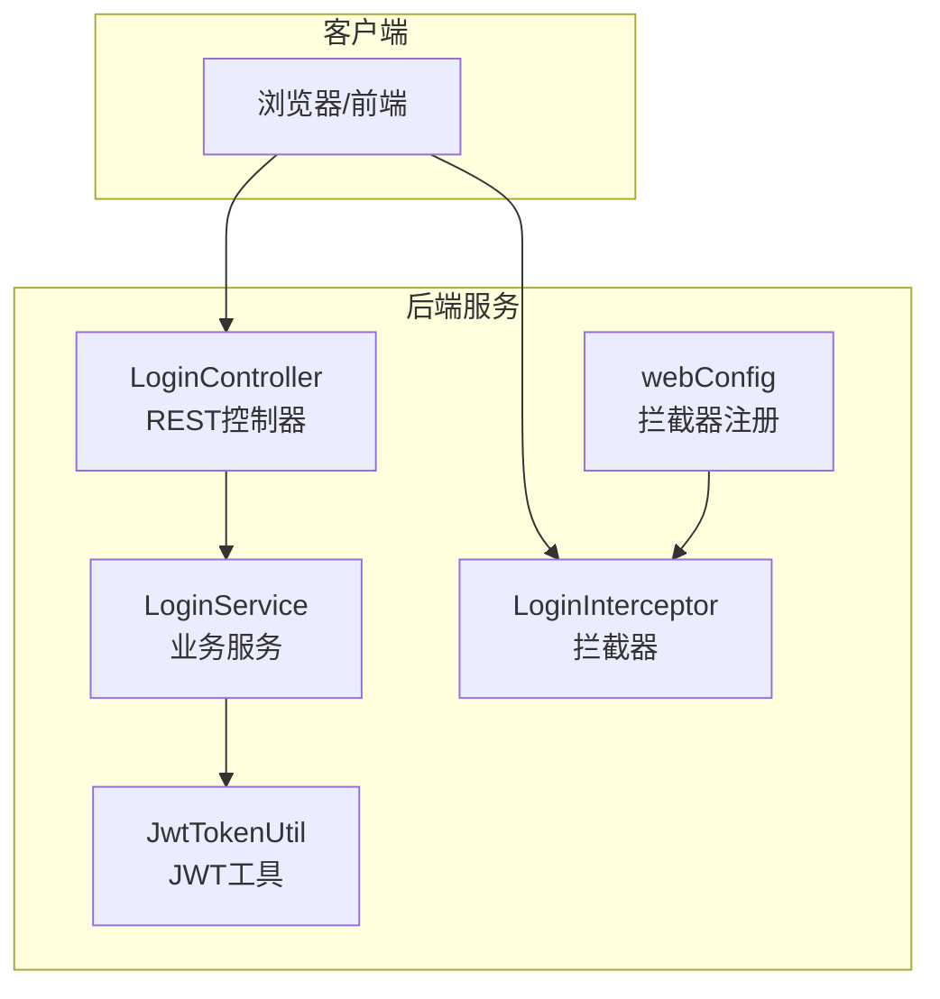
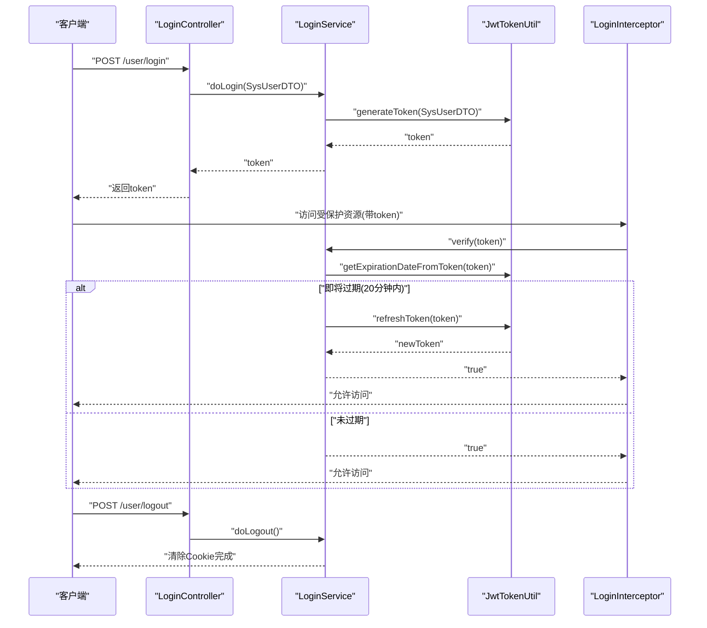
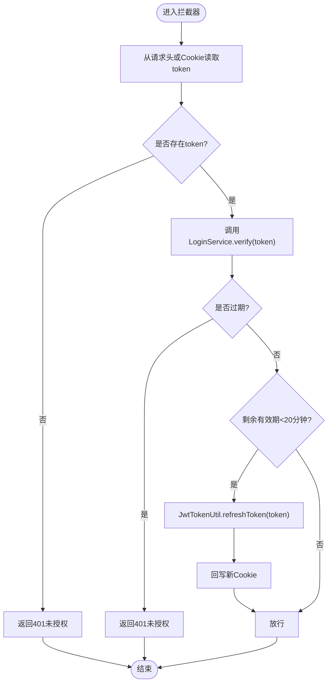
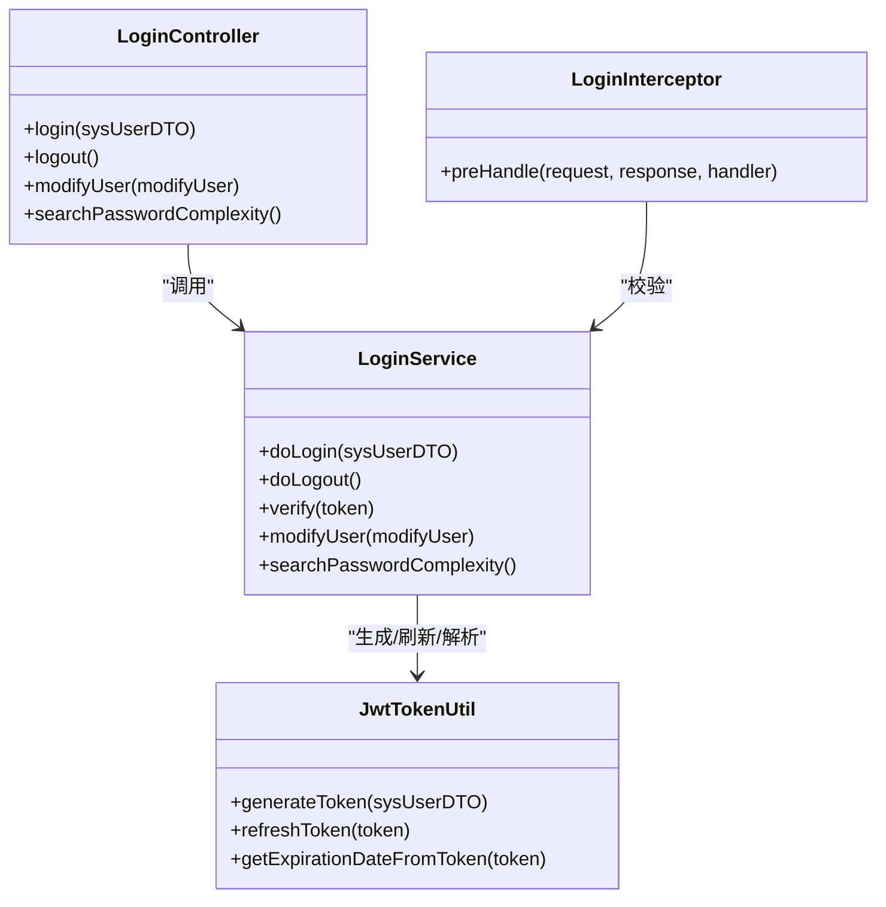

# 认证授权API

<cite>
**本文引用的文件**
- [LoginController.java](file://watcher-agent/src/main/java/com/virtual/cloud/om/agent/controller/LoginController.java)
- [JwtTokenUtil.java](file://watcher-sdk/src/main/java/com/virtual/cloud/om/sdk/utils/JwtTokenUtil.java)
- [LoginService.java](file://watcher-agent/src/main/java/com/virtual/cloud/om/agent/service/auth/LoginService.java)
- [LoginInterceptor.java](file://watcher-agent/src/main/java/com/virtual/cloud/om/agent/config/LoginInterceptor.java)
- [webConfig.java](file://watcher-agent/src/main/java/com/virtual/cloud/om/agent/filter/webConfig.java)
- [SysUserDTO.java](file://watcher-sdk/src/main/java/com/virtual/cloud/om/sdk/dto/SysUserDTO.java)
- [ModifyUser.java](file://watcher-sdk/src/main/java/com/virtual/cloud/om/sdk/dto/ModifyUser.java)
- [application.properties](file://watcher-agent/src/main/resources/application.properties)
- [SwaggerConfiguration.java](file://watcher-agent/src/main/java/com/virtual/cloud/om/agent/config/SwaggerConfiguration.java)
</cite>

## 目录
1. [简介](#简介)
2. [项目结构](#项目结构)
3. [核心组件](#核心组件)
4. [架构总览](#架构总览)
5. [详细组件分析](#详细组件分析)
6. [依赖分析](#依赖分析)
7. [性能考虑](#性能考虑)
8. [故障排查指南](#故障排查指南)
9. [结论](#结论)
10. [附录](#附录)

## 简介
本文件为认证授权API的完整接口文档，覆盖以下接口与安全机制：
- 用户登录：POST /user/login
- 用户登出：POST /user/logout
- 令牌刷新：PUT /user/refresh（基于拦截器的自动刷新逻辑）
- 密码修改：PUT /user/modifyUser
- JWT令牌生成、验证与过期处理
- 权限控制、角色管理与访问授权
- 会话管理、安全策略与防暴力破解
- 跨域处理、HTTPS配置与安全头设置

本项目采用Spring MVC + Spring Boot + JWT + 拦截器进行统一鉴权，前端通过Cookie或请求头携带令牌访问受保护资源。

## 项目结构
围绕认证授权的关键模块分布如下：
- 控制层：LoginController 提供登录、登出、改密、密码复杂度查询等接口
- 业务层：LoginService 实现登录校验、令牌颁发、会话维护、密码修改与复杂度校验
- 安全层：JwtTokenUtil 提供JWT生成、解析、刷新与过期判断；LoginInterceptor 统一拦截校验
- 配置层：webConfig 注册拦截器；SwaggerConfiguration 提供接口文档；application.properties 提供运行参数与上下文路径

图表来源
- [LoginController.java:1-92](file://watcher-agent/src/main/java/com/virtual/cloud/om/agent/controller/LoginController.java#L1-L92)
- [LoginService.java:1-282](file://watcher-agent/src/main/java/com/virtual/cloud/om/agent/service/auth/LoginService.java#L1-L282)
- [JwtTokenUtil.java:1-88](file://watcher-sdk/src/main/java/com/virtual/cloud/om/sdk/utils/JwtTokenUtil.java#L1-L88)
- [LoginInterceptor.java:1-100](file://watcher-agent/src/main/java/com/virtual/cloud/om/agent/config/LoginInterceptor.java#L1-L100)
- [webConfig.java:1-38](file://watcher-agent/src/main/java/com/virtual/cloud/om/agent/filter/webConfig.java#L1-L38)

章节来源
- [LoginController.java:1-92](file://watcher-agent/src/main/java/com/virtual/cloud/om/agent/controller/LoginController.java#L1-L92)
- [LoginService.java:1-282](file://watcher-agent/src/main/java/com/virtual/cloud/om/agent/service/auth/LoginService.java#L1-L282)
- [JwtTokenUtil.java:1-88](file://watcher-sdk/src/main/java/com/virtual/cloud/om/sdk/utils/JwtTokenUtil.java#L1-L88)
- [LoginInterceptor.java:1-100](file://watcher-agent/src/main/java/com/virtual/cloud/om/agent/config/LoginInterceptor.java#L1-L100)
- [webConfig.java:1-38](file://watcher-agent/src/main/java/com/virtual/cloud/om/agent/filter/webConfig.java#L1-L38)
- [application.properties:1-80](file://watcher-agent/src/main/resources/application.properties#L1-L80)
- [SwaggerConfiguration.java:1-50](file://watcher-agent/src/main/java/com/virtual/cloud/om/agent/config/SwaggerConfiguration.java#L1-L50)

## 核心组件
- 登录控制器：负责接收登录请求、调用业务服务、返回令牌；提供登出、改密、密码复杂度查询接口
- 登录服务：执行用户校验、颁发令牌、维护会话、密码修改与复杂度校验、令牌刷新与过期判断
- JWT工具：生成、解析、刷新令牌，计算过期时间
- 登录拦截器：统一从请求头或Cookie读取令牌，校验有效性，必要时刷新并回写Cookie
- 拦截器配置：注册拦截器并对特定路径放行（如登录、Swagger等）

章节来源
- [LoginController.java:1-92](file://watcher-agent/src/main/java/com/virtual/cloud/om/agent/controller/LoginController.java#L1-L92)
- [LoginService.java:1-282](file://watcher-agent/src/main/java/com/virtual/cloud/om/agent/service/auth/LoginService.java#L1-L282)
- [JwtTokenUtil.java:1-88](file://watcher-sdk/src/main/java/com/virtual/cloud/om/sdk/utils/JwtTokenUtil.java#L1-L88)
- [LoginInterceptor.java:1-100](file://watcher-agent/src/main/java/com/virtual/cloud/om/agent/config/LoginInterceptor.java#L1-L100)
- [webConfig.java:1-38](file://watcher-agent/src/main/java/com/virtual/cloud/om/agent/filter/webConfig.java#L1-L38)

## 架构总览
下图展示认证授权的整体交互流程：客户端发起登录请求，服务端校验用户凭据并颁发JWT；后续请求由拦截器统一校验令牌，必要时刷新并回写Cookie；登出时清除Cookie。

图表来源
- [LoginController.java:25-74](file://watcher-agent/src/main/java/com/virtual/cloud/om/agent/controller/LoginController.java#L25-L74)
- [LoginService.java:54-141](file://watcher-agent/src/main/java/com/virtual/cloud/om/agent/service/auth/LoginService.java#L54-L141)
- [JwtTokenUtil.java:49-69](file://watcher-sdk/src/main/java/com/virtual/cloud/om/sdk/utils/JwtTokenUtil.java#L49-L69)
- [LoginInterceptor.java:36-73](file://watcher-agent/src/main/java/com/virtual/cloud/om/agent/config/LoginInterceptor.java#L36-L73)

## 详细组件分析

### 接口定义与使用说明

- 登录接口
  - 方法：POST
  - 路径：/user/login
  - 请求体：SysUserDTO（包含用户名与密码）
  - 返回：RpcResult<String>，包含JWT令牌
  - 说明：成功后将令牌写入Cookie，并设置会话超时；失败返回错误码与消息

- 登出接口
  - 方法：POST
  - 路径：/user/logout
  - 请求体：无
  - 返回：RpcResult<Void>，清理Cookie
  - 说明：清除令牌Cookie，结束会话

- 令牌刷新
  - 方法：PUT
  - 路径：/user/refresh
  - 请求体：无（通过拦截器自动刷新）
  - 返回：无（刷新在拦截器内部完成）
  - 说明：当令牌剩余有效期不足20分钟时，拦截器自动刷新并回写Cookie

- 密码修改
  - 方法：PUT
  - 路径：/user/modifyUser
  - 请求体：ModifyUser（包含用户名、旧密码、新密码、确认新密码）
  - 返回：RpcResult<Void>
  - 说明：校验旧密码与新密码一致性，满足密码复杂度策略后更新数据库

- 密码复杂度查询
  - 方法：GET
  - 路径：/user/search/complexity
  - 返回：RpcResult<Integer>，返回当前密码复杂度策略等级

章节来源
- [LoginController.java:25-90](file://watcher-agent/src/main/java/com/virtual/cloud/om/agent/controller/LoginController.java#L25-L90)
- [SysUserDTO.java:1-27](file://watcher-sdk/src/main/java/com/virtual/cloud/om/sdk/dto/SysUserDTO.java#L1-L27)
- [ModifyUser.java:1-27](file://watcher-sdk/src/main/java/com/virtual/cloud/om/sdk/dto/ModifyUser.java#L1-L27)
- [LoginService.java:95-111](file://watcher-agent/src/main/java/com/virtual/cloud/om/agent/service/auth/LoginService.java#L95-L111)
- [LoginService.java:159-167](file://watcher-agent/src/main/java/com/virtual/cloud/om/agent/service/auth/LoginService.java#L159-L167)

### JWT令牌生成、验证与过期机制
- 生成：使用HS512算法签名，主题为SysUserDTO的JSON字符串，有效期2小时
- 解析：从令牌提取Claims，支持容差时钟偏移
- 刷新：当剩余有效期小于20分钟时，基于原令牌主体重建新令牌并回写Cookie
- 过期：比较令牌过期时间与当前时间，过期则拒绝访问

图表来源
- [LoginInterceptor.java:36-73](file://watcher-agent/src/main/java/com/virtual/cloud/om/agent/config/LoginInterceptor.java#L36-L73)
- [LoginService.java:117-141](file://watcher-agent/src/main/java/com/virtual/cloud/om/agent/service/auth/LoginService.java#L117-L141)
- [JwtTokenUtil.java:20-69](file://watcher-sdk/src/main/java/com/virtual/cloud/om/sdk/utils/JwtTokenUtil.java#L20-L69)

章节来源
- [JwtTokenUtil.java:17-69](file://watcher-sdk/src/main/java/com/virtual/cloud/om/sdk/utils/JwtTokenUtil.java#L17-L69)
- [LoginService.java:117-141](file://watcher-agent/src/main/java/com/virtual/cloud/om/agent/service/auth/LoginService.java#L117-L141)
- [LoginInterceptor.java:36-73](file://watcher-agent/src/main/java/com/virtual/cloud/om/agent/config/LoginInterceptor.java#L36-L73)

### 权限控制、角色管理与访问授权
- 统一拦截：所有受保护路径均需通过拦截器校验
- 放行规则：登录接口、Swagger相关路径、部分公开接口无需登录
- 授权策略：当前实现对固定管理员账户进行校验，未体现细粒度角色/权限模型

章节来源
- [webConfig.java:20-36](file://watcher-agent/src/main/java/com/virtual/cloud/om/agent/filter/webConfig.java#L20-L36)
- [LoginInterceptor.java:36-73](file://watcher-agent/src/main/java/com/virtual/cloud/om/agent/config/LoginInterceptor.java#L36-L73)
- [LoginService.java:128-136](file://watcher-agent/src/main/java/com/virtual/cloud/om/agent/service/auth/LoginService.java#L128-L136)

### 会话管理、安全策略与防暴力破解
- 会话：登录成功后设置HttpSession最大不活跃间隔为2小时；Cookie有效期为2小时
- 令牌：Cookie名为常量TOKEN_NAME，路径为常量ACCESS_PATH
- 安全策略：密码修改前校验旧密码与新密码一致性；按策略校验新密码复杂度
- 防暴力破解：当前未见显式限流或验证码机制

章节来源
- [LoginService.java:54-68](file://watcher-agent/src/main/java/com/virtual/cloud/om/agent/service/auth/LoginService.java#L54-L68)
- [LoginService.java:95-111](file://watcher-agent/src/main/java/com/virtual/cloud/om/agent/service/auth/LoginService.java#L95-L111)
- [LoginService.java:176-281](file://watcher-agent/src/main/java/com/virtual/cloud/om/agent/service/auth/LoginService.java#L176-L281)

### 跨域处理、HTTPS配置与安全头设置
- 跨域：控制器使用@CrossOrigin注解，允许跨域访问
- HTTPS：未在拦截器或过滤器中强制HTTPS重定向
- 安全头：未在拦截器中统一注入安全响应头（如X-Frame-Options、Content-Security-Policy等）

章节来源
- [LoginController.java:15-15](file://watcher-agent/src/main/java/com/virtual/cloud/om/agent/controller/LoginController.java#L15-L15)
- [webConfig.java:20-36](file://watcher-agent/src/main/java/com/virtual/cloud/om/agent/filter/webConfig.java#L20-L36)

## 依赖分析
- 控制器依赖业务服务，业务服务依赖JWT工具与数据访问层
- 拦截器依赖业务服务与Cookie工具，用于统一鉴权
- 配置类注册拦截器并对路径进行放行

图表来源
- [LoginController.java:1-92](file://watcher-agent/src/main/java/com/virtual/cloud/om/agent/controller/LoginController.java#L1-L92)
- [LoginService.java:1-282](file://watcher-agent/src/main/java/com/virtual/cloud/om/agent/service/auth/LoginService.java#L1-L282)
- [JwtTokenUtil.java:1-88](file://watcher-sdk/src/main/java/com/virtual/cloud/om/sdk/utils/JwtTokenUtil.java#L1-L88)
- [LoginInterceptor.java:1-100](file://watcher-agent/src/main/java/com/virtual/cloud/om/agent/config/LoginInterceptor.java#L1-L100)

章节来源
- [LoginController.java:1-92](file://watcher-agent/src/main/java/com/virtual/cloud/om/agent/controller/LoginController.java#L1-L92)
- [LoginService.java:1-282](file://watcher-agent/src/main/java/com/virtual/cloud/om/agent/service/auth/LoginService.java#L1-L282)
- [JwtTokenUtil.java:1-88](file://watcher-sdk/src/main/java/com/virtual/cloud/om/sdk/utils/JwtTokenUtil.java#L1-L88)
- [LoginInterceptor.java:1-100](file://watcher-agent/src/main/java/com/virtual/cloud/om/agent/config/LoginInterceptor.java#L1-L100)

## 性能考虑
- 令牌有效期：2小时，减少频繁刷新；拦截器在剩余20分钟内刷新，避免临界点抖动
- 会话超时：2小时，平衡用户体验与安全性
- 数据库访问：登录与改密涉及数据库读写，建议在高并发场景下优化索引与连接池

## 故障排查指南
- 401未授权
  - 可能原因：缺少token、token无效或已过期
  - 处理建议：检查请求头或Cookie中token是否正确；确认拦截器是否触发刷新
- 登录失败
  - 可能原因：用户名不存在、密码不匹配
  - 处理建议：核对SysUserDTO字段；确认SM4解密逻辑与数据库存储一致
- 密码修改失败
  - 可能原因：新旧密码不一致、不符合复杂度策略
  - 处理建议：检查ModifyUser字段与策略配置；查看异常码定位具体失败项
- 登出无效
  - 可能原因：Cookie未正确删除或路径不匹配
  - 处理建议：确认常量TOKEN_NAME与ACCESS_PATH；检查响应头Set-Cookie

章节来源
- [LoginInterceptor.java:45-70](file://watcher-agent/src/main/java/com/virtual/cloud/om/agent/config/LoginInterceptor.java#L45-L70)
- [LoginService.java:76-92](file://watcher-agent/src/main/java/com/virtual/cloud/om/agent/service/auth/LoginService.java#L76-L92)
- [LoginService.java:95-111](file://watcher-agent/src/main/java/com/virtual/cloud/om/agent/service/auth/LoginService.java#L95-L111)
- [LoginService.java:113-115](file://watcher-agent/src/main/java/com/virtual/cloud/om/agent/service/auth/LoginService.java#L113-L115)

## 结论
本项目提供了基础而完整的认证授权能力：登录/登出、JWT令牌颁发与刷新、会话管理与密码策略校验。拦截器实现了统一鉴权与自动刷新，配合Cookie持久化提升用户体验。建议后续增强：
- 引入细粒度角色/权限模型与接口级鉴权
- 加入防暴力破解（限流、验证码）与强制HTTPS
- 统一注入安全响应头，完善CSP与X-Frame-Options
- 在高并发场景优化数据库访问与缓存策略

## 附录

### 接口一览表
- POST /user/login
  - 请求体：SysUserDTO
  - 成功返回：token（写入Cookie）
- POST /user/logout
  - 请求体：无
  - 成功返回：清除Cookie
- PUT /user/modifyUser
  - 请求体：ModifyUser
  - 成功返回：更新成功
- GET /user/search/complexity
  - 返回：密码复杂度策略等级

章节来源
- [LoginController.java:25-90](file://watcher-agent/src/main/java/com/virtual/cloud/om/agent/controller/LoginController.java#L25-L90)
- [SysUserDTO.java:1-27](file://watcher-sdk/src/main/java/com/virtual/cloud/om/sdk/dto/SysUserDTO.java#L1-L27)
- [ModifyUser.java:1-27](file://watcher-sdk/src/main/java/com/virtual/cloud/om/sdk/dto/ModifyUser.java#L1-L27)

### 安全最佳实践
- 令牌传递：优先使用请求头Authorization携带Bearer token，同时保留Cookie作为备选
- HTTPS：生产环境启用HTTPS，强制跳转与HSTS
- 安全头：设置X-Frame-Options、X-Content-Type-Options、Content-Security-Policy
- 限流与风控：引入IP/用户维度限流、验证码与登录失败次数统计
- 日志与审计：记录关键认证事件与异常，便于追踪