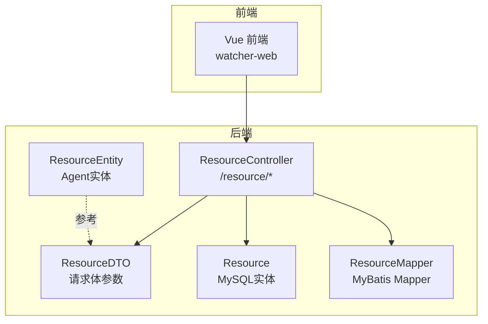
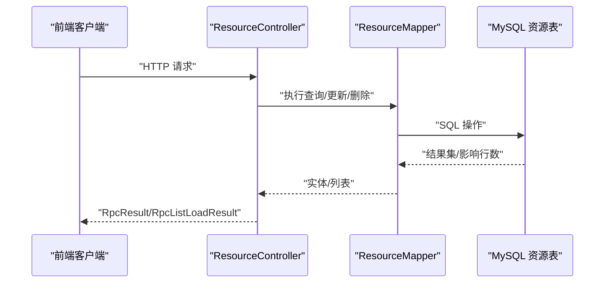
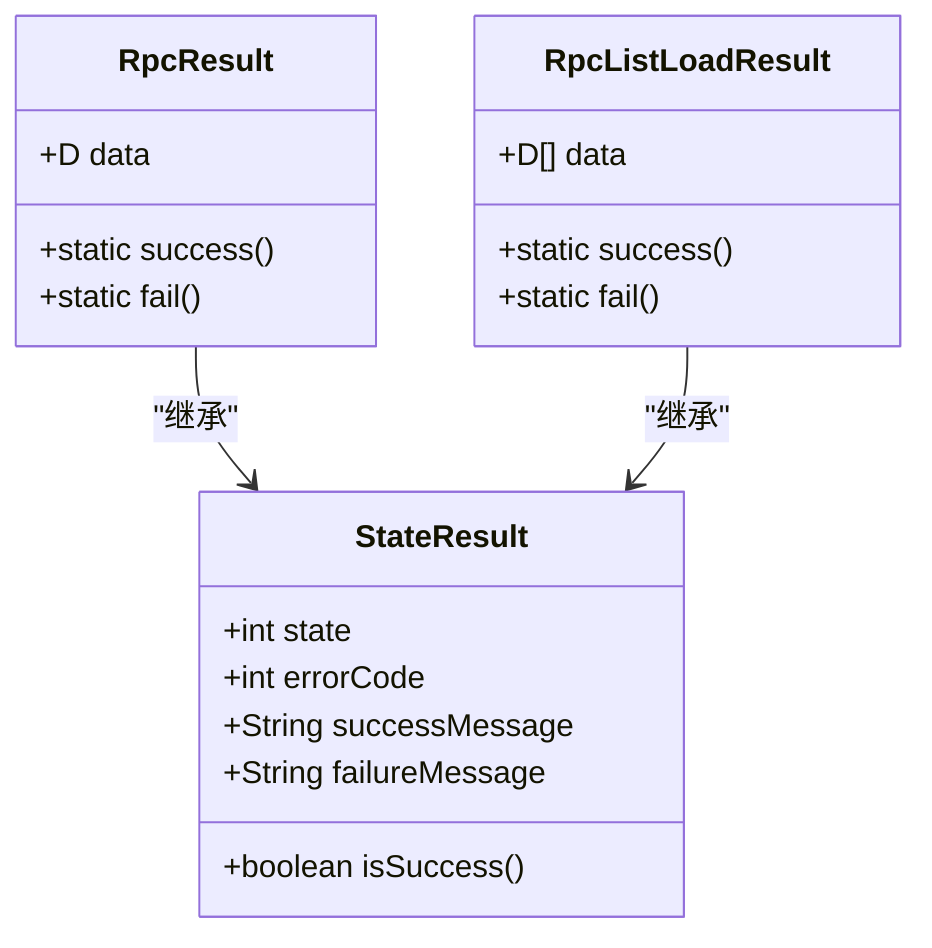
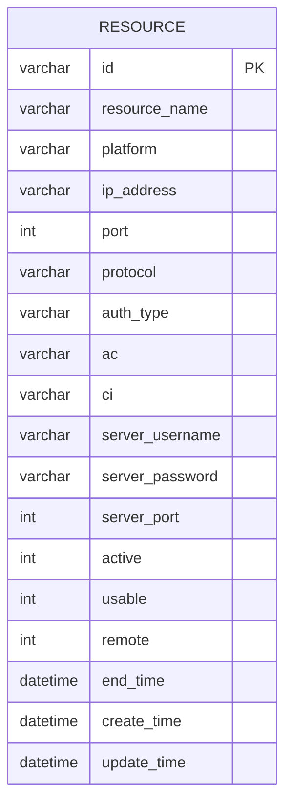
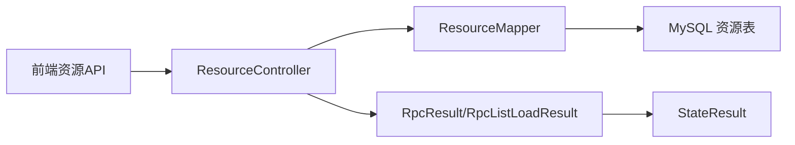

# 资源管理API

<cite>
**本文档引用的文件**
- [ResourceController.java](file://watcher-agent/src/main/java/com/virtual/cloud/om/agent/controller/ResourceController.java)
- [ResourceDTO.java](file://watcher-agent/src/main/java/com/virtual/cloud/om/agent/dto/ResourceDTO.java)
- [ResourceEntity.java](file://watcher-agent/src/main/java/com/virtual/cloud/om/agent/entity/ResourceEntity.java)
- [Resource.java](file://watcher-sdk/src/main/java/com/virtual/cloud/om/sdk/entity/mysql/Resource.java)
- [ResourceMapper.java](file://watcher-sdk/src/main/java/com/virtual/cloud/om/sdk/mapper/ResourceMapper.java)
- [RpcResult.java](file://watcher-sdk/src/main/java/com/virtual/cloud/om/sdk/dto/RpcResult.java)
- [RpcListLoadResult.java](file://watcher-sdk/src/main/java/com/virtual/cloud/om/sdk/dto/RpcListLoadResult.java)
- [StateResult.java](file://watcher-sdk/src/main/java/com/virtual/cloud/om/sdk/dto/StateResult.java)
- [schema-mysql.sql](file://watcher-agent/src/main/resources/schema-mysql.sql)
- [index.ts（前端资源API）](file://watcher-web/src/api/resource/index.ts)
- [ResourceApi.java](file://watcher-sdk/src/main/java/com/virtual/cloud/om/sdk/api/ResourceApi.java)
</cite>

## 目录
1. [简介](#简介)
2. [项目结构](#项目结构)
3. [核心组件](#核心组件)
4. [架构总览](#架构总览)
5. [详细组件分析](#详细组件分析)
6. [依赖分析](#依赖分析)
7. [性能考虑](#性能考虑)
8. [故障排除指南](#故障排除指南)
9. [结论](#结论)
10. [附录](#附录)

## 简介
本文件为资源管理API的完整接口文档，覆盖资源CRUD与状态管理相关REST端点，包括：
- 获取资源列表：GET /resource/list
- 获取资源详情：GET /resource/detail/{id}
- 创建资源：POST /resource/create
- 批量创建资源：POST /resource/batchCreate
- 更新资源：PUT /resource/update
- 删除资源：DELETE /resource/delete/{id}
- 启用/禁用资源：PUT /resource/usable/{id}
- 远程状态管理（SSH权限）：PUT /resource/remote/{id}

文档说明每个接口的请求参数、响应格式、状态码含义与错误处理，并提供成功与失败场景的示例说明。同时阐述资源状态管理、批量操作与权限控制机制。

## 项目结构
资源管理API位于后端Agent模块，通过Spring MVC控制器对外暴露REST接口；数据模型与持久化由SDK模块的实体与MyBatis Mapper负责；前端通过统一的HTTP客户端封装调用这些接口。

图表来源
- [ResourceController.java:24-234](file://watcher-agent/src/main/java/com/virtual/cloud/om/agent/controller/ResourceController.java#L24-L234)
- [ResourceDTO.java:9-34](file://watcher-agent/src/main/java/com/virtual/cloud/om/agent/dto/ResourceDTO.java#L9-L34)
- [ResourceEntity.java:22-52](file://watcher-agent/src/main/java/com/virtual/cloud/om/agent/entity/ResourceEntity.java#L22-L52)
- [Resource.java:14-56](file://watcher-sdk/src/main/java/com/virtual/cloud/om/sdk/entity/mysql/Resource.java#L14-L56)
- [ResourceMapper.java:10-13](file://watcher-sdk/src/main/java/com/virtual/cloud/om/sdk/mapper/ResourceMapper.java#L10-L13)

章节来源
- [ResourceController.java:24-234](file://watcher-agent/src/main/java/com/virtual/cloud/om/agent/controller/ResourceController.java#L24-L234)
- [ResourceDTO.java:9-34](file://watcher-agent/src/main/java/com/virtual/cloud/om/agent/dto/ResourceDTO.java#L9-L34)
- [ResourceEntity.java:22-52](file://watcher-agent/src/main/java/com/virtual/cloud/om/agent/entity/ResourceEntity.java#L22-L52)
- [Resource.java:14-56](file://watcher-sdk/src/main/java/com/virtual/cloud/om/sdk/entity/mysql/Resource.java#L14-L56)
- [ResourceMapper.java:10-13](file://watcher-sdk/src/main/java/com/virtual/cloud/om/sdk/mapper/ResourceMapper.java#L10-L13)

## 核心组件
- 控制器层：ResourceController 提供所有资源管理REST端点，使用RpcResult/RpcListLoadResult作为统一响应载体。
- 数据传输层：ResourceDTO 定义创建/更新请求体字段；ResourceEntity 提供Agent侧实体参考。
- 持久化层：Resource 实体映射MySQL表resource；ResourceMapper 提供基础CRUD能力。
- 响应模型：StateResult定义通用状态码与消息；RpcResult/RpcListLoadResult承载业务数据与状态。

章节来源
- [ResourceController.java:34-234](file://watcher-agent/src/main/java/com/virtual/cloud/om/agent/controller/ResourceController.java#L34-L234)
- [ResourceDTO.java:9-34](file://watcher-agent/src/main/java/com/virtual/cloud/om/agent/dto/ResourceDTO.java#L9-L34)
- [ResourceEntity.java:22-52](file://watcher-agent/src/main/java/com/virtual/cloud/om/agent/entity/ResourceEntity.java#L22-L52)
- [Resource.java:14-56](file://watcher-sdk/src/main/java/com/virtual/cloud/om/sdk/entity/mysql/Resource.java#L14-L56)
- [ResourceMapper.java:10-13](file://watcher-sdk/src/main/java/com/virtual/cloud/om/sdk/mapper/ResourceMapper.java#L10-L13)
- [RpcResult.java:3-87](file://watcher-sdk/src/main/java/com/virtual/cloud/om/sdk/dto/RpcResult.java#L3-L87)
- [RpcListLoadResult.java:10-56](file://watcher-sdk/src/main/java/com/virtual/cloud/om/sdk/dto/RpcListLoadResult.java#L10-L56)
- [StateResult.java:15-72](file://watcher-sdk/src/main/java/com/virtual/cloud/om/sdk/dto/StateResult.java#L15-L72)

## 架构总览
资源管理API采用分层架构：前端通过HTTP客户端调用后端控制器；控制器协调服务层（如需要）与数据访问层；数据访问层通过MyBatis操作MySQL资源表。

图表来源
- [ResourceController.java:34-234](file://watcher-agent/src/main/java/com/virtual/cloud/om/agent/controller/ResourceController.java#L34-L234)
- [ResourceMapper.java:10-13](file://watcher-sdk/src/main/java/com/virtual/cloud/om/sdk/mapper/ResourceMapper.java#L10-L13)
- [schema-mysql.sql:156-175](file://watcher-agent/src/main/resources/schema-mysql.sql#L156-L175)

## 详细组件分析

### 统一响应模型
- StateResult：定义通用状态码（SUCCESS/FAILURE/PARTIAL_SUCCESS/ERROR）、错误码、成功/失败消息字段。
- RpcResult：单对象响应，支持成功、失败、部分成功、错误多种返回形态。
- RpcListLoadResult：列表响应，包含数据列表与状态信息。

图表来源
- [StateResult.java:15-72](file://watcher-sdk/src/main/java/com/virtual/cloud/om/sdk/dto/StateResult.java#L15-L72)
- [RpcResult.java:3-87](file://watcher-sdk/src/main/java/com/virtual/cloud/om/sdk/dto/RpcResult.java#L3-L87)
- [RpcListLoadResult.java:10-56](file://watcher-sdk/src/main/java/com/virtual/cloud/om/sdk/dto/RpcListLoadResult.java#L10-L56)

章节来源
- [StateResult.java:15-72](file://watcher-sdk/src/main/java/com/virtual/cloud/om/sdk/dto/StateResult.java#L15-L72)
- [RpcResult.java:3-87](file://watcher-sdk/src/main/java/com/virtual/cloud/om/sdk/dto/RpcResult.java#L3-L87)
- [RpcListLoadResult.java:10-56](file://watcher-sdk/src/main/java/com/virtual/cloud/om/sdk/dto/RpcListLoadResult.java#L10-L56)

### 数据模型与数据库
- Resource 实体映射 MySQL 表 resource，包含资源标识、平台、网络配置、认证信息、状态字段与时间戳。
- schema-mysql.sql 定义了资源表结构、索引与约束（唯一组合索引：ip_address+platform）。

图表来源
- [Resource.java:14-56](file://watcher-sdk/src/main/java/com/virtual/cloud/om/sdk/entity/mysql/Resource.java#L14-L56)
- [schema-mysql.sql:156-175](file://watcher-agent/src/main/resources/schema-mysql.sql#L156-L175)

章节来源
- [Resource.java:14-56](file://watcher-sdk/src/main/java/com/virtual/cloud/om/sdk/entity/mysql/Resource.java#L14-L56)
- [schema-mysql.sql:156-175](file://watcher-agent/src/main/resources/schema-mysql.sql#L156-L175)

### 接口定义与行为

#### GET /resource/list
- 功能：分页查询资源列表，支持按平台、资源名、IP过滤。
- 请求参数：
  - platform：字符串，可选，过滤平台类型
  - resourceName：字符串，可选，模糊匹配资源名
  - ipAddress：字符串，可选，精确匹配IP
  - page：整数，默认0，起始页（逻辑页）
  - size：整数，默认10，每页大小
- 响应：RpcListLoadResult<List<Resource>>
- 成功示例：
  - 返回包含资源列表的数据与状态码0
- 失败示例：
  - 查询异常时返回状态码1及错误消息

章节来源
- [ResourceController.java:34-55](file://watcher-agent/src/main/java/com/virtual/cloud/om/agent/controller/ResourceController.java#L34-L55)
- [RpcListLoadResult.java:40-46](file://watcher-sdk/src/main/java/com/virtual/cloud/om/sdk/dto/RpcListLoadResult.java#L40-L46)

#### GET /resource/detail/{id}
- 功能：根据资源ID获取资源详情
- 路径参数：id（字符串）
- 响应：RpcResult<Resource>
- 成功示例：
  - 返回资源详情与状态码0
- 失败示例：
  - 资源不存在：状态码1，消息“资源不存在”

章节来源
- [ResourceController.java:57-65](file://watcher-agent/src/main/java/com/virtual/cloud/om/agent/controller/ResourceController.java#L57-L65)
- [RpcResult.java:35-37](file://watcher-sdk/src/main/java/com/virtual/cloud/om/sdk/dto/RpcResult.java#L35-L37)

#### POST /resource/create
- 功能：创建单个资源
- 请求体：ResourceDTO
  - 字段说明：见下表
- 响应：RpcResult<Void>
- 成功示例：
  - 返回状态码0与成功消息
- 失败示例：
  - 参数校验或数据库异常：状态码1，携带错误信息

请求体字段定义（ResourceDTO）
- resourceName：字符串，资源名称
- platform：字符串，平台类型（自动转小写存储）
- id：字符串，资源ID（可选，未提供则自动生成）
- ipAddress：字符串，IP地址
- port：整数，HTTP端口
- ac：字符串，REST认证用户名
- ci：字符串，REST认证密码（加密存储）
- protocol：字符串，访问协议（默认HTTP）
- authType：字符串，认证类型（默认Digest）
- serverUsername：字符串，服务器后台账号
- serverPassword：字符串，服务器后台密码（加密存储）
- serverPort：整数，服务器后台SSH端口（默认22）

章节来源
- [ResourceController.java:67-96](file://watcher-agent/src/main/java/com/virtual/cloud/om/agent/controller/ResourceController.java#L67-L96)
- [ResourceDTO.java:10-33](file://watcher-agent/src/main/java/com/virtual/cloud/om/agent/dto/ResourceDTO.java#L10-L33)
- [Resource.java:20-55](file://watcher-sdk/src/main/java/com/virtual/cloud/om/sdk/entity/mysql/Resource.java#L20-L55)

#### POST /resource/batchCreate
- 功能：批量创建/更新资源（存在即更新）
- 请求体：ResourceDTO数组
- 响应：RpcResult<Void>
- 成功示例：
  - 返回状态码0与成功消息
- 失败示例：
  - 批量过程中任一异常：状态码1，携带错误信息

章节来源
- [ResourceController.java:98-135](file://watcher-agent/src/main/java/com/virtual/cloud/om/agent/controller/ResourceController.java#L98-L135)

#### PUT /resource/update
- 功能：按ID更新资源的部分字段
- 请求体：ResourceDTO（至少包含id）
- 响应：RpcResult<Void>
- 成功示例：
  - 返回状态码0与成功消息
- 失败示例：
  - 资源不存在：状态码1，消息“资源不存在”
  - 其他异常：状态码1，携带错误信息

章节来源
- [ResourceController.java:137-183](file://watcher-agent/src/main/java/com/virtual/cloud/om/agent/controller/ResourceController.java#L137-L183)

#### DELETE /resource/delete/{id}
- 功能：按ID删除资源
- 路径参数：id（字符串）
- 响应：RpcResult<Void>
- 成功示例：
  - 返回状态码0与成功消息
- 失败示例：
  - 删除异常：状态码1，携带错误信息

章节来源
- [ResourceController.java:185-196](file://watcher-agent/src/main/java/com/virtual/cloud/om/agent/controller/ResourceController.java#L185-L196)

#### PUT /resource/usable/{id}
- 功能：更新资源可用状态（启用/禁用）
- 路径参数：id（字符串）
- 查询参数：usable（整数，0/1）
- 响应：RpcResult<Void>
- 成功示例：
  - 返回状态码0与成功消息
- 失败示例：
  - 资源不存在：状态码1，消息“资源不存在”
  - 其他异常：状态码1，携带错误信息

章节来源
- [ResourceController.java:198-214](file://watcher-agent/src/main/java/com/virtual/cloud/om/agent/controller/ResourceController.java#L198-L214)

#### PUT /resource/remote/{id}
- 功能：更新SSH权限（启用/禁用），禁用时设置结束时间
- 路径参数：id（字符串）
- 查询参数：remote（整数，0/1）
- 响应：RpcResult<Void>
- 成功示例：
  - 返回状态码0与成功消息
- 失败示例：
  - 资源不存在：状态码1，消息“资源不存在”
  - 其他异常：状态码1，携带错误信息

章节来源
- [ResourceController.java:216-233](file://watcher-agent/src/main/java/com/virtual/cloud/om/agent/controller/ResourceController.java#L216-L233)

### 前端集成
- 前端通过统一的HTTP客户端封装调用上述接口，参数与路径与后端一致。
- 前端资源API封装文件提供了各接口的调用方法，便于在页面中直接使用。

章节来源
- [index.ts（前端资源API）:3-55](file://watcher-web/src/api/resource/index.ts#L3-L55)

## 依赖分析
- 控制器依赖Mapper进行数据访问；Mapper基于MyBatis与MySQL驱动工作。
- 响应模型独立于业务实现，统一了前后端交互格式。
- 前端通过HTTP客户端调用后端接口，形成清晰的分层。

图表来源
- [ResourceController.java:31-32](file://watcher-agent/src/main/java/com/virtual/cloud/om/agent/controller/ResourceController.java#L31-L32)
- [ResourceMapper.java:10-13](file://watcher-sdk/src/main/java/com/virtual/cloud/om/sdk/mapper/ResourceMapper.java#L10-L13)
- [RpcResult.java:3-87](file://watcher-sdk/src/main/java/com/virtual/cloud/om/sdk/dto/RpcResult.java#L3-L87)
- [RpcListLoadResult.java:10-56](file://watcher-sdk/src/main/java/com/virtual/cloud/om/sdk/dto/RpcListLoadResult.java#L10-L56)
- [index.ts（前端资源API）:3-55](file://watcher-web/src/api/resource/index.ts#L3-L55)

章节来源
- [ResourceController.java:31-32](file://watcher-agent/src/main/java/com/virtual/cloud/om/agent/controller/ResourceController.java#L31-L32)
- [ResourceMapper.java:10-13](file://watcher-sdk/src/main/java/com/virtual/cloud/om/sdk/mapper/ResourceMapper.java#L10-L13)
- [RpcResult.java:3-87](file://watcher-sdk/src/main/java/com/virtual/cloud/om/sdk/dto/RpcResult.java#L3-L87)
- [RpcListLoadResult.java:10-56](file://watcher-sdk/src/main/java/com/virtual/cloud/om/sdk/dto/RpcListLoadResult.java#L10-L56)
- [index.ts（前端资源API）:3-55](file://watcher-web/src/api/resource/index.ts#L3-L55)

## 性能考虑
- 列表查询支持多条件过滤与排序，建议在高频查询场景下对常用过滤字段建立合适索引以优化性能。
- 批量创建采用逐条插入/更新策略，若数据量较大建议评估事务边界与批量提交策略。
- 加密字段（ci、serverPassword）在入库前进行加密处理，避免明文存储，兼顾安全与性能。

## 故障排除指南
- 资源不存在：
  - 触发场景：查询详情、更新状态、更新SSH权限等
  - 处理方式：检查资源ID是否正确；确认资源是否存在
- 数据库异常：
  - 触发场景：创建、更新、删除、批量创建
  - 处理方式：查看后端日志定位具体异常；检查数据库连接与权限
- 参数不合法：
  - 触发场景：创建/更新接口
  - 处理方式：核对ResourceDTO字段类型与必填项；确保平台类型与协议合法

章节来源
- [ResourceController.java:61-63](file://watcher-agent/src/main/java/com/virtual/cloud/om/agent/controller/ResourceController.java#L61-L63)
- [ResourceController.java:202-204](file://watcher-agent/src/main/java/com/virtual/cloud/om/agent/controller/ResourceController.java#L202-L204)
- [ResourceController.java:220-222](file://watcher-agent/src/main/java/com/virtual/cloud/om/agent/controller/ResourceController.java#L220-L222)

## 结论
资源管理API提供了完整的资源CRUD与状态管理能力，采用统一响应模型与清晰的分层设计，满足多平台资源的集中管理需求。通过前端封装与后端控制器协作，实现了高效、稳定的资源生命周期管理。

## 附录

### 状态码说明
- 0：SUCCESS（成功）
- 1：FAILURE（失败）
- 2：PARTIAL_SUCCESS（部分成功）
- 3：ERROR（错误）

章节来源
- [StateResult.java:15-21](file://watcher-sdk/src/main/java/com/virtual/cloud/om/sdk/dto/StateResult.java#L15-L21)

### 数据库约束与索引
- 唯一约束：ip_address + platform 组合唯一，防止相同平台下IP重复
- 时间字段：create_time、update_time 自动维护

章节来源
- [schema-mysql.sql:175-176](file://watcher-agent/src/main/resources/schema-mysql.sql#L175-L176)

### 权限控制机制
- 当前控制器未显式引入鉴权注解或拦截器，权限控制需结合上层网关或应用安全策略实施。
- 建议在生产环境中配合认证与授权中间件，限制接口访问范围。

章节来源
- [ResourceController.java:24-28](file://watcher-agent/src/main/java/com/virtual/cloud/om/agent/controller/ResourceController.java#L24-L28)