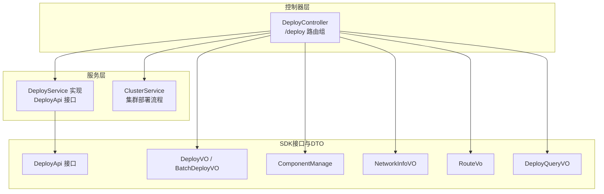
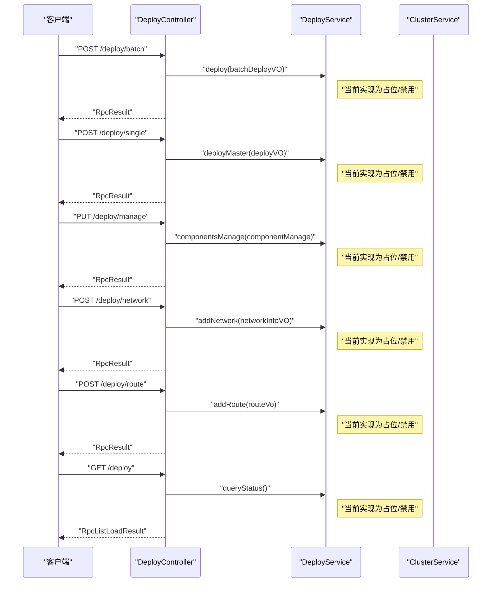
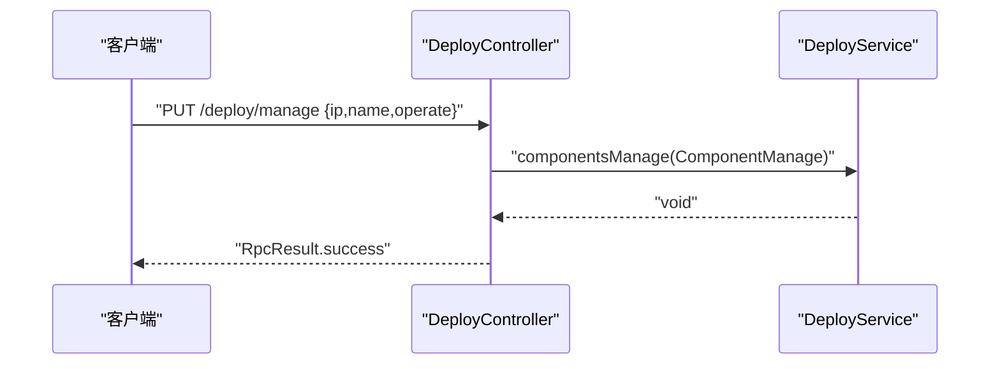
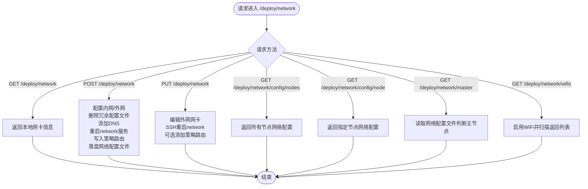
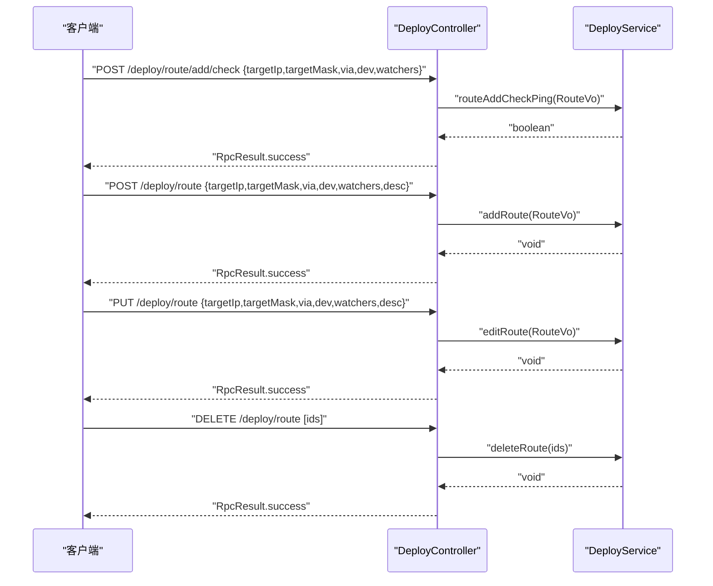
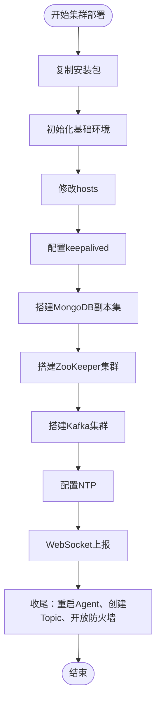
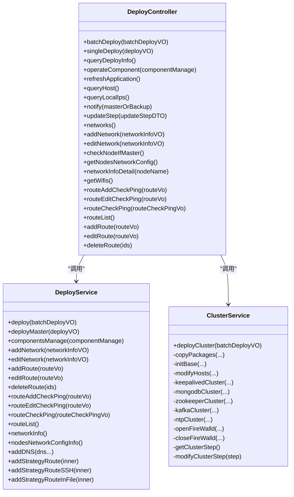

# 部署管理API

<cite>
**本文引用的文件**
- [DeployController.java](file://watcher-agent/src/main/java/com/virtual/cloud/om/agent/controller/DeployController.java)
- [DeployService.java](file://watcher-agent/src/main/java/com/virtual/cloud/om/agent/service/deploy/DeployService.java)
- [ClusterService.java](file://watcher-agent/src/main/java/com/virtual/cloud/om/agent/service/deploy/ClusterService.java)
- [DeployApi.java](file://watcher-sdk/src/main/java/com/virtual/cloud/om/sdk/api/DeployApi.java)
- [DeployVO.java](file://watcher-sdk/src/main/java/com/virtual/cloud/om/sdk/dto/deploy/DeployVO.java)
- [BatchDeployVO.java](file://watcher-sdk/src/main/java/com/virtual/cloud/om/sdk/dto/deploy/BatchDeployVO.java)
- [ComponentManage.java](file://watcher-sdk/src/main/java/com/virtual/cloud/om/sdk/dto/deploy/ComponentManage.java)
- [NetworkInfoVO.java](file://watcher-sdk/src/main/java/com/virtual/cloud/om/sdk/dto/deploy/NetworkInfoVO.java)
- [RouteVo.java](file://watcher-sdk/src/main/java/com/virtual/cloud/om/sdk/dto/deploy/RouteVo.java)
- [DeployQueryVO.java](file://watcher-sdk/src/main/java/com/virtual/cloud/om/sdk/dto/deploy/DeployQueryVO.java)
</cite>

## 目录
1. [简介](#简介)
2. [项目结构](#项目结构)
3. [核心组件](#核心组件)
4. [架构总览](#架构总览)
5. [详细组件分析](#详细组件分析)
6. [依赖分析](#依赖分析)
7. [性能考虑](#性能考虑)
8. [故障排查指南](#故障排查指南)
9. [结论](#结论)
10. [附录](#附录)

## 简介
本文件面向部署管理API，聚焦于采集结点的部署、组件控制、网络配置、路由管理与系统升级等能力。根据仓库中的控制器与SDK接口定义，当前实现以“采集结点”为中心，提供批量/单节点部署入口、组件服务管理、网络配置与路由管理、以及集群部署流程编排。同时，控制器中包含与网络与路由相关的校验与测试接口，便于在变更前进行连通性与可达性验证。

## 项目结构
围绕部署管理API的关键模块分布如下：
- 控制器层：负责HTTP端点暴露与请求转发，位于采集代理模块。
- 服务层：包含通用部署接口与集群部署流程编排。
- DTO与接口：定义部署、网络、路由等请求/响应模型及对外接口契约。

图表来源
- [DeployController.java:34-324](file://watcher-agent/src/main/java/com/virtual/cloud/om/agent/controller/DeployController.java#L34-L324)
- [DeployService.java:28-231](file://watcher-agent/src/main/java/com/virtual/cloud/om/agent/service/deploy/DeployService.java#L28-L231)
- [ClusterService.java:30-144](file://watcher-agent/src/main/java/com/virtual/cloud/om/agent/service/deploy/ClusterService.java#L30-L144)
- [DeployApi.java:14-105](file://watcher-sdk/src/main/java/com/virtual/cloud/om/sdk/api/DeployApi.java#L14-L105)
- [DeployVO.java:11-33](file://watcher-sdk/src/main/java/com/virtual/cloud/om/sdk/dto/deploy/DeployVO.java#L11-L33)
- [BatchDeployVO.java:16-38](file://watcher-sdk/src/main/java/com/virtual/cloud/om/sdk/dto/deploy/BatchDeployVO.java#L16-L38)
- [ComponentManage.java:13-23](file://watcher-sdk/src/main/java/com/virtual/cloud/om/sdk/dto/deploy/ComponentManage.java#L13-L23)
- [NetworkInfoVO.java:7-82](file://watcher-sdk/src/main/java/com/virtual/cloud/om/sdk/dto/deploy/NetworkInfoVO.java#L7-L82)
- [RouteVo.java:11-27](file://watcher-sdk/src/main/java/com/virtual/cloud/om/sdk/dto/deploy/RouteVo.java#L11-L27)
- [DeployQueryVO.java:13-45](file://watcher-sdk/src/main/java/com/virtual/cloud/om/sdk/dto/deploy/DeployQueryVO.java#L13-L45)

章节来源
- [DeployController.java:34-324](file://watcher-agent/src/main/java/com/virtual/cloud/om/agent/controller/DeployController.java#L34-L324)
- [DeployService.java:28-231](file://watcher-agent/src/main/java/com/virtual/cloud/om/agent/service/deploy/DeployService.java#L28-L231)
- [ClusterService.java:30-144](file://watcher-agent/src/main/java/com/virtual/cloud/om/agent/service/deploy/ClusterService.java#L30-L144)
- [DeployApi.java:14-105](file://watcher-sdk/src/main/java/com/virtual/cloud/om/sdk/api/DeployApi.java#L14-L105)

## 核心组件
- 控制器：集中于“/deploy”路由组，提供批量部署、单节点部署、组件管理、网络配置、路由管理、健康检查刷新、节点信息查询等端点。
- 服务接口：定义了部署、组件管理、网络与路由相关的能力契约。
- 服务实现：当前实现类对大部分部署能力进行了占位或禁用处理，实际部署逻辑由集群服务编排并通过外部命令与脚本完成。
- 集群服务：按步骤推进集群搭建（复制包、初始化、修改hosts、keepalived、MongoDB、ZooKeeper、Kafka、NTP、收尾），并维护部署步骤状态。

章节来源
- [DeployController.java:46-324](file://watcher-agent/src/main/java/com/virtual/cloud/om/agent/controller/DeployController.java#L46-L324)
- [DeployService.java:48-231](file://watcher-agent/src/main/java/com/virtual/cloud/om/agent/service/deploy/DeployService.java#L48-L231)
- [ClusterService.java:56-144](file://watcher-agent/src/main/java/com/virtual/cloud/om/agent/service/deploy/ClusterService.java#L56-L144)
- [DeployApi.java:14-105](file://watcher-sdk/src/main/java/com/virtual/cloud/om/sdk/api/DeployApi.java#L14-L105)

## 架构总览
部署管理API采用“控制器-服务-接口”的分层设计。控制器负责HTTP协议与业务编排，服务层承载具体部署与运维逻辑，接口定义约束能力边界。集群服务通过SSH与远程脚本实现跨节点的系统级操作。

图表来源
- [DeployController.java:46-324](file://watcher-agent/src/main/java/com/virtual/cloud/om/agent/controller/DeployController.java#L46-L324)
- [DeployService.java:48-231](file://watcher-agent/src/main/java/com/virtual/cloud/om/agent/service/deploy/DeployService.java#L48-L231)
- [DeployApi.java:14-105](file://watcher-sdk/src/main/java/com/virtual/cloud/om/sdk/api/DeployApi.java#L14-L105)

## 详细组件分析

### 组件控制（组件服务管理）
- 端点：PUT /deploy/manage
- 功能：对指定节点的组件执行重启、启动、停止等操作。
- 参数：节点IP、组件名称、操作类型（restart/startup/shutdown）。
- 处理：调用服务接口执行组件管理，当前实现为占位/禁用。

图表来源
- [DeployController.java:84-90](file://watcher-agent/src/main/java/com/virtual/cloud/om/agent/controller/DeployController.java#L84-L90)
- [DeployService.java:98-100](file://watcher-agent/src/main/java/com/virtual/cloud/om/agent/service/deploy/DeployService.java#L98-L100)
- [ComponentManage.java:13-23](file://watcher-sdk/src/main/java/com/virtual/cloud/om/sdk/dto/deploy/ComponentManage.java#L13-L23)

章节来源
- [DeployController.java:84-90](file://watcher-agent/src/main/java/com/virtual/cloud/om/agent/controller/DeployController.java#L84-L90)
- [DeployService.java:98-100](file://watcher-agent/src/main/java/com/virtual/cloud/om/agent/service/deploy/DeployService.java#L98-L100)
- [ComponentManage.java:13-23](file://watcher-sdk/src/main/java/com/virtual/cloud/om/sdk/dto/deploy/ComponentManage.java#L13-L23)

### 网络配置管理
- 端点：
  - GET /deploy/network：获取本地网卡信息
  - POST /deploy/network：新增/配置本地网卡
  - PUT /deploy/network：编辑外网网卡
  - GET /deploy/network/config/nodes：获取所有节点网络配置
  - GET /deploy/network/config/node：获取指定节点网络配置
  - GET /deploy/network/master：判断当前节点是否为部署阶段之前的主节点
  - GET /deploy/network/wifis：获取可用WiFi列表
- 功能：支持静态/动态分配、策略路由、DNS配置、网络重启与文件落盘。
- 处理：调用服务接口执行网络配置，当前实现为占位/禁用。

图表来源
- [DeployController.java:139-259](file://watcher-agent/src/main/java/com/virtual/cloud/om/agent/controller/DeployController.java#L139-L259)
- [DeployService.java:138-177](file://watcher-agent/src/main/java/com/virtual/cloud/om/agent/service/deploy/DeployService.java#L138-L177)
- [NetworkInfoVO.java:7-82](file://watcher-sdk/src/main/java/com/virtual/cloud/om/sdk/dto/deploy/NetworkInfoVO.java#L7-L82)

章节来源
- [DeployController.java:139-259](file://watcher-agent/src/main/java/com/virtual/cloud/om/agent/controller/DeployController.java#L139-L259)
- [DeployService.java:138-177](file://watcher-agent/src/main/java/com/virtual/cloud/om/agent/service/deploy/DeployService.java#L138-L177)
- [NetworkInfoVO.java:7-82](file://watcher-sdk/src/main/java/com/virtual/cloud/om/sdk/dto/deploy/NetworkInfoVO.java#L7-L82)

### 路由配置
- 端点：
  - GET /deploy/route：获取路由列表
  - POST /deploy/route：新增路由
  - PUT /deploy/route：编辑路由
  - DELETE /deploy/route：删除路由
  - POST /deploy/route/add/check：新增路由前连通性测试
  - POST /deploy/route/edit/check：编辑路由前连通性测试
  - POST /deploy/route/check：路由连通性测试
- 功能：支持目标地址、掩码、下一跳、出接口、适用采集端等字段；提供ping连通性校验。
- 处理：调用服务接口执行路由管理，当前实现为占位/禁用。

图表来源
- [DeployController.java:261-312](file://watcher-agent/src/main/java/com/virtual/cloud/om/agent/controller/DeployController.java#L261-L312)
- [DeployService.java:180-215](file://watcher-agent/src/main/java/com/virtual/cloud/om/agent/service/deploy/DeployService.java#L180-L215)
- [RouteVo.java:11-27](file://watcher-sdk/src/main/java/com/virtual/cloud/om/sdk/dto/deploy/RouteVo.java#L11-L27)

章节来源
- [DeployController.java:261-312](file://watcher-agent/src/main/java/com/virtual/cloud/om/agent/controller/DeployController.java#L261-L312)
- [DeployService.java:180-215](file://watcher-agent/src/main/java/com/virtual/cloud/om/agent/service/deploy/DeployService.java#L180-L215)
- [RouteVo.java:11-27](file://watcher-sdk/src/main/java/com/virtual/cloud/om/sdk/dto/deploy/RouteVo.java#L11-L27)

### 系统升级（概念性说明）
- 当前控制器未提供明确的“系统升级”端点。升级通常涉及组件版本更新、配置迁移与回滚策略，建议结合现有组件管理与网络配置能力进行扩展。
- 可参考的实现思路：在组件管理中增加“升级”操作类型，配合网络配置与路由测试，确保升级过程的连通性与一致性。

[本节为概念性说明，不直接分析具体文件]

### 部署参数配置、依赖关系与部署顺序控制
- 部署参数：
  - 单节点部署：IP、用户名、密码、是否主节点。
  - 批量部署：虚IP、子网掩码、节点列表（含主/备节点信息）。
- 依赖关系与顺序：
  - 集群服务按步骤推进：复制安装包、初始化、修改hosts、keepalived、MongoDB、ZooKeeper、Kafka、NTP、收尾。
  - 步骤状态通过参数中心持久化，避免重复执行。
- 回滚与故障恢复：
  - 当前实现未提供显式回滚接口；可通过组件管理与网络配置进行故障恢复（如重启服务、重配网络、重试路由）。

图表来源
- [ClusterService.java:56-144](file://watcher-agent/src/main/java/com/virtual/cloud/om/agent/service/deploy/ClusterService.java#L56-L144)

章节来源
- [BatchDeployVO.java:16-38](file://watcher-sdk/src/main/java/com/virtual/cloud/om/sdk/dto/deploy/BatchDeployVO.java#L16-L38)
- [DeployVO.java:11-33](file://watcher-sdk/src/main/java/com/virtual/cloud/om/sdk/dto/deploy/DeployVO.java#L11-L33)
- [ClusterService.java:56-144](file://watcher-agent/src/main/java/com/virtual/cloud/om/agent/service/deploy/ClusterService.java#L56-L144)

### 组件状态查询
- 端点：GET /deploy
- 功能：查询各节点的部署状态与组件列表。
- 处理：调用服务接口查询状态，当前实现为占位/禁用。

章节来源
- [DeployController.java:77-82](file://watcher-agent/src/main/java/com/virtual/cloud/om/agent/controller/DeployController.java#L77-L82)
- [DeployService.java:85-95](file://watcher-agent/src/main/java/com/virtual/cloud/om/agent/service/deploy/DeployService.java#L85-L95)
- [DeployQueryVO.java:13-45](file://watcher-sdk/src/main/java/com/virtual/cloud/om/sdk/dto/deploy/DeployQueryVO.java#L13-L45)

### 健康检查与应用刷新
- 端点：GET /deploy/refresh
- 功能：异步刷新Spring Boot应用上下文。
- 端点：GET /deploy/host
- 功能：查询主机信息。

章节来源
- [DeployController.java:92-109](file://watcher-agent/src/main/java/com/virtual/cloud/om/agent/controller/DeployController.java#L92-L109)

## 依赖分析
- 控制器依赖服务接口与数据中心服务，用于更新部署步骤。
- 服务实现对部署、网络、路由等能力进行占位，实际部署由集群服务通过SSH与脚本完成。
- DTO与接口定义清晰，便于扩展新的部署能力与参数。

图表来源
- [DeployController.java:34-324](file://watcher-agent/src/main/java/com/virtual/cloud/om/agent/controller/DeployController.java#L34-L324)
- [DeployService.java:28-231](file://watcher-agent/src/main/java/com/virtual/cloud/om/agent/service/deploy/DeployService.java#L28-L231)
- [ClusterService.java:30-144](file://watcher-agent/src/main/java/com/virtual/cloud/om/agent/service/deploy/ClusterService.java#L30-L144)

章节来源
- [DeployController.java:34-324](file://watcher-agent/src/main/java/com/virtual/cloud/om/agent/controller/DeployController.java#L34-L324)
- [DeployService.java:28-231](file://watcher-agent/src/main/java/com/virtual/cloud/om/agent/service/deploy/DeployService.java#L28-L231)
- [ClusterService.java:30-144](file://watcher-agent/src/main/java/com/virtual/cloud/om/agent/service/deploy/ClusterService.java#L30-L144)

## 性能考虑
- 远程命令执行与脚本调用可能成为瓶颈，建议：
  - 并行化同一阶段内的节点操作（注意幂等与资源竞争）。
  - 对网络与路由测试增加超时与重试策略。
  - 将大文件传输与配置落盘操作合并，减少IO次数。
- 日志与监控：在关键步骤输出详细日志，便于定位性能问题。

[本节提供一般性指导，不直接分析具体文件]

## 故障排查指南
- 网络配置失败：
  - 检查网络服务重启结果与策略路由配置。
  - 使用“获取WiFi列表”确认无线设备状态。
- 路由测试失败：
  - 使用路由测试端点验证连通性。
  - 校验下一跳与出接口配置。
- 组件管理异常：
  - 通过组件管理端点尝试重启或停止组件。
- 部署步骤卡住：
  - 通过更新步骤端点手动推进或回退。

章节来源
- [DeployController.java:146-200](file://watcher-agent/src/main/java/com/virtual/cloud/om/agent/controller/DeployController.java#L146-L200)
- [DeployController.java:261-312](file://watcher-agent/src/main/java/com/virtual/cloud/om/agent/controller/DeployController.java#L261-L312)
- [DeployController.java:132-137](file://watcher-agent/src/main/java/com/virtual/cloud/om/agent/controller/DeployController.java#L132-L137)

## 结论
部署管理API以控制器为核心，提供组件控制、网络配置、路由管理与状态查询等能力。当前服务实现对部署能力进行了占位，实际部署由集群服务通过SSH与脚本完成。建议后续完善部署接口实现、引入系统升级与回滚机制，并加强网络连通性与路由测试的自动化与可视化。

[本节为总结性内容，不直接分析具体文件]

## 附录
- 端点清单与用途概览：
  - POST /deploy/batch：批量部署
  - POST /deploy/single：单节点部署
  - GET /deploy：查询节点状态
  - PUT /deploy/manage：组件服务管理
  - GET /deploy/refresh：刷新应用
  - GET /deploy/host：查询主机信息
  - GET /deploy/localIps：查询本地IP
  - PUT /deploy/keepalived/notify/{masterOrBackup}：keepalived通知
  - PUT /deploy/step：更新部署步骤
  - GET /deploy/network：查询本地网卡
  - POST /deploy/network：新增/配置本地网卡
  - PUT /deploy/network：编辑外网网卡
  - GET /deploy/network/config/nodes：获取所有节点网络配置
  - GET /deploy/network/config/node：获取指定节点网络配置
  - GET /deploy/network/master：判断主节点
  - GET /deploy/network/wifis：获取WiFi列表
  - POST /deploy/route/add/check：新增路由前连通性测试
  - POST /deploy/route/edit/check：编辑路由前连通性测试
  - POST /deploy/route/check：路由连通性测试
  - GET /deploy/route：路由列表
  - POST /deploy/route：新增路由
  - PUT /deploy/route：编辑路由
  - DELETE /deploy/route：删除路由

章节来源
- [DeployController.java:46-324](file://watcher-agent/src/main/java/com/virtual/cloud/om/agent/controller/DeployController.java#L46-L324)