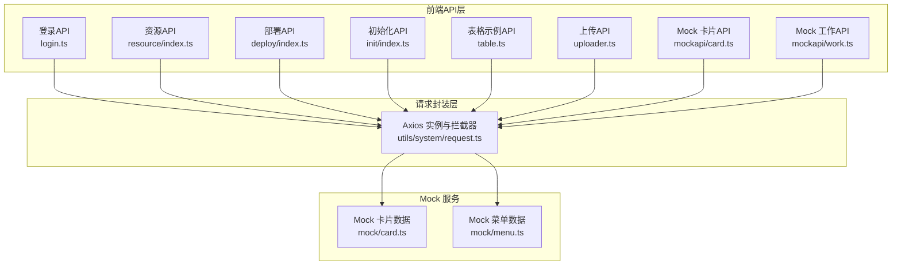
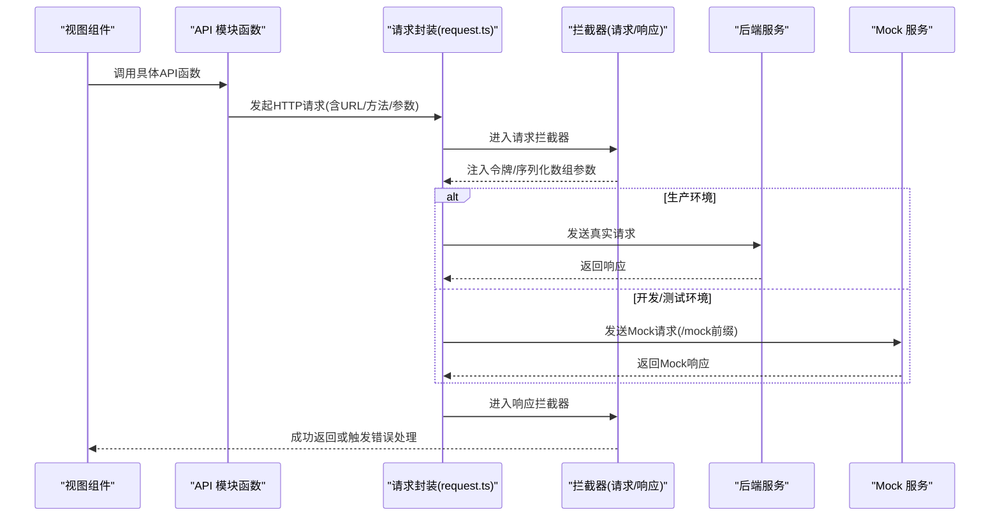
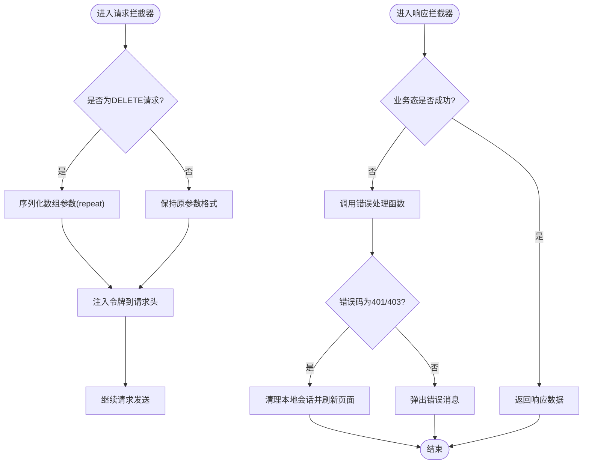
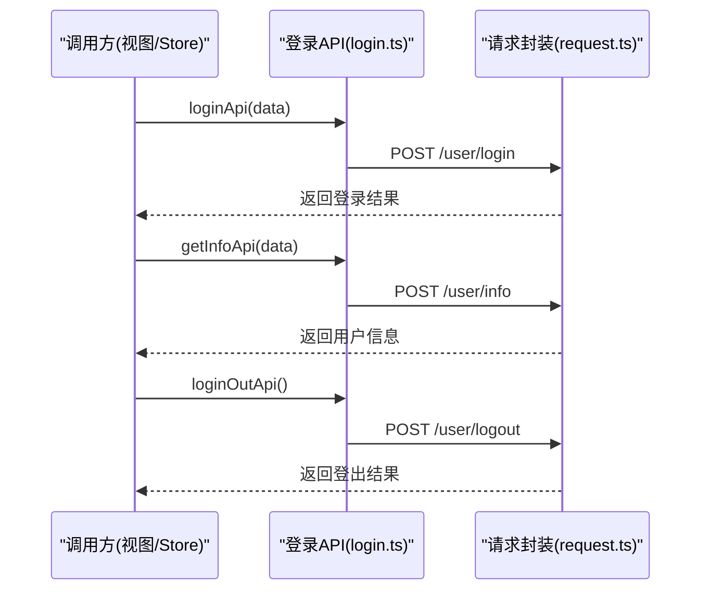
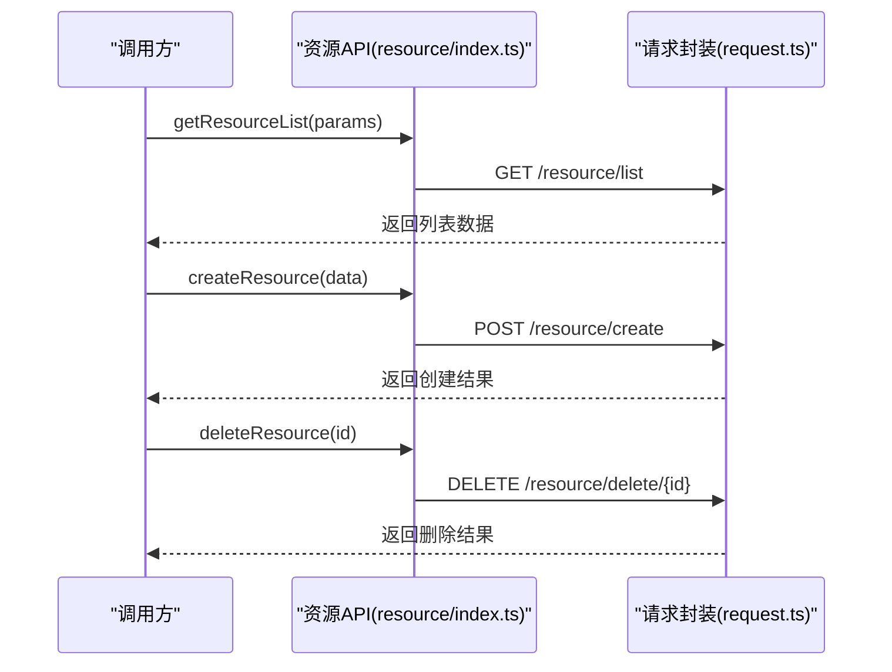
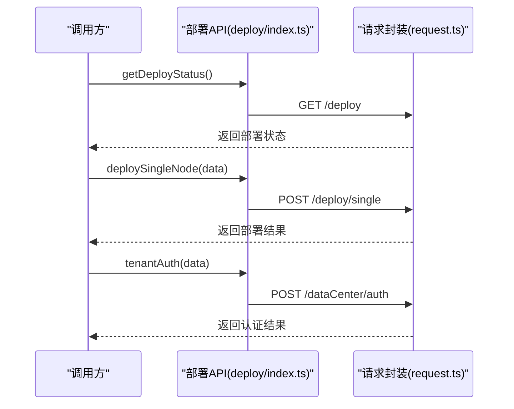
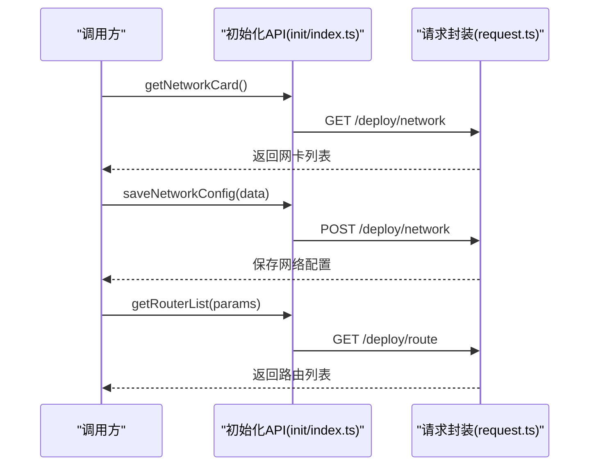
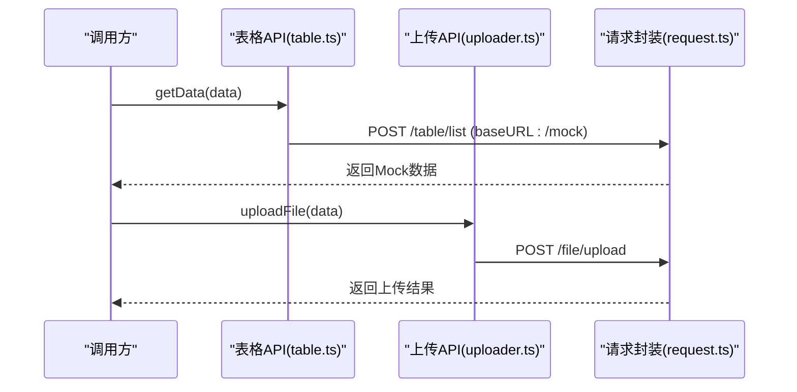
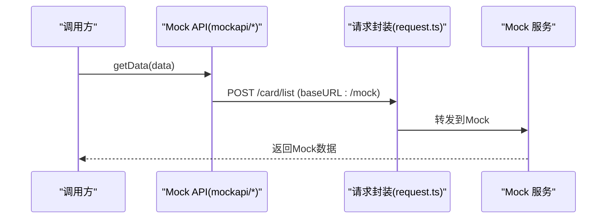
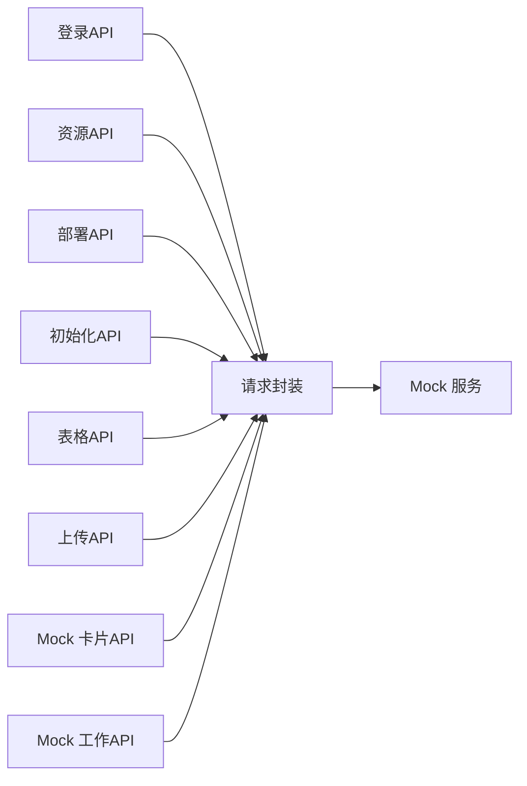

# API 接口集成

<cite>
**本文引用的文件**
- [request.ts](file://watcher-web/src/utils/system/request.ts)
- [login.ts](file://watcher-web/src/api/login/login.ts)
- [index.ts（部署API）](file://watcher-web/src/api/deploy/index.ts)
- [index.ts（资源API）](file://watcher-web/src/api/resource/index.ts)
- [index.ts（初始化API）](file://watcher-web/src/api/init/index.ts)
- [table.ts（表格示例API）](file://watcher-web/src/api/table.ts)
- [uploader.ts（上传API）](file://watcher-web/src/api/uploader.ts)
- [user.ts（用户示例API）](file://watcher-web/src/api/user.ts)
- [card.ts（Mock 卡片API）](file://watcher-web/src/api/mockapi/card.ts)
- [work.ts（Mock 工作API）](file://watcher-web/src/api/mockapi/work.ts)
- [card.ts（Mock 数据）](file://watcher-web/mock/card.ts)
- [menu.ts（Mock 菜单）](file://watcher-web/mock/menu.ts)
- [index.ts（系统配置）](file://watcher-web/src/config/index.ts)
</cite>

## 目录
1. [简介](#简介)
2. [项目结构](#项目结构)
3. [核心组件](#核心组件)
4. [架构总览](#架构总览)
5. [组件详解](#组件详解)
6. [依赖关系分析](#依赖关系分析)
7. [性能与稳定性建议](#性能与稳定性建议)
8. [故障排查指南](#故障排查指南)
9. [结论](#结论)
10. [附录：接口清单与最佳实践](#附录接口清单与最佳实践)

## 简介
本文件面向ShowTime前端系统的API集成，聚焦于HTTP请求封装与配置、拦截器与错误处理机制、API组织结构（资源管理、登录、部署等）、请求/响应处理流程（参数序列化、数据转换、状态码处理），并给出接口调用最佳实践（去重、超时与重试）、接口测试与Mock使用、以及联调流程建议。

## 项目结构
前端API相关代码主要位于以下位置：
- 请求封装与拦截器：watcher-web/src/utils/system/request.ts
- 功能域API：watcher-web/src/api/{resource, deploy, init, login, table, uploader, user, mockapi}
- Mock服务：watcher-web/mock/*.ts
- 系统配置：watcher-web/src/config/index.ts

图表来源
- [request.ts:1-81](file://watcher-web/src/utils/system/request.ts#L1-L81)
- [login.ts:1-52](file://watcher-web/src/api/login/login.ts#L1-L52)
- [index.ts（资源API）:1-67](file://watcher-web/src/api/resource/index.ts#L1-L67)
- [index.ts（部署API）:1-57](file://watcher-web/src/api/deploy/index.ts#L1-L57)
- [index.ts（初始化API）:1-141](file://watcher-web/src/api/init/index.ts#L1-L141)
- [table.ts（表格示例API）:1-61](file://watcher-web/src/api/table.ts#L1-L61)
- [uploader.ts（上传API）:1-21](file://watcher-web/src/api/uploader.ts#L1-L21)
- [card.ts（Mock 卡片API）:1-41](file://watcher-web/src/api/mockapi/card.ts#L1-L41)
- [work.ts（Mock 工作API）:1-12](file://watcher-web/src/api/mockapi/work.ts#L1-L12)
- [card.ts（Mock 数据）:1-28](file://watcher-web/mock/card.ts#L1-L28)
- [menu.ts（Mock 菜单）:1-29](file://watcher-web/mock/menu.ts#L1-L29)

章节来源
- [request.ts:1-81](file://watcher-web/src/utils/system/request.ts#L1-L81)
- [login.ts:1-52](file://watcher-web/src/api/login/login.ts#L1-L52)
- [index.ts（资源API）:1-67](file://watcher-web/src/api/resource/index.ts#L1-L67)
- [index.ts（部署API）:1-57](file://watcher-web/src/api/deploy/index.ts#L1-L57)
- [index.ts（初始化API）:1-141](file://watcher-web/src/api/init/index.ts#L1-L141)
- [table.ts（表格示例API）:1-61](file://watcher-web/src/api/table.ts#L1-L61)
- [uploader.ts（上传API）:1-21](file://watcher-web/src/api/uploader.ts#L1-L21)
- [card.ts（Mock 卡片API）:1-41](file://watcher-web/src/api/mockapi/card.ts#L1-L41)
- [work.ts（Mock 工作API）:1-12](file://watcher-web/src/api/mockapi/work.ts#L1-L12)
- [card.ts（Mock 数据）:1-28](file://watcher-web/mock/card.ts#L1-L28)
- [menu.ts（Mock 菜单）:1-29](file://watcher-web/mock/menu.ts#L1-L29)

## 核心组件
- Axios实例与拦截器：统一创建Axios实例，设置基础路径；在请求拦截器中对DELETE请求进行数组参数序列化，注入JWT令牌；在响应拦截器中按业务态返回或抛错，并通过消息提示与登出逻辑处理异常。
- API模块：按功能域拆分，如登录、资源、部署、初始化、上传、表格示例、Mock API等，每个模块导出函数式API，便于在视图层直接调用。
- Mock服务：基于Vite Mock插件，提供离线调试与联调支撑，支持不同路径与方法的模拟响应。

章节来源
- [request.ts:8-48](file://watcher-web/src/utils/system/request.ts#L8-L48)
- [login.ts:1-52](file://watcher-web/src/api/login/login.ts#L1-L52)
- [index.ts（资源API）:1-67](file://watcher-web/src/api/resource/index.ts#L1-L67)
- [index.ts（部署API）:1-57](file://watcher-web/src/api/deploy/index.ts#L1-L57)
- [index.ts（初始化API）:1-141](file://watcher-web/src/api/init/index.ts#L1-L141)
- [table.ts（表格示例API）:1-61](file://watcher-web/src/api/table.ts#L1-L61)
- [uploader.ts（上传API）:1-21](file://watcher-web/src/api/uploader.ts#L1-L21)
- [card.ts（Mock 卡片API）:1-41](file://watcher-web/src/api/mockapi/card.ts#L1-L41)
- [work.ts（Mock 工作API）:1-12](file://watcher-web/src/api/mockapi/work.ts#L1-L12)
- [card.ts（Mock 数据）:1-28](file://watcher-web/mock/card.ts#L1-L28)
- [menu.ts（Mock 菜单）:1-29](file://watcher-web/mock/menu.ts#L1-L29)

## 架构总览
下图展示了从视图层到后端接口的整体调用链路，以及Mock模式下的替代路径。

图表来源
- [request.ts:12-48](file://watcher-web/src/utils/system/request.ts#L12-L48)
- [login.ts:4-10](file://watcher-web/src/api/login/login.ts#L4-L10)
- [index.ts（资源API）:3-8](file://watcher-web/src/api/resource/index.ts#L3-L8)
- [index.ts（部署API）:4-8](file://watcher-web/src/api/deploy/index.ts#L4-L8)
- [index.ts（初始化API）:4-8](file://watcher-web/src/api/init/index.ts#L4-L8)
- [table.ts（表格示例API）:4-11](file://watcher-web/src/api/table.ts#L4-L11)
- [card.ts（Mock 数据）:3-28](file://watcher-web/mock/card.ts#L3-L28)

## 组件详解

### 请求封装与拦截器
- Axios实例创建：以环境变量作为基础路径，统一发起请求。
- 请求拦截器：
  - DELETE请求参数序列化：采用repeat格式，确保数组参数正确传递。
  - 注入令牌：从全局状态获取JWT令牌并写入请求头。
- 响应拦截器：
  - 业务态判断：依据返回字段判定成功/失败，成功透传数据，失败统一走错误处理。
  - 异常处理：网络错误与状态码错误统一弹窗提示；当错误码为401/403时，清理本地会话并刷新页面，实现自动登出。
- 错误提示：使用消息组件展示错误信息，避免阻断后续交互。

图表来源
- [request.ts:12-48](file://watcher-web/src/utils/system/request.ts#L12-L48)
- [request.ts:50-76](file://watcher-web/src/utils/system/request.ts#L50-L76)

章节来源
- [request.ts:8-48](file://watcher-web/src/utils/system/request.ts#L8-L48)
- [request.ts:50-76](file://watcher-web/src/utils/system/request.ts#L50-L76)

### 登录API
- 提供登录、获取用户信息、退出登录、修改密码、查询密码复杂度、获取菜单列表等接口。
- 所有接口均通过统一请求封装发起，自动携带令牌与参数序列化。

图表来源
- [login.ts:4-27](file://watcher-web/src/api/login/login.ts#L4-L27)
- [request.ts:12-29](file://watcher-web/src/utils/system/request.ts#L12-L29)

章节来源
- [login.ts:1-52](file://watcher-web/src/api/login/login.ts#L1-L52)

### 资源管理API
- 列表查询、详情查询、创建、批量创建、更新、删除、启用/禁用、远程状态切换等。
- 支持GET/POST/PUT/DELETE多种方法，部分接口通过路径参数或查询参数传递标识。

图表来源
- [index.ts（资源API）:3-41](file://watcher-web/src/api/resource/index.ts#L3-L41)
- [request.ts:12-29](file://watcher-web/src/utils/system/request.ts#L12-L29)

章节来源
- [index.ts（资源API）:1-67](file://watcher-web/src/api/resource/index.ts#L1-L67)

### 部署API
- 部署状态查询、单节点部署、批量部署、组件管理、租户认证、租户配置、WebSocket状态等。
- 涉及多类操作，统一由请求封装处理。

图表来源
- [index.ts（部署API）:4-36](file://watcher-web/src/api/deploy/index.ts#L4-L36)
- [request.ts:12-29](file://watcher-web/src/utils/system/request.ts#L12-L29)

章节来源
- [index.ts（部署API）:1-57](file://watcher-web/src/api/deploy/index.ts#L1-L57)

### 初始化API
- 包含网络配置、路由配置、步骤推进、收集IP、校验等大量初始化阶段的操作。
- 多数接口为GET/POST/PUT/DELETE组合，参数通过查询或请求体传递。

图表来源
- [index.ts（初始化API）:10-73](file://watcher-web/src/api/init/index.ts#L10-L73)
- [request.ts:12-29](file://watcher-web/src/utils/system/request.ts#L12-L29)

章节来源
- [index.ts（初始化API）:1-141](file://watcher-web/src/api/init/index.ts#L1-L141)

### 表格示例与上传API
- 表格示例API：提供列表、分类、树形、新增、编辑、删除等常用操作，且可切换到Mock模式。
- 上传API：提供文件检查与上传接口，支持GET/POST。

图表来源
- [table.ts（表格示例API）:4-11](file://watcher-web/src/api/table.ts#L4-L11)
- [uploader.ts（上传API）:10-15](file://watcher-web/src/api/uploader.ts#L10-L15)
- [request.ts:12-29](file://watcher-web/src/utils/system/request.ts#L12-L29)

章节来源
- [table.ts（表格示例API）:1-61](file://watcher-web/src/api/table.ts#L1-L61)
- [uploader.ts（上传API）:1-21](file://watcher-web/src/api/uploader.ts#L1-L21)

### Mock API与Mock数据
- Mock API：通过在请求中设置baseURL为“/mock”，将请求转发到Vite Mock服务。
- Mock数据：定义了卡片列表、工作列表、菜单等Mock接口，返回结构化的响应体。

图表来源
- [card.ts（Mock 卡片API）:4-11](file://watcher-web/src/api/mockapi/card.ts#L4-L11)
- [card.ts（Mock 数据）:5-26](file://watcher-web/mock/card.ts#L5-L26)
- [menu.ts（Mock 菜单）:20-28](file://watcher-web/mock/menu.ts#L20-L28)

章节来源
- [card.ts（Mock 卡片API）:1-41](file://watcher-web/src/api/mockapi/card.ts#L1-L41)
- [work.ts（Mock 工作API）:1-12](file://watcher-web/src/api/mockapi/work.ts#L1-L12)
- [card.ts（Mock 数据）:1-28](file://watcher-web/mock/card.ts#L1-L28)
- [menu.ts（Mock 菜单）:1-29](file://watcher-web/mock/menu.ts#L1-L29)

## 依赖关系分析
- API模块依赖请求封装层，所有HTTP请求经由同一Axios实例与拦截器，保证一致性。
- Mock模式通过在API层设置baseURL为“/mock”实现，不改变请求封装逻辑。
- 系统配置文件提供通用配置项，如系统标题等，与API无直接耦合。

图表来源
- [request.ts:1-81](file://watcher-web/src/utils/system/request.ts#L1-L81)
- [login.ts:1-52](file://watcher-web/src/api/login/login.ts#L1-L52)
- [index.ts（资源API）:1-67](file://watcher-web/src/api/resource/index.ts#L1-L67)
- [index.ts（部署API）:1-57](file://watcher-web/src/api/deploy/index.ts#L1-L57)
- [index.ts（初始化API）:1-141](file://watcher-web/src/api/init/index.ts#L1-L141)
- [table.ts（表格示例API）:1-61](file://watcher-web/src/api/table.ts#L1-L61)
- [uploader.ts（上传API）:1-21](file://watcher-web/src/api/uploader.ts#L1-L21)
- [card.ts（Mock 卡片API）:1-41](file://watcher-web/src/api/mockapi/card.ts#L1-L41)
- [work.ts（Mock 工作API）:1-12](file://watcher-web/src/api/mockapi/work.ts#L1-L12)

章节来源
- [request.ts:1-81](file://watcher-web/src/utils/system/request.ts#L1-L81)
- [index.ts（系统配置）:1-5](file://watcher-web/src/config/index.ts#L1-L5)

## 性能与稳定性建议
- 请求去重：在调用层引入请求去重策略（例如基于URL+参数的哈希），避免重复提交。
- 超时控制：在请求封装中增加默认超时时间，保障用户体验与资源释放。
- 重试机制：对幂等GET/下载类请求可引入指数退避重试，对非幂等请求谨慎重试。
- 并发控制：限制并发请求数量，防止风暴效应。
- 缓存策略：对只读列表/字典类数据加入缓存，减少无效请求。
- 错误收敛：统一错误上报与埋点，便于定位问题与统计失败率。

## 故障排查指南
- 登录态失效（401/403）：拦截器会自动清理本地会话并刷新页面，请确认令牌是否过期或被撤销。
- 参数序列化问题：DELETE请求数组参数需确保以repeat格式传递，避免后端解析异常。
- Mock未生效：确认API调用时baseURL是否设置为“/mock”，且Mock服务已启动。
- 状态码错误：响应拦截器会根据业务态与HTTP状态码统一弹窗提示，优先查看返回的错误码与消息。

章节来源
- [request.ts:41-76](file://watcher-web/src/utils/system/request.ts#L41-L76)

## 结论
通过统一的请求封装与拦截器，ShowTime前端实现了跨域、鉴权、参数序列化、错误处理的一致性；按功能域划分的API模块提升了可维护性；Mock体系为开发与联调提供了高效支撑。遵循本文最佳实践，可在保证稳定性的同时提升开发效率与用户体验。

## 附录：接口清单与最佳实践

### 接口清单（按模块）
- 登录API
  - 登录：POST /user/login
  - 获取用户信息：POST /user/info
  - 退出登录：POST /user/logout
  - 修改密码：PUT /user/modifyUser
  - 密码复杂度：GET /user/search/complexity
  - 菜单列表：POST /menu/list
- 资源API
  - 列表：GET /resource/list
  - 详情：GET /resource/detail/{id}
  - 创建：POST /resource/create
  - 批量创建：POST /resource/batchCreate
  - 更新：PUT /resource/update
  - 删除：DELETE /resource/delete/{id}
  - 启用/禁用：PUT /resource/usable/{id}
  - 远程状态：PUT /resource/remote/{id}
- 部署API
  - 部署状态：GET /deploy
  - 单节点部署：POST /deploy/single
  - 批量部署：POST /deploy/batch
  - 组件管理：PUT /deploy/manage
  - 租户认证：POST /dataCenter/auth
  - 租户配置：GET /dataCenter/dataCenterConfig
  - WebSocket状态：GET /dataCenter/websocketState
- 初始化API
  - 步骤状态：GET /dataCenter/step
  - 网卡列表：GET /deploy/network
  - 保存网络配置：POST /deploy/network
  - 获取网络配置：GET /deploy/network/master
  - DHCP IP：PUT /deploy/network/dhcp/{name}
  - WiFi列表：GET deploy/network/wifis
  - 节点网络配置列表：GET deploy/network/config/nodes
  - 编辑网络配置：PUT /deploy/network
  - 步骤推进：PUT /deploy/step
  - 节点网络信息：GET deploy/network/config/node
  - 路由列表：GET /deploy/route
  - 新增路由：POST /deploy/route
  - 收集IP：GET /deploy
  - 路由校验：POST /deploy/route/check
  - 编辑路由：PUT /deploy/route
  - 删除路由：DELETE /deploy/route
  - 新增路由校验：POST /deploy/route/add/check
  - 编辑路由校验：POST /deploy/route/edit/check
- 上传API
  - 文件检查：GET /file/upload
  - 文件上传：POST /file/upload
- 示例API（Mock）
  - 表格数据：POST /table/list | /table/category | /table/tree
  - 表格操作：POST /table/add | /table/update | /table/del
  - 卡片数据：POST /card/list
  - 工作数据：POST /work/list
  - 用户数据：POST /user/login | /user/info | /user/out | /user/passwordChange
  - 菜单数据：POST /menu/list

### 最佳实践
- 请求去重：在调用层基于URL+参数生成唯一Key，避免重复提交。
- 超时控制：在请求封装中设置合理默认超时，针对大文件/长耗时接口单独配置。
- 重试策略：对GET/下载等幂等请求采用指数退避重试，最大次数与抖动需评估。
- 参数规范：DELETE请求数组参数统一使用repeat格式；路径参数与查询参数清晰分离。
- 错误收敛：统一错误提示与日志上报，区分业务错误与网络错误。
- Mock使用：开发阶段优先使用Mock，明确baseURL切换；联调时逐步替换为真实服务。
- 联调流程：先Mock后真实，先弱依赖后强依赖，逐步接入真实后端，确保接口契约稳定。