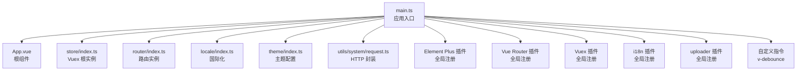
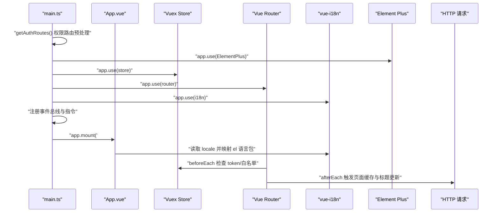
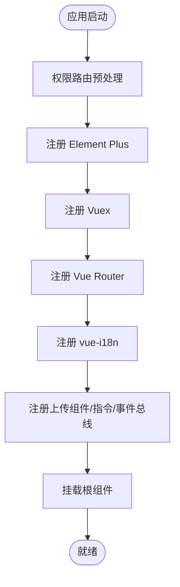
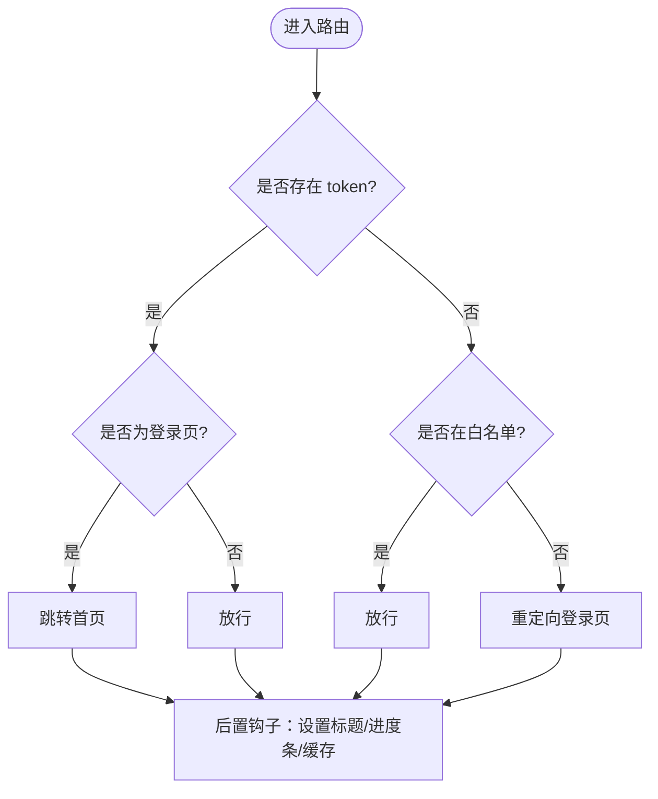
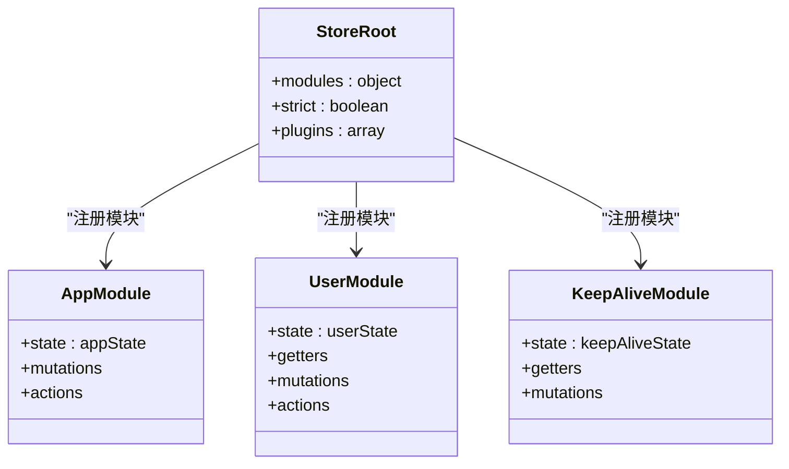
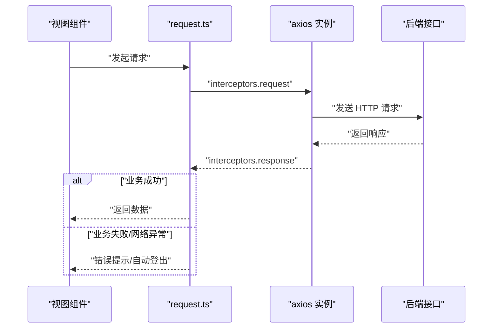
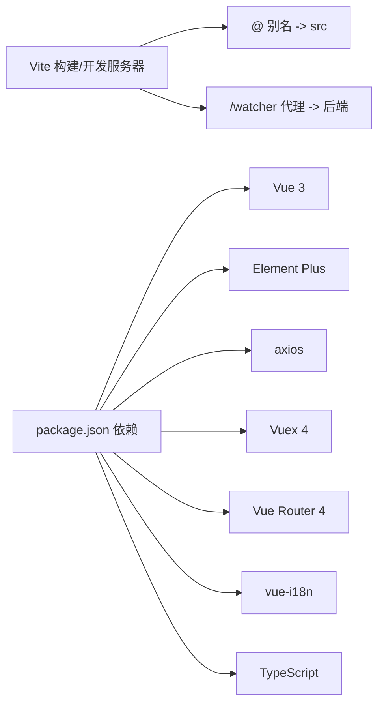

# Vue 3 架构设计

<cite>
**本文引用的文件**
- [package.json](file://watcher-web/package.json)
- [vite.config.ts](file://watcher-web/vite.config.ts)
- [tsconfig.json](file://watcher-web/tsconfig.json)
- [main.ts](file://watcher-web/src/main.ts)
- [App.vue](file://watcher-web/src/App.vue)
- [index.ts](file://watcher-web/src/config/index.ts)
- [index.ts](file://watcher-web/src/store/index.ts)
- [index.ts](file://watcher-web/src/router/index.ts)
- [index.ts](file://watcher-web/src/locale/index.ts)
- [index.ts](file://watcher-web/src/theme/index.ts)
- [app.ts](file://watcher-web/src/store/modules/app.ts)
- [user.ts](file://watcher-web/src/store/modules/user.ts)
- [keepAlive.ts](file://watcher-web/src/store/modules/keepAlive.ts)
- [index.ts](file://watcher-web/src/directive/debounce/index.ts)
- [request.ts](file://watcher-web/src/utils/system/request.ts)
</cite>

## 目录
1. [简介](#简介)
2. [项目结构](#项目结构)
3. [核心组件](#核心组件)
4. [架构总览](#架构总览)
5. [详细组件分析](#详细组件分析)
6. [依赖关系分析](#依赖关系分析)
7. [性能考虑](#性能考虑)
8. [故障排查指南](#故障排查指南)
9. [结论](#结论)
10. [附录](#附录)

## 简介
本文件面向 ShowTime 前端系统，聚焦于基于 Vue 3 Composition API 的应用架构设计与实现细节。内容涵盖应用初始化流程、全局配置与插件集成、TypeScript 类型体系、Element Plus 组件库集成与主题定制、Vite 构建配置与优化策略，并总结组件设计原则、代码组织结构与性能优化实践。目标是帮助开发者快速理解并高效维护该前端工程。

## 项目结构
前端工程位于 watcher-web 目录，采用 Vite + Vue 3 + TypeScript 技术栈，结合 Vuex 4、Vue Router 4、Element Plus 1.x 与 vue-i18n 实现国际化。核心入口为 main.ts，应用根组件为 App.vue；状态管理通过 store 模块化组织；路由采用 hash 模式并支持动态菜单与权限控制；国际化与主题系统分别通过 locale 与 theme 模块实现；工具层封装了请求拦截器与通用能力。

图表来源
- [main.ts:1-37](file://watcher-web/src/main.ts#L1-L37)
- [App.vue:1-39](file://watcher-web/src/App.vue#L1-L39)
- [index.ts:1-39](file://watcher-web/src/store/index.ts#L1-L39)
- [index.ts:1-73](file://watcher-web/src/router/index.ts#L1-L73)
- [index.ts:1-26](file://watcher-web/src/locale/index.ts#L1-L26)
- [index.ts:1-200](file://watcher-web/src/theme/index.ts#L1-L200)
- [request.ts:1-81](file://watcher-web/src/utils/system/request.ts#L1-L81)

章节来源
- [main.ts:1-37](file://watcher-web/src/main.ts#L1-L37)
- [vite.config.ts:1-50](file://watcher-web/vite.config.ts#L1-L50)
- [tsconfig.json:1-21](file://watcher-web/tsconfig.json#L1-L21)

## 核心组件
- 应用入口与初始化
  - 在 main.ts 中完成应用创建、插件注册、全局配置与挂载，包含 Element Plus、Vuex、Router、i18n、上传组件等插件的全局注册，同时注入事件总线与自定义指令。
- 根组件与国际化
  - App.vue 通过 el-config-provider 包裹，将 i18n 的语言包映射为 Element Plus 的语言配置，确保组件库文案随系统语言切换。
- 状态管理
  - store/index.ts 以模块化方式聚合 user、keepAlive、app 等模块，启用持久化插件与严格模式调试，统一管理用户态、页面缓存与应用配置。
- 路由与权限
  - router/index.ts 定义 hash 模式路由、白名单与前置守卫，结合 keep-alive 与标题变更逻辑，实现权限控制与页面缓存。
- 国际化
  - locale/index.ts 动态加载多语言模块，依据浏览器语言选择默认语言，并将语言设置写入 HTML 标签。
- 主题系统
  - theme/index.ts 定义多套样式风格（默认、中文、暗色），包含菜单、Logo、Header、容器、页面等区域的颜色与布局配置。
- 工具与请求
  - utils/system/request.ts 封装 axios，统一处理请求头、错误码与登录态失效场景，提供消息提示与自动登出逻辑。

章节来源
- [main.ts:1-37](file://watcher-web/src/main.ts#L1-L37)
- [App.vue:1-39](file://watcher-web/src/App.vue#L1-L39)
- [index.ts:1-39](file://watcher-web/src/store/index.ts#L1-L39)
- [index.ts:1-73](file://watcher-web/src/router/index.ts#L1-L73)
- [index.ts:1-26](file://watcher-web/src/locale/index.ts#L1-L26)
- [index.ts:1-200](file://watcher-web/src/theme/index.ts#L1-L200)
- [request.ts:1-81](file://watcher-web/src/utils/system/request.ts#L1-L81)

## 架构总览
下图展示了从应用启动到页面渲染的关键交互路径，包括插件注册、路由守卫、状态更新与国际化生效的顺序。

图表来源
- [main.ts:13-36](file://watcher-web/src/main.ts#L13-L36)
- [App.vue:7-25](file://watcher-web/src/App.vue#L7-L25)
- [index.ts:36-68](file://watcher-web/src/router/index.ts#L36-L68)
- [index.ts:32-38](file://watcher-web/src/store/index.ts#L32-L38)
- [request.ts:12-48](file://watcher-web/src/utils/system/request.ts#L12-L48)

## 详细组件分析

### 应用初始化与插件集成
- 初始化流程要点
  - 权限路由预处理：在应用挂载前执行权限路由处理，保证路由表与菜单一致。
  - 插件注册顺序：Element Plus → Vuex → Router → i18n → 上传组件 → 自定义指令。
  - 全局配置：Element Plus 的全局尺寸来自 store.app.elementSize；注入事件总线；根据环境决定是否接入统计。
- 最佳实践
  - 将第三方插件集中注册，避免分散在各处导致初始化顺序问题。
  - 将全局配置（如 Element Plus 尺寸）与状态管理解耦，通过 store 注入，便于运行时切换。

图表来源
- [main.ts:13-36](file://watcher-web/src/main.ts#L13-L36)

章节来源
- [main.ts:13-36](file://watcher-web/src/main.ts#L13-L36)

### TypeScript 类型体系与编译配置
- 编译选项
  - 目标与模块：ESNext；解析策略：Node；严格模式开启；支持 JSX 保留；启用 SourceMap；类型根目录指向 node_modules/@types；路径别名 @/* 指向 src/*。
- 类型使用
  - Store 根状态与模块状态接口化，确保类型安全与 IDE 提示。
  - 自定义指令与国际化模块均使用类型声明，提升可维护性。
- 建议
  - 对外暴露的公共常量与配置（如 systemTitle）建议使用类型导出，便于消费方获得类型推断。

章节来源
- [tsconfig.json:1-21](file://watcher-web/tsconfig.json#L1-L21)
- [index.ts:9-13](file://watcher-web/src/store/index.ts#L9-L13)
- [index.ts:14-28](file://watcher-web/src/store/modules/app.ts#L14-L28)
- [index.ts:5-8](file://watcher-web/src/store/modules/user.ts#L5-L8)
- [index.ts:6-9](file://watcher-web/src/directive/debounce/index.ts#L6-L9)

### Element Plus 集成与主题定制
- 集成方式
  - 在 main.ts 中按需引入样式与图标，并通过 app.use(ElementPlus, { size: store.state.app.elementSize }) 注册。
  - App.vue 使用 el-config-provider 将 i18n 的语言包映射为组件库语言配置。
- 主题定制
  - theme/index.ts 定义多套风格（默认、中文、暗色），覆盖菜单、Logo、Header、容器、页面等区域的颜色与布局。
  - 支持通过 CSS 变量与 SCSS 模块化组织主题，便于运行时切换与扩展。
- 按需引入策略
  - 当前已引入完整样式与图标，若需进一步减小体积，可在构建配置中配合按需导入工具进行裁剪（例如结合组件库的自动导入与样式按需引入插件）。

章节来源
- [main.ts:2-10](file://watcher-web/src/main.ts#L2-L10)
- [main.ts:28](file://watcher-web/src/main.ts#L28)
- [App.vue:2-4](file://watcher-web/src/App.vue#L2-L4)
- [index.ts:1-200](file://watcher-web/src/theme/index.ts#L1-L200)

### 路由与权限控制
- 路由结构
  - 使用 hash 模式，路由表由 modules 聚合，初始包含系统模块；通过 reactive 使菜单与模块同步更新。
- 权限控制
  - 白名单机制：未登录且访问受控路由时重定向至登录页。
  - 标题与进度条：路由前置阶段设置标题与进度条，后置阶段处理 keep-alive 缓存。
- 页面缓存
  - 根据 meta.cache 与组件名称动态加入 keep-alive 列表，减少重复渲染与资源消耗。

图表来源
- [index.ts:36-68](file://watcher-web/src/router/index.ts#L36-L68)

章节来源
- [index.ts:1-73](file://watcher-web/src/router/index.ts#L1-L73)
- [keepAlive.ts:1-51](file://watcher-web/src/store/modules/keepAlive.ts#L1-L51)

### 状态管理（Vuex）
- 模块化组织
  - app、user、keepAlive 三大模块分别负责应用配置、用户态与页面缓存；store 通过持久化插件实现跨会话状态保持。
- 类型约束
  - 模块状态接口化，确保在 actions/mutations/getters 中具备类型安全。
- 最佳实践
  - 将与用户强相关的信息（如 token）放入本地持久化，避免 session 导致多标签页丢失令牌。

图表来源
- [index.ts:32-38](file://watcher-web/src/store/index.ts#L32-L38)
- [app.ts:14-28](file://watcher-web/src/store/modules/app.ts#L14-L28)
- [user.ts:5-8](file://watcher-web/src/store/modules/user.ts#L5-L8)
- [keepAlive.ts:7-9](file://watcher-web/src/store/modules/keepAlive.ts#L7-L9)

章节来源
- [index.ts:1-39](file://watcher-web/src/store/index.ts#L1-L39)
- [app.ts:1-74](file://watcher-web/src/store/modules/app.ts#L1-L74)
- [user.ts:1-76](file://watcher-web/src/store/modules/user.ts#L1-L76)
- [keepAlive.ts:1-51](file://watcher-web/src/store/modules/keepAlive.ts#L1-L51)

### 国际化（vue-i18n）
- 动态加载
  - 使用 import.meta.globEager 动态聚合语言模块，避免手动维护模块清单。
- 默认语言
  - 优先使用 store.app.lang，否则回退至浏览器语言，中文环境默认 zh-cn。
- 语言包映射
  - App.vue 通过 el 属性将 i18n 的消息映射为 Element Plus 的语言包，确保组件文案与系统语言一致。

章节来源
- [index.ts:1-26](file://watcher-web/src/locale/index.ts#L1-L26)
- [App.vue:14-23](file://watcher-web/src/App.vue#L14-L23)

### 主题系统（Theme）
- 配置模型
  - 通过 Style/Colors 接口定义菜单、Logo、Header、容器、页面等区域的配色与布局。
- 多风格支持
  - 默认、中文、暗色三套风格，便于适配不同用户偏好与视觉需求。
- 运行时切换
  - 结合 store.app.theme 与 CSS 变量，实现主题风格的动态切换与持久化。

章节来源
- [index.ts:1-200](file://watcher-web/src/theme/index.ts#L1-L200)

### 自定义指令（防抖 v-debounce）
- 功能
  - 为按钮点击等高频事件提供防抖能力，避免重复提交或频繁触发。
- 实现
  - 指令在挂载时绑定点击事件，使用定时器控制回调触发时机；卸载时移除事件监听，防止内存泄漏。

章节来源
- [index.ts:1-32](file://watcher-web/src/directive/debounce/index.ts#L1-L32)

### HTTP 请求封装（axios）
- 统一拦截
  - 请求拦截：对 delete 方法序列化参数；携带 token；响应拦截：统一错误码校验与提示。
- 错误处理
  - 针对 401/403 自动清理本地存储并刷新页面；其他错误弹出消息提示。
- 配置来源
  - 基础地址通过 import.meta.env.VITE_BASE_URL 注入，便于多环境切换。

图表来源
- [request.ts:12-48](file://watcher-web/src/utils/system/request.ts#L12-L48)

章节来源
- [request.ts:1-81](file://watcher-web/src/utils/system/request.ts#L1-L81)

## 依赖关系分析
- 构建与运行
  - Vite 作为开发服务器与打包工具，配置别名 @ 指向 src，代理 /watcher 到后端服务，生产构建输出 dist。
  - package.json 定义脚本与依赖，包含 Vue 3、Element Plus、axios、vuex、vue-router、vue-i18n 等核心库。
- 类型与工具链
  - TypeScript 4.x 与 vue-tsc 提供类型检查；@vitejs/plugin-vue 与 @vue/compiler-sfc 支持单文件组件编译。
- 第三方库
  - Element Plus 提供 UI 组件与主题；vue-i18n 提供国际化；axios 提供 HTTP 能力；echarts 用于可视化；uploader 提供文件上传能力。

图表来源
- [vite.config.ts:9-34](file://watcher-web/vite.config.ts#L9-L34)
- [package.json:1-72](file://watcher-web/package.json#L1-L72)

章节来源
- [vite.config.ts:1-50](file://watcher-web/vite.config.ts#L1-L50)
- [package.json:1-72](file://watcher-web/package.json#L1-L72)

## 性能考虑
- 代码分割与懒加载
  - 构建配置中对 echarts 进行手动分包，减少首屏体积；可进一步对路由级组件与大体积依赖采用动态导入。
- 资源优化
  - 生产构建输出 dist，合理利用浏览器缓存；对静态资源启用压缩与哈希命名。
- 渲染与状态
  - 使用 keep-alive 缓存页面组件，减少重复渲染；在路由后置钩子中按需加入缓存列表。
- 网络与请求
  - 统一拦截器中对 delete 请求进行参数序列化，避免后端解析问题；对错误码进行分类处理，减少无效重试。
- 开发体验
  - TypeScript 严格模式与日志插件有助于早期发现潜在问题；SourceMap 便于定位问题。

## 故障排查指南
- 登录态失效
  - 现象：接口返回 401/403。
  - 处理：自动清理本地存储并刷新页面；检查 token 是否正确注入到请求头。
- 国际化不生效
  - 现象：组件文案未随语言切换。
  - 处理：确认 locale 模块已正确加载；检查 App.vue 的 el 语言包映射是否正确。
- 主题切换异常
  - 现象：切换主题后部分样式未更新。
  - 处理：确认主题变量与 CSS 变量一致；检查主题模块是否正确注入到应用。
- 路由跳转异常
  - 现象：未登录被重定向至登录页或白名单失效。
  - 处理：检查白名单配置与 beforeEach 逻辑；确认 token 获取与存储流程。

章节来源
- [request.ts:50-76](file://watcher-web/src/utils/system/request.ts#L50-L76)
- [index.ts:18-22](file://watcher-web/src/locale/index.ts#L18-L22)
- [index.ts:1-200](file://watcher-web/src/theme/index.ts#L1-L200)
- [index.ts:32-52](file://watcher-web/src/router/index.ts#L32-L52)

## 结论
该前端工程以 Vue 3 Composition API 为核心，结合 Element Plus、Vuex、Vue Router 与 vue-i18n，形成了清晰的模块化架构与完善的插件生态。通过统一的初始化流程、类型化的状态管理、动态的主题与国际化配置，以及健壮的请求拦截与权限控制，满足了复杂业务场景下的可维护性与可扩展性需求。建议在后续迭代中进一步推进按需引入与代码分割，持续优化首屏性能与用户体验。

## 附录
- 常用命令
  - 开发：npm run dev 或 yarn dev
  - 预览：npm run serve 或 yarn serve
  - 生产构建：npm run build 或 yarn build
  - 预发构建：npm run build:stag 或 yarn build:stag
- 关键配置
  - Vite 别名 @ 指向 src；开发服务器 host 0.0.0.0，端口 9090；代理 /watcher 指向后端。
  - TypeScript 严格模式、ESNext 目标与 Node 解析策略。
- 公共常量
  - systemTitle 用于系统标题与浏览器标题显示，建议通过 i18n 键值管理。

章节来源
- [package.json:4-10](file://watcher-web/package.json#L4-L10)
- [vite.config.ts:13-48](file://watcher-web/vite.config.ts#L13-L48)
- [tsconfig.json:2-18](file://watcher-web/tsconfig.json#L2-L18)
- [index.ts:1-5](file://watcher-web/src/config/index.ts#L1-L5)