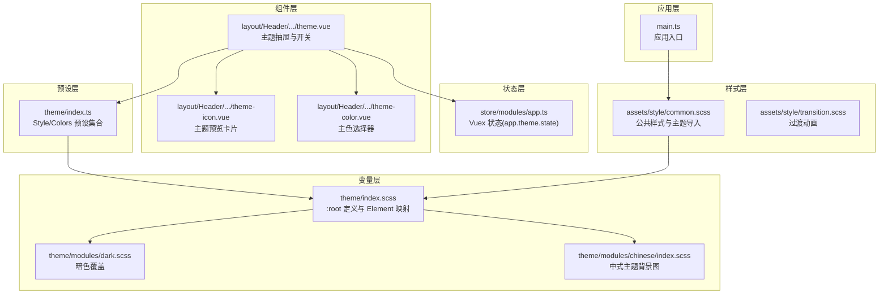
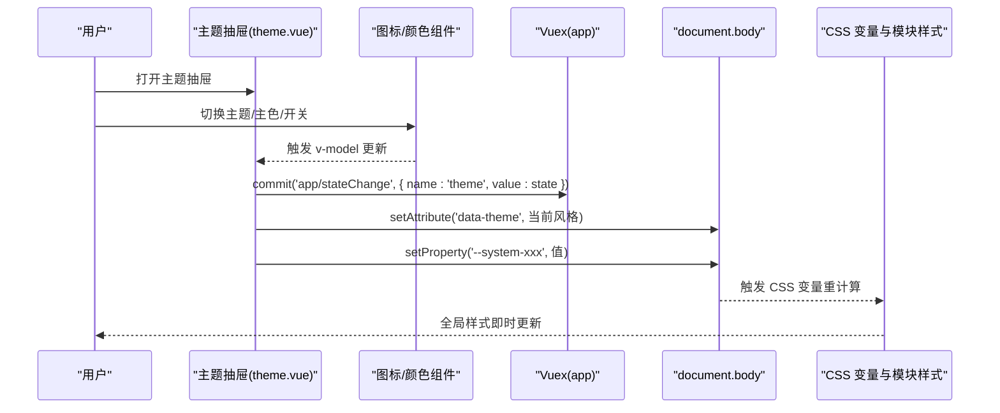
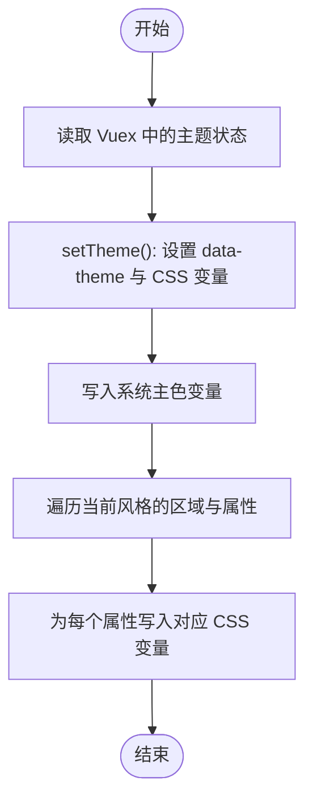
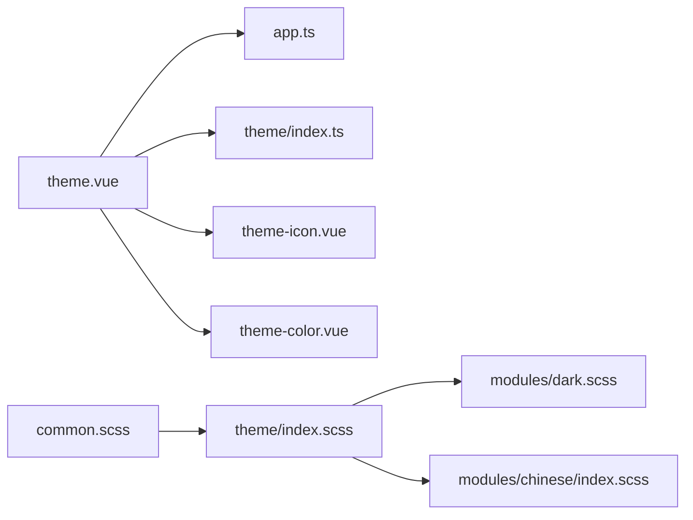

# 主题系统

<cite>
**本文引用的文件**
- [watcher-web/src/theme/index.ts](file://watcher-web/src/theme/index.ts)
- [watcher-web/src/theme/index.scss](file://watcher-web/src/theme/index.scss)
- [watcher-web/src/theme/modules/dark.scss](file://watcher-web/src/theme/modules/dark.scss)
- [watcher-web/src/theme/modules/chinese/index.scss](file://watcher-web/src/theme/modules/chinese/index.scss)
- [watcher-web/src/layout/Header/functionList/theme.vue](file://watcher-web/src/layout/Header/functionList/theme.vue)
- [watcher-web/src/layout/Header/functionList/theme/theme-icon.vue](file://watcher-web/src/layout/Header/functionList/theme/theme-icon.vue)
- [watcher-web/src/layout/Header/functionList/theme/theme-color.vue](file://watcher-web/src/layout/Header/functionList/theme/theme-color.vue)
- [watcher-web/src/assets/style/common.scss](file://watcher-web/src/assets/style/common.scss)
- [watcher-web/src/assets/style/transition.scss](file://watcher-web/src/assets/style/transition.scss)
- [watcher-web/src/store/modules/app.ts](file://watcher-web/src/store/modules/app.ts)
- [watcher-web/src/main.ts](file://watcher-web/src/main.ts)
</cite>

## 目录
1. [简介](#简介)
2. [项目结构](#项目结构)
3. [核心组件](#核心组件)
4. [架构总览](#架构总览)
5. [详细组件分析](#详细组件分析)
6. [依赖关系分析](#依赖关系分析)
7. [性能考量](#性能考量)
8. [故障排查指南](#故障排查指南)
9. [结论](#结论)
10. [附录](#附录)

## 简介
本文件系统性梳理 ShowTime 前端的主题系统，围绕以下目标展开：
- CSS 变量体系与管理：主题变量的定义、命名规范、作用域与动态修改机制
- Element Plus 主题定制：通过 CSS 变量映射与模块化样式覆盖实现组件级主题化
- 暗色模式实现：颜色方案、过渡动画与用户偏好的持久化
- 主题切换机制：状态管理、样式动态加载与性能优化
- 开发指南：新增主题、颜色规范与兼容性建议

## 项目结构
主题系统由“变量层（CSS 变量）+ 预设层（主题集合）+ 组件层（主题面板与图标/颜色选择器）+ 存储层（Vuex 状态）+ 应用层（入口注入与按需模块）”构成。

图表来源
- [watcher-web/src/main.ts:1-37](file://watcher-web/src/main.ts#L1-L37)
- [watcher-web/src/assets/style/common.scss:1-142](file://watcher-web/src/assets/style/common.scss#L1-L142)
- [watcher-web/src/theme/index.scss:1-51](file://watcher-web/src/theme/index.scss#L1-L51)
- [watcher-web/src/theme/modules/dark.scss:1-23](file://watcher-web/src/theme/modules/dark.scss#L1-L23)
- [watcher-web/src/theme/modules/chinese/index.scss:1-7](file://watcher-web/src/theme/modules/chinese/index.scss#L1-L7)
- [watcher-web/src/theme/index.ts:1-200](file://watcher-web/src/theme/index.ts#L1-L200)
- [watcher-web/src/layout/Header/functionList/theme.vue:1-190](file://watcher-web/src/layout/Header/functionList/theme.vue#L1-L190)
- [watcher-web/src/layout/Header/functionList/theme/theme-icon.vue:1-130](file://watcher-web/src/layout/Header/functionList/theme/theme-icon.vue#L1-L130)
- [watcher-web/src/layout/Header/functionList/theme/theme-color.vue:1-77](file://watcher-web/src/layout/Header/functionList/theme/theme-color.vue#L1-L77)
- [watcher-web/src/store/modules/app.ts:1-74](file://watcher-web/src/store/modules/app.ts#L1-L74)

章节来源
- [watcher-web/src/main.ts:1-37](file://watcher-web/src/main.ts#L1-L37)
- [watcher-web/src/assets/style/common.scss:1-142](file://watcher-web/src/assets/style/common.scss#L1-L142)
- [watcher-web/src/theme/index.scss:1-51](file://watcher-web/src/theme/index.scss#L1-L51)
- [watcher-web/src/theme/modules/dark.scss:1-23](file://watcher-web/src/theme/modules/dark.scss#L1-L23)
- [watcher-web/src/theme/modules/chinese/index.scss:1-7](file://watcher-web/src/theme/modules/chinese/index.scss#L1-L7)
- [watcher-web/src/theme/index.ts:1-200](file://watcher-web/src/theme/index.ts#L1-L200)
- [watcher-web/src/layout/Header/functionList/theme.vue:1-190](file://watcher-web/src/layout/Header/functionList/theme.vue#L1-L190)
- [watcher-web/src/layout/Header/functionList/theme/theme-icon.vue:1-130](file://watcher-web/src/layout/Header/functionList/theme/theme-icon.vue#L1-L130)
- [watcher-web/src/layout/Header/functionList/theme/theme-color.vue:1-77](file://watcher-web/src/layout/Header/functionList/theme/theme-color.vue#L1-L77)
- [watcher-web/src/store/modules/app.ts:1-74](file://watcher-web/src/store/modules/app.ts#L1-L74)

## 核心组件
- CSS 变量层（:root）
  - 在根作用域集中声明系统主色、Logo、菜单、Header、容器、页面等变量，并将 Element Plus 的主色映射到系统主色，确保组件继承一致的主题色。
  - 同时对进度条颜色进行主题化映射，保证整体视觉一致性。
- 主题预设层（Style/Colors）
  - 以接口与常量形式定义多套主题风格（如 default、chinese、dark），每套风格包含菜单、Logo、Header、容器、页面等区域的颜色配置。
  - 预设中部分字段使用系统变量占位，便于运行时替换。
- 组件层（主题抽屉与选择器）
  - 主题抽屉负责渲染主题预设卡片、主色选择器与若干开关项；通过双向绑定更新状态，并在变更时写入 Vuex。
  - 主题图标组件用于展示各主题的配色示意；主色组件用于选择主色与对应文字色。
- 状态层（Vuex app 模块）
  - app.state.app.theme.state 记录当前主题状态（style、primaryColor、menuType 等），供主题抽屉读取与写回。
- 应用层（入口与模块化样式）
  - 入口文件引入 Element Plus 样式与公共样式；中式主题的背景图通过模块样式按需引入，避免打包冗余。

章节来源
- [watcher-web/src/theme/index.scss:1-51](file://watcher-web/src/theme/index.scss#L1-L51)
- [watcher-web/src/theme/index.ts:1-200](file://watcher-web/src/theme/index.ts#L1-L200)
- [watcher-web/src/layout/Header/functionList/theme.vue:1-190](file://watcher-web/src/layout/Header/functionList/theme.vue#L1-L190)
- [watcher-web/src/layout/Header/functionList/theme/theme-icon.vue:1-130](file://watcher-web/src/layout/Header/functionList/theme/theme-icon.vue#L1-L130)
- [watcher-web/src/layout/Header/functionList/theme/theme-color.vue:1-77](file://watcher-web/src/layout/Header/functionList/theme/theme-color.vue#L1-L77)
- [watcher-web/src/store/modules/app.ts:1-74](file://watcher-web/src/store/modules/app.ts#L1-L74)
- [watcher-web/src/main.ts:1-37](file://watcher-web/src/main.ts#L1-L37)

## 架构总览
主题系统遵循“变量驱动 + 预设驱动 + 组件驱动”的三层协同：
- 变量驱动：:root 中的 CSS 变量是所有样式的根，Element Plus 与业务样式均依赖这些变量。
- 预设驱动：theme/index.ts 提供多套风格预设，抽屉根据当前选中风格批量写入变量。
- 组件驱动：主题抽屉监听状态变化，实时调用 setTheme 将变量写入 document.body，从而驱动全局样式刷新。

图表来源
- [watcher-web/src/layout/Header/functionList/theme.vue:78-140](file://watcher-web/src/layout/Header/functionList/theme.vue#L78-L140)
- [watcher-web/src/store/modules/app.ts:60-62](file://watcher-web/src/store/modules/app.ts#L60-L62)
- [watcher-web/src/theme/index.scss:1-51](file://watcher-web/src/theme/index.scss#L1-L51)
- [watcher-web/src/theme/modules/dark.scss:1-23](file://watcher-web/src/theme/modules/dark.scss#L1-L23)

## 详细组件分析

### CSS 变量与作用域
- 变量命名规范
  - 采用统一前缀 --system-，后接区域名（如 menu、header、page）与具体属性（驼峰转短横线），例如 --system-header-background。
  - Element Plus 主色通过 --el-color-primary 与系统主色关联，确保组件继承一致。
- 作用域控制
  - :root 定义全局变量，适用于整个文档树。
  - data-theme 属性写在 body 上，用于按主题选择模块化样式（如暗色覆盖与中式主题背景图）。
- 动态修改机制
  - 通过 JavaScript 对 document.body.style.setProperty 写入变量值，立即触发布局与绘制。
  - 主题抽屉在 watch(state) 中触发 setTheme，实现无刷新切换。

章节来源
- [watcher-web/src/theme/index.scss:1-51](file://watcher-web/src/theme/index.scss#L1-L51)
- [watcher-web/src/layout/Header/functionList/theme.vue:96-127](file://watcher-web/src/layout/Header/functionList/theme.vue#L96-L127)

### 主题预设与 Element Plus 定制
- 预设结构
  - Style 接口聚合多套 Colors，每套 Colors 包含 menu、logo、header、container、page 等区域键。
  - 预设中的部分字段使用系统变量占位，便于运行时替换。
- Element Plus 定制
  - 通过将 --el-color-primary 映射到 --system-primary-color，使 Element Plus 组件继承系统主色。
  - 暗色覆盖模块针对特定组件（如 Tree、Card）补充暗色下的背景与边框颜色，保证对比度与可读性。
- 中式主题背景图
  - 中式主题通过模块样式为 .el-main 注入背景图，需在入口按需引入该模块样式。

章节来源
- [watcher-web/src/theme/index.ts:35-200](file://watcher-web/src/theme/index.ts#L35-L200)
- [watcher-web/src/theme/index.scss:35-37](file://watcher-web/src/theme/index.scss#L35-L37)
- [watcher-web/src/theme/modules/dark.scss:1-23](file://watcher-web/src/theme/modules/dark.scss#L1-L23)
- [watcher-web/src/theme/modules/chinese/index.scss:1-7](file://watcher-web/src/theme/modules/chinese/index.scss#L1-L7)

### 暗色模式实现原理
- 颜色方案设计
  - 暗色模式下，页面背景、文本、边框等变量值降低亮度或提高对比度，确保可读性。
  - 针对 Element Plus 组件补充暗色变量覆盖，如 Tree 节点悬停背景与 Card 边框颜色。
- 过渡动画效果
  - 使用过渡动画 SCSS 片段，保证路由切换与面包屑切换时的平滑体验。
- 用户偏好保存
  - 当前状态存储于 Vuex app.state.app.theme.state，可在持久化插件或本地存储中扩展保存。

章节来源
- [watcher-web/src/theme/modules/dark.scss:1-23](file://watcher-web/src/theme/modules/dark.scss#L1-L23)
- [watcher-web/src/assets/style/transition.scss:1-37](file://watcher-web/src/assets/style/transition.scss#L1-L37)
- [watcher-web/src/store/modules/app.ts:39-45](file://watcher-web/src/store/modules/app.ts#L39-L45)

### 主题切换机制
- 主题状态管理
  - 主题抽屉从 Vuex 读取当前状态，使用 v-model 双向绑定更新 style、primaryColor、menuType 等字段。
  - 状态变更后，commit 到 app/stateChange，确保全局可追踪。
- 样式动态加载
  - setTheme 函数：
    - 设置 body 的 data-theme；
    - 写入系统主色；
    - 遍历当前风格的所有区域与属性，生成变量名并写入 document.body.style。
- 性能优化策略
  - 仅在状态变更时执行 setTheme，避免重复写入；
  - 变量写入使用原生 API，避免触发不必要的重排/重绘；
  - 暗色覆盖与中式主题按需引入，减少初始包体。

图表来源
- [watcher-web/src/layout/Header/functionList/theme.vue:96-127](file://watcher-web/src/layout/Header/functionList/theme.vue#L96-L127)

章节来源
- [watcher-web/src/layout/Header/functionList/theme.vue:78-140](file://watcher-web/src/layout/Header/functionList/theme.vue#L78-L140)
- [watcher-web/src/store/modules/app.ts:60-62](file://watcher-web/src/store/modules/app.ts#L60-L62)

### 主题开发指南
- 新增主题
  - 在 theme/index.ts 的 Style 中添加新键，定义 Colors 结构（menu/logo/header/container/page）。
  - 在 theme/index.scss 中为新主题补充必要的变量映射或覆盖。
  - 如需模块化样式（如背景图），在 theme/modules 下新增目录与样式文件，并在入口按需引入。
- 颜色规范
  - 使用 --system- 前缀统一变量命名，区域与属性使用短横线分隔。
  - 保持主色与文本色搭配，避免高亮与背景色冲突。
- 兼容性考虑
  - Element Plus 组件依赖 --el-color-primary，务必同步更新。
  - 暗色模式下注意对比度与可读性，必要时在模块样式中补充覆盖。
  - 中式主题背景图需在入口按需引入，避免打包体积膨胀。

章节来源
- [watcher-web/src/theme/index.ts:35-200](file://watcher-web/src/theme/index.ts#L35-L200)
- [watcher-web/src/theme/index.scss:1-51](file://watcher-web/src/theme/index.scss#L1-L51)
- [watcher-web/src/theme/modules/chinese/index.scss:1-7](file://watcher-web/src/theme/modules/chinese/index.scss#L1-L7)
- [watcher-web/src/main.ts:9-9](file://watcher-web/src/main.ts#L9-L9)

## 依赖关系分析
- 主题抽屉依赖
  - Vuex 状态：读取与写回 app.theme.state
  - 主题预设：读取 theme/index.ts 的 Style/Colors
  - 组件：theme-icon 与 theme-color 提供可视化选择
- 样式依赖
  - 公共样式引入主题变量层，确保业务样式可直接使用系统变量
  - 暗色与中式主题通过模块样式按需引入

图表来源
- [watcher-web/src/layout/Header/functionList/theme.vue:54-77](file://watcher-web/src/layout/Header/functionList/theme.vue#L54-L77)
- [watcher-web/src/store/modules/app.ts:39-45](file://watcher-web/src/store/modules/app.ts#L39-L45)
- [watcher-web/src/theme/index.ts:35-200](file://watcher-web/src/theme/index.ts#L35-L200)
- [watcher-web/src/assets/style/common.scss:1-2](file://watcher-web/src/assets/style/common.scss#L1-L2)
- [watcher-web/src/theme/index.scss:1-51](file://watcher-web/src/theme/index.scss#L1-L51)
- [watcher-web/src/theme/modules/dark.scss:1-23](file://watcher-web/src/theme/modules/dark.scss#L1-L23)
- [watcher-web/src/theme/modules/chinese/index.scss:1-7](file://watcher-web/src/theme/modules/chinese/index.scss#L1-L7)

章节来源
- [watcher-web/src/layout/Header/functionList/theme.vue:54-77](file://watcher-web/src/layout/Header/functionList/theme.vue#L54-L77)
- [watcher-web/src/assets/style/common.scss:1-2](file://watcher-web/src/assets/style/common.scss#L1-L2)
- [watcher-web/src/theme/index.scss:1-51](file://watcher-web/src/theme/index.scss#L1-L51)

## 性能考量
- 变量写入成本低：通过 document.body.style.setProperty 写入，避免复杂 DOM 操作
- 按需引入模块样式：暗色与中式主题按需引入，减少初始加载
- 状态变更最小化：仅在用户交互时触发 setTheme，避免频繁重绘
- 组件继承 Element Plus：无需额外打包组件样式，降低体积

## 故障排查指南
- 主题不生效
  - 检查是否正确设置 body 的 data-theme 与系统变量
  - 确认入口已引入模块化样式（如中式主题背景图）
- Element Plus 颜色未更新
  - 确认 --el-color-primary 已映射到 --system-primary-color
- 暗色模式下组件颜色异常
  - 检查 modules/dark.scss 是否覆盖了对应组件的背景与边框变量
- 切换后样式闪烁
  - 确保仅在状态变更时调用 setTheme，避免重复写入

章节来源
- [watcher-web/src/layout/Header/functionList/theme.vue:96-127](file://watcher-web/src/layout/Header/functionList/theme.vue#L96-L127)
- [watcher-web/src/theme/index.scss:35-37](file://watcher-web/src/theme/index.scss#L35-L37)
- [watcher-web/src/theme/modules/dark.scss:1-23](file://watcher-web/src/theme/modules/dark.scss#L1-L23)
- [watcher-web/src/main.ts:9-9](file://watcher-web/src/main.ts#L9-L9)

## 结论
ShowTime 前端主题系统以 CSS 变量为核心，结合预设风格与组件化选择器，实现了灵活、可扩展且高性能的主题切换能力。通过将 Element Plus 主色与系统变量绑定，以及模块化样式覆盖，系统在保证一致性的同时兼顾了暗色模式与特殊主题（如中式）的差异化需求。建议在后续迭代中完善用户偏好的持久化与主题预设的国际化文案管理。

## 附录
- 关键变量与区域对照
  - 主色与文本色：--system-primary-color、--system-primary-text-color
  - Logo：--system-logo-color、--system-logo-background
  - 菜单：--system-menu-text-color、--system-menu-background、--system-menu-hover-background、--system-menu-submenu-active-color
  - Header：--system-header-background、--system-header-text-color、--system-header-breadcrumb-text-color、--system-header-item-hover-color、--system-header-border-color、--system-header-tab-background
  - 容器：--system-container-background、--system-container-main-background
  - 页面：--system-page-background、--system-page-color、--system-page-tip-color、--system-page-border-color
- Element Plus 映射
  - --el-color-primary → --system-primary-color