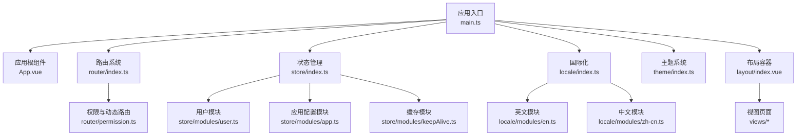
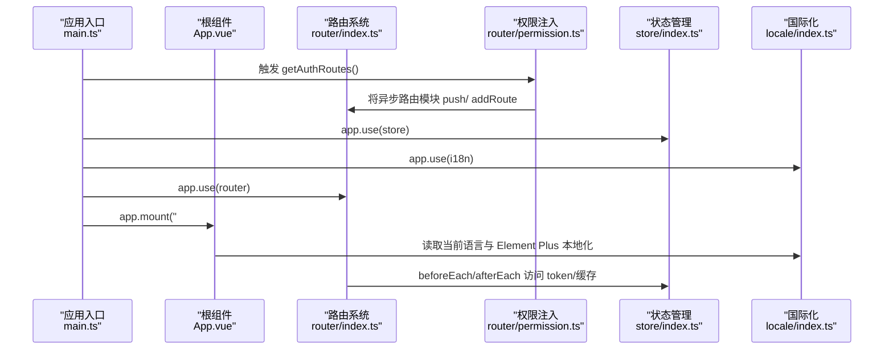
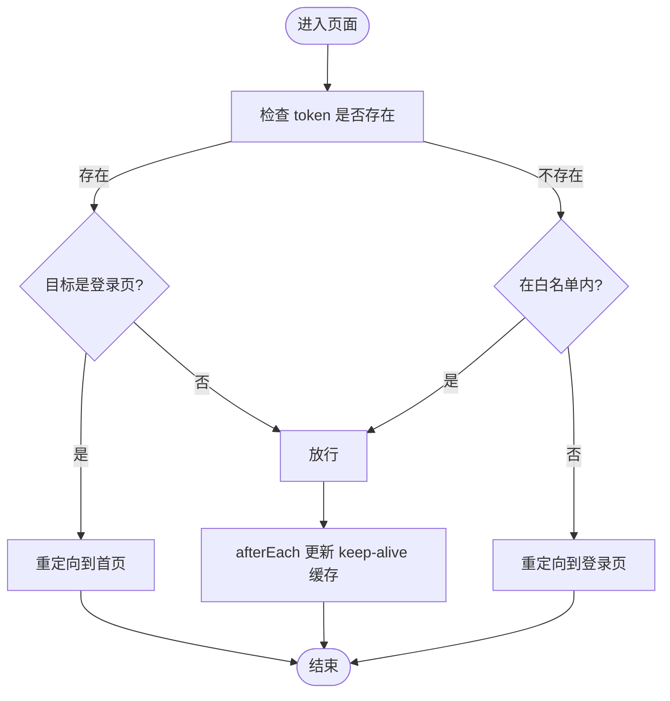
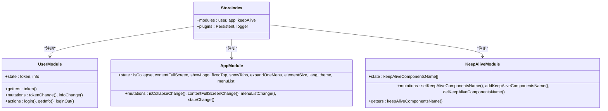
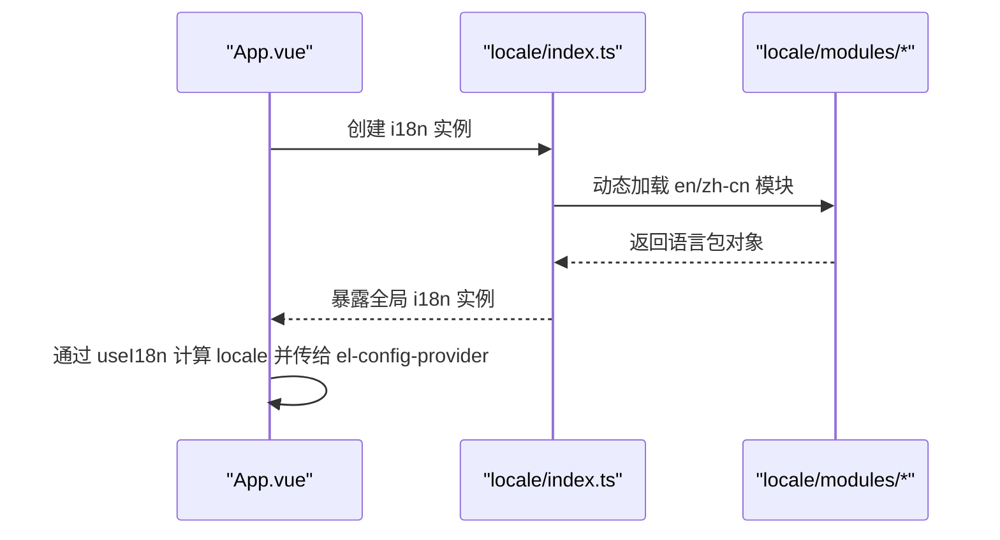
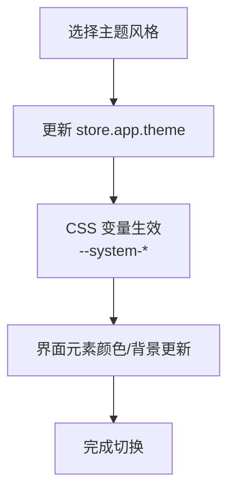
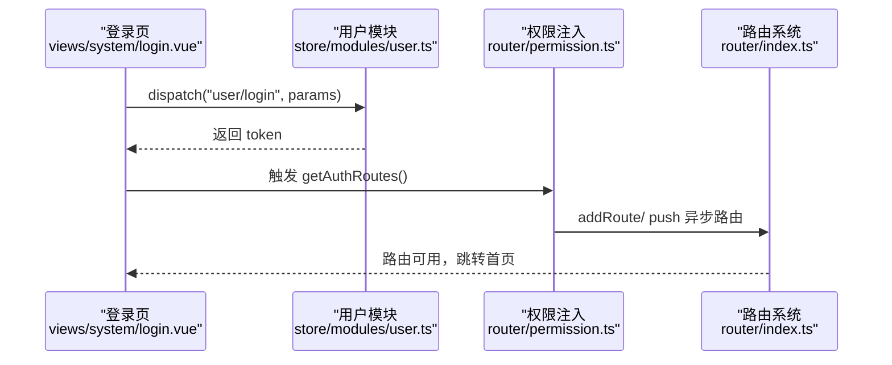
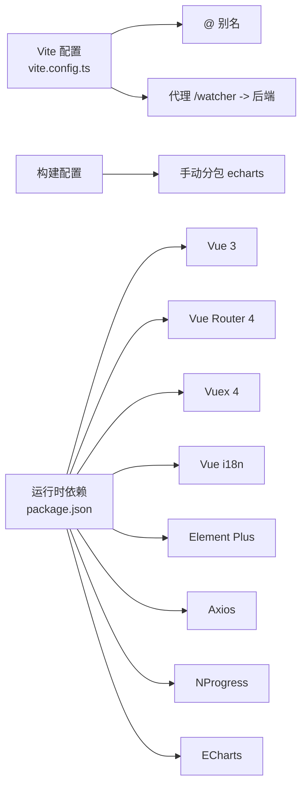

# 前端管理系统

<cite>
**本文引用的文件**
- [package.json](file://watcher-web/package.json)
- [main.ts](file://watcher-web/src/main.ts)
- [App.vue](file://watcher-web/src/App.vue)
- [router/index.ts](file://watcher-web/src/router/index.ts)
- [router/permission.ts](file://watcher-web/src/router/permission.ts)
- [store/index.ts](file://watcher-web/src/store/index.ts)
- [store/modules/user.ts](file://watcher-web/src/store/modules/user.ts)
- [store/modules/keepAlive.ts](file://watcher-web/src/store/modules/keepAlive.ts)
- [store/modules/app.ts](file://watcher-web/src/store/modules/app.ts)
- [locale/index.ts](file://watcher-web/src/locale/index.ts)
- [locale/modules/en.ts](file://watcher-web/src/locale/modules/en.ts)
- [locale/modules/zh-cn.ts](file://watcher-web/src/locale/modules/zh-cn.ts)
- [theme/index.ts](file://watcher-web/src/theme/index.ts)
- [vite.config.ts](file://watcher-web/vite.config.ts)
- [layout/index.vue](file://watcher-web/src/layout/index.vue)
- [views/system/login.vue](file://watcher-web/src/views/system/login.vue)
</cite>

## 目录
1. [简介](#简介)
2. [项目结构](#项目结构)
3. [核心组件](#核心组件)
4. [架构总览](#架构总览)
5. [详细组件分析](#详细组件分析)
6. [依赖关系分析](#依赖关系分析)
7. [性能考虑](#性能考虑)
8. [故障排查指南](#故障排查指南)
9. [结论](#结论)
10. [附录](#附录)

## 简介
本文件为 ShowTime 监控系统的前端管理系统技术文档，聚焦于基于 Vue 3 + TypeScript 的前端架构设计与实现细节。内容涵盖组件化开发模式、响应式数据绑定与类型安全、路由系统与权限控制、状态管理（Vuex）模块化与持久化、国际化（i18n）机制、主题系统（含 CSS 变量与暗色模式）、UI 组件库使用与自定义组件开发、以及性能优化与最佳实践。

## 项目结构
前端工程位于 watcher-web 目录，采用 Vite + Vue 3 + TypeScript 技术栈，结合 Element Plus、Vuex、Vue Router、Vue i18n 等生态库。整体采用“按功能域划分”的目录组织方式：
- 应用入口与挂载：main.ts、App.vue
- 路由系统：router/index.ts、router/permission.ts、router/modules/*
- 状态管理：store/index.ts、store/modules/*
- 国际化：locale/index.ts、locale/modules/*
- 主题系统：theme/index.ts、theme/modules/*
- 构建与代理：vite.config.ts
- 布局与视图：layout/index.vue、views/*

图表来源
- [main.ts:1-37](file://watcher-web/src/main.ts#L1-L37)
- [App.vue:1-39](file://watcher-web/src/App.vue#L1-L39)
- [router/index.ts:1-73](file://watcher-web/src/router/index.ts#L1-L73)
- [router/permission.ts:1-60](file://watcher-web/src/router/permission.ts#L1-L60)
- [store/index.ts:1-39](file://watcher-web/src/store/index.ts#L1-L39)
- [store/modules/user.ts:1-76](file://watcher-web/src/store/modules/user.ts#L1-L76)
- [store/modules/app.ts:1-74](file://watcher-web/src/store/modules/app.ts#L1-L74)
- [store/modules/keepAlive.ts:1-51](file://watcher-web/src/store/modules/keepAlive.ts#L1-L51)
- [locale/index.ts:1-26](file://watcher-web/src/locale/index.ts#L1-L26)
- [locale/modules/en.ts:1-22](file://watcher-web/src/locale/modules/en.ts#L1-L22)
- [locale/modules/zh-cn.ts:1-25](file://watcher-web/src/locale/modules/zh-cn.ts#L1-L25)
- [theme/index.ts:1-200](file://watcher-web/src/theme/index.ts#L1-L200)
- [layout/index.vue:1-158](file://watcher-web/src/layout/index.vue#L1-L158)

章节来源
- [package.json:1-72](file://watcher-web/package.json#L1-L72)
- [vite.config.ts:1-50](file://watcher-web/vite.config.ts#L1-L50)

## 核心组件
- 应用入口与全局装配：在入口文件中完成 Element Plus、Vuex、Router、i18n、上传组件、事件总线、指令等的注册，并触发权限路由初始化。
- 路由系统：基于 Vue Router 4 的哈希历史模式，内置白名单与 beforeEach/afterEach 导航守卫；通过 permission.ts 实现登录后的动态路由注入。
- 状态管理：Vuex 模块化组织，支持持久化插件，按需选择 localStorage/sessionStorage 存储策略。
- 国际化：基于 vue-i18n，按模块聚合语言包，运行时根据浏览器语言或应用配置选择语言。
- 主题系统：以 TypeScript 接口定义主题结构，提供多套风格（默认/中文/暗色），配合 CSS 变量实现动态切换。
- 布局容器：统一的 Layout 容器，集成侧边菜单、头部、面包屑、内容区与标签页缓存逻辑。

章节来源
- [main.ts:1-37](file://watcher-web/src/main.ts#L1-L37)
- [router/index.ts:1-73](file://watcher-web/src/router/index.ts#L1-L73)
- [router/permission.ts:1-60](file://watcher-web/src/router/permission.ts#L1-L60)
- [store/index.ts:1-39](file://watcher-web/src/store/index.ts#L1-L39)
- [locale/index.ts:1-26](file://watcher-web/src/locale/index.ts#L1-L26)
- [theme/index.ts:1-200](file://watcher-web/src/theme/index.ts#L1-L200)
- [layout/index.vue:1-158](file://watcher-web/src/layout/index.vue#L1-L158)

## 架构总览
下图展示了前端启动流程、路由守卫、动态权限注入、状态持久化与国际化加载的关键交互。

图表来源
- [main.ts:24-36](file://watcher-web/src/main.ts#L24-L36)
- [router/index.ts:35-68](file://watcher-web/src/router/index.ts#L35-L68)
- [router/permission.ts:54-59](file://watcher-web/src/router/permission.ts#L54-L59)
- [store/index.ts:32-38](file://watcher-web/src/store/index.ts#L32-L38)
- [locale/index.ts:18-22](file://watcher-web/src/locale/index.ts#L18-L22)

## 详细组件分析

### 路由系统与权限控制
- 路由初始化：使用 createWebHashHistory，将系统模块（如 system）作为初始路由集合，使用 reactive 使模块变更能实时反映到菜单。
- 导航守卫：beforeEach 校验 token 与白名单，afterEach 处理 keep-alive 缓存组件名。
- 动态权限：permission.ts 中定义异步路由集合，登录成功后调用 getAuthRoutes() 注入路由，实现菜单与页面的动态扩展。

图表来源
- [router/index.ts:35-68](file://watcher-web/src/router/index.ts#L35-L68)

章节来源
- [router/index.ts:1-73](file://watcher-web/src/router/index.ts#L1-L73)
- [router/permission.ts:1-60](file://watcher-web/src/router/permission.ts#L1-L60)

### 状态管理（Vuex）设计与使用
- 模块化组织：store/index.ts 通过 import.meta.globEager 动态加载 modules 下的模块，统一注册命名空间模块。
- 持久化策略：Persistent 插件支持 local/session 两种存储，按模块粒度配置；生产环境启用严格模式与日志插件。
- 关键模块职责：
  - user：登录、登出、用户信息读取与 token 管理。
  - app：应用级配置（菜单折叠、全屏、语言、主题、Element 尺寸等）。
  - keepAlive：组件缓存白名单管理，支持增删与查询。

图表来源
- [store/index.ts:1-39](file://watcher-web/src/store/index.ts#L1-L39)
- [store/modules/user.ts:1-76](file://watcher-web/src/store/modules/user.ts#L1-L76)
- [store/modules/app.ts:1-74](file://watcher-web/src/store/modules/app.ts#L1-L74)
- [store/modules/keepAlive.ts:1-51](file://watcher-web/src/store/modules/keepAlive.ts#L1-L51)

章节来源
- [store/index.ts:1-39](file://watcher-web/src/store/index.ts#L1-L39)
- [store/modules/user.ts:1-76](file://watcher-web/src/store/modules/user.ts#L1-L76)
- [store/modules/app.ts:1-74](file://watcher-web/src/store/modules/app.ts#L1-L74)
- [store/modules/keepAlive.ts:1-51](file://watcher-web/src/store/modules/keepAlive.ts#L1-L51)

### 国际化（i18n）支持
- 语言包聚合：locale/index.ts 使用 import.meta.globEager 动态加载 modules 下的 en/zh-cn 语言包，合并为 messages。
- 语言选择：优先从 store.app.lang 读取，否则使用浏览器 navigator.language，再回退到 zh-cn。
- Element Plus 本地化：通过 locale/modules/* 将 Element Plus 的本地化映射注入到 i18n 的 el 字段。
- App.vue 将当前语言与 Element Plus 本地化传递给 el-config-provider。

图表来源
- [locale/index.ts:1-26](file://watcher-web/src/locale/index.ts#L1-L26)
- [locale/modules/en.ts:1-22](file://watcher-web/src/locale/modules/en.ts#L1-L22)
- [locale/modules/zh-cn.ts:1-25](file://watcher-web/src/locale/modules/zh-cn.ts#L1-L25)
- [App.vue:14-24](file://watcher-web/src/App.vue#L14-L24)

章节来源
- [locale/index.ts:1-26](file://watcher-web/src/locale/index.ts#L1-L26)
- [locale/modules/en.ts:1-22](file://watcher-web/src/locale/modules/en.ts#L1-L22)
- [locale/modules/zh-cn.ts:1-25](file://watcher-web/src/locale/modules/zh-cn.ts#L1-L25)
- [App.vue:1-39](file://watcher-web/src/App.vue#L1-L39)

### 主题系统与动态切换
- 主题结构：theme/index.ts 定义 Colors/Style 接口，内置 default、chinese、dark 三套风格，每套风格包含菜单、Logo、Header、Container、Page 等区域的颜色与背景。
- CSS 变量：布局与页面大量使用 CSS 变量（如 --system-primary-color、--system-container-background），便于主题切换时统一替换。
- 切换策略：通过 store.app.theme 配置当前风格与主色，结合 SCSS 变量与 Element Plus 组件的 size 属性实现整体风格统一。

图表来源
- [theme/index.ts:1-200](file://watcher-web/src/theme/index.ts#L1-L200)
- [layout/index.vue:125](file://watcher-web/src/layout/index.vue#L125)

章节来源
- [theme/index.ts:1-200](file://watcher-web/src/theme/index.ts#L1-L200)
- [layout/index.vue:1-158](file://watcher-web/src/layout/index.vue#L1-L158)

### 登录流程与权限注入
- 登录校验：views/system/login.vue 使用表单校验与提示，提交后派发 store.dispatch("user/login")，成功后刷新页面并触发权限路由注入。
- 权限注入：main.ts 在挂载前调用 getAuthRoutes()，permission.ts 中根据 token 决定是否向路由系统注入异步模块。

图表来源
- [views/system/login.vue:139-169](file://watcher-web/src/views/system/login.vue#L139-L169)
- [store/modules/user.ts:33-66](file://watcher-web/src/store/modules/user.ts#L33-L66)
- [router/permission.ts:54-59](file://watcher-web/src/router/permission.ts#L54-L59)
- [router/index.ts:35-68](file://watcher-web/src/router/index.ts#L35-L68)

章节来源
- [views/system/login.vue:1-355](file://watcher-web/src/views/system/login.vue#L1-L355)
- [store/modules/user.ts:1-76](file://watcher-web/src/store/modules/user.ts#L1-L76)
- [router/permission.ts:1-60](file://watcher-web/src/router/permission.ts#L1-L60)

### 布局容器与页面渲染
- 布局结构：layout/index.vue 包含 Aside、Header、Main 区域，Main 中通过 keep-alive 结合 store.keepAlive 控制组件缓存。
- 响应式行为：根据窗口宽度自动折叠侧边栏；点击遮罩隐藏菜单。
- 过渡动画：根据路由 meta.transition 应用过渡效果。

章节来源
- [layout/index.vue:1-158](file://watcher-web/src/layout/index.vue#L1-L158)

## 依赖关系分析
- 构建与别名：vite.config.ts 配置路径别名 @ -> src，开发服务器代理 /watcher 到后端服务，生产构建按需拆分 echarts。
- 运行时依赖：Vue 3、Element Plus、Vue Router 4、Vuex 4、Vue i18n、Axios、NProgress、SortableJS、CropperJS、ECharts 等。

图表来源
- [vite.config.ts:9-44](file://watcher-web/vite.config.ts#L9-L44)
- [package.json:20-54](file://watcher-web/package.json#L20-L54)

章节来源
- [vite.config.ts:1-50](file://watcher-web/vite.config.ts#L1-L50)
- [package.json:1-72](file://watcher-web/package.json#L1-L72)

## 性能考虑
- 代码分割：构建配置中将 ECharts 单独拆分为独立 chunk，减少首屏体积。
- 路由与组件缓存：afterEach 自动识别需要缓存的组件并写入 keep-alive 白名单，避免重复渲染。
- 请求与进度条：路由 beforeEach/afterEach 集成 NProgress，提升用户感知性能。
- 图标与第三方库：Element Plus 图标与 normalize.css 已按需引入，避免全局污染。
- 开发体验：TS 类型检查与编译器插件配合，提升开发效率与稳定性。

章节来源
- [vite.config.ts:35-44](file://watcher-web/vite.config.ts#L35-L44)
- [router/index.ts:54-68](file://watcher-web/src/router/index.ts#L54-L68)
- [layout/index.vue:31-38](file://watcher-web/src/layout/index.vue#L31-L38)

## 故障排查指南
- 登录后无菜单/页面异常
  - 检查 token 是否写入 store.user.token，确认 getAuthRoutes() 是否被调用。
  - 确认 permission.ts 中 asyncRoutes 是否正确注入，router/index.ts 中 modules 是否包含异步模块。
- 国际化不生效
  - 检查 locale/index.ts 的 messages 合并与语言选择逻辑，确保 store.app.lang 或浏览器语言正确。
  - 确认 App.vue 中 el-config-provider 的 locale 是否传入。
- 主题切换无效
  - 检查 store.app.theme 配置与 CSS 变量是否一致，确认 SCSS 中变量使用位置。
- 路由缓存异常
  - 检查 keepAlive 模块的 add/del/set 方法调用时机，确认组件 name 与 include 匹配。

章节来源
- [router/permission.ts:54-59](file://watcher-web/src/router/permission.ts#L54-L59)
- [router/index.ts:35-68](file://watcher-web/src/router/index.ts#L35-L68)
- [locale/index.ts:18-22](file://watcher-web/src/locale/index.ts#L18-L22)
- [App.vue:14-24](file://watcher-web/src/App.vue#L14-L24)
- [store/modules/keepAlive.ts:16-31](file://watcher-web/src/store/modules/keepAlive.ts#L16-L31)

## 结论
该前端系统以 Vue 3 + TypeScript 为基础，结合 Element Plus、Vue Router 4、Vuex 4 与 Vue i18n，实现了清晰的模块化架构与良好的可维护性。通过动态路由注入、模块化状态管理与持久化、按模块聚合的国际化语言包、以及基于 CSS 变量的主题系统，满足了监控平台在菜单权限、国际化与主题切换方面的复杂需求。配合构建期的代码分割与运行期的缓存策略，整体具备较好的性能表现与扩展能力。

## 附录
- 组件开发建议
  - 使用 Composition API 与 TypeScript 接口约束，确保类型安全。
  - 统一使用 Element Plus 组件，遵循现有样式规范。
  - 对需要跨页面复用的交互封装为可复用的组合式函数或指令。
- 样式定制方法
  - 优先通过 CSS 变量与主题系统进行定制，避免硬编码颜色与尺寸。
  - 新增样式尽量局部作用域化，必要时使用深度选择器。
- 最佳实践
  - 路由与权限分离：路由负责导航，权限负责可见性与可访问性。
  - 状态管理：按领域拆分模块，避免全局状态臃肿。
  - 国际化：文本集中管理，避免硬编码字符串。
  - 主题：统一变量与风格，保持视觉一致性。