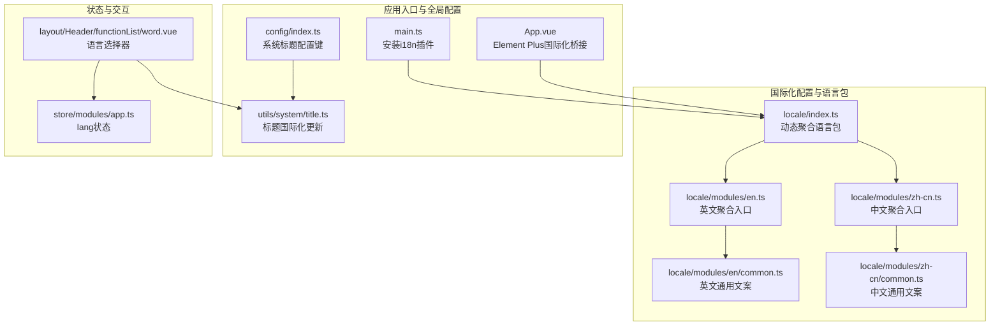
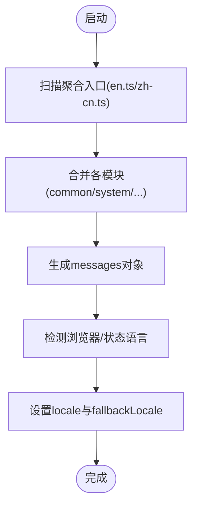
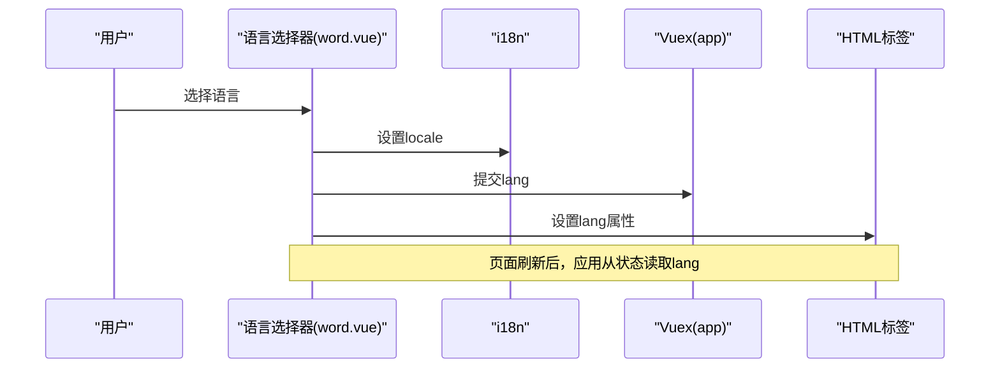
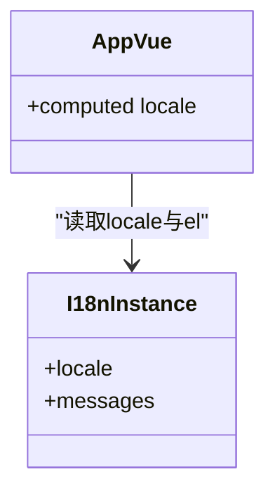
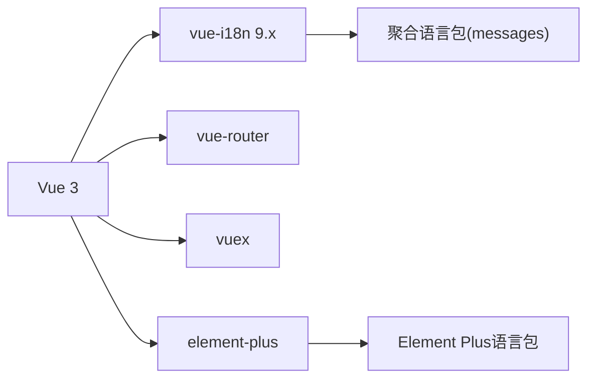

# 国际化支持

<cite>
**本文引用的文件**
- [watcher-web/src/locale/index.ts](file://watcher-web/src/locale/index.ts)
- [watcher-web/src/locale/modules/en.ts](file://watcher-web/src/locale/modules/en.ts)
- [watcher-web/src/locale/modules/zh-cn.ts](file://watcher-web/src/locale/modules/zh-cn.ts)
- [watcher-web/src/locale/modules/en/common.ts](file://watcher-web/src/locale/modules/en/common.ts)
- [watcher-web/src/locale/modules/zh-cn/common.ts](file://watcher-web/src/locale/modules/zh-cn/common.ts)
- [watcher-web/src/main.ts](file://watcher-web/src/main.ts)
- [watcher-web/src/App.vue](file://watcher-web/src/App.vue)
- [watcher-web/src/layout/Header/functionList/word.vue](file://watcher-web/src/layout/Header/functionList/word.vue)
- [watcher-web/src/store/modules/app.ts](file://watcher-web/src/store/modules/app.ts)
- [watcher-web/src/utils/system/title.ts](file://watcher-web/src/utils/system/title.ts)
- [watcher-web/src/config/index.ts](file://watcher-web/src/config/index.ts)
- [watcher-web/package.json](file://watcher-web/package.json)
</cite>

## 目录
1. [简介](#简介)
2. [项目结构](#项目结构)
3. [核心组件](#核心组件)
4. [架构总览](#架构总览)
5. [详细组件分析](#详细组件分析)
6. [依赖关系分析](#依赖关系分析)
7. [性能考量](#性能考量)
8. [故障排查指南](#故障排查指南)
9. [结论](#结论)
10. [附录](#附录)

## 简介
本文件面向ShowTime前端系统的国际化支持，系统性阐述Vue I18n的集成与配置、语言包组织结构、翻译文件管理与服务端配置、多语言切换机制（含语言选择器、本地存储与页面刷新后的语言保持）、翻译资源管理策略（文本提取、维护与新增语言）、国际化最佳实践（占位符、复数形式、日期时间格式化）以及开发指南（流程、测试与维护）。目标是帮助开发者快速理解并高效扩展国际化能力。

## 项目结构
国际化相关代码集中在前端工程的国际化目录与应用入口处，采用“按模块聚合”的语言包组织方式，并通过构建期动态聚合生成最终的多语言消息集。整体结构如下：



图表来源
- [watcher-web/src/locale/index.ts:1-26](file://watcher-web/src/locale/index.ts#L1-L26)
- [watcher-web/src/locale/modules/en.ts:1-22](file://watcher-web/src/locale/modules/en.ts#L1-L22)
- [watcher-web/src/locale/modules/zh-cn.ts:1-25](file://watcher-web/src/locale/modules/zh-cn.ts#L1-L25)
- [watcher-web/src/locale/modules/en/common.ts:1-28](file://watcher-web/src/locale/modules/en/common.ts#L1-L28)
- [watcher-web/src/locale/modules/zh-cn/common.ts:1-71](file://watcher-web/src/locale/modules/zh-cn/common.ts#L1-L71)
- [watcher-web/src/main.ts:1-37](file://watcher-web/src/main.ts#L1-L37)
- [watcher-web/src/App.vue:1-38](file://watcher-web/src/App.vue#L1-L38)
- [watcher-web/src/config/index.ts:1-5](file://watcher-web/src/config/index.ts#L1-L5)
- [watcher-web/src/utils/system/title.ts:1-8](file://watcher-web/src/utils/system/title.ts#L1-L8)
- [watcher-web/src/store/modules/app.ts:1-74](file://watcher-web/src/store/modules/app.ts#L1-L74)
- [watcher-web/src/layout/Header/functionList/word.vue:1-49](file://watcher-web/src/layout/Header/functionList/word.vue#L1-L49)

章节来源
- [watcher-web/src/locale/index.ts:1-26](file://watcher-web/src/locale/index.ts#L1-L26)
- [watcher-web/src/locale/modules/en.ts:1-22](file://watcher-web/src/locale/modules/en.ts#L1-L22)
- [watcher-web/src/locale/modules/zh-cn.ts:1-25](file://watcher-web/src/locale/modules/zh-cn.ts#L1-L25)
- [watcher-web/src/locale/modules/en/common.ts:1-28](file://watcher-web/src/locale/modules/en/common.ts#L1-L28)
- [watcher-web/src/locale/modules/zh-cn/common.ts:1-71](file://watcher-web/src/locale/modules/zh-cn/common.ts#L1-L71)
- [watcher-web/src/main.ts:1-37](file://watcher-web/src/main.ts#L1-L37)
- [watcher-web/src/App.vue:1-38](file://watcher-web/src/App.vue#L1-L38)
- [watcher-web/src/config/index.ts:1-5](file://watcher-web/src/config/index.ts#L1-L5)
- [watcher-web/src/utils/system/title.ts:1-8](file://watcher-web/src/utils/system/title.ts#L1-L8)
- [watcher-web/src/store/modules/app.ts:1-74](file://watcher-web/src/store/modules/app.ts#L1-L74)
- [watcher-web/src/layout/Header/functionList/word.vue:1-49](file://watcher-web/src/layout/Header/functionList/word.vue#L1-L49)

## 核心组件
- 国际化主配置与动态聚合：负责在构建期扫描并聚合语言模块，生成messages对象，并根据浏览器或状态初始化当前语言。
- 语言包聚合入口：分别定义英文与中文的聚合入口，合并各功能模块的翻译键值。
- 应用入口与Element Plus桥接：在应用启动时注册i18n插件，并通过Element Plus的ConfigProvider桥接当前语言。
- 语言选择器：提供下拉菜单以切换语言，同时更新Vuex状态与HTML语言属性。
- 标题国际化：根据当前语言动态更新浏览器标题。
- 状态管理：维护lang字段，作为语言持久化的依据之一。

章节来源
- [watcher-web/src/locale/index.ts:1-26](file://watcher-web/src/locale/index.ts#L1-L26)
- [watcher-web/src/locale/modules/en.ts:1-22](file://watcher-web/src/locale/modules/en.ts#L1-L22)
- [watcher-web/src/locale/modules/zh-cn.ts:1-25](file://watcher-web/src/locale/modules/zh-cn.ts#L1-L25)
- [watcher-web/src/main.ts:1-37](file://watcher-web/src/main.ts#L1-L37)
- [watcher-web/src/App.vue:1-38](file://watcher-web/src/App.vue#L1-L38)
- [watcher-web/src/layout/Header/functionList/word.vue:1-49](file://watcher-web/src/layout/Header/functionList/word.vue#L1-L49)
- [watcher-web/src/store/modules/app.ts:1-74](file://watcher-web/src/store/modules/app.ts#L1-L74)
- [watcher-web/src/utils/system/title.ts:1-8](file://watcher-web/src/utils/system/title.ts#L1-L8)

## 架构总览
国际化从“语言包聚合”到“运行时切换”，再到“UI渲染与标题更新”的完整链路如下：

```mermaid
sequenceDiagram
participant Browser as "浏览器"
participant App as "应用入口(main.ts)"
participant I18n as "i18n实例(locale/index.ts)"
participant Provider as "Element Plus桥接(App.vue)"
participant Store as "状态(app.ts)"
participant Selector as "语言选择器(word.vue)"
participant Title as "标题(title.ts)"
Browser->>App : 启动应用
App->>I18n : 安装vue-i18n插件
I18n->>I18n : 动态聚合语言包
I18n-->>App : 暴露$locale/$t等API
App->>Provider : 通过ConfigProvider绑定locale
Browser->>Selector : 用户点击语言切换
Selector->>I18n : 设置locale
Selector->>Store : 提交lang状态
Selector->>Title : 更新浏览器标题
Title-->>Browser : 标题国际化显示
```

图表来源
- [watcher-web/src/main.ts:1-37](file://watcher-web/src/main.ts#L1-L37)
- [watcher-web/src/locale/index.ts:1-26](file://watcher-web/src/locale/index.ts#L1-L26)
- [watcher-web/src/App.vue:1-38](file://watcher-web/src/App.vue#L1-L38)
- [watcher-web/src/store/modules/app.ts:1-74](file://watcher-web/src/store/modules/app.ts#L1-L74)
- [watcher-web/src/layout/Header/functionList/word.vue:1-49](file://watcher-web/src/layout/Header/functionList/word.vue#L1-L49)
- [watcher-web/src/utils/system/title.ts:1-8](file://watcher-web/src/utils/system/title.ts#L1-L8)

## 详细组件分析

### 语言包组织与动态聚合
- 聚合策略：通过构建期扫描语言聚合入口文件，将各模块翻译键合并为messages对象，供i18n使用。
- 语言映射：根据浏览器语言或状态初始化当前语言；默认回退至中文。
- Element Plus集成：在聚合入口中引入Element Plus对应语言包，确保组件库文案随i18n切换。



图表来源
- [watcher-web/src/locale/index.ts:1-26](file://watcher-web/src/locale/index.ts#L1-L26)
- [watcher-web/src/locale/modules/en.ts:1-22](file://watcher-web/src/locale/modules/en.ts#L1-L22)
- [watcher-web/src/locale/modules/zh-cn.ts:1-25](file://watcher-web/src/locale/modules/zh-cn.ts#L1-L25)

章节来源
- [watcher-web/src/locale/index.ts:1-26](file://watcher-web/src/locale/index.ts#L1-L26)
- [watcher-web/src/locale/modules/en.ts:1-22](file://watcher-web/src/locale/modules/en.ts#L1-L22)
- [watcher-web/src/locale/modules/zh-cn.ts:1-25](file://watcher-web/src/locale/modules/zh-cn.ts#L1-L25)

### 多语言切换机制与语言保持
- 语言选择器：下拉菜单遍历所有可用语言，触发时设置i18n的locale，提交lang到Vuex，并更新HTML语言属性与浏览器标题。
- 本地存储与刷新保持：应用启动时优先从状态读取lang，若无则读取浏览器语言；刷新后仍能保持上次选择的语言。



图表来源
- [watcher-web/src/layout/Header/functionList/word.vue:1-49](file://watcher-web/src/layout/Header/functionList/word.vue#L1-L49)
- [watcher-web/src/store/modules/app.ts:1-74](file://watcher-web/src/store/modules/app.ts#L1-L74)
- [watcher-web/src/locale/index.ts:1-26](file://watcher-web/src/locale/index.ts#L1-L26)

章节来源
- [watcher-web/src/layout/Header/functionList/word.vue:1-49](file://watcher-web/src/layout/Header/functionList/word.vue#L1-L49)
- [watcher-web/src/store/modules/app.ts:1-74](file://watcher-web/src/store/modules/app.ts#L1-L74)
- [watcher-web/src/locale/index.ts:1-26](file://watcher-web/src/locale/index.ts#L1-L26)

### Element Plus国际化桥接
- 在应用根组件中通过ConfigProvider绑定当前locale，使Element Plus组件使用对应语言。
- locale对象包含两部分：name（当前语言标识）与el（Element Plus语言包）。



图表来源
- [watcher-web/src/App.vue:1-38](file://watcher-web/src/App.vue#L1-L38)
- [watcher-web/src/locale/modules/en.ts:1-22](file://watcher-web/src/locale/modules/en.ts#L1-L22)
- [watcher-web/src/locale/modules/zh-cn.ts:1-25](file://watcher-web/src/locale/modules/zh-cn.ts#L1-L25)

章节来源
- [watcher-web/src/App.vue:1-38](file://watcher-web/src/App.vue#L1-L38)
- [watcher-web/src/locale/modules/en.ts:1-22](file://watcher-web/src/locale/modules/en.ts#L1-L22)
- [watcher-web/src/locale/modules/zh-cn.ts:1-25](file://watcher-web/src/locale/modules/zh-cn.ts#L1-L25)

### 标题国际化更新
- 标题由系统标题配置键与当前页面标题键共同组成，使用$t进行翻译，避免硬编码。
- 切换语言后调用标题更新函数，确保浏览器标题同步变化。

章节来源
- [watcher-web/src/config/index.ts:1-5](file://watcher-web/src/config/index.ts#L1-L5)
- [watcher-web/src/utils/system/title.ts:1-8](file://watcher-web/src/utils/system/title.ts#L1-L8)
- [watcher-web/src/layout/Header/functionList/word.vue:1-49](file://watcher-web/src/layout/Header/functionList/word.vue#L1-L49)

### 通用文案示例对比
- 英文通用文案与中文通用文案分别位于对应语言目录下，键名保持一致，便于切换与对齐。
- 示例键包括搜索、新增、删除、确认、取消、提示等高频操作文案。

章节来源
- [watcher-web/src/locale/modules/en/common.ts:1-28](file://watcher-web/src/locale/modules/en/common.ts#L1-L28)
- [watcher-web/src/locale/modules/zh-cn/common.ts:1-71](file://watcher-web/src/locale/modules/zh-cn/common.ts#L1-L71)

## 依赖关系分析
- 依赖版本：项目使用Vue 3与vue-i18n 9.x，Element Plus提供语言包与UI组件。
- 关键依赖：vue-i18n、element-plus、vue、vuex、vue-router。
- 运行时依赖：Element Plus语言包通过聚合入口注入，无需手动逐页引入。



图表来源
- [watcher-web/package.json:1-72](file://watcher-web/package.json#L1-L72)
- [watcher-web/src/locale/modules/en.ts:1-22](file://watcher-web/src/locale/modules/en.ts#L1-L22)
- [watcher-web/src/locale/modules/zh-cn.ts:1-25](file://watcher-web/src/locale/modules/zh-cn.ts#L1-L25)

章节来源
- [watcher-web/package.json:1-72](file://watcher-web/package.json#L1-L72)

## 性能考量
- 动态聚合：构建期聚合语言包，减少运行时IO与字符串拼接开销。
- 按需加载：当前实现为一次性聚合全部语言包；如语言包规模扩大，可考虑按路由或模块懒加载语言包，以降低首屏体积。
- Element Plus语言包：通过聚合入口统一注入，避免重复引入导致的包体膨胀。
- 标题更新：仅在切换语言或路由变更时更新标题，避免频繁DOM操作。

## 故障排查指南
- 语言未生效
  - 检查i18n是否正确安装于应用入口。
  - 确认聚合入口文件存在且导出结构正确。
  - 核对Element Plus ConfigProvider是否绑定locale。
- 语言切换无效
  - 确认语言选择器已设置locale并提交lang到状态。
  - 检查HTML标签的lang属性是否更新。
- 标题未更新
  - 确认标题更新函数被调用，且配置键指向有效翻译键。
- 浏览器语言识别异常
  - 检查状态中的lang字段是否覆盖了浏览器语言判断逻辑。

章节来源
- [watcher-web/src/main.ts:1-37](file://watcher-web/src/main.ts#L1-L37)
- [watcher-web/src/App.vue:1-38](file://watcher-web/src/App.vue#L1-L38)
- [watcher-web/src/layout/Header/functionList/word.vue:1-49](file://watcher-web/src/layout/Header/functionList/word.vue#L1-L49)
- [watcher-web/src/utils/system/title.ts:1-8](file://watcher-web/src/utils/system/title.ts#L1-L8)
- [watcher-web/src/locale/index.ts:1-26](file://watcher-web/src/locale/index.ts#L1-L26)

## 结论
ShowTime前端的国际化以Vue I18n为核心，结合构建期动态聚合与Element Plus语言包桥接，实现了简洁高效的多语言支持。语言选择器与状态管理配合，保证了语言切换与刷新后的语言保持。建议在后续迭代中关注语言包体积优化与按需加载策略，以进一步提升性能与可维护性。

## 附录

### 翻译资源管理策略
- 文本提取流程
  - 在业务组件中统一使用$t或模板内使用翻译键，避免硬编码文本。
  - 使用聚合入口集中导入各模块翻译，确保键名唯一且层级清晰。
- 翻译文件维护
  - 统一在对应语言目录下维护common与其他功能模块的翻译键，便于对照与校验。
  - 新增语言时，复制现有语言目录结构并在聚合入口中注册。
- 新增语言支持步骤
  - 创建新语言目录与聚合入口文件。
  - 在聚合入口中引入Element Plus对应语言包与各模块翻译。
  - 在语言选择器中添加新语言选项，确保UI可选。
  - 在状态中预留lang字段，保证刷新后可恢复。

章节来源
- [watcher-web/src/locale/modules/en.ts:1-22](file://watcher-web/src/locale/modules/en.ts#L1-L22)
- [watcher-web/src/locale/modules/zh-cn.ts:1-25](file://watcher-web/src/locale/modules/zh-cn.ts#L1-L25)
- [watcher-web/src/layout/Header/functionList/word.vue:1-49](file://watcher-web/src/layout/Header/functionList/word.vue#L1-L49)
- [watcher-web/src/store/modules/app.ts:1-74](file://watcher-web/src/store/modules/app.ts#L1-L74)

### 国际化最佳实践
- 占位符使用
  - 使用命名占位符，避免位置依赖导致的翻译错位。
- 复数形式处理
  - 对于复数场景，建议在业务层根据数量选择合适翻译键，或使用更高级的复数规则处理工具。
- 日期时间格式化
  - 建议使用浏览器原生Intl.DateTimeFormat或第三方库进行格式化，避免直接拼接日期字符串。
- 可访问性
  - 确保HTML lang属性与当前语言一致，利于屏幕阅读器识别语言。

### 开发指南
- 开发流程
  - 新增文案先在common或其他模块中定义键值，再在各语言目录补充翻译。
  - 在组件中使用$t或模板语法引用翻译键。
  - 在语言选择器中验证切换效果。
- 测试方法
  - 自动化：编写单元测试验证翻译键是否存在与返回值非空。
  - 手动测试：在不同语言环境下检查UI文案、标题与Element Plus组件文案一致性。
- 维护策略
  - 建立翻译键命名规范与目录结构规范，定期清理冗余键。
  - 对新增语言进行回归测试，确保Element Plus组件与自定义文案均正确显示。