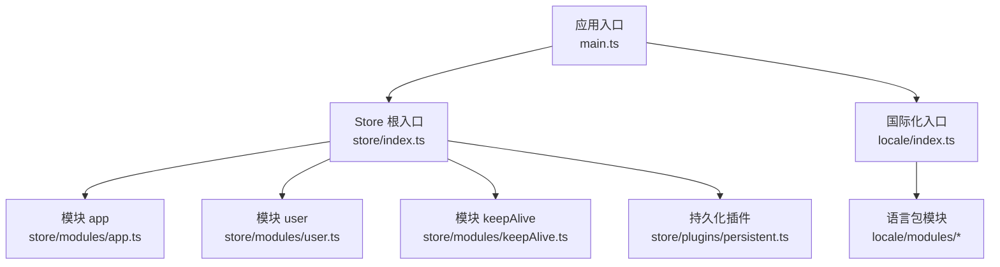
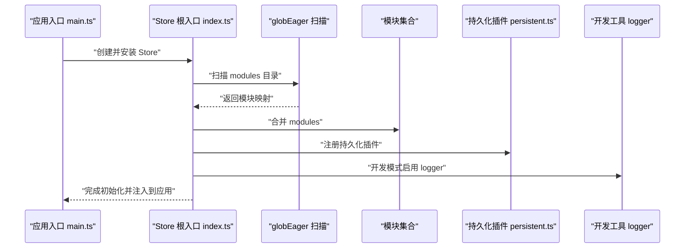
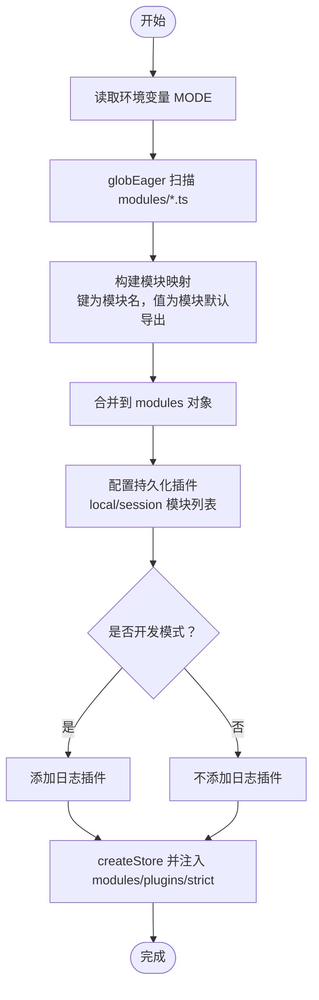
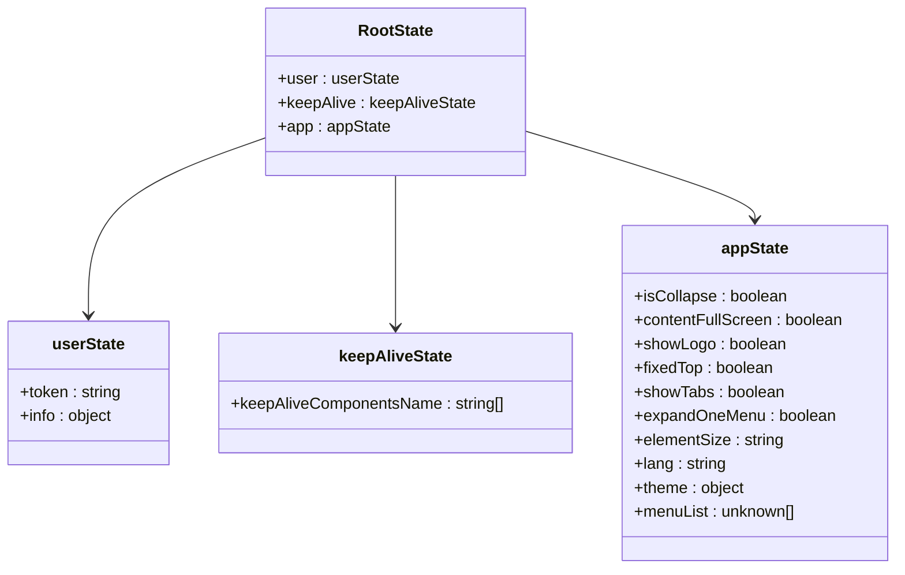
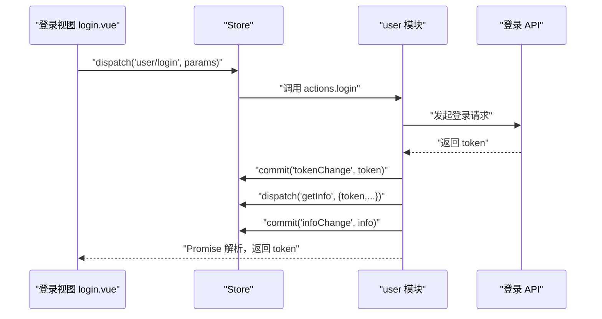
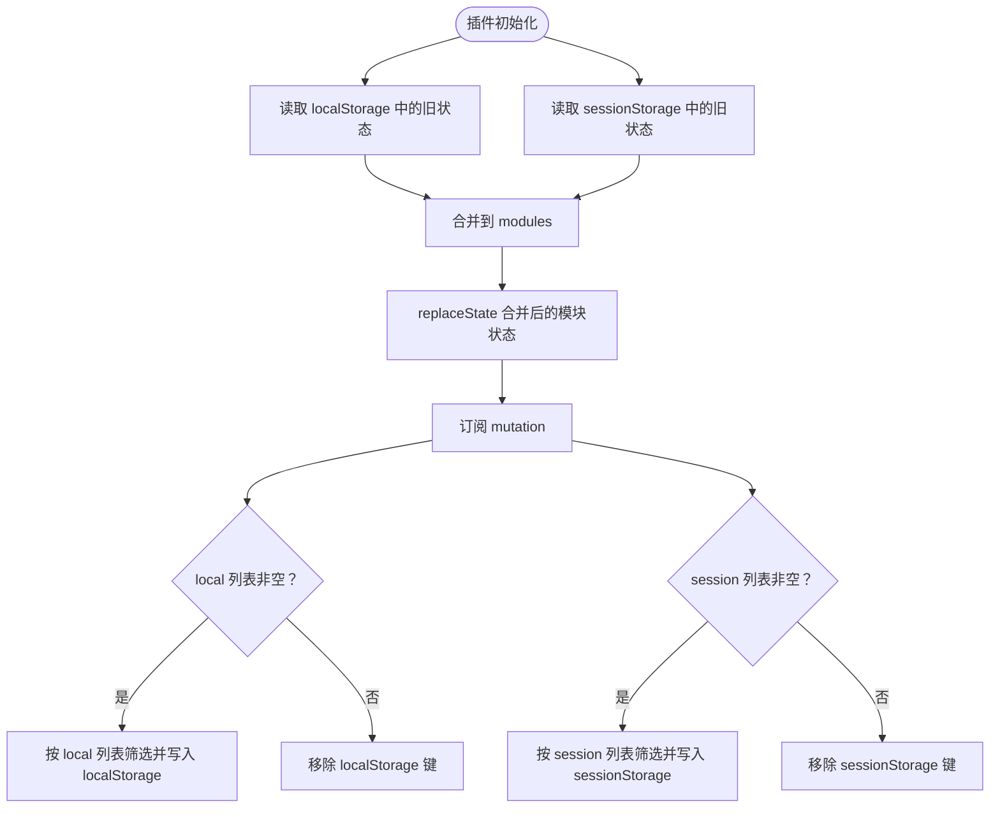
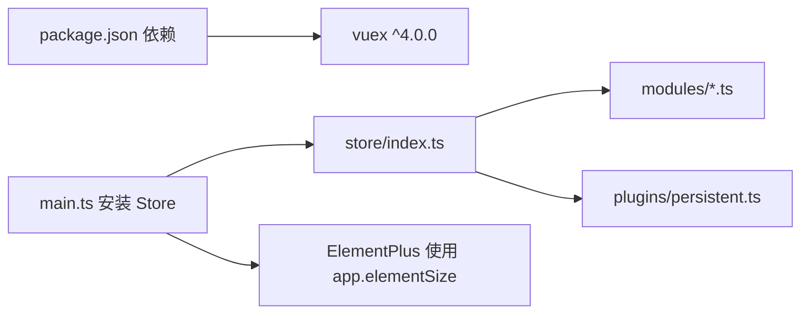

# Vuex Store 架构

<cite>
**本文引用的文件**
- [watcher-web/src/store/index.ts](file://watcher-web/src/store/index.ts)
- [watcher-web/src/store/modules/app.ts](file://watcher-web/src/store/modules/app.ts)
- [watcher-web/src/store/modules/user.ts](file://watcher-web/src/store/modules/user.ts)
- [watcher-web/src/store/modules/keepAlive.ts](file://watcher-web/src/store/modules/keepAlive.ts)
- [watcher-web/src/store/plugins/persistent.ts](file://watcher-web/src/store/plugins/persistent.ts)
- [watcher-web/src/vuex.d.ts](file://watcher-web/src/vuex.d.ts)
- [watcher-web/src/main.ts](file://watcher-web/src/main.ts)
- [watcher-web/src/locale/index.ts](file://watcher-web/src/locale/index.ts)
- [watcher-web/package.json](file://watcher-web/package.json)
- [watcher-web/src/views/system/login.vue](file://watcher-web/src/views/system/login.vue)
</cite>

## 目录
1. [引言](#引言)
2. [项目结构](#项目结构)
3. [核心组件](#核心组件)
4. [架构总览](#架构总览)
5. [详细组件分析](#详细组件分析)
6. [依赖关系分析](#依赖关系分析)
7. [性能考量](#性能考量)
8. [故障排查指南](#故障排查指南)
9. [结论](#结论)
10. [附录](#附录)

## 引言
本文件系统性梳理 ShowTime 前端系统的 Vuex Store 架构，重点覆盖以下方面：
- 模块化组织与命名空间管理
- RootState 接口与状态树层次设计
- Store 初始化流程（含动态模块加载、插件配置、严格模式）
- 自动扫描注册机制（glob 模式）
- 最佳实践（模块划分、状态设计、性能优化）

## 项目结构
前端 Store 位于 watcher-web/src/store 目录，包含：
- 根入口：index.ts
- 模块：app.ts、user.ts、keepAlive.ts
- 插件：plugins/persistent.ts
- 类型增强：vuex.d.ts
- 应用挂载：main.ts 中引入并安装 Store
- 语言包与 Store 的联动：locale/index.ts 中也采用 glob 自动扫描模块

图表来源
- [watcher-web/src/main.ts:11](file://watcher-web/src/main.ts#L11)
- [watcher-web/src/store/index.ts:1-39](file://watcher-web/src/store/index.ts#L1-L39)
- [watcher-web/src/store/modules/app.ts:1-74](file://watcher-web/src/store/modules/app.ts#L1-L74)
- [watcher-web/src/store/modules/user.ts:1-76](file://watcher-web/src/store/modules/user.ts#L1-L76)
- [watcher-web/src/store/modules/keepAlive.ts:1-51](file://watcher-web/src/store/modules/keepAlive.ts#L1-L51)
- [watcher-web/src/store/plugins/persistent.ts:1-59](file://watcher-web/src/store/plugins/persistent.ts#L1-L59)
- [watcher-web/src/locale/index.ts:1-26](file://watcher-web/src/locale/index.ts#L1-L26)

章节来源
- [watcher-web/src/store/index.ts:1-39](file://watcher-web/src/store/index.ts#L1-L39)
- [watcher-web/src/main.ts:11](file://watcher-web/src/main.ts#L11)
- [watcher-web/src/locale/index.ts:1-26](file://watcher-web/src/locale/index.ts#L1-L26)

## 核心组件
- 根状态接口 RootState：聚合各模块状态类型，便于全局类型约束与 IDE 支持。
- 动态模块注册：通过 Vite 的 import.meta.globEager 在构建期扫描 store/modules 下的模块，自动注入到根 Store。
- 插件体系：内置持久化插件，支持按模块选择性持久化到 localStorage 或 sessionStorage；在开发模式下启用严格模式与日志。

章节来源
- [watcher-web/src/store/index.ts:9-38](file://watcher-web/src/store/index.ts#L9-L38)
- [watcher-web/src/store/plugins/persistent.ts:21-50](file://watcher-web/src/store/plugins/persistent.ts#L21-L50)
- [watcher-web/src/vuex.d.ts:1-15](file://watcher-web/src/vuex.d.ts#L1-L15)

## 架构总览
Store 架构围绕“模块化 + 自动注册 + 持久化”的设计展开：
- 模块化：每个领域或功能拆分为独立模块，统一以 namespaced:true 组织，避免命名冲突。
- 自动注册：构建期通过 globEager 扫描模块目录，生成模块映射并注入到 modules。
- 持久化：持久化插件根据配置分别写入 localStorage/sessionStorage，重启后恢复状态。
- 类型安全：通过 RootState 与类型增强，确保在组件中使用 useStore 时具备完整类型推导。

图表来源
- [watcher-web/src/main.ts:11](file://watcher-web/src/main.ts#L11)
- [watcher-web/src/store/index.ts:7-38](file://watcher-web/src/store/index.ts#L7-L38)
- [watcher-web/src/store/plugins/persistent.ts:21-50](file://watcher-web/src/store/plugins/persistent.ts#L21-L50)

## 详细组件分析

### 根入口与初始化流程
- 环境判断：依据 MODE 决定是否开启严格模式与日志插件。
- 模块扫描：使用 import.meta.globEager('./modules/*.ts') 在构建期一次性加载模块文件，避免运行时异步加载带来的不确定性。
- 模块注入：解析文件路径提取模块名，将模块默认导出作为命名空间注册。
- 插件配置：持久化插件接收 key 与 modulesKeys（local/session），用于区分持久化范围；开发模式下附加日志插件。

图表来源
- [watcher-web/src/store/index.ts:6-38](file://watcher-web/src/store/index.ts#L6-L38)

章节来源
- [watcher-web/src/store/index.ts:1-39](file://watcher-web/src/store/index.ts#L1-L39)

### RootState 接口与类型增强
- RootState：由 user、keepAlive、app 三个模块的状态类型组成，确保根状态的类型完整性。
- 类型增强：通过 vuex.d.ts 将 RootState 注入到 @vue/runtime-core，使 this.$store 与 useStore 获得强类型支持。

图表来源
- [watcher-web/src/store/index.ts:9-13](file://watcher-web/src/store/index.ts#L9-L13)
- [watcher-web/src/store/modules/user.ts:5-8](file://watcher-web/src/store/modules/user.ts#L5-L8)
- [watcher-web/src/store/modules/keepAlive.ts:7-9](file://watcher-web/src/store/modules/keepAlive.ts#L7-L9)
- [watcher-web/src/store/modules/app.ts:14-28](file://watcher-web/src/store/modules/app.ts#L14-L28)
- [watcher-web/src/vuex.d.ts:6-14](file://watcher-web/src/vuex.d.ts#L6-L14)

章节来源
- [watcher-web/src/store/index.ts:9-13](file://watcher-web/src/store/index.ts#L9-L13)
- [watcher-web/src/vuex.d.ts:1-15](file://watcher-web/src/vuex.d.ts#L1-L15)

### 模块：app（应用配置）
- 命名空间：namespaced:true
- 状态：包含布局折叠、全屏、Logo 显示、顶部固定、标签页、菜单展开策略、Element 尺寸、语言、主题、菜单列表等。
- 变更：提供变更器以更新上述字段，便于 UI 与主题切换。

章节来源
- [watcher-web/src/store/modules/app.ts:14-74](file://watcher-web/src/store/modules/app.ts#L14-L74)

### 模块：user（用户与登录）
- 命名空间：namespaced:true
- 状态：token 与用户信息。
- 行为：
  - login：触发登录 API，提交 token，并派发 getInfo 获取用户信息。
  - getInfo：提交用户信息到状态。
  - loginOut：调用登出 API，清理持久化与页面缓存并刷新。
- 访问：组件通过命名空间访问，例如 dispatch('user/login', params)。

图表来源
- [watcher-web/src/views/system/login.vue:139-169](file://watcher-web/src/views/system/login.vue#L139-L169)
- [watcher-web/src/store/modules/user.ts:33-67](file://watcher-web/src/store/modules/user.ts#L33-L67)

章节来源
- [watcher-web/src/store/modules/user.ts:1-76](file://watcher-web/src/store/modules/user.ts#L1-L76)
- [watcher-web/src/views/system/login.vue:139-169](file://watcher-web/src/views/system/login.vue#L139-L169)

### 模块：keepAlive（组件缓存）
- 命名空间：namespaced:true
- 状态：维护需要缓存的组件名称列表。
- 变更：提供 set/add/del 方法以增删缓存组件名，配合 keep-alive 使用。

章节来源
- [watcher-web/src/store/modules/keepAlive.ts:1-51](file://watcher-web/src/store/modules/keepAlive.ts#L1-L51)

### 插件：持久化（Persistent）
- 功能：在应用启动时从 localStorage/sessionStorage 合并旧状态到 Store；在每次变更时按模块选择写回对应存储。
- 配置：
  - key：存储键名（如 'vuex'）。
  - modules：模块映射（由 glob 注入）。
  - modulesKeys.local/session：指定需要持久化的模块名数组。
- 行为：
  - 启动时合并旧状态并 replaceState。
  - 订阅 mutation，按模块筛选后写入 localStorage/sessionStorage。

图表来源
- [watcher-web/src/store/plugins/persistent.ts:21-50](file://watcher-web/src/store/plugins/persistent.ts#L21-L50)

章节来源
- [watcher-web/src/store/plugins/persistent.ts:1-59](file://watcher-web/src/store/plugins/persistent.ts#L1-L59)
- [watcher-web/src/store/index.ts:27-30](file://watcher-web/src/store/index.ts#L27-L30)

### 与国际化模块的协同
- locale/index.ts 同样使用 import.meta.globEager('./modules/*.ts') 自动扫描语言包模块，并结合 app 模块中的 lang 字段决定初始语言。
- 这体现了与 Store 的联动：语言选择来源于 app.state.lang，若未设置则回退到浏览器语言。

章节来源
- [watcher-web/src/locale/index.ts:1-26](file://watcher-web/src/locale/index.ts#L1-L26)
- [watcher-web/src/store/modules/app.ts:38](file://watcher-web/src/store/modules/app.ts#L38)

## 依赖关系分析
- 版本与依赖：package.json 中明确依赖 vuex@^4.0.0，确保与 Vue 3 生态兼容。
- 应用集成：main.ts 中安装 Store，Element Plus 通过 store.state.app.elementSize 设置全局尺寸，体现 Store 与其他库的耦合点。

图表来源
- [watcher-web/package.json:52](file://watcher-web/package.json#L52)
- [watcher-web/src/main.ts:28](file://watcher-web/src/main.ts#L28)
- [watcher-web/src/store/index.ts:1-39](file://watcher-web/src/store/index.ts#L1-L39)

章节来源
- [watcher-web/package.json:1-72](file://watcher-web/package.json#L1-L72)
- [watcher-web/src/main.ts:11-29](file://watcher-web/src/main.ts#L11-L29)

## 性能考量
- 动态模块加载：使用 globEager 在构建期一次性加载模块，减少运行时 IO 与异步开销，提升首屏性能。
- 持久化粒度控制：通过 modulesKeys.local/session 精准选择持久化模块，避免不必要的序列化/反序列化与存储压力。
- 严格模式与日志：开发模式启用 strict 与 logger，有助于早期发现状态异常与调试，但生产环境关闭以降低开销。
- 类型检查：通过 RootState 与类型增强，减少运行时错误，间接提升稳定性。

## 故障排查指南
- 登录后 token 丢失
  - 检查持久化插件配置，确认 user 模块是否被包含在 local 列表中。
  - 确认登录流程是否正确提交 token 变更并触发 getInfo。
- 页面刷新后状态未恢复
  - 检查 localStorage/sessionStorage 中是否存在以 key 命名的数据。
  - 确认模块名与 modulesKeys 中的模块名一致。
- 开发环境下日志过多影响性能
  - 关闭开发模式或移除日志插件。
- 命名空间访问报错
  - 确保在组件中使用带命名空间的路径访问，例如 dispatch('user/login')。

章节来源
- [watcher-web/src/store/plugins/persistent.ts:21-50](file://watcher-web/src/store/plugins/persistent.ts#L21-L50)
- [watcher-web/src/store/modules/user.ts:33-67](file://watcher-web/src/store/modules/user.ts#L33-L67)
- [watcher-web/src/views/system/login.vue:139-169](file://watcher-web/src/views/system/login.vue#L139-L169)

## 结论
该 Store 架构以模块化为核心，结合构建期自动扫描与持久化插件，实现了清晰的状态边界、良好的类型安全与可维护性。通过合理配置持久化范围与严格模式，既能满足开发调试需求，又能在生产环境中保持稳定与高效。

## 附录
- 最佳实践清单
  - 模块划分：按领域或页面功能拆分，统一使用 namespaced:true。
  - 状态设计：避免冗余与重复，优先扁平化结构；必要时使用 getters 计算派生状态。
  - 持久化策略：仅对关键状态（如用户 token、布局偏好）持久化，控制模块列表规模。
  - 类型安全：始终使用 RootState 与类型增强，避免 any。
  - 性能优化：避免在 mutations 中执行耗时逻辑；尽量使用 getters 缓存计算结果。
  - 调试与监控：开发阶段启用严格模式与日志；生产阶段关闭。