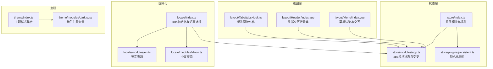
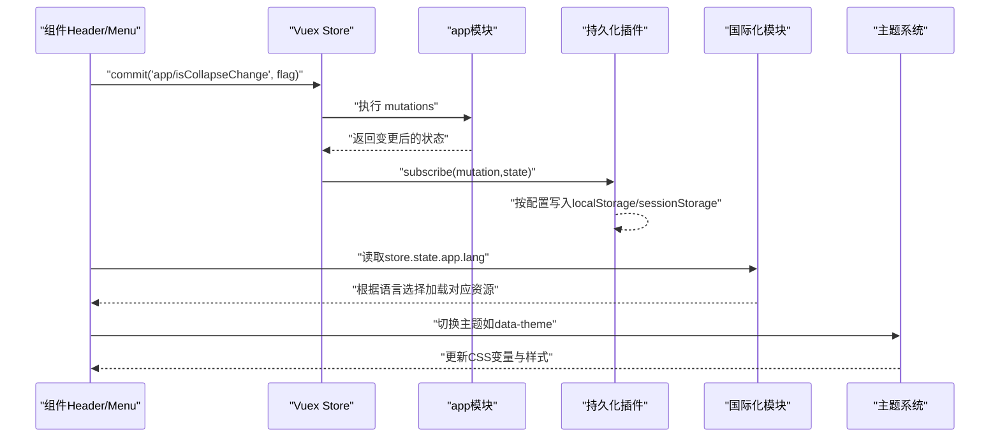
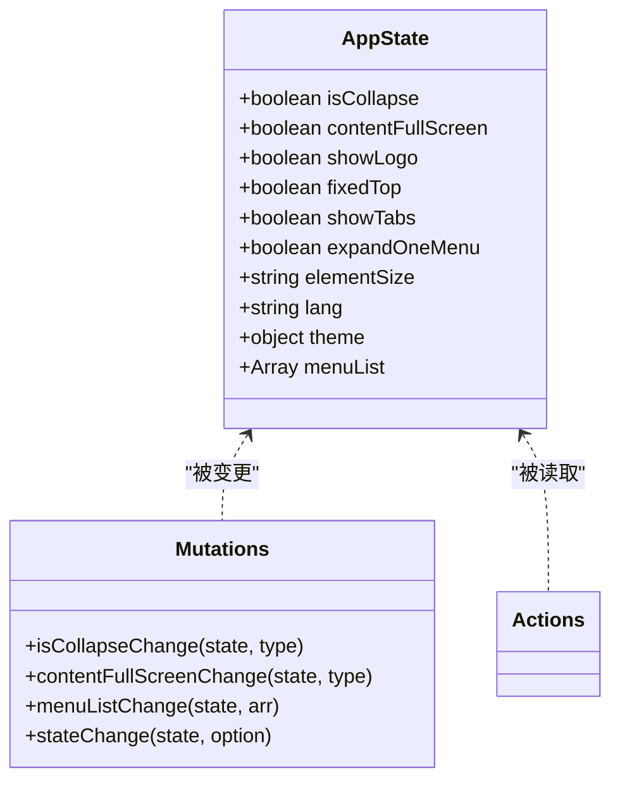
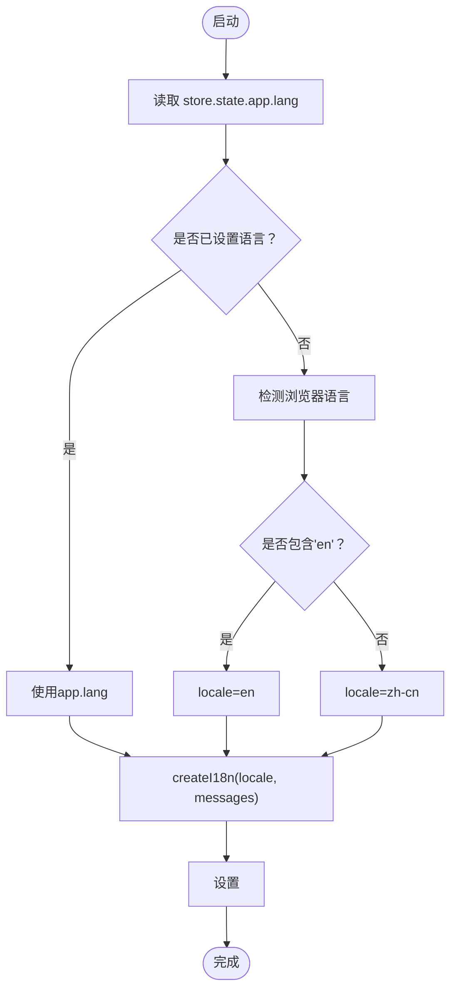
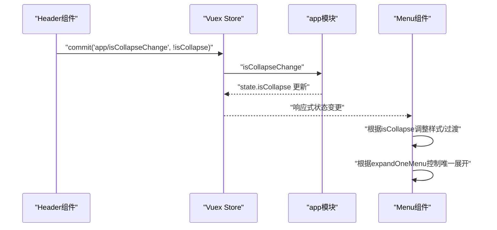
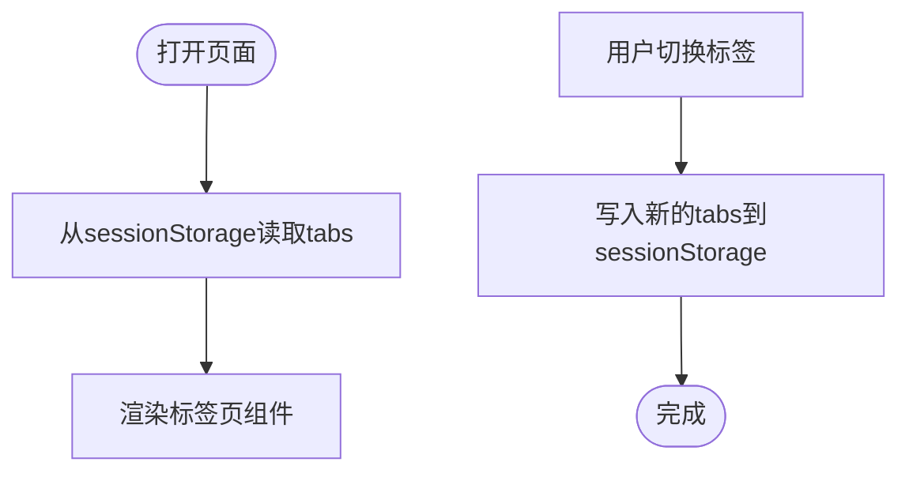
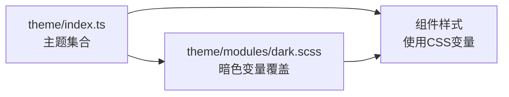
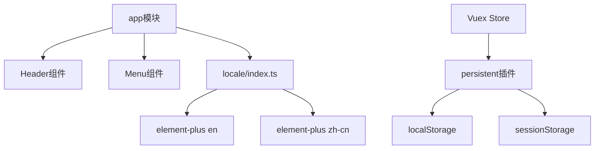

# 应用状态模块

<cite>
**本文引用的文件**
- [app.ts](file://watcher-web/src/store/modules/app.ts)
- [index.ts](file://watcher-web/src/store/index.ts)
- [persistent.ts](file://watcher-web/src/store/plugins/persistent.ts)
- [index.ts](file://watcher-web/src/locale/index.ts)
- [en.ts](file://watcher-web/src/locale/modules/en.ts)
- [zh-cn.ts](file://watcher-web/src/locale/modules/zh-cn.ts)
- [menu.ts](file://watcher-web/src/layout/Menu/menu.ts)
- [index.vue](file://watcher-web/src/layout/Menu/index.vue)
- [index.vue](file://watcher-web/src/layout/Header/index.vue)
- [tabsHook.ts](file://watcher-web/src/layout/Tabs/tabsHook.ts)
- [index.ts](file://watcher-web/src/theme/index.ts)
- [dark.scss](file://watcher-web/src/theme/modules/dark.scss)
</cite>

## 目录
1. [简介](#简介)
2. [项目结构](#项目结构)
3. [核心组件](#核心组件)
4. [架构总览](#架构总览)
5. [详细组件分析](#详细组件分析)
6. [依赖关系分析](#依赖关系分析)
7. [性能考量](#性能考量)
8. [故障排查指南](#故障排查指南)
9. [结论](#结论)
10. [附录](#附录)

## 简介
本文件系统性梳理 ShowTime 前端系统的“应用状态模块”，聚焦于 app 模块在主题切换、布局配置、菜单状态与国际化方面的职责与实现。内容涵盖：
- 状态属性的语义与典型使用场景
- mutations 的定义与原子性保障
- actions 的异步处理与状态同步机制
- 实际组件中的访问与修改方式
- 状态持久化策略（localStorage/sessionStorage）及实现要点

## 项目结构
围绕应用状态模块的关键文件组织如下：
- 状态定义与模块装配：store/index.ts、store/modules/app.ts
- 持久化插件：store/plugins/persistent.ts
- 国际化：locale/index.ts、locale/modules/en.ts、locale/modules/zh-cn.ts
- 菜单与头部交互：layout/Menu/menu.ts、layout/Menu/index.vue、layout/Header/index.vue
- 标签页持久化：layout/Tabs/tabsHook.ts
- 主题系统：theme/index.ts、theme/modules/dark.scss

图表来源
- [index.ts:1-39](file://watcher-web/src/store/index.ts#L1-L39)
- [app.ts:1-74](file://watcher-web/src/store/modules/app.ts#L1-L74)
- [persistent.ts:1-59](file://watcher-web/src/store/plugins/persistent.ts#L1-L59)
- [index.vue:1-132](file://watcher-web/src/layout/Menu/index.vue#L1-L132)
- [index.vue:1-213](file://watcher-web/src/layout/Header/index.vue#L1-L213)
- [tabsHook.ts:1-12](file://watcher-web/src/layout/Tabs/tabsHook.ts#L1-L12)
- [index.ts:1-26](file://watcher-web/src/locale/index.ts#L1-L26)
- [en.ts:1-22](file://watcher-web/src/locale/modules/en.ts#L1-L22)
- [zh-cn.ts:1-25](file://watcher-web/src/locale/modules/zh-cn.ts#L1-L25)
- [index.ts:1-200](file://watcher-web/src/theme/index.ts#L1-L200)
- [dark.scss:1-23](file://watcher-web/src/theme/modules/dark.scss#L1-L23)

章节来源
- [index.ts:1-39](file://watcher-web/src/store/index.ts#L1-L39)
- [app.ts:1-74](file://watcher-web/src/store/modules/app.ts#L1-L74)

## 核心组件
本节从“状态属性—变更机制—使用场景”三个维度，系统说明 app 模块的关键能力。

- 状态属性与语义
  - isCollapse：控制侧边栏是否折叠，影响菜单宽度与布局紧凑度
  - contentFullScreen：控制内容区域是否全屏展示
  - showLogo：控制是否显示 Logo
  - fixedTop：预留字段，暂未使用
  - showTabs：控制是否显示标签页（导航历史）
  - expandOneMenu：控制菜单是否“单开模式”，即同时仅展开一个子菜单
  - elementSize：Element Plus 组件的全局尺寸（mini 等）
  - lang：当前国际化语言标识，用于 i18n 初始化
  - theme.primaryColor：主题主色（当前结构中包含嵌套 state，便于后续扩展）
  - menuList：菜单数据源，供菜单组件渲染

- mutations 的定义与实现
  - isCollapseChange：切换 isCollapse
  - contentFullScreenChange：切换 contentFullScreen
  - menuListChange：替换 menuList
  - stateChange：通用键值变更入口，通过 Option 结构传入键名与值，实现对任意字符串键的赋值

- actions 的异步处理与状态同步
  - 当前 app 模块 actions 为空，未定义异步逻辑；若需引入异步（如远程拉取菜单、动态主题切换），可在 actions 中以 Promise 或异步流程管理器实现，并通过 commit 同步到 mutations

- 使用场景
  - 折叠/展开菜单：Header 头部按钮触发 isCollapse 变更
  - 单开菜单：expandOneMenu 控制菜单行为
  - 国际化：lang 作为 i18n 初始化依据，结合 locale 模块加载对应语言包
  - 标签页：showTabs 控制标签页显隐，配合 tabsHook 进行持久化

章节来源
- [app.ts:14-47](file://watcher-web/src/store/modules/app.ts#L14-L47)
- [app.ts:50-63](file://watcher-web/src/store/modules/app.ts#L50-L63)
- [app.ts:65-66](file://watcher-web/src/store/modules/app.ts#L65-L66)
- [index.vue:89-93](file://watcher-web/src/layout/Header/index.vue#L89-L93)
- [index.vue:12-12](file://watcher-web/src/layout/Menu/index.vue#L12-L12)
- [index.ts:14-22](file://watcher-web/src/locale/index.ts#L14-L22)
- [tabsHook.ts:1-12](file://watcher-web/src/layout/Tabs/tabsHook.ts#L1-L12)

## 架构总览
下图展示了 app 模块在运行期的交互路径：组件通过 Vuex 访问状态，触发 mutations 完成状态变更；持久化插件监听状态变化并写入 localStorage/sessionStorage；国际化模块根据 app.lang 初始化语言；主题系统通过 CSS 变量与主题集合实现多风格切换。

图表来源
- [index.ts:27-30](file://watcher-web/src/store/index.ts#L27-L30)
- [persistent.ts:33-48](file://watcher-web/src/store/plugins/persistent.ts#L33-L48)
- [index.ts:14-22](file://watcher-web/src/locale/index.ts#L14-L22)
- [index.ts:1-200](file://watcher-web/src/theme/index.ts#L1-L200)
- [dark.scss:1-23](file://watcher-web/src/theme/modules/dark.scss#L1-L23)

## 详细组件分析

### app 模块类图

图表来源
- [app.ts:14-47](file://watcher-web/src/store/modules/app.ts#L14-L47)
- [app.ts:50-63](file://watcher-web/src/store/modules/app.ts#L50-L63)
- [app.ts:65-66](file://watcher-web/src/store/modules/app.ts#L65-L66)

章节来源
- [app.ts:1-74](file://watcher-web/src/store/modules/app.ts#L1-L74)

### 国际化初始化流程
国际化模块根据 app.lang 与浏览器语言选择初始 locale，并将语言信息注入 HTML 标签，确保后续 i18n 生效。

图表来源
- [index.ts:14-22](file://watcher-web/src/locale/index.ts#L14-L22)
- [en.ts:1-22](file://watcher-web/src/locale/modules/en.ts#L1-L22)
- [zh-cn.ts:1-25](file://watcher-web/src/locale/modules/zh-cn.ts#L1-L25)

章节来源
- [index.ts:1-26](file://watcher-web/src/locale/index.ts#L1-L26)
- [en.ts:1-22](file://watcher-web/src/locale/modules/en.ts#L1-L22)
- [zh-cn.ts:1-25](file://watcher-web/src/locale/modules/zh-cn.ts#L1-L25)

### 菜单与布局联动
菜单组件根据 app.isCollapse 与 app.expandOneMenu 动态渲染与行为控制；头部组件通过 commit 触发折叠切换。

图表来源
- [index.vue:89-93](file://watcher-web/src/layout/Header/index.vue#L89-L93)
- [index.vue:34-35](file://watcher-web/src/layout/Menu/index.vue#L34-L35)
- [index.vue:12-12](file://watcher-web/src/layout/Menu/index.vue#L12-L12)
- [app.ts:51-52](file://watcher-web/src/store/modules/app.ts#L51-L52)

章节来源
- [index.vue:1-213](file://watcher-web/src/layout/Header/index.vue#L1-L213)
- [index.vue:1-132](file://watcher-web/src/layout/Menu/index.vue#L1-L132)
- [menu.ts:1-84](file://watcher-web/src/layout/Menu/menu.ts#L1-L84)
- [app.ts:1-74](file://watcher-web/src/store/modules/app.ts#L1-L74)

### 标签页持久化
标签页数据通过 sessionStorage 进行持久化，避免刷新丢失；app.showTabs 控制标签页是否显示。

图表来源
- [tabsHook.ts:1-12](file://watcher-web/src/layout/Tabs/tabsHook.ts#L1-L12)

章节来源
- [tabsHook.ts:1-12](file://watcher-web/src/layout/Tabs/tabsHook.ts#L1-L12)

### 主题切换与样式映射
主题系统通过主题集合与 CSS 变量实现多风格切换；暗色主题通过 data-theme 属性与 SCSS 变量映射。

图表来源
- [index.ts:1-200](file://watcher-web/src/theme/index.ts#L1-L200)
- [dark.scss:1-23](file://watcher-web/src/theme/modules/dark.scss#L1-L23)

章节来源
- [index.ts:1-200](file://watcher-web/src/theme/index.ts#L1-L200)
- [dark.scss:1-23](file://watcher-web/src/theme/modules/dark.scss#L1-L23)

## 依赖关系分析
- 模块耦合
  - app 模块被 Header 与 Menu 组件强依赖（读取状态与提交变更）
  - 国际化模块依赖 app.lang 进行初始化
  - 持久化插件依赖 store 全局订阅，按配置写入本地存储
- 外部依赖
  - Element Plus 的国际化资源由 locale/modules/* 导出
  - 主题系统依赖 CSS 变量与 SCSS 文件

图表来源
- [app.ts:1-74](file://watcher-web/src/store/modules/app.ts#L1-L74)
- [index.vue:1-213](file://watcher-web/src/layout/Header/index.vue#L1-L213)
- [index.vue:1-132](file://watcher-web/src/layout/Menu/index.vue#L1-L132)
- [index.ts:1-26](file://watcher-web/src/locale/index.ts#L1-L26)
- [en.ts:1-22](file://watcher-web/src/locale/modules/en.ts#L1-L22)
- [zh-cn.ts:1-25](file://watcher-web/src/locale/modules/zh-cn.ts#L1-L25)
- [index.ts:27-30](file://watcher-web/src/store/index.ts#L27-L30)
- [persistent.ts:33-48](file://watcher-web/src/store/plugins/persistent.ts#L33-L48)

章节来源
- [index.ts:1-39](file://watcher-web/src/store/index.ts#L1-L39)
- [persistent.ts:1-59](file://watcher-web/src/store/plugins/persistent.ts#L1-L59)

## 性能考量
- 状态粒度
  - app 模块状态项较多但均为轻量布尔/字符串，对性能影响有限
  - 建议仅在必要时变更状态，避免频繁触发响应式更新
- 持久化策略
  - 本地持久化建议仅保留关键状态（如布局、语言），减少存储体积
  - 对大体量数据（如菜单列表）建议按需拉取，而非持久化整表
- 国际化
  - 语言包按模块聚合，按需加载，避免一次性加载全部语言资源

## 故障排查指南
- 语言不生效
  - 检查 app.lang 是否正确设置；若为空则回退到浏览器语言
  - 确认 locale/modules/* 已正确导出对应语言资源
- 菜单折叠异常
  - 确认 isCollapse 变更是否通过 app/isCollapseChange 提交
  - 检查 expandOneMenu 是否按预期开启“单开模式”
- 标签页丢失
  - 检查 sessionStorage 是否被清理；确认 tabsHook 的读写逻辑
- 主题切换无效
  - 确认 data-theme 属性是否正确设置
  - 检查主题变量是否在 SCSS 中正确覆盖

章节来源
- [index.ts:14-22](file://watcher-web/src/locale/index.ts#L14-L22)
- [tabsHook.ts:1-12](file://watcher-web/src/layout/Tabs/tabsHook.ts#L1-L12)
- [index.ts:1-200](file://watcher-web/src/theme/index.ts#L1-L200)
- [dark.scss:1-23](file://watcher-web/src/theme/modules/dark.scss#L1-L23)

## 结论
app 模块以简洁的状态模型支撑了 ShowTime 的布局、菜单与国际化基础能力。通过明确的 mutations 与可选的 actions，实现了状态变更的原子性与可预测性；结合持久化插件与国际化/主题系统，形成了完整的前端体验闭环。建议后续在 actions 中补充异步配置更新能力，并对菜单与标签页的数据持久化进行更细粒度的控制。

## 附录

### 状态属性速览与使用建议
- isCollapse：用于控制菜单折叠，适合在 Header 的折叠按钮中使用
- expandOneMenu：用于控制菜单单开行为，适合在 Menu 组件中启用
- showTabs：控制标签页显隐，结合 tabsHook 进行持久化
- lang：国际化语言标识，建议在登录后或首次进入时设置
- elementSize：统一组件尺寸，适合在应用初始化时设置
- theme.primaryColor：主题主色，建议通过主题系统集中管理
- menuList：菜单数据源，建议通过远程接口拉取并持久化

章节来源
- [app.ts:14-47](file://watcher-web/src/store/modules/app.ts#L14-L47)
- [index.vue:89-93](file://watcher-web/src/layout/Header/index.vue#L89-L93)
- [index.vue:12-12](file://watcher-web/src/layout/Menu/index.vue#L12-L12)
- [tabsHook.ts:1-12](file://watcher-web/src/layout/Tabs/tabsHook.ts#L1-L12)
- [index.ts:14-22](file://watcher-web/src/locale/index.ts#L14-L22)
- [index.ts:1-200](file://watcher-web/src/theme/index.ts#L1-L200)