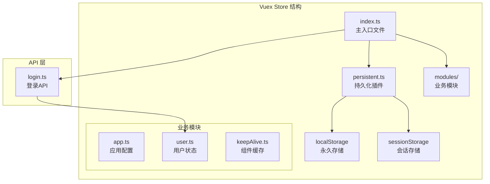
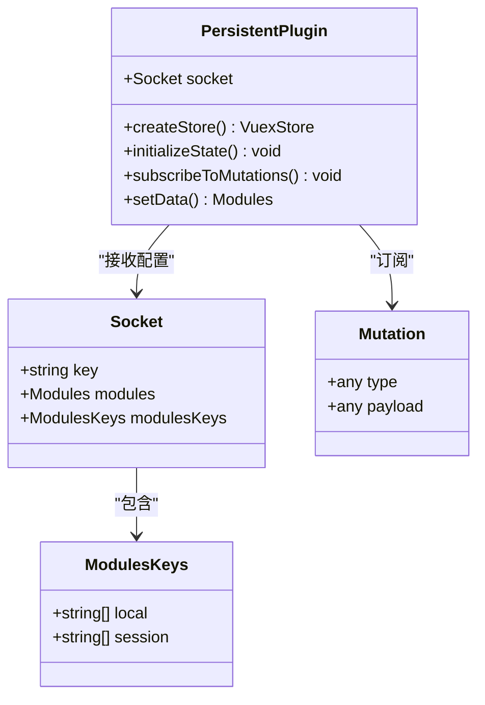
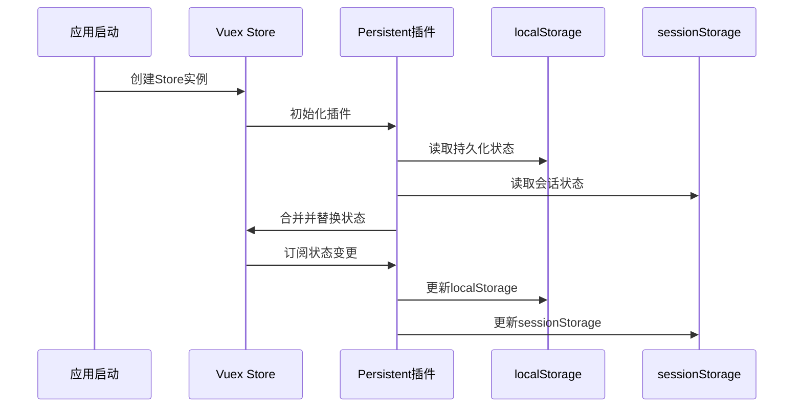
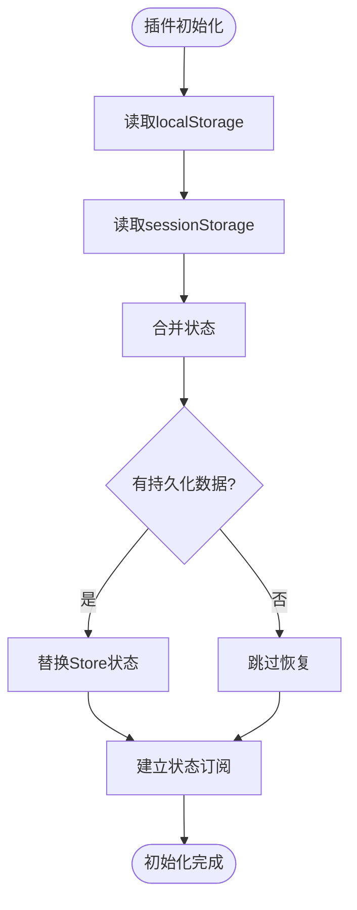
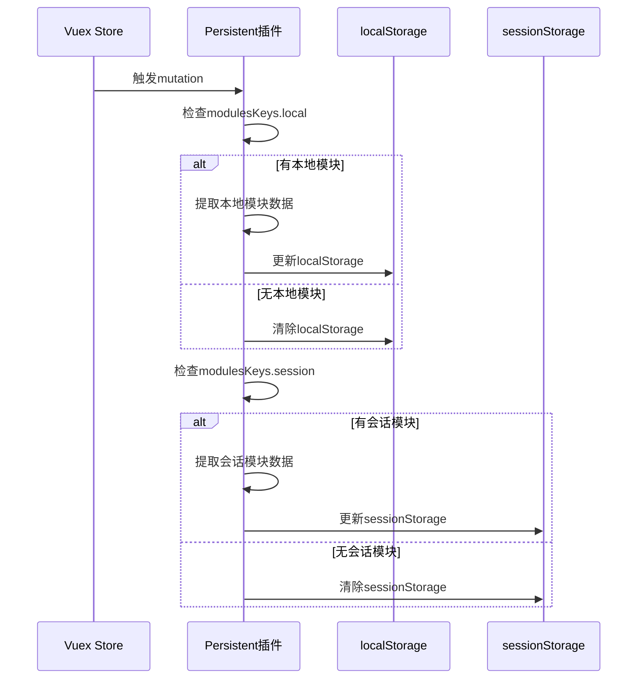
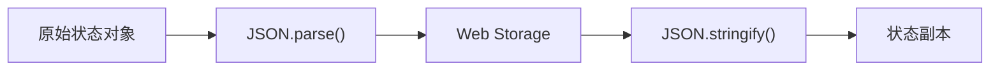
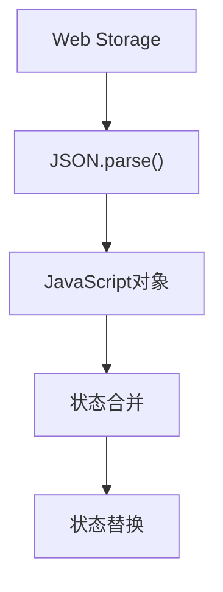
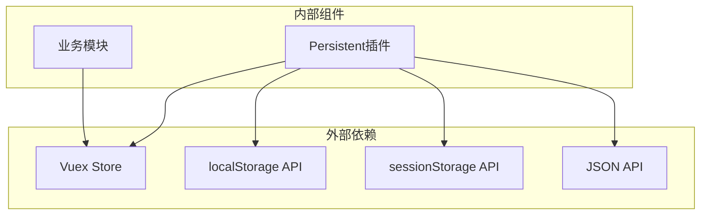
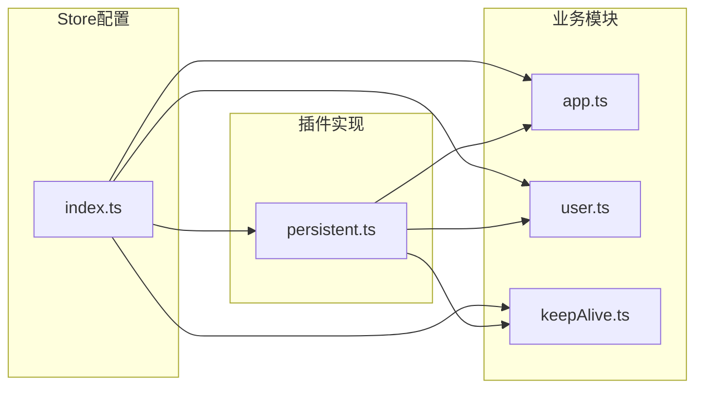

# 状态持久化插件

<cite>
**本文档引用的文件**
- [persistent.ts](file://watcher-web/src/store/plugins/persistent.ts)
- [index.ts](file://watcher-web/src/store/index.ts)
- [app.ts](file://watcher-web/src/store/modules/app.ts)
- [user.ts](file://watcher-web/src/store/modules/user.ts)
- [keepAlive.ts](file://watcher-web/src/store/modules/keepAlive.ts)
- [login.ts](file://watcher-web/src/api/login/login.ts)
- [README.md](file://watcher-web/README.md)
</cite>

## 目录
1. [简介](#简介)
2. [项目结构](#项目结构)
3. [核心组件](#核心组件)
4. [架构概览](#架构概览)
5. [详细组件分析](#详细组件分析)
6. [依赖关系分析](#依赖关系分析)
7. [性能考虑](#性能考虑)
8. [故障排除指南](#故障排除指南)
9. [结论](#结论)

## 简介

ShowTime前端系统的状态持久化插件（Persistent Plugin）是一个基于Vuex的本地存储解决方案，用于在页面刷新或重新加载时保持应用状态。该插件通过智能选择localStorage和sessionStorage来实现不同类型的持久化需求，确保用户界面状态、应用配置和用户信息能够在会话间正确恢复。

该插件的核心特性包括：
- 自动状态恢复机制
- 智能存储策略选择
- 细粒度的模块化持久化控制
- 安全的数据序列化和反序列化
- 生命周期管理的完整控制

## 项目结构

ShowTime前端系统采用模块化的架构设计，状态持久化插件位于Vuex Store的插件目录中，与业务模块分离，便于维护和扩展。



**图表来源**
- [index.ts:1-39](file://watcher-web/src/store/index.ts#L1-L39)
- [persistent.ts:1-59](file://watcher-web/src/store/plugins/persistent.ts#L1-L59)

**章节来源**
- [index.ts:1-39](file://watcher-web/src/store/index.ts#L1-L39)
- [README.md:22-36](file://watcher-web/README.md#L22-L36)

## 核心组件

### Persistent 插件架构

Persistent插件采用函数式编程模式，通过高阶函数返回Vuex插件实例。该设计提供了灵活的配置选项和强大的扩展能力。



**图表来源**
- [persistent.ts:1-59](file://watcher-web/src/store/plugins/persistent.ts#L1-L59)

### 存储策略设计

插件实现了双存储策略，根据数据的性质和持久化需求选择合适的存储方式：

| 存储类型 | 特性 | 适用场景 | 生命周期 |
|---------|------|----------|----------|
| localStorage | 永久存储，跨会话持久化 | 应用配置、主题设置、用户偏好 | 浏览器关闭后仍保留 |
| sessionStorage | 会话存储，仅当前标签页有效 | 临时状态、会话相关数据 | 标签页关闭后清除 |

**章节来源**
- [persistent.ts:21-50](file://watcher-web/src/store/plugins/persistent.ts#L21-L50)
- [index.ts:22-30](file://watcher-web/src/store/index.ts#L22-L30)

## 架构概览

Persistent插件在整个应用架构中的位置和作用如下：



**图表来源**
- [persistent.ts:21-49](file://watcher-web/src/store/plugins/persistent.ts#L21-L49)
- [index.ts:32-38](file://watcher-web/src/store/index.ts#L32-L38)

## 详细组件分析

### Persistent 插件实现

#### 初始化流程

插件在Store初始化时执行以下步骤：

1. **状态恢复**：从localStorage和sessionStorage读取持久化状态
2. **状态合并**：将两种存储中的状态进行合并
3. **状态替换**：使用合并后的状态替换当前Store状态
4. **订阅建立**：监听状态变更事件



**图表来源**
- [persistent.ts:21-32](file://watcher-web/src/store/plugins/persistent.ts#L21-L32)

#### 状态订阅和更新机制

插件通过Vuex的subscribe方法监听所有状态变更，并根据配置决定更新哪种存储：



**图表来源**
- [persistent.ts:33-48](file://watcher-web/src/store/plugins/persistent.ts#L33-L48)

**章节来源**
- [persistent.ts:21-59](file://watcher-web/src/store/plugins/persistent.ts#L21-L59)

### 配置选项详解

#### Socket 接口配置

| 配置项 | 类型 | 必需 | 描述 | 默认值 |
|--------|------|------|------|--------|
| key | string | 是 | 存储键名，用于区分不同应用的状态 | '' |
| modules | Modules | 是 | 所有Vuex模块的集合 | {} |
| modulesKeys | ModulesKeys | 是 | 模块选择配置 | {} |

#### ModulesKeys 配置

| 配置项 | 类型 | 必需 | 描述 | 示例 |
|--------|------|------|------|------|
| local | string[] | 否 | 需要持久化到localStorage的模块列表 | ['app', 'user'] |
| session | string[] | 否 | 需要持久化到sessionStorage的模块列表 | ['keepAlive'] |

**章节来源**
- [persistent.ts:1-19](file://watcher-web/src/store/plugins/persistent.ts#L1-L19)
- [index.ts:27-30](file://watcher-web/src/store/index.ts#L27-L30)

### 数据序列化和反序列化

#### 序列化过程

插件使用JSON.stringify进行数据序列化，确保数据能够正确存储到Web Storage中：



**图表来源**
- [persistent.ts:23-24](file://watcher-web/src/store/plugins/persistent.ts#L23-L24)

#### 反序列化过程

状态恢复时，插件通过JSON.parse将存储的数据转换回JavaScript对象：



**图表来源**
- [persistent.ts:25-31](file://watcher-web/src/store/plugins/persistent.ts#L25-L31)

**章节来源**
- [persistent.ts:23-26](file://watcher-web/src/store/plugins/persistent.ts#L23-L26)

### 生命周期管理

#### 初始化阶段

1. **状态读取**：从localStorage和sessionStorage读取持久化数据
2. **状态合并**：将两种存储中的状态进行深度合并
3. **状态替换**：使用合并后的状态替换当前Store状态
4. **订阅建立**：注册状态变更监听器

#### 运行阶段

1. **状态监听**：监听所有Vuex mutations
2. **条件更新**：根据modulesKeys配置决定更新哪种存储
3. **数据提取**：使用setData函数提取指定模块的数据
4. **存储更新**：将状态写入对应的存储

#### 销毁阶段

插件本身不提供显式的销毁方法，但可以通过以下方式清理：

- 用户登出时清除所有持久化数据
- 页面卸载时自动清理会话存储
- 手动调用localStorage.removeItem清除特定键

**章节来源**
- [persistent.ts:21-49](file://watcher-web/src/store/plugins/persistent.ts#L21-L49)

## 依赖关系分析

### 外部依赖

Persistent插件主要依赖于以下外部组件：



**图表来源**
- [persistent.ts:21-50](file://watcher-web/src/store/plugins/persistent.ts#L21-L50)

### 内部依赖关系



**图表来源**
- [index.ts:1-39](file://watcher-web/src/store/index.ts#L1-L39)
- [persistent.ts:1-59](file://watcher-web/src/store/plugins/persistent.ts#L1-L59)

**章节来源**
- [index.ts:15-20](file://watcher-web/src/store/index.ts#L15-L20)

## 性能考虑

### 存储性能优化

1. **增量更新**：插件只更新被修改的模块，避免全量存储
2. **条件检查**：在更新前检查modulesKeys配置，减少不必要的存储操作
3. **数据提取**：使用setData函数精确提取需要持久化的数据

### 内存使用优化

1. **状态合并**：使用Object.assign进行浅拷贝，避免深层递归
2. **存储清理**：当模块列表为空时自动清理对应存储
3. **异步处理**：存储操作在mutation触发后异步执行，不影响主线程

### 最佳实践建议

1. **合理分配存储**：将用户敏感信息放在sessionStorage中
2. **模块化配置**：按功能模块划分持久化范围
3. **定期清理**：实现定期清理过期数据的机制
4. **错误处理**：添加存储空间不足的错误处理

## 故障排除指南

### 常见问题及解决方案

#### 1. 状态无法恢复

**症状**：页面刷新后状态丢失

**可能原因**：
- 存储键名不匹配
- 模块配置错误
- 浏览器存储限制

**解决方法**：
- 检查Persistent插件的key配置
- 验证modulesKeys中的模块名称
- 清理浏览器存储空间

#### 2. 登录状态异常

**症状**：用户登出后仍显示登录状态

**可能原因**：
- 会话存储未正确清理
- 状态合并冲突

**解决方法**：
- 在用户登出时调用clearPersistentData函数
- 检查状态合并逻辑
- 验证模块命名空间配置

#### 3. 存储空间不足

**症状**：存储操作失败

**解决方法**：
- 实现存储空间监控
- 添加数据压缩机制
- 定期清理过期数据

### 调试方法

#### 开启Vuex日志

```typescript
// 在开发环境中启用Vuex日志
const debug = import.meta.env.MODE !== 'production'
const plugins = debug ? [createLogger(), persistent] : [persistent]
```

#### 状态监控

```typescript
// 添加状态变更监听
store.subscribe((mutation, state) => {
  console.log('状态变更:', mutation)
  console.log('新状态:', state)
})
```

**章节来源**
- [index.ts:6](file://watcher-web/src/store/index.ts#L6)
- [persistent.ts:33](file://watcher-web/src/store/plugins/persistent.ts#L33)

## 结论

ShowTime前端系统的状态持久化插件提供了一个强大而灵活的解决方案，用于在页面刷新和会话间保持应用状态。该插件的主要优势包括：

1. **智能存储策略**：根据数据性质选择合适的存储方式
2. **模块化配置**：支持细粒度的模块化持久化控制
3. **完整的生命周期管理**：从初始化到状态恢复再到存储更新的完整流程
4. **良好的性能表现**：通过增量更新和条件检查优化存储性能
5. **易于扩展**：清晰的架构设计便于功能扩展和定制

该插件为ShowTime应用提供了可靠的状态持久化基础，确保用户体验的一致性和连续性。通过合理的配置和最佳实践，开发者可以充分利用该插件的功能，构建更加健壮和用户友好的前端应用。