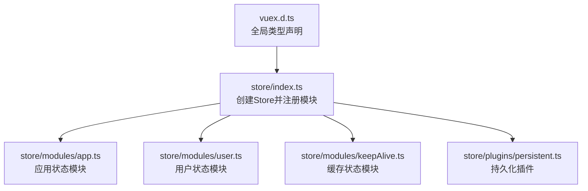
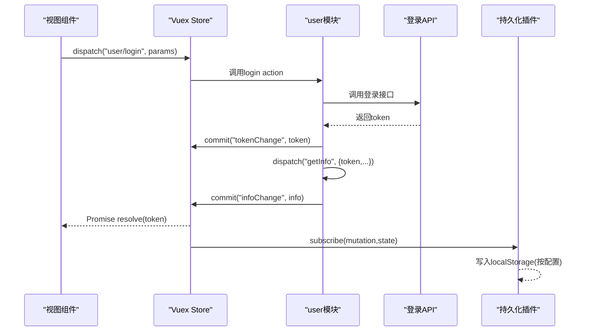
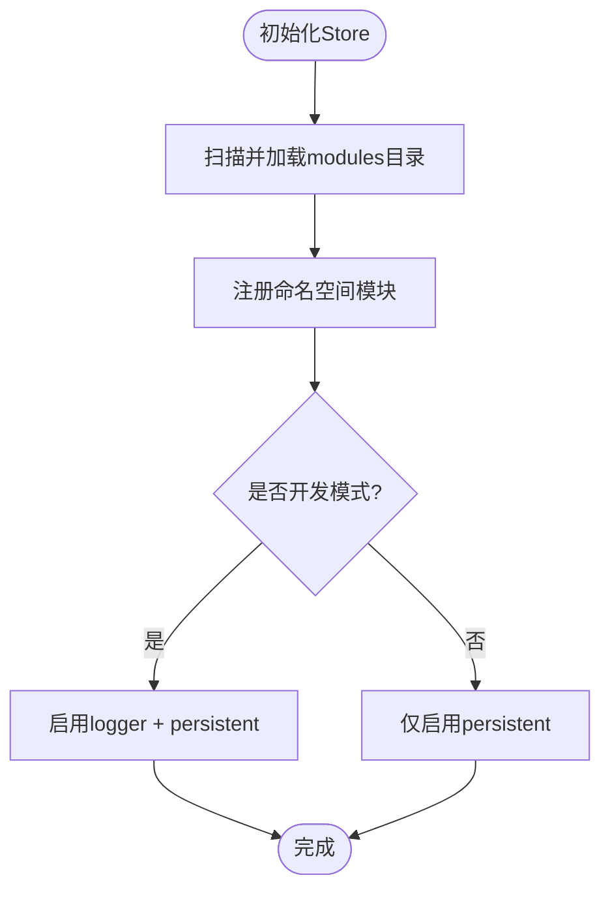
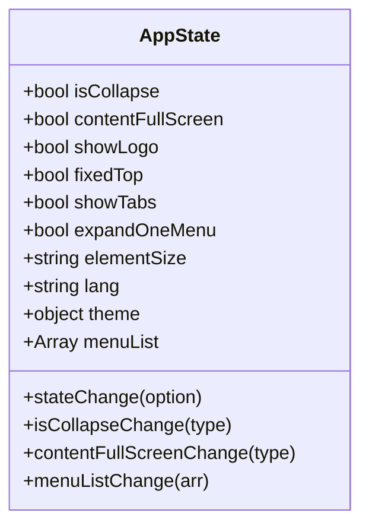
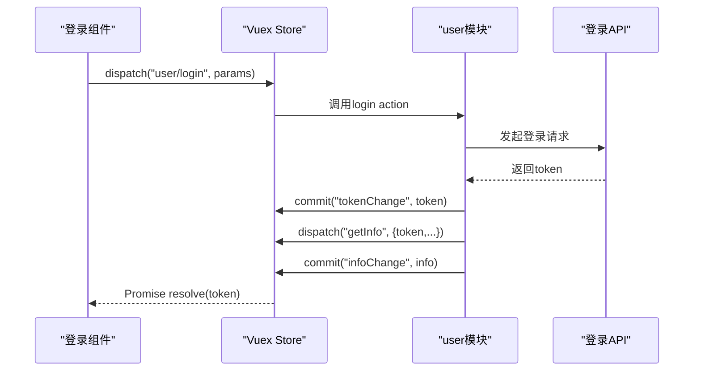
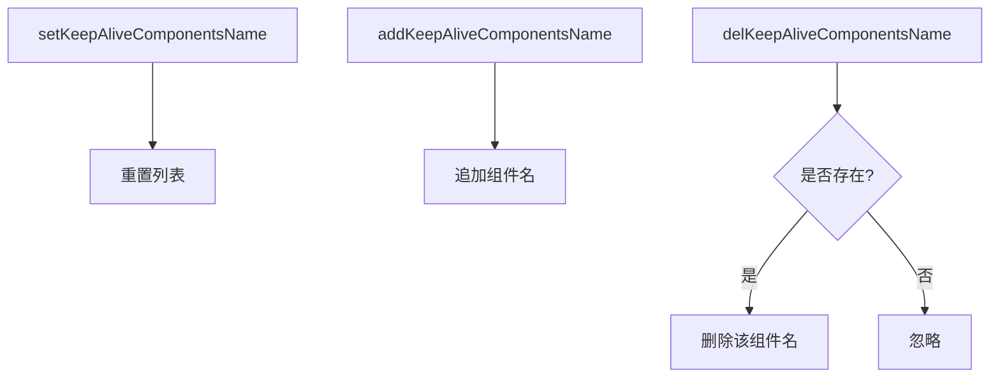
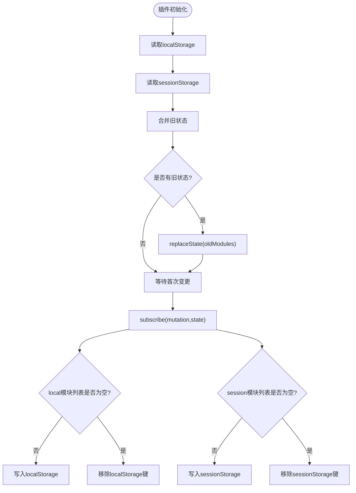
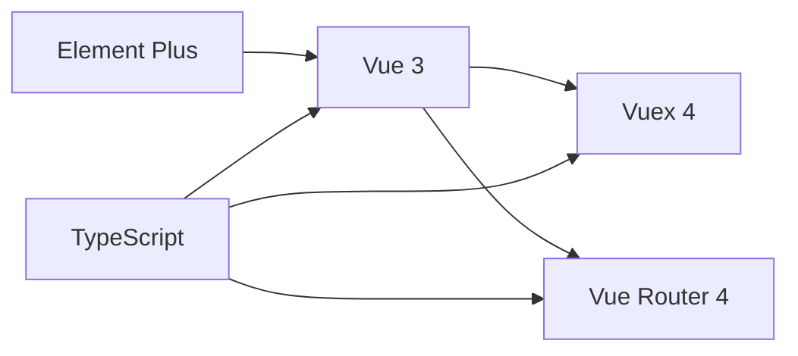

# 状态管理

<cite>
**本文引用的文件**
- [index.ts](file://watcher-web/src/store/index.ts)
- [app.ts](file://watcher-web/src/store/modules/app.ts)
- [user.ts](file://watcher-web/src/store/modules/user.ts)
- [keepAlive.ts](file://watcher-web/src/store/modules/keepAlive.ts)
- [persistent.ts](file://watcher-web/src/store/plugins/persistent.ts)
- [vuex.d.ts](file://watcher-web/src/vuex.d.ts)
- [login.ts](file://watcher-web/src/api/login/login.ts)
- [login.vue](file://watcher-web/src/views/system/login.vue)
- [Header/index.vue](file://watcher-web/src/layout/Header/index.vue)
- [Menu/index.vue](file://watcher-web/src/layout/Menu/index.vue)
- [package.json](file://watcher-web/package.json)
- [tsconfig.json](file://watcher-web/tsconfig.json)
</cite>

## 目录
1. [简介](#简介)
2. [项目结构](#项目结构)
3. [核心组件](#核心组件)
4. [架构总览](#架构总览)
5. [详细组件分析](#详细组件分析)
6. [依赖关系分析](#依赖关系分析)
7. [性能考量](#性能考量)
8. [故障排查指南](#故障排查指南)
9. [结论](#结论)
10. [附录](#附录)

## 简介
本文件系统性梳理ShowTime前端（Vue 3 + Vuex 4）的状态管理体系，覆盖Store组织结构、模块化设计、状态树管理、异步操作与错误处理、状态持久化插件及其实现细节，并给出最佳实践与调试技巧。读者无需深入代码即可理解整体架构与关键流程。

## 项目结构
- Store入口集中于单一文件，通过动态加载模块目录下的子模块，统一注册命名空间模块并挂载持久化插件。
- 模块按职责拆分：应用状态(app)、用户状态(user)、缓存状态(keepAlive)。
- 类型层面通过自定义模块扩展为全局组件提供类型安全的$store访问。

图表来源
- [index.ts:1-39](file://watcher-web/src/store/index.ts#L1-L39)
- [app.ts:1-74](file://watcher-web/src/store/modules/app.ts#L1-L74)
- [user.ts:1-76](file://watcher-web/src/store/modules/user.ts#L1-L76)
- [keepAlive.ts:1-51](file://watcher-web/src/store/modules/keepAlive.ts#L1-L51)
- [persistent.ts:1-59](file://watcher-web/src/store/plugins/persistent.ts#L1-L59)
- [vuex.d.ts:1-15](file://watcher-web/src/vuex.d.ts#L1-L15)

章节来源
- [index.ts:1-39](file://watcher-web/src/store/index.ts#L1-L39)
- [vuex.d.ts:1-15](file://watcher-web/src/vuex.d.ts#L1-L15)

## 核心组件
- Store入口与模块注册
  - 动态扫描modules目录，按文件名作为模块名注册。
  - 严格模式仅在非生产环境启用。
  - 注册持久化插件，指定local/session存储的模块集合。
- 应用状态(app)
  - 维护布局折叠、全屏、主题、语言、菜单列表等UI相关状态。
  - 提供变更mutation与通用state变更工具。
- 用户状态(user)
  - 维护token与用户信息。
  - 提供登录、获取用户信息、登出等异步动作。
- 缓存状态(keepAlive)
  - 维护需要被keep-alive缓存的组件名称列表。
  - 提供增删改查相关mutation与getter。
- 持久化插件(persistent)
  - 在应用启动时从localStorage/sessionStorage合并旧状态到初始Store。
  - 订阅每次状态变更，按模块选择写入local或session存储。

章节来源
- [index.ts:1-39](file://watcher-web/src/store/index.ts#L1-L39)
- [app.ts:14-73](file://watcher-web/src/store/modules/app.ts#L14-L73)
- [user.ts:5-75](file://watcher-web/src/store/modules/user.ts#L5-L75)
- [keepAlive.ts:7-50](file://watcher-web/src/store/modules/keepAlive.ts#L7-L50)
- [persistent.ts:21-59](file://watcher-web/src/store/plugins/persistent.ts#L21-L59)

## 架构总览
下图展示从组件到Store再到持久化插件的整体交互路径，以及登录流程中的异步调用链。

图表来源
- [login.vue:139-169](file://watcher-web/src/views/system/login.vue#L139-L169)
- [user.ts:33-67](file://watcher-web/src/store/modules/user.ts#L33-L67)
- [login.ts:4-10](file://watcher-web/src/api/login/login.ts#L4-L10)
- [persistent.ts:33-48](file://watcher-web/src/store/plugins/persistent.ts#L33-L48)

## 详细组件分析

### Store入口与模块组织
- 动态模块注册
  - 使用Vite的globEager批量导入modules目录下的模块文件。
  - 通过正则提取模块名并注册到根Store。
- 插件配置
  - 开发模式下启用logger与持久化插件；生产模式仅持久化插件。
  - 指定持久化键名与模块白名单：local用于用户相关数据，session留空。
- 类型增强
  - 通过自定义模块扩展，为全局组件提供$store类型推断。

图表来源
- [index.ts:7-38](file://watcher-web/src/store/index.ts#L7-L38)
- [vuex.d.ts:6-14](file://watcher-web/src/vuex.d.ts#L6-L14)

章节来源
- [index.ts:1-39](file://watcher-web/src/store/index.ts#L1-L39)
- [vuex.d.ts:1-15](file://watcher-web/src/vuex.d.ts#L1-L15)

### 应用状态模块(app)
- 状态字段
  - 布局折叠、内容全屏、Logo显示、顶部固定、标签页显示、单菜单展开、Element尺寸、语言、主题、菜单列表等。
- 变更方式
  - 提供具体字段变更的mutation，以及通用state变更工具，便于集中维护。
- 无Action
  - UI相关逻辑由组件直接commit，保持简单清晰。

图表来源
- [app.ts:14-63](file://watcher-web/src/store/modules/app.ts#L14-L63)

章节来源
- [app.ts:1-74](file://watcher-web/src/store/modules/app.ts#L1-L74)

### 用户状态模块(user)
- 状态字段
  - token：登录凭证
  - info：用户信息对象
- Getters
  - 提供token getter，便于组件快速读取。
- Mutations
  - tokenChange：更新token
  - infoChange：更新用户信息
- Actions
  - login：发起登录请求，成功后提交token并派发获取用户信息；失败时reject并记录日志。
  - getInfo：同步提交用户信息（示例中直接commit，实际可替换为真实API调用）。
  - loginOut：调用登出接口，清理本地/会话存储与标签页缓存，刷新页面。

图表来源
- [login.vue:139-169](file://watcher-web/src/views/system/login.vue#L139-L169)
- [user.ts:33-67](file://watcher-web/src/store/modules/user.ts#L33-L67)
- [login.ts:4-10](file://watcher-web/src/api/login/login.ts#L4-L10)

章节来源
- [user.ts:1-76](file://watcher-web/src/store/modules/user.ts#L1-L76)
- [login.vue:139-169](file://watcher-web/src/views/system/login.vue#L139-L169)
- [login.ts:1-52](file://watcher-web/src/api/login/login.ts#L1-L52)

### 缓存状态模块(keepAlive)
- 状态字段
  - keepAliveComponentsName：需要缓存的组件名称数组
- Mutations
  - setKeepAliveComponentsName：重置缓存列表
  - addKeepAliveComponentsName：添加组件名
  - delKeepAliveComponentsName：删除组件名（存在性检查）
- Getters
  - 提供缓存列表的只读访问

图表来源
- [keepAlive.ts:16-31](file://watcher-web/src/store/modules/keepAlive.ts#L16-L31)

章节来源
- [keepAlive.ts:1-51](file://watcher-web/src/store/modules/keepAlive.ts#L1-L51)

### 持久化插件(persistent)
- 启动时合并
  - 从localStorage与sessionStorage读取旧状态，合并后replaceState到Store。
- 订阅写入
  - 每次mutation触发后，根据模块白名单分别写入local/session存储。
- 数据裁剪
  - 仅写入指定模块，避免冗余数据污染存储空间。

图表来源
- [persistent.ts:21-59](file://watcher-web/src/store/plugins/persistent.ts#L21-L59)

章节来源
- [persistent.ts:1-59](file://watcher-web/src/store/plugins/persistent.ts#L1-L59)

### 组件使用示例
- 登录组件(login.vue)
  - 通过useStore调用user/login action，成功后提示并刷新页面。
- 头部组件(Header/index.vue)
  - 读取app.isCollapse计算属性，点击切换时commit app/isCollapseChange。
  - 触发user/loginOut action执行登出。
- 菜单组件(Menu/index.vue)
  - 读取app.isCollapse与app.expandOneMenu，控制菜单折叠与单展开行为。

章节来源
- [login.vue:69-98](file://watcher-web/src/views/system/login.vue#L69-L98)
- [Header/index.vue:89-98](file://watcher-web/src/layout/Header/index.vue#L89-L98)
- [Menu/index.vue:33-35](file://watcher-web/src/layout/Menu/index.vue#L33-L35)

## 依赖关系分析
- 运行时依赖
  - Vue 3、Vuex 4、Vue Router 4、Element Plus等。
- 类型与构建
  - TypeScript编译器选项开启严格模式，路径别名@指向src。
- Store与组件
  - 组件通过useStore在setup中访问$store，遵循命名空间访问规则。
  - 类型增强确保$store具备RootState类型。

图表来源
- [package.json:20-54](file://watcher-web/package.json#L20-L54)
- [tsconfig.json:2-18](file://watcher-web/tsconfig.json#L2-L18)

章节来源
- [package.json:1-72](file://watcher-web/package.json#L1-L72)
- [tsconfig.json:1-21](file://watcher-web/tsconfig.json#L1-L21)

## 性能考量
- 模块拆分与命名空间
  - 将UI状态、用户状态、缓存状态分离，降低耦合，提升可维护性。
- 严格模式与日志
  - 开发环境启用strict与logger，有助于早期发现异常状态变更。
- 持久化粒度控制
  - 仅对必要模块写入localStorage，避免存储膨胀与序列化开销。
- 异步处理
  - 使用Promise封装Action，配合组件loading状态，提升用户体验。
- KeepAlive策略
  - 明确缓存组件清单，避免不必要的组件缓存导致内存占用上升。

## 故障排查指南
- 登录后token丢失
  - 检查持久化插件是否正确写入localStorage，确认local模块列表包含user。
  - 确认浏览器localStorage可用且未被清理。
- 页面刷新后状态丢失
  - 检查persistent插件初始化合并逻辑，确认旧状态键名一致。
- 登出后仍保留状态
  - 确认loginOut action是否正确清理localStorage/sessionStorage与标签页缓存。
- 类型报错
  - 确保vuex.d.ts已生效，RootState与模块导出类型匹配。

章节来源
- [persistent.ts:21-59](file://watcher-web/src/store/plugins/persistent.ts#L21-L59)
- [user.ts:56-67](file://watcher-web/src/store/modules/user.ts#L56-L67)
- [vuex.d.ts:1-15](file://watcher-web/src/vuex.d.ts#L1-L15)

## 结论
ShowTime前端采用简洁清晰的Vuex模块化架构：以单一入口集中注册模块，结合命名空间与类型增强，使状态管理具备良好的可扩展性与可维护性。持久化插件通过精细的模块白名单控制，平衡了状态恢复与性能。异步操作以Promise封装，配合组件层的loading与提示，提升了用户体验。建议在后续迭代中：
- 对用户信息获取增加真实API调用与错误分支处理。
- 对keepAlive组件清单进行路由级动态管理。
- 在开发环境持续启用logger，生产环境谨慎评估strict带来的性能影响。

## 附录
- 最佳实践清单
  - 状态设计：单一职责、命名空间隔离、类型明确。
  - 异步处理：Action返回Promise，统一错误处理与提示。
  - 持久化：最小化写入范围，避免敏感信息落盘。
  - 调试：开发环境启用logger，利用浏览器Vuex DevTools。
  - 性能：减少不必要的state变更，避免大对象深拷贝。