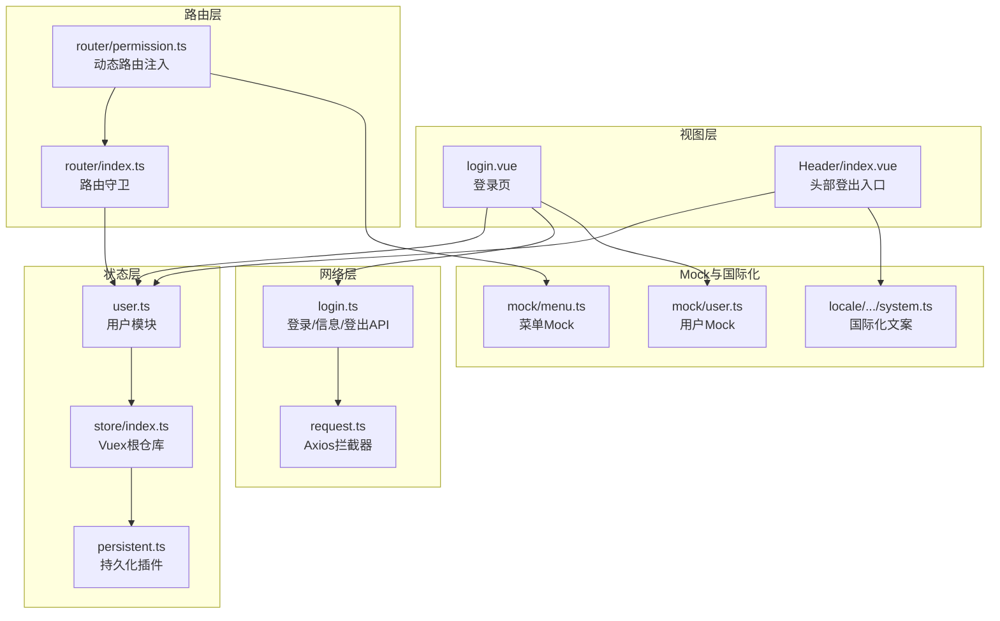
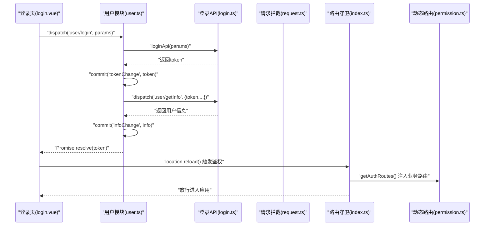
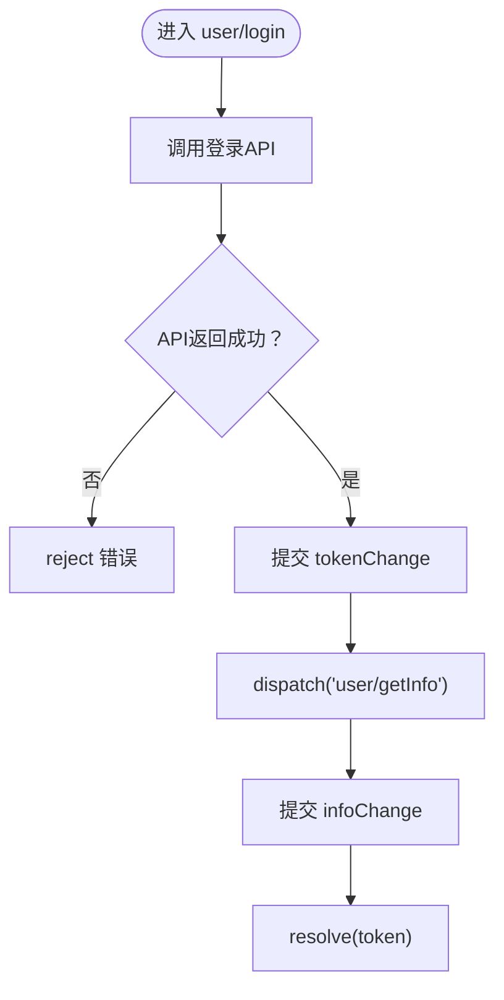
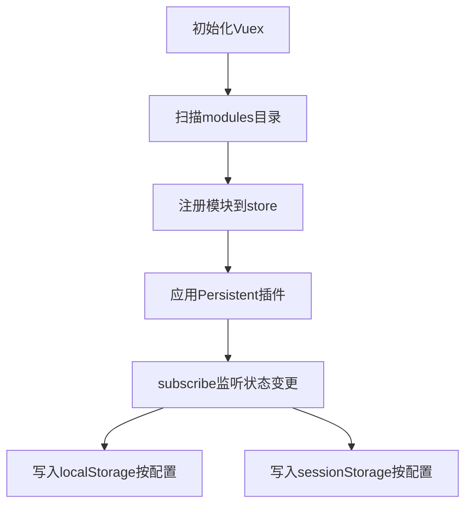
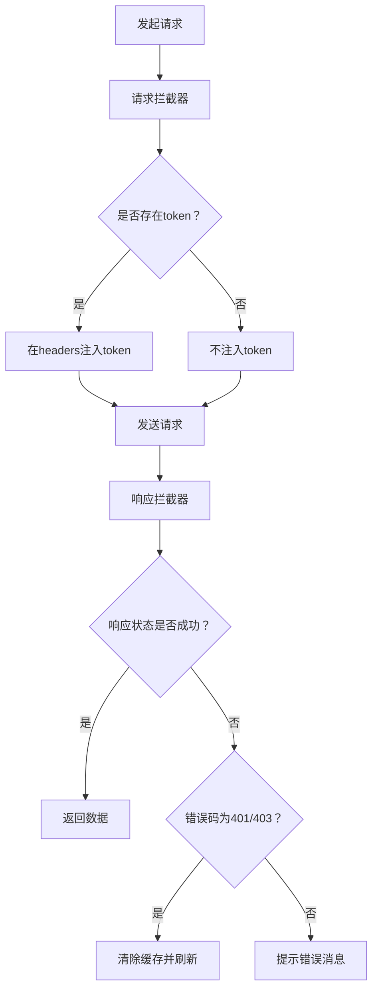
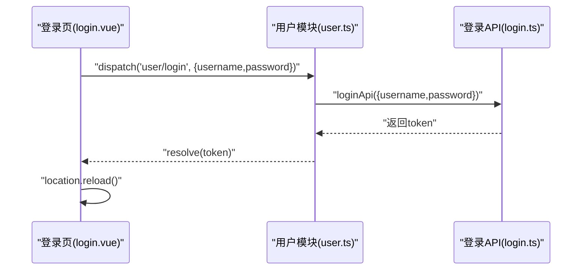
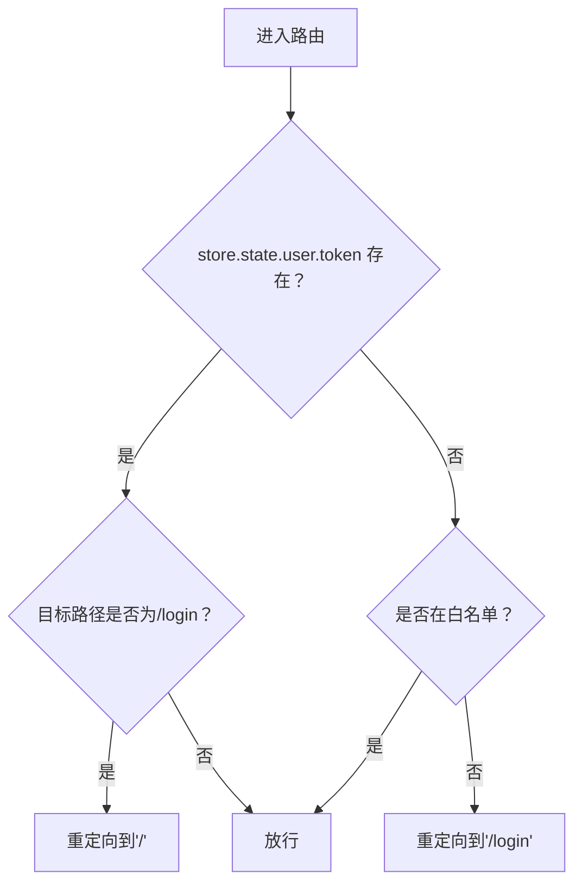
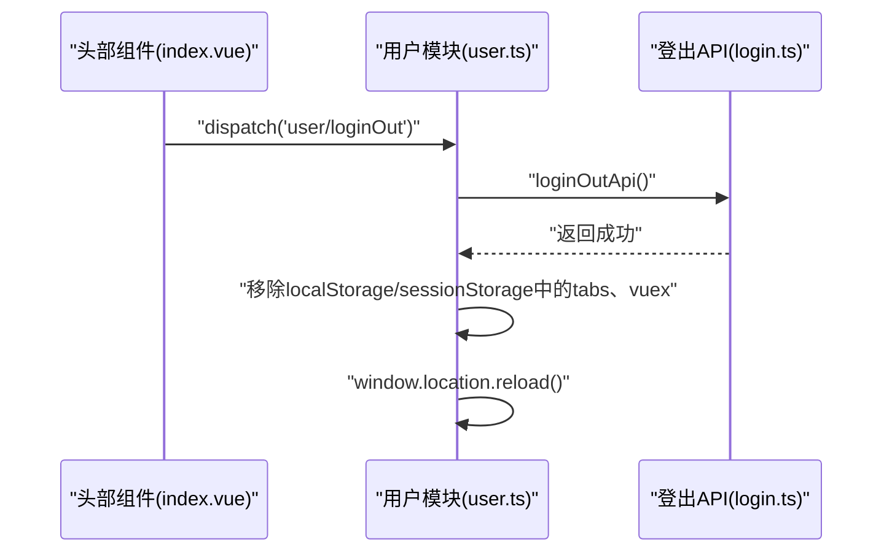
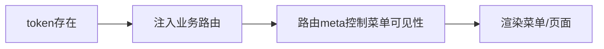
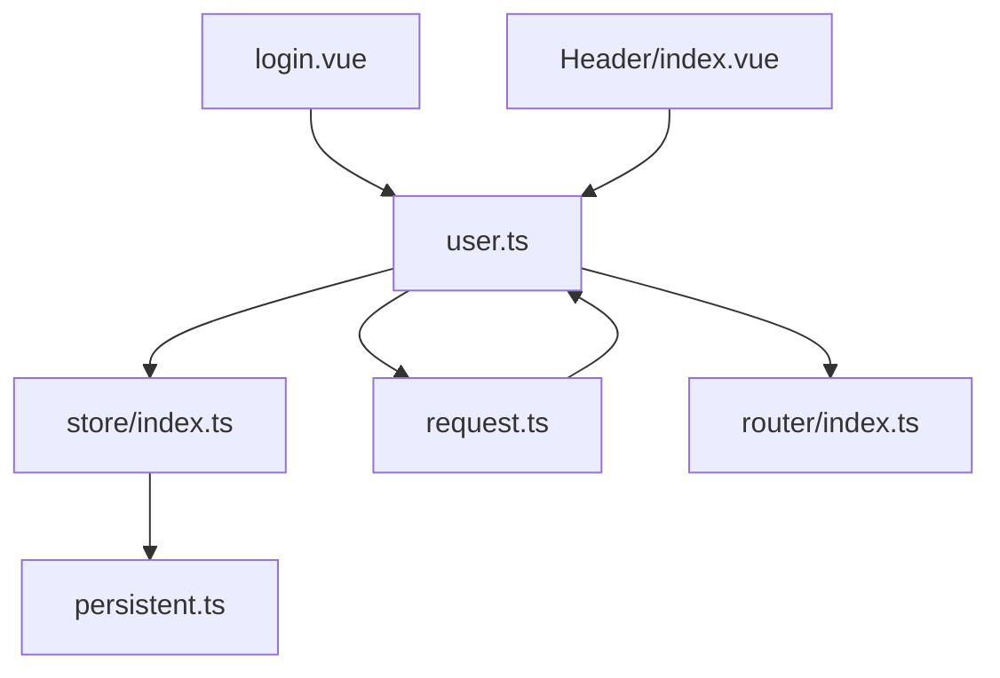

# 用户状态模块

<cite>
**本文引用的文件**
- [user.ts](file://watcher-web/src/store/modules/user.ts)
- [index.ts](file://watcher-web/src/store/index.ts)
- [request.ts](file://watcher-web/src/utils/system/request.ts)
- [login.ts](file://watcher-web/src/api/login/login.ts)
- [permission.ts](file://watcher-web/src/router/permission.ts)
- [index.ts](file://watcher-web/src/router/index.ts)
- [login.vue](file://watcher-web/src/views/system/login.vue)
- [index.vue](file://watcher-web/src/layout/Header/index.vue)
- [persistent.ts](file://watcher-web/src/store/plugins/persistent.ts)
- [menu.ts](file://watcher-web/mock/menu.ts)
- [user.ts](file://watcher-web/mock/user.ts)
- [system.ts](file://watcher-web/src/locale/modules/en/system.ts)
</cite>

## 目录
1. [简介](#简介)
2. [项目结构](#项目结构)
3. [核心组件](#核心组件)
4. [架构总览](#架构总览)
5. [详细组件分析](#详细组件分析)
6. [依赖关系分析](#依赖关系分析)
7. [性能考量](#性能考量)
8. [故障排查指南](#故障排查指南)
9. [结论](#结论)
10. [附录](#附录)

## 简介
本文件面向ShowTime前端系统的“用户状态模块”，系统性阐述其设计目标与核心能力，涵盖以下方面：
- 用户认证状态管理：登录、token传递、登出与重定向
- 权限体系：动态路由注入、菜单可见性控制（基于路由元信息）
- 用户信息维护：登录后信息拉取、本地缓存策略
- 登录状态生命周期：token存储、刷新与过期处理
- 实战示例：在组件中如何进行用户状态操作与权限判断

该模块以Vuex为核心状态容器，结合Axios请求拦截器实现JWT鉴权，通过路由守卫与动态路由注入实现菜单与页面级别的权限控制。

## 项目结构
围绕用户状态模块的关键文件组织如下：
- 状态与持久化：store/modules/user.ts、store/index.ts、store/plugins/persistent.ts
- 请求与鉴权：utils/system/request.ts
- 登录与用户信息：api/login/login.ts、views/system/login.vue
- 路由与权限：router/index.ts、router/permission.ts
- 头部与登出入口：layout/Header/index.vue
- Mock数据与国际化：mock/menu.ts、mock/user.ts、locale/modules/en/system.ts

图表来源
- [user.ts:1-76](file://watcher-web/src/store/modules/user.ts#L1-L76)
- [index.ts:1-39](file://watcher-web/src/store/index.ts#L1-L39)
- [persistent.ts:1-59](file://watcher-web/src/store/plugins/persistent.ts#L1-L59)
- [request.ts:1-81](file://watcher-web/src/utils/system/request.ts#L1-L81)
- [login.ts:1-52](file://watcher-web/src/api/login/login.ts#L1-L52)
- [index.ts:1-73](file://watcher-web/src/router/index.ts#L1-L73)
- [permission.ts:1-60](file://watcher-web/src/router/permission.ts#L1-L60)
- [login.vue:1-355](file://watcher-web/src/views/system/login.vue#L1-L355)
- [index.vue:1-213](file://watcher-web/src/layout/Header/index.vue#L1-L213)
- [menu.ts:1-29](file://watcher-web/mock/menu.ts#L1-L29)
- [user.ts:1-86](file://watcher-web/mock/user.ts#L1-L86)
- [system.ts:1-63](file://watcher-web/src/locale/modules/en/system.ts#L1-L63)

章节来源
- [user.ts:1-76](file://watcher-web/src/store/modules/user.ts#L1-L76)
- [index.ts:1-39](file://watcher-web/src/store/index.ts#L1-L39)
- [persistent.ts:1-59](file://watcher-web/src/store/plugins/persistent.ts#L1-L59)
- [request.ts:1-81](file://watcher-web/src/utils/system/request.ts#L1-L81)
- [login.ts:1-52](file://watcher-web/src/api/login/login.ts#L1-L52)
- [index.ts:1-73](file://watcher-web/src/router/index.ts#L1-L73)
- [permission.ts:1-60](file://watcher-web/src/router/permission.ts#L1-L60)
- [login.vue:1-355](file://watcher-web/src/views/system/login.vue#L1-L355)
- [index.vue:1-213](file://watcher-web/src/layout/Header/index.vue#L1-L213)
- [menu.ts:1-29](file://watcher-web/mock/menu.ts#L1-L29)
- [user.ts:1-86](file://watcher-web/mock/user.ts#L1-L86)
- [system.ts:1-63](file://watcher-web/src/locale/modules/en/system.ts#L1-L63)

## 核心组件
- 用户模块（Vuex）：负责token与用户信息的读写、登录动作、登出清理
- Vuex根仓库：自动注册模块、集成持久化插件
- 持久化插件：按模块选择性持久化到localStorage/sessionStorage
- 请求拦截器：统一注入token、集中处理401/403等错误
- 登录API：封装登录、获取用户信息、登出等接口
- 路由守卫与动态路由：基于token注入业务路由，控制菜单可见性
- 登录页与头部组件：触发登录、登出流程，展示用户信息

章节来源
- [user.ts:1-76](file://watcher-web/src/store/modules/user.ts#L1-L76)
- [index.ts:1-39](file://watcher-web/src/store/index.ts#L1-L39)
- [persistent.ts:1-59](file://watcher-web/src/store/plugins/persistent.ts#L1-L59)
- [request.ts:1-81](file://watcher-web/src/utils/system/request.ts#L1-L81)
- [login.ts:1-52](file://watcher-web/src/api/login/login.ts#L1-L52)
- [index.ts:1-73](file://watcher-web/src/router/index.ts#L1-L73)
- [permission.ts:1-60](file://watcher-web/src/router/permission.ts#L1-L60)
- [login.vue:1-355](file://watcher-web/src/views/system/login.vue#L1-L355)
- [index.vue:1-213](file://watcher-web/src/layout/Header/index.vue#L1-L213)

## 架构总览
用户状态模块遵循“状态驱动+拦截器鉴权+路由守卫”的整体架构：
- 登录成功后，token写入Vuex并持久化；后续请求自动携带token
- 路由守卫根据token决定放行或重定向至登录页
- 登出时清理token与缓存并强制刷新页面

图表来源
- [login.vue:139-169](file://watcher-web/src/views/system/login.vue#L139-L169)
- [user.ts:33-66](file://watcher-web/src/store/modules/user.ts#L33-L66)
- [login.ts:4-19](file://watcher-web/src/api/login/login.ts#L4-L19)
- [request.ts:12-29](file://watcher-web/src/utils/system/request.ts#L12-L29)
- [index.ts:36-52](file://watcher-web/src/router/index.ts#L36-L52)
- [permission.ts:54-59](file://watcher-web/src/router/permission.ts#L54-L59)

## 详细组件分析

### 用户模块（Vuex）
- 状态字段
  - token：字符串，用于鉴权
  - info：对象，存储用户信息
- Getter
  - token：暴露当前token便于拦截器使用
- Mutations
  - tokenChange：设置token
  - infoChange：设置用户信息
- Actions
  - login：调用登录API，成功后提交token并调用getInfo；最终resolve token
  - getInfo：提交info到状态（实际可扩展为远程拉取）
  - loginOut：调用登出API，清理localStorage/sessionStorage中的tabs、vuex，刷新页面

图表来源
- [user.ts:33-66](file://watcher-web/src/store/modules/user.ts#L33-L66)

章节来源
- [user.ts:1-76](file://watcher-web/src/store/modules/user.ts#L1-L76)

### Vuex根仓库与持久化插件
- 自动模块注册：通过glob扫描store/modules下的模块并注册
- 持久化策略：通过Persistent插件将指定模块持久化到localStorage（session为空），避免新窗口无法获取token
- 插件订阅：每次状态变更时，按配置写入localStorage/sessionStorage

图表来源
- [index.ts:7-38](file://watcher-web/src/store/index.ts#L7-L38)
- [persistent.ts:21-59](file://watcher-web/src/store/plugins/persistent.ts#L21-L59)

章节来源
- [index.ts:1-39](file://watcher-web/src/store/index.ts#L1-L39)
- [persistent.ts:1-59](file://watcher-web/src/store/plugins/persistent.ts#L1-L59)

### 请求拦截器与token传递
- 请求拦截：若存在token，则在请求头注入token
- 响应拦截：统一校验state；当出现401/403时，清除本地缓存并刷新页面，触发重新登录

图表来源
- [request.ts:12-76](file://watcher-web/src/utils/system/request.ts#L12-L76)

章节来源
- [request.ts:1-81](file://watcher-web/src/utils/system/request.ts#L1-L81)

### 登录API与登录页
- 登录API：提供登录、获取用户信息、登出、修改密码、密码复杂度、菜单列表等接口
- 登录页：收集用户名/密码，调用store.dispatch('user/login')，成功后刷新页面并触发路由鉴权

图表来源
- [login.vue:139-169](file://watcher-web/src/views/system/login.vue#L139-L169)
- [login.ts:4-19](file://watcher-web/src/api/login/login.ts#L4-L19)
- [user.ts:33-47](file://watcher-web/src/store/modules/user.ts#L33-L47)

章节来源
- [login.ts:1-52](file://watcher-web/src/api/login/login.ts#L1-L52)
- [login.vue:1-355](file://watcher-web/src/views/system/login.vue#L1-L355)
- [user.ts:1-76](file://watcher-web/src/store/modules/user.ts#L1-L76)

### 路由守卫与动态路由
- 路由守卫：若已登录且访问/login则重定向；否则未登录统一跳转/login
- 动态路由：根据token调用getAuthRoutes()注入业务路由（当前为静态路由集合）

图表来源
- [index.ts:36-52](file://watcher-web/src/router/index.ts#L36-L52)
- [permission.ts:54-59](file://watcher-web/src/router/permission.ts#L54-L59)

章节来源
- [index.ts:1-73](file://watcher-web/src/router/index.ts#L1-L73)
- [permission.ts:1-60](file://watcher-web/src/router/permission.ts#L1-L60)

### 登出流程与页面跳转
- 登出路由：头部组件触发store.dispatch('user/loginOut')
- 用户模块：调用登出API，清理localStorage/sessionStorage中的tabs、vuex，刷新页面
- 登录页：再次访问时触发路由守卫重定向至登录页

图表来源
- [index.vue:95-98](file://watcher-web/src/layout/Header/index.vue#L95-L98)
- [user.ts:56-66](file://watcher-web/src/store/modules/user.ts#L56-L66)
- [login.ts:22-27](file://watcher-web/src/api/login/login.ts#L22-L27)

章节来源
- [index.vue:1-213](file://watcher-web/src/layout/Header/index.vue#L1-L213)
- [user.ts:1-76](file://watcher-web/src/store/modules/user.ts#L1-L76)
- [login.ts:1-52](file://watcher-web/src/api/login/login.ts#L1-L52)

### 权限系统实现（菜单与按钮）
- 菜单权限控制：通过路由元信息控制菜单展示（如hideClose等），动态路由注入后生效
- 按钮权限验证：当前代码未直接体现按钮级权限判断逻辑，可在组件内通过store.state.user.info中的角色/权限标识进行条件渲染

图表来源
- [permission.ts:26-49](file://watcher-web/src/router/permission.ts#L26-L49)
- [menu.ts:3-15](file://watcher-web/mock/menu.ts#L3-L15)

章节来源
- [permission.ts:1-60](file://watcher-web/src/router/permission.ts#L1-L60)
- [menu.ts:1-29](file://watcher-web/mock/menu.ts#L1-L29)

### 用户信息获取与本地缓存策略
- 登录后：通过dispatch('user/getInfo')提交用户信息到状态
- 本地缓存：持久化插件将用户模块写入localStorage，确保跨会话可用
- 头部展示：从localStorage读取用户信息userName用于展示

章节来源
- [user.ts:48-54](file://watcher-web/src/store/modules/user.ts#L48-L54)
- [index.ts:27-30](file://watcher-web/src/store/index.ts#L27-L30)
- [persistent.ts:33-48](file://watcher-web/src/store/plugins/persistent.ts#L33-L48)
- [index.vue:104-114](file://watcher-web/src/layout/Header/index.vue#L104-L114)

### 登录状态生命周期（token存储、刷新与过期）
- 存储：登录成功后token写入state并持久化
- 刷新：当前实现未体现token刷新逻辑，建议在拦截器检测401时触发刷新流程
- 过期处理：响应拦截器遇到401/403时清除缓存并刷新页面，回到登录页

章节来源
- [request.ts:53-76](file://watcher-web/src/utils/system/request.ts#L53-L76)
- [user.ts:17-20](file://watcher-web/src/store/modules/user.ts#L17-L20)

## 依赖关系分析
- user模块依赖store根仓库与持久化插件，保证token与用户信息持久化
- 请求拦截器依赖store.getters['user/token']进行鉴权
- 路由守卫依赖store.state.user.token控制放行
- 登录页与头部组件分别作为登录入口与登出入口，串联用户状态流转

图表来源
- [user.ts:1-76](file://watcher-web/src/store/modules/user.ts#L1-L76)
- [index.ts:1-39](file://watcher-web/src/store/index.ts#L1-L39)
- [persistent.ts:1-59](file://watcher-web/src/store/plugins/persistent.ts#L1-L59)
- [request.ts:1-81](file://watcher-web/src/utils/system/request.ts#L1-L81)
- [index.ts:1-73](file://watcher-web/src/router/index.ts#L1-L73)
- [login.vue:1-355](file://watcher-web/src/views/system/login.vue#L1-L355)
- [index.vue:1-213](file://watcher-web/src/layout/Header/index.vue#L1-L213)

章节来源
- [user.ts:1-76](file://watcher-web/src/store/modules/user.ts#L1-L76)
- [index.ts:1-39](file://watcher-web/src/store/index.ts#L1-L39)
- [persistent.ts:1-59](file://watcher-web/src/store/plugins/persistent.ts#L1-L59)
- [request.ts:1-81](file://watcher-web/src/utils/system/request.ts#L1-L81)
- [index.ts:1-73](file://watcher-web/src/router/index.ts#L1-L73)
- [login.vue:1-355](file://watcher-web/src/views/system/login.vue#L1-L355)
- [index.vue:1-213](file://watcher-web/src/layout/Header/index.vue#L1-L213)

## 性能考量
- 持久化范围：仅对必要模块持久化，避免localStorage过大影响启动性能
- 请求拦截器：统一注入token，减少重复代码；错误集中处理，避免分散try/catch
- 路由守卫：轻量判断，避免复杂计算阻塞导航

## 故障排查指南
- 登录后仍被重定向到登录页
  - 检查store.state.user.token是否存在
  - 确认路由守卫逻辑与白名单配置
- 请求返回401/403
  - 检查响应拦截器是否正确清除缓存并刷新
  - 确认后端返回的状态码与消息体结构
- 登出后token未清除
  - 确认用户模块的loginOut action是否执行
  - 检查localStorage/sessionStorage中tabs、vuex是否被清理
- 菜单不显示
  - 检查动态路由注入逻辑与路由元信息配置
  - 确认getAuthRoutes()是否在登录后被调用

章节来源
- [index.ts:36-52](file://watcher-web/src/router/index.ts#L36-L52)
- [request.ts:53-76](file://watcher-web/src/utils/system/request.ts#L53-L76)
- [user.ts:56-66](file://watcher-web/src/store/modules/user.ts#L56-L66)
- [permission.ts:54-59](file://watcher-web/src/router/permission.ts#L54-L59)

## 结论
用户状态模块以简洁清晰的方式实现了登录、鉴权、动态路由与登出的核心流程。通过持久化插件保障跨会话可用性，借助拦截器与路由守卫统一处理token与权限，满足前端用户态管理的基本需求。后续可补充token刷新与按钮级权限判断，进一步完善权限体系。

## 附录
- 使用示例（路径指引）
  - 在组件中登录：参考[login.vue:139-169](file://watcher-web/src/views/system/login.vue#L139-L169)
  - 在组件中登出：参考[index.vue:95-98](file://watcher-web/src/layout/Header/index.vue#L95-L98)
  - 在组件中判断登录状态：参考[request.ts:20-22](file://watcher-web/src/utils/system/request.ts#L20-L22)
  - 在组件中判断菜单权限：参考[permission.ts:54-59](file://watcher-web/src/router/permission.ts#L54-L59)
  - 在组件中展示用户信息：参考[index.vue:104-114](file://watcher-web/src/layout/Header/index.vue#L104-L114)
  - 国际化文案：参考[system.ts:1-63](file://watcher-web/src/locale/modules/en/system.ts#L1-L63)