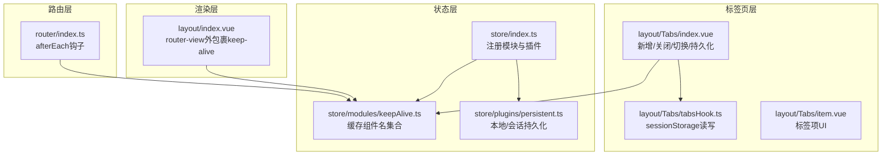
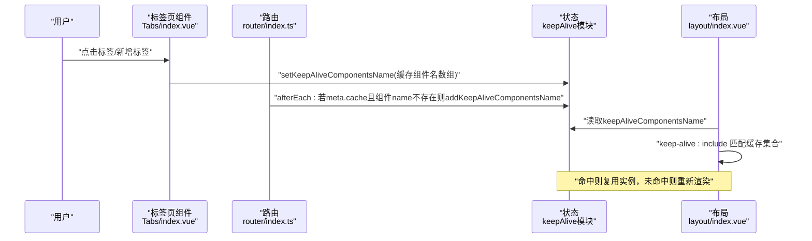
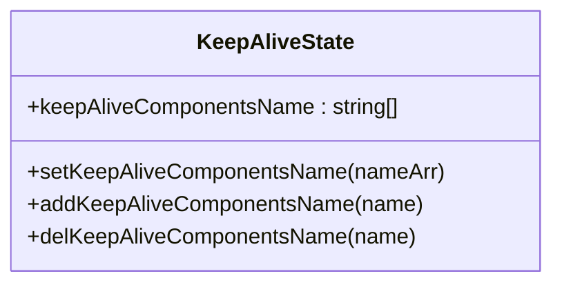
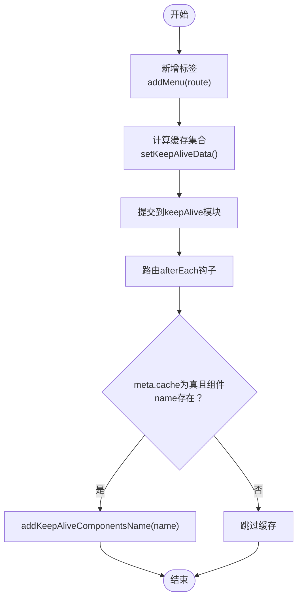
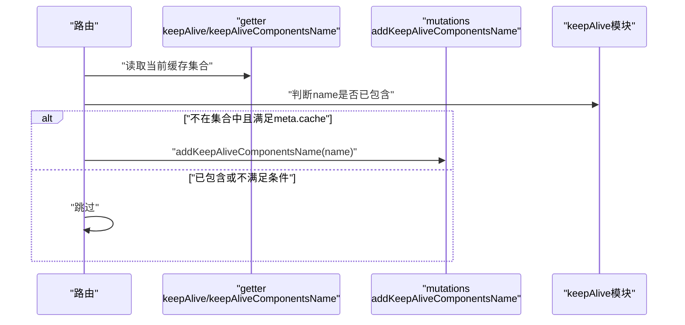
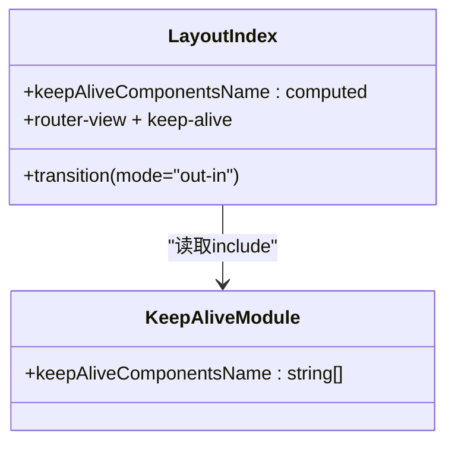
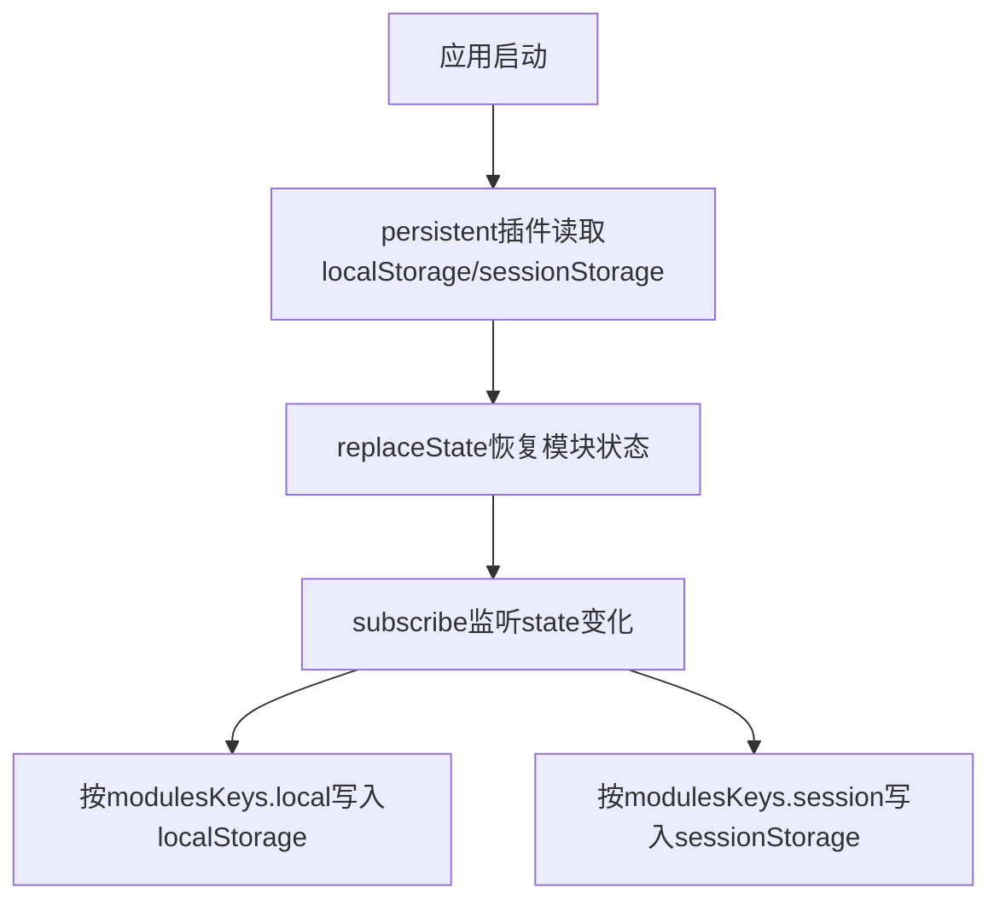
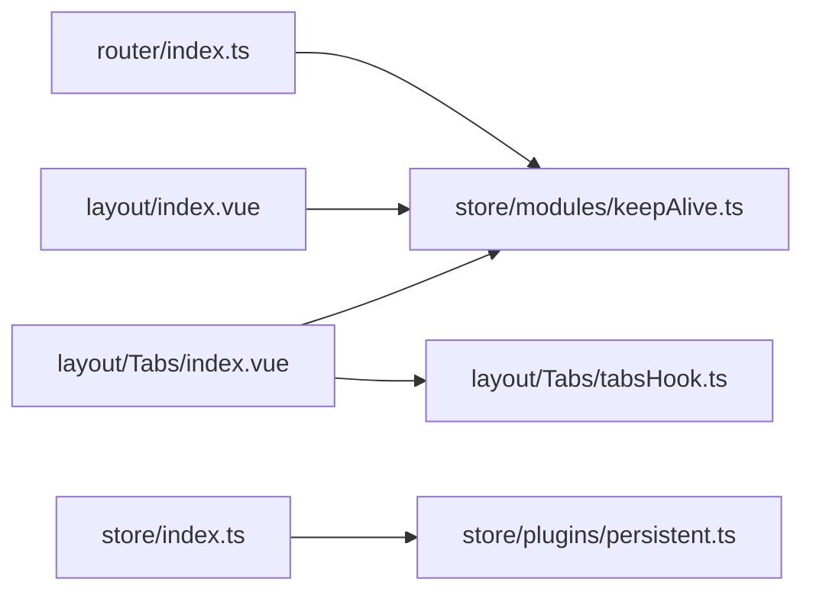

# 页面缓存模块

<cite>
**本文档引用的文件**
- [watcher-web/src/store/modules/keepAlive.ts](file://watcher-web/src/store/modules/keepAlive.ts)
- [watcher-web/src/layout/Tabs/index.vue](file://watcher-web/src/layout/Tabs/index.vue)
- [watcher-web/src/layout/Tabs/tabsHook.ts](file://watcher-web/src/layout/Tabs/tabsHook.ts)
- [watcher-web/src/layout/Tabs/item.vue](file://watcher-web/src/layout/Tabs/item.vue)
- [watcher-web/src/layout/index.vue](file://watcher-web/src/layout/index.vue)
- [watcher-web/src/router/index.ts](file://watcher-web/src/router/index.ts)
- [watcher-web/src/store/plugins/persistent.ts](file://watcher-web/src/store/plugins/persistent.ts)
- [watcher-web/src/store/index.ts](file://watcher-web/src/store/index.ts)
- [watcher-web/src/router/modules/resource.ts](file://watcher-web/src/router/modules/resource.ts)
- [watcher-web/src/router/modules/system.ts](file://watcher-web/src/router/modules/system.ts)
</cite>

## 目录
1. [简介](#简介)
2. [项目结构](#项目结构)
3. [核心组件](#核心组件)
4. [架构总览](#架构总览)
5. [详细组件分析](#详细组件分析)
6. [依赖关系分析](#依赖关系分析)
7. [性能考量](#性能考量)
8. [故障排查指南](#故障排查指南)
9. [结论](#结论)
10. [附录](#附录)

## 简介
本文件聚焦于ShowTime前端系统的页面缓存模块，系统性阐述keepAlive模块的设计理念、实现原理与使用方式，覆盖以下主题：
- 页面标签页的缓存机制与生命周期管理
- 缓存策略：哪些页面需要缓存、缓存触发条件与清理时机
- 标签页系统：新增、关闭、切换的处理逻辑
- 缓存状态的持久化：页面状态的保存与恢复
- 与Keep-Alive组件的配合：组件级缓存控制与性能优化
- 实际应用场景：如何通过合理使用页面缓存提升用户体验

## 项目结构
页面缓存模块围绕“路由 -> 标签页 -> Keep-Alive -> Vuex状态”的链路展开，关键文件如下：
- keepAlive状态管理：维护需要缓存的组件名称集合
- 路由钩子：在路由跳转后根据meta.cache决定是否加入缓存
- 布局层：在router-view外包裹keep-alive，并按include动态筛选缓存
- 标签页：负责维护标签列表、计算缓存集合、持久化标签状态
- 持久化插件：统一管理Vuex状态的本地/会话存储

图表来源
- [watcher-web/src/router/index.ts:54-68](file://watcher-web/src/router/index.ts#L54-L68)
- [watcher-web/src/layout/Tabs/index.vue:135-210](file://watcher-web/src/layout/Tabs/index.vue#L135-L210)
- [watcher-web/src/layout/Tabs/tabsHook.ts:1-12](file://watcher-web/src/layout/Tabs/tabsHook.ts#L1-L12)
- [watcher-web/src/layout/index.vue:25-39](file://watcher-web/src/layout/index.vue#L25-L39)
- [watcher-web/src/store/modules/keepAlive.ts:1-51](file://watcher-web/src/store/modules/keepAlive.ts#L1-L51)
- [watcher-web/src/store/plugins/persistent.ts:1-59](file://watcher-web/src/store/plugins/persistent.ts#L1-L59)
- [watcher-web/src/store/index.ts:1-39](file://watcher-web/src/store/index.ts#L1-L39)

章节来源
- [watcher-web/src/router/index.ts:1-73](file://watcher-web/src/router/index.ts#L1-L73)
- [watcher-web/src/layout/Tabs/index.vue:1-302](file://watcher-web/src/layout/Tabs/index.vue#L1-L302)
- [watcher-web/src/layout/Tabs/tabsHook.ts:1-12](file://watcher-web/src/layout/Tabs/tabsHook.ts#L1-L12)
- [watcher-web/src/layout/Tabs/item.vue:1-106](file://watcher-web/src/layout/Tabs/item.vue#L1-L106)
- [watcher-web/src/layout/index.vue:1-158](file://watcher-web/src/layout/index.vue#L1-L158)
- [watcher-web/src/store/modules/keepAlive.ts:1-51](file://watcher-web/src/store/modules/keepAlive.ts#L1-L51)
- [watcher-web/src/store/plugins/persistent.ts:1-59](file://watcher-web/src/store/plugins/persistent.ts#L1-L59)
- [watcher-web/src/store/index.ts:1-39](file://watcher-web/src/store/index.ts#L1-L39)

## 核心组件
- keepAlive状态模块（Vuex）
  - 维护需要缓存的组件名称数组
  - 提供设置、添加、删除等变更能力
- 路由afterEach钩子
  - 根据路由meta.cache与组件name自动加入缓存集合
- 布局层keep-alive
  - 通过include动态匹配缓存集合，实现组件级缓存
- 标签页系统
  - 维护标签列表、计算缓存集合、持久化标签状态
- 持久化插件
  - 将指定模块的状态持久化到localStorage/sessionStorage

章节来源
- [watcher-web/src/store/modules/keepAlive.ts:1-51](file://watcher-web/src/store/modules/keepAlive.ts#L1-L51)
- [watcher-web/src/router/index.ts:54-68](file://watcher-web/src/router/index.ts#L54-L68)
- [watcher-web/src/layout/index.vue:25-39](file://watcher-web/src/layout/index.vue#L25-L39)
- [watcher-web/src/layout/Tabs/index.vue:203-210](file://watcher-web/src/layout/Tabs/index.vue#L203-L210)
- [watcher-web/src/store/plugins/persistent.ts:1-59](file://watcher-web/src/store/plugins/persistent.ts#L1-L59)

## 架构总览
页面缓存的整体流程如下：
- 用户在标签页中切换或新增页面
- 标签页计算当前需要缓存的组件名集合，并提交到keepAlive模块
- 路由afterEach钩子在进入新路由时，若meta.cache为真且组件name存在，则自动加入缓存集合
- 布局层的keep-alive根据include匹配缓存集合，命中则复用组件实例，未命中则重新渲染
- 标签页状态通过tabsHook持久化到sessionStorage，刷新后可恢复

图表来源
- [watcher-web/src/layout/Tabs/index.vue:203-210](file://watcher-web/src/layout/Tabs/index.vue#L203-L210)
- [watcher-web/src/router/index.ts:54-68](file://watcher-web/src/router/index.ts#L54-L68)
- [watcher-web/src/layout/index.vue:25-39](file://watcher-web/src/layout/index.vue#L25-L39)
- [watcher-web/src/store/modules/keepAlive.ts:16-31](file://watcher-web/src/store/modules/keepAlive.ts#L16-L31)

## 详细组件分析

### keepAlive状态模块
- 数据结构
  - keepAliveComponentsName: string[]，记录需要缓存的组件名称
- 主要操作
  - setKeepAliveComponentsName：重置缓存集合
  - addKeepAliveComponentsName：追加组件名
  - delKeepAliveComponentsName：移除组件名
- 设计要点
  - 仅维护组件名字符串，避免缓存实例导致内存泄漏
  - 与路由钩子和标签页联动，确保缓存集合与当前标签状态一致

图表来源
- [watcher-web/src/store/modules/keepAlive.ts:7-31](file://watcher-web/src/store/modules/keepAlive.ts#L7-L31)

章节来源
- [watcher-web/src/store/modules/keepAlive.ts:1-51](file://watcher-web/src/store/modules/keepAlive.ts#L1-L51)

### 标签页系统
- 标签新增
  - 监听路由afterEach，将当前路由加入标签列表（忽略hideTabs）
  - 计算当前需要缓存的组件名集合并提交到keepAlive模块
- 标签关闭
  - 支持关闭当前、关闭其他、关闭全部
  - 关闭后更新缓存集合并重定向到首页
- 标签切换
  - 通过router-link切换路由，触发afterEach钩子与keep-alive复用
- 标签持久化
  - 使用tabsHook将标签列表持久化到sessionStorage，刷新后恢复

图表来源
- [watcher-web/src/layout/Tabs/index.vue:135-153](file://watcher-web/src/layout/Tabs/index.vue#L135-L153)
- [watcher-web/src/layout/Tabs/index.vue:203-210](file://watcher-web/src/layout/Tabs/index.vue#L203-L210)
- [watcher-web/src/router/index.ts:54-68](file://watcher-web/src/router/index.ts#L54-L68)

章节来源
- [watcher-web/src/layout/Tabs/index.vue:1-302](file://watcher-web/src/layout/Tabs/index.vue#L1-L302)
- [watcher-web/src/layout/Tabs/tabsHook.ts:1-12](file://watcher-web/src/layout/Tabs/tabsHook.ts#L1-L12)
- [watcher-web/src/layout/Tabs/item.vue:1-106](file://watcher-web/src/layout/Tabs/item.vue#L1-L106)

### 路由钩子与缓存策略
- 触发条件
  - 进入新路由时，若路由元信息meta.cache为真，且组件name存在且不在缓存集合中，则自动加入
- 清理时机
  - 标签关闭时，标签页会重新计算缓存集合并提交
  - 页面刷新时，标签页从sessionStorage恢复，缓存集合随之恢复
- 与keepAlive模块协作
  - 通过afterEach钩子与标签页共同维护缓存集合的一致性

图表来源
- [watcher-web/src/router/index.ts:54-68](file://watcher-web/src/router/index.ts#L54-L68)
- [watcher-web/src/store/modules/keepAlive.ts:16-31](file://watcher-web/src/store/modules/keepAlive.ts#L16-L31)

章节来源
- [watcher-web/src/router/index.ts:54-68](file://watcher-web/src/router/index.ts#L54-L68)
- [watcher-web/src/store/modules/keepAlive.ts:1-51](file://watcher-web/src/store/modules/keepAlive.ts#L1-L51)

### 布局层Keep-Alive集成
- 在router-view外包裹keep-alive，并通过include绑定缓存集合
- 未命中缓存时，直接渲染组件；命中时复用实例，避免重复挂载卸载带来的性能损耗
- 结合过渡动画，保证页面切换的流畅性

图表来源
- [watcher-web/src/layout/index.vue:25-39](file://watcher-web/src/layout/index.vue#L25-L39)
- [watcher-web/src/store/modules/keepAlive.ts:7-9](file://watcher-web/src/store/modules/keepAlive.ts#L7-L9)

章节来源
- [watcher-web/src/layout/index.vue:1-158](file://watcher-web/src/layout/index.vue#L1-L158)
- [watcher-web/src/store/modules/keepAlive.ts:1-51](file://watcher-web/src/store/modules/keepAlive.ts#L1-L51)

### 缓存状态持久化机制
- 标签页持久化
  - 使用tabsHook将标签列表序列化到sessionStorage，刷新后恢复
- Vuex状态持久化
  - 通过persistent插件将指定模块的状态持久化到localStorage/sessionStorage
  - store/index.ts中注册插件并声明需要持久化的模块键

图表来源
- [watcher-web/src/store/plugins/persistent.ts:21-49](file://watcher-web/src/store/plugins/persistent.ts#L21-L49)
- [watcher-web/src/store/index.ts:27-30](file://watcher-web/src/store/index.ts#L27-L30)

章节来源
- [watcher-web/src/layout/Tabs/tabsHook.ts:1-12](file://watcher-web/src/layout/Tabs/tabsHook.ts#L1-L12)
- [watcher-web/src/store/plugins/persistent.ts:1-59](file://watcher-web/src/store/plugins/persistent.ts#L1-L59)
- [watcher-web/src/store/index.ts:1-39](file://watcher-web/src/store/index.ts#L1-L39)

## 依赖关系分析
- 组件耦合
  - layout/index.vue依赖keepAlive模块提供的缓存集合
  - router/index.ts在afterEach中与keepAlive模块交互
  - Tabs/index.vue同时向keepAlive模块提交缓存集合，并依赖tabsHook进行标签持久化
- 外部依赖
  - Vue Router用于路由钩子与路由元信息
  - Element Plus用于UI组件与滚动容器
- 潜在循环依赖
  - 当前模块间为单向依赖，无明显循环

图表来源
- [watcher-web/src/router/index.ts:54-68](file://watcher-web/src/router/index.ts#L54-L68)
- [watcher-web/src/layout/index.vue:69-72](file://watcher-web/src/layout/index.vue#L69-L72)
- [watcher-web/src/layout/Tabs/index.vue:203-210](file://watcher-web/src/layout/Tabs/index.vue#L203-L210)
- [watcher-web/src/layout/Tabs/tabsHook.ts:1-12](file://watcher-web/src/layout/Tabs/tabsHook.ts#L1-L12)
- [watcher-web/src/store/index.ts:27-30](file://watcher-web/src/store/index.ts#L27-L30)
- [watcher-web/src/store/plugins/persistent.ts:1-59](file://watcher-web/src/store/plugins/persistent.ts#L1-L59)

章节来源
- [watcher-web/src/router/index.ts:1-73](file://watcher-web/src/router/index.ts#L1-L73)
- [watcher-web/src/layout/index.vue:1-158](file://watcher-web/src/layout/index.vue#L1-L158)
- [watcher-web/src/layout/Tabs/index.vue:1-302](file://watcher-web/src/layout/Tabs/index.vue#L1-L302)
- [watcher-web/src/layout/Tabs/tabsHook.ts:1-12](file://watcher-web/src/layout/Tabs/tabsHook.ts#L1-L12)
- [watcher-web/src/store/index.ts:1-39](file://watcher-web/src/store/index.ts#L1-L39)
- [watcher-web/src/store/plugins/persistent.ts:1-59](file://watcher-web/src/store/plugins/persistent.ts#L1-L59)

## 性能考量
- 组件复用
  - 通过keep-alive复用组件实例，减少初始化开销
- 缓存粒度
  - 以组件name为粒度，避免缓存实例导致内存泄漏
- 路由钩子触发
  - 仅在afterEach中按需加入缓存，避免不必要的缓存
- 过渡动画
  - 使用out-in模式，保证切换过程中的稳定性
- 持久化策略
  - 标签页状态使用sessionStorage，避免localStorage带来的长期占用

## 故障排查指南
- 症状：页面切换后状态丢失
  - 排查点：确认路由meta.cache与组件name是否正确设置
  - 参考路径：[watcher-web/src/router/index.ts:54-68](file://watcher-web/src/router/index.ts#L54-L68)
- 症状：标签关闭后仍被缓存
  - 排查点：检查标签页关闭逻辑是否调用了setKeepAliveData
  - 参考路径：[watcher-web/src/layout/Tabs/index.vue:113-133](file://watcher-web/src/layout/Tabs/index.vue#L113-L133)
- 症状：刷新后标签页未恢复
  - 排查点：确认tabsHook是否正常读写sessionStorage
  - 参考路径：[watcher-web/src/layout/Tabs/tabsHook.ts:1-12](file://watcher-web/src/layout/Tabs/tabsHook.ts#L1-L12)
- 症状：缓存过多导致内存占用高
  - 排查点：检查哪些页面设置了meta.cache，必要时调整缓存范围
  - 参考路径：[watcher-web/src/router/modules/resource.ts:1-49](file://watcher-web/src/router/modules/resource.ts#L1-L49)

章节来源
- [watcher-web/src/router/index.ts:54-68](file://watcher-web/src/router/index.ts#L54-L68)
- [watcher-web/src/layout/Tabs/index.vue:113-133](file://watcher-web/src/layout/Tabs/index.vue#L113-L133)
- [watcher-web/src/layout/Tabs/tabsHook.ts:1-12](file://watcher-web/src/layout/Tabs/tabsHook.ts#L1-L12)
- [watcher-web/src/router/modules/resource.ts:1-49](file://watcher-web/src/router/modules/resource.ts#L1-L49)

## 结论
页面缓存模块通过“路由afterEach + 标签页 + keepAlive + 持久化”的协同机制，实现了页面级缓存与标签页管理的统一。其设计遵循“按需缓存、按需清理、状态可恢复”的原则，在保证性能的同时提升了用户体验。建议在业务路由中合理设置meta.cache与组件name，结合标签页的关闭/清理逻辑，形成稳定高效的缓存策略。

## 附录
- 实际应用场景示例
  - 列表页与详情页：列表页开启缓存，详情页根据业务需求决定是否缓存
  - 表单页：通常不缓存，避免脏数据残留
  - 错误页/登录页：不参与缓存
- 路由配置参考
  - 系统类路由常设置hideTabs与hideClose，避免干扰标签页管理
  - 业务路由示例可参考资源模块的children配置

章节来源
- [watcher-web/src/router/modules/system.ts:1-49](file://watcher-web/src/router/modules/system.ts#L1-L49)
- [watcher-web/src/router/modules/resource.ts:1-49](file://watcher-web/src/router/modules/resource.ts#L1-L49)