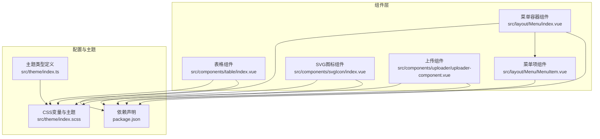
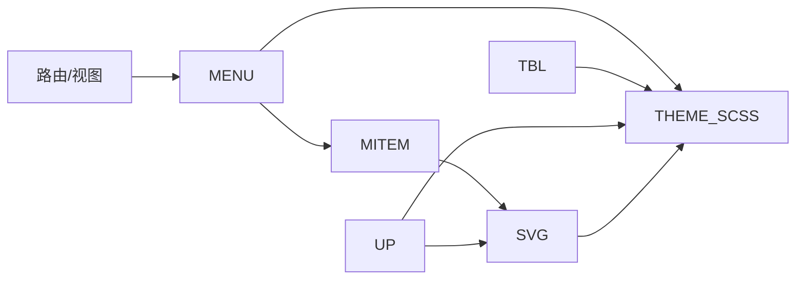
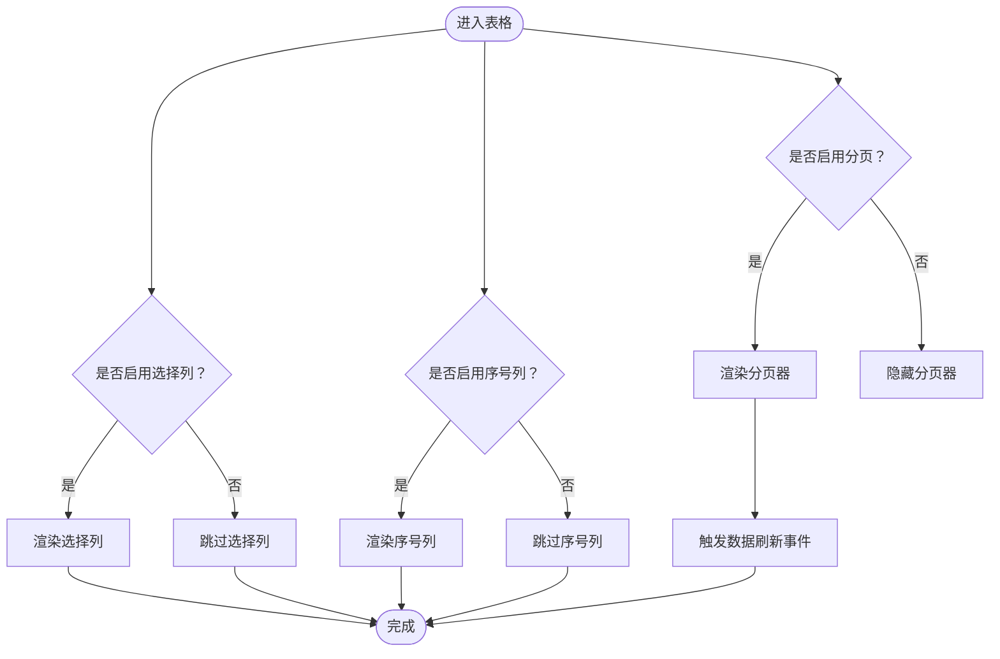
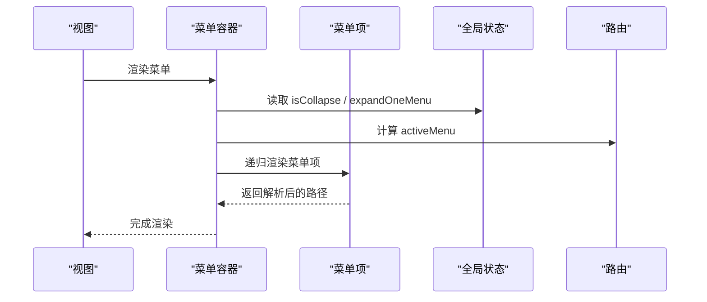
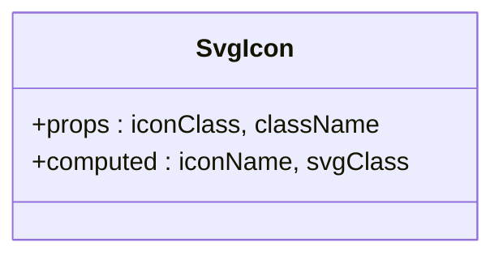
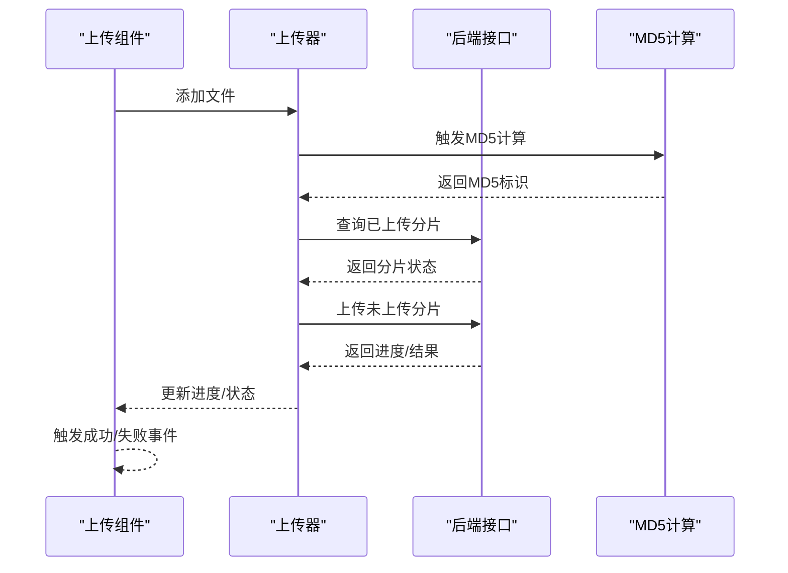
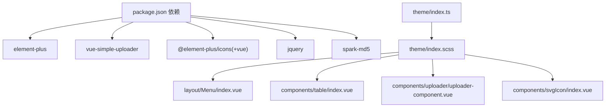

# UI组件概览

<cite>
**本文引用的文件**
- [watcher-web/src/components/table/index.vue](file://watcher-web/src/components/table/index.vue)
- [watcher-web/src/components/table/type.ts](file://watcher-web/src/components/table/type.ts)
- [watcher-web/src/components/menu/index.vue](file://watcher-web/src/components/menu/index.vue)
- [watcher-web/src/layout/Menu/index.vue](file://watcher-web/src/layout/Menu/index.vue)
- [watcher-web/src/layout/Menu/MenuItem.vue](file://watcher-web/src/layout/Menu/MenuItem.vue)
- [watcher-web/src/layout/Menu/menu.ts](file://watcher-web/src/layout/Menu/menu.ts)
- [watcher-web/src/components/svgIcon/index.vue](file://watcher-web/src/components/svgIcon/index.vue)
- [watcher-web/src/assets/icons/index.js](file://watcher-web/src/assets/icons/index.js)
- [watcher-web/src/components/uploader/uploader-component.vue](file://watcher-web/src/components/uploader/uploader-component.vue)
- [watcher-web/package.json](file://watcher-web/package.json)
- [watcher-web/src/theme/index.ts](file://watcher-web/src/theme/index.ts)
- [watcher-web/src/theme/index.scss](file://watcher-web/src/theme/index.scss)
</cite>

## 目录
1. [引言](#引言)
2. [项目结构](#项目结构)
3. [核心组件](#核心组件)
4. [架构总览](#架构总览)
5. [组件详解](#组件详解)
6. [依赖关系分析](#依赖关系分析)
7. [性能考量](#性能考量)
8. [故障排查指南](#故障排查指南)
9. [结论](#结论)
10. [附录](#附录)

## 引言
本文件面向ShowTime前端系统，聚焦基于 Element Plus 的UI组件体系，围绕表格组件、菜单组件、图标组件与上传组件进行系统性梳理。内容涵盖设计理念、核心能力、配置项与默认样式、设计原则（响应式、主题适配、无障碍）、组件选择指南以及组件间协作与组合使用建议，帮助开发者快速理解并高效应用。

## 项目结构
- 组件分布集中在 src/components 与 src/layout 下，采用按功能域分层组织：
  - 表格组件：src/components/table
  - 菜单组件：src/layout/Menu
  - 图标组件：src/components/svgIcon 与资源注册 src/assets/icons/index.js
  - 上传组件：src/components/uploader
- 主题系统通过 CSS 变量与 TS 类型定义实现，集中于 src/theme

图表来源
- [watcher-web/src/components/table/index.vue:1-133](file://watcher-web/src/components/table/index.vue#L1-L133)
- [watcher-web/src/layout/Menu/index.vue:1-132](file://watcher-web/src/layout/Menu/index.vue#L1-L132)
- [watcher-web/src/layout/Menu/MenuItem.vue:1-99](file://watcher-web/src/layout/Menu/MenuItem.vue#L1-L99)
- [watcher-web/src/components/svgIcon/index.vue:1-42](file://watcher-web/src/components/svgIcon/index.vue#L1-L42)
- [watcher-web/src/components/uploader/uploader-component.vue:1-521](file://watcher-web/src/components/uploader/uploader-component.vue#L1-L521)
- [watcher-web/src/theme/index.ts:1-200](file://watcher-web/src/theme/index.ts#L1-L200)
- [watcher-web/src/theme/index.scss:1-51](file://watcher-web/src/theme/index.scss#L1-L51)
- [watcher-web/package.json:1-72](file://watcher-web/package.json#L1-L72)

章节来源
- [watcher-web/src/components/table/index.vue:1-133](file://watcher-web/src/components/table/index.vue#L1-L133)
- [watcher-web/src/layout/Menu/index.vue:1-132](file://watcher-web/src/layout/Menu/index.vue#L1-L132)
- [watcher-web/src/layout/Menu/MenuItem.vue:1-99](file://watcher-web/src/layout/Menu/MenuItem.vue#L1-L99)
- [watcher-web/src/components/svgIcon/index.vue:1-42](file://watcher-web/src/components/svgIcon/index.vue#L1-L42)
- [watcher-web/src/components/uploader/uploader-component.vue:1-521](file://watcher-web/src/components/uploader/uploader-component.vue#L1-L521)
- [watcher-web/src/theme/index.ts:1-200](file://watcher-web/src/theme/index.ts#L1-L200)
- [watcher-web/src/theme/index.scss:1-51](file://watcher-web/src/theme/index.scss#L1-L51)
- [watcher-web/package.json:1-72](file://watcher-web/package.json#L1-L72)

## 核心组件
- 表格组件：封装 el-table 与 el-pagination，支持分页、选择列、序号列、条纹与边框等外观控制，并内置 keep-alive 布局修复逻辑。
- 菜单组件：布局级菜单容器与菜单项渲染，支持折叠、唯一展开、路由联动高亮。
- 图标组件：基于 SVG Symbol 的可复用图标组件，统一尺寸与颜色语义。
- 上传组件：基于 vue-simple-uploader 的拖拽/选择上传，支持分片、断点续传、MD5 校验、进度与状态提示。

章节来源
- [watcher-web/src/components/table/index.vue:1-133](file://watcher-web/src/components/table/index.vue#L1-L133)
- [watcher-web/src/layout/Menu/index.vue:1-132](file://watcher-web/src/layout/Menu/index.vue#L1-L132)
- [watcher-web/src/layout/Menu/MenuItem.vue:1-99](file://watcher-web/src/layout/Menu/MenuItem.vue#L1-L99)
- [watcher-web/src/components/svgIcon/index.vue:1-42](file://watcher-web/src/components/svgIcon/index.vue#L1-L42)
- [watcher-web/src/components/uploader/uploader-component.vue:1-521](file://watcher-web/src/components/uploader/uploader-component.vue#L1-L521)

## 架构总览
- 组件间关系
  - 表格组件与上传组件均消费 Element Plus 组件；菜单组件负责页面导航与路由联动。
  - 图标组件通过资源注册机制全局可用，菜单项与上传列表中均有使用。
  - 主题系统通过 CSS 变量与 TS 类型约束，贯穿菜单、表格、上传等组件的视觉一致性。

图表来源
- [watcher-web/src/layout/Menu/index.vue:1-132](file://watcher-web/src/layout/Menu/index.vue#L1-L132)
- [watcher-web/src/layout/Menu/MenuItem.vue:1-99](file://watcher-web/src/layout/Menu/MenuItem.vue#L1-L99)
- [watcher-web/src/components/table/index.vue:1-133](file://watcher-web/src/components/table/index.vue#L1-L133)
- [watcher-web/src/components/uploader/uploader-component.vue:1-521](file://watcher-web/src/components/uploader/uploader-component.vue#L1-L521)
- [watcher-web/src/components/svgIcon/index.vue:1-42](file://watcher-web/src/components/svgIcon/index.vue#L1-L42)
- [watcher-web/src/theme/index.scss:1-51](file://watcher-web/src/theme/index.scss#L1-L51)

## 组件详解

### 表格组件（system-table）
- 设计理念
  - 在 Element Plus el-table 基础上增强分页、选择列、序号列与外观控制，统一表头与单元格字号、高度，提升可读性。
  - 内置 keep-alive 激活时的布局重算，解决浮动高度问题。
- 核心功能
  - 支持 selection 列、序号列、条纹与边框开关。
  - 内置分页器，支持页码与每页数量变更，触发数据刷新事件。
  - 默认排序与表头样式定制。
- 配置项（props）
  - data：数组，数据源
  - select：数组，已选数据
  - showIndex：布尔，是否显示序号列
  - showSelection：布尔，是否显示选择列
  - showPage：布尔，是否显示分页
  - hasStripe：布尔，是否显示条纹
  - hasBorder：布尔，是否显示边框
  - page：对象，包含 index、size、total
  - pageLayout：字符串，分页布局
  - pageSizes：数组，每页数量备选项
- 事件
  - selection-change：选择变化回调
  - getTableData：分页或尺寸变化后触发的数据请求钩子
- 默认样式
  - 表头背景与高度、表体字号与颜色、输入框尺寸微调、分页器位置与宽度等

图表来源
- [watcher-web/src/components/table/index.vue:1-133](file://watcher-web/src/components/table/index.vue#L1-L133)

章节来源
- [watcher-web/src/components/table/index.vue:1-133](file://watcher-web/src/components/table/index.vue#L1-L133)
- [watcher-web/src/components/table/type.ts:1-5](file://watcher-web/src/components/table/type.ts#L1-L5)

### 菜单组件（layout-menu）
- 设计理念
  - 布局级菜单容器，支持折叠、唯一展开、路由联动高亮，使用 CSS 变量实现主题色与状态色一致。
- 核心功能
  - 菜单项递归渲染，支持一级/二级菜单组合。
  - 折叠状态与唯一展开策略由全局状态控制。
  - 初始化加载态与事件总线联动。
- 配置与数据
  - 菜单数据来源于本地配置，支持标题国际化键值与图标类名。
  - 路由元信息 activeMenu 控制当前激活项。
- 默认样式
  - 背景色、文本色、悬停与激活态背景色、子菜单层级背景色等通过 CSS 变量注入。

图表来源
- [watcher-web/src/layout/Menu/index.vue:1-132](file://watcher-web/src/layout/Menu/index.vue#L1-L132)
- [watcher-web/src/layout/Menu/MenuItem.vue:1-99](file://watcher-web/src/layout/Menu/MenuItem.vue#L1-L99)
- [watcher-web/src/layout/Menu/menu.ts:1-84](file://watcher-web/src/layout/Menu/menu.ts#L1-L84)

章节来源
- [watcher-web/src/layout/Menu/index.vue:1-132](file://watcher-web/src/layout/Menu/index.vue#L1-L132)
- [watcher-web/src/layout/Menu/MenuItem.vue:1-99](file://watcher-web/src/layout/Menu/MenuItem.vue#L1-L99)
- [watcher-web/src/layout/Menu/menu.ts:1-84](file://watcher-web/src/layout/Menu/menu.ts#L1-L84)

### 图标组件（svg-icon）
- 设计理念
  - 基于 SVG Symbol 的轻量图标组件，统一尺寸、颜色与可访问性属性。
- 核心功能
  - 动态拼接图标 ID，支持自定义类名扩展。
  - 通过 CSS 控制尺寸与填充色，适配主题色。
- 使用方式
  - 通过资源注册脚本批量导入 SVG 并注册为全局组件，可在任意组件中直接使用。

图表来源
- [watcher-web/src/components/svgIcon/index.vue:1-42](file://watcher-web/src/components/svgIcon/index.vue#L1-L42)
- [watcher-web/src/assets/icons/index.js:1-8](file://watcher-web/src/assets/icons/index.js#L1-L8)

章节来源
- [watcher-web/src/components/svgIcon/index.vue:1-42](file://watcher-web/src/components/svgIcon/index.vue#L1-L42)
- [watcher-web/src/assets/icons/index.js:1-8](file://watcher-web/src/assets/icons/index.js#L1-L8)

### 上传组件（uploader-component）
- 设计理念
  - 基于 vue-simple-uploader 的拖拽/选择上传，支持分片、断点续传、MD5 校验、进度与状态提示，适配多语言与错误处理。
- 核心功能
  - 分片上传与已上传分片检测，自动跳过已存在分片。
  - MD5 计算与暂停/恢复/重试/移除操作。
  - 已上传文件列表与待上传队列分离展示。
- 配置项（部分）
  - uploadedList：已上传文件列表（双向绑定）
  - 上传目标、分片大小、并发数、重试次数、参数处理与响应处理等
- 事件
  - uploaderSuccess：单文件上传成功
  - uploaderDelete：删除已上传文件
- 默认样式
  - 拖拽区边框与圆角、文件列表宽度与滚动、进度条颜色区分等

图表来源
- [watcher-web/src/components/uploader/uploader-component.vue:1-521](file://watcher-web/src/components/uploader/uploader-component.vue#L1-L521)

章节来源
- [watcher-web/src/components/uploader/uploader-component.vue:1-521](file://watcher-web/src/components/uploader/uploader-component.vue#L1-L521)

## 依赖关系分析
- Element Plus 生态
  - 表格、菜单、滚动条、分页、进度条等均由 Element Plus 提供，上传组件依赖 vue-simple-uploader。
- 主题与样式
  - 主题类型定义与 CSS 变量协同，确保菜单、表格、上传等组件的颜色与状态一致。
- 图标生态
  - @element-plus/icons 与自定义 SVG 资源共同构成图标库，通过资源注册脚本全局可用。

图表来源
- [watcher-web/package.json:1-72](file://watcher-web/package.json#L1-L72)
- [watcher-web/src/theme/index.ts:1-200](file://watcher-web/src/theme/index.ts#L1-L200)
- [watcher-web/src/theme/index.scss:1-51](file://watcher-web/src/theme/index.scss#L1-L51)
- [watcher-web/src/layout/Menu/index.vue:1-132](file://watcher-web/src/layout/Menu/index.vue#L1-L132)
- [watcher-web/src/components/table/index.vue:1-133](file://watcher-web/src/components/table/index.vue#L1-L133)
- [watcher-web/src/components/uploader/uploader-component.vue:1-521](file://watcher-web/src/components/uploader/uploader-component.vue#L1-L521)
- [watcher-web/src/components/svgIcon/index.vue:1-42](file://watcher-web/src/components/svgIcon/index.vue#L1-L42)

章节来源
- [watcher-web/package.json:1-72](file://watcher-web/package.json#L1-L72)
- [watcher-web/src/theme/index.ts:1-200](file://watcher-web/src/theme/index.ts#L1-L200)
- [watcher-web/src/theme/index.scss:1-51](file://watcher-web/src/theme/index.scss#L1-L51)

## 性能考量
- 表格组件
  - 合理设置 page.size 与分页，避免一次性渲染过多行。
  - 使用虚拟滚动（如需）以降低 DOM 压力。
- 上传组件
  - 分片大小与并发数需平衡吞吐与稳定性；过大可能导致内存压力，过小增加请求开销。
  - MD5 计算为 CPU 密集型，建议在空闲时机执行并限制同时计算的文件数。
- 菜单组件
  - 折叠与唯一展开减少层级渲染复杂度；避免在菜单项中放置重型子组件。
- 图标组件
  - SVG Symbol 方案体积小、渲染快；避免在大量节点中重复内联 SVG。

## 故障排查指南
- 表格组件
  - 现象：keep-alive 切换后表头高度异常
  - 处理：确认组件内部已触发布局重算逻辑
- 上传组件
  - 现象：MD5 计算卡顿或中断
  - 处理：检查分片大小与浏览器兼容性，必要时降低并发或分片大小
  - 现象：断点续传不生效
  - 处理：核对后端分片检测逻辑与标识生成规则
- 菜单组件
  - 现象：激活态样式不正确
  - 处理：检查 CSS 变量与主题配置是否匹配
- 图标组件
  - 现象：图标不显示
  - 处理：确认资源注册脚本已执行且图标 ID 拼接正确

章节来源
- [watcher-web/src/components/table/index.vue:87-90](file://watcher-web/src/components/table/index.vue#L87-L90)
- [watcher-web/src/components/uploader/uploader-component.vue:183-231](file://watcher-web/src/components/uploader/uploader-component.vue#L183-L231)
- [watcher-web/src/layout/Menu/index.vue:62-131](file://watcher-web/src/layout/Menu/index.vue#L62-L131)
- [watcher-web/src/components/svgIcon/index.vue:20-31](file://watcher-web/src/components/svgIcon/index.vue#L20-L31)

## 结论
ShowTime 前端基于 Element Plus 的组件体系在表格、菜单、图标与上传四大领域实现了统一的交互范式与主题适配。通过明确的配置项、事件与样式约定，开发者可以快速构建一致、可维护的界面。建议在实际业务中遵循“职责单一、配置优先、主题一致”的原则，结合本指南的组件选择与组合建议，提升开发效率与用户体验。

## 附录

### 设计原则
- 响应式设计
  - 表格与上传列表均采用弹性布局与滚动容器，保证在不同屏幕下的可读性与可用性。
- 主题适配
  - 通过 CSS 变量与主题类型定义，菜单、表格、上传与图标组件保持一致的色彩体系与状态色。
- 无障碍访问
  - 图标组件提供可访问性属性，菜单项与按钮具备明确的焦点与状态提示。

### 组件选择指南
- 需要分页与选择能力的表格：优先使用表格组件，按需开启序号列与选择列。
- 导航与层级菜单：使用菜单容器与菜单项组件，结合路由元信息与主题变量。
- 图标使用：统一通过 svg-icon 组件与资源注册机制，避免内联 SVG。
- 文件上传：优先使用上传组件，结合分片与 MD5 校验满足大文件与断点续传需求。

### 组件协作与组合示例
- 表格 + 分页：表格组件内置分页器，通过事件驱动数据刷新。
- 菜单 + 图标：菜单项使用 svg-icon 展示图标，主题变量统一颜色。
- 上传 + 表格：上传组件输出已上传文件列表，可在表格中展示与管理。