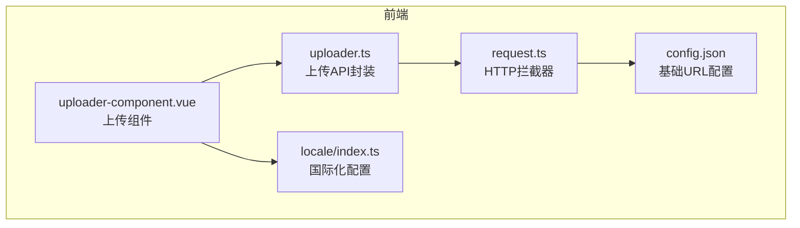
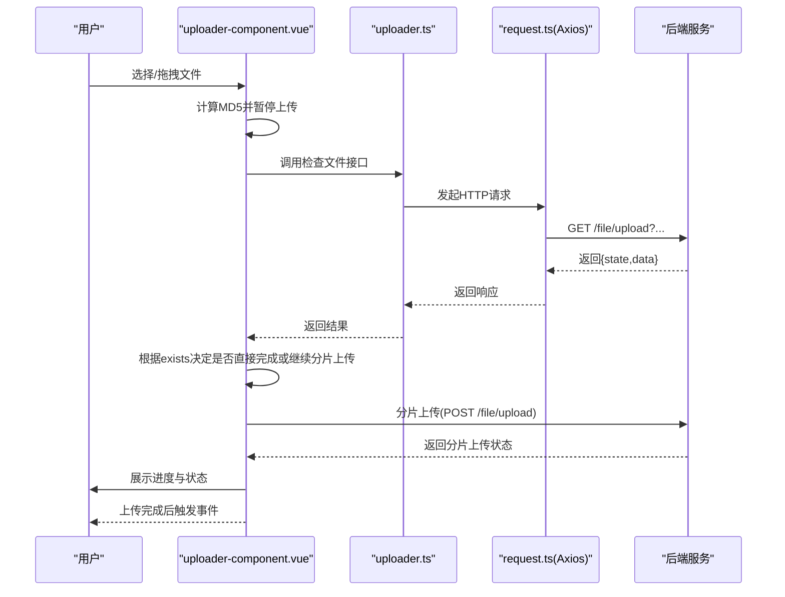
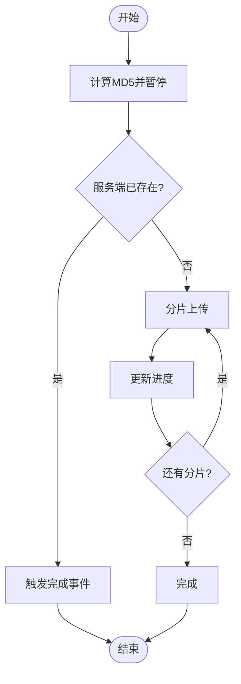
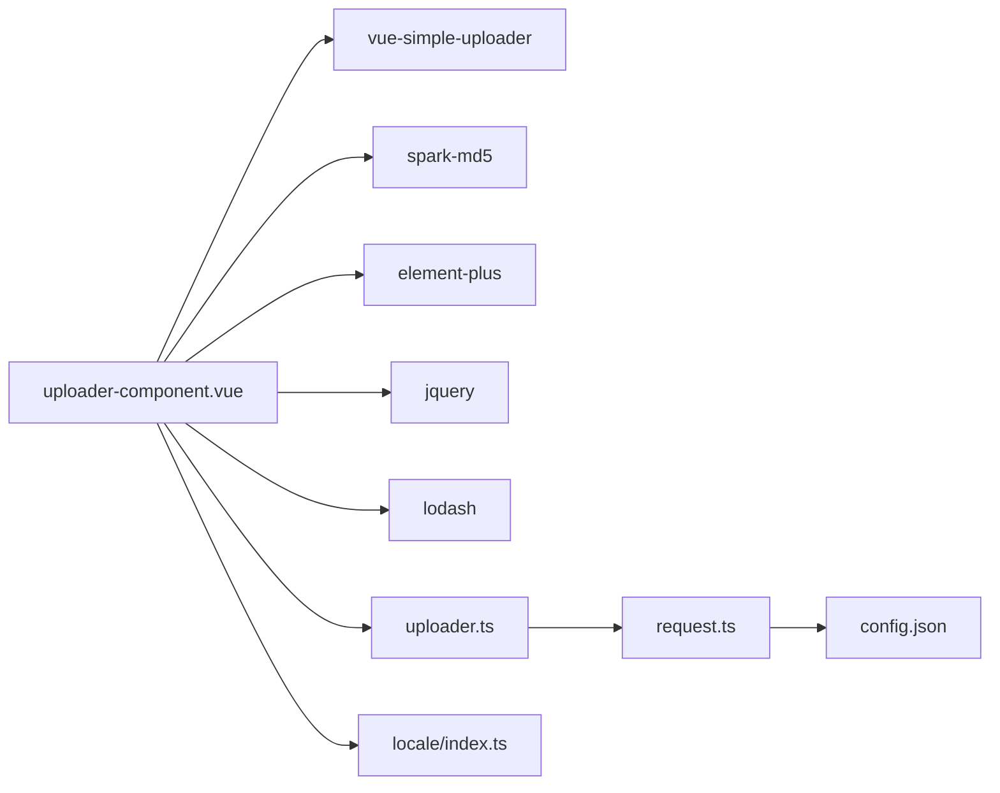

# 上传组件开发

<cite>
**本文引用的文件**
- [uploader-component.vue](file://watcher-web/src/components/uploader/uploader-component.vue)
- [uploader.ts](file://watcher-web/src/api/uploader.ts)
- [request.ts](file://watcher-web/src/utils/system/request.ts)
- [config.json](file://watcher-web/public/config.json)
- [index.ts（国际化）](file://watcher-web/src/locale/index.ts)
- [common.ts（中文国际化）](file://watcher-web/src/locale/modules/zh-cn/common.ts)
- [common.ts（英文国际化）](file://watcher-web/src/locale/modules/en/common.ts)
</cite>

## 目录
1. [简介](#简介)
2. [项目结构](#项目结构)
3. [核心组件](#核心组件)
4. [架构总览](#架构总览)
5. [详细组件分析](#详细组件分析)
6. [依赖关系分析](#依赖关系分析)
7. [性能考虑](#性能考虑)
8. [故障排查指南](#故障排查指南)
9. [结论](#结论)
10. [附录](#附录)

## 简介
本指南面向ShowTime系统的前端上传组件，围绕“文件上传组件”的实现架构与使用方法展开，重点覆盖以下方面：
- 文件选择、拖拽上传、进度跟踪与错误处理
- 组件功能特性：多文件上传、拖拽上传、预览能力、大小限制
- 上传流程控制：上传前验证、上传中监控、上传后处理
- 配置项：API接口、请求头、回调函数
- 安全机制：文件类型与大小限制、服务端校验与病毒扫描建议
- 完整示例与错误处理方案

## 项目结构
上传组件位于前端工程的组件目录中，配合API封装与HTTP拦截器共同工作。

图表来源
- [uploader-component.vue:1-521](file://watcher-web/src/components/uploader/uploader-component.vue#L1-L521)
- [uploader.ts:1-21](file://watcher-web/src/api/uploader.ts#L1-L21)
- [request.ts:1-81](file://watcher-web/src/utils/system/request.ts#L1-L81)
- [config.json:1-4](file://watcher-web/public/config.json#L1-L4)
- [index.ts（国际化）:1-26](file://watcher-web/src/locale/index.ts#L1-L26)

章节来源
- [uploader-component.vue:1-521](file://watcher-web/src/components/uploader/uploader-component.vue#L1-L521)
- [uploader.ts:1-21](file://watcher-web/src/api/uploader.ts#L1-L21)
- [request.ts:1-81](file://watcher-web/src/utils/system/request.ts#L1-L81)
- [config.json:1-4](file://watcher-web/public/config.json#L1-L4)
- [index.ts（国际化）:1-26](file://watcher-web/src/locale/index.ts#L1-L26)

## 核心组件
- 上传组件：基于vue-simple-uploader封装，支持拖拽、分片、断点续传、MD5校验、进度条与状态提示。
- API封装：统一暴露检查文件是否存在与上传文件两个接口。
- HTTP拦截器：自动注入token、统一封装响应与错误提示。
- 国际化：组件内状态文案与交互提示通过i18n管理。

章节来源
- [uploader-component.vue:136-409](file://watcher-web/src/components/uploader/uploader-component.vue#L136-L409)
- [uploader.ts:1-21](file://watcher-web/src/api/uploader.ts#L1-L21)
- [request.ts:12-48](file://watcher-web/src/utils/system/request.ts#L12-L48)
- [index.ts（国际化）:18-22](file://watcher-web/src/locale/index.ts#L18-L22)

## 架构总览
上传组件从“视图层”到“网络层”的调用链路如下：

图表来源
- [uploader-component.vue:183-231](file://watcher-web/src/components/uploader/uploader-component.vue#L183-L231)
- [uploader.ts:3-15](file://watcher-web/src/api/uploader.ts#L3-L15)
- [request.ts:8-48](file://watcher-web/src/utils/system/request.ts#L8-L48)

## 详细组件分析

### 组件结构与职责
- 视图模板：提供拖拽区域、隐藏的文件选择按钮、文件列表与进度条。
- 逻辑层：
  - 初始化上传参数（分片大小、并发数、重试次数等）
  - MD5分块计算与暂停/恢复/重试/移除控制
  - 进度颜色与百分比渲染
  - 成功/失败事件与外部回调
- 依赖：
  - vue-simple-uploader：提供分片、断点续传、状态事件
  - spark-md5：客户端MD5计算
  - element-plus：消息提示与进度条
  - jquery：DOM辅助点击触发
  - lodash：数组索引查找

章节来源
- [uploader-component.vue:1-134](file://watcher-web/src/components/uploader/uploader-component.vue#L1-L134)
- [uploader-component.vue:136-409](file://watcher-web/src/components/uploader/uploader-component.vue#L136-L409)

### 上传流程控制
- 上传前验证
  - MD5分块计算：按20MB切片，逐片读取并累计进度，完成后恢复上传。
  - 服务端存在性检查：在分片上传前调用检查接口，若已存在则直接完成。
- 上传中监控
  - 基于checkChunkUploadedByResponse判断分片是否已上传。
  - processParams向服务端附加md5标识；processResponse处理最终响应。
  - 进度条实时更新，错误时显示红色。
- 上传后处理
  - 成功事件：触发uploaderSuccess，携带fileId。
  - 删除事件：触发uploaderDelete，携带fileId。
  - 已上传列表：支持移除并触发删除事件。

图表来源
- [uploader-component.vue:183-231](file://watcher-web/src/components/uploader/uploader-component.vue#L183-L231)
- [uploader-component.vue:280-331](file://watcher-web/src/components/uploader/uploader-component.vue#L280-L331)

章节来源
- [uploader-component.vue:183-231](file://watcher-web/src/components/uploader/uploader-component.vue#L183-L231)
- [uploader-component.vue:250-279](file://watcher-web/src/components/uploader/uploader-component.vue#L250-L279)
- [uploader-component.vue:280-331](file://watcher-web/src/components/uploader/uploader-component.vue#L280-L331)

### 功能特性
- 多文件上传：基于vue-simple-uploader的默认行为，支持同时上传多个文件。
- 拖拽上传：通过uploader-drop提供拖拽区域，点击区域触发隐藏的文件选择按钮。
- 预览功能：组件内包含文件列表与进度条，支持移除已上传文件。
- 大小限制：当前未在前端显式限制文件大小，建议在业务层或服务端增加限制策略。

章节来源
- [uploader-component.vue:13-21](file://watcher-web/src/components/uploader/uploader-component.vue#L13-L21)
- [uploader-component.vue:54-132](file://watcher-web/src/components/uploader/uploader-component.vue#L54-L132)

### 配置选项
- 上传目标与分片
  - target：后端上传入口
  - chunkSize：分片大小（20MB）
  - forceChunkSize：强制使用指定分片大小
  - fileParameterName：文件字段名
  - simultaneousUploads：并发上传数
  - action：HTTP方法（POST）
  - maxChunkRetries：分片最大重试次数
  - testChunks：启用分片存在性测试
- 响应处理
  - checkChunkUploadedByResponse：自定义分片存在性判断
  - processParams：附加md5参数
  - processResponse：处理最终响应
- 状态文本（国际化）
  - success/error/uploading/paused/waiting

章节来源
- [uploader-component.vue:183-231](file://watcher-web/src/components/uploader/uploader-component.vue#L183-L231)
- [uploader-component.vue:232-238](file://watcher-web/src/components/uploader/uploader-component.vue#L232-L238)

### 安全机制
- 文件类型与大小限制
  - 当前未在前端对类型与大小进行限制，建议在业务层或服务端增加白名单与上限校验。
- 病毒扫描
  - 建议在服务端接入病毒扫描服务，上传完成后进行二次扫描。
- 传输安全
  - 使用HTTPS与JWT鉴权，HTTP拦截器会自动注入token。

章节来源
- [request.ts:19-22](file://watcher-web/src/utils/system/request.ts#L19-L22)
- [config.json:1-4](file://watcher-web/public/config.json#L1-L4)

### 错误处理
- 上传错误
  - 解析响应中的failureMessage并弹出错误提示。
- 请求错误
  - HTTP拦截器统一捕获错误并提示；401/403时清理本地数据并刷新页面。
- 用户操作
  - 支持暂停、恢复、重试、移除文件；已上传文件可移除并触发删除事件。

章节来源
- [uploader-component.vue:260-265](file://watcher-web/src/components/uploader/uploader-component.vue#L260-L265)
- [uploader-component.vue:332-341](file://watcher-web/src/components/uploader/uploader-component.vue#L332-L341)
- [request.ts:51-76](file://watcher-web/src/utils/system/request.ts#L51-L76)

## 依赖关系分析
- 组件依赖
  - vue-simple-uploader：提供分片与状态事件
  - spark-md5：客户端MD5计算
  - element-plus：消息与进度条
  - jquery/lodash：DOM与数组工具
- 服务依赖
  - uploader.ts：封装检查与上传接口
  - request.ts：Axios实例与拦截器
  - config.json：基础URL

图表来源
- [uploader-component.vue:137-161](file://watcher-web/src/components/uploader/uploader-component.vue#L137-L161)
- [uploader.ts:1](file://watcher-web/src/api/uploader.ts#L1)
- [request.ts:1](file://watcher-web/src/utils/system/request.ts#L1)
- [config.json:1-4](file://watcher-web/public/config.json#L1-L4)
- [index.ts（国际化）:1-26](file://watcher-web/src/locale/index.ts#L1-L26)

章节来源
- [uploader-component.vue:137-161](file://watcher-web/src/components/uploader/uploader-component.vue#L137-L161)
- [uploader.ts:1-21](file://watcher-web/src/api/uploader.ts#L1-L21)
- [request.ts:1-81](file://watcher-web/src/utils/system/request.ts#L1-L81)
- [config.json:1-4](file://watcher-web/public/config.json#L1-L4)
- [index.ts（国际化）:1-26](file://watcher-web/src/locale/index.ts#L1-L26)

## 性能考虑
- 分片大小：20MB分片兼顾大文件稳定性与并发效率，可根据网络环境调整。
- 并发上传：simultaneousUploads为3，避免过多并发导致带宽争用。
- MD5计算：分块读取文件，避免阻塞UI；计算完成后恢复上传。
- 进度渲染：仅在错误时显示100%，正常情况下按实际进度渲染。

章节来源
- [uploader-component.vue:183-189](file://watcher-web/src/components/uploader/uploader-component.vue#L183-L189)
- [uploader-component.vue:280-331](file://watcher-web/src/components/uploader/uploader-component.vue#L280-L331)
- [uploader-component.vue:375-380](file://watcher-web/src/components/uploader/uploader-component.vue#L375-L380)

## 故障排查指南
- 无法选择文件
  - 确认uploader-drop区域是否正确绑定点击事件，隐藏按钮是否可见。
- 上传卡住或进度不更新
  - 检查checkChunkUploadedByResponse返回逻辑与服务端响应格式。
- MD5计算失败
  - 确认文件读取权限与分片边界；查看控制台错误日志。
- 401/403错误
  - 检查token是否过期；HTTP拦截器会自动清理并刷新页面。
- 已上传文件无法移除
  - 确认uploaderDelete事件是否正确监听并处理fileId。

章节来源
- [uploader-component.vue:245-249](file://watcher-web/src/components/uploader/uploader-component.vue#L245-L249)
- [uploader-component.vue:192-212](file://watcher-web/src/components/uploader/uploader-component.vue#L192-L212)
- [uploader-component.vue:315-318](file://watcher-web/src/components/uploader/uploader-component.vue#L315-L318)
- [request.ts:54-67](file://watcher-web/src/utils/system/request.ts#L54-L67)
- [uploader-component.vue:354-363](file://watcher-web/src/components/uploader/uploader-component.vue#L354-L363)

## 结论
该上传组件通过分片与MD5校验实现了稳定的大文件上传体验，结合服务端存在性检查与断点续传，显著提升了可靠性。建议在业务层和服务端补充文件类型与大小限制、病毒扫描等安全措施，并根据网络环境优化分片大小与并发数。

## 附录

### API定义
- 检查文件是否存在
  - 方法：GET
  - 路径：/file/upload
  - 参数：由processParams附加md5等标识
- 上传文件
  - 方法：POST
  - 路径：/file/upload
  - 数据：分片文件与必要参数

章节来源
- [uploader.ts:3-15](file://watcher-web/src/api/uploader.ts#L3-L15)

### 回调与事件
- 上传成功：触发uploaderSuccess，携带fileId
- 上传删除：触发uploaderDelete，携带fileId
- 上传错误：解析failureMessage并提示

章节来源
- [uploader-component.vue:274-279](file://watcher-web/src/components/uploader/uploader-component.vue#L274-L279)
- [uploader-component.vue:260-265](file://watcher-web/src/components/uploader/uploader-component.vue#L260-L265)

### 国际化与文案
- 状态文案：success/error/uploading/paused/waiting
- 交互提示：如“计算MD5”、“无文件列表”等

章节来源
- [uploader-component.vue:232-238](file://watcher-web/src/components/uploader/uploader-component.vue#L232-L238)
- [index.ts（国际化）:18-22](file://watcher-web/src/locale/index.ts#L18-L22)