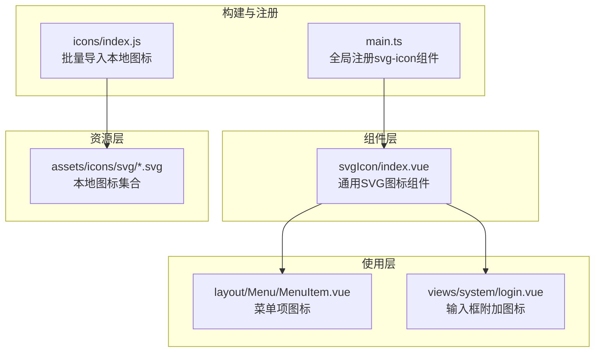
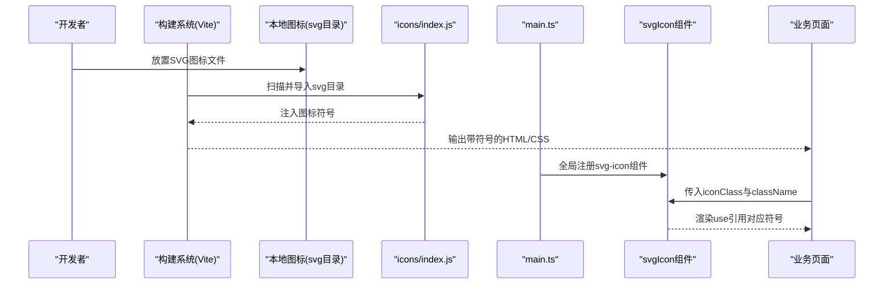
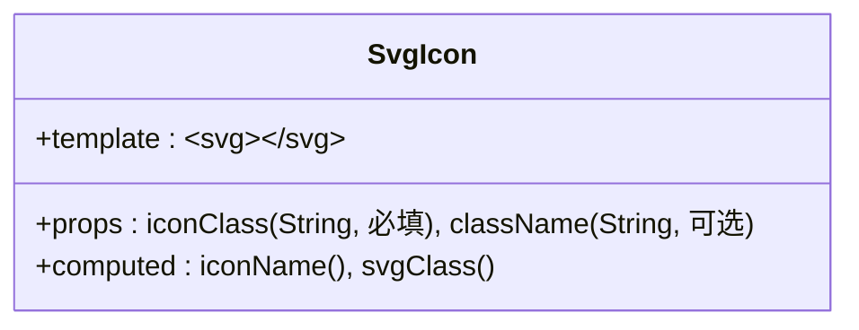
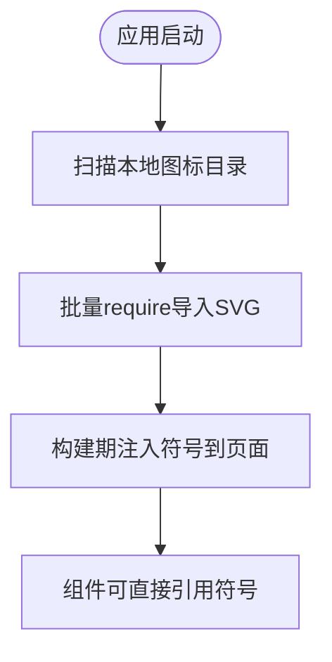
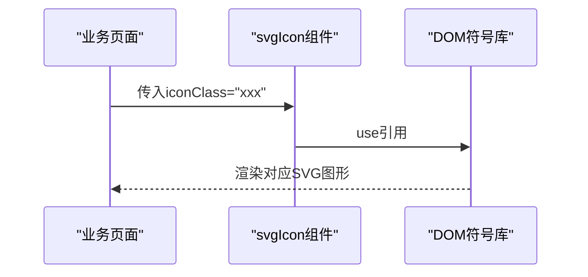
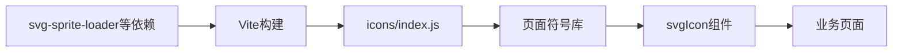

# 图标组件开发

<cite>
**本文引用的文件**
- [icons/index.js](file://watcher-web/src/assets/icons/index.js)
- [svgIcon/index.vue](file://watcher-web/src/components/svgIcon/index.vue)
- [main.ts](file://watcher-web/src/main.ts)
- [package.json](file://watcher-web/package.json)
- [vite.config.ts](file://watcher-web/vite.config.ts)
- [MenuItem.vue](file://watcher-web/src/layout/Menu/MenuItem.vue)
- [login.vue](file://watcher-web/src/views/system/login.vue)
</cite>

## 目录
1. [简介](#简介)
2. [项目结构](#项目结构)
3. [核心组件](#核心组件)
4. [架构总览](#架构总览)
5. [详细组件分析](#详细组件分析)
6. [依赖分析](#依赖分析)
7. [性能考虑](#性能考虑)
8. [故障排查指南](#故障排查指南)
9. [结论](#结论)
10. [附录](#附录)

## 简介
本指南面向ShowTime前端工程中的SVG图标体系，系统讲解SVG图标组件的实现原理与使用方法，涵盖图标加载、缓存机制、按需引入、图标库管理（本地图标与在线图标）、图标优化策略、扩展方法（自定义图标、主题切换、动态替换）以及性能优化技巧（SVG压缩、懒加载、缓存策略）。文档同时提供完整使用示例与最佳实践，帮助开发者在不牺牲可维护性与性能的前提下高效集成与扩展图标系统。

## 项目结构
在当前仓库中，SVG图标体系主要由以下部分组成：
- 组件层：统一的SVG图标组件，负责渲染内联SVG。
- 资源层：本地图标资源目录，通过构建工具打包并注入到页面。
- 注册层：全局注册SVG图标组件，并批量导入本地图标。
- 使用层：在布局、菜单、表单等界面元素中以类名或属性的方式引用图标。

**图表来源**
- [icons/index.js:1-8](file://watcher-web/src/assets/icons/index.js#L1-L8)
- [main.ts:1-37](file://watcher-web/src/main.ts#L1-L37)
- [svgIcon/index.vue:1-42](file://watcher-web/src/components/svgIcon/index.vue#L1-L42)
- [MenuItem.vue:1-99](file://watcher-web/src/layout/Menu/MenuItem.vue#L1-L99)
- [login.vue:1-355](file://watcher-web/src/views/system/login.vue#L1-L355)

**章节来源**
- [icons/index.js:1-8](file://watcher-web/src/assets/icons/index.js#L1-L8)
- [main.ts:1-37](file://watcher-web/src/main.ts#L1-L37)
- [svgIcon/index.vue:1-42](file://watcher-web/src/components/svgIcon/index.vue#L1-L42)
- [MenuItem.vue:1-99](file://watcher-web/src/layout/Menu/MenuItem.vue#L1-L99)
- [login.vue:1-355](file://watcher-web/src/views/system/login.vue#L1-L355)

## 核心组件
- SVG图标组件：提供统一的图标渲染能力，支持通过属性传入图标名称、自定义样式类名；内部通过use元素引用符号定义，实现复用与按需渲染。
- 本地图标注册：通过构建期扫描本地图标目录，将所有SVG符号注入到页面，形成可用的符号库。
- 全局组件注册：在应用入口完成组件注册，使任意页面可直接使用该组件。

关键特性与行为：
- 图标名称映射：组件将传入的图标名称转换为对应的符号ID，确保唯一性与可引用性。
- 样式控制：默认继承父级currentColor，便于主题色统一；可通过className扩展样式。
- 尺寸与颜色：通过CSS单位与currentColor实现响应式尺寸与主题色适配。

**章节来源**
- [svgIcon/index.vue:1-42](file://watcher-web/src/components/svgIcon/index.vue#L1-L42)
- [icons/index.js:1-8](file://watcher-web/src/assets/icons/index.js#L1-L8)
- [main.ts:1-37](file://watcher-web/src/main.ts#L1-L37)

## 架构总览
下图展示了从“本地图标导入”到“组件渲染”的端到端流程，包括构建期与运行期的关键节点。

**图表来源**
- [icons/index.js:1-8](file://watcher-web/src/assets/icons/index.js#L1-L8)
- [main.ts:1-37](file://watcher-web/src/main.ts#L1-L37)
- [svgIcon/index.vue:1-42](file://watcher-web/src/components/svgIcon/index.vue#L1-L42)

## 详细组件分析

### SVG图标组件（svgIcon）
- 组件职责：接收图标名称与样式类，生成内联SVG并引用符号。
- 关键属性：
  - iconClass：必填，用于生成符号ID。
  - className：可选，追加自定义样式类。
- 计算属性：
  - iconName：将iconClass拼接为符号ID前缀。
  - svgClass：根据是否存在className决定最终类名。
- 样式要点：默认使用currentColor，保证与主题色一致；尺寸以em为单位，随字体大小缩放。

**图表来源**
- [svgIcon/index.vue:1-42](file://watcher-web/src/components/svgIcon/index.vue#L1-L42)

**章节来源**
- [svgIcon/index.vue:1-42](file://watcher-web/src/components/svgIcon/index.vue#L1-L42)

### 本地图标导入与注册（icons/index.js）
- 功能：在应用启动时批量导入本地图标，将其作为符号注入页面。
- 实现要点：
  - 使用require.context扫描指定目录下的SVG文件。
  - 通过requireAll遍历并执行导入，触发构建器将SVG转为符号并注入。
- 影响范围：所有被导入的SVG都会成为可用的符号，供组件通过iconClass引用。

**图表来源**
- [icons/index.js:1-8](file://watcher-web/src/assets/icons/index.js#L1-L8)

**章节来源**
- [icons/index.js:1-8](file://watcher-web/src/assets/icons/index.js#L1-L8)

### 全局组件注册（main.ts）
- 功能：在应用入口注册svg-icon组件，使其在整个应用范围内可用。
- 注意事项：确保在挂载应用之前完成注册，避免组件未定义导致的渲染错误。

**章节来源**
- [main.ts:1-37](file://watcher-web/src/main.ts#L1-L37)

### 在业务页面中的使用
- 菜单图标：在菜单项中通过类名绑定图标，组件内部会解析为对应的符号ID。
- 登录页图标：在输入框的附加区域使用图标类名，实现视觉提示与交互反馈。

**图表来源**
- [MenuItem.vue:1-99](file://watcher-web/src/layout/Menu/MenuItem.vue#L1-L99)
- [login.vue:1-355](file://watcher-web/src/views/system/login.vue#L1-L355)
- [svgIcon/index.vue:1-42](file://watcher-web/src/components/svgIcon/index.vue#L1-L42)

**章节来源**
- [MenuItem.vue:1-99](file://watcher-web/src/layout/Menu/MenuItem.vue#L1-L99)
- [login.vue:1-355](file://watcher-web/src/views/system/login.vue#L1-L355)

## 依赖分析
- 构建工具链：Vite负责开发与生产构建，配合插件进行模块化与资源处理。
- 图标构建依赖：项目中包含svg-sprite-loader相关依赖，表明存在将SVG合并为精灵图或符号图的构建策略（尽管当前通过icons/index.js实现批量导入）。
- 运行时依赖：Element Plus提供UI基础组件，与图标结合使用于菜单、表单等场景。

**图表来源**
- [vite.config.ts:1-50](file://watcher-web/vite.config.ts#L1-L50)
- [package.json:1-72](file://watcher-web/package.json#L1-L72)
- [icons/index.js:1-8](file://watcher-web/src/assets/icons/index.js#L1-L8)

**章节来源**
- [vite.config.ts:1-50](file://watcher-web/vite.config.ts#L1-L50)
- [package.json:1-72](file://watcher-web/package.json#L1-L72)

## 性能考虑
- SVG压缩与体积控制
  - 建议在构建前对SVG进行压缩（移除注释、精简路径、合并重复路径），减少传输体积。
  - 对于高频使用的图标，优先采用内联符号形式，避免额外HTTP请求。
- 懒加载与按需引入
  - 保持现有批量导入策略的同时，可在特殊场景下对非关键图标采用动态导入，降低首屏负载。
  - 对于大型菜单或动态路由，可延迟加载对应页面的图标资源。
- 缓存策略
  - 构建产物启用长效缓存，结合版本号或哈希命名，确保图标更新后可及时生效。
  - 页面符号库作为静态资源，可利用浏览器缓存与CDN加速。
- 渲染优化
  - 控制图标尺寸与数量，避免在同一容器中渲染过多复杂图标。
  - 使用currentColor与CSS缩放，减少重排与重绘。

[本节为通用性能建议，无需特定文件引用]

## 故障排查指南
- 图标不显示
  - 检查图标名称是否正确，确保iconClass与符号ID一致。
  - 确认本地图标已通过icons/index.js导入并注入页面。
  - 核对组件是否已在入口完成全局注册。
- 颜色异常
  - 确保父级元素具有期望的颜色值，组件默认使用currentColor继承。
  - 若需覆盖颜色，可通过className传入自定义样式。
- 尺寸不符预期
  - 图标尺寸以em为单位，受父级字体大小影响；可通过CSS调整容器字体大小或显式设置尺寸。
- 构建失败或符号缺失
  - 检查构建配置与依赖安装状态，确认svg-sprite-loader相关依赖可用。
  - 确保SVG文件命名规范，避免非法字符与重复ID。

**章节来源**
- [icons/index.js:1-8](file://watcher-web/src/assets/icons/index.js#L1-L8)
- [svgIcon/index.vue:1-42](file://watcher-web/src/components/svgIcon/index.vue#L1-L42)
- [main.ts:1-37](file://watcher-web/src/main.ts#L1-L37)

## 结论
ShowTime的SVG图标体系以“组件 + 符号库 + 全局注册”为核心，实现了图标的一致性、可维护性与可扩展性。通过本指南提供的原理说明、使用方法、扩展方案与性能优化建议，开发者可以在不破坏现有架构的前提下，安全地引入新图标、切换主题、动态替换图标，并持续提升用户体验与性能表现。

[本节为总结性内容，无需特定文件引用]

## 附录

### 使用方法速查
- 图标名称配置
  - 在业务页面中传入iconClass，组件将自动映射为#icon-{iconClass}。
- 尺寸设置
  - 通过CSS设置容器字体大小或显式尺寸，图标会按em缩放。
- 颜色定制
  - 默认继承currentColor；可通过className传入自定义样式类覆盖颜色。

**章节来源**
- [svgIcon/index.vue:1-42](file://watcher-web/src/components/svgIcon/index.vue#L1-L42)

### 图标库管理最佳实践
- 本地图标导入
  - 将SVG放置于本地图标目录，确保被批量导入脚本扫描。
- 在线图标加载
  - 如需引入外部图标，建议先进行本地缓存或CDN托管，避免跨域与网络波动带来的问题。
- 图标优化策略
  - 压缩SVG体积、合并重复路径、移除冗余元数据。
  - 对高频图标采用内联符号，低频图标考虑懒加载。

**章节来源**
- [icons/index.js:1-8](file://watcher-web/src/assets/icons/index.js#L1-L8)

### 扩展方法
- 自定义图标添加
  - 新增SVG文件至本地图标目录，确保名称唯一；组件将自动识别并注入。
- 图标主题切换
  - 通过修改父级颜色或覆盖样式类，实现主题色切换。
- 图标动态替换
  - 通过响应式数据驱动iconClass变化，实现动态替换。

**章节来源**
- [svgIcon/index.vue:1-42](file://watcher-web/src/components/svgIcon/index.vue#L1-L42)
- [MenuItem.vue:1-99](file://watcher-web/src/layout/Menu/MenuItem.vue#L1-L99)