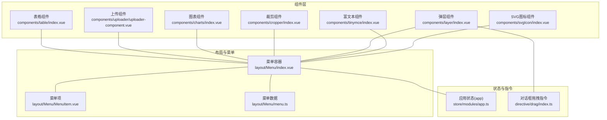
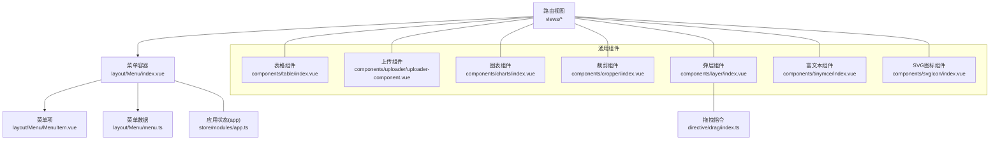
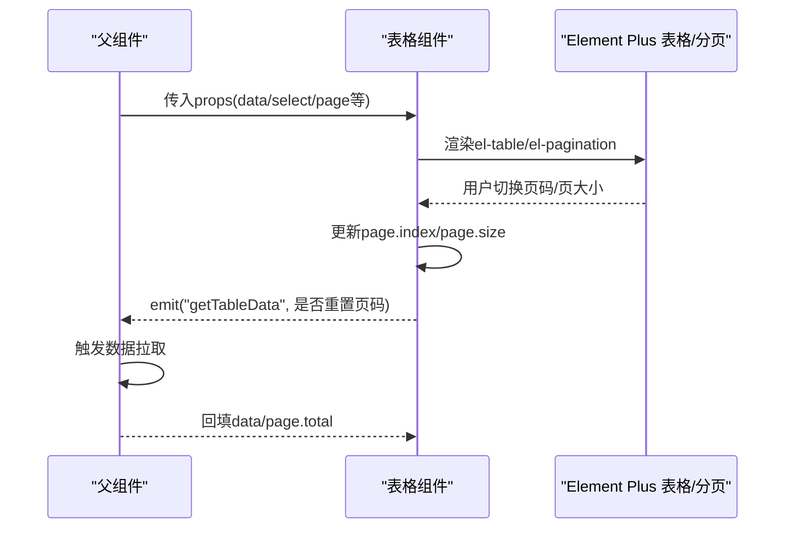
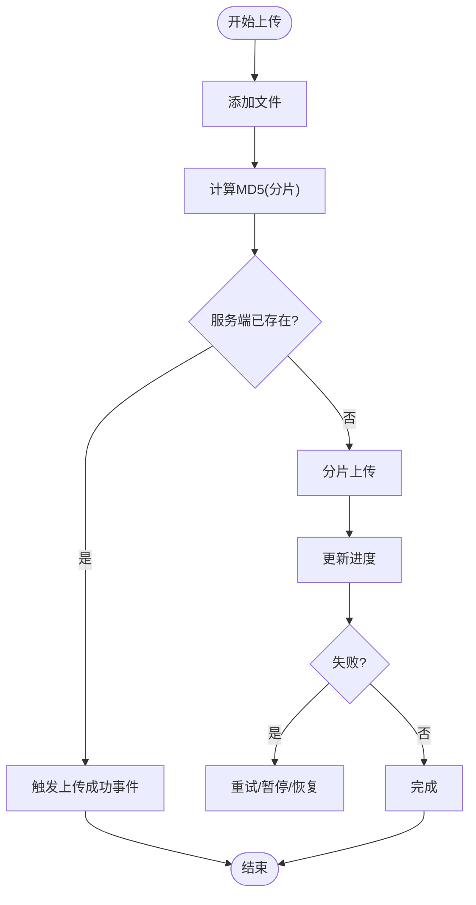
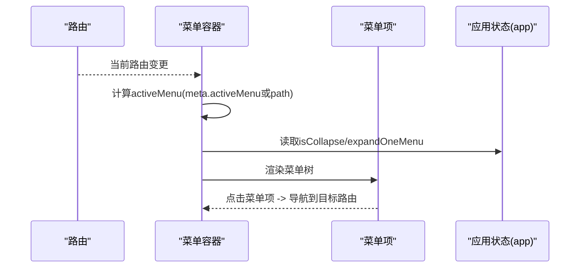
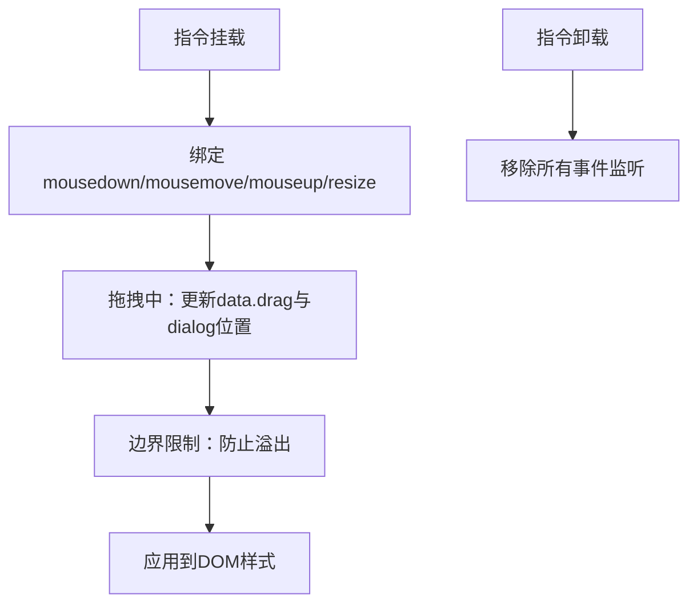
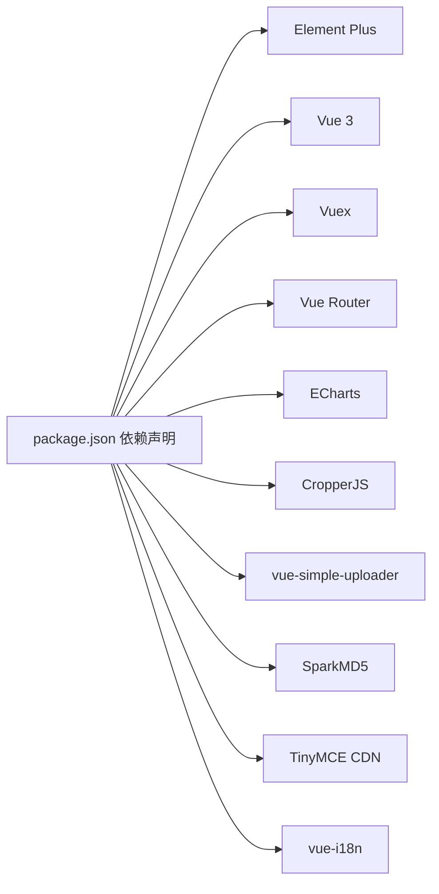

# 组件开发指南

<cite>
**本文引用的文件**
- [watcher-web/src/components/table/index.vue](file://watcher-web/src/components/table/index.vue)
- [watcher-web/src/components/table/type.ts](file://watcher-web/src/components/table/type.ts)
- [watcher-web/src/components/menu/index.vue](file://watcher-web/src/components/menu/index.vue)
- [watcher-web/src/components/svgIcon/index.vue](file://watcher-web/src/components/svgIcon/index.vue)
- [watcher-web/src/components/uploader/uploader-component.vue](file://watcher-web/src/components/uploader/uploader-component.vue)
- [watcher-web/src/components/charts/index.vue](file://watcher-web/src/components/charts/index.vue)
- [watcher-web/src/components/cropper/index.vue](file://watcher-web/src/components/cropper/index.vue)
- [watcher-web/src/components/layer/index.vue](file://watcher-web/src/components/layer/index.vue)
- [watcher-web/src/components/tinymce/index.vue](file://watcher-web/src/components/tinymce/index.vue)
- [watcher-web/src/layout/Menu/index.vue](file://watcher-web/src/layout/Menu/index.vue)
- [watcher-web/src/layout/Menu/MenuItem.vue](file://watcher-web/src/layout/Menu/MenuItem.vue)
- [watcher-web/src/layout/Menu/menu.ts](file://watcher-web/src/layout/Menu/menu.ts)
- [watcher-web/src/directive/drag/index.ts](file://watcher-web/src/directive/drag/index.ts)
- [watcher-web/src/store/modules/app.ts](file://watcher-web/src/store/modules/app.ts)
- [watcher-web/package.json](file://watcher-web/package.json)
</cite>

## 目录
1. [简介](#简介)
2. [项目结构](#项目结构)
3. [核心组件](#核心组件)
4. [架构总览](#架构总览)
5. [详细组件分析](#详细组件分析)
6. [依赖分析](#依赖分析)
7. [性能考虑](#性能考虑)
8. [故障排查指南](#故障排查指南)
9. [结论](#结论)
10. [附录](#附录)

## 简介
本指南面向ShowTime前端系统（基于Vue 3 + Element Plus）的组件开发，围绕以下目标展开：
- 基于Element Plus的常用UI组件使用与定制：表格、菜单、图标、上传等
- 自定义组件开发流程：设计原则、props定义、事件处理、插槽使用
- 组件间通信机制：父子、兄弟、跨层级
- 组件复用策略：通用组件封装、可配置组件设计、组件库扩展
- 组件测试与调试技巧、性能优化建议

## 项目结构
前端代码位于 watcher-web 目录，采用“按功能域组织”的模块化布局：
- components：通用业务组件（表格、上传、图表、裁剪、弹层、富文本、SVG图标等）
- layout：布局与菜单体系（菜单渲染、菜单项、滚动条、主题变量）
- store：状态管理（应用态、菜单展开、语言、尺寸等）
- directive：指令（对话框拖拽）
- api：接口封装（如上传服务）
- views：页面视图（路由对应页面）

**图表来源**
- [watcher-web/src/components/table/index.vue:1-133](file://watcher-web/src/components/table/index.vue#L1-L133)
- [watcher-web/src/components/uploader/uploader-component.vue:1-521](file://watcher-web/src/components/uploader/uploader-component.vue#L1-L521)
- [watcher-web/src/components/charts/index.vue:1-47](file://watcher-web/src/components/charts/index.vue#L1-L47)
- [watcher-web/src/components/cropper/index.vue:1-173](file://watcher-web/src/components/cropper/index.vue#L1-L173)
- [watcher-web/src/components/layer/index.vue:1-84](file://watcher-web/src/components/layer/index.vue#L1-L84)
- [watcher-web/src/components/tinymce/index.vue:1-267](file://watcher-web/src/components/tinymce/index.vue#L1-L267)
- [watcher-web/src/components/svgIcon/index.vue:1-42](file://watcher-web/src/components/svgIcon/index.vue#L1-L42)
- [watcher-web/src/layout/Menu/index.vue:1-132](file://watcher-web/src/layout/Menu/index.vue#L1-L132)
- [watcher-web/src/layout/Menu/MenuItem.vue:1-99](file://watcher-web/src/layout/Menu/MenuItem.vue#L1-L99)
- [watcher-web/src/layout/Menu/menu.ts:1-84](file://watcher-web/src/layout/Menu/menu.ts#L1-L84)
- [watcher-web/src/store/modules/app.ts:1-74](file://watcher-web/src/store/modules/app.ts#L1-L74)
- [watcher-web/src/directive/drag/index.ts:1-120](file://watcher-web/src/directive/drag/index.ts#L1-L120)

**章节来源**
- [watcher-web/src/layout/Menu/index.vue:1-132](file://watcher-web/src/layout/Menu/index.vue#L1-L132)
- [watcher-web/src/layout/Menu/MenuItem.vue:1-99](file://watcher-web/src/layout/Menu/MenuItem.vue#L1-L99)
- [watcher-web/src/layout/Menu/menu.ts:1-84](file://watcher-web/src/layout/Menu/menu.ts#L1-L84)

## 核心组件
本节聚焦于与UI交互最密切的组件：表格、菜单、图标、上传。

- 表格组件
  - 功能：封装el-table与el-pagination，提供分页、序号列、选择列、表头样式定制、keep-alive兼容布局
  - 关键点：通过$attrs透传属性；通过context.emit向外抛出分页与选择变更事件；内部维护页码与每页数量联动
  - 参考路径：[watcher-web/src/components/table/index.vue:1-133](file://watcher-web/src/components/table/index.vue#L1-L133)，[watcher-web/src/components/table/type.ts:1-5](file://watcher-web/src/components/table/type.ts#L1-L5)

- 菜单组件
  - 功能：基于Element Plus的el-menu渲染，支持折叠、唯一展开、主题色变量、国际化标题
  - 关键点：菜单数据来源于layout/Menu/menu.ts；MenuItem根据层级与配置决定渲染为el-menu-item或el-sub-menu；active状态由路由与meta.activeMenu决定
  - 参考路径：[watcher-web/src/layout/Menu/index.vue:1-132](file://watcher-web/src/layout/Menu/index.vue#L1-L132)，[watcher-web/src/layout/Menu/MenuItem.vue:1-99](file://watcher-web/src/layout/Menu/MenuItem.vue#L1-L99)，[watcher-web/src/layout/Menu/menu.ts:1-84](file://watcher-web/src/layout/Menu/menu.ts#L1-L84)

- 图标组件
  - 功能：SVG图标渲染，支持动态className与图标名拼接
  - 关键点：props包含iconClass与className；computed生成iconName与svgClass
  - 参考路径：[watcher-web/src/components/svgIcon/index.vue:1-42](file://watcher-web/src/components/svgIcon/index.vue#L1-L42)

- 上传组件
  - 功能：基于vue-simple-uploader实现拖拽/选择上传、分片断点续传、MD5预校验、进度与状态展示、已上传列表联动
  - 关键点：props接收uploadedList；通过SparkMD5计算文件标识；配置checkChunkUploadedByResponse与processParams；对外emit uploaderSuccess/uploaderDelete
  - 参考路径：[watcher-web/src/components/uploader/uploader-component.vue:1-521](file://watcher-web/src/components/uploader/uploader-component.vue#L1-L521)

**章节来源**
- [watcher-web/src/components/table/index.vue:1-133](file://watcher-web/src/components/table/index.vue#L1-L133)
- [watcher-web/src/components/table/type.ts:1-5](file://watcher-web/src/components/table/type.ts#L1-L5)
- [watcher-web/src/layout/Menu/index.vue:1-132](file://watcher-web/src/layout/Menu/index.vue#L1-L132)
- [watcher-web/src/layout/Menu/MenuItem.vue:1-99](file://watcher-web/src/layout/Menu/MenuItem.vue#L1-L99)
- [watcher-web/src/layout/Menu/menu.ts:1-84](file://watcher-web/src/layout/Menu/menu.ts#L1-L84)
- [watcher-web/src/components/svgIcon/index.vue:1-42](file://watcher-web/src/components/svgIcon/index.vue#L1-L42)
- [watcher-web/src/components/uploader/uploader-component.vue:1-521](file://watcher-web/src/components/uploader/uploader-component.vue#L1-L521)

## 架构总览
下图展示了组件与布局、状态、指令之间的关系，体现以“菜单容器—菜单项—路由视图”为主线的导航架构，以及“通用组件—布局—状态管理—指令”的支撑关系。

**图表来源**
- [watcher-web/src/layout/Menu/index.vue:1-132](file://watcher-web/src/layout/Menu/index.vue#L1-L132)
- [watcher-web/src/layout/Menu/MenuItem.vue:1-99](file://watcher-web/src/layout/Menu/MenuItem.vue#L1-L99)
- [watcher-web/src/layout/Menu/menu.ts:1-84](file://watcher-web/src/layout/Menu/menu.ts#L1-L84)
- [watcher-web/src/components/table/index.vue:1-133](file://watcher-web/src/components/table/index.vue#L1-L133)
- [watcher-web/src/components/uploader/uploader-component.vue:1-521](file://watcher-web/src/components/uploader/uploader-component.vue#L1-L521)
- [watcher-web/src/components/charts/index.vue:1-47](file://watcher-web/src/components/charts/index.vue#L1-L47)
- [watcher-web/src/components/cropper/index.vue:1-173](file://watcher-web/src/components/cropper/index.vue#L1-L173)
- [watcher-web/src/components/layer/index.vue:1-84](file://watcher-web/src/components/layer/index.vue#L1-L84)
- [watcher-web/src/components/tinymce/index.vue:1-267](file://watcher-web/src/components/tinymce/index.vue#L1-L267)
- [watcher-web/src/components/svgIcon/index.vue:1-42](file://watcher-web/src/components/svgIcon/index.vue#L1-L42)
- [watcher-web/src/directive/drag/index.ts:1-120](file://watcher-web/src/directive/drag/index.ts#L1-L120)
- [watcher-web/src/store/modules/app.ts:1-74](file://watcher-web/src/store/modules/app.ts#L1-L74)

## 详细组件分析

### 表格组件（系统化封装）
- 设计原则
  - 低耦合：通过$attrs透传原生属性，减少对Element Plus的侵入式封装
  - 易扩展：通过插槽暴露默认作用域，允许自定义列模板
  - 可复用：内置分页、序号、选择列开关，统一表头样式
- Props与事件
  - Props：data、select、showIndex、showSelection、showPage、hasStripe、hasBorder、page、pageLayout、pageSizes
  - 事件：selection-change、getTableData（分页与尺寸变化触发）
- 处理逻辑
  - 分页联动：页码切换与每页数量切换时，重置页码并触发父组件拉取数据
  - Keep-alive兼容：激活时触发doLayout，修复布局错位
- 复杂度与性能
  - 渲染复杂度与数据量线性相关；建议配合虚拟滚动或后端分页
  - 事件节流：可通过父组件在getTableData中加入防抖

**图表来源**
- [watcher-web/src/components/table/index.vue:40-98](file://watcher-web/src/components/table/index.vue#L40-L98)
- [watcher-web/src/components/table/type.ts:1-5](file://watcher-web/src/components/table/type.ts#L1-L5)

**章节来源**
- [watcher-web/src/components/table/index.vue:1-133](file://watcher-web/src/components/table/index.vue#L1-L133)
- [watcher-web/src/components/table/type.ts:1-5](file://watcher-web/src/components/table/type.ts#L1-L5)

### 上传组件（分片/断点/MD5）
- 设计原则
  - 安全与可靠性：先计算MD5，服务端存在则跳过上传
  - 用户体验：实时进度、暂停/恢复、重试、删除已上传文件
  - 可扩展：通过props接入已上传列表，统一管理
- 关键流程
  - MD5计算：分片读取文件，SparkMD5增量计算，完成后恢复上传
  - 服务端校验：checkChunkUploadedByResponse解析响应，命中已上传则直接完成
  - 状态反馈：processResponse与headers注入md5标识，统一提示
- 事件与数据
  - 事件：uploaderSuccess、uploaderDelete
  - 数据：uploadedFileList.list 与 scope.fileList 双通道管理

**图表来源**
- [watcher-web/src/components/uploader/uploader-component.vue:170-231](file://watcher-web/src/components/uploader/uploader-component.vue#L170-L231)
- [watcher-web/src/components/uploader/uploader-component.vue:280-331](file://watcher-web/src/components/uploader/uploader-component.vue#L280-L331)
- [watcher-web/src/components/uploader/uploader-component.vue:342-384](file://watcher-web/src/components/uploader/uploader-component.vue#L342-L384)

**章节来源**
- [watcher-web/src/components/uploader/uploader-component.vue:1-521](file://watcher-web/src/components/uploader/uploader-component.vue#L1-L521)

### 菜单组件（多级/折叠/主题）
- 设计原则
  - 路由驱动：菜单数据与路由一致，支持多级嵌套
  - 主题一致：通过CSS变量控制背景、文字、激活态颜色
  - 交互友好：唯一展开、hover态、图标与标题国际化
- 关键点
  - activeMenu：优先使用route.meta.activeMenu，否则使用当前path
  - 展开策略：store.app.expandOneMenu 控制唯一展开
  - 折叠状态：store.app.isCollapse 控制菜单折叠
- 事件与状态
  - 通过全局事件总线接收初始化状态，避免菜单闪烁

**图表来源**
- [watcher-web/src/layout/Menu/index.vue:38-57](file://watcher-web/src/layout/Menu/index.vue#L38-L57)
- [watcher-web/src/layout/Menu/MenuItem.vue:53-84](file://watcher-web/src/layout/Menu/MenuItem.vue#L53-L84)
- [watcher-web/src/store/modules/app.ts:30-47](file://watcher-web/src/store/modules/app.ts#L30-L47)

**章节来源**
- [watcher-web/src/layout/Menu/index.vue:1-132](file://watcher-web/src/layout/Menu/index.vue#L1-L132)
- [watcher-web/src/layout/Menu/MenuItem.vue:1-99](file://watcher-web/src/layout/Menu/MenuItem.vue#L1-L99)
- [watcher-web/src/layout/Menu/menu.ts:1-84](file://watcher-web/src/layout/Menu/menu.ts#L1-L84)
- [watcher-web/src/store/modules/app.ts:1-74](file://watcher-web/src/store/modules/app.ts#L1-L74)

### 图标组件（SVG）
- 设计原则
  - 语义化：通过iconClass拼接#icon-xxx
  - 可复用：支持className扩展样式
- 使用建议
  - 将图标资源统一放入svgSprite，确保运行时可用

**章节来源**
- [watcher-web/src/components/svgIcon/index.vue:1-42](file://watcher-web/src/components/svgIcon/index.vue#L1-L42)

### 弹层组件（对话框+拖拽）
- 设计原则
  - 封装Element Plus的el-dialog，统一确认/取消按钮区
  - 支持拖拽：通过自定义指令实现头部拖拽
- 关键点
  - 指令挂载时绑定鼠标事件，计算边界，动态设置position
  - 卸载时移除事件，避免内存泄漏

**图表来源**
- [watcher-web/src/directive/drag/index.ts:13-118](file://watcher-web/src/directive/drag/index.ts#L13-L118)
- [watcher-web/src/components/layer/index.vue:1-84](file://watcher-web/src/components/layer/index.vue#L1-L84)

**章节来源**
- [watcher-web/src/components/layer/index.vue:1-84](file://watcher-web/src/components/layer/index.vue#L1-L84)
- [watcher-web/src/directive/drag/index.ts:1-120](file://watcher-web/src/directive/drag/index.ts#L1-L120)

### 裁剪组件（CropperJS）
- 设计原则
  - 本地裁剪：基于CropperJS，支持预览、下载、保存为模型值
  - 上传联动：通过el-upload选择图片，转换为base64后初始化裁剪器
- 关键点
  - watch监听弹层打开，nextTick后初始化
  - 保存时返回裁剪后的canvas base64，供父组件上传或回显

**章节来源**
- [watcher-web/src/components/cropper/index.vue:1-173](file://watcher-web/src/components/cropper/index.vue#L1-L173)

### 图表组件（ECharts）
- 设计原则
  - 选项驱动：通过option属性控制图表配置
  - 响应式：监听resize事件，自动调整尺寸
- 关键点
  - 初始化时机：onMounted后获取DOM并初始化
  - 选项更新：watch监听option变化并setOption

**章节来源**
- [watcher-web/src/components/charts/index.vue:1-47](file://watcher-web/src/components/charts/index.vue#L1-L47)

### 富文本组件（TinyMCE）
- 设计原则
  - CDN按需加载：首次使用时动态加载TinyMCE脚本
  - 本地/远程图片：本地图片走上传接口，远程图片可替换为本地地址
- 关键点
  - v-model双向绑定：通过update:modelValue同步内容
  - 全屏状态：监听FullscreenStateChanged同步状态

**章节来源**
- [watcher-web/src/components/tinymce/index.vue:1-267](file://watcher-web/src/components/tinymce/index.vue#L1-L267)

## 依赖分析
- 组件依赖
  - 表格组件依赖Element Plus的el-table、el-pagination
  - 上传组件依赖vue-simple-uploader、SparkMD5、Element Plus的进度条与按钮
  - 裁剪组件依赖CropperJS与Element Plus的上传组件
  - 图表组件依赖ECharts
  - 富文本组件依赖TinyMCE CDN
  - 菜单组件依赖Element Plus的el-menu、el-sub-menu、el-scrollbar
  - 弹层组件依赖Element Plus的el-dialog与自定义拖拽指令
- 状态依赖
  - 菜单折叠、唯一展开、主题等来自Vuex app模块

**图表来源**
- [watcher-web/package.json:20-54](file://watcher-web/package.json#L20-L54)

**章节来源**
- [watcher-web/package.json:1-72](file://watcher-web/package.json#L1-L72)

## 性能考虑
- 渲染性能
  - 表格：大数据量建议启用虚拟滚动（如第三方方案），或后端分页；避免频繁重排，keep-alive场景注意doLayout触发时机
  - 上传：分片大小与并发数可调；MD5计算为CPU密集任务，建议在空闲时段或后台线程处理（当前为前台计算）
  - 图表：resize监听需节流；大图建议降采样或懒加载
- 体积与加载
  - TinyMCE按需加载，避免首屏阻塞
  - 图标使用svg sprite，减少HTTP请求
- 状态与指令
  - 指令卸载时务必移除事件，避免内存泄漏
  - 菜单状态来自store，避免在组件内重复计算

## 故障排查指南
- 表格布局错位（keep-alive）
  - 现象：从其他页面切回表格页，表头与内容对齐异常
  - 处理：在activated钩子中调用doLayout
  - 参考：[watcher-web/src/components/table/index.vue:87-90](file://watcher-web/src/components/table/index.vue#L87-L90)

- 上传MD5计算中断或失败
  - 现象：文件读取报错、MD5未完成
  - 处理：检查FileReader错误回调、分片边界与blobSlice实现
  - 参考：[watcher-web/src/components/uploader/uploader-component.vue:315-324](file://watcher-web/src/components/uploader/uploader-component.vue#L315-L324)

- 上传进度异常或重复上传
  - 现象：服务端已存在仍继续上传
  - 处理：核对checkChunkUploadedByResponse返回逻辑与exists字段
  - 参考：[watcher-web/src/components/uploader/uploader-component.vue:192-212](file://watcher-web/src/components/uploader/uploader-component.vue#L192-L212)

- 菜单激活态不正确
  - 现象：点击菜单后高亮不生效
  - 处理：确认meta.activeMenu或当前path是否匹配；检查store状态
  - 参考：[watcher-web/src/layout/Menu/index.vue:38-44](file://watcher-web/src/layout/Menu/index.vue#L38-L44)，[watcher-web/src/store/modules/app.ts:30-47](file://watcher-web/src/store/modules/app.ts#L30-L47)

- 对话框无法拖拽
  - 现象：点击头部无法移动
  - 处理：确认指令挂载、事件绑定与卸载；检查边界计算
  - 参考：[watcher-web/src/directive/drag/index.ts:13-118](file://watcher-web/src/directive/drag/index.ts#L13-L118)

**章节来源**
- [watcher-web/src/components/table/index.vue:87-90](file://watcher-web/src/components/table/index.vue#L87-L90)
- [watcher-web/src/components/uploader/uploader-component.vue:192-212](file://watcher-web/src/components/uploader/uploader-component.vue#L192-L212)
- [watcher-web/src/layout/Menu/index.vue:38-44](file://watcher-web/src/layout/Menu/index.vue#L38-L44)
- [watcher-web/src/store/modules/app.ts:30-47](file://watcher-web/src/store/modules/app.ts#L30-L47)
- [watcher-web/src/directive/drag/index.ts:13-118](file://watcher-web/src/directive/drag/index.ts#L13-L118)

## 结论
本指南总结了ShowTime前端系统中基于Element Plus的组件使用与定制实践，覆盖表格、菜单、图标、上传等核心UI能力，并提供了自定义组件的设计原则、通信机制、复用策略与性能优化建议。建议在实际开发中遵循“低耦合、可配置、可扩展”的原则，结合状态管理与指令系统，构建稳定高效的前端组件体系。

## 附录
- 组件通信机制速查
  - 父子通信：props向下传递，events向上汇报
  - 兄弟通信：通过共同父组件中转或使用事件总线
  - 跨层级通信：Vuex集中管理，或通过provide/inject（适用于深层传递）

- 测试与调试建议
  - 单元测试：针对props、事件、计算属性编写断言
  - 端到端测试：模拟真实用户操作（上传、菜单导航、弹层拖拽）
  - 调试工具：Vue Devtools观察组件树与状态；浏览器Network检查上传与接口调用