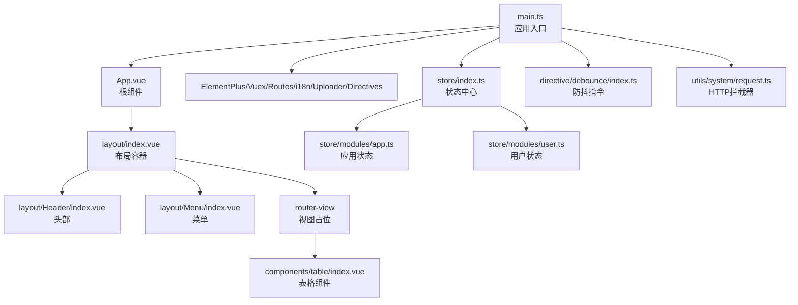
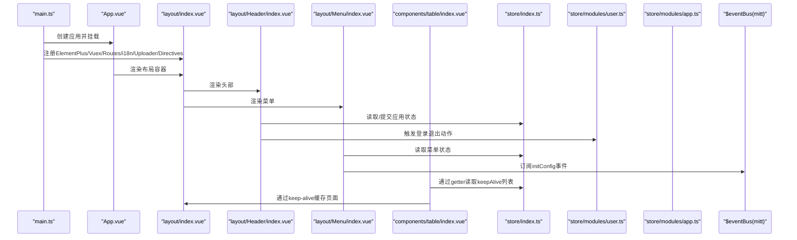
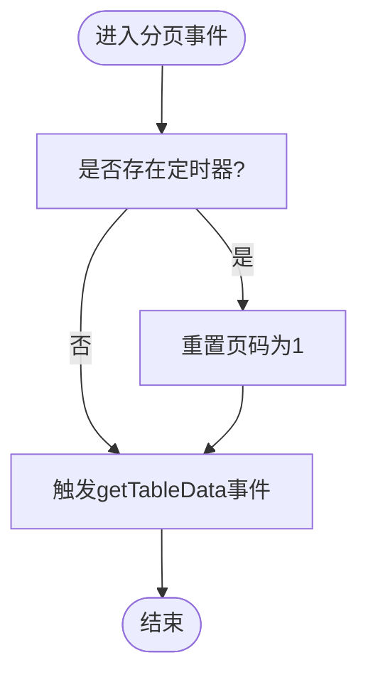
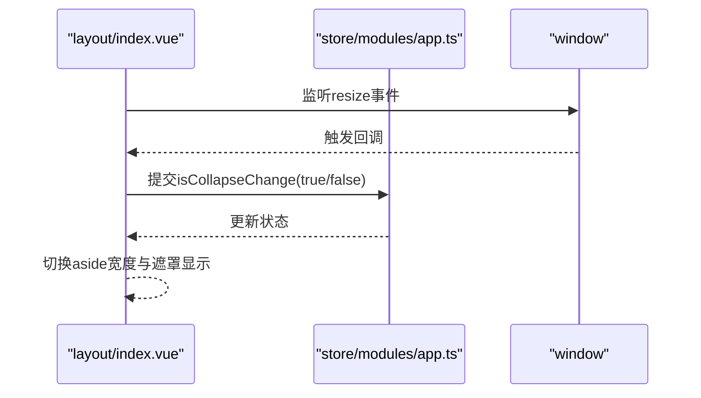
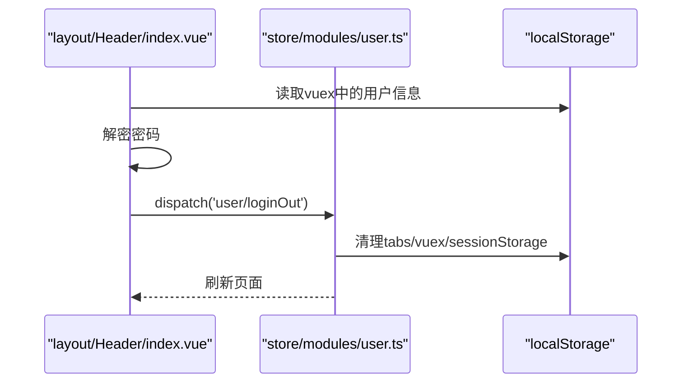
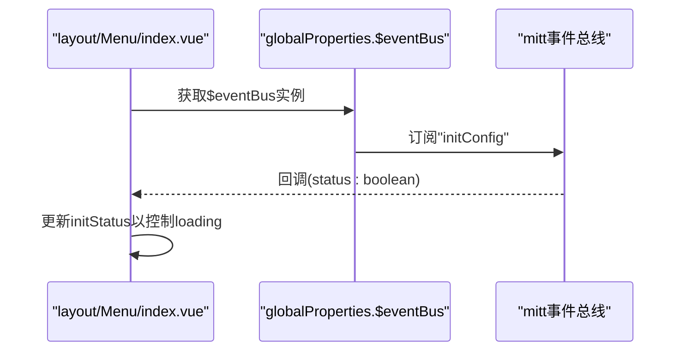
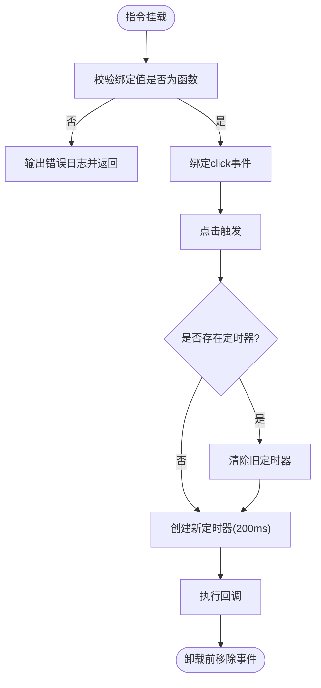
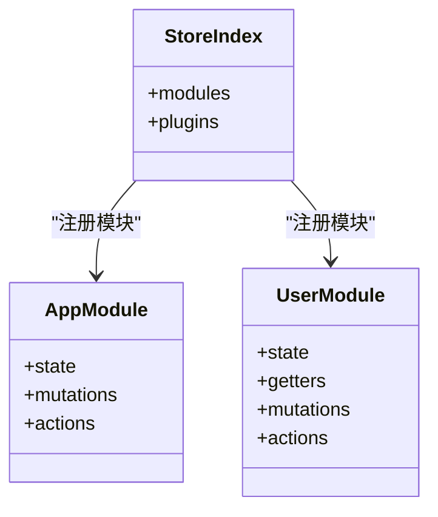
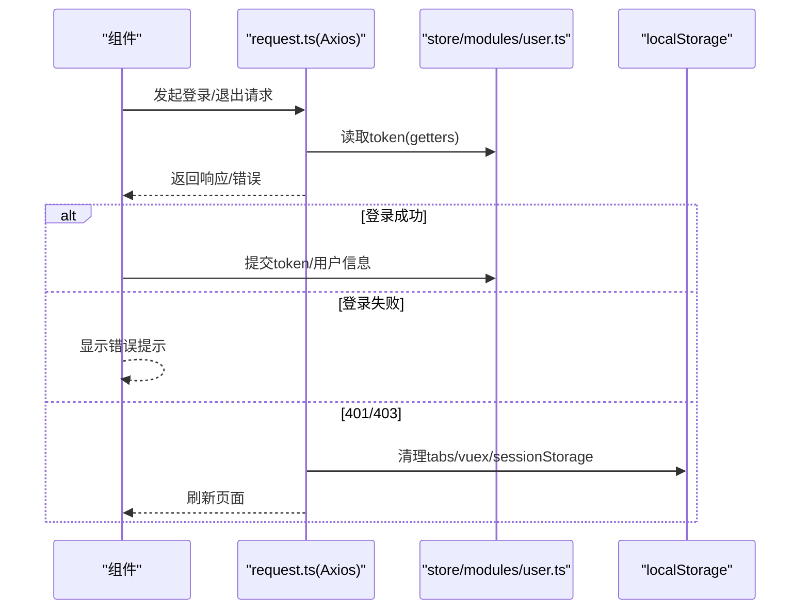
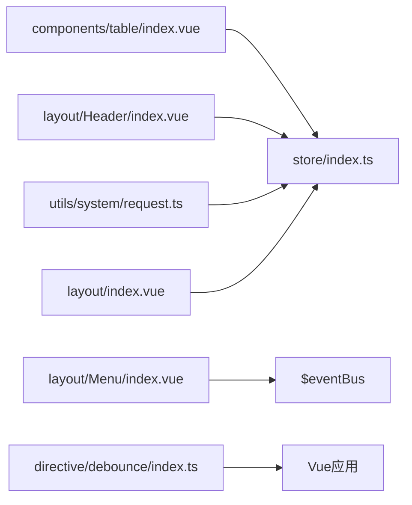

# 组件组合与通信

<cite>
**本文引用的文件**
- [App.vue](file://watcher-web/src/App.vue)
- [main.ts](file://watcher-web/src/main.ts)
- [layout/index.vue](file://watcher-web/src/layout/index.vue)
- [layout/Header/index.vue](file://watcher-web/src/layout/Header/index.vue)
- [layout/Menu/index.vue](file://watcher-web/src/layout/Menu/index.vue)
- [components/table/index.vue](file://watcher-web/src/components/table/index.vue)
- [components/table/type.ts](file://watcher-web/src/components/table/type.ts)
- [store/index.ts](file://watcher-web/src/store/index.ts)
- [store/modules/app.ts](file://watcher-web/src/store/modules/app.ts)
- [store/modules/user.ts](file://watcher-web/src/store/modules/user.ts)
- [directive/debounce/index.ts](file://watcher-web/src/directive/debounce/index.ts)
- [utils/system/request.ts](file://watcher-web/src/utils/system/request.ts)
</cite>

## 目录
1. [引言](#引言)
2. [项目结构](#项目结构)
3. [核心组件](#核心组件)
4. [架构总览](#架构总览)
5. [详细组件分析](#详细组件分析)
6. [依赖关系分析](#依赖关系分析)
7. [性能考量](#性能考量)
8. [故障排查指南](#故障排查指南)
9. [结论](#结论)
10. [附录](#附录)

## 引言
本指南围绕ShowTime前端（Vue 3）系统，聚焦“组件组合与通信”的主题，系统阐述Composition API在组件开发中的应用、响应式数据与生命周期管理、组件间通信方式（props、事件、provide/inject、全局状态）、以及解耦策略（接口抽象、依赖注入、事件总线）。同时给出测试与调试方法、最佳实践与常见问题解决方案，帮助开发者在复杂业务场景中构建高内聚、低耦合且易于维护的组件体系。

## 项目结构
- 应用入口与全局配置位于 watcher-web/src/main.ts，负责挂载应用、注册Element Plus、Vuex、路由、i18n、上传组件与自定义指令等。
- 布局容器 layout/index.vue 负责整体布局、侧边菜单、头部、面包屑、Tabs等区域的编排，并通过keep-alive实现页面级缓存。
- 头部 Header/index.vue 提供用户信息、下拉菜单、修改密码弹窗等交互；菜单 Menu/index.vue 展示动态路由菜单并与事件总线联动。
- 表格组件 components/table/index.vue 封装分页、选择、排序、keep-alive兼容等能力，作为通用数据展示基座。
- 状态管理 store/index.ts 动态加载模块，持久化插件统一处理本地/会话存储；app/user 模块分别管理界面状态与用户态。
- 自定义指令 directive/debounce/index.ts 实现点击防抖，减少重复请求或无效渲染。
- 网络层 utils/system/request.ts 统一处理Axios拦截器、鉴权头、错误提示与登出逻辑。

图表来源
- [main.ts:1-37](file://watcher-web/src/main.ts#L1-L37)
- [App.vue:1-39](file://watcher-web/src/App.vue#L1-L39)
- [layout/index.vue:1-158](file://watcher-web/src/layout/index.vue#L1-L158)
- [layout/Header/index.vue:1-213](file://watcher-web/src/layout/Header/index.vue#L1-L213)
- [layout/Menu/index.vue:1-132](file://watcher-web/src/layout/Menu/index.vue#L1-L132)
- [components/table/index.vue:1-133](file://watcher-web/src/components/table/index.vue#L1-L133)
- [store/index.ts:1-39](file://watcher-web/src/store/index.ts#L1-L39)
- [store/modules/app.ts:1-74](file://watcher-web/src/store/modules/app.ts#L1-L74)
- [store/modules/user.ts:1-76](file://watcher-web/src/store/modules/user.ts#L1-L76)
- [directive/debounce/index.ts:1-32](file://watcher-web/src/directive/debounce/index.ts#L1-L32)
- [utils/system/request.ts:1-81](file://watcher-web/src/utils/system/request.ts#L1-L81)

章节来源
- [main.ts:1-37](file://watcher-web/src/main.ts#L1-L37)
- [App.vue:1-39](file://watcher-web/src/App.vue#L1-L39)
- [layout/index.vue:1-158](file://watcher-web/src/layout/index.vue#L1-L158)

## 核心组件
- 响应式与Composition API
  - 在根组件 App.vue 中通过setup计算locale并传给Element Plus ConfigProvider，体现computed与响应式在顶层的应用。
  - 在布局 Header/index.vue 使用setup语法糖，结合useStore/useRouter/useRoute实现状态读取与路由跳转。
  - 在表格组件 components/table/index.vue 使用defineComponent + setup，集中管理props、emit、ref、onActivated/onMounted等生命周期。
- 生命周期管理
  - 表格组件在onActivated中触发doLayout以修复keep-alive下的布局错位问题。
  - 布局容器在onBeforeMount中绑定window.resize事件，实现响应式折叠。
- 组件间通信
  - props传递：表格组件暴露data、page、showSelection等props，供上层视图控制。
  - 事件发射：表格组件通过context.emit向父组件抛出分页与选择变更事件；菜单组件通过全局事件总线接收初始化状态。
  - provide/inject：未见显式provide/inject使用，但可通过globalProperties扩展或在子树中注入依赖。
  - 全局状态：Vuex模块化管理应用状态与用户态，组件通过useStore读写状态。
- 插槽与组合模式
  - 表格组件通过默认插槽承载列定义，形成“容器+内容”的组合模式，便于复用与扩展。
  - 布局容器通过router-view与keep-alive实现页面级缓存，属于“高阶容器”模式。

章节来源
- [App.vue:7-25](file://watcher-web/src/App.vue#L7-L25)
- [layout/Header/index.vue:64-132](file://watcher-web/src/layout/Header/index.vue#L64-L132)
- [components/table/index.vue:40-98](file://watcher-web/src/components/table/index.vue#L40-L98)
- [layout/index.vue:45-102](file://watcher-web/src/layout/index.vue#L45-L102)

## 架构总览
下图展示了从应用入口到各功能组件的调用链路与数据流，突出Composition API、Vuex与事件总线的协作关系。

图表来源
- [main.ts:26-36](file://watcher-web/src/main.ts#L26-L36)
- [App.vue:11-24](file://watcher-web/src/App.vue#L11-L24)
- [layout/index.vue:25-39](file://watcher-web/src/layout/index.vue#L25-L39)
- [layout/Header/index.vue:79-98](file://watcher-web/src/layout/Header/index.vue#L79-L98)
- [layout/Menu/index.vue:30-49](file://watcher-web/src/layout/Menu/index.vue#L30-L49)
- [components/table/index.vue:91-96](file://watcher-web/src/components/table/index.vue#L91-L96)
- [store/index.ts:32-38](file://watcher-web/src/store/index.ts#L32-L38)
- [store/modules/user.ts:33-66](file://watcher-web/src/store/modules/user.ts#L33-L66)
- [store/modules/app.ts:49-62](file://watcher-web/src/store/modules/app.ts#L49-L62)

## 详细组件分析

### 表格组件（components/table/index.vue）
- 设计要点
  - 通过$attrs透传属性，提升对第三方组件库的适配性。
  - 暴露分页、选择、序号、条纹与边框等开关，满足不同业务场景。
  - 通过context.emit向上抛出分页与选择变更事件，实现“容器-内容”解耦。
  - 在onActivated中调用doLayout，解决keep-alive导致的布局错位问题。
- 关键流程（分页切换）

图表来源
- [components/table/index.vue:64-82](file://watcher-web/src/components/table/index.vue#L64-L82)

章节来源
- [components/table/index.vue:1-133](file://watcher-web/src/components/table/index.vue#L1-L133)
- [components/table/type.ts:1-200](file://watcher-web/src/components/table/type.ts#L1-L200)

### 布局容器（layout/index.vue）
- 设计要点
  - 通过computed读取store中的折叠状态、全屏状态、Logo显示与Tabs显示等。
  - 在onBeforeMount中监听window.resize，动态调整侧边栏折叠状态。
  - 通过keep-alive与include实现页面级缓存，结合router-view按路径key切换。
- 交互序列（菜单折叠/展开）

图表来源
- [layout/index.vue:74-87](file://watcher-web/src/layout/index.vue#L74-L87)
- [layout/index.vue:90-92](file://watcher-web/src/layout/index.vue#L90-L92)
- [store/modules/app.ts:51-53](file://watcher-web/src/store/modules/app.ts#L51-L53)

章节来源
- [layout/index.vue:1-158](file://watcher-web/src/layout/index.vue#L1-L158)
- [store/modules/app.ts:14-74](file://watcher-web/src/store/modules/app.ts#L14-L74)

### 头部组件（layout/Header/index.vue）
- 设计要点
  - 通过useStore读取应用状态，控制菜单折叠。
  - 通过useRouter/useRoute进行路由操作与元信息读取。
  - 通过localStorage读取用户信息并解密密码，用于修改密码流程。
  - 触发用户模块的登录退出动作，清理本地存储并刷新页面。
- 交互序列（修改密码与登出）

图表来源
- [layout/Header/index.vue:104-131](file://watcher-web/src/layout/Header/index.vue#L104-L131)
- [store/modules/user.ts:57-66](file://watcher-web/src/store/modules/user.ts#L57-L66)

章节来源
- [layout/Header/index.vue:1-213](file://watcher-web/src/layout/Header/index.vue#L1-L213)
- [store/modules/user.ts:1-76](file://watcher-web/src/store/modules/user.ts#L1-L76)

### 菜单组件（layout/Menu/index.vue）
- 设计要点
  - 通过globalProperties.$eventBus订阅initConfig事件，实现跨组件通信。
  - 读取store中的折叠与唯一展开策略，动态渲染菜单项。
  - 结合路由选项routes，计算当前激活菜单项。
- 通信序列（事件总线）

图表来源
- [layout/Menu/index.vue:30-49](file://watcher-web/src/layout/Menu/index.vue#L30-L49)
- [main.ts:27](file://watcher-web/src/main.ts#L27)

章节来源
- [layout/Menu/index.vue:1-132](file://watcher-web/src/layout/Menu/index.vue#L1-L132)
- [main.ts:18-27](file://watcher-web/src/main.ts#L18-L27)

### 自定义指令（directive/debounce/index.ts）
- 设计要点
  - 指令参数必须为函数，否则报错。
  - 在mounted阶段绑定click事件，使用setTimeout实现200ms防抖。
  - 在beforeUnmount阶段移除事件监听，避免内存泄漏。
- 流程图

图表来源
- [directive/debounce/index.ts:11-29](file://watcher-web/src/directive/debounce/index.ts#L11-L29)

章节来源
- [directive/debounce/index.ts:1-32](file://watcher-web/src/directive/debounce/index.ts#L1-L32)

### 状态管理（store/index.ts、modules/app.ts、modules/user.ts）
- 设计要点
  - 动态模块加载：通过import.meta.globEager批量导入模块，自动注册命名空间。
  - 持久化插件：统一处理local/session存储，支持模块白名单。
  - 模块职责清晰：app管理界面状态，user管理用户态与登录流程。
- 类图（简化）

图表来源
- [store/index.ts:15-38](file://watcher-web/src/store/index.ts#L15-L38)
- [store/modules/app.ts:30-73](file://watcher-web/src/store/modules/app.ts#L30-L73)
- [store/modules/user.ts:10-75](file://watcher-web/src/store/modules/user.ts#L10-L75)

章节来源
- [store/index.ts:1-39](file://watcher-web/src/store/index.ts#L1-L39)
- [store/modules/app.ts:1-74](file://watcher-web/src/store/modules/app.ts#L1-L74)
- [store/modules/user.ts:1-76](file://watcher-web/src/store/modules/user.ts#L1-L76)

### 网络层（utils/system/request.ts）
- 设计要点
  - 请求拦截：根据method对delete请求序列化params；从Vuex读取token并注入headers。
  - 响应拦截：统一校验state字段；失败时统一提示并处理401/403登出。
  - 错误处理：构造消息并弹窗提示，必要时清理本地存储并刷新。
- 序列图（登录退出流程）

图表来源
- [utils/system/request.ts:12-48](file://watcher-web/src/utils/system/request.ts#L12-L48)
- [store/modules/user.ts:33-66](file://watcher-web/src/store/modules/user.ts#L33-L66)

章节来源
- [utils/system/request.ts:1-81](file://watcher-web/src/utils/system/request.ts#L1-L81)
- [store/modules/user.ts:1-76](file://watcher-web/src/store/modules/user.ts#L1-L76)

## 依赖关系分析
- 组件耦合与内聚
  - 表格组件通过props与emit与上层视图解耦；内部封装分页与选择逻辑，提升内聚性。
  - 布局容器通过computed与store解耦，仅依赖状态读取与提交，降低对具体实现的耦合。
  - 菜单组件通过事件总线与外部组件解耦，避免直接依赖。
- 外部依赖与集成点
  - Element Plus提供UI基础能力；VueUse提供事件监听工具。
  - Axios/Axios拦截器统一网络层；mitt作为轻量事件总线。
  - Vuex模块化管理全局状态，持久化插件统一处理本地存储。
- 循环依赖风险
  - 当前结构未发现明显循环依赖；若后续引入provide/inject，请确保注入方向单一。

图表来源
- [components/table/index.vue:91-96](file://watcher-web/src/components/table/index.vue#L91-L96)
- [layout/Header/index.vue:79-98](file://watcher-web/src/layout/Header/index.vue#L79-L98)
- [layout/Menu/index.vue:30-49](file://watcher-web/src/layout/Menu/index.vue#L30-L49)
- [utils/system/request.ts:12-22](file://watcher-web/src/utils/system/request.ts#L12-L22)
- [directive/debounce/index.ts:11-29](file://watcher-web/src/directive/debounce/index.ts#L11-L29)
- [layout/index.vue:63-72](file://watcher-web/src/layout/index.vue#L63-L72)

章节来源
- [components/table/index.vue:40-98](file://watcher-web/src/components/table/index.vue#L40-L98)
- [layout/Header/index.vue:64-101](file://watcher-web/src/layout/Header/index.vue#L64-L101)
- [layout/Menu/index.vue:29-57](file://watcher-web/src/layout/Menu/index.vue#L29-L57)
- [utils/system/request.ts:12-48](file://watcher-web/src/utils/system/request.ts#L12-L48)
- [directive/debounce/index.ts:10-30](file://watcher-web/src/directive/debounce/index.ts#L10-L30)
- [layout/index.vue:63-101](file://watcher-web/src/layout/index.vue#L63-L101)

## 性能考量
- 组件缓存
  - 利用keep-alive与include缓存页面，减少重复渲染与请求开销；注意在onActivated中触发布局重算，避免视觉错位。
- 状态持久化
  - 持久化插件统一处理本地/会话存储，避免频繁登录与重复请求；合理划分local/session模块，降低存储压力。
- 指令优化
  - 防抖指令限制高频点击，减少无效请求；在组件卸载时及时清理事件监听，避免内存泄漏。
- 网络层节流
  - 在请求拦截器中统一注入token与参数序列化，减少错误请求；在响应拦截器中统一错误处理，避免重复提示。

## 故障排查指南
- 表格分页抖动或闪烁
  - 现象：快速切换页码或尺寸时出现闪烁。
  - 排查：确认是否正确使用定时器去抖；检查父组件是否在短时间内多次触发getTableData。
  - 参考路径：[components/table/index.vue:64-82](file://watcher-web/src/components/table/index.vue#L64-L82)
- keep-alive布局错位
  - 现象：从其他页面返回时表格布局不正确。
  - 排查：确认onActivated中是否调用doLayout；检查父容器是否正确包裹keep-alive。
  - 参考路径：[components/table/index.vue:87-90](file://watcher-web/src/components/table/index.vue#L87-L90)
- 菜单初始化卡顿
  - 现象：页面首次加载菜单显示loading。
  - 排查：确认事件总线是否正确发送initConfig事件；检查订阅与取消订阅时机。
  - 参考路径：[layout/Menu/index.vue:30-49](file://watcher-web/src/layout/Menu/index.vue#L30-L49)
- 登录后401/403跳转
  - 现象：接口返回401/403后自动清空本地存储并刷新。
  - 排查：确认响应拦截器是否正确识别状态码；检查本地存储清理逻辑。
  - 参考路径：[utils/system/request.ts:50-76](file://watcher-web/src/utils/system/request.ts#L50-L76)
- 防抖无效或内存泄漏
  - 现象：点击无响应或卸载后仍触发回调。
  - 排查：确认绑定值为函数；检查beforeUnmount是否移除事件监听。
  - 参考路径：[directive/debounce/index.ts:11-29](file://watcher-web/src/directive/debounce/index.ts#L11-L29)

章节来源
- [components/table/index.vue:64-90](file://watcher-web/src/components/table/index.vue#L64-L90)
- [layout/Menu/index.vue:30-49](file://watcher-web/src/layout/Menu/index.vue#L30-L49)
- [utils/system/request.ts:50-76](file://watcher-web/src/utils/system/request.ts#L50-L76)
- [directive/debounce/index.ts:11-29](file://watcher-web/src/directive/debounce/index.ts#L11-L29)

## 结论
ShowTime前端通过Composition API、Vuex模块化与事件总线实现了清晰的组件组合与通信机制。表格组件、布局容器与菜单组件分别承担“数据容器”“页面骨架”“导航入口”的职责，配合防抖指令与网络拦截器，形成高内聚、低耦合的前端架构。建议在后续迭代中进一步引入provide/inject与接口抽象，以增强跨层级通信与可测试性。

## 附录
- 组件开发最佳实践
  - 使用defineComponent + setup统一风格，明确props与emits。
  - 合理拆分容器与内容组件，通过插槽与props解耦。
  - 在keep-alive场景中关注onActivated/onDeactivated生命周期。
  - 使用Vuex模块化管理状态，配合持久化插件统一处理存储。
  - 通过mitt或事件总线实现跨层级通信，避免深层props传递。
- 常见问题与解决方案
  - 分页抖动：增加定时器去抖与页码重置逻辑。
  - 布局错位：在onActivated中触发布局重算。
  - 登录失效：在响应拦截器中统一处理401/403并清理本地存储。
  - 性能瓶颈：利用keep-alive与持久化减少重复渲染与请求。
- 测试与调试方法
  - 单元测试：针对组件的setup逻辑与事件回调编写测试用例。
  - 集成测试：模拟路由切换、菜单事件与表格分页交互。
  - 性能监控：结合浏览器性能面板与日志埋点定位热点。