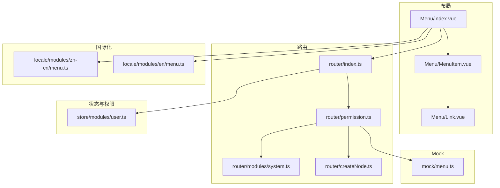
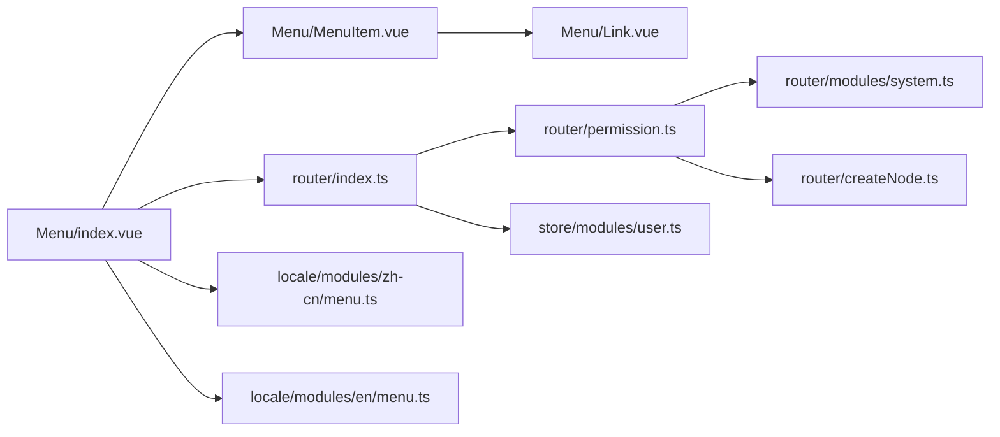
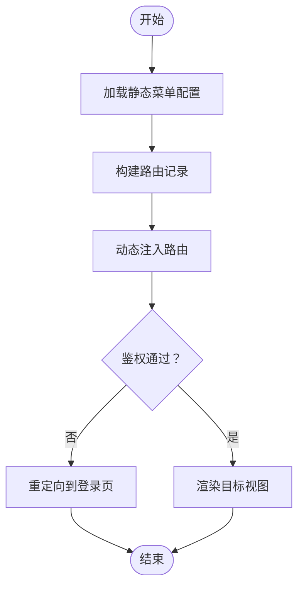

# 菜单组件开发

<cite>
**本文引用的文件**
- [watcher-web/src/layout/Menu/index.vue](file://watcher-web/src/layout/Menu/index.vue)
- [watcher-web/src/layout/Menu/MenuItem.vue](file://watcher-web/src/layout/Menu/MenuItem.vue)
- [watcher-web/src/layout/Menu/Link.vue](file://watcher-web/src/layout/Menu/Link.vue)
- [watcher-web/src/layout/Menu/menu.ts](file://watcher-web/src/layout/Menu/menu.ts)
- [watcher-web/src/router/index.ts](file://watcher-web/src/router/index.ts)
- [watcher-web/src/router/permission.ts](file://watcher-web/src/router/permission.ts)
- [watcher-web/src/router/modules/system.ts](file://watcher-web/src/router/modules/system.ts)
- [watcher-web/src/router/createNode.ts](file://watcher-web/src/router/createNode.ts)
- [watcher-web/src/store/modules/user.ts](file://watcher-web/src/store/modules/user.ts)
- [watcher-web/src/locale/modules/zh-cn/menu.ts](file://watcher-web/src/locale/modules/zh-cn/menu.ts)
- [watcher-web/src/locale/modules/en/menu.ts](file://watcher-web/src/locale/modules/en/menu.ts)
- [watcher-web/mock/menu.ts](file://watcher-web/mock/menu.ts)
- [watcher-web/src/components/menu/index.vue](file://watcher-web/src/components/menu/index.vue)
</cite>

## 目录
1. [简介](#简介)
2. [项目结构](#项目结构)
3. [核心组件](#核心组件)
4. [架构总览](#架构总览)
5. [详细组件分析](#详细组件分析)
6. [依赖分析](#依赖分析)
7. [性能考虑](#性能考虑)
8. [故障排查指南](#故障排查指南)
9. [结论](#结论)
10. [附录](#附录)

## 简介
本指南围绕 ShowTime 系统的菜单组件，系统性阐述其架构设计、路由集成、权限控制与动态菜单生成机制；详解菜单数据结构（菜单项配置、层级关系、路由映射）、交互行为（展开/收起、选中状态、点击跳转）以及样式定制（主题适配、图标配置、布局调整）。同时提供权限控制实现方案（角色权限与动态权限验证）、完整配置示例与扩展开发建议，帮助开发者快速理解并高效扩展菜单功能。

## 项目结构
菜单组件位于前端工程 watcher-web 的布局模块中，采用“布局-菜单-子项-链接”的分层组织方式，并通过路由模块与权限模块协同工作，形成从静态菜单到动态路由的闭环。



图表来源
- [watcher-web/src/layout/Menu/index.vue:1-132](file://watcher-web/src/layout/Menu/index.vue#L1-L132)
- [watcher-web/src/layout/Menu/MenuItem.vue:1-99](file://watcher-web/src/layout/Menu/MenuItem.vue#L1-L99)
- [watcher-web/src/layout/Menu/Link.vue:1-41](file://watcher-web/src/layout/Menu/Link.vue#L1-L41)
- [watcher-web/src/router/index.ts:1-73](file://watcher-web/src/router/index.ts#L1-L73)
- [watcher-web/src/router/permission.ts:1-60](file://watcher-web/src/router/permission.ts#L1-L60)
- [watcher-web/src/router/modules/system.ts:1-49](file://watcher-web/src/router/modules/system.ts#L1-L49)
- [watcher-web/src/router/createNode.ts:1-51](file://watcher-web/src/router/createNode.ts#L1-L51)
- [watcher-web/src/store/modules/user.ts:1-76](file://watcher-web/src/store/modules/user.ts#L1-L76)
- [watcher-web/src/locale/modules/zh-cn/menu.ts:1-30](file://watcher-web/src/locale/modules/zh-cn/menu.ts#L1-L30)
- [watcher-web/src/locale/modules/en/menu.ts:1-24](file://watcher-web/src/locale/modules/en/menu.ts#L1-L24)
- [watcher-web/mock/menu.ts:1-29](file://watcher-web/mock/menu.ts#L1-L29)

章节来源
- [watcher-web/src/layout/Menu/index.vue:1-132](file://watcher-web/src/layout/Menu/index.vue#L1-L132)
- [watcher-web/src/layout/Menu/MenuItem.vue:1-99](file://watcher-web/src/layout/Menu/MenuItem.vue#L1-L99)
- [watcher-web/src/layout/Menu/Link.vue:1-41](file://watcher-web/src/layout/Menu/Link.vue#L1-L41)
- [watcher-web/src/router/index.ts:1-73](file://watcher-web/src/router/index.ts#L1-L73)
- [watcher-web/src/router/permission.ts:1-60](file://watcher-web/src/router/permission.ts#L1-L60)
- [watcher-web/src/router/modules/system.ts:1-49](file://watcher-web/src/router/modules/system.ts#L1-L49)
- [watcher-web/src/router/createNode.ts:1-51](file://watcher-web/src/router/createNode.ts#L1-L51)
- [watcher-web/src/store/modules/user.ts:1-76](file://watcher-web/src/store/modules/user.ts#L1-L76)
- [watcher-web/src/locale/modules/zh-cn/menu.ts:1-30](file://watcher-web/src/locale/modules/zh-cn/menu.ts#L1-L30)
- [watcher-web/src/locale/modules/en/menu.ts:1-24](file://watcher-web/src/locale/modules/en/menu.ts#L1-L24)
- [watcher-web/mock/menu.ts:1-29](file://watcher-web/mock/menu.ts#L1-L29)

## 核心组件
- 布局菜单容器：负责渲染菜单树、绑定折叠状态、唯一展开策略、活动项高亮与加载态。
- 菜单项渲染器：根据菜单层级与配置决定渲染为子菜单或菜单项，并处理路径拼接与国际化标题。
- 自定义链接组件：封装 router-link，支持移动端点击后自动折叠侧边栏。
- 菜单数据源：静态菜单配置（含国际化键、图标、重定向、隐藏等元信息）。
- 路由与权限：统一路由入口、白名单与鉴权守卫；动态路由注入与权限路由集合。
- 国际化与主题：菜单标题通过 i18n 解析；样式通过 CSS 变量实现主题适配。

章节来源
- [watcher-web/src/layout/Menu/index.vue:1-132](file://watcher-web/src/layout/Menu/index.vue#L1-L132)
- [watcher-web/src/layout/Menu/MenuItem.vue:1-99](file://watcher-web/src/layout/Menu/MenuItem.vue#L1-L99)
- [watcher-web/src/layout/Menu/Link.vue:1-41](file://watcher-web/src/layout/Menu/Link.vue#L1-L41)
- [watcher-web/src/layout/Menu/menu.ts:1-84](file://watcher-web/src/layout/Menu/menu.ts#L1-L84)
- [watcher-web/src/router/index.ts:1-73](file://watcher-web/src/router/index.ts#L1-L73)
- [watcher-web/src/router/permission.ts:1-60](file://watcher-web/src/router/permission.ts#L1-L60)
- [watcher-web/src/locale/modules/zh-cn/menu.ts:1-30](file://watcher-web/src/locale/modules/zh-cn/menu.ts#L1-L30)
- [watcher-web/src/locale/modules/en/menu.ts:1-24](file://watcher-web/src/locale/modules/en/menu.ts#L1-L24)

## 架构总览
菜单组件与路由、权限、国际化、主题系统协同工作，形成“静态菜单配置 → 动态路由注入 → 权限校验 → 视图渲染”的完整链路。

```mermaid
sequenceDiagram
participant User as "用户"
participant Menu as "Menu/index.vue"
participant Item as "MenuItem.vue"
participant Link as "Link.vue"
participant Router as "router/index.ts"
participant Perm as "router/permission.ts"
participant Store as "store/modules/user.ts"
User->>Menu : 打开页面/切换菜单
Menu->>Item : 渲染菜单树
Item->>Link : 包装 router-link
Link->>Store : 读取 isCollapse 状态
Link->>Router : 导航到目标路由
Router->>Store : 校验 token/白名单
alt 未登录且不在白名单
Router-->>User : 重定向到登录页
else 已登录或在白名单
Router-->>User : 放行并渲染视图
end
Note over Menu,Router : 动态路由通过权限模块注入
```

图表来源
- [watcher-web/src/layout/Menu/index.vue:1-132](file://watcher-web/src/layout/Menu/index.vue#L1-L132)
- [watcher-web/src/layout/Menu/MenuItem.vue:1-99](file://watcher-web/src/layout/Menu/MenuItem.vue#L1-L99)
- [watcher-web/src/layout/Menu/Link.vue:1-41](file://watcher-web/src/layout/Menu/Link.vue#L1-L41)
- [watcher-web/src/router/index.ts:1-73](file://watcher-web/src/router/index.ts#L1-L73)
- [watcher-web/src/router/permission.ts:1-60](file://watcher-web/src/router/permission.ts#L1-L60)
- [watcher-web/src/store/modules/user.ts:1-76](file://watcher-web/src/store/modules/user.ts#L1-L76)

## 详细组件分析

### 布局菜单容器（Menu/index.vue）
- 职责
  - 渲染 el-menu 容器，绑定背景色、文字色、激活色等 CSS 变量。
  - 读取 store 中的 isCollapse 与 expandOneMenu 控制折叠与唯一展开。
  - 计算当前活动菜单项（优先使用 meta.activeMenu，否则使用当前路由 path）。
  - 接收 initConfig 事件以控制加载态。
  - 通过本地 menu.ts 提供静态菜单数据。
- 关键点
  - 活动高亮：.is-active 与 hover 样式通过 CSS 变量与深选择器统一管理。
  - 折叠样式：.collapse 类名切换影响菜单宽度与间距。
  - 唯一展开：unique-opened 与 store.expandOneMenu 协同控制。
- 交互
  - 点击菜单项触发 Link.vue 的点击逻辑，移动端自动折叠侧边栏。

章节来源
- [watcher-web/src/layout/Menu/index.vue:1-132](file://watcher-web/src/layout/Menu/index.vue#L1-L132)
- [watcher-web/src/layout/Menu/menu.ts:1-84](file://watcher-web/src/layout/Menu/menu.ts#L1-L84)
- [watcher-web/src/store/modules/app.ts](file://watcher-web/src/store/modules/app.ts)

### 菜单项渲染器（Menu/MenuItem.vue）
- 职责
  - 根据 children 数量与 alwayShow 决定渲染模式（0：无子菜单；1：单子菜单；2：双层子菜单）。
  - 处理路径拼接：支持相对路径与绝对路径组合，自动拼接 basePath。
  - 渲染图标与国际化标题，支持父子级图标覆盖。
- 关键点
  - 渲染分支：v-if/v-else 结构清晰区分三类场景。
  - 路径解析：showMenuType 与 pathResolve 计算属性保证路径正确性。
- 交互
  - 子菜单展开/收起由 Element Plus 控件接管，菜单项点击交由 Link.vue 处理。

章节来源
- [watcher-web/src/layout/Menu/MenuItem.vue:1-99](file://watcher-web/src/layout/Menu/MenuItem.vue#L1-L99)

### 自定义链接组件（Menu/Link.vue）
- 职责
  - 封装 router-link，提供统一的点击事件处理。
  - 在小屏设备上自动折叠侧边栏（当 isCollapse 为 false 时）。
- 关键点
  - linkProps 动态返回 to 属性，确保兼容不同路由目标。
  - hideMenu 在点击时提交 app/isCollapseChange(true)。

章节来源
- [watcher-web/src/layout/Menu/Link.vue:1-41](file://watcher-web/src/layout/Menu/Link.vue#L1-L41)
- [watcher-web/src/store/modules/app.ts](file://watcher-web/src/store/modules/app.ts)

### 菜单数据结构（Menu/menu.ts）
- 菜单项字段
  - path：路由路径（支持相对/绝对）。
  - redirect：重定向目标。
  - meta：包含 title（国际化键）、icon（图标类名）、hideClose 等。
  - hideMenu：是否在菜单中隐藏。
  - children：子菜单数组，支持多级嵌套。
- 层级关系
  - 一级菜单：如 /agent、/tenant、/resource、/net。
  - 二级菜单：如 /net/config、/net/router。
  - 三级菜单：如 /net/config/list、/net/router/list。
- 路由映射
  - 菜单中的 path 与路由模块中的 path 对应，最终通过 router.addRoute 注入。
  - createNameComponent 用于命名组件以便 keep-alive 与过渡动画。

章节来源
- [watcher-web/src/layout/Menu/menu.ts:1-84](file://watcher-web/src/layout/Menu/menu.ts#L1-L84)
- [watcher-web/src/router/createNode.ts:1-51](file://watcher-web/src/router/createNode.ts#L1-L51)

### 路由与权限（router/index.ts、router/permission.ts、router/modules/system.ts）
- 路由入口
  - 使用 reactive 包裹 modules，使菜单与路由实时联动。
  - beforeEach 进行鉴权：已登录放行；白名单直接放行；否则重定向登录。
  - afterEach 处理 keep-alive 缓存与进度条。
- 动态权限
  - permission.ts 定义 asyncRoutes（按模块拆分），getAuthRoutes 在登录后调用 addRoutes 将其注入。
  - 支持后端菜单树比对生成新菜单树（注释中已给出思路）。
- 系统路由
  - system.ts 提供系统级路由（404、401、403、重定向等），并设置 hideMenu 与 hideTabs。

章节来源
- [watcher-web/src/router/index.ts:1-73](file://watcher-web/src/router/index.ts#L1-L73)
- [watcher-web/src/router/permission.ts:1-60](file://watcher-web/src/router/permission.ts#L1-L60)
- [watcher-web/src/router/modules/system.ts:1-49](file://watcher-web/src/router/modules/system.ts#L1-L49)
- [watcher-web/src/store/modules/user.ts:1-76](file://watcher-web/src/store/modules/user.ts#L1-L76)

### 国际化与图标
- 国际化
  - 菜单标题通过 $t(meta.title) 解析，支持中英文键值。
  - i18n 键值来源于 locale/modules/zh-cn/menu.ts 与 locale/modules/en/menu.ts。
- 图标
  - 通过 meta.icon 设置图标类名，MenuItem.vue 在标题前渲染图标。
  - 支持父子级图标覆盖，子项优先。

章节来源
- [watcher-web/src/locale/modules/zh-cn/menu.ts:1-30](file://watcher-web/src/locale/modules/zh-cn/menu.ts#L1-L30)
- [watcher-web/src/locale/modules/en/menu.ts:1-24](file://watcher-web/src/locale/modules/en/menu.ts#L1-L24)
- [watcher-web/src/layout/Menu/MenuItem.vue:1-99](file://watcher-web/src/layout/Menu/MenuItem.vue#L1-L99)

### 样式与主题适配
- 主题变量
  - 背景色：--system-menu-background
  - 文字色：--system-menu-text-color
  - 子菜单背景：--system-menu-children-background
  - 悬停背景：--system-menu-hover-background
  - 激活色：--system-primary-color
- 深选择器
  - :deep() 内部覆盖 Element Plus 菜单项与子菜单的默认样式，确保主题一致。
- 响应式
  - 折叠状态下通过 .collapse 类名调整布局，适配移动端体验。

章节来源
- [watcher-web/src/layout/Menu/index.vue:62-131](file://watcher-web/src/layout/Menu/index.vue#L62-L131)

### 交互行为
- 展开/收起
  - 通过 store.app.isCollapse 控制，MenuItem.vue 与 Link.vue 协作实现移动端自动折叠。
- 选中状态
  - activeMenu 计算属性优先使用 meta.activeMenu，否则使用当前路由 path。
  - .is-active 与 hover 样式统一高亮。
- 点击跳转
  - Link.vue 在点击时根据屏幕宽度与 isCollapse 状态决定是否折叠菜单。

章节来源
- [watcher-web/src/layout/Menu/index.vue:36-44](file://watcher-web/src/layout/Menu/index.vue#L36-L44)
- [watcher-web/src/layout/Menu/Link.vue:26-30](file://watcher-web/src/layout/Menu/Link.vue#L26-L30)

### 权限控制与动态菜单
- 角色权限
  - 通过 store.state.user.token 判断登录状态；白名单放行。
  - getAuthRoutes 在登录成功后调用，将 asyncRoutes 注入路由系统。
- 动态权限验证
  - permission.ts 提供 addRoutes 与 getAuthRoutes，支持后端菜单树比对生成新菜单树（注释中给出思路）。
  - mock/menu.ts 提供模拟接口，便于前端联调与演示。

章节来源
- [watcher-web/src/router/index.ts:36-52](file://watcher-web/src/router/index.ts#L36-L52)
- [watcher-web/src/router/permission.ts:42-59](file://watcher-web/src/router/permission.ts#L42-L59)
- [watcher-web/mock/menu.ts:1-29](file://watcher-web/mock/menu.ts#L1-L29)

## 依赖分析
菜单组件与路由、权限、国际化、主题之间存在明确的依赖关系，耦合度低、职责清晰。



图表来源
- [watcher-web/src/layout/Menu/index.vue:1-132](file://watcher-web/src/layout/Menu/index.vue#L1-L132)
- [watcher-web/src/layout/Menu/MenuItem.vue:1-99](file://watcher-web/src/layout/Menu/MenuItem.vue#L1-L99)
- [watcher-web/src/layout/Menu/Link.vue:1-41](file://watcher-web/src/layout/Menu/Link.vue#L1-L41)
- [watcher-web/src/router/index.ts:1-73](file://watcher-web/src/router/index.ts#L1-L73)
- [watcher-web/src/router/permission.ts:1-60](file://watcher-web/src/router/permission.ts#L1-L60)
- [watcher-web/src/router/modules/system.ts:1-49](file://watcher-web/src/router/modules/system.ts#L1-L49)
- [watcher-web/src/router/createNode.ts:1-51](file://watcher-web/src/router/createNode.ts#L1-L51)
- [watcher-web/src/store/modules/user.ts:1-76](file://watcher-web/src/store/modules/user.ts#L1-L76)
- [watcher-web/src/locale/modules/zh-cn/menu.ts:1-30](file://watcher-web/src/locale/modules/zh-cn/menu.ts#L1-L30)
- [watcher-web/src/locale/modules/en/menu.ts:1-24](file://watcher-web/src/locale/modules/en/menu.ts#L1-L24)

## 性能考虑
- 路由懒加载与命名组件
  - createNameComponent 为每个异步组件生成唯一 name，配合 keep-alive 实现缓存复用，减少重复渲染。
- 动态路由注入
  - 仅在登录后注入一次 asyncRoutes，避免重复 addRoute 带来的性能损耗。
- 菜单渲染优化
  - 通过 CSS 变量与深选择器集中管理样式，减少重复计算与 DOM 修改。
- 移动端交互
  - Link.vue 在小屏点击后自动折叠，降低布局复杂度，提升首屏渲染效率。

章节来源
- [watcher-web/src/router/createNode.ts:8-50](file://watcher-web/src/router/createNode.ts#L8-L50)
- [watcher-web/src/router/permission.ts:42-49](file://watcher-web/src/router/permission.ts#L42-L49)
- [watcher-web/src/layout/Menu/Link.vue:26-30](file://watcher-web/src/layout/Menu/Link.vue#L26-L30)

## 故障排查指南
- 菜单不显示
  - 检查菜单项是否设置 hideMenu=false，以及 meta.title 是否为有效的国际化键。
- 路由无法跳转
  - 确认菜单 path 与路由模块 path 一致；检查 createNameComponent 是否正确包裹组件。
- 活动项高亮异常
  - 若需强制指定活动项，可在目标路由 meta.activeMenu 中设置对应 path。
- 权限导致页面空白
  - 检查 token 是否存在；确认白名单是否包含当前路由；确认 getAuthRoutes 是否在登录后被调用。
- 移动端点击不折叠
  - 检查 isCollapse 状态与 Link.vue 的点击逻辑；确认小屏宽度阈值设置。

章节来源
- [watcher-web/src/layout/Menu/menu.ts:1-84](file://watcher-web/src/layout/Menu/menu.ts#L1-L84)
- [watcher-web/src/layout/Menu/index.vue:36-44](file://watcher-web/src/layout/Menu/index.vue#L36-L44)
- [watcher-web/src/router/index.ts:36-52](file://watcher-web/src/router/index.ts#L36-L52)
- [watcher-web/src/router/permission.ts:54-59](file://watcher-web/src/router/permission.ts#L54-L59)
- [watcher-web/src/layout/Menu/Link.vue:26-30](file://watcher-web/src/layout/Menu/Link.vue#L26-L30)

## 结论
ShowTime 菜单组件通过“静态菜单配置 + 动态路由注入 + 权限控制 + 国际化 + 主题适配”的完整体系，实现了灵活、可扩展、易维护的导航能力。开发者可基于现有结构快速扩展菜单层级、接入后端权限、定制样式主题，并保持良好的用户体验与性能表现。

## 附录

### 菜单数据结构定义
- 字段说明
  - path：菜单路径（支持相对/绝对）。
  - redirect：重定向目标。
  - meta.title：国际化键。
  - meta.icon：图标类名。
  - meta.hideClose：是否隐藏关闭按钮（通常用于固定页面）。
  - hideMenu：是否在菜单中隐藏。
  - children：子菜单数组，支持多级嵌套。
- 示例参考
  - 一级菜单：/agent、/tenant、/resource、/net。
  - 二级菜单：/net/config、/net/router。
  - 三级菜单：/net/config/list、/net/router/list。

章节来源
- [watcher-web/src/layout/Menu/menu.ts:3-81](file://watcher-web/src/layout/Menu/menu.ts#L3-L81)

### 路由与菜单映射流程


图表来源
- [watcher-web/src/layout/Menu/menu.ts:1-84](file://watcher-web/src/layout/Menu/menu.ts#L1-L84)
- [watcher-web/src/router/permission.ts:26-49](file://watcher-web/src/router/permission.ts#L26-L49)
- [watcher-web/src/router/index.ts:36-52](file://watcher-web/src/router/index.ts#L36-L52)

### 权限控制实现要点
- 前端权限
  - 使用 token 判断登录状态；白名单直接放行；否则重定向登录。
- 后端权限
  - 在 getAuthRoutes 中将后端菜单树与 asyncRoutes 对比，生成新的菜单树后再注入。
- 模拟接口
  - mock/menu.ts 提供 /mock/menu/list 接口，返回菜单树，便于联调。

章节来源
- [watcher-web/src/router/index.ts:36-52](file://watcher-web/src/router/index.ts#L36-L52)
- [watcher-web/src/router/permission.ts:38-49](file://watcher-web/src/router/permission.ts#L38-L49)
- [watcher-web/mock/menu.ts:1-29](file://watcher-web/mock/menu.ts#L1-L29)

### 样式定制清单
- 主题变量
  - --system-menu-background：菜单背景色。
  - --system-menu-text-color：菜单文字颜色。
  - --system-menu-children-background：子菜单背景色。
  - --system-menu-hover-background：悬停背景色。
  - --system-primary-color：激活主色。
- 深选择器
  - 覆盖 .el-menu-item、.el-sub-menu__title、.is-active、hover 等状态样式。
- 响应式
  - .collapse 类名控制折叠状态下的布局与间距。

章节来源
- [watcher-web/src/layout/Menu/index.vue:62-131](file://watcher-web/src/layout/Menu/index.vue#L62-L131)

### 扩展开发指南
- 新增菜单项
  - 在 Menu/menu.ts 中添加新项，设置 path、meta.title、meta.icon、children 等。
- 新增路由模块
  - 在 router/modules 下新建模块文件，导出路由记录；在 permission.ts 中引入并合并到 asyncRoutes。
- 国际化
  - 在 locale/modules/zh-cn/menu.ts 与 locale/modules/en/menu.ts 中添加对应键值。
- 动态权限
  - 在登录成功后调用 getAuthRoutes；若启用后端权限，先请求后端菜单树并与 asyncRoutes 对比生成新树。
- 样式主题
  - 通过 CSS 变量统一管理主题色；必要时在 index.vue 的 :deep() 中补充覆盖规则。

章节来源
- [watcher-web/src/layout/Menu/menu.ts:1-84](file://watcher-web/src/layout/Menu/menu.ts#L1-L84)
- [watcher-web/src/router/permission.ts:17-33](file://watcher-web/src/router/permission.ts#L17-L33)
- [watcher-web/src/locale/modules/zh-cn/menu.ts:1-30](file://watcher-web/src/locale/modules/zh-cn/menu.ts#L1-L30)
- [watcher-web/src/locale/modules/en/menu.ts:1-24](file://watcher-web/src/locale/modules/en/menu.ts#L1-L24)
- [watcher-web/src/layout/Menu/index.vue:62-131](file://watcher-web/src/layout/Menu/index.vue#L62-L131)