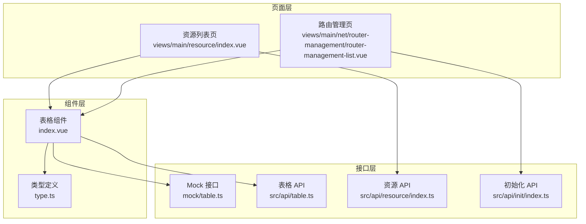
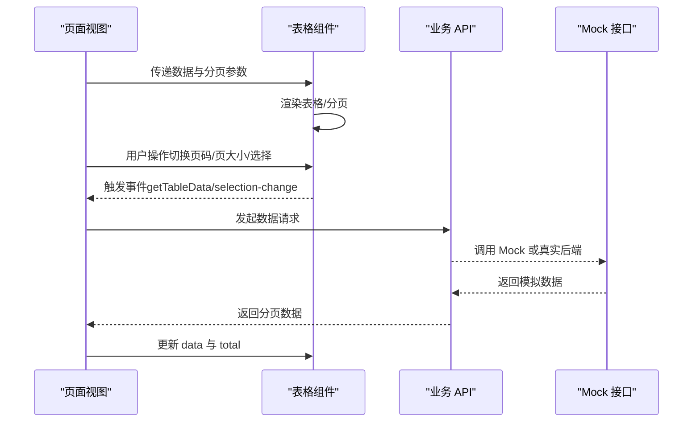
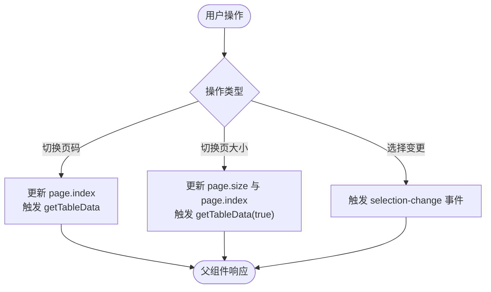
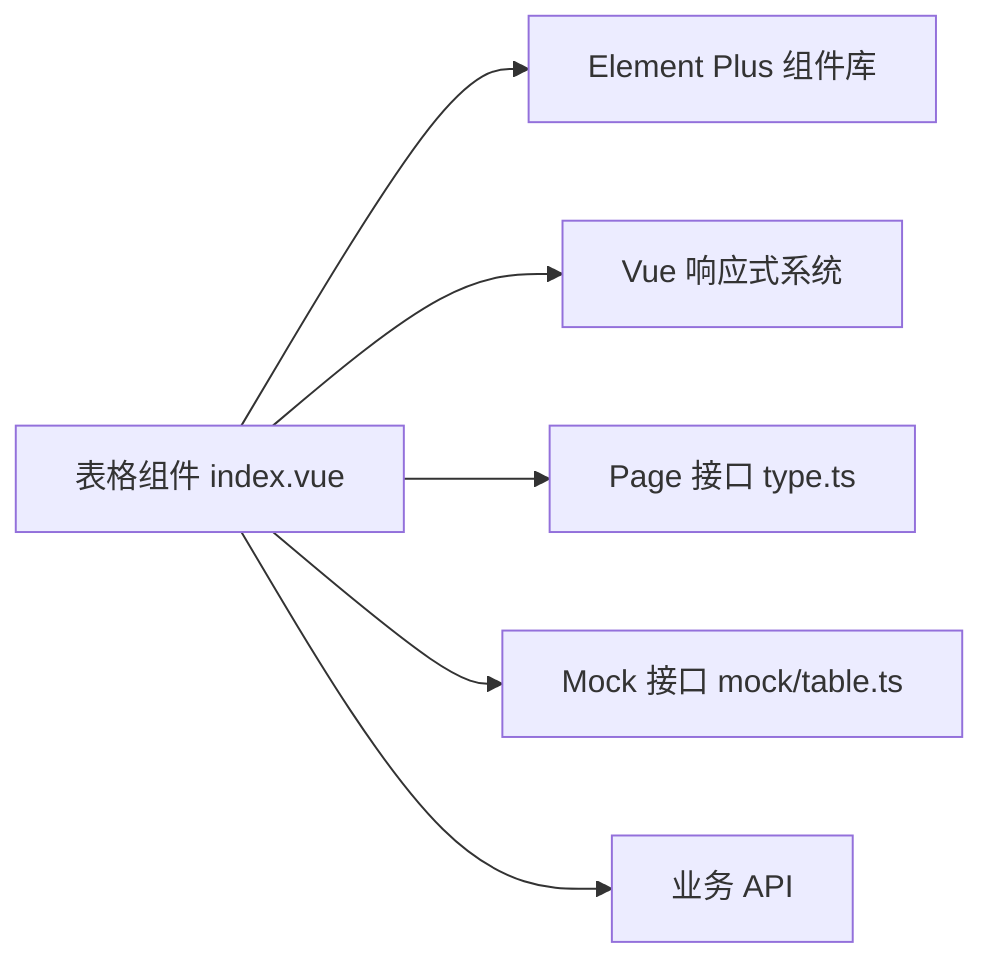

# 表格组件开发

<cite>
**本文引用的文件**
- [index.vue](file://watcher-web/src/components/table/index.vue)
- [type.ts](file://watcher-web/src/components/table/type.ts)
- [table.ts](file://watcher-web/mock/table.ts)
- [table.ts](file://watcher-web/src/api/table.ts)
- [index.ts](file://watcher-web/src/api/resource/index.ts)
- [index.ts](file://watcher-web/src/api/init/index.ts)
- [router-management-list.vue](file://watcher-web/src/views/main/net/router-management/router-management-list.vue)
- [index.vue](file://watcher-web/src/views/main/resource/index.vue)
</cite>

## 目录
1. [简介](#简介)
2. [项目结构](#项目结构)
3. [核心组件](#核心组件)
4. [架构总览](#架构总览)
5. [详细组件分析](#详细组件分析)
6. [依赖分析](#依赖分析)
7. [性能考虑](#性能考虑)
8. [故障排查指南](#故障排查指南)
9. [结论](#结论)
10. [附录](#附录)

## 简介
本指南围绕 ShowTime 系统中的表格组件展开，目标是帮助开发者快速理解并高效使用该组件。内容涵盖：
- 组件实现原理：数据绑定、分页机制、选择功能、排序能力
- Props 配置详解：数据源、显示选项、分页参数、样式设置
- 事件处理机制：选择变更、分页切换、自定义事件
- 列定制方法：插槽使用、模板配置、动态列生成
- 性能优化策略：虚拟滚动、懒加载、大数据量处理
- 完整使用示例与最佳实践

## 项目结构
表格组件位于前端工程 watcher-web 的组件目录中，配套有类型定义、Mock 接口与实际业务页面的使用示例。

图表来源
- [index.vue:1-133](file://watcher-web/src/components/table/index.vue#L1-L133)
- [type.ts:1-5](file://watcher-web/src/components/table/type.ts#L1-L5)
- [table.ts:1-138](file://watcher-web/mock/table.ts#L1-L138)
- [table.ts:1-61](file://watcher-web/src/api/table.ts#L1-L61)
- [index.ts:1-67](file://watcher-web/src/api/resource/index.ts#L1-L67)
- [index.ts:1-141](file://watcher-web/src/api/init/index.ts#L1-L141)
- [index.vue:1-283](file://watcher-web/src/views/main/resource/index.vue#L1-L283)
- [router-management-list.vue:1-362](file://watcher-web/src/views/main/net/router-management/router-management-list.vue#L1-L362)

章节来源
- [index.vue:1-133](file://watcher-web/src/components/table/index.vue#L1-L133)
- [type.ts:1-5](file://watcher-web/src/components/table/type.ts#L1-L5)
- [table.ts:1-138](file://watcher-web/mock/table.ts#L1-L138)
- [table.ts:1-61](file://watcher-web/src/api/table.ts#L1-L61)
- [index.ts:1-67](file://watcher-web/src/api/resource/index.ts#L1-L67)
- [index.ts:1-141](file://watcher-web/src/api/init/index.ts#L1-L141)
- [index.vue:1-283](file://watcher-web/src/views/main/resource/index.vue#L1-L283)
- [router-management-list.vue:1-362](file://watcher-web/src/views/main/net/router-management/router-management-list.vue#L1-L362)

## 核心组件
表格组件基于 Element Plus 的 el-table 和 el-pagination 实现，提供统一的数据展示、分页与选择能力，并通过插槽支持列的灵活定制。

- 数据绑定
  - 使用 v-bind 将外部属性透传给 el-table，确保与 Element Plus 的兼容性
  - 通过 data 属性接收数据源数组，直接驱动表格渲染
- 选择功能
  - 可选的 selection 列，配合 selection-change 事件向外抛出选中项
  - 支持 row-key 指定唯一键，便于多级页面场景下的选择状态维护
- 分页机制
  - 可选的分页组件，支持 total、page-size、page-sizes 等参数
  - 提供 current-change 与 size-change 事件，触发父组件重新获取数据
- 排序能力
  - 组件内置默认排序配置，同时可结合 el-table-column 的 sortable 属性启用列级排序
- 插槽与列定制
  - 默认插槽用于插入 el-table-column，支持模板与插槽组合
  - 可通过作用域插槽 scope 访问行数据，实现格式化显示与交互

章节来源
- [index.vue:1-38](file://watcher-web/src/components/table/index.vue#L1-L38)
- [index.vue:40-98](file://watcher-web/src/components/table/index.vue#L40-L98)

## 架构总览
下图展示了从页面到组件再到接口的整体流程，以及事件流转关系。

图表来源
- [index.vue:23-36](file://watcher-web/src/components/table/index.vue#L23-L36)
- [index.vue:64-82](file://watcher-web/src/components/table/index.vue#L64-L82)
- [index.vue:180-206](file://watcher-web/src/views/main/resource/index.vue#L180-L206)
- [index.vue:192-222](file://watcher-web/src/views/main/net/router-management/router-management-list.vue#L192-L222)
- [table.ts:1-138](file://watcher-web/mock/table.ts#L1-L138)
- [table.ts:1-61](file://watcher-web/src/api/table.ts#L1-L61)

## 详细组件分析

### 组件 Props 与行为
- 数据源与显示选项
  - data：表格数据数组
  - showIndex：是否显示序号列
  - showSelection：是否显示选择列
  - hasStripe/hasBorder：表格条纹与边框样式
  - header-cell-style：表头样式透传
- 分页参数
  - page：包含 index、size、total 的对象
  - pageLayout/pageSizes：分页布局与每页尺寸选项
  - showPage：是否显示分页组件
- 事件
  - selection-change：选择变化回调
  - getTableData：分页或筛选触发的数据刷新回调

章节来源
- [index.vue:44-60](file://watcher-web/src/components/table/index.vue#L44-L60)
- [type.ts:1-5](file://watcher-web/src/components/table/type.ts#L1-L5)

### 分页与事件处理流程
- 页码切换
  - 监听 current-change，更新 page.index 并触发 getTableData
- 页大小切换
  - 监听 size-change，防抖更新 page.size 与 page.index，并触发 getTableData(true)
- 选择变化
  - 监听 selection-change，向外抛出已选数据

图表来源
- [index.vue:64-86](file://watcher-web/src/components/table/index.vue#L64-L86)

章节来源
- [index.vue:64-86](file://watcher-web/src/components/table/index.vue#L64-L86)

### 列定制与插槽使用
- 默认插槽
  - 在组件内预留默认插槽，用于插入 el-table-column
- 作用域插槽
  - 通过 #default="scope" 访问行数据，实现列内格式化与交互
- 动态列生成
  - 结合 v-if/v-for 动态渲染列，满足不同业务场景

章节来源
- [index.vue:20-21](file://watcher-web/src/components/table/index.vue#L20-L21)
- [index.vue:27-87](file://watcher-web/src/views/main/resource/index.vue#L27-L87)
- [router-management-list.vue:60-114](file://watcher-web/src/views/main/net/router-management/router-management-list.vue#L60-L114)

### 页面使用示例

#### 资源列表（带分页）
- 绑定数据与分页
  - 使用 v-model:page 绑定分页对象，@getTableData 触发数据刷新
- 列定义
  - 基础列：名称、平台、地址等
  - 自定义列：权限、状态等通过作用域插槽格式化
- 请求与更新
  - 在 getResourceList 中组装分页参数，更新 data 与 total

章节来源
- [index.vue:20-26](file://watcher-web/src/views/main/resource/index.vue#L20-L26)
- [index.vue:180-206](file://watcher-web/src/views/main/resource/index.vue#L180-L206)

#### 路由管理（无分页）
- 关闭分页显示
  - :showPage="false" 以减少不必要的分页控件
- 选择与批量操作
  - 通过 selection-change 获取选中项，实现批量删除等操作

章节来源
- [router-management-list.vue:50-59](file://watcher-web/src/views/main/net/router-management/router-management-list.vue#L50-L59)
- [router-management-list.vue:227-235](file://watcher-web/src/views/main/net/router-management/router-management-list.vue#L227-L235)

## 依赖分析
- 组件依赖
  - Element Plus：el-table、el-table-column、el-pagination、el-button 等
  - Vue：setup、ref、reactive、onActivated/onMounted 生命周期
- 类型依赖
  - Page 接口定义分页三元组
- 接口依赖
  - Mock 接口提供本地测试数据
  - 业务 API 提供真实数据请求

图表来源
- [index.vue:1-133](file://watcher-web/src/components/table/index.vue#L1-L133)
- [type.ts:1-5](file://watcher-web/src/components/table/type.ts#L1-L5)
- [table.ts:1-138](file://watcher-web/mock/table.ts#L1-L138)

章节来源
- [index.vue:1-133](file://watcher-web/src/components/table/index.vue#L1-L133)
- [type.ts:1-5](file://watcher-web/src/components/table/type.ts#L1-L5)
- [table.ts:1-138](file://watcher-web/mock/table.ts#L1-L138)

## 性能考虑
- 虚拟滚动
  - 对于超大数据集，建议引入虚拟滚动方案（如基于第三方库），仅渲染可视区域内的行，显著降低 DOM 压力
- 懒加载
  - 分页加载时按需请求，避免一次性拉取全部数据；结合 loading 状态提升用户体验
- 大数据量处理
  - 合理设置 page.size，避免过大的单页数据导致渲染卡顿
  - 使用作用域插槽进行轻量格式化，避免复杂计算在模板中执行
- Keep-alive 适配
  - 组件内部已处理 keep-alive 激活后的布局问题，确保表格高度正确

章节来源
- [index.vue:87-90](file://watcher-web/src/components/table/index.vue#L87-L90)

## 故障排查指南
- 分页不生效
  - 确认父组件是否正确绑定 v-model:page，并在 @getTableData 中发起数据请求
  - 检查 page.total 是否被正确赋值
- 选择功能异常
  - 确保 el-table 上设置了 row-key，避免重复行键导致选择错乱
  - 检查 selection-change 事件是否被正确监听与处理
- Mock 数据不一致
  - 检查 Mock 接口返回的 pager 字段与前端 page 参数是否匹配
- 表头样式未生效
  - 确认 header-cell-style 是否正确透传至 el-table

章节来源
- [index.vue:11-13](file://watcher-web/src/components/table/index.vue#L11-L13)
- [index.vue:64-86](file://watcher-web/src/components/table/index.vue#L64-L86)
- [table.ts:19-26](file://watcher-web/mock/table.ts#L19-L26)

## 结论
该表格组件以简洁的 API 与强大的扩展性覆盖了常见的数据展示需求。通过 Props 与事件的清晰分离、插槽与作用域插槽的灵活组合，以及完善的分页与选择能力，能够满足大多数业务场景。建议在大数据量场景下引入虚拟滚动与懒加载策略，进一步提升性能与体验。

## 附录

### Props 完整清单
- data：表格数据数组
- select：已选择的数据数组
- showIndex：是否显示序号列
- showSelection：是否显示选择列
- showPage：是否显示分页组件
- hasStripe/hasBorder：表格样式开关
- page：分页对象 { index, size, total }
- pageLayout：分页布局字符串
- pageSizes：每页尺寸数组

章节来源
- [index.vue:44-60](file://watcher-web/src/components/table/index.vue#L44-L60)
- [type.ts:1-5](file://watcher-web/src/components/table/type.ts#L1-L5)

### 事件清单
- selection-change：选择变化事件
- getTableData：数据刷新事件（携带是否强制刷新标记）

章节来源
- [index.vue:64-86](file://watcher-web/src/components/table/index.vue#L64-L86)

### Mock 接口与业务 API
- Mock 接口
  - 列表、分类、树形数据等接口，便于本地联调
- 业务 API
  - 资源列表、路由管理等真实接口，用于生产环境

章节来源
- [table.ts:1-138](file://watcher-web/mock/table.ts#L1-L138)
- [table.ts:1-61](file://watcher-web/src/api/table.ts#L1-L61)
- [index.ts:1-67](file://watcher-web/src/api/resource/index.ts#L1-L67)
- [index.ts:1-141](file://watcher-web/src/api/init/index.ts#L1-L141)