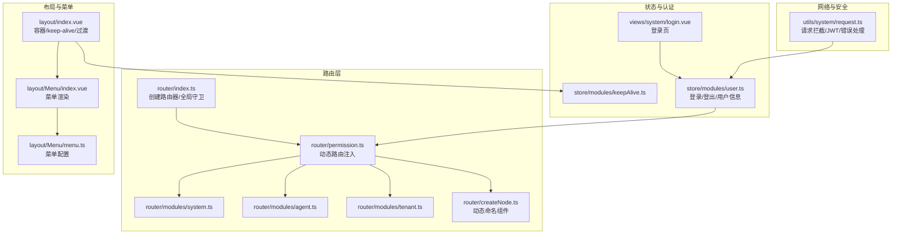
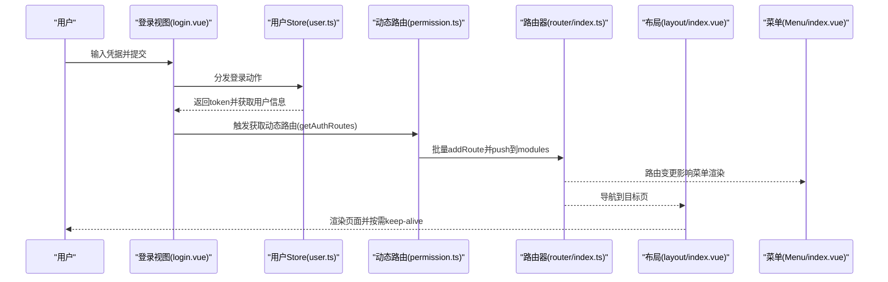
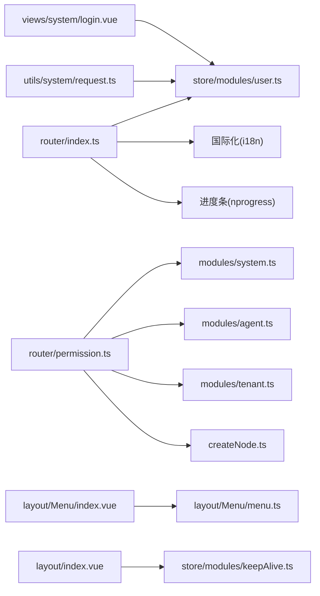

# 路由与权限管理

<cite>
**本文引用的文件**
- [watcher-web/src/router/index.ts](file://watcher-web/src/router/index.ts)
- [watcher-web/src/router/permission.ts](file://watcher-web/src/router/permission.ts)
- [watcher-web/src/router/createNode.ts](file://watcher-web/src/router/createNode.ts)
- [watcher-web/src/router/modules/system.ts](file://watcher-web/src/router/modules/system.ts)
- [watcher-web/src/router/modules/agent.ts](file://watcher-web/src/router/modules/agent.ts)
- [watcher-web/src/router/modules/tenant.ts](file://watcher-web/src/router/modules/tenant.ts)
- [watcher-web/src/layout/Menu/menu.ts](file://watcher-web/src/layout/Menu/menu.ts)
- [watcher-web/src/layout/index.vue](file://watcher-web/src/layout/index.vue)
- [watcher-web/src/layout/Menu/index.vue](file://watcher-web/src/layout/Menu/index.vue)
- [watcher-web/src/store/modules/user.ts](file://watcher-web/src/store/modules/user.ts)
- [watcher-web/src/store/modules/keepAlive.ts](file://watcher-web/src/store/modules/keepAlive.ts)
- [watcher-web/src/views/system/login.vue](file://watcher-web/src/views/system/login.vue)
- [watcher-web/src/utils/system/request.ts](file://watcher-web/src/utils/system/request.ts)
</cite>

## 目录
1. [简介](#简介)
2. [项目结构](#项目结构)
3. [核心组件](#核心组件)
4. [架构总览](#架构总览)
5. [详细组件分析](#详细组件分析)
6. [依赖关系分析](#依赖关系分析)
7. [性能考量](#性能考量)
8. [故障排查指南](#故障排查指南)
9. [结论](#结论)
10. [附录](#附录)

## 简介
本文件面向ShowTime前端系统的“路由与权限管理”，系统性梳理Vue Router的配置与使用方式，覆盖路由定义、嵌套路由、路由参数传递；详解动态路由的实现机制（基于登录后令牌状态动态注入路由与菜单）；阐述权限控制体系（角色权限、菜单权限、按钮级权限验证思路）；并给出路由守卫的使用要点（全局前置守卫、路由独享守卫、组件内守卫）。最后提供权限管理最佳实践，包括权限设计原则、安全考虑与性能优化建议。

## 项目结构
围绕路由与权限的关键目录与文件如下：
- 路由核心
  - 路由入口与守卫：[watcher-web/src/router/index.ts](file://watcher-web/src/router/index.ts)
  - 动态路由与权限扩展：[watcher-web/src/router/permission.ts](file://watcher-web/src/router/permission.ts)
  - 动态命名组件工具：[watcher-web/src/router/createNode.ts](file://watcher-web/src/router/createNode.ts)
  - 路由模块（功能域）：[watcher-web/src/router/modules/system.ts](file://watcher-web/src/router/modules/system.ts)、[watcher-web/src/router/modules/agent.ts](file://watcher-web/src/router/modules/agent.ts)、[watcher-web/src/router/modules/tenant.ts](file://watcher-web/src/router/modules/tenant.ts)
- 布局与菜单
  - 布局容器与缓存：[watcher-web/src/layout/index.vue](file://watcher-web/src/layout/index.vue)
  - 菜单渲染与激活：[watcher-web/src/layout/Menu/index.vue](file://watcher-web/src/layout/Menu/index.vue)
  - 菜单静态配置：[watcher-web/src/layout/Menu/menu.ts](file://watcher-web/src/layout/Menu/menu.ts)
- 状态与认证
  - 用户状态与登录流程：[watcher-web/src/store/modules/user.ts](file://watcher-web/src/store/modules/user.ts)
  - 缓存状态：[watcher-web/src/store/modules/keepAlive.ts](file://watcher-web/src/store/modules/keepAlive.ts)
  - 登录视图：[watcher-web/src/views/system/login.vue](file://watcher-web/src/views/system/login.vue)
- 网络与鉴权
  - 请求拦截与统一错误处理：[watcher-web/src/utils/system/request.ts](file://watcher-web/src/utils/system/request.ts)

图表来源
- [watcher-web/src/router/index.ts:1-73](file://watcher-web/src/router/index.ts#L1-L73)
- [watcher-web/src/router/permission.ts:1-60](file://watcher-web/src/router/permission.ts#L1-L60)
- [watcher-web/src/router/createNode.ts:1-51](file://watcher-web/src/router/createNode.ts#L1-L51)
- [watcher-web/src/router/modules/system.ts:1-49](file://watcher-web/src/router/modules/system.ts#L1-L49)
- [watcher-web/src/router/modules/agent.ts:1-27](file://watcher-web/src/router/modules/agent.ts#L1-L27)
- [watcher-web/src/router/modules/tenant.ts:1-25](file://watcher-web/src/router/modules/tenant.ts#L1-L25)
- [watcher-web/src/layout/index.vue:1-158](file://watcher-web/src/layout/index.vue#L1-L158)
- [watcher-web/src/layout/Menu/index.vue:1-132](file://watcher-web/src/layout/Menu/index.vue#L1-L132)
- [watcher-web/src/layout/Menu/menu.ts:1-84](file://watcher-web/src/layout/Menu/menu.ts#L1-L84)
- [watcher-web/src/store/modules/user.ts:1-76](file://watcher-web/src/store/modules/user.ts#L1-L76)
- [watcher-web/src/store/modules/keepAlive.ts:1-51](file://watcher-web/src/store/modules/keepAlive.ts#L1-L51)
- [watcher-web/src/views/system/login.vue:1-355](file://watcher-web/src/views/system/login.vue#L1-L355)
- [watcher-web/src/utils/system/request.ts:1-81](file://watcher-web/src/utils/system/request.ts#L1-L81)

章节来源
- [watcher-web/src/router/index.ts:1-73](file://watcher-web/src/router/index.ts#L1-L73)
- [watcher-web/src/router/permission.ts:1-60](file://watcher-web/src/router/permission.ts#L1-L60)
- [watcher-web/src/router/createNode.ts:1-51](file://watcher-web/src/router/createNode.ts#L1-L51)
- [watcher-web/src/router/modules/system.ts:1-49](file://watcher-web/src/router/modules/system.ts#L1-L49)
- [watcher-web/src/router/modules/agent.ts:1-27](file://watcher-web/src/router/modules/agent.ts#L1-L27)
- [watcher-web/src/router/modules/tenant.ts:1-25](file://watcher-web/src/router/modules/tenant.ts#L1-L25)
- [watcher-web/src/layout/index.vue:1-158](file://watcher-web/src/layout/index.vue#L1-L158)
- [watcher-web/src/layout/Menu/index.vue:1-132](file://watcher-web/src/layout/Menu/index.vue#L1-L132)
- [watcher-web/src/layout/Menu/menu.ts:1-84](file://watcher-web/src/layout/Menu/menu.ts#L1-L84)
- [watcher-web/src/store/modules/user.ts:1-76](file://watcher-web/src/store/modules/user.ts#L1-L76)
- [watcher-web/src/store/modules/keepAlive.ts:1-51](file://watcher-web/src/store/modules/keepAlive.ts#L1-L51)
- [watcher-web/src/views/system/login.vue:1-355](file://watcher-web/src/views/system/login.vue#L1-L355)
- [watcher-web/src/utils/system/request.ts:1-81](file://watcher-web/src/utils/system/request.ts#L1-L81)

## 核心组件
- 路由器与全局守卫
  - 创建路由器与历史模式、初始路由集合、白名单、全局前置/后置守卫
  - 前置守卫依据token与白名单决定放行或重定向登录
  - 后置守卫结合keep-alive策略，按需缓存组件
- 动态路由与权限扩展
  - 将各功能域模块路由收集为异步路由集合
  - 登录成功后批量注入路由与菜单，实现“菜单即路由”
- 动态命名组件
  - 解决keep-alive必须具备name的问题，同时支持组件热重载过渡
- 布局与菜单
  - 布局容器负责keep-alive与过渡动画
  - 菜单组件读取路由表与静态菜单配置，计算当前激活项
- 用户状态与登录流程
  - 提供登录、获取用户信息、登出等动作，维护token与用户信息
- 请求拦截与统一错误处理
  - 自动附加token头，统一处理401/403等错误并触发清理与刷新

章节来源
- [watcher-web/src/router/index.ts:27-73](file://watcher-web/src/router/index.ts#L27-L73)
- [watcher-web/src/router/permission.ts:26-60](file://watcher-web/src/router/permission.ts#L26-L60)
- [watcher-web/src/router/createNode.ts:8-50](file://watcher-web/src/router/createNode.ts#L8-L50)
- [watcher-web/src/layout/index.vue:25-42](file://watcher-web/src/layout/index.vue#L25-L42)
- [watcher-web/src/layout/Menu/index.vue:36-57](file://watcher-web/src/layout/Menu/index.vue#L36-L57)
- [watcher-web/src/store/modules/user.ts:33-67](file://watcher-web/src/store/modules/user.ts#L33-L67)
- [watcher-web/src/utils/system/request.ts:12-76](file://watcher-web/src/utils/system/request.ts#L12-L76)

## 架构总览
下图展示了从登录到动态路由注入、菜单联动与页面渲染的完整链路。

图表来源
- [watcher-web/src/views/system/login.vue:139-169](file://watcher-web/src/views/system/login.vue#L139-L169)
- [watcher-web/src/store/modules/user.ts:33-54](file://watcher-web/src/store/modules/user.ts#L33-L54)
- [watcher-web/src/router/permission.ts:54-59](file://watcher-web/src/router/permission.ts#L54-L59)
- [watcher-web/src/router/index.ts:36-52](file://watcher-web/src/router/index.ts#L36-L52)
- [watcher-web/src/layout/index.vue:25-42](file://watcher-web/src/layout/index.vue#L25-L42)
- [watcher-web/src/layout/Menu/index.vue:36-57](file://watcher-web/src/layout/Menu/index.vue#L36-L57)

## 详细组件分析

### 路由器与全局守卫
- 路由器初始化
  - 历史模式采用哈希模式
  - 初始routes来自系统模块（含404/401/403/登录/兜底重定向）
- 白名单与前置守卫
  - 白名单包含登录页
  - 若已登录且非登录页，继续导航；若在白名单内设置标题并放行；否则重定向登录页
- 后置守卫
  - 根据路由meta.cache与组件name，向keepAlive状态追加需要缓存的组件名
  - 结束进度条

章节来源
- [watcher-web/src/router/index.ts:27-73](file://watcher-web/src/router/index.ts#L27-L73)

### 动态路由与权限扩展
- 异步路由集合
  - 收集各功能域模块路由（如初始化配置、Agent、租户、资源、网络、指标等）
- 注入策略
  - 登录成功后，遍历异步路由，逐条addRoute并push到modules
  - 由于modules为响应式数组，菜单与路由同步更新
- 适用场景
  - 前端模拟后端菜单树：直接使用异步路由集合
  - 后端真实菜单树：将后端树与异步路由比对，生成交集后再注入

章节来源
- [watcher-web/src/router/permission.ts:26-60](file://watcher-web/src/router/permission.ts#L26-L60)

### 动态命名组件与keep-alive
- 动态命名组件
  - 包装异步加载组件，动态生成唯一name，满足keep-alive要求
  - 提供轻量热重载过渡，避免白屏与闪烁
- keep-alive集成
  - 布局容器通过计算属性读取keepAlive组件名列表
  - 仅对命中缓存的组件启用keep-alive，其余直接渲染

章节来源
- [watcher-web/src/router/createNode.ts:8-50](file://watcher-web/src/router/createNode.ts#L8-L50)
- [watcher-web/src/layout/index.vue:31-38](file://watcher-web/src/layout/index.vue#L31-L38)
- [watcher-web/src/store/modules/keepAlive.ts:16-30](file://watcher-web/src/store/modules/keepAlive.ts#L16-L30)

### 嵌套路由与菜单联动
- 嵌套路由
  - 顶层Layout包裹子路由，形成父子关系
  - 子路由通过动态命名组件实现懒加载与缓存
- 菜单联动
  - 菜单组件读取路由表与静态菜单配置
  - 计算当前激活菜单项，支持折叠/展开与唯一展开

章节来源
- [watcher-web/src/router/modules/system.ts:4-48](file://watcher-web/src/router/modules/system.ts#L4-L48)
- [watcher-web/src/router/modules/agent.ts:5-24](file://watcher-web/src/router/modules/agent.ts#L5-L24)
- [watcher-web/src/router/modules/tenant.ts:4-23](file://watcher-web/src/router/modules/tenant.ts#L4-L23)
- [watcher-web/src/layout/Menu/index.vue:36-57](file://watcher-web/src/layout/Menu/index.vue#L36-L57)
- [watcher-web/src/layout/Menu/menu.ts:3-81](file://watcher-web/src/layout/Menu/menu.ts#L3-L81)

### 登录流程与权限生效
- 登录视图
  - 表单校验、提交登录请求
  - 成功后清空本地cookie、提示成功并刷新页面
- 用户状态
  - 登录动作设置token，随后触发获取用户信息
- 权限生效
  - 登录成功后调用动态路由注入，菜单与路由即时更新

章节来源
- [watcher-web/src/views/system/login.vue:139-169](file://watcher-web/src/views/system/login.vue#L139-L169)
- [watcher-web/src/store/modules/user.ts:33-54](file://watcher-web/src/store/modules/user.ts#L33-L54)
- [watcher-web/src/router/permission.ts:54-59](file://watcher-web/src/router/permission.ts#L54-L59)

### 请求拦截与统一错误处理
- 请求拦截
  - 自动附加token头
- 响应拦截
  - 统一错误处理，401/403时清理本地存储并刷新页面
  - 其他错误弹窗提示

章节来源
- [watcher-web/src/utils/system/request.ts:12-76](file://watcher-web/src/utils/system/request.ts#L12-L76)

## 依赖关系分析
- 路由器依赖
  - 依赖modules（系统模块+动态模块），依赖store中的token
  - 依赖国际化与进度条工具
- 动态路由依赖
  - 依赖Layout与动态命名组件
  - 依赖store中的token与菜单集合
- 布局与菜单依赖
  - 依赖路由表与静态菜单配置
  - 依赖keepAlive状态
- 登录依赖
  - 依赖用户Store与动态路由注入
- 请求拦截依赖
  - 依赖store中的token

图表来源
- [watcher-web/src/router/index.ts:1-73](file://watcher-web/src/router/index.ts#L1-L73)
- [watcher-web/src/router/permission.ts:1-60](file://watcher-web/src/router/permission.ts#L1-L60)
- [watcher-web/src/router/createNode.ts:1-51](file://watcher-web/src/router/createNode.ts#L1-L51)
- [watcher-web/src/router/modules/system.ts:1-49](file://watcher-web/src/router/modules/system.ts#L1-L49)
- [watcher-web/src/router/modules/agent.ts:1-27](file://watcher-web/src/router/modules/agent.ts#L1-L27)
- [watcher-web/src/router/modules/tenant.ts:1-25](file://watcher-web/src/router/modules/tenant.ts#L1-L25)
- [watcher-web/src/layout/index.vue:1-158](file://watcher-web/src/layout/index.vue#L1-L158)
- [watcher-web/src/layout/Menu/index.vue:1-132](file://watcher-web/src/layout/Menu/index.vue#L1-L132)
- [watcher-web/src/layout/Menu/menu.ts:1-84](file://watcher-web/src/layout/Menu/menu.ts#L1-L84)
- [watcher-web/src/store/modules/user.ts:1-76](file://watcher-web/src/store/modules/user.ts#L1-L76)
- [watcher-web/src/store/modules/keepAlive.ts:1-51](file://watcher-web/src/store/modules/keepAlive.ts#L1-L51)
- [watcher-web/src/views/system/login.vue:1-355](file://watcher-web/src/views/system/login.vue#L1-L355)
- [watcher-web/src/utils/system/request.ts:1-81](file://watcher-web/src/utils/system/request.ts#L1-L81)

章节来源
- [watcher-web/src/router/index.ts:1-73](file://watcher-web/src/router/index.ts#L1-L73)
- [watcher-web/src/router/permission.ts:1-60](file://watcher-web/src/router/permission.ts#L1-L60)
- [watcher-web/src/router/createNode.ts:1-51](file://watcher-web/src/router/createNode.ts#L1-L51)
- [watcher-web/src/router/modules/system.ts:1-49](file://watcher-web/src/router/modules/system.ts#L1-L49)
- [watcher-web/src/router/modules/agent.ts:1-27](file://watcher-web/src/router/modules/agent.ts#L1-L27)
- [watcher-web/src/router/modules/tenant.ts:1-25](file://watcher-web/src/router/modules/tenant.ts#L1-L25)
- [watcher-web/src/layout/index.vue:1-158](file://watcher-web/src/layout/index.vue#L1-L158)
- [watcher-web/src/layout/Menu/index.vue:1-132](file://watcher-web/src/layout/Menu/index.vue#L1-L132)
- [watcher-web/src/layout/Menu/menu.ts:1-84](file://watcher-web/src/layout/Menu/menu.ts#L1-L84)
- [watcher-web/src/store/modules/user.ts:1-76](file://watcher-web/src/store/modules/user.ts#L1-L76)
- [watcher-web/src/store/modules/keepAlive.ts:1-51](file://watcher-web/src/store/modules/keepAlive.ts#L1-L51)
- [watcher-web/src/views/system/login.vue:1-355](file://watcher-web/src/views/system/login.vue#L1-L355)
- [watcher-web/src/utils/system/request.ts:1-81](file://watcher-web/src/utils/system/request.ts#L1-L81)

## 性能考量
- 路由懒加载与keep-alive
  - 使用动态命名组件包装异步组件，减少首屏体积
  - 仅对命中缓存的组件启用keep-alive，避免无谓内存占用
- 路由守卫与进度条
  - 前置守卫快速判断token与白名单，避免无效导航
  - 后置守卫在导航完成后结束进度条，提升交互反馈
- 请求拦截
  - 统一附加token头，减少重复逻辑
  - 对401/403进行统一处理，避免分散错误处理导致的性能损耗

章节来源
- [watcher-web/src/router/createNode.ts:8-50](file://watcher-web/src/router/createNode.ts#L8-L50)
- [watcher-web/src/layout/index.vue:31-38](file://watcher-web/src/layout/index.vue#L31-L38)
- [watcher-web/src/router/index.ts:36-68](file://watcher-web/src/router/index.ts#L36-L68)
- [watcher-web/src/utils/system/request.ts:12-76](file://watcher-web/src/utils/system/request.ts#L12-L76)

## 故障排查指南
- 登录后无法进入业务页
  - 检查登录成功后是否调用了动态路由注入
  - 确认store中token存在且未过期
- 菜单不显示或不更新
  - 确认modules是否被正确push与router.addRoute
  - 检查菜单组件是否读取到最新路由表
- 页面切换闪烁或白屏
  - 检查动态命名组件是否正确生成name与过渡
  - 确认keep-alive include列表是否包含当前组件
- 401/403错误
  - 检查请求拦截器是否附加token
  - 确认后端返回状态码与消息体结构一致

章节来源
- [watcher-web/src/router/permission.ts:54-59](file://watcher-web/src/router/permission.ts#L54-L59)
- [watcher-web/src/store/modules/user.ts:33-54](file://watcher-web/src/store/modules/user.ts#L33-L54)
- [watcher-web/src/layout/Menu/index.vue:36-57](file://watcher-web/src/layout/Menu/index.vue#L36-L57)
- [watcher-web/src/layout/index.vue:31-38](file://watcher-web/src/layout/index.vue#L31-L38)
- [watcher-web/src/utils/system/request.ts:50-76](file://watcher-web/src/utils/system/request.ts#L50-L76)

## 结论
ShowTime前端的路由与权限管理以“登录即注入”的动态路由为核心，结合keep-alive与菜单联动，实现了灵活、可扩展的权限体系。通过全局守卫与请求拦截，系统在安全性与用户体验之间取得平衡。建议后续在真实后端场景中，将后端菜单树与前端异步路由进行比对，确保“菜单即路由”的一致性与最小权限原则。

## 附录
- 路由守卫类型与使用建议
  - 全局前置守卫：用于token校验、白名单放行、动态注入路由
  - 路由独享守卫：用于特定路由的权限校验（如仅管理员可见）
  - 组件内守卫：用于组件级权限与数据预取
- 权限设计原则
  - 最小权限：仅授予必要功能
  - 菜单即路由：前端路由与菜单保持一致
  - 可审计：记录关键操作与权限变更
- 安全考虑
  - token有效期与刷新策略
  - 请求拦截统一附加token头
  - 401/403统一清理与跳转
- 性能优化
  - 路由懒加载与按需缓存
  - 减少不必要的路由与菜单层级
  - 合理使用keep-alive与过渡动画