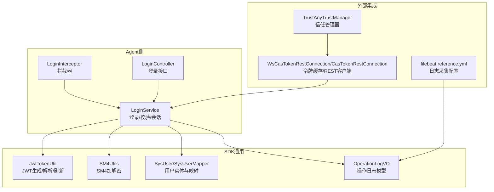
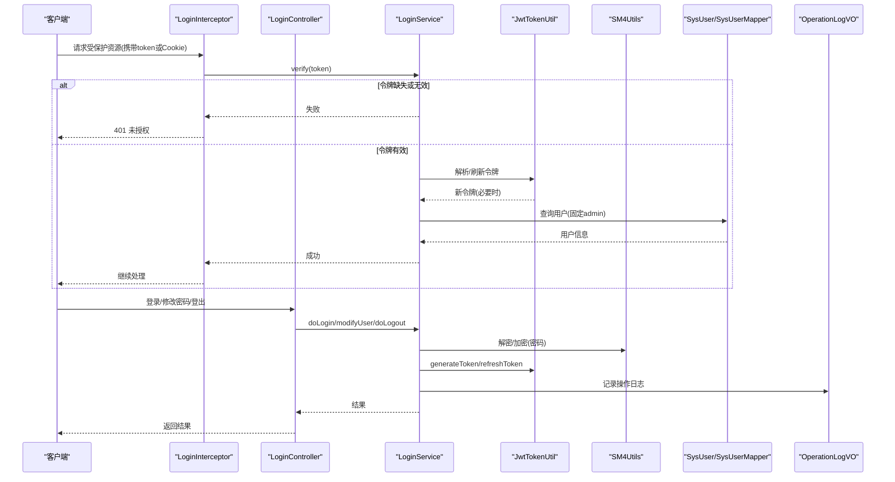
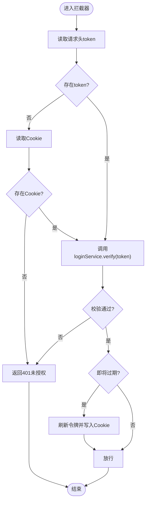
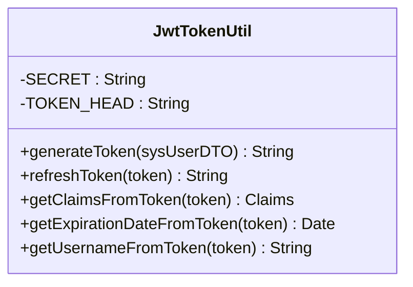
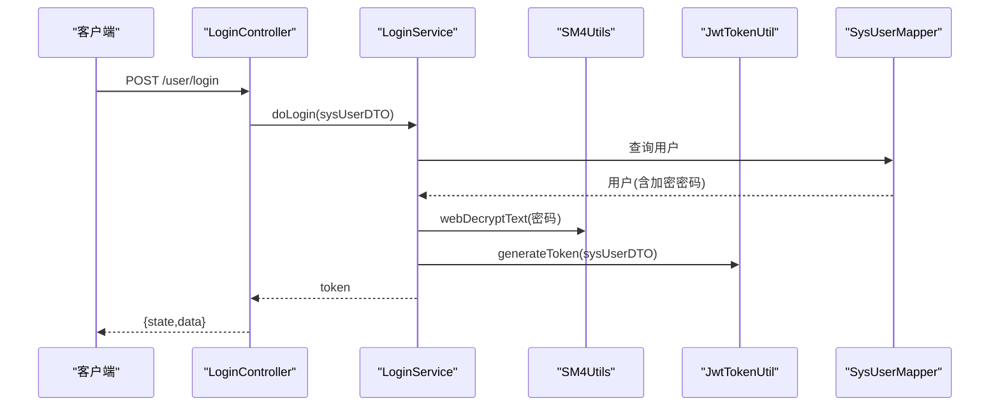
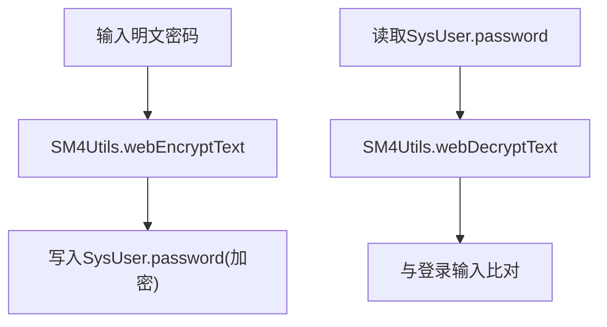
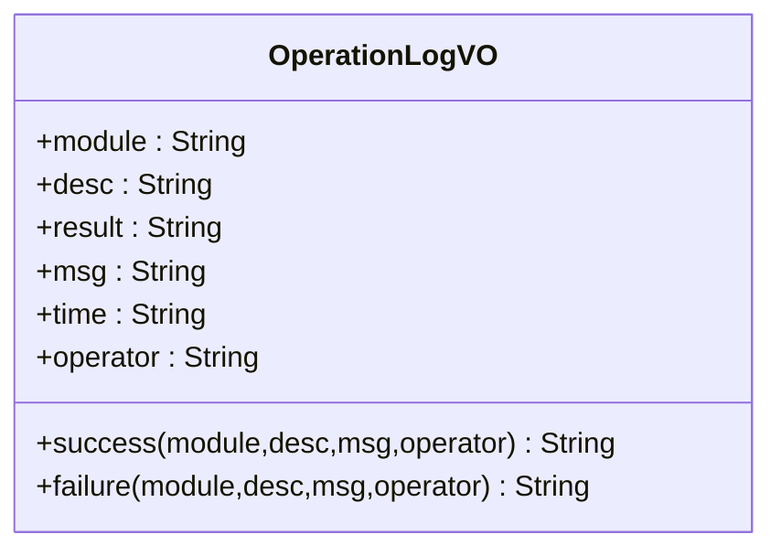
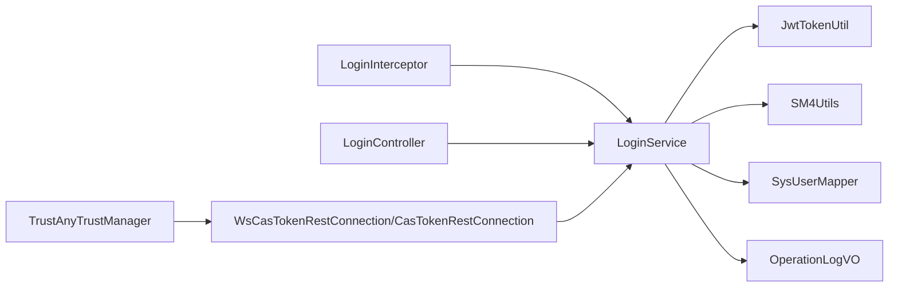

# 安全与权限

<cite>
**本文引用的文件**
- [LoginInterceptor.java](file://watcher-agent/src/main/java/com/virtual/cloud/om/agent/config/LoginInterceptor.java)
- [JwtTokenUtil.java](file://watcher-sdk/src/main/java/com/virtual/cloud/om/sdk/utils/JwtTokenUtil.java)
- [LoginService.java](file://watcher-agent/src/main/java/com/virtual/cloud/om/agent/service/auth/LoginService.java)
- [LoginController.java](file://watcher-agent/src/main/java/com/virtual/cloud/om/agent/controller/LoginController.java)
- [SM4Utils.java](file://watcher-sdk/src/main/java/com/virtual/cloud/om/sdk/utils/sm4/SM4Utils.java)
- [SysUser.java](file://watcher-sdk/src/main/java/com/virtual/cloud/om/sdk/entity/mysql/SysUser.java)
- [SysUserMapper.java](file://watcher-sdk/src/main/java/com/virtual/cloud/om/sdk/mapper/SysUserMapper.java)
- [OperationLogVO.java](file://watcher-sdk/src/main/java/com/virtual/cloud/om/sdk/dto/OperationLogVO.java)
- [WsCasTokenRestConnection.java](file://watcher-sdk/src/main/java/com/virtual/cloud/om/sdk/config/token/workspace/WsCasTokenRestConnection.java)
- [CasTokenRestConnection.java](file://watcher-sdk/src/main/java/com/virtual/cloud/om/sdk/config/token/cas/CasTokenRestConnection.java)
- [TrustAnyTrustManager.java](file://watcher-sdk/src/main/java/com/virtual/cloud/om/sdk/config/rest/common/TrustAnyTrustManager.java)
- [filebeat.reference.yml](file://watcher-builder/assembly/components/filebeat/filebeat-8.0.1-linux-x86_64/filebeat.reference.yml)
</cite>

## 目录
1. [引言](#引言)
2. [项目结构](#项目结构)
3. [核心组件](#核心组件)
4. [架构总览](#架构总览)
5. [详细组件分析](#详细组件分析)
6. [依赖分析](#依赖分析)
7. [性能考虑](#性能考虑)
8. [故障排查指南](#故障排查指南)
9. [结论](#结论)
10. [附录](#附录)

## 引言
本文件面向ShowTime监控系统，聚焦“安全与权限”主题，系统化梳理身份认证、权限控制、数据加密、审计日志、安全配置与威胁防护等能力，并给出可落地的最佳实践与修复建议。内容以仓库现有实现为依据，避免臆测，确保可追溯。

## 项目结构
围绕“安全与权限”的关键模块分布如下：
- 认证与会话：拦截器、JWT工具、登录服务、登录控制器
- 加密与密钥：SM4工具、密码策略、用户实体与持久化
- 权限与审计：操作日志模型、REST客户端与令牌缓存
- 传输安全：信任管理器、SSL配置参考
- 日志采集：Filebeat配置参考（用于安全事件采集）

图表来源
- [LoginInterceptor.java:36-73](file://watcher-agent/src/main/java/com/virtual/cloud/om/agent/config/LoginInterceptor.java#L36-L73)
- [LoginController.java:25-44](file://watcher-agent/src/main/java/com/virtual/cloud/om/agent/controller/LoginController.java#L25-L44)
- [LoginService.java:54-93](file://watcher-agent/src/main/java/com/virtual/cloud/om/agent/service/auth/LoginService.java#L54-L93)
- [JwtTokenUtil.java:49-69](file://watcher-sdk/src/main/java/com/virtual/cloud/om/sdk/utils/JwtTokenUtil.java#L49-L69)
- [SM4Utils.java:20-49](file://watcher-sdk/src/main/java/com/virtual/cloud/om/sdk/utils/sm4/SM4Utils.java#L20-L49)
- [SysUser.java:33-38](file://watcher-sdk/src/main/java/com/virtual/cloud/om/sdk/entity/mysql/SysUser.java#L33-L38)
- [OperationLogVO.java:19-57](file://watcher-sdk/src/main/java/com/virtual/cloud/om/sdk/dto/OperationLogVO.java#L19-L57)
- [WsCasTokenRestConnection.java:42-47](file://watcher-sdk/src/main/java/com/virtual/cloud/om/sdk/config/token/workspace/WsCasTokenRestConnection.java#L42-L47)
- [TrustAnyTrustManager.java:9-44](file://watcher-sdk/src/main/java/com/virtual/cloud/om/sdk/config/rest/common/TrustAnyTrustManager.java#L9-L44)
- [filebeat.reference.yml:4531-4557](file://watcher-builder/assembly/components/filebeat/filebeat-8.0.1-linux-x86_64/filebeat.reference.yml#L4531-L4557)

章节来源
- [LoginInterceptor.java:36-73](file://watcher-agent/src/main/java/com/virtual/cloud/om/agent/config/LoginInterceptor.java#L36-L73)
- [LoginController.java:25-44](file://watcher-agent/src/main/java/com/virtual/cloud/om/agent/controller/LoginController.java#L25-L44)
- [LoginService.java:54-93](file://watcher-agent/src/main/java/com/virtual/cloud/om/agent/service/auth/LoginService.java#L54-L93)
- [JwtTokenUtil.java:49-69](file://watcher-sdk/src/main/java/com/virtual/cloud/om/sdk/utils/JwtTokenUtil.java#L49-L69)
- [SM4Utils.java:20-49](file://watcher-sdk/src/main/java/com/virtual/cloud/om/sdk/utils/sm4/SM4Utils.java#L20-L49)
- [SysUser.java:33-38](file://watcher-sdk/src/main/java/com/virtual/cloud/om/sdk/entity/mysql/SysUser.java#L33-L38)
- [OperationLogVO.java:19-57](file://watcher-sdk/src/main/java/com/virtual/cloud/om/sdk/dto/OperationLogVO.java#L19-L57)
- [WsCasTokenRestConnection.java:42-47](file://watcher-sdk/src/main/java/com/virtual/cloud/om/sdk/config/token/workspace/WsCasTokenRestConnection.java#L42-L47)
- [TrustAnyTrustManager.java:9-44](file://watcher-sdk/src/main/java/com/virtual/cloud/om/sdk/config/rest/common/TrustAnyTrustManager.java#L9-L44)
- [filebeat.reference.yml:4531-4557](file://watcher-builder/assembly/components/filebeat/filebeat-8.0.1-linux-x86_64/filebeat.reference.yml#L4531-L4557)

## 核心组件
- 登录拦截器：统一从请求头或Cookie读取令牌，调用登录服务校验，未通过则返回未授权响应。
- JWT工具：定义签名密钥、令牌前缀、过期时间、生成与刷新逻辑。
- 登录服务：完成用户校验、密码比对（使用SM4解密）、颁发令牌、会话与Cookie管理、令牌刷新与有效期检查。
- 用户实体与映射：用户密码字段采用加密存储；提供MyBatis映射接口。
- 操作日志：标准化操作日志结构，便于审计与合规。
- 令牌缓存与REST客户端：CAS/Workspace令牌缓存与REST交互封装。
- 传输安全：信任管理器与SSL配置参考，强调生产环境应启用严格证书校验。
- 日志采集：Filebeat配置参考，可用于采集安全事件日志。

章节来源
- [LoginInterceptor.java:36-73](file://watcher-agent/src/main/java/com/virtual/cloud/om/agent/config/LoginInterceptor.java#L36-L73)
- [JwtTokenUtil.java:17-18](file://watcher-sdk/src/main/java/com/virtual/cloud/om/sdk/utils/JwtTokenUtil.java#L17-L18)
- [LoginService.java:54-93](file://watcher-agent/src/main/java/com/virtual/cloud/om/agent/service/auth/LoginService.java#L54-L93)
- [SysUser.java:33-38](file://watcher-sdk/src/main/java/com/virtual/cloud/om/sdk/entity/mysql/SysUser.java#L33-L38)
- [SysUserMapper.java:10-13](file://watcher-sdk/src/main/java/com/virtual/cloud/om/sdk/mapper/SysUserMapper.java#L10-L13)
- [OperationLogVO.java:19-57](file://watcher-sdk/src/main/java/com/virtual/cloud/om/sdk/dto/OperationLogVO.java#L19-L57)
- [WsCasTokenRestConnection.java:42-47](file://watcher-sdk/src/main/java/com/virtual/cloud/om/sdk/config/token/workspace/WsCasTokenRestConnection.java#L42-L47)
- [TrustAnyTrustManager.java:9-44](file://watcher-sdk/src/main/java/com/virtual/cloud/om/sdk/config/rest/common/TrustAnyTrustManager.java#L9-L44)
- [filebeat.reference.yml:4531-4557](file://watcher-builder/assembly/components/filebeat/filebeat-8.0.1-linux-x86_64/filebeat.reference.yml#L4531-L4557)

## 架构总览
下图展示从客户端到Agent再到SDK与外部系统的整体安全流程，包括认证、会话、令牌刷新与日志审计。

图表来源
- [LoginInterceptor.java:36-73](file://watcher-agent/src/main/java/com/virtual/cloud/om/agent/config/LoginInterceptor.java#L36-L73)
- [LoginController.java:25-44](file://watcher-agent/src/main/java/com/virtual/cloud/om/agent/controller/LoginController.java#L25-L44)
- [LoginService.java:54-93](file://watcher-agent/src/main/java/com/virtual/cloud/om/agent/service/auth/LoginService.java#L54-L93)
- [JwtTokenUtil.java:49-69](file://watcher-sdk/src/main/java/com/virtual/cloud/om/sdk/utils/JwtTokenUtil.java#L49-L69)
- [SM4Utils.java:20-49](file://watcher-sdk/src/main/java/com/virtual/cloud/om/sdk/utils/sm4/SM4Utils.java#L20-L49)
- [SysUser.java:33-38](file://watcher-sdk/src/main/java/com/virtual/cloud/om/sdk/entity/mysql/SysUser.java#L33-L38)
- [OperationLogVO.java:33-57](file://watcher-sdk/src/main/java/com/virtual/cloud/om/sdk/dto/OperationLogVO.java#L33-L57)

## 详细组件分析

### 身份认证与会话管理
- 令牌来源：优先从请求头读取token，否则从Cookie读取；均未提供则直接返回未授权。
- 令牌校验：调用登录服务进行有效性判断；过期时间临近时自动刷新并回写Cookie。
- 会话策略：设置会话最大不活跃时间；登出时清理Cookie。
- 固定用户校验：当前实现中，令牌解析后仍与固定管理员用户进行比对，作为简化方案。

图表来源
- [LoginInterceptor.java:36-73](file://watcher-agent/src/main/java/com/virtual/cloud/om/agent/config/LoginInterceptor.java#L36-L73)
- [LoginService.java:117-141](file://watcher-agent/src/main/java/com/virtual/cloud/om/agent/service/auth/LoginService.java#L117-L141)
- [JwtTokenUtil.java:49-69](file://watcher-sdk/src/main/java/com/virtual/cloud/om/sdk/utils/JwtTokenUtil.java#L49-L69)

章节来源
- [LoginInterceptor.java:36-73](file://watcher-agent/src/main/java/com/virtual/cloud/om/agent/config/LoginInterceptor.java#L36-L73)
- [LoginService.java:54-93](file://watcher-agent/src/main/java/com/virtual/cloud/om/agent/service/auth/LoginService.java#L54-L93)
- [LoginService.java:117-141](file://watcher-agent/src/main/java/com/virtual/cloud/om/agent/service/auth/LoginService.java#L117-L141)
- [JwtTokenUtil.java:17-18](file://watcher-sdk/src/main/java/com/virtual/cloud/om/sdk/utils/JwtTokenUtil.java#L17-L18)
- [JwtTokenUtil.java:49-69](file://watcher-sdk/src/main/java/com/virtual/cloud/om/sdk/utils/JwtTokenUtil.java#L49-L69)

### JWT令牌生成与验证
- 密钥与算法：使用固定密钥与指定签名算法；令牌包含过期时间与主体（用户JSON）。
- 刷新策略：接近过期阈值时自动刷新，减少会话中断。
- 提供者：拦截器与登录服务共同依赖该工具进行解析与刷新。

图表来源
- [JwtTokenUtil.java:17-18](file://watcher-sdk/src/main/java/com/virtual/cloud/om/sdk/utils/JwtTokenUtil.java#L17-L18)
- [JwtTokenUtil.java:49-69](file://watcher-sdk/src/main/java/com/virtual/cloud/om/sdk/utils/JwtTokenUtil.java#L49-L69)
- [JwtTokenUtil.java:75-86](file://watcher-sdk/src/main/java/com/virtual/cloud/om/sdk/utils/JwtTokenUtil.java#L75-L86)

章节来源
- [JwtTokenUtil.java:17-18](file://watcher-sdk/src/main/java/com/virtual/cloud/om/sdk/utils/JwtTokenUtil.java#L17-L18)
- [JwtTokenUtil.java:49-69](file://watcher-sdk/src/main/java/com/virtual/cloud/om/sdk/utils/JwtTokenUtil.java#L49-L69)
- [JwtTokenUtil.java:75-86](file://watcher-sdk/src/main/java/com/virtual/cloud/om/sdk/utils/JwtTokenUtil.java#L75-L86)

### 登录流程与密码策略
- 登录流程：接收用户名/密码，查询用户，使用SM4解密对比，成功后生成JWT并写入Cookie，设置会话超时。
- 修改密码：校验旧密码与新密码一致性，按策略校验复杂度，更新用户记录。
- 密码策略：最小长度、特殊字符要求等，策略来源于数据库配置。
- 登出：删除Cookie。

图表来源
- [LoginController.java:25-44](file://watcher-agent/src/main/java/com/virtual/cloud/om/agent/controller/LoginController.java#L25-L44)
- [LoginService.java:54-93](file://watcher-agent/src/main/java/com/virtual/cloud/om/agent/service/auth/LoginService.java#L54-L93)
- [SM4Utils.java:20-31](file://watcher-sdk/src/main/java/com/virtual/cloud/om/sdk/utils/sm4/SM4Utils.java#L20-L31)
- [JwtTokenUtil.java:49-57](file://watcher-sdk/src/main/java/com/virtual/cloud/om/sdk/utils/JwtTokenUtil.java#L49-L57)
- [SysUserMapper.java:10-13](file://watcher-sdk/src/main/java/com/virtual/cloud/om/sdk/mapper/SysUserMapper.java#L10-L13)

章节来源
- [LoginController.java:25-44](file://watcher-agent/src/main/java/com/virtual/cloud/om/agent/controller/LoginController.java#L25-L44)
- [LoginService.java:54-93](file://watcher-agent/src/main/java/com/virtual/cloud/om/agent/service/auth/LoginService.java#L54-L93)
- [SM4Utils.java:20-31](file://watcher-sdk/src/main/java/com/virtual/cloud/om/sdk/utils/sm4/SM4Utils.java#L20-L31)
- [JwtTokenUtil.java:49-57](file://watcher-sdk/src/main/java/com/virtual/cloud/om/sdk/utils/JwtTokenUtil.java#L49-L57)
- [SysUserMapper.java:10-13](file://watcher-sdk/src/main/java/com/virtual/cloud/om/sdk/mapper/SysUserMapper.java#L10-L13)

### 数据加密策略
- 存储加密：用户密码字段采用SM4加密存储，登录时解密比对。
- 传输加密：REST客户端与外部系统交互时可配置SSL；当前仓库包含“信任任意证书”的信任管理器示例，但不建议在生产启用。
- 密钥管理：SM4密钥与IV在工具类内硬编码，建议迁移到安全的密钥管理系统（如KMS），并定期轮换。

图表来源
- [SM4Utils.java:20-31](file://watcher-sdk/src/main/java/com/virtual/cloud/om/sdk/utils/sm4/SM4Utils.java#L20-L31)
- [SysUser.java:33-38](file://watcher-sdk/src/main/java/com/virtual/cloud/om/sdk/entity/mysql/SysUser.java#L33-L38)

章节来源
- [SM4Utils.java:20-31](file://watcher-sdk/src/main/java/com/virtual/cloud/om/sdk/utils/sm4/SM4Utils.java#L20-L31)
- [SysUser.java:33-38](file://watcher-sdk/src/main/java/com/virtual/cloud/om/sdk/entity/mysql/SysUser.java#L33-L38)
- [TrustAnyTrustManager.java:9-44](file://watcher-sdk/src/main/java/com/virtual/cloud/om/sdk/config/rest/common/TrustAnyTrustManager.java#L9-L44)

### 审计日志与合规
- 操作日志模型：提供成功/失败两种模板，包含模块、描述、结果、消息、时间、操作者等字段，序列化为JSON便于上报与检索。
- 日志采集：可通过Filebeat采集系统日志与应用日志，结合安全事件规则进行告警与合规归档。

图表来源
- [OperationLogVO.java:19-57](file://watcher-sdk/src/main/java/com/virtual/cloud/om/sdk/dto/OperationLogVO.java#L19-L57)

章节来源
- [OperationLogVO.java:19-57](file://watcher-sdk/src/main/java/com/virtual/cloud/om/sdk/dto/OperationLogVO.java#L19-L57)
- [filebeat.reference.yml:4531-4557](file://watcher-builder/assembly/components/filebeat/filebeat-8.0.1-linux-x86_64/filebeat.reference.yml#L4531-L4557)

### 权限控制与令牌缓存
- 当前实现采用固定管理员用户校验，未体现细粒度的角色/资源权限。建议引入RBAC模型，将用户、角色、资源与权限映射关联，并在拦截器中增加动态权限检查。
- 令牌缓存：CAS/Workspace侧提供内存级令牌缓存，减少重复鉴权开销，但需注意缓存失效与并发一致性。

章节来源
- [LoginService.java:128-136](file://watcher-agent/src/main/java/com/virtual/cloud/om/agent/service/auth/LoginService.java#L128-L136)
- [WsCasTokenRestConnection.java:42-47](file://watcher-sdk/src/main/java/com/virtual/cloud/om/sdk/config/token/workspace/WsCasTokenRestConnection.java#L42-L47)
- [CasTokenRestConnection.java:46-54](file://watcher-sdk/src/main/java/com/virtual/cloud/om/sdk/config/token/cas/CasTokenRestConnection.java#L46-L54)

## 依赖分析
- 组件耦合：拦截器依赖登录服务；登录服务依赖JWT工具、SM4工具、用户映射与操作日志；控制器聚合登录服务。
- 外部依赖：REST客户端与信任管理器；Filebeat用于日志采集。
- 风险点：固定密钥、信任任意证书、固定管理员校验、令牌刷新逻辑依赖固定用户。

图表来源
- [LoginInterceptor.java:31-32](file://watcher-agent/src/main/java/com/virtual/cloud/om/agent/config/LoginInterceptor.java#L31-L32)
- [LoginService.java:40-47](file://watcher-agent/src/main/java/com/virtual/cloud/om/agent/service/auth/LoginService.java#L40-L47)
- [JwtTokenUtil.java:16-18](file://watcher-sdk/src/main/java/com/virtual/cloud/om/sdk/utils/JwtTokenUtil.java#L16-L18)
- [SM4Utils.java:12-13](file://watcher-sdk/src/main/java/com/virtual/cloud/om/sdk/utils/sm4/SM4Utils.java#L12-L13)
- [SysUserMapper.java:10-13](file://watcher-sdk/src/main/java/com/virtual/cloud/om/sdk/mapper/SysUserMapper.java#L10-L13)
- [OperationLogVO.java:19-57](file://watcher-sdk/src/main/java/com/virtual/cloud/om/sdk/dto/OperationLogVO.java#L19-L57)
- [WsCasTokenRestConnection.java:42-47](file://watcher-sdk/src/main/java/com/virtual/cloud/om/sdk/config/token/workspace/WsCasTokenRestConnection.java#L42-L47)
- [CasTokenRestConnection.java:46-54](file://watcher-sdk/src/main/java/com/virtual/cloud/om/sdk/config/token/cas/CasTokenRestConnection.java#L46-L54)
- [TrustAnyTrustManager.java:9-44](file://watcher-sdk/src/main/java/com/virtual/cloud/om/sdk/config/rest/common/TrustAnyTrustManager.java#L9-L44)

章节来源
- [LoginInterceptor.java:31-32](file://watcher-agent/src/main/java/com/virtual/cloud/om/agent/config/LoginInterceptor.java#L31-L32)
- [LoginService.java:40-47](file://watcher-agent/src/main/java/com/virtual/cloud/om/agent/service/auth/LoginService.java#L40-L47)
- [JwtTokenUtil.java:16-18](file://watcher-sdk/src/main/java/com/virtual/cloud/om/sdk/utils/JwtTokenUtil.java#L16-L18)
- [SM4Utils.java:12-13](file://watcher-sdk/src/main/java/com/virtual/cloud/om/sdk/utils/sm4/SM4Utils.java#L12-L13)
- [SysUserMapper.java:10-13](file://watcher-sdk/src/main/java/com/virtual/cloud/om/sdk/mapper/SysUserMapper.java#L10-L13)
- [OperationLogVO.java:19-57](file://watcher-sdk/src/main/java/com/virtual/cloud/om/sdk/dto/OperationLogVO.java#L19-L57)
- [WsCasTokenRestConnection.java:42-47](file://watcher-sdk/src/main/java/com/virtual/cloud/om/sdk/config/token/workspace/WsCasTokenRestConnection.java#L42-L47)
- [CasTokenRestConnection.java:46-54](file://watcher-sdk/src/main/java/com/virtual/cloud/om/sdk/config/token/cas/CasTokenRestConnection.java#L46-L54)
- [TrustAnyTrustManager.java:9-44](file://watcher-sdk/src/main/java/com/virtual/cloud/om/sdk/config/rest/common/TrustAnyTrustManager.java#L9-L44)

## 性能考虑
- 令牌刷新：接近过期阈值自动刷新，降低频繁登录成本，提升用户体验。
- 会话超时：合理设置会话最大不活跃时间，平衡安全与性能。
- 缓存：CAS/Workspace令牌缓存减少鉴权往返，提高吞吐。
- 建议：对高并发场景增加令牌缓存命中率统计与过期淘汰策略。

## 故障排查指南
- 401未授权
  - 检查请求头或Cookie是否携带token
  - 核对拦截器日志与登录服务校验结果
  - 关注令牌是否过期或即将过期
- 登录失败
  - 确认用户名存在且密码正确（SM4解密比对）
  - 检查密码策略是否满足要求
- 传输异常
  - 生产环境禁用“信任任意证书”，启用严格的SSL校验
  - 检查证书链与主机名校验配置
- 日志采集
  - 确认Filebeat模块配置与目标索引
  - 校验日志格式与字段映射

章节来源
- [LoginInterceptor.java:44-70](file://watcher-agent/src/main/java/com/virtual/cloud/om/agent/config/LoginInterceptor.java#L44-L70)
- [LoginService.java:76-87](file://watcher-agent/src/main/java/com/virtual/cloud/om/agent/service/auth/LoginService.java#L76-L87)
- [TrustAnyTrustManager.java:9-44](file://watcher-sdk/src/main/java/com/virtual/cloud/om/sdk/config/rest/common/TrustAnyTrustManager.java#L9-L44)
- [filebeat.reference.yml:4531-4557](file://watcher-builder/assembly/components/filebeat/filebeat-8.0.1-linux-x86_64/filebeat.reference.yml#L4531-L4557)

## 结论
ShowTime当前实现了基础的JWT认证与会话管理，配合SM4加密与操作日志模型，具备一定的安全基线。建议下一步完善RBAC权限体系、强化密钥管理与传输安全配置，并引入更严格的令牌与会话治理策略，以满足更高安全等级的合规与运营需求。

## 附录

### 安全配置最佳实践清单
- 密码策略
  - 启用最小长度与字符集要求
  - 定期轮换密码，禁止历史密码复用
- 令牌与会话
  - 使用强随机密钥，定期轮换
  - 设置合理的过期与刷新阈值
  - 登出时清除Cookie与会话
- 传输安全
  - 生产环境禁用“信任任意证书”
  - 启用严格SSL校验与证书链验证
- CORS与安全头
  - 明确允许来源与方法，避免通配
  - 设置安全响应头（如X-Content-Type-Options、X-Frame-Options、Content-Security-Policy等）
- 日志与审计
  - 开启操作日志与安全事件采集
  - 建立合规报告与告警机制

### 威胁防护要点
- SQL注入：使用ORM参数化查询，避免拼接SQL
- XSS：输出编码、内容安全策略、同源策略
- CSRF：同源校验、CSRF Token、安全头
- API限流：基于IP/用户维度限流，防止暴力破解与滥用

### 安全漏洞评估与修复建议
- 固定密钥与硬编码密钥
  - 风险：密钥泄露导致所有令牌可伪造
  - 建议：迁移到KMS或安全密钥管理服务，定期轮换
- 信任任意证书
  - 风险：中间人攻击
  - 建议：启用严格证书校验，配置可信CA列表
- 固定管理员校验
  - 风险：缺乏细粒度权限控制
  - 建议：引入RBAC模型，动态校验资源与操作权限
- 令牌刷新逻辑
  - 风险：固定用户校验易被绕过
  - 建议：基于真实用户上下文刷新，记录刷新日志