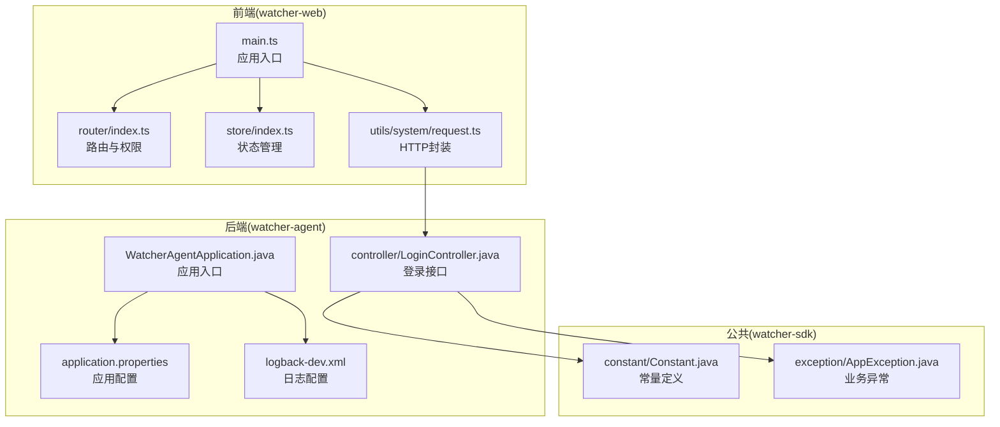
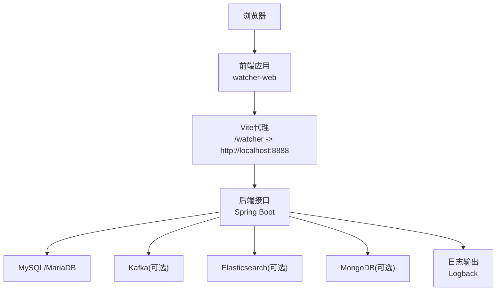
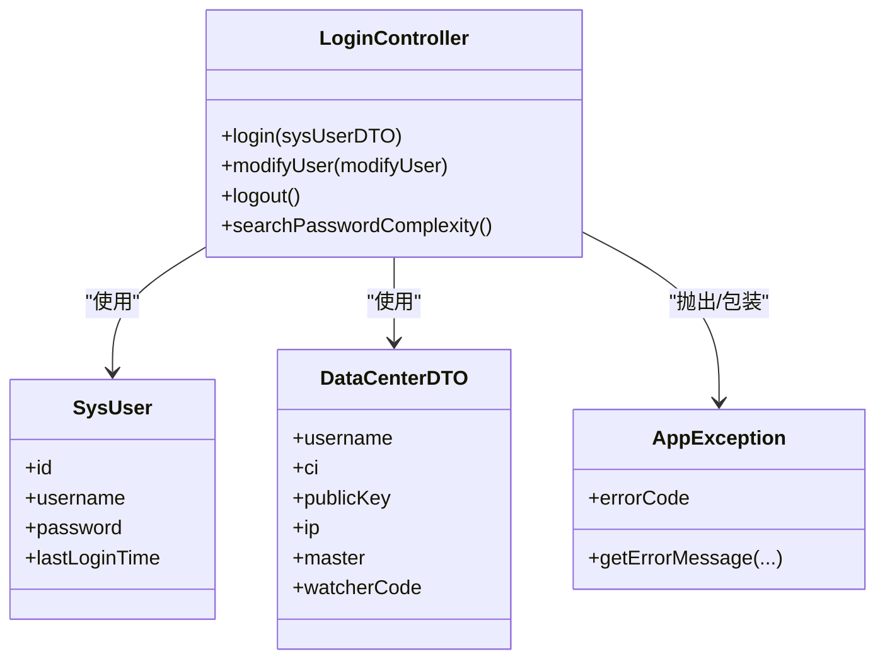
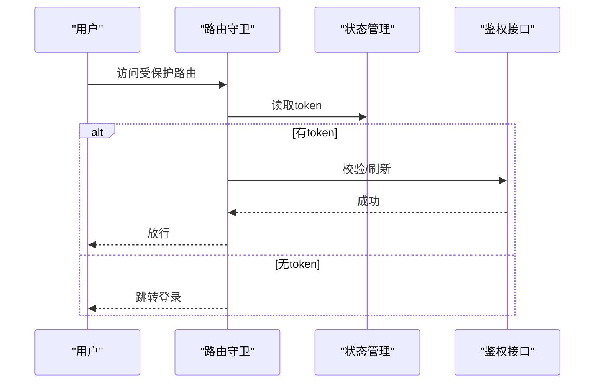
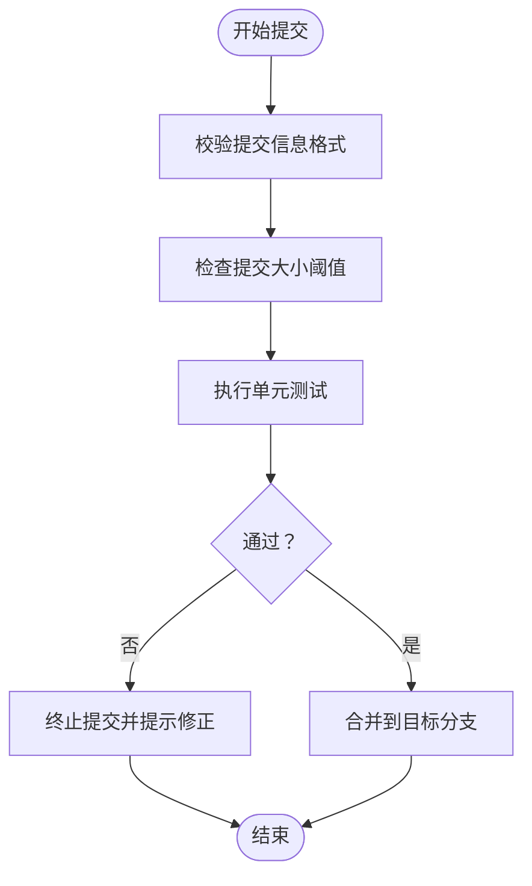
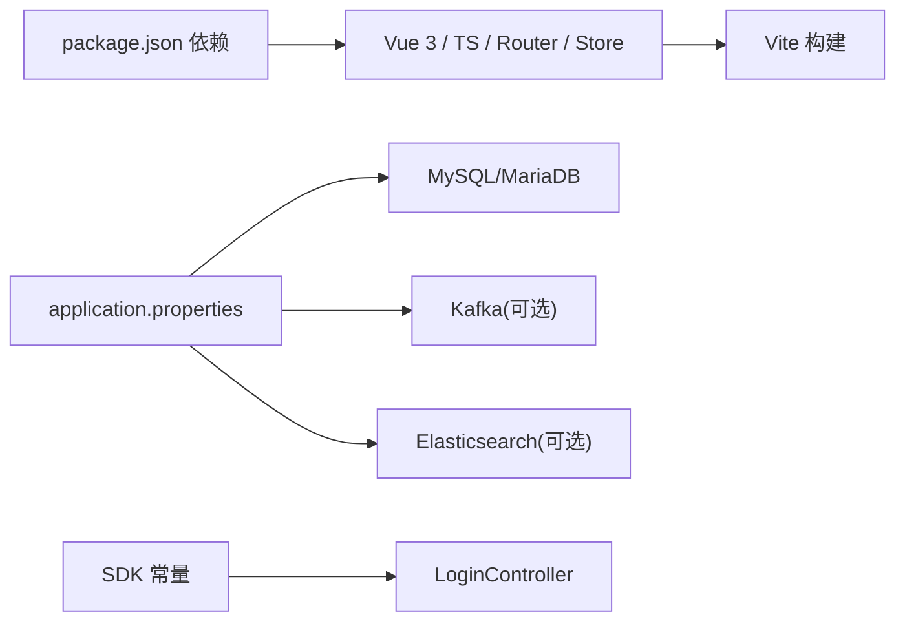

# 代码规范与最佳实践

<cite>
**本文引用的文件**
- [Readme.md](file://Readme.md)
- [package.json](file://watcher-web/package.json)
- [tsconfig.json](file://watcher-web/tsconfig.json)
- [vite.config.ts](file://watcher-web/vite.config.ts)
- [main.ts](file://watcher-web/src/main.ts)
- [router/index.ts](file://watcher-web/src/router/index.ts)
- [store/index.ts](file://watcher-web/src/store/index.ts)
- [utils/system/request.ts](file://watcher-web/src/utils/system/request.ts)
- [WatcherAgentApplication.java](file://watcher-agent/src/main/java/com/virtual/cloud/om/agent/WatcherAgentApplication.java)
- [LoginController.java](file://watcher-agent/src/main/java/com/virtual/cloud/om/agent/controller/LoginController.java)
- [DataCenterDTO.java](file://watcher-agent/src/main/java/com/virtual/cloud/om/agent/dto/DataCenterDTO.java)
- [SysUser.java](file://watcher-agent/src/main/java/com/virtual/cloud/om/agent/entity/SysUser.java)
- [application.properties](file://watcher-agent/src/main/resources/application.properties)
- [logback-dev.xml](file://watcher-agent/src/main/resources/logback-dev.xml)
- [AppException.java](file://watcher-sdk/src/main/java/com/virtual/cloud/om/sdk/exception/AppException.java)
- [Constant.java](file://watcher-sdk/src/main/java/com/virtual/cloud/om/sdk/constant/Constant.java)
- [.githooks/check_commit_msg.py](file://.githooks/check_commit_msg.py)
- [showtime_mcp.py](file://watcher-ai/src/showtime_mcp.py)
- [requirements.txt](file://watcher-ai/requirements.txt)
</cite>

## 目录
1. [引言](#引言)
2. [项目结构](#项目结构)
3. [核心组件](#核心组件)
4. [架构总览](#架构总览)
5. [详细组件分析](#详细组件分析)
6. [依赖关系分析](#依赖关系分析)
7. [性能考量](#性能考量)
8. [故障排查指南](#故障排查指南)
9. [结论](#结论)
10. [附录](#附录)

## 引言
本指南面向ShowTime监控系统，提供统一的代码规范与最佳实践，覆盖Java后端、Vue 3 + TypeScript前端、Python AI模块、Git提交规范、代码审查清单、单元测试与重构指导，并给出IDE与格式化工具配置建议。目标是提升代码一致性、可维护性、安全性和性能表现。

## 项目结构
ShowTime采用多模块分层架构：
- 后端（Spring Boot）：agent、sdk、cas、onestor、uis、workspace等模块协同工作
- 前端（Vue 3 + TypeScript）：watcher-web提供用户界面与交互
- AI模块：watcher-ai提供模型与处理逻辑
- 工具与钩子：.githooks提供提交前校验与自动化测试触发

**图表来源**
- [main.ts:1-37](file://watcher-web/src/main.ts#L1-L37)
- [router/index.ts:1-73](file://watcher-web/src/router/index.ts#L1-L73)
- [store/index.ts:1-39](file://watcher-web/src/store/index.ts#L1-L39)
- [utils/system/request.ts:1-81](file://watcher-web/src/utils/system/request.ts#L1-L81)
- [WatcherAgentApplication.java:1-30](file://watcher-agent/src/main/java/com/virtual/cloud/om/agent/WatcherAgentApplication.java#L1-L30)
- [LoginController.java:1-92](file://watcher-agent/src/main/java/com/virtual/cloud/om/agent/controller/LoginController.java#L1-L92)
- [application.properties:1-80](file://watcher-agent/src/main/resources/application.properties#L1-L80)
- [logback-dev.xml:1-44](file://watcher-agent/src/main/resources/logback-dev.xml#L1-L44)
- [Constant.java:1-312](file://watcher-sdk/src/main/java/com/virtual/cloud/om/sdk/constant/Constant.java#L1-L312)
- [AppException.java:1-64](file://watcher-sdk/src/main/java/com/virtual/cloud/om/sdk/exception/AppException.java#L1-L64)

**章节来源**
- [Readme.md:1-45](file://Readme.md#L1-L45)

## 核心组件
- 应用入口与装配
  - 前端：应用初始化、插件注册、全局指令与国际化
  - 后端：Spring Boot启动类、组件扫描与定时任务启用
- 路由与权限
  - 基于Vue Router的权限守卫、白名单控制与动态标题
- 状态管理
  - Vuex模块化加载与持久化插件
- HTTP请求封装
  - Axios拦截器、统一鉴权头、错误处理与登出逻辑
- 配置与日志
  - application.properties集中配置、Logback滚动日志与上下文字段
- 异常与常量
  - 统一业务异常与国际化消息、常量接口

**章节来源**
- [main.ts:1-37](file://watcher-web/src/main.ts#L1-L37)
- [WatcherAgentApplication.java:1-30](file://watcher-agent/src/main/java/com/virtual/cloud/om/agent/WatcherAgentApplication.java#L1-L30)
- [router/index.ts:1-73](file://watcher-web/src/router/index.ts#L1-L73)
- [store/index.ts:1-39](file://watcher-web/src/store/index.ts#L1-L39)
- [utils/system/request.ts:1-81](file://watcher-web/src/utils/system/request.ts#L1-L81)
- [application.properties:1-80](file://watcher-agent/src/main/resources/application.properties#L1-L80)
- [logback-dev.xml:1-44](file://watcher-agent/src/main/resources/logback-dev.xml#L1-L44)
- [AppException.java:1-64](file://watcher-sdk/src/main/java/com/virtual/cloud/om/sdk/exception/AppException.java#L1-L64)
- [Constant.java:1-312](file://watcher-sdk/src/main/java/com/virtual/cloud/om/sdk/constant/Constant.java#L1-L312)

## 架构总览
前后端分离，前端通过代理访问后端；后端按功能拆分为多个模块，公共能力集中在sdk。日志采用Logback滚动输出，配置集中于application.properties。

**图表来源**
- [vite.config.ts:27-33](file://watcher-web/vite.config.ts#L27-L33)
- [application.properties:48-70](file://watcher-agent/src/main/resources/application.properties#L48-L70)
- [logback-dev.xml:8-26](file://watcher-agent/src/main/resources/logback-dev.xml#L8-L26)

## 详细组件分析

### Java 后端规范
- 命名约定
  - 包名：com.virtual.cloud.om.{模块}
  - 类名：大驼峰；常量：全大写+下划线；接口：名词或形容词
  - 方法：动词短语；DTO/Entity：名词短语
- 注释规范
  - 类/方法：简述职责与关键行为；复杂算法添加步骤说明
  - 字段：标注含义与取值范围；枚举/常量：标注用途
- 异常处理
  - 业务异常：使用统一异常类，携带错误码与国际化消息
  - 控制器：捕获异常并返回标准化结果对象
- 日志记录
  - 使用SLF4J门面与Logback实现；统一pattern包含时间、级别、线程、请求UUID、类名与行号
  - 关键流程：info级开始/结束；错误：error级并记录异常摘要
- 配置与安全
  - application.properties集中配置；敏感信息避免硬编码
  - 跨域：明确允许来源；生产关闭不必要的管理端点暴露
- 数据传输对象
  - DTO：仅承载数据；必要时提供校验注解；避免在DTO中引入业务逻辑
- 实体映射
  - Entity：遵循JPA/MyBatis Plus约定；序列化字段需显式声明

**图表来源**
- [LoginController.java:1-92](file://watcher-agent/src/main/java/com/virtual/cloud/om/agent/controller/LoginController.java#L1-L92)
- [SysUser.java:1-36](file://watcher-agent/src/main/java/com/virtual/cloud/om/agent/entity/SysUser.java#L1-L36)
- [DataCenterDTO.java:1-32](file://watcher-agent/src/main/java/com/virtual/cloud/om/agent/dto/DataCenterDTO.java#L1-L32)
- [AppException.java:1-64](file://watcher-sdk/src/main/java/com/virtual/cloud/om/sdk/exception/AppException.java#L1-L64)

**章节来源**
- [LoginController.java:1-92](file://watcher-agent/src/main/java/com/virtual/cloud/om/agent/controller/LoginController.java#L1-L92)
- [SysUser.java:1-36](file://watcher-agent/src/main/java/com/virtual/cloud/om/agent/entity/SysUser.java#L1-L36)
- [DataCenterDTO.java:1-32](file://watcher-agent/src/main/java/com/virtual/cloud/om/agent/dto/DataCenterDTO.java#L1-L32)
- [AppException.java:1-64](file://watcher-sdk/src/main/java/com/virtual/cloud/om/sdk/exception/AppException.java#L1-L64)
- [application.properties:1-80](file://watcher-agent/src/main/resources/application.properties#L1-L80)
- [logback-dev.xml:1-44](file://watcher-agent/src/main/resources/logback-dev.xml#L1-L44)

### Vue 3 + TypeScript 规范
- 项目与构建
  - 使用Vite + Vue 3 + TypeScript；严格模式开启；别名@指向src
  - 生产构建按需拆分echarts等大依赖
- 组件命名
  - 文件名：PascalCase.vue；导出组件名：PascalCase
  - 复合功能组件：index.vue作为聚合导出
- 状态管理（Vuex）
  - 模块化：按功能划分modules；自动加载；持久化插件区分local/session
  - 建议：将用户态持久化在local，避免跨标签会话丢失
- 路由配置
  - 路由守卫：白名单控制、token校验、动态标题
  - 缓存策略：支持keep-alive组件名缓存
- 样式规范
  - 公共样式：common.scss；主题：独立scss文件；组件内样式局部作用
- 国际化
  - 使用vue-i18n；路由meta中结合t函数动态标题
- 工具与插件
  - axios封装：统一baseURL、请求头注入、错误提示与登出
  - 全局事件总线：mitt挂载到全局配置
  - 全局指令：防抖等复用逻辑

**图表来源**
- [router/index.ts:35-52](file://watcher-web/src/router/index.ts#L35-L52)
- [store/index.ts:27-30](file://watcher-web/src/store/index.ts#L27-L30)
- [utils/system/request.ts:19-22](file://watcher-web/src/utils/system/request.ts#L19-L22)

**章节来源**
- [package.json:1-72](file://watcher-web/package.json#L1-L72)
- [tsconfig.json:1-21](file://watcher-web/tsconfig.json#L1-L21)
- [vite.config.ts:1-50](file://watcher-web/vite.config.ts#L1-L50)
- [main.ts:1-37](file://watcher-web/src/main.ts#L1-L37)
- [router/index.ts:1-73](file://watcher-web/src/router/index.ts#L1-L73)
- [store/index.ts:1-39](file://watcher-web/src/store/index.ts#L1-L39)
- [utils/system/request.ts:1-81](file://watcher-web/src/utils/system/request.ts#L1-L81)

### Python AI 模块规范
- 项目组织
  - 模块：独立文件；入口：main或命令行脚本
  - 依赖：requirements.txt集中管理
- 命名与结构
  - 函数/类：清晰语义；常量：全大写；模块：小写下划线
  - 输入输出：明确类型注解；异常：自定义或标准异常
- 日志与错误
  - 使用标准logging；关键路径记录info/error；避免print调试
- 性能与并发
  - IO密集：异步；CPU密集：进程池；缓存热点数据
- 测试
  - pytest或unittest；覆盖关键分支；集成Mock外部依赖

**章节来源**
- [showtime_mcp.py](file://watcher-ai/src/showtime_mcp.py)
- [requirements.txt](file://watcher-ai/requirements.txt)

### Git 提交规范
- 提交信息
  - 格式：type(scope): subject
  - 常见type：feat、fix、docs、style、refactor、test、chore
  - subject简洁描述变更，必要时在正文说明动机与影响
- 分支命名
  - 功能：feature/模块-简述
  - 修复：fix/模块-简述
  - 文档：docs/模块-简述
  - 热修复：hotfix/版本-简述
- 合并策略
  - 使用squash合并保持历史整洁；PR需通过CI与审查
- 钩子与校验
  - 提交前钩子：校验message长度与格式；限制过大提交；运行单元测试

**图表来源**
- [.githooks/check_commit_msg.py](file://.githooks/check_commit_msg.py)

**章节来源**
- [.githooks/check_commit_msg.py](file://.githooks/check_commit_msg.py)

### 代码审查清单
- 安全性
  - 敏感信息：密钥、口令、令牌不硬编码；使用配置中心或环境变量
  - 输入校验：参数过滤与长度限制；SQL注入、XSS防护
  - 权限控制：路由守卫、接口鉴权、RBAC
- 性能
  - 前端：懒加载、按需引入、减少重渲染；后端：连接池、缓存、分页
  - 日志：避免高频细粒度日志；生产环境降低级别
- 可维护性
  - 命名一致、注释清晰；单一职责；异常链路明确；配置集中
- 兼容性
  - 版本约束：package.json与tsconfig；跨浏览器兼容

[本节为通用指导，无需特定文件来源]

### 单元测试规范
- 覆盖率
  - 前端：组件与工具函数达到中高覆盖率；接口mock
  - 后端：Service/Util关键路径；DAO层使用内存库或容器化测试
  - AI模块：输入输出断言、边界条件、异常路径
- 用例设计
  - 正常路径、边界值、异常场景；参数组合最小化但覆盖充分
- CI集成
  - 提交即触发测试；失败阻断合并

[本节为通用指导，无需特定文件来源]

### 代码重构指导与反模式识别
- 重构原则
  - 小步快跑；先加测试再改；保持接口稳定
- 常见反模式
  - 过度耦合：控制器直接操作实体；应通过Service
  - 重复代码：抽取公共工具类或Mixin
  - 过长函数：拆分职责；增加注释与单元测试
  - 硬编码：配置项集中管理；国际化文案统一
  - 过度设计：KISS原则；按需扩展

[本节为通用指导，无需特定文件来源]

### IDE 配置与格式化工具
- VS Code（推荐）
  - 插件：ESLint、Prettier、EditorConfig、Vue Language Features(volar)
  - 设置：editor.formatOnSave、editor.codeActionsOnSave、typescript.preferences.importModuleSpecifier
- IntelliJ IDEA
  - 插件：SonarLint、CheckStyle-IDEA
  - 设置：代码风格、自动导入、生成toString/hashCode等
- 前端格式化
  - ESLint + Prettier；tsconfig严格模式；Vite别名与路径映射
- 后端格式化
  - Spotless/SpotBugs（可选）；统一缩进与换行
- Python
  - black + flake8；pylint可选；pytest作为默认测试框架

[本节为通用指导，无需特定文件来源]

## 依赖关系分析
- 前端依赖
  - Vue 3、Element Plus、Axios、Vuex 4、Vue Router 4、TypeScript
  - 构建：Vite；样式：Sass；开发：MockJS、vite-plugin-mock
- 后端依赖
  - Spring Boot、MyBatis-Plus、Quartz（可选）、MongoDB/Kafka/ES（可选）
  - 日志：Logback；国际化：properties bundle
- AI模块
  - requirements.txt集中声明第三方库

**图表来源**
- [package.json:20-54](file://watcher-web/package.json#L20-L54)
- [application.properties:48-70](file://watcher-agent/src/main/resources/application.properties#L48-L70)
- [Constant.java:1-312](file://watcher-sdk/src/main/java/com/virtual/cloud/om/sdk/constant/Constant.java#L1-L312)

**章节来源**
- [package.json:1-72](file://watcher-web/package.json#L1-L72)
- [application.properties:1-80](file://watcher-agent/src/main/resources/application.properties#L1-L80)

## 性能考量
- 前端
  - 路由懒加载、组件按需加载；构建产物分包；避免大体积第三方库常驻
- 后端
  - 数据库连接池参数优化；MyBatis日志级别；缓存热点数据；异步处理耗时任务
- 日志
  - 按大小与时间滚动；生产环境降低日志级别；避免高频细粒度日志

[本节为通用指导，无需特定文件来源]

## 故障排查指南
- 登录失败
  - 检查后端日志与异常消息；确认token是否正确传递；查看国际化错误码
- 接口报错
  - 查看HTTP状态码与响应体；关注统一错误处理中的错误码与消息
- 路由跳转异常
  - 检查路由守卫逻辑与白名单；确认Vuex中token状态
- 日志问题
  - 检查Logback配置与日志目录权限；确认滚动策略与压缩

**章节来源**
- [utils/system/request.ts:50-76](file://watcher-web/src/utils/system/request.ts#L50-L76)
- [router/index.ts:35-52](file://watcher-web/src/router/index.ts#L35-L52)
- [logback-dev.xml:1-44](file://watcher-agent/src/main/resources/logback-dev.xml#L1-L44)

## 结论
通过统一的命名、注释、异常与日志规范，以及严格的Git与审查流程，ShowTime可在保证质量的同时提升开发效率。前端与后端分别遵循各自生态的最佳实践，AI模块纳入统一依赖与测试体系。建议持续完善CI/CD与监控告警，确保交付质量与稳定性。

## 附录
- 常用配置参考
  - 前端：tsconfig.json严格模式、路径别名；vite.config.ts代理与分包
  - 后端：application.properties集中配置；logback-dev.xml滚动策略
- 提交钩子
  - check_commit_msg.py：提交信息格式校验；check_commit_size.py：提交大小限制；run_unit_tests.py：提交前运行测试

**章节来源**
- [tsconfig.json:1-21](file://watcher-web/tsconfig.json#L1-L21)
- [vite.config.ts:1-50](file://watcher-web/vite.config.ts#L1-L50)
- [application.properties:1-80](file://watcher-agent/src/main/resources/application.properties#L1-L80)
- [logback-dev.xml:1-44](file://watcher-agent/src/main/resources/logback-dev.xml#L1-L44)
- [.githooks/check_commit_msg.py](file://.githooks/check_commit_msg.py)