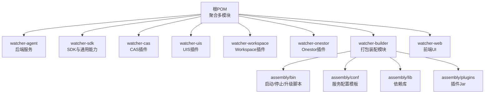
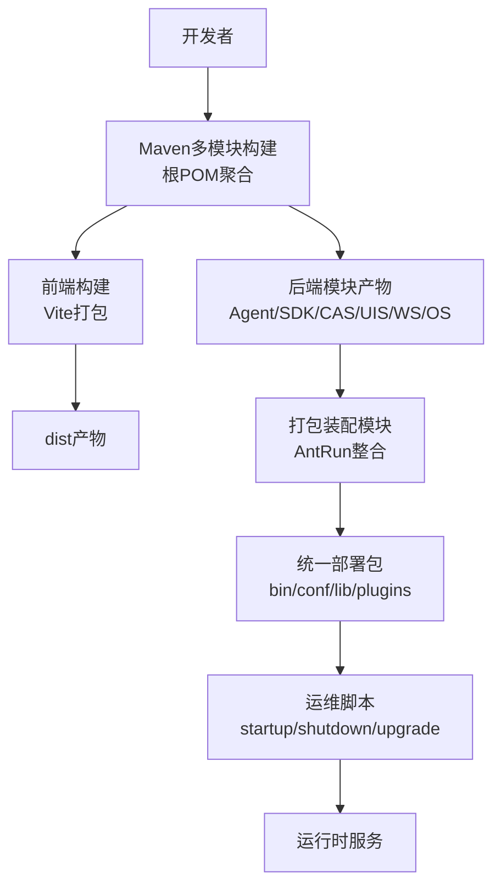
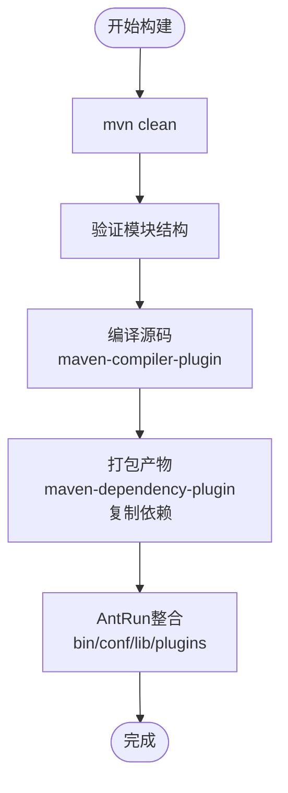
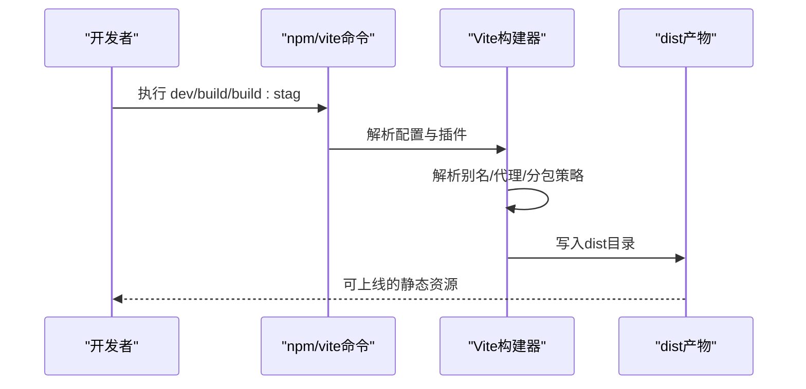
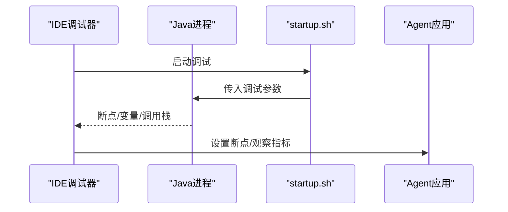
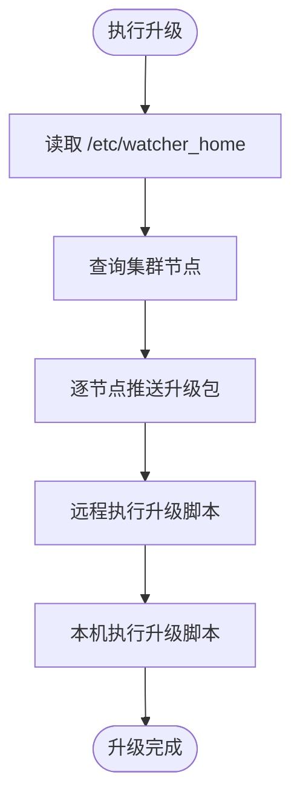
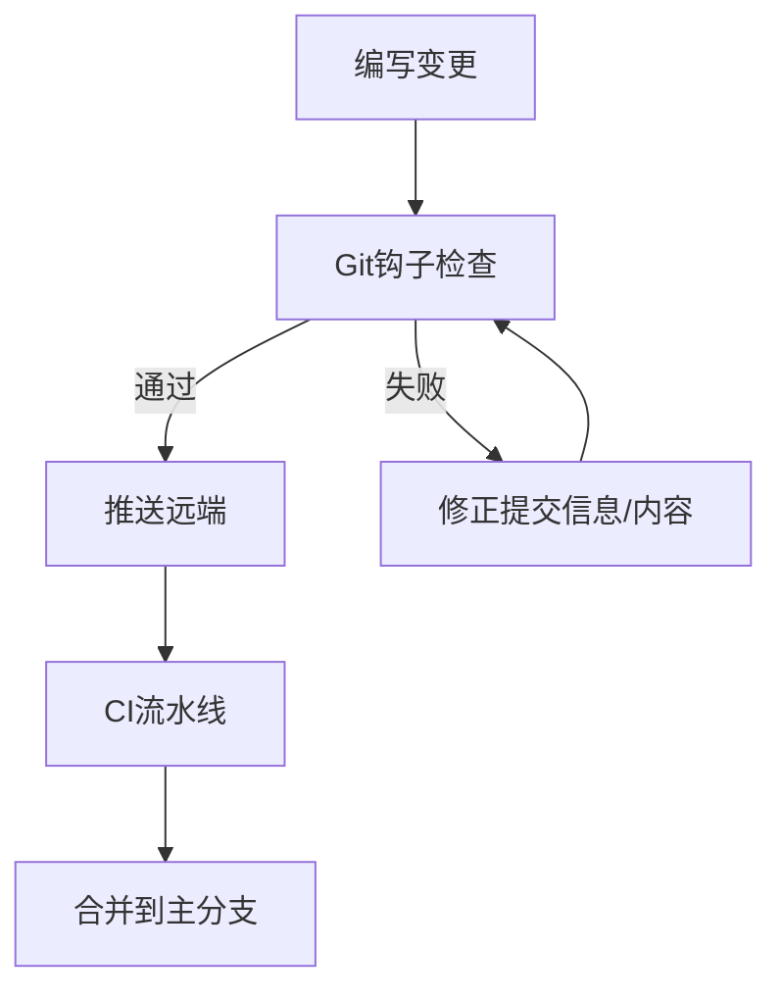
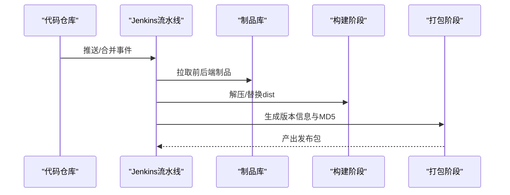
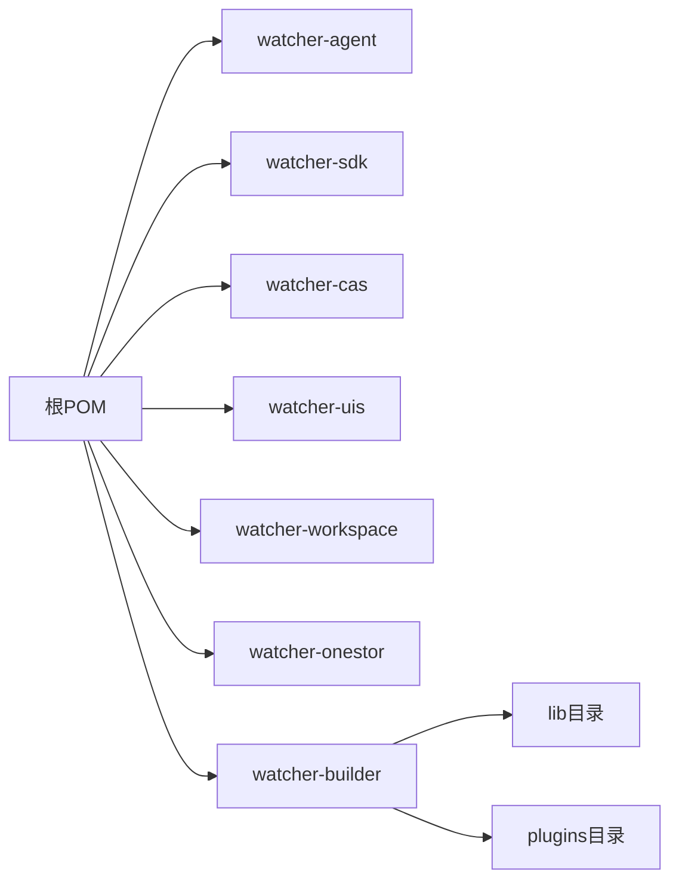

# 开发工具与脚本

<cite>
**本文引用的文件**
- [根POM](file://pom.xml)
- [前端包配置](file://watcher-web/package.json)
- [前端构建配置](file://watcher-web/vite.config.ts)
- [前端类型配置](file://watcher-web/tsconfig.json)
- [CI流水线脚本](file://pipeline.groovy)
- [打包装配模块POM](file://watcher-builder/pom.xml)
- [启动脚本](file://watcher-builder/assembly/bin/startup.sh)
- [停止脚本](file://watcher-builder/assembly/bin/shutdown.sh)
- [升级脚本](file://watcher-builder/assembly/bin/upgrade.sh)
- [Git钩子安装脚本](file://.githooks/setup-hooks.py)
- [提交信息校验脚本](file://.githooks/check_commit_msg.py)
- [Agent应用配置](file://watcher-agent/src/main/resources/application.properties)
- [AI依赖清单](file://watcher-ai/requirements.txt)
</cite>

## 目录
1. [简介](#简介)
2. [项目结构](#项目结构)
3. [核心组件](#核心组件)
4. [架构总览](#架构总览)
5. [详细组件分析](#详细组件分析)
6. [依赖关系分析](#依赖关系分析)
7. [性能考虑](#性能考虑)
8. [故障排查指南](#故障排查指南)
9. [结论](#结论)
10. [附录](#附录)

## 简介
本指南面向ShowTime项目的开发与运维团队，系统性介绍开发工具链与自动化脚本的使用方法，涵盖：
- Maven多模块构建与打包
- 前端Vite构建与产物发布
- 开发调试与远程调试配置
- 测试工具与集成测试实践
- 自动化脚本（启动/停止/升级/打包/监控）
- Docker开发环境与本地部署建议
- Git工具与工作流最佳实践
- 持续集成流水线与部署策略
- 开发效率工具推荐与配置模板

## 项目结构
ShowTime采用多模块Maven聚合工程组织，包含后端各子模块与前端UI模块，并通过独立的打包装配模块统一产出可部署包。

图表来源
- [根POM:11-20](file://pom.xml#L11-L20)
- [打包装配模块POM:1-20](file://watcher-builder/pom.xml#L1-L20)

章节来源
- [根POM:11-20](file://pom.xml#L11-L20)
- [打包装配模块POM:1-20](file://watcher-builder/pom.xml#L1-L20)

## 核心组件
- 构建系统：基于Maven的多模块工程，统一版本与依赖管理，插件管理集中于根POM。
- 前端系统：Vite驱动的Vue3应用，支持开发服务器、代理、分包优化与生产构建。
- 打包装配：通过AntRun插件整合各模块产物与配置，生成统一部署包。
- CI流水线：Groovy脚本定义拉取制品、解压、组装与生成MD5校验文件。
- Git钩子：提交前质量控制（提交信息格式、提交量阈值、自动测试触发、自动合并）。
- 运维脚本：启动/停止/升级脚本，支持远程节点批量升级。

章节来源
- [根POM:22-47](file://pom.xml#L22-L47)
- [前端包配置:4-9](file://watcher-web/package.json#L4-L9)
- [前端构建配置:23-34](file://watcher-web/vite.config.ts#L23-L34)
- [CI流水线脚本:1-33](file://pipeline.groovy#L1-L33)
- [Git钩子安装脚本:44-92](file://.githooks/setup-hooks.py#L44-L92)

## 架构总览
下图展示从代码到可部署包的关键路径与工具链：

图表来源
- [根POM:11-20](file://pom.xml#L11-L20)
- [打包装配模块POM:21-205](file://watcher-builder/pom.xml#L21-L205)
- [前端包配置:4-9](file://watcher-web/package.json#L4-L9)
- [CI流水线脚本:35-71](file://pipeline.groovy#L35-L71)

## 详细组件分析

### Maven多模块构建与打包
- 版本与依赖管理：根POM集中声明Spring Boot版本、常用依赖版本与数据库驱动版本，子模块按需引入。
- 编译与资源处理：统一Java版本与编码；通过maven-resources-plugin复制资源至打包目录下的conf。
- 依赖复制：maven-dependency-plugin在打包阶段输出依赖至lib目录，便于离线部署。
- 打包装配：watcher-builder模块使用maven-antrun-plugin在package阶段执行自定义目标，整合各模块产物与配置，生成bin/conf/lib/plugins目录结构。

图表来源
- [根POM:123-134](file://pom.xml#L123-L134)
- [根POM:136-180](file://pom.xml#L136-L180)
- [打包装配模块POM:17-205](file://watcher-builder/pom.xml#L17-L205)

章节来源
- [根POM:22-47](file://pom.xml#L22-L47)
- [根POM:112-181](file://pom.xml#L112-L181)
- [打包装配模块POM:15-212](file://watcher-builder/pom.xml#L15-L212)

### 前端构建流程与打包配置
- 开发与预览：提供dev与serve脚本，开发服务器监听9090端口，开启代理转发至后端。
- 生产构建：支持生产与预发布两种模式，产物输出至dist目录。
- 构建优化：配置别名与代理规则，手动分包策略提升首屏性能。
- 类型与路径：tsconfig统一路径映射与类型解析，确保TypeScript与Vue单文件组件正确识别。

图表来源
- [前端包配置:4-9](file://watcher-web/package.json#L4-L9)
- [前端构建配置:13-48](file://watcher-web/vite.config.ts#L13-L48)
- [前端类型配置:15-17](file://watcher-web/tsconfig.json#L15-L17)

章节来源
- [前端包配置:1-72](file://watcher-web/package.json#L1-L72)
- [前端构建配置:1-50](file://watcher-web/vite.config.ts#L1-L50)
- [前端类型配置:1-21](file://watcher-web/tsconfig.json#L1-L21)

### 开发调试工具
- IDE调试配置：建议在IDE中为后端模块配置VM参数，如激活profile、指定配置文件位置与JVM内存参数。
- 远程调试：启动脚本已内置远程调试参数，可直接连接调试端口进行断点调试。
- 性能分析：结合GC日志与堆转储路径，定位内存与GC问题；前端可通过浏览器性能面板分析渲染与网络瓶颈。

图表来源
- [启动脚本:78-78](file://watcher-builder/assembly/bin/startup.sh#L78-L78)
- [Agent应用配置:1-80](file://watcher-agent/src/main/resources/application.properties#L1-L80)

章节来源
- [启动脚本:1-81](file://watcher-builder/assembly/bin/startup.sh#L1-L81)
- [Agent应用配置:1-80](file://watcher-agent/src/main/resources/application.properties#L1-L80)

### 测试工具使用
- JUnit测试：后端模块遵循标准Maven结构，使用JUnit进行单元测试；可在IDE中直接运行或通过Maven命令执行。
- Vue测试：前端模块可结合Vitest或Cypress进行单元与端到端测试；建议在CI中集成测试报告与覆盖率统计。
- 集成测试：通过Mock或本地最小化环境启动后端服务，配合前端代理进行端到端验证。

章节来源
- [根POM:11-20](file://pom.xml#L11-L20)

### 自动化脚本使用
- 启动脚本：自动检测Java版本、解析运行时目录、准备日志与GC目录、设置JVM参数并以后台方式启动。
- 停止脚本：通过进程标志匹配查找并终止服务进程。
- 升级脚本：读取/etc/watcher_home定位部署根目录，查询集群节点列表，远程推送升级包并逐个节点执行升级脚本，最后升级本机。

图表来源
- [升级脚本:1-53](file://watcher-builder/assembly/bin/upgrade.sh#L1-L53)

章节来源
- [启动脚本:1-81](file://watcher-builder/assembly/bin/startup.sh#L1-L81)
- [停止脚本:1-26](file://watcher-builder/assembly/bin/shutdown.sh#L1-L26)
- [升级脚本:1-53](file://watcher-builder/assembly/bin/upgrade.sh#L1-L53)

### Docker开发环境配置
- 建议：为后端Agent与数据库分别提供独立镜像，通过docker-compose编排，挂载本地代码与配置，实现热更新与快速回滚。
- 注意：确保容器内JAVA_HOME与时区配置一致；前端通过反向代理暴露端口并与后端服务互通。
- 参考：结合启动脚本中的JVM参数与日志路径，映射到容器内的对应目录。

章节来源
- [启动脚本:62-72](file://watcher-builder/assembly/bin/startup.sh#L62-L72)
- [Agent应用配置:48-51](file://watcher-agent/src/main/resources/application.properties#L48-L51)

### Git工具使用技巧
- 分支管理：采用特性分支开发，主分支仅接受通过CI的合并请求；使用rebase保持提交历史整洁。
- 冲突解决：优先使用变基合并，必要时借助图形化工具查看差异并逐条确认。
- 历史记录管理：避免提交大文件与敏感信息；定期清理无效分支与标签。
- 提交信息规范：通过Git钩子强制提交信息以story/bugfix开头，提升可追溯性。

图表来源
- [.githooks/check_commit_msg.py:12-18](file://.githooks/check_commit_msg.py#L12-L18)
- [.githooks/setup-hooks.py:44-92](file://.githooks/setup-hooks.py#L44-L92)

章节来源
- [.githooks/check_commit_msg.py:1-56](file://.githooks/check_commit_msg.py#L1-L56)
- [.githooks/setup-hooks.py:1-193](file://.githooks/setup-hooks.py#L1-L193)

### 持续集成工具配置
- Jenkins流水线：通过Groovy脚本定义拉取前后端制品、解压、替换前端dist、生成版本信息与MD5校验文件。
- 自动化测试：在流水线中集成后端单元测试与前端测试步骤，失败时阻断发布。
- 部署流程：将最终打包产物推送到制品库或发布到目标环境，结合升级脚本实现灰度与全量发布。

图表来源
- [CI流水线脚本:1-33](file://pipeline.groovy#L1-L33)
- [CI流水线脚本:35-71](file://pipeline.groovy#L35-L71)

章节来源
- [CI流水线脚本:1-72](file://pipeline.groovy#L1-L72)

### 开发效率工具推荐与配置模板
- IDE：IntelliJ IDEA或VS Code，启用TypeScript/Vue插件与代码格式化；配置JVM调试参数模板。
- 前端：Vite插件生态（如mock、i18n），合理拆分chunk与懒加载。
- 后端：Spring Boot DevTools（开发环境）、Actuator健康检查、日志级别动态调整。
- Git：husky + lint-staged（提交前检查），配合钩子脚本统一团队规范。
- AI辅助：watcher-ai模块提供Python依赖清单，可作为智能提示与数据处理的补充。

章节来源
- [AI依赖清单:1-5](file://watcher-ai/requirements.txt#L1-L5)

## 依赖关系分析
- 组件耦合：打包装配模块对各后端模块产物存在显式依赖，需保证构建顺序与产物一致性。
- 外部依赖：前端依赖以Node版本要求为准；后端依赖由根POM统一管理，注意版本兼容性。
- 运行时依赖：启动脚本通过-Dloader.path加载lib与plugins目录，确保运行时类可见性。

图表来源
- [根POM:11-20](file://pom.xml#L11-L20)
- [打包装配模块POM:34-198](file://watcher-builder/pom.xml#L34-L198)

章节来源
- [根POM:11-20](file://pom.xml#L11-L20)
- [打包装配模块POM:34-198](file://watcher-builder/pom.xml#L34-L198)

## 性能考虑
- 后端：合理设置JVM堆大小与GC参数，开启GC日志轮转与OOM堆转储；避免循环依赖与长事务。
- 前端：利用Vite的分包策略与按需加载，减少首屏体积；通过代理与缓存策略优化开发体验。
- CI：并行执行测试与构建任务，缩短流水线时长；制品缓存与增量构建降低重复工作。

## 故障排查指南
- 启动失败：检查JAVA_HOME与Java版本，确认JVM参数与配置文件路径；查看logs目录下的错误输出与GC日志。
- 远程调试：确认调试端口未被占用，IDE与脚本端口一致；必要时临时关闭防火墙策略。
- 升级异常：核对/etc/watcher_home路径与权限；检查SSH免密与网络连通性；查看升级日志定位失败节点。
- Git钩子：若提交被拦截，依据钩子输出修正提交信息或调整阈值；使用--show查看当前配置。

章节来源
- [启动脚本:1-25](file://watcher-builder/assembly/bin/startup.sh#L1-L25)
- [停止脚本:20-24](file://watcher-builder/assembly/bin/shutdown.sh#L20-L24)
- [升级脚本:8-13](file://watcher-builder/assembly/bin/upgrade.sh#L8-L13)
- [.githooks/check_commit_msg.py:21-51](file://.githooks/check_commit_msg.py#L21-L51)
- [.githooks/setup-hooks.py:98-111](file://.githooks/setup-hooks.py#L98-L111)

## 结论
通过标准化的Maven多模块构建、Vite前端工程化、完善的Git钩子与CI流水线，以及可复用的运维脚本，ShowTime项目实现了高效的开发与交付闭环。建议团队在日常工作中坚持规范提交、持续测试与自动化发布，以保障质量与效率。

## 附录
- 快速命令参考
  - 后端：mvn clean package（含依赖复制与资源复制）
  - 前端：npm run dev / npm run build / npm run build:stag
  - CI：Jenkins执行pipeline.groovy
  - 运维：./startup.sh / ./shutdown.sh / ./upgrade.sh
- 配置模板
  - 应用配置：application.properties（示例路径见Agent资源目录）
  - 前端别名与代理：vite.config.ts（别名与代理规则）
  - Git钩子：setup-hooks.py（安装与配置）