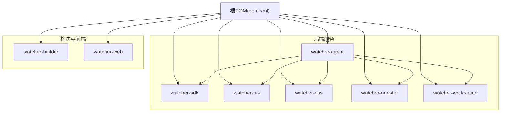
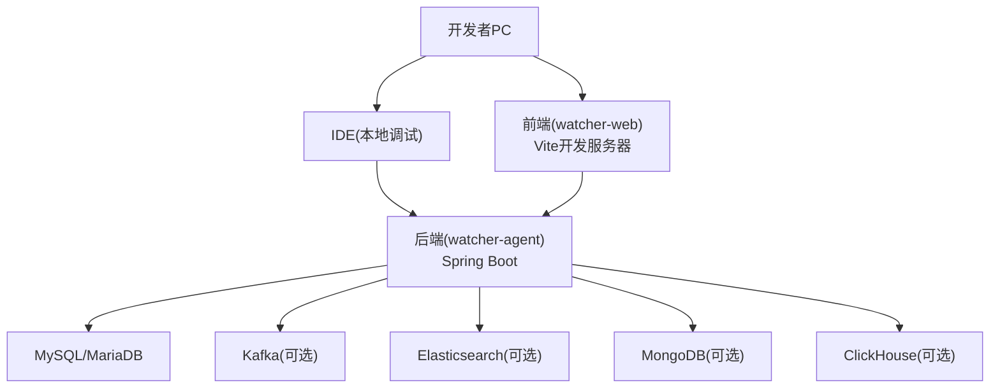
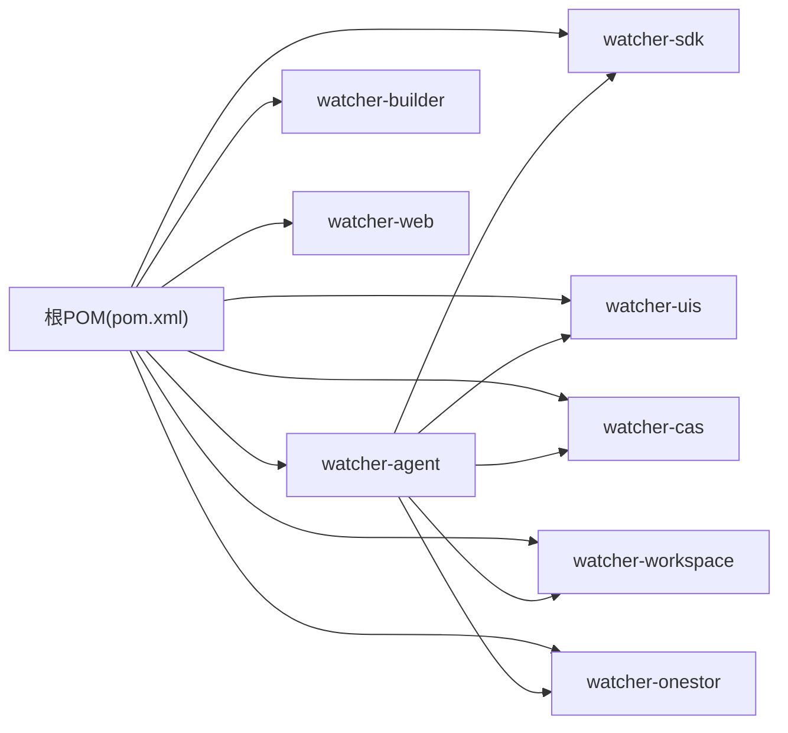
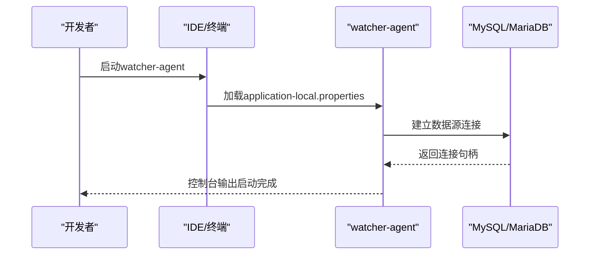

# 开发环境搭建

<cite>
**本文引用的文件**
- [根POM](file://pom.xml)
- [Agent模块POM](file://watcher-agent/pom.xml)
- [Web前端package.json](file://watcher-web/package.json)
- [AI模块requirements.txt](file://watcher-ai/requirements.txt)
- [Agent应用配置(application.properties)](file://watcher-agent/src/main/resources/application.properties)
- [Agent本地配置(application-local.properties)](file://watcher-agent/src/main/resources/application-local.properties)
- [Agent开发配置(application-dev.properties)](file://watcher-agent/src/main/resources/application-dev.properties)
- [Agent日志配置(logback-dev.xml)](file://watcher-agent/src/main/resources/logback-dev.xml)
- [Agent数据库初始化SQL(schema-mysql.sql)](file://watcher-agent/src/main/resources/schema-mysql.sql)
- [Agent数据库ClickHouse建表(init.sql)](file://watcher-agent/src/main/resources/database/init.sql)
- [打包脚本startup.sh](file://watcher-builder/assembly/bin/startup.sh)
- [系统服务配置(agent.service)](file://watcher-builder/assembly/conf/agent.service)
- [README](file://Readme.md)
</cite>

## 目录
1. [简介](#简介)
2. [项目结构](#项目结构)
3. [核心组件](#核心组件)
4. [架构总览](#架构总览)
5. [详细组件分析](#详细组件分析)
6. [依赖关系分析](#依赖关系分析)
7. [性能考虑](#性能考虑)
8. [故障排除指南](#故障排除指南)
9. [结论](#结论)
10. [附录](#附录)

## 简介
本指南面向ShowTime监控系统的开发者，提供从零开始的本地开发环境搭建方法，涵盖以下方面：
- JDK 8+、Maven、Node.js/npm、Python环境准备
- IDE（IntelliJ IDEA、VS Code、Eclipse）项目导入与配置
- 数据库环境（MySQL、MongoDB、Elasticsearch）安装与初始化
- Docker本地开发与测试配置建议
- 环境变量与配置文件详解
- 常见问题排查与验证步骤

## 项目结构
ShowTime采用多模块Maven聚合工程，核心模块包括：
- watcher-agent：采集与调度服务（Spring Boot）
- watcher-sdk：公共配置、DTO、工具类
- watcher-uis：统一身份与资源服务
- watcher-cas：认证服务
- watcher-onestor：存储监控服务
- watcher-workspace：工作空间服务
- watcher-builder：打包与系统服务配置
- watcher-web：前端Vue3应用

图表来源
- [根POM:11-20](file://pom.xml#L11-L20)
- [Agent模块POM:5-50](file://watcher-agent/pom.xml#L5-L50)

章节来源
- [根POM:11-20](file://pom.xml#L11-L20)
- [README:29-38](file://Readme.md#L29-L38)

## 核心组件
- 后端框架：Spring Boot 2.5.x（基于Maven属性统一管理）
- 数据库：MySQL（单机版）+ MariaDB驱动；ClickHouse（列式数据库）
- 搜索与日志：Elasticsearch（可选）、MongoDB（可选）
- 消息队列：Kafka（可选）
- 定时任务：Quartz（可选）
- 前端：Vue3 + Vite
- AI能力：Python依赖（FastMCP、Pydantic等）

章节来源
- [根POM:22-47](file://pom.xml#L22-L47)
- [README:11-26](file://Readme.md#L11-L26)

## 架构总览
下图展示了本地开发模式下的典型交互：IDE运行后端服务，浏览器访问前端，后端通过配置连接本地或虚拟机中的中间件。

图表来源
- [Agent应用配置(application.properties):46-70](file://watcher-agent/src/main/resources/application.properties#L46-L70)
- [Agent本地配置(application-local.properties):33-54](file://watcher-agent/src/main/resources/application-local.properties#L33-L54)

## 详细组件分析

### JDK与Maven环境
- JDK版本要求：Java 8及以上（根POM定义为1.8，打包脚本校验≥1.8）
- Maven：用于后端模块构建与依赖管理
- 推荐：使用SDKMAN!或Jabba管理多版本JDK；确保JAVA_HOME与PATH正确

章节来源
- [根POM](file://pom.xml#L29)
- [打包脚本startup.sh:16-22](file://watcher-builder/assembly/bin/startup.sh#L16-L22)

### Node.js与npm
- Node.js版本：>= 14.19.0（前端package.json engines字段）
- npm：随Node.js自带，或使用cnpm/yarn加速
- 前端工作流：Vite开发服务器、构建与预览命令在package.json scripts中定义

章节来源
- [Web前端package.json:17-19](file://watcher-web/package.json#L17-L19)
- [Web前端package.json:4-10](file://watcher-web/package.json#L4-L10)

### Python环境（AI模块）
- Python版本：建议使用Python 3.8+
- 依赖：requirements.txt中声明了FastMCP、Pydantic、httpx、python-dotenv等
- 建议：使用虚拟环境隔离依赖，避免与系统Python冲突

章节来源
- [AI模块requirements.txt:1-5](file://watcher-ai/requirements.txt#L1-L5)

### IDE推荐配置

#### IntelliJ IDEA
- 导入：打开根POM文件，选择“Add as Maven Project”
- 设置：
  - Project SDK：JDK 8+
  - Maven Settings：指向本地settings.xml（如需代理）
  - 编码：UTF-8
  - 语言级别：1.8
- 运行配置：
  - 新建“Spring Boot”运行配置，选择watcher-agent主类
  - VM Options：按需添加日志与JVM参数
  - Environment Variables：设置spring.profiles.active与自定义变量

章节来源
- [根POM:22-47](file://pom.xml#L22-L47)
- [Agent模块POM:14-136](file://watcher-agent/pom.xml#L14-L136)

#### VS Code
- 扩展：推荐安装ESLint、Vetur/Volar、TypeScript Importer、Auto Rename Tag等
- 前端：
  - 在watcher-web目录执行npm install
  - 使用Tasks或终端运行dev/build命令
- 后端：
  - 使用Spring Boot Extension Pack
  - 通过launch.json配置调试（选择watcher-agent主类）

章节来源
- [Web前端package.json:4-10](file://watcher-web/package.json#L4-L10)

#### Eclipse
- 导入：File → Import → Maven → Existing Maven Projects，选择仓库根目录
- 设置：
  - JavaSE-1.8或更高
  - Maven编码UTF-8
- 运行：右键项目 → Run As → Spring Boot App（若安装STS）

章节来源
- [根POM:22-47](file://pom.xml#L22-L47)

### 数据库环境搭建

#### MySQL（单机版）
- 安装：使用官方安装包或容器
- 初始化：
  - 创建数据库与用户
  - 执行schema-mysql.sql完成表结构与索引初始化
  - 参考application-local.properties中的连接参数进行校验
- 建议：使用MariaDB驱动（根POM中定义），兼容MySQL

章节来源
- [Agent本地配置(application-local.properties):33-36](file://watcher-agent/src/main/resources/application-local.properties#L33-L36)
- [Agent数据库初始化SQL(schema-mysql.sql):5-204](file://watcher-agent/src/main/resources/schema-mysql.sql#L5-L204)

#### MongoDB（可选）
- 安装：社区版或容器部署
- 连接：参考application-dev.properties中的URI与索引创建配置
- 注意：本地开发可禁用以减少依赖

章节来源
- [Agent开发配置(application-dev.properties):3-5](file://watcher-agent/src/main/resources/application-dev.properties#L3-L5)

#### Elasticsearch（可选）
- 安装：单机或集群模式
- 连接：参考application-dev.properties中的集群名、账号、主机与超时配置
- 注意：本地开发可禁用以降低资源占用

章节来源
- [Agent开发配置(application-dev.properties):10-31](file://watcher-agent/src/main/resources/application-dev.properties#L10-L31)

#### ClickHouse（可选）
- 安装：单机或集群
- 初始化：执行init.sql创建表结构
- 连接：参考application-dev.properties中的endpoint、user、password、database

章节来源
- [Agent开发配置(application-dev.properties):65-69](file://watcher-agent/src/main/resources/application-dev.properties#L65-L69)
- [Agent数据库ClickHouse建表(init.sql):1-12](file://watcher-agent/src/main/resources/database/init.sql#L1-L12)

### Docker环境配置（建议）
- 目标：以容器快速拉起MySQL、MongoDB、Elasticsearch、ClickHouse等中间件，便于本地联调
- 建议：使用docker-compose编排，挂载数据卷与日志目录
- 注意：容器网络与主机端口映射需与配置文件保持一致

[本节为通用实践建议，不直接分析具体文件，故无章节来源]

### 环境变量与配置详解

#### 后端配置文件层次
- application.properties：基础配置与profile切换
- application-local.properties：本地MySQL单机版配置
- application-dev.properties：开发环境可选中间件配置

章节来源
- [Agent应用配置(application.properties):1-80](file://watcher-agent/src/main/resources/application.properties#L1-L80)
- [Agent本地配置(application-local.properties):1-61](file://watcher-agent/src/main/resources/application-local.properties#L1-L61)
- [Agent开发配置(application-dev.properties):1-72](file://watcher-agent/src/main/resources/application-dev.properties#L1-L72)

#### 关键配置项说明
- 服务端口与上下文：server.port、server.servlet.context-path
- 数据源：spring.datasource.url、username、password、driver-class-name
- MyBatis-Plus：mapper-locations、type-aliases-package、驼峰映射与日志实现
- Actuator：management端点暴露与健康检查详情
- 中间件开关：elasticsearch.enable、kafka.enable、mongodb.enable、clickhouse.enable、quartz.enable
- 插件模块开关：rest-client.cas.enable、rest-client.uis.enable、rest-client.ws.enable、rest-client.onestor.enable
- 插件服务地址：cas.service.url、uis.service.url、ws.service.url、onestor.service.url
- AI/Workspace相关：batch.collect.log.dir.name、vdi.ws.admin.username/password等

章节来源
- [Agent应用配置(application.properties):1-80](file://watcher-agent/src/main/resources/application.properties#L1-L80)
- [Agent本地配置(application-local.properties):6-61](file://watcher-agent/src/main/resources/application-local.properties#L6-L61)
- [Agent开发配置(application-dev.properties):3-72](file://watcher-agent/src/main/resources/application-dev.properties#L3-L72)

#### 日志配置
- logback-dev.xml：控制台与滚动文件输出、大小与历史限制、特定包日志级别
- 日志目录：通过相对路径../logs输出，便于IDE与容器内查看

章节来源
- [Agent日志配置(logback-dev.xml):1-44](file://watcher-agent/src/main/resources/logback-dev.xml#L1-L44)

#### 打包与系统服务
- startup.sh：检测Java版本、设置JVM参数、加载配置与插件目录、以nohup方式启动agent.jar
- agent.service：systemd服务模板，ExecStart指向startup.sh

章节来源
- [打包脚本startup.sh:1-81](file://watcher-builder/assembly/bin/startup.sh#L1-L81)
- [系统服务配置(agent.service):1-14](file://watcher-builder/assembly/conf/agent.service#L1-L14)

### 验证环境是否正确搭建

#### 后端验证步骤
- 启动watcher-agent（IDE或命令行），观察日志输出
- 访问Actuator健康端点：http://localhost:8888/watcher/actuator/health
- 若启用MySQL：确认数据库连接成功并能读写
- 若启用其他中间件：确认对应服务可达且配置生效

章节来源
- [Agent应用配置(application.properties):10-11](file://watcher-agent/src/main/resources/application.properties#L10-L11)
- [Agent本地配置(application-local.properties):59-61](file://watcher-agent/src/main/resources/application-local.properties#L59-L61)

#### 前端验证步骤
- 在watcher-web目录执行npm install
- 启动开发服务器：npm run dev
- 浏览器访问默认地址，检查页面渲染与接口连通性

章节来源
- [Web前端package.json:4-10](file://watcher-web/package.json#L4-L10)

#### 数据库验证步骤
- 登录MySQL，确认数据库与表存在
- 执行基础查询，验证索引与字段
- 如使用MariaDB驱动，请确保驱动版本兼容

章节来源
- [Agent数据库初始化SQL(schema-mysql.sql):5-204](file://watcher-agent/src/main/resources/schema-mysql.sql#L5-L204)

#### 中间件验证步骤（可选）
- Elasticsearch：访问Kibana或ES API确认集群健康
- MongoDB：连接客户端确认集合存在
- ClickHouse：执行建表语句并写入样例数据

章节来源
- [Agent开发配置(application-dev.properties):10-31](file://watcher-agent/src/main/resources/application-dev.properties#L10-L31)
- [Agent数据库ClickHouse建表(init.sql):1-12](file://watcher-agent/src/main/resources/database/init.sql#L1-L12)

## 依赖关系分析

图表来源
- [根POM:11-20](file://pom.xml#L11-L20)
- [Agent模块POM:24-50](file://watcher-agent/pom.xml#L24-L50)

章节来源
- [根POM:11-20](file://pom.xml#L11-L20)
- [Agent模块POM:24-50](file://watcher-agent/pom.xml#L24-L50)

## 性能考虑
- JVM参数：startup.sh中设置了堆大小与GC日志轮转，可根据机器配置调整
- 日志级别：生产环境建议提升日志级别，减少IO开销
- 数据库连接池：结合MyBatis-Plus与Spring Boot默认配置，避免过度连接
- 中间件：开发阶段可按需启用，减少不必要的网络请求与资源消耗

章节来源
- [打包脚本startup.sh:62-72](file://watcher-builder/assembly/bin/startup.sh#L62-L72)
- [Agent日志配置(logback-dev.xml):37-43](file://watcher-agent/src/main/resources/logback-dev.xml#L37-L43)

## 故障排除指南

- Java版本不匹配
  - 现象：启动脚本报错或JVM参数不生效
  - 处理：确保JAVA_HOME指向JDK 8+，PATH优先级正确

- Node版本过低
  - 现象：npm install失败或Vite无法启动
  - 处理：升级至>=14.19.0，清理缓存后重试

- 数据库连接失败
  - 现象：启动时报错无法获取连接
  - 处理：核对application-local.properties中的URL、用户名、密码；确认MySQL/MariaDB服务已启动

- 中间件未启用但报错
  - 现象：未启用的中间件仍被尝试连接
  - 处理：将对应enable=false，并确认插件开关也相应关闭

- 日志输出异常
  - 现象：日志文件未生成或权限不足
  - 处理：检查logback-dev.xml中的LOG_HOME路径，确保目录可写

- 端口冲突
  - 现象：8888端口被占用
  - 处理：修改server.port或释放端口

章节来源
- [打包脚本startup.sh:16-25](file://watcher-builder/assembly/bin/startup.sh#L16-L25)
- [Web前端package.json:17-19](file://watcher-web/package.json#L17-L19)
- [Agent本地配置(application-local.properties):33-36](file://watcher-agent/src/main/resources/application-local.properties#L33-L36)
- [Agent应用配置(application.properties):16-28](file://watcher-agent/src/main/resources/application.properties#L16-L28)
- [Agent日志配置(logback-dev.xml):4-6](file://watcher-agent/src/main/resources/logback-dev.xml#L4-L6)

## 结论
通过以上步骤，您可以在本地快速搭建ShowTime监控系统的开发环境。建议先完成JDK/Maven、MySQL与前端依赖的安装，再逐步启用可选中间件。遇到问题时，优先检查配置文件与端口占用，并结合日志定位根因。

## 附录

### 快速清单
- JDK 8+、Maven、Node.js 14+、Python 3.8+
- MySQL/MariaDB已初始化schema-mysql.sql
- watcher-web执行npm install并启动开发服务器
- 如需中间件：安装并配置MongoDB、Elasticsearch、ClickHouse
- 启动watcher-agent，访问Actuator健康端点验证

### 参考流程（后端启动顺序）

图表来源
- [Agent本地配置(application-local.properties):33-36](file://watcher-agent/src/main/resources/application-local.properties#L33-L36)
- [Agent应用配置(application.properties):10-11](file://watcher-agent/src/main/resources/application.properties#L10-L11)