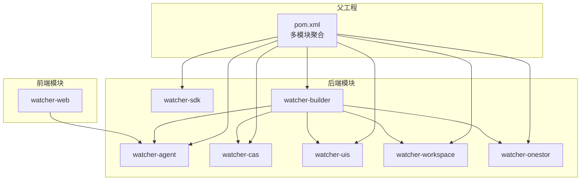
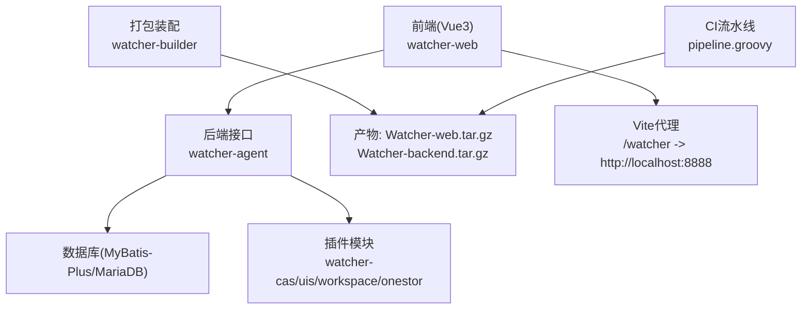
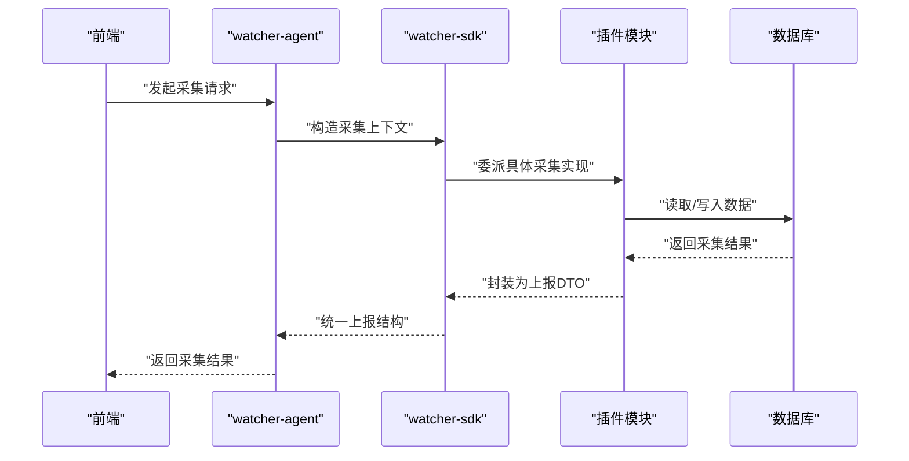
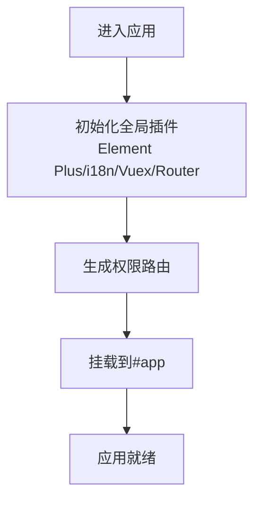
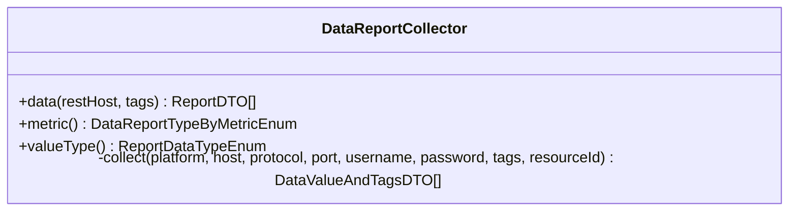
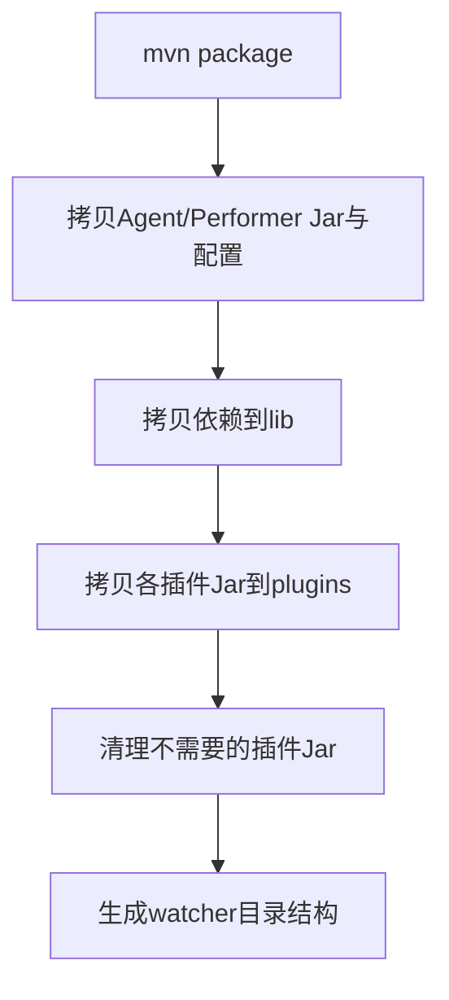
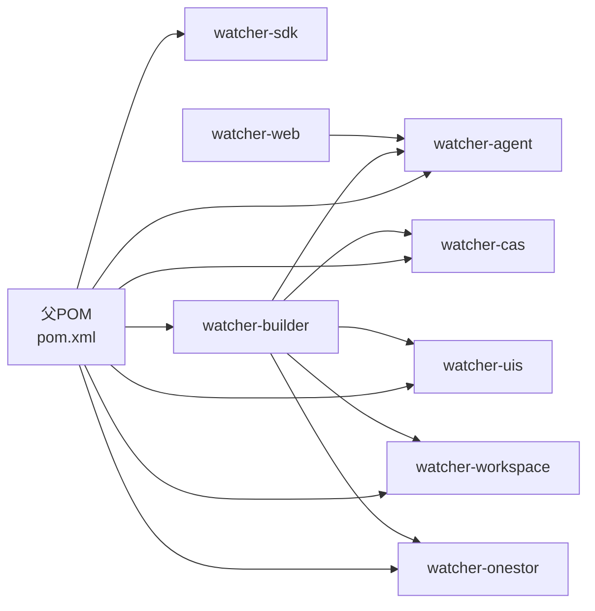

# 开发者指南

<cite>
**本文引用的文件**
- [Readme.md](file://Readme.md)
- [pom.xml](file://pom.xml)
- [watcher-agent/src/main/java/com/virtual/cloud/om/agent/WatcherAgentApplication.java](file://watcher-agent/src/main/java/com/virtual/cloud/om/agent/WatcherAgentApplication.java)
- [watcher-agent/src/main/resources/application.properties](file://watcher-agent/src/main/resources/application.properties)
- [watcher-web/package.json](file://watcher-web/package.json)
- [watcher-web/vite.config.ts](file://watcher-web/vite.config.ts)
- [watcher-web/src/main.ts](file://watcher-web/src/main.ts)
- [watcher-web/tsconfig.json](file://watcher-web/tsconfig.json)
- [watcher-sdk/src/main/java/com/virtual/cloud/om/sdk/api/DataReportCollector.java](file://watcher-sdk/src/main/java/com/virtual/cloud/om/sdk/api/DataReportCollector.java)
- [watcher-builder/pom.xml](file://watcher-builder/pom.xml)
- [.githooks/setup-hooks.py](file://.githooks/setup-hooks.py)
- [.githooks/check_commit_msg.py](file://.githooks/check_commit_msg.py)
- [.githooks/run_unit_tests.py](file://.githooks/run_unit_tests.py)
- [pipeline.groovy](file://pipeline.groovy)
</cite>

## 目录
1. [简介](#简介)
2. [项目结构](#项目结构)
3. [核心组件](#核心组件)
4. [架构总览](#架构总览)
5. [详细组件分析](#详细组件分析)
6. [依赖分析](#依赖分析)
7. [性能与可维护性建议](#性能与可维护性建议)
8. [故障排查指南](#故障排查指南)
9. [结论](#结论)
10. [附录](#附录)

## 简介
本指南面向ShowTime监控系统的开发者，覆盖从环境搭建、代码规范、贡献流程、扩展开发、项目结构、开发工具与脚本、调试技巧到持续集成与自动化部署的完整链路。ShowTime采用多模块Maven聚合工程，后端以Spring Boot为核心，前端基于Vue3/Vite，配合Quartz定时任务、MyBatis-Plus、MariaDB以及可选的中间件生态（Elasticsearch/Kafka/MongoDB/ClickHouse）。采集端前端与后端通过代理联调，打包阶段由Jenkins流水线驱动。

## 项目结构
项目采用“父工程 + 多模块”的组织方式，模块职责清晰：
- watcher-agent：采集端主服务，负责资源管理、定时采集、日志策略下发等
- watcher-sdk：公共API、DTO、常量、工具类与AOP切面
- watcher-cas / watcher-uis / watcher-workspace / watcher-onestor：各产品线的采集与解析插件
- watcher-builder：打包装配模块，负责产出可部署的tar包及插件目录
- watcher-web：采集端前端（Vue3 + Vite）

图表来源
- [pom.xml:11-20](file://pom.xml#L11-L20)
- [watcher-builder/pom.xml:12-14](file://watcher-builder/pom.xml#L12-L14)

章节来源
- [Readme.md:27-45](file://Readme.md#L27-L45)
- [pom.xml:11-20](file://pom.xml#L11-L20)

## 核心组件
- 应用入口与扫描路径
  - 后端应用入口类声明了组件扫描范围与定时任务启用，并排除了Quartz自动配置以便集中管理
  - 参考路径：[watcher-agent/src/main/java/com/virtual/cloud/om/agent/WatcherAgentApplication.java:14-18](file://watcher-agent/src/main/java/com/virtual/cloud/om/agent/WatcherAgentApplication.java#L14-L18)
- 配置与中间件开关
  - application.properties中集中关闭了Elasticsearch/Kafka/MongoDB/ClickHouse/Quartz等中间件，便于本地开发；同时保留插件服务地址占位，避免启动失败
  - 参考路径：[watcher-agent/src/main/resources/application.properties:14-30](file://watcher-agent/src/main/resources/application.properties#L14-L30)
- 前端入口与构建
  - Vue3应用在main.ts中完成插件注册、国际化、权限路由初始化与挂载
  - Vite配置定义了别名、代理、构建分包策略与开发服务器参数
  - 参考路径：
    - [watcher-web/src/main.ts:24-36](file://watcher-web/src/main.ts#L24-L36)
    - [watcher-web/vite.config.ts:9-47](file://watcher-web/vite.config.ts#L9-L47)
- SDK采集抽象
  - SDK提供统一的数据上报采集抽象类，定义了采集流程、标签解析、时间戳处理等通用逻辑
  - 参考路径：[watcher-sdk/src/main/java/com/virtual/cloud/om/sdk/api/DataReportCollector.java:48-86](file://watcher-sdk/src/main/java/com/virtual/cloud/om/sdk/api/DataReportCollector.java#L48-L86)

章节来源
- [watcher-agent/src/main/java/com/virtual/cloud/om/agent/WatcherAgentApplication.java:14-18](file://watcher-agent/src/main/java/com/virtual/cloud/om/agent/WatcherAgentApplication.java#L14-L18)
- [watcher-agent/src/main/resources/application.properties:14-30](file://watcher-agent/src/main/resources/application.properties#L14-L30)
- [watcher-web/src/main.ts:24-36](file://watcher-web/src/main.ts#L24-L36)
- [watcher-web/vite.config.ts:9-47](file://watcher-web/vite.config.ts#L9-L47)
- [watcher-sdk/src/main/java/com/virtual/cloud/om/sdk/api/DataReportCollector.java:48-86](file://watcher-sdk/src/main/java/com/virtual/cloud/om/sdk/api/DataReportCollector.java#L48-L86)

## 架构总览
下图展示了前后端交互与打包装配的关键节点：

图表来源
- [watcher-web/vite.config.ts:27-33](file://watcher-web/vite.config.ts#L27-L33)
- [watcher-builder/pom.xml:25-106](file://watcher-builder/pom.xml#L25-L106)
- [pipeline.groovy:1-33](file://pipeline.groovy#L1-L33)

## 详细组件分析

### 组件A：采集端后端（watcher-agent）
- 职责
  - 资源管理、定时任务调度、日志策略下发、与SDK/插件协作进行指标/日志采集
- 关键点
  - 组件扫描路径覆盖agent、sdk、cas、uis、workspace、onestor等包域
  - 排除Quartz自动配置，集中管理定时任务
  - application.properties中对中间件与插件服务进行开关与占位配置
- 典型调用序列（采集流程示意）

图表来源
- [watcher-agent/src/main/java/com/virtual/cloud/om/agent/WatcherAgentApplication.java:14-18](file://watcher-agent/src/main/java/com/virtual/cloud/om/agent/WatcherAgentApplication.java#L14-L18)
- [watcher-sdk/src/main/java/com/virtual/cloud/om/sdk/api/DataReportCollector.java:48-86](file://watcher-sdk/src/main/java/com/virtual/cloud/om/sdk/api/DataReportCollector.java#L48-L86)

章节来源
- [watcher-agent/src/main/java/com/virtual/cloud/om/agent/WatcherAgentApplication.java:14-18](file://watcher-agent/src/main/java/com/virtual/cloud/om/agent/WatcherAgentApplication.java#L14-L18)
- [watcher-agent/src/main/resources/application.properties:14-30](file://watcher-agent/src/main/resources/application.properties#L14-L30)

### 组件B：前端（watcher-web）
- 职责
  - 用户界面、路由、状态管理、国际化、组件库集成与API调用
- 关键点
  - Vite开发服务器监听9090端口，通过代理将/watcher前缀转发至后端
  - main.ts中完成Element Plus、i18n、Vuex、路由、指令等初始化
  - TypeScript编译选项严格，路径别名@指向src
- 典型流程（页面加载与权限路由）

图表来源
- [watcher-web/src/main.ts:24-36](file://watcher-web/src/main.ts#L24-L36)
- [watcher-web/vite.config.ts:23-34](file://watcher-web/vite.config.ts#L23-L34)
- [watcher-web/tsconfig.json:2-18](file://watcher-web/tsconfig.json#L2-L18)

章节来源
- [watcher-web/src/main.ts:24-36](file://watcher-web/src/main.ts#L24-L36)
- [watcher-web/vite.config.ts:23-34](file://watcher-web/vite.config.ts#L23-L34)
- [watcher-web/tsconfig.json:2-18](file://watcher-web/tsconfig.json#L2-L18)

### 组件C：SDK采集抽象（watcher-sdk）
- 职责
  - 定义采集抽象接口与通用处理流程，屏蔽不同平台/资源类型的差异
- 关键点
  - data方法统一采集入口，负责日志记录、时间戳填充、空值兜底
  - collect为抽象采集方法，由具体插件实现
  - metric与valueType决定上报指标与数据类型
- 类关系图

图表来源
- [watcher-sdk/src/main/java/com/virtual/cloud/om/sdk/api/DataReportCollector.java:48-118](file://watcher-sdk/src/main/java/com/virtual/cloud/om/sdk/api/DataReportCollector.java#L48-L118)

章节来源
- [watcher-sdk/src/main/java/com/virtual/cloud/om/sdk/api/DataReportCollector.java:48-118](file://watcher-sdk/src/main/java/com/virtual/cloud/om/sdk/api/DataReportCollector.java#L48-L118)

### 组件D：打包装配（watcher-builder）
- 职责
  - 将后端Jar、配置、依赖与各插件复制到统一目录结构，生成可部署包
- 关键点
  - 使用maven-antrun-plugin在package阶段执行拷贝与清理
  - 清理掉不需要的插件Jar，确保产物精简
- 打包流程图

图表来源
- [watcher-builder/pom.xml:25-106](file://watcher-builder/pom.xml#L25-L106)

章节来源
- [watcher-builder/pom.xml:25-106](file://watcher-builder/pom.xml#L25-L106)

## 依赖分析
- 版本与依赖管理
  - 父POM统一管理Spring Boot版本、常用依赖版本与编译插件
  - 依赖管理中引入watcher-sdk作为公共依赖，便于模块复用
- 模块间耦合
  - watcher-agent通过组件扫描与SDK协作，插件模块以Jar形式被watcher-builder装配
  - watcher-web通过代理访问watcher-agent提供的REST接口
- CI与打包
  - pipeline.groovy定义了前后端打包产物命名与归档流程

图表来源
- [pom.xml:49-108](file://pom.xml#L49-L108)
- [pom.xml:65-69](file://pom.xml#L65-L69)
- [watcher-builder/pom.xml:12-14](file://watcher-builder/pom.xml#L12-L14)

章节来源
- [pom.xml:49-108](file://pom.xml#L49-L108)
- [pom.xml:65-69](file://pom.xml#L65-L69)
- [watcher-builder/pom.xml:12-14](file://watcher-builder/pom.xml#L12-L14)

## 性能与可维护性建议
- 后端
  - 合理拆分定时任务，避免阻塞；利用SDK的统一采集抽象减少重复逻辑
  - 数据库层使用MyBatis-Plus的分页与映射配置，保持SQL可读性
- 前端
  - Vite已内置按需分包策略，建议继续优化第三方库的拆分与懒加载
  - TypeScript严格模式有助于早期发现类型问题
- 打包
  - watcher-builder中对插件Jar的清理可避免冗余依赖影响启动性能

[本节为通用建议，无需列出章节来源]

## 故障排查指南
- Git钩子
  - 提交信息格式校验：要求以story或bugfix开头，否则拒绝提交
  - 单元测试自动执行：可在commit前自动运行测试，失败则阻止提交
  - 安装与配置：通过setup-hooks.py一键启用/禁用各项hook，并支持交互式配置
- 常见问题定位
  - 前端无法访问后端接口：检查Vite代理配置是否正确指向后端端口
  - 本地启动中间件：application.properties中已关闭相关中间件，按需开启或连接外部实例
  - 插件未生效：确认watcher-builder已将对应插件Jar复制到plugins目录

章节来源
- [.githooks/check_commit_msg.py:12-18](file://.githooks/check_commit_msg.py#L12-L18)
- [.githooks/run_unit_tests.py:200-246](file://.githooks/run_unit_tests.py#L200-L246)
- [.githooks/setup-hooks.py:44-92](file://.githooks/setup-hooks.py#L44-L92)
- [watcher-web/vite.config.ts:27-33](file://watcher-web/vite.config.ts#L27-L33)
- [watcher-agent/src/main/resources/application.properties:14-30](file://watcher-agent/src/main/resources/application.properties#L14-L30)

## 结论
本指南从环境搭建、规范与流程、扩展开发、结构与依赖、工具与脚本、调试与CI六个维度帮助开发者快速上手ShowTime。建议在本地优先验证watcher-web与watcher-agent的联调，再逐步接入插件模块与打包流程，最终通过CI流水线完成自动化交付。

[本节为总结性内容，无需列出章节来源]

## 附录

### A. 开发环境搭建与IDE配置
- JDK与Maven
  - 使用Java 8，确保Maven版本兼容父POM中的插件版本
- IDE建议
  - IntelliJ IDEA：启用Lombok注解处理、启用TypeScript支持、配置Vite运行配置
- 前端依赖
  - Node版本满足package.json中engines要求，使用npm/yarn安装依赖后启动开发服务器
- 本地中间件
  - MariaDB用于数据持久化；其他中间件按需开启或连接外部实例

章节来源
- [pom.xml:22-47](file://pom.xml#L22-L47)
- [watcher-web/package.json:17-19](file://watcher-web/package.json#L17-L19)

### B. 代码规范与最佳实践
- Java编码
  - 使用Lombok简化实体类；遵循MyBatis-Plus命名规范；统一异常处理与AOP切面
- Vue开发
  - TypeScript严格模式；组件按功能模块划分；样式与主题模块化
- Git工作流
  - 提交信息必须以story或bugfix开头；可选开启提交量检查、自动测试与自动合并

章节来源
- [watcher-sdk/src/main/java/com/virtual/cloud/om/sdk/api/DataReportCollector.java:48-118](file://watcher-sdk/src/main/java/com/virtual/cloud/om/sdk/api/DataReportCollector.java#L48-L118)
- [watcher-web/tsconfig.json:2-18](file://watcher-web/tsconfig.json#L2-L18)
- [.githooks/check_commit_msg.py:12-18](file://.githooks/check_commit_msg.py#L12-L18)
- [.githooks/setup-hooks.py:44-92](file://.githooks/setup-hooks.py#L44-L92)

### C. 贡献指南
- Fork与分支
  - Fork仓库后，建议以feature/bugfix/story分支进行开发，遵循提交信息规范
- Pull Request
  - PR需通过本地测试与CI校验；描述变更内容与影响范围
- 代码审查
  - 由维护者进行审查，关注可读性、性能与兼容性

[本节为通用流程建议，无需列出章节来源]

### D. 扩展开发方法
- 新监控模块
  - 在watcher-sdk中定义采集抽象与DTO；在相应插件模块中实现具体采集逻辑
- 自定义采集器
  - 继承SDK采集抽象类，实现collect与元数据方法
- 插件系统
  - 通过watcher-builder将插件Jar复制到plugins目录，按需启用

章节来源
- [watcher-sdk/src/main/java/com/virtual/cloud/om/sdk/api/DataReportCollector.java:48-118](file://watcher-sdk/src/main/java/com/virtual/cloud/om/sdk/api/DataReportCollector.java#L48-L118)
- [watcher-builder/pom.xml:116-162](file://watcher-builder/pom.xml#L116-L162)

### E. 开发工具与脚本
- 前端
  - dev/build/serve脚本；Vite代理配置；TypeScript编译
- 后端
  - Maven编译与资源复制插件；依赖复制到lib目录
- CI
  - Jenkins流水线定义前后端打包与产物归档

章节来源
- [watcher-web/package.json:4-9](file://watcher-web/package.json#L4-L9)
- [watcher-web/vite.config.ts:13-47](file://watcher-web/vite.config.ts#L13-L47)
- [pom.xml:123-134](file://pom.xml#L123-L134)
- [pipeline.groovy:1-33](file://pipeline.groovy#L1-L33)

### F. 开发调试技巧
- 断点调试
  - 后端：IDE中直接启动WatcherAgentApplication；前端：Vite开发服务器9090端口
- 性能分析
  - 后端：结合日志与时间戳统计；前端：浏览器性能面板与网络面板
- 单元测试
  - 通过Git钩子在提交前自动执行测试，失败即阻止提交

章节来源
- [watcher-web/vite.config.ts:23-26](file://watcher-web/vite.config.ts#L23-L26)
- [.githooks/run_unit_tests.py:200-246](file://.githooks/run_unit_tests.py#L200-L246)

### G. 持续集成与自动化部署
- 流水线阶段
  - 前端代码打包与后端包分别产出压缩包
  - 解压产物、合并前端dist到后端组件、生成版本文件与MD5
- 发布周期
  - 通过版本号与分支信息标记构建产物，便于回溯与升级

章节来源
- [pipeline.groovy:1-33](file://pipeline.groovy#L1-L33)
- [pipeline.groovy:35-71](file://pipeline.groovy#L35-L71)