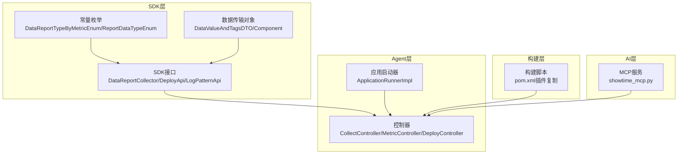
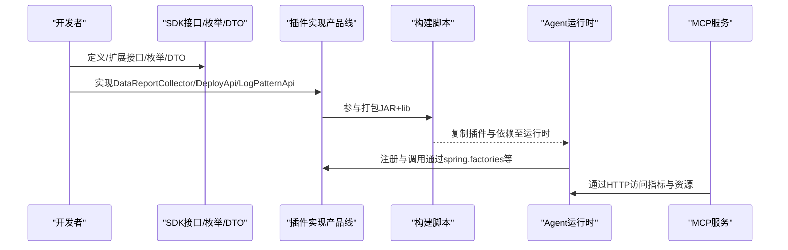
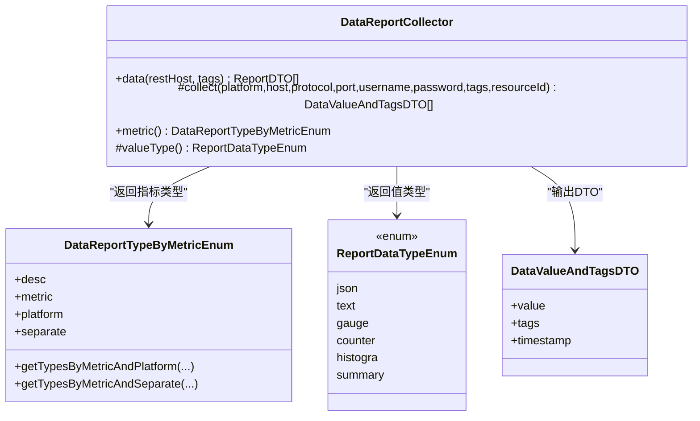
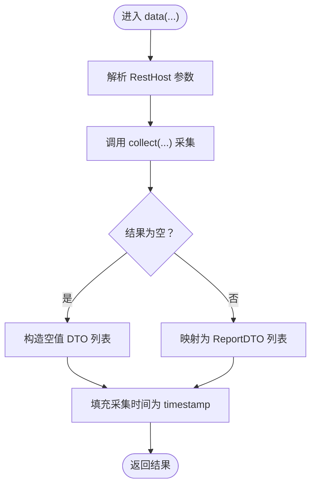
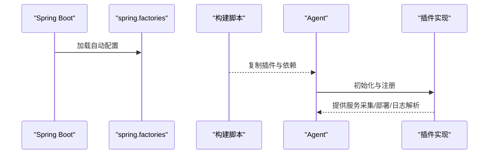
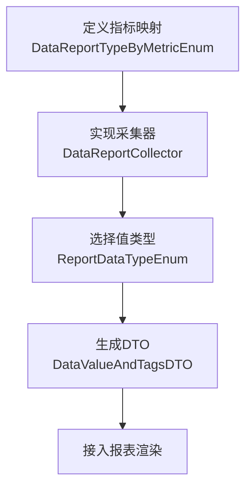
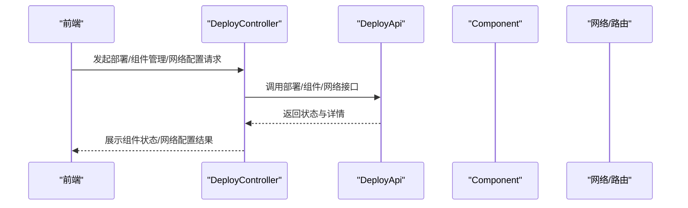
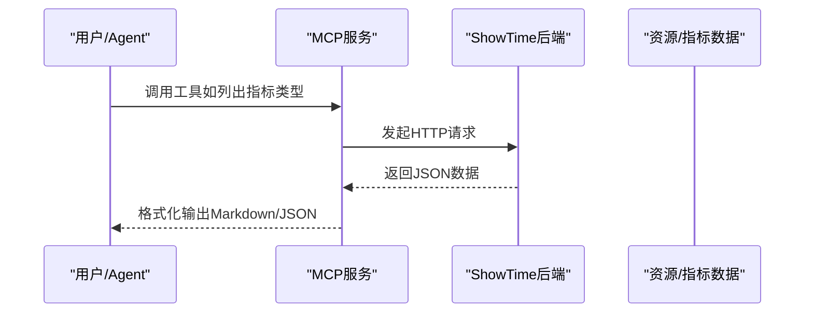
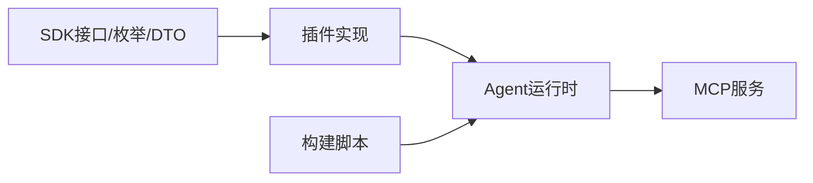

# 扩展开发

<cite>
**本文引用的文件**
- [DataReportCollector.java](file://watcher-sdk/src/main/java/com/virtual/cloud/om/sdk/api/DataReportCollector.java)
- [DataReportTypeByMetricEnum.java](file://watcher-sdk/src/main/java/com/virtual/cloud/om/sdk/constant/DataReportTypeByMetricEnum.java)
- [ReportDataTypeEnum.java](file://watcher-sdk/src/main/java/com/virtual/cloud/om/sdk/constant/report/ReportDataTypeEnum.java)
- [DataValueAndTagsDTO.java](file://watcher-sdk/src/main/java/com/virtual/cloud/om/sdk/dto/dataReport/DataValueAndTagsDTO.java)
- [DeployApi.java](file://watcher-sdk/src/main/java/com/virtual/cloud/om/sdk/api/DeployApi.java)
- [Component.java](file://watcher-sdk/src/main/java/com/virtual/cloud/om/sdk/dto/deploy/Component.java)
- [ComponentEnum.java](file://watcher-sdk/src/main/java/com/virtual/cloud/om/sdk/constant/ComponentEnum.java)
- [spring.factories](file://watcher-sdk/src/main/resources/META-INF/spring.factories)
- [pom.xml（构建打包）](file://watcher-builder/pom.xml)
- [showtime_mcp.py](file://watcher-ai/src/showtime_mcp.py)
- [README.md（AI）](file://watcher-ai/README.md)
- [LogPatternApi.java](file://watcher-sdk/src/main/java/com/virtual/cloud/om/sdk/api/LogPatternApi.java)
- [ApplicationRunnerImpl.java](file://watcher-agent/src/main/java/com/virtual/cloud/om/agent/config/ApplicationRunnerImpl.java)
</cite>

## 目录
1. [简介](#简介)
2. [项目结构](#项目结构)
3. [核心组件](#核心组件)
4. [架构总览](#架构总览)
5. [详细组件分析](#详细组件分析)
6. [依赖分析](#依赖分析)
7. [性能考虑](#性能考虑)
8. [故障排查指南](#故障排查指南)
9. [结论](#结论)
10. [附录](#附录)

## 简介
本指南面向希望为ShowTime项目进行扩展开发的工程师，覆盖以下主题：
- 新监控模块（产品线监控）的创建流程、接口实现与配置注册
- 自定义采集器的开发方法（DataReportCollector接口实现、数据转换与错误处理）
- 插件系统的使用（插件注册机制、生命周期管理与依赖注入）
- 新指标类型的添加流程（数据模型定义、采集逻辑实现与报表集成）
- 部署模块扩展（组件控制、网络配置与健康检查）
- AI技能扩展（MCP服务集成与自然语言处理）
- 最佳实践、常见陷阱与测试验证方法

## 项目结构
ShowTime采用多模块分层组织，核心扩展点分布在SDK、Agent、构建打包与AI子系统中：
- watcher-sdk：扩展能力的抽象与契约（采集器、部署、日志解析、常量与DTO）
- watcher-agent：采集端应用，负责初始化、运行与对外接口
- watcher-builder：构建打包模块，负责插件与依赖的复制与装配
- watcher-ai：MCP服务，提供自然语言与监控数据交互
- watcher-*（cas/onestor/workspace等）：具体产品线监控插件

**图表来源**
- [DataReportCollector.java:1-118](file://watcher-sdk/src/main/java/com/virtual/cloud/om/sdk/api/DataReportCollector.java#L1-L118)
- [DeployApi.java:1-106](file://watcher-sdk/src/main/java/com/virtual/cloud/om/sdk/api/DeployApi.java#L1-L106)
- [LogPatternApi.java:1-18](file://watcher-sdk/src/main/java/com/virtual/cloud/om/sdk/api/LogPatternApi.java#L1-L18)
- [DataReportTypeByMetricEnum.java:1-190](file://watcher-sdk/src/main/java/com/virtual/cloud/om/sdk/constant/DataReportTypeByMetricEnum.java#L1-L190)
- [ReportDataTypeEnum.java:1-18](file://watcher-sdk/src/main/java/com/virtual/cloud/om/sdk/constant/report/ReportDataTypeEnum.java#L1-L18)
- [DataValueAndTagsDTO.java:1-17](file://watcher-sdk/src/main/java/com/virtual/cloud/om/sdk/dto/dataReport/DataValueAndTagsDTO.java#L1-L17)
- [Component.java:1-35](file://watcher-sdk/src/main/java/com/virtual/cloud/om/sdk/dto/deploy/Component.java#L1-L35)
- [ApplicationRunnerImpl.java:33-76](file://watcher-agent/src/main/java/com/virtual/cloud/om/agent/config/ApplicationRunnerImpl.java#L33-L76)
- [pom.xml（构建打包）:110-212](file://watcher-builder/pom.xml#L110-L212)
- [showtime_mcp.py:1-200](file://watcher-ai/src/showtime_mcp.py#L1-L200)

**章节来源**
- [pom.xml（构建打包）:110-212](file://watcher-builder/pom.xml#L110-L212)
- [spring.factories:1-10](file://watcher-sdk/src/main/resources/META-INF/spring.factories#L1-L10)

## 核心组件
- 采集器抽象：DataReportCollector定义了统一的数据采集入口与上报格式转换，子类只需实现采集与类型声明。
- 指标类型映射：DataReportTypeByMetricEnum将“策略指标”与“平台实现”解耦，支持按平台/维度选择具体实现。
- 上报数据类型：ReportDataTypeEnum定义上报value类型（数值、计数器、直方图等），确保报表侧正确渲染。
- DTO模型：DataValueAndTagsDTO承载单条指标的值、标签与时间戳；Component描述组件状态。
- 部署接口：DeployApi提供批量/单点部署、组件管理、网络与路由配置、健康检查等能力。
- 日志解析：LogPatternApi定义日志行解析契约，便于扩展不同平台的日志解析器。

**章节来源**
- [DataReportCollector.java:1-118](file://watcher-sdk/src/main/java/com/virtual/cloud/om/sdk/api/DataReportCollector.java#L1-L118)
- [DataReportTypeByMetricEnum.java:1-190](file://watcher-sdk/src/main/java/com/virtual/cloud/om/sdk/constant/DataReportTypeByMetricEnum.java#L1-L190)
- [ReportDataTypeEnum.java:1-18](file://watcher-sdk/src/main/java/com/virtual/cloud/om/sdk/constant/report/ReportDataTypeEnum.java#L1-L18)
- [DataValueAndTagsDTO.java:1-17](file://watcher-sdk/src/main/java/com/virtual/cloud/om/sdk/dto/dataReport/DataValueAndTagsDTO.java#L1-L17)
- [Component.java:1-35](file://watcher-sdk/src/main/java/com/virtual/cloud/om/sdk/dto/deploy/Component.java#L1-L35)
- [DeployApi.java:1-106](file://watcher-sdk/src/main/java/com/virtual/cloud/om/sdk/api/DeployApi.java#L1-L106)
- [LogPatternApi.java:1-18](file://watcher-sdk/src/main/java/com/virtual/cloud/om/sdk/api/LogPatternApi.java#L1-L18)

## 架构总览
扩展开发围绕“SDK抽象 + 插件实现 + 构建装配 + 运行时集成”的闭环展开。SDK提供统一接口与契约；各产品线以插件形式实现；构建阶段将插件与依赖复制到运行时目录；Agent负责启动与调度。

**图表来源**
- [spring.factories:1-10](file://watcher-sdk/src/main/resources/META-INF/spring.factories#L1-L10)
- [pom.xml（构建打包）:110-212](file://watcher-builder/pom.xml#L110-L212)
- [showtime_mcp.py:1-200](file://watcher-ai/src/showtime_mcp.py#L1-L200)

## 详细组件分析

### 产品线监控模块创建流程
- 明确指标与平台：在DataReportTypeByMetricEnum中登记“策略指标 + 平台”映射，必要时指定维度分离策略。
- 实现采集器：继承DataReportCollector，实现采集方法与类型声明；在data(...)中完成采集与DTO转换。
- 数据模型：使用DataValueAndTagsDTO封装单条指标值、标签与时间戳；若未提供时间戳，框架会回填采集时间。
- 报表集成：根据ReportDataTypeEnum选择合适的value类型，确保报表正确渲染。

**图表来源**
- [DataReportCollector.java:1-118](file://watcher-sdk/src/main/java/com/virtual/cloud/om/sdk/api/DataReportCollector.java#L1-L118)
- [DataReportTypeByMetricEnum.java:1-190](file://watcher-sdk/src/main/java/com/virtual/cloud/om/sdk/constant/DataReportTypeByMetricEnum.java#L1-L190)
- [ReportDataTypeEnum.java:1-18](file://watcher-sdk/src/main/java/com/virtual/cloud/om/sdk/constant/report/ReportDataTypeEnum.java#L1-L18)
- [DataValueAndTagsDTO.java:1-17](file://watcher-sdk/src/main/java/com/virtual/cloud/om/sdk/dto/dataReport/DataValueAndTagsDTO.java#L1-L17)

**章节来源**
- [DataReportCollector.java:48-86](file://watcher-sdk/src/main/java/com/virtual/cloud/om/sdk/api/DataReportCollector.java#L48-L86)
- [DataReportTypeByMetricEnum.java:169-186](file://watcher-sdk/src/main/java/com/virtual/cloud/om/sdk/constant/DataReportTypeByMetricEnum.java#L169-L186)
- [ReportDataTypeEnum.java:1-18](file://watcher-sdk/src/main/java/com/virtual/cloud/om/sdk/constant/report/ReportDataTypeEnum.java#L1-L18)
- [DataValueAndTagsDTO.java:1-17](file://watcher-sdk/src/main/java/com/virtual/cloud/om/sdk/dto/dataReport/DataValueAndTagsDTO.java#L1-L17)

### 自定义采集器开发（DataReportCollector）
- 关键步骤
  - 继承DataReportCollector，实现collect(...)采集原始数据
  - 在metric()中返回策略指标类型
  - 在valueType()中返回上报值类型
  - 在data(...)中完成RestHost参数解析、采集执行与DTO转换
- 数据转换
  - 将原始采集结果映射为List<DataValueAndTagsDTO>
  - 若未提供timestamp，框架会自动补全为采集时间
- 错误处理
  - 对空结果集返回空value列表
  - 记录开始/结束日志与耗时，便于问题定位

**图表来源**
- [DataReportCollector.java:48-86](file://watcher-sdk/src/main/java/com/virtual/cloud/om/sdk/api/DataReportCollector.java#L48-L86)

**章节来源**
- [DataReportCollector.java:19-118](file://watcher-sdk/src/main/java/com/virtual/cloud/om/sdk/api/DataReportCollector.java#L19-L118)

### 插件系统与生命周期
- 插件注册机制
  - 通过spring.factories自动装配REST连接与令牌连接
  - 构建阶段将各插件JAR与依赖复制到运行时目录，供Agent加载
- 生命周期管理
  - 应用启动时执行初始化逻辑（如生成Agent唯一码、初始化系统用户等）
- 依赖注入
  - 使用Spring管理Bean，插件实现可直接通过@Autowired注入所需服务

**图表来源**
- [spring.factories:1-10](file://watcher-sdk/src/main/resources/META-INF/spring.factories#L1-L10)
- [pom.xml（构建打包）:110-212](file://watcher-builder/pom.xml#L110-L212)
- [ApplicationRunnerImpl.java:33-76](file://watcher-agent/src/main/java/com/virtual/cloud/om/agent/config/ApplicationRunnerImpl.java#L33-L76)

**章节来源**
- [spring.factories:1-10](file://watcher-sdk/src/main/resources/META-INF/spring.factories#L1-L10)
- [pom.xml（构建打包）:110-212](file://watcher-builder/pom.xml#L110-L212)
- [ApplicationRunnerImpl.java:33-76](file://watcher-agent/src/main/java/com/virtual/cloud/om/agent/config/ApplicationRunnerImpl.java#L33-L76)

### 新指标类型的添加流程
- 数据模型定义
  - 在DataReportTypeByMetricEnum中新增“策略指标 + 平台”映射
  - 若需要按维度分离（如host/domain/cluster），设置separate字段
- 采集逻辑实现
  - 为新增指标实现DataReportCollector子类，完成collect与类型声明
- 报表集成
  - 在valueType()中选择合适类型（如gauge/counter/histogra等）
  - 确保标签与时间戳正确传递

**图表来源**
- [DataReportTypeByMetricEnum.java:169-186](file://watcher-sdk/src/main/java/com/virtual/cloud/om/sdk/constant/DataReportTypeByMetricEnum.java#L169-L186)
- [DataReportCollector.java:109-118](file://watcher-sdk/src/main/java/com/virtual/cloud/om/sdk/api/DataReportCollector.java#L109-L118)
- [ReportDataTypeEnum.java:1-18](file://watcher-sdk/src/main/java/com/virtual/cloud/om/sdk/constant/report/ReportDataTypeEnum.java#L1-L18)
- [DataValueAndTagsDTO.java:1-17](file://watcher-sdk/src/main/java/com/virtual/cloud/om/sdk/dto/dataReport/DataValueAndTagsDTO.java#L1-L17)

**章节来源**
- [DataReportTypeByMetricEnum.java:1-190](file://watcher-sdk/src/main/java/com/virtual/cloud/om/sdk/constant/DataReportTypeByMetricEnum.java#L1-L190)
- [DataReportCollector.java:101-118](file://watcher-sdk/src/main/java/com/virtual/cloud/om/sdk/api/DataReportCollector.java#L101-L118)
- [ReportDataTypeEnum.java:1-18](file://watcher-sdk/src/main/java/com/virtual/cloud/om/sdk/constant/report/ReportDataTypeEnum.java#L1-L18)
- [DataValueAndTagsDTO.java:1-17](file://watcher-sdk/src/main/java/com/virtual/cloud/om/sdk/dto/dataReport/DataValueAndTagsDTO.java#L1-L17)

### 部署模块扩展（组件控制、网络配置、健康检查）
- 组件控制
  - 使用DeployApi提供的deploy/restart/startup/shutdown等方法
  - Component描述组件状态与详情，isRunning用于状态判断
- 网络配置
  - 支持添加/编辑/删除网络、DNS、路由等
  - 提供SSH方式的网络重启与冗余配置清理
- 健康检查
  - 提供整体与Agent专用的健康检查接口
  - 结合组件状态与外部连通性进行综合评估

**图表来源**
- [DeployApi.java:1-106](file://watcher-sdk/src/main/java/com/virtual/cloud/om/sdk/api/DeployApi.java#L1-L106)
- [Component.java:1-35](file://watcher-sdk/src/main/java/com/virtual/cloud/om/sdk/dto/deploy/Component.java#L1-L35)
- [ComponentEnum.java:1-13](file://watcher-sdk/src/main/java/com/virtual/cloud/om/sdk/constant/ComponentEnum.java#L1-L13)

**章节来源**
- [DeployApi.java:1-106](file://watcher-sdk/src/main/java/com/virtual/cloud/om/sdk/api/DeployApi.java#L1-L106)
- [Component.java:1-35](file://watcher-sdk/src/main/java/com/virtual/cloud/om/sdk/dto/deploy/Component.java#L1-L35)
- [ComponentEnum.java:1-13](file://watcher-sdk/src/main/java/com/virtual/cloud/om/sdk/constant/ComponentEnum.java#L1-L13)

### AI技能扩展（MCP服务与自然语言处理）
- MCP服务集成
  - 通过showtime_mcp.py提供工具：列出资源、获取资源详情、指标类型、趋势、汇总与最新指标
  - 支持stdio与HTTP两种传输模式
- 自然语言处理
  - 工具输入使用Pydantic模型校验与约束
  - 统一错误处理与响应格式（Markdown/JSON）

**图表来源**
- [showtime_mcp.py:1-200](file://watcher-ai/src/showtime_mcp.py#L1-L200)
- [README.md（AI）:1-72](file://watcher-ai/README.md#L1-L72)

**章节来源**
- [showtime_mcp.py:1-200](file://watcher-ai/src/showtime_mcp.py#L1-L200)
- [README.md（AI）:1-72](file://watcher-ai/README.md#L1-L72)

## 依赖分析
- 组件耦合
  - SDK层提供稳定契约，插件实现与Agent运行时通过Spring装配解耦
  - 构建脚本集中管理插件与依赖复制，避免运行时遗漏
- 外部依赖
  - MCP服务依赖HTTP客户端与MCP框架
  - Agent侧依赖Spring上下文与MyBatis等基础设施

**图表来源**
- [spring.factories:1-10](file://watcher-sdk/src/main/resources/META-INF/spring.factories#L1-L10)
- [pom.xml（构建打包）:110-212](file://watcher-builder/pom.xml#L110-L212)
- [showtime_mcp.py:1-200](file://watcher-ai/src/showtime_mcp.py#L1-L200)

**章节来源**
- [spring.factories:1-10](file://watcher-sdk/src/main/resources/META-INF/spring.factories#L1-L10)
- [pom.xml（构建打包）:110-212](file://watcher-builder/pom.xml#L110-L212)

## 性能考虑
- 采集批量化：合并多次采集为一次请求，减少网络往返
- 缓存与去重：对重复标签与时间戳进行去重处理，降低无效上报
- 异步处理：对高延迟采集场景采用异步执行与超时控制
- 资源限制：合理设置线程池与拒绝策略，避免过载

## 故障排查指南
- 采集失败
  - 检查collect实现是否抛出异常或返回空值
  - 查看data(...)日志，确认采集耗时与返回结构
- 指标类型不匹配
  - 确认DataReportTypeByMetricEnum映射是否正确
  - 校验valueType与报表期望类型一致
- 插件未生效
  - 检查spring.factories是否包含自动配置
  - 确认构建脚本已复制插件与依赖至运行时目录
- 健康检查异常
  - 使用DeployApi的健康检查接口定位Agent与组件状态
  - 检查Component.status与detail字段

**章节来源**
- [DataReportCollector.java:48-86](file://watcher-sdk/src/main/java/com/virtual/cloud/om/sdk/api/DataReportCollector.java#L48-L86)
- [DataReportTypeByMetricEnum.java:169-186](file://watcher-sdk/src/main/java/com/virtual/cloud/om/sdk/constant/DataReportTypeByMetricEnum.java#L169-L186)
- [DeployApi.java:61-82](file://watcher-sdk/src/main/java/com/virtual/cloud/om/sdk/api/DeployApi.java#L61-L82)
- [Component.java:25-33](file://watcher-sdk/src/main/java/com/virtual/cloud/om/sdk/dto/deploy/Component.java#L25-L33)

## 结论
通过SDK抽象与插件化架构，ShowTime为扩展开发提供了清晰的边界与稳定的契约。遵循本文档的流程与最佳实践，可在保证一致性的同时快速实现新的监控模块、采集器、指标类型与部署能力，并与AI MCP服务无缝集成。

## 附录
- 测试与验证建议
  - 单元测试：针对DataReportCollector的collect实现编写Mock测试，覆盖正常/异常/空值场景
  - 集成测试：在Agent中启用插件，验证data(...)输出与报表渲染
  - 性能压测：模拟高并发采集，观察线程池与超时策略表现
  - 端到端验证：通过MCP工具链验证自然语言到指标查询的完整链路