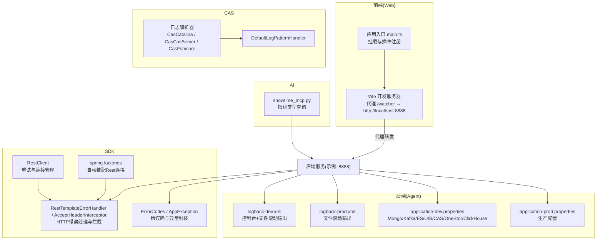
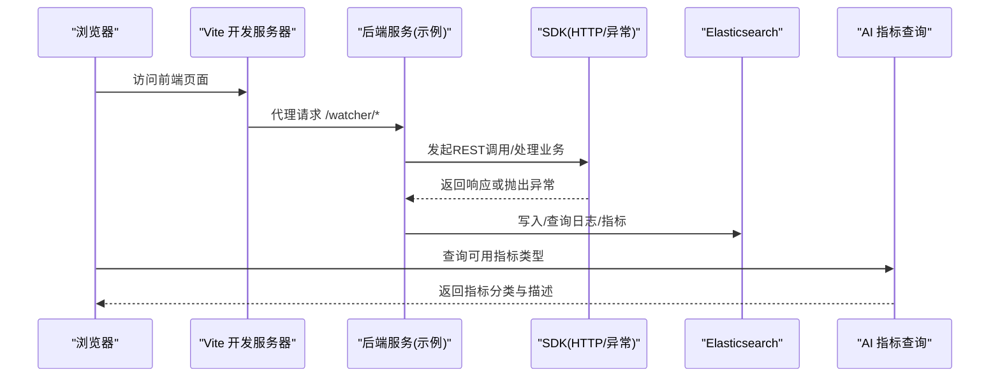
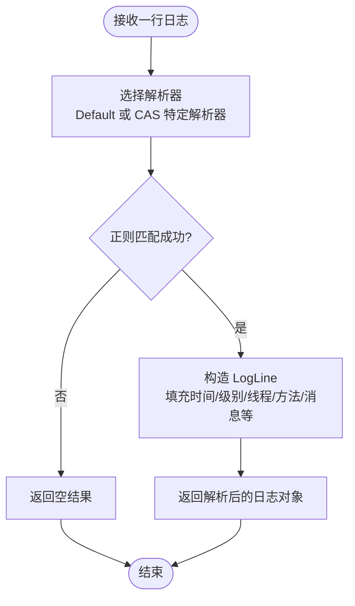
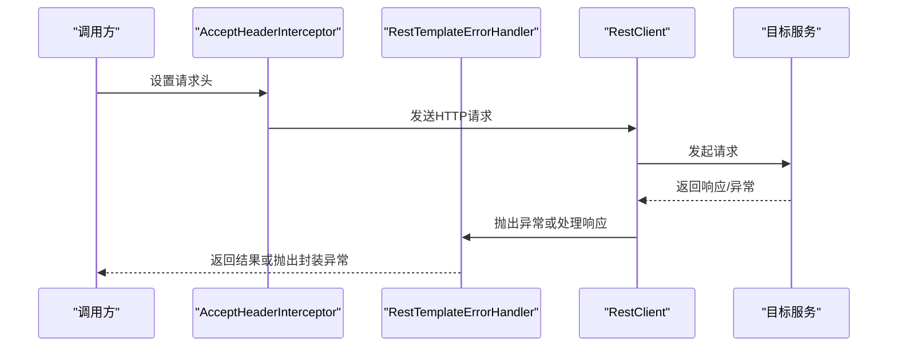
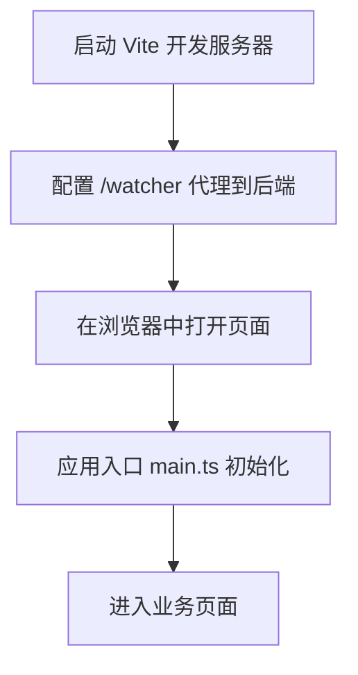
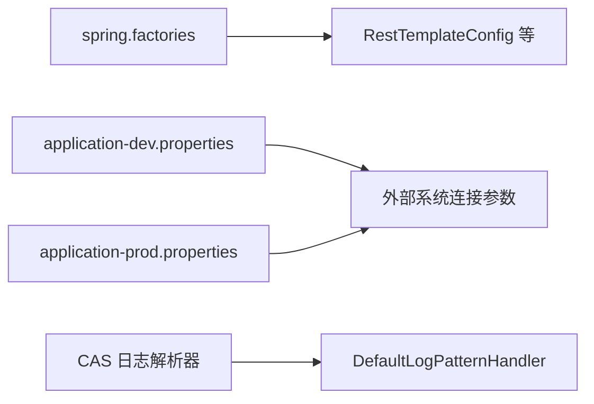

# 调试与故障排查

<cite>
**本文引用的文件**
- [logback-dev.xml](file://watcher-agent/src/main/resources/logback-dev.xml)
- [logback-prod.xml](file://watcher-agent/src/main/resources/logback-prod.xml)
- [application-dev.properties](file://watcher-agent/src/main/resources/application-dev.properties)
- [application-prod.properties](file://watcher-agent/src/main/resources/application-prod.properties)
- [ServerUtils.java](file://watcher-sdk/src/main/java/com/virtual/cloud/om/sdk/utils/ServerUtils.java)
- [ErrorCodes.java](file://watcher-sdk/src/main/java/com/virtual/cloud/om/sdk/exception/ErrorCodes.java)
- [AppException.java](file://watcher-sdk/src/main/java/com/virtual/cloud/om/sdk/exception/AppException.java)
- [I18nConf.java](file://watcher-sdk/src/main/java/com/virtual/cloud/om/sdk/exception/I18nConf.java)
- [DefaultLogPatternHandler.java](file://watcher-sdk/src/main/java/com/virtual/cloud/om/sdk/api/DefaultLogPatternHandler.java)
- [CasCatalinaLogPatternHandler.java](file://watcher-cas/src/main/java/com/virtual/cloud/om/cas/service/CasCatalinaLogPatternHandler.java)
- [CasCasServerLogPatternHandler.java](file://watcher-cas/src/main/java/com/virtual/cloud/om/cas/service/CasCasServerLogPatternHandler.java)
- [CasFsmcoreLogPatternHandler.java](file://watcher-cas/src/main/java/com/virtual/cloud/om/cas/service/CasFsmcoreLogPatternHandler.java)
- [RestTemplateErrorHandler.java](file://watcher-sdk/src/main/java/com/virtual/cloud/om/sdk/config/rest/common/RestTemplateErrorHandler.java)
- [AcceptHeaderInterceptor.java](file://watcher-sdk/src/main/java/com/virtual/cloud/om/sdk/config/rest/common/AcceptHeaderInterceptor.java)
- [RestClient.java](file://watcher-sdk/src/main/java/com/virtual/cloud/om/sdk/config/rest/workspace/cache/RestClient.java)
- [PlatformTestConnectionApi.java](file://watcher-sdk/src/main/java/com/virtual/cloud/om/sdk/api/PlatformTestConnectionApi.java)
- [KafkaConsumerUtil.java](file://watcher-sdk/src/main/java/com/virtual/cloud/om/sdk/utils/KafkaConsumerUtil.java)
- [KafkaConsumerOffsetLog.java](file://watcher-agent/src/main/java/com/virtual/cloud/om/agent/entity/KafkaConsumerOffsetLog.java)
- [filebeat.reference.yml](file://watcher-builder/assembly/components/filebeat/filebeat-8.0.1-linux-x86_64/filebeat.reference.yml)
- [search.json](file://watcher-agent/src/main/resources/search.json)
- [showtime_mcp.py](file://watcher-ai/src/showtime_mcp.py)
- [vite.config.ts](file://watcher-web/vite.config.ts)
- [main.ts](file://watcher-web/src/main.ts)
- [package.json](file://watcher-web/package.json)
- [spring.factories](file://watcher-sdk/src/main/resources/META-INF/spring.factories)
</cite>

## 目录
1. [简介](#简介)
2. [项目结构](#项目结构)
3. [核心组件](#核心组件)
4. [架构总览](#架构总览)
5. [详细组件分析](#详细组件分析)
6. [依赖关系分析](#依赖关系分析)
7. [性能考量](#性能考量)
8. [故障排查指南](#故障排查指南)
9. [结论](#结论)
10. [附录](#附录)

## 简介
本指南面向ShowTime项目的开发者与运维人员，聚焦于调试与故障排查。内容涵盖：
- 日志系统使用：日志级别配置、日志格式解析、关键日志追踪
- 断点调试技巧：IDE调试器使用、远程调试配置、性能分析
- 常见问题诊断：网络连接、数据库连接、API调用失败
- 性能问题排查：内存泄漏检测、CPU使用率分析、数据库查询优化
- 分布式系统调试：服务间通信跟踪、消息队列监控、数据一致性检查
- 错误处理与异常捕获最佳实践
- 监控与告警使用：快速定位问题根因
- 常见错误码与解决方案参考

## 项目结构
ShowTime由多模块组成，前端采用Vue3 + Vite，后端以Spring Boot微服务为主，辅以AI能力与构建打包组件。调试相关的关键位置包括：
- 后端日志配置（Logback）与运行参数（application-*.properties）
- SDK中的统一异常与错误码体系
- CAS侧的日志解析器
- Web前端代理与开发服务器配置
- 构建与打包组件中的Filebeat配置参考

**图表来源**
- [vite.config.ts:23-33](file://watcher-web/vite.config.ts#L23-L33)
- [main.ts:24-35](file://watcher-web/src/main.ts#L24-L35)
- [logback-dev.xml:8-26](file://watcher-agent/src/main/resources/logback-dev.xml#L8-L26)
- [logback-prod.xml:9-27](file://watcher-agent/src/main/resources/logback-prod.xml#L9-L27)
- [application-dev.properties:3-68](file://watcher-agent/src/main/resources/application-dev.properties#L3-L68)
- [application-prod.properties:3-68](file://watcher-agent/src/main/resources/application-prod.properties#L3-L68)
- [ErrorCodes.java:15-71](file://watcher-sdk/src/main/java/com/virtual/cloud/om/sdk/exception/ErrorCodes.java#L15-L71)
- [AppException.java:12-45](file://watcher-sdk/src/main/java/com/virtual/cloud/om/sdk/exception/AppException.java#L12-L45)
- [RestTemplateErrorHandler.java:18-20](file://watcher-sdk/src/main/java/com/virtual/cloud/om/sdk/config/rest/common/RestTemplateErrorHandler.java#L18-L20)
- [AcceptHeaderInterceptor.java:19-21](file://watcher-sdk/src/main/java/com/virtual/cloud/om/sdk/config/rest/common/AcceptHeaderInterceptor.java#L19-L21)
- [RestClient.java:108-121](file://watcher-sdk/src/main/java/com/virtual/cloud/om/sdk/config/rest/workspace/cache/RestClient.java#L108-L121)
- [spring.factories:1-10](file://watcher-sdk/src/main/resources/META-INF/spring.factories#L1-L10)
- [CasCatalinaLogPatternHandler.java:16-51](file://watcher-cas/src/main/java/com/virtual/cloud/om/cas/service/CasCatalinaLogPatternHandler.java#L16-L51)
- [CasCasServerLogPatternHandler.java:16-51](file://watcher-cas/src/main/java/com/virtual/cloud/om/cas/service/CasCasServerLogPatternHandler.java#L16-L51)
- [CasFsmcoreLogPatternHandler.java:16-51](file://watcher-cas/src/main/java/com/virtual/cloud/om/cas/service/CasFsmcoreLogPatternHandler.java#L16-L51)
- [DefaultLogPatternHandler.java:37-55](file://watcher-sdk/src/main/java/com/virtual/cloud/om/sdk/api/DefaultLogPatternHandler.java#L37-L55)
- [showtime_mcp.py:338-397](file://watcher-ai/src/showtime_mcp.py#L338-L397)

**章节来源**
- [vite.config.ts:13-49](file://watcher-web/vite.config.ts#L13-L49)
- [main.ts:1-36](file://watcher-web/src/main.ts#L1-L36)
- [logback-dev.xml:1-44](file://watcher-agent/src/main/resources/logback-dev.xml#L1-L44)
- [logback-prod.xml:1-35](file://watcher-agent/src/main/resources/logback-prod.xml#L1-L35)
- [application-dev.properties:1-72](file://watcher-agent/src/main/resources/application-dev.properties#L1-L72)
- [application-prod.properties:1-70](file://watcher-agent/src/main/resources/application-prod.properties#L1-L70)
- [spring.factories:1-10](file://watcher-sdk/src/main/resources/META-INF/spring.factories#L1-L10)

## 核心组件
- 日志系统：Logback配置（开发/生产），统一日志格式，支持请求上下文字段注入
- 错误与异常：统一错误码接口与异常封装，国际化错误消息源
- 日志解析：CAS侧多种日志格式解析器，统一到LogLine模型
- HTTP客户端：自定义错误处理与拦截器，连接池与重试策略
- 前端开发：Vite代理与本地开发服务器，便于联调后端
- 监控与指标：AI侧指标类型查询接口，辅助定位性能问题

**章节来源**
- [logback-dev.xml:11-15](file://watcher-agent/src/main/resources/logback-dev.xml#L11-L15)
- [logback-prod.xml:12-16](file://watcher-agent/src/main/resources/logback-prod.xml#L12-L16)
- [ErrorCodes.java:10-71](file://watcher-sdk/src/main/java/com/virtual/cloud/om/sdk/exception/ErrorCodes.java#L10-L71)
- [AppException.java:12-45](file://watcher-sdk/src/main/java/com/virtual/cloud/om/sdk/exception/AppException.java#L12-L45)
- [I18nConf.java:11-22](file://watcher-sdk/src/main/java/com/virtual/cloud/om/sdk/exception/I18nConf.java#L11-L22)
- [CasCatalinaLogPatternHandler.java:16-51](file://watcher-cas/src/main/java/com/virtual/cloud/om/cas/service/CasCatalinaLogPatternHandler.java#L16-L51)
- [CasCasServerLogPatternHandler.java:16-51](file://watcher-cas/src/main/java/com/virtual/cloud/om/cas/service/CasCasServerLogPatternHandler.java#L16-L51)
- [CasFsmcoreLogPatternHandler.java:16-51](file://watcher-cas/src/main/java/com/virtual/cloud/om/cas/service/CasFsmcoreLogPatternHandler.java#L16-L51)
- [DefaultLogPatternHandler.java:37-55](file://watcher-sdk/src/main/java/com/virtual/cloud/om/sdk/api/DefaultLogPatternHandler.java#L37-L55)
- [RestTemplateErrorHandler.java:18-20](file://watcher-sdk/src/main/java/com/virtual/cloud/om/sdk/config/rest/common/RestTemplateErrorHandler.java#L18-L20)
- [AcceptHeaderInterceptor.java:19-21](file://watcher-sdk/src/main/java/com/virtual/cloud/om/sdk/config/rest/common/AcceptHeaderInterceptor.java#L19-L21)
- [RestClient.java:108-121](file://watcher-sdk/src/main/java/com/virtual/cloud/om/sdk/config/rest/workspace/cache/RestClient.java#L108-L121)
- [showtime_mcp.py:338-397](file://watcher-ai/src/showtime_mcp.py#L338-L397)

## 架构总览
下图展示从浏览器到后端服务、日志与监控的交互路径，以及关键调试点。

**图表来源**
- [vite.config.ts:23-33](file://watcher-web/vite.config.ts#L23-L33)
- [main.ts:24-35](file://watcher-web/src/main.ts#L24-L35)
- [RestTemplateErrorHandler.java:18-20](file://watcher-sdk/src/main/java/com/virtual/cloud/om/sdk/config/rest/common/RestTemplateErrorHandler.java#L18-L20)
- [showtime_mcp.py:338-397](file://watcher-ai/src/showtime_mcp.py#L338-L397)

## 详细组件分析

### 日志系统与日志格式解析
- Logback配置
  - 开发环境：同时输出到控制台与文件，滚动策略按大小与时间，支持请求上下文字段
  - 生产环境：仅文件输出，滚动策略同上
- 日志格式字段
  - 时间、级别、线程、请求UUID、远端地址、Logger、方法、行号、消息
- 日志解析
  - SDK默认解析器支持通用格式，CAS侧提供特定格式解析器（Catalina、CasServer、Fsmcore）
  - 解析结果统一映射到LogLine模型，便于后续检索与分析

**图表来源**
- [DefaultLogPatternHandler.java:22-49](file://watcher-sdk/src/main/java/com/virtual/cloud/om/sdk/api/DefaultLogPatternHandler.java#L22-L49)
- [CasCatalinaLogPatternHandler.java:22-45](file://watcher-cas/src/main/java/com/virtual/cloud/om/cas/service/CasCatalinaLogPatternHandler.java#L22-L45)
- [CasCasServerLogPatternHandler.java:22-45](file://watcher-cas/src/main/java/com/virtual/cloud/om/cas/service/CasCasServerLogPatternHandler.java#L22-L45)
- [CasFsmcoreLogPatternHandler.java:22-45](file://watcher-cas/src/main/java/com/virtual/cloud/om/cas/service/CasFsmcoreLogPatternHandler.java#L22-L45)

**章节来源**
- [logback-dev.xml:8-35](file://watcher-agent/src/main/resources/logback-dev.xml#L8-L35)
- [logback-prod.xml:9-31](file://watcher-agent/src/main/resources/logback-prod.xml#L9-L31)
- [DefaultLogPatternHandler.java:16-55](file://watcher-sdk/src/main/java/com/virtual/cloud/om/sdk/api/DefaultLogPatternHandler.java#L16-L55)
- [CasCatalinaLogPatternHandler.java:16-51](file://watcher-cas/src/main/java/com/virtual/cloud/om/cas/service/CasCatalinaLogPatternHandler.java#L16-L51)
- [CasCasServerLogPatternHandler.java:16-51](file://watcher-cas/src/main/java/com/virtual/cloud/om/cas/service/CasCasServerLogPatternHandler.java#L16-L51)
- [CasFsmcoreLogPatternHandler.java:16-51](file://watcher-cas/src/main/java/com/virtual/cloud/om/cas/service/CasFsmcoreLogPatternHandler.java#L16-L51)

### 错误处理与异常捕获
- 统一错误码：集中定义错误码范围与含义，便于前后端一致化
- 异常封装：AppException携带错误码与可变参数，支持国际化消息
- 国际化：通过I18nConf加载错误码消息源，确保提示语言一致
- 日志记录：ServerUtils根据错误码决定日志级别（关键错误以WARN记录）

```mermaid
classDiagram
class ErrorCodes {
+常量 : DEFAULT_UNDEFINED_ERROR..REST_FAIL
+作用 : 定义错误码范围与语义
}
class AppException {
-errorCode : Integer
-data : Object[]
+getErrorCode() : Integer
+getData() : Object[]
}
class I18nConf {
+messageSource() : ResourceBundleMessageSource
}
class ServerUtils {
+logAppException(log, ae) : void
}
AppException --> ErrorCodes : "使用错误码"
I18nConf --> AppException : "提供消息源"
ServerUtils --> AppException : "记录异常日志"
```

**图表来源**
- [ErrorCodes.java:10-71](file://watcher-sdk/src/main/java/com/virtual/cloud/om/sdk/exception/ErrorCodes.java#L10-L71)
- [AppException.java:12-45](file://watcher-sdk/src/main/java/com/virtual/cloud/om/sdk/exception/AppException.java#L12-L45)
- [I18nConf.java:11-22](file://watcher-sdk/src/main/java/com/virtual/cloud/om/sdk/exception/I18nConf.java#L11-L22)
- [ServerUtils.java:343-351](file://watcher-sdk/src/main/java/com/virtual/cloud/om/sdk/utils/ServerUtils.java#L343-L351)

**章节来源**
- [ErrorCodes.java:10-71](file://watcher-sdk/src/main/java/com/virtual/cloud/om/sdk/exception/ErrorCodes.java#L10-L71)
- [AppException.java:12-45](file://watcher-sdk/src/main/java/com/virtual/cloud/om/sdk/exception/AppException.java#L12-L45)
- [I18nConf.java:11-22](file://watcher-sdk/src/main/java/com/virtual/cloud/om/sdk/exception/I18nConf.java#L11-L22)
- [ServerUtils.java:343-351](file://watcher-sdk/src/main/java/com/virtual/cloud/om/sdk/utils/ServerUtils.java#L343-L351)

### HTTP客户端与API调用
- 自定义错误处理：RestTemplateErrorHandler对客户端/服务端异常进行分类处理
- 请求拦截：AcceptHeaderInterceptor统一设置请求头，便于后端识别
- 连接与重试：RestClient配置连接池、凭证提供者与重试策略（如NoHttpResponseException时自动重试）
- 自动装配：spring.factories自动注册各平台Rest连接配置

**图表来源**
- [AcceptHeaderInterceptor.java:19-21](file://watcher-sdk/src/main/java/com/virtual/cloud/om/sdk/config/rest/common/AcceptHeaderInterceptor.java#L19-L21)
- [RestTemplateErrorHandler.java:18-20](file://watcher-sdk/src/main/java/com/virtual/cloud/om/sdk/config/rest/common/RestTemplateErrorHandler.java#L18-L20)
- [RestClient.java:108-121](file://watcher-sdk/src/main/java/com/virtual/cloud/om/sdk/config/rest/workspace/cache/RestClient.java#L108-L121)
- [spring.factories:1-10](file://watcher-sdk/src/main/resources/META-INF/spring.factories#L1-L10)

**章节来源**
- [AcceptHeaderInterceptor.java:19-21](file://watcher-sdk/src/main/java/com/virtual/cloud/om/sdk/config/rest/common/AcceptHeaderInterceptor.java#L19-L21)
- [RestTemplateErrorHandler.java:18-20](file://watcher-sdk/src/main/java/com/virtual/cloud/om/sdk/config/rest/common/RestTemplateErrorHandler.java#L18-L20)
- [RestClient.java:108-121](file://watcher-sdk/src/main/java/com/virtual/cloud/om/sdk/config/rest/workspace/cache/RestClient.java#L108-L121)
- [spring.factories:1-10](file://watcher-sdk/src/main/resources/META-INF/spring.factories#L1-L10)

### 前端开发与调试
- 代理配置：将 /watcher 前缀代理到本地后端服务端口，便于联调
- 开发服务器：监听所有网卡，关闭自动打开浏览器，避免端口冲突
- 应用入口：权限路由初始化、全局事件总线、UI库与国际化挂载

**图表来源**
- [vite.config.ts:23-33](file://watcher-web/vite.config.ts#L23-L33)
- [main.ts:24-35](file://watcher-web/src/main.ts#L24-L35)

**章节来源**
- [vite.config.ts:13-49](file://watcher-web/vite.config.ts#L13-L49)
- [main.ts:1-36](file://watcher-web/src/main.ts#L1-L36)

### 监控与指标查询
- 指标类型查询：AI侧提供指标类型列表，按类别分组（CPU、内存、磁盘、网络等）
- 使用建议：结合日志与指标，定位CPU/内存/IO瓶颈

**章节来源**
- [showtime_mcp.py:338-397](file://watcher-ai/src/showtime_mcp.py#L338-L397)

## 依赖关系分析
- SDK通过spring.factories自动装配REST连接，减少手动配置
- Agent侧通过application-*.properties集中管理外部系统连接参数
- 日志解析器与SDK默认解析器形成扩展关系，便于新增平台日志格式

**图表来源**
- [spring.factories:1-10](file://watcher-sdk/src/main/resources/META-INF/spring.factories#L1-L10)
- [application-dev.properties:3-68](file://watcher-agent/src/main/resources/application-dev.properties#L3-L68)
- [application-prod.properties:3-68](file://watcher-agent/src/main/resources/application-prod.properties#L3-L68)
- [CasCatalinaLogPatternHandler.java:16-51](file://watcher-cas/src/main/java/com/virtual/cloud/om/cas/service/CasCatalinaLogPatternHandler.java#L16-L51)
- [DefaultLogPatternHandler.java:52-54](file://watcher-sdk/src/main/java/com/virtual/cloud/om/sdk/api/DefaultLogPatternHandler.java#L52-L54)

**章节来源**
- [spring.factories:1-10](file://watcher-sdk/src/main/resources/META-INF/spring.factories#L1-L10)
- [application-dev.properties:1-72](file://watcher-agent/src/main/resources/application-dev.properties#L1-L72)
- [application-prod.properties:1-70](file://watcher-agent/src/main/resources/application-prod.properties#L1-L70)
- [CasCatalinaLogPatternHandler.java:16-51](file://watcher-cas/src/main/java/com/virtual/cloud/om/cas/service/CasCatalinaLogPatternHandler.java#L16-L51)
- [DefaultLogPatternHandler.java:37-55](file://watcher-sdk/src/main/java/com/virtual/cloud/om/sdk/api/DefaultLogPatternHandler.java#L37-L55)

## 性能考量
- 日志滚动与压缩：按大小与时间滚动，限制历史数量与总大小，避免磁盘压力
- HTTP重试策略：针对网络抖动场景启用有限次数重试，降低瞬时失败影响
- 指标查询：结合AI侧指标类型查询，快速定位热点指标，指导优化方向
- 前端性能：按需拆分chunk，减少首屏体积

**章节来源**
- [logback-dev.xml:17-26](file://watcher-agent/src/main/resources/logback-dev.xml#L17-L26)
- [logback-prod.xml:18-27](file://watcher-agent/src/main/resources/logback-prod.xml#L18-L27)
- [RestClient.java:108-121](file://watcher-sdk/src/main/java/com/virtual/cloud/om/sdk/config/rest/workspace/cache/RestClient.java#L108-L121)
- [showtime_mcp.py:338-397](file://watcher-ai/src/showtime_mcp.py#L338-L397)
- [vite.config.ts:35-44](file://watcher-web/vite.config.ts#L35-L44)

## 故障排查指南

### 日志系统使用与关键日志追踪
- 日志级别配置
  - 开发环境：INFO及以上输出到控制台与文件
  - 生产环境：INFO及以上仅输出到文件
- 日志格式解析
  - 使用CAS侧解析器或默认解析器，确保日志字段完整
  - 关键字段：时间戳、级别、请求UUID、远端地址、方法、行号、消息
- 关键日志追踪
  - 在请求入口与异常处打印请求UUID，便于跨服务串联
  - 使用搜索模板（如search.json）快速检索关键词与时间段

**章节来源**
- [logback-dev.xml:37-40](file://watcher-agent/src/main/resources/logback-dev.xml#L37-L40)
- [logback-prod.xml:29-31](file://watcher-agent/src/main/resources/logback-prod.xml#L29-L31)
- [CasCatalinaLogPatternHandler.java:22-45](file://watcher-cas/src/main/java/com/virtual/cloud/om/cas/service/CasCatalinaLogPatternHandler.java#L22-L45)
- [DefaultLogPatternHandler.java:22-49](file://watcher-sdk/src/main/java/com/virtual/cloud/om/sdk/api/DefaultLogPatternHandler.java#L22-L49)
- [search.json:1-7](file://watcher-agent/src/main/resources/search.json#L1-L7)

### 断点调试技巧
- IDE调试器
  - 前端：在main.ts与路由守卫处设置断点，观察初始化流程
  - 后端：在Controller/Service边界设置断点，结合请求UUID复现问题
- 远程调试配置
  - 通过VM选项开启远程调试端口，连接IDE进行远程调试
- 性能分析
  - 使用浏览器性能面板与V8剖析，定位渲染与脚本瓶颈
  - 后端使用JVM剖析工具（如Async Profiler）定位CPU热点

**章节来源**
- [main.ts:24-35](file://watcher-web/src/main.ts#L24-L35)
- [vite.config.ts:23-33](file://watcher-web/vite.config.ts#L23-L33)

### 常见问题诊断
- 网络连接问题
  - 检查RestTemplateErrorHandler对连接超时/拒绝的处理
  - 校验代理配置是否正确（/watcher → 后端地址）
- 数据库连接问题
  - 校验application-*.properties中的数据库连接串与认证信息
  - 关注日志中数据库连接异常与SQL执行异常
- API调用失败
  - 查看AppException与ErrorCodes，确认错误码含义
  - 结合日志中的请求UUID与时间戳，回溯调用链

**章节来源**
- [RestTemplateErrorHandler.java:18-20](file://watcher-sdk/src/main/java/com/virtual/cloud/om/sdk/config/rest/common/RestTemplateErrorHandler.java#L18-L20)
- [vite.config.ts:27-33](file://watcher-web/vite.config.ts#L27-L33)
- [ErrorCodes.java:15-71](file://watcher-sdk/src/main/java/com/virtual/cloud/om/sdk/exception/ErrorCodes.java#L15-L71)
- [AppException.java:12-45](file://watcher-sdk/src/main/java/com/virtual/cloud/om/sdk/exception/AppException.java#L12-L45)

### 性能问题排查
- 内存泄漏检测
  - 关注GC日志与堆快照，排查长生命周期对象未释放
- CPU使用率分析
  - 使用指标查询接口获取CPU/内存/IO指标，定位热点函数
- 数据库查询优化
  - 通过日志与指标发现慢查询，结合索引与SQL改写优化

**章节来源**
- [showtime_mcp.py:338-397](file://watcher-ai/src/showtime_mcp.py#L338-L397)

### 分布式系统调试
- 服务间通信跟踪
  - 以请求UUID贯穿全链路，结合日志与指标定位延迟与错误
- 消息队列监控
  - Kafka消费者偏移量监控（KafkaConsumerOffsetLog），关注堆积与异常
  - Filebeat配置参考（filebeat.reference.yml）调整缓冲、超时与压缩参数
- 数据一致性检查
  - 对比不同节点的数据，结合日志时间戳与事务ID核对

**章节来源**
- [KafkaConsumerOffsetLog.java:13-42](file://watcher-agent/src/main/java/com/virtual/cloud/om/agent/entity/KafkaConsumerOffsetLog.java#L13-L42)
- [filebeat.reference.yml:4017-4068](file://watcher-builder/assembly/components/filebeat/filebeat-8.0.1-linux-x86_64/filebeat.reference.yml#L4017-L4068)

### 错误处理与异常捕获最佳实践
- 统一错误码与异常封装，保证前后端一致
- 国际化错误消息源，提升用户提示质量
- 关键错误以WARN级别记录，非关键错误以DEBUG/ERROR记录，便于分级排查

**章节来源**
- [ErrorCodes.java:15-71](file://watcher-sdk/src/main/java/com/virtual/cloud/om/sdk/exception/ErrorCodes.java#L15-L71)
- [AppException.java:12-45](file://watcher-sdk/src/main/java/com/virtual/cloud/om/sdk/exception/AppException.java#L12-L45)
- [I18nConf.java:11-22](file://watcher-sdk/src/main/java/com/virtual/cloud/om/sdk/exception/I18nConf.java#L11-L22)
- [ServerUtils.java:343-351](file://watcher-sdk/src/main/java/com/virtual/cloud/om/sdk/utils/ServerUtils.java#L343-L351)

### 监控与告警使用
- 指标类型查询：通过AI侧接口获取可用指标，按类别筛选
- 日志检索：使用search.json风格的查询模板，限定时间窗口与关键词
- 告警联动：将日志异常与指标阈值结合，触发自动化告警

**章节来源**
- [showtime_mcp.py:338-397](file://watcher-ai/src/showtime_mcp.py#L338-L397)
- [search.json:1-7](file://watcher-agent/src/main/resources/search.json#L1-L7)

### 常见错误码与解决方案参考
- 错误码来源：ErrorCodes接口集中定义
- 解决方案：结合AppException的错误码与国际化消息，定位问题根因并给出修复建议

**章节来源**
- [ErrorCodes.java:15-71](file://watcher-sdk/src/main/java/com/virtual/cloud/om/sdk/exception/ErrorCodes.java#L15-L71)
- [AppException.java:12-45](file://watcher-sdk/src/main/java/com/virtual/cloud/om/sdk/exception/AppException.java#L12-L45)
- [I18nConf.java:11-22](file://watcher-sdk/src/main/java/com/virtual/cloud/om/sdk/exception/I18nConf.java#L11-L22)

## 结论
本指南围绕ShowTime项目的日志、异常、HTTP客户端、前端开发与监控等方面，提供了系统化的调试与故障排查方法。建议在日常开发中：
- 统一日志格式与级别，利用请求UUID串联链路
- 使用统一错误码与异常封装，配合国际化消息
- 通过指标与日志双轮驱动定位性能瓶颈
- 借助代理与远程调试提升联调效率
- 关注消息队列与数据库连接稳定性，建立告警机制

## 附录
- 前端开发命令与端口
  - 开发：npm scripts 中的 dev/start
  - 构建：build/build:stag/serve
  - 代理：/watcher → http://localhost:8888
- 后端配置要点
  - Logback：开发/生产环境输出策略
  - application-*.properties：外部系统连接参数
- SDK集成要点
  - spring.factories：自动装配REST连接
  - HTTP：拦截器、错误处理、重试策略

**章节来源**
- [package.json:4-10](file://watcher-web/package.json#L4-L10)
- [vite.config.ts:23-33](file://watcher-web/vite.config.ts#L23-L33)
- [logback-dev.xml:1-44](file://watcher-agent/src/main/resources/logback-dev.xml#L1-L44)
- [logback-prod.xml:1-35](file://watcher-agent/src/main/resources/logback-prod.xml#L1-L35)
- [application-dev.properties:1-72](file://watcher-agent/src/main/resources/application-dev.properties#L1-L72)
- [application-prod.properties:1-70](file://watcher-agent/src/main/resources/application-prod.properties#L1-L70)
- [spring.factories:1-10](file://watcher-sdk/src/main/resources/META-INF/spring.factories#L1-L10)