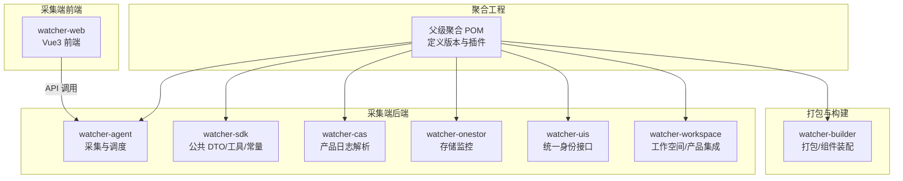
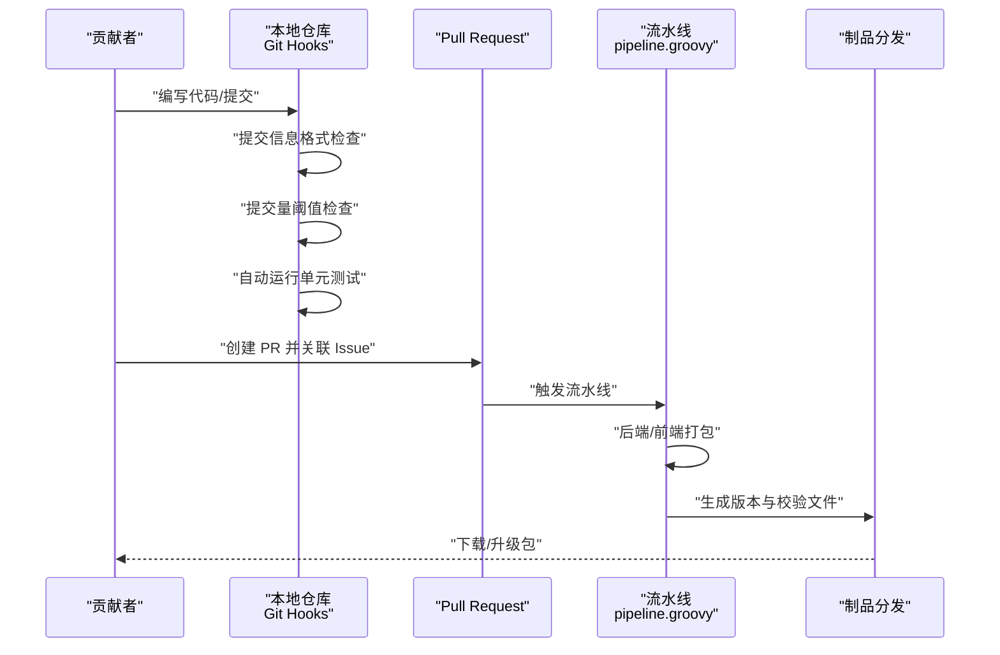
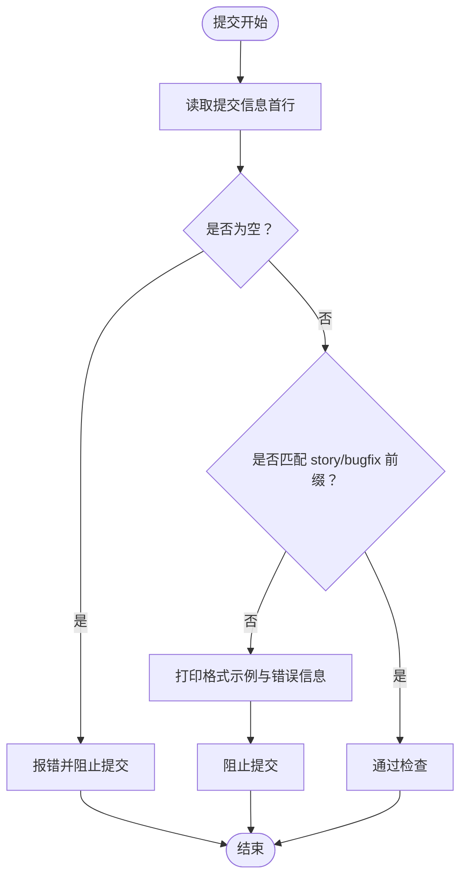
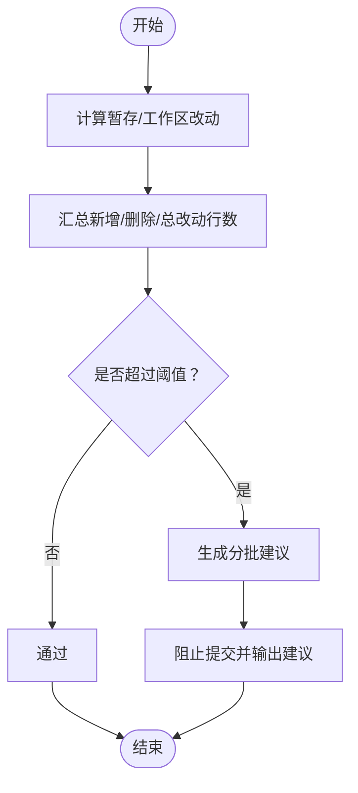
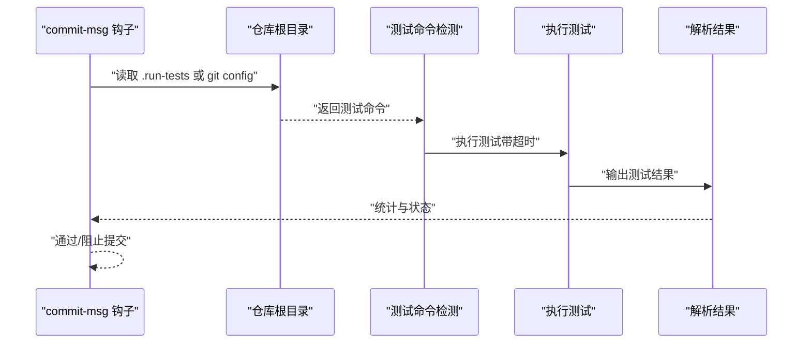
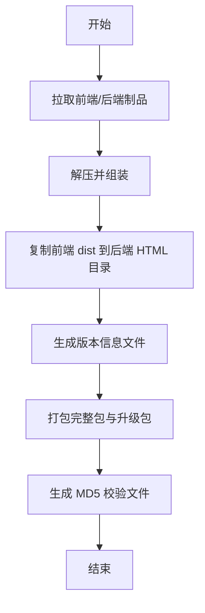
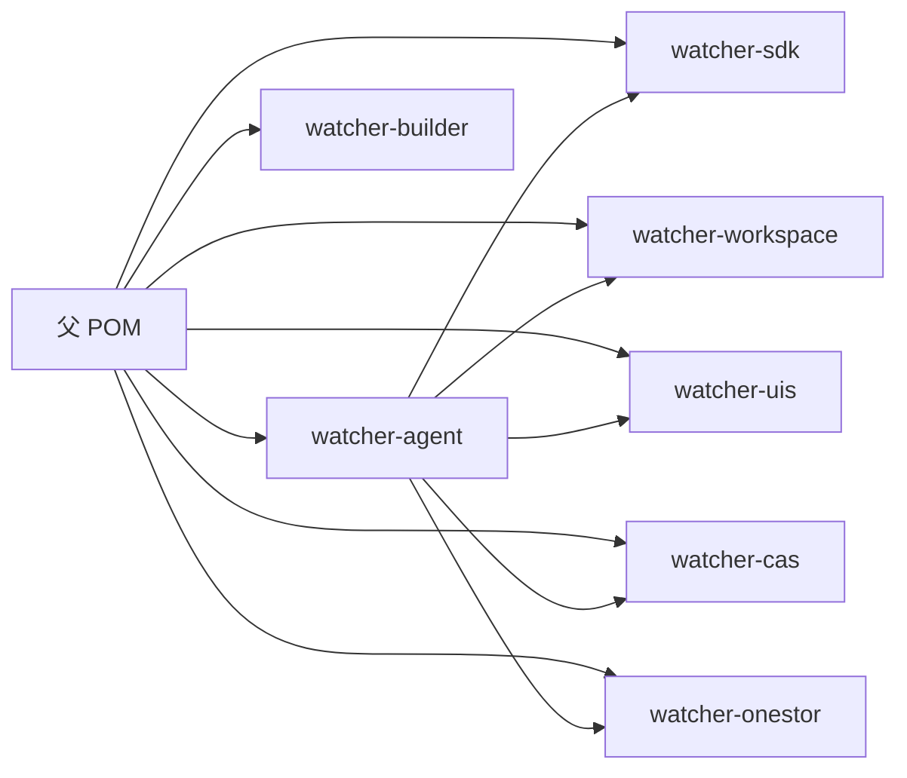

# 贡献指南

<cite>
**本文引用的文件**   
- [Readme.md](file://Readme.md)
- [pipeline.groovy](file://pipeline.groovy)
- [.githooks/setup-hooks.py](file://.githooks/setup-hooks.py)
- [.githooks/check_commit_msg.py](file://.githooks/check_commit_msg.py)
- [.githooks/run_unit_tests.py](file://.githooks/run_unit_tests.py)
- [.githooks/check_commit_size.py](file://.githooks/check_commit_size.py)
- [pom.xml](file://pom.xml)
- [watcher-agent/pom.xml](file://watcher-agent/pom.xml)
- [watcher-sdk/pom.xml](file://watcher-sdk/pom.xml)
- [watcher-web/package.json](file://watcher-web/package.json)
</cite>

## 目录
1. [简介](#简介)
2. [项目结构](#项目结构)
3. [核心贡献流程](#核心贡献流程)
4. [架构总览](#架构总览)
5. [详细组件分析](#详细组件分析)
6. [依赖关系分析](#依赖关系分析)
7. [性能与质量保障](#性能与质量保障)
8. [故障排查指南](#故障排查指南)
9. [结论](#结论)
10. [附录](#附录)

## 简介
本指南面向希望参与 ShowTime 项目的开源贡献者，涵盖从 Fork 仓库、创建分支、提交与推送、发起 Pull Request 的全流程；规范 Issue 报告（含 Bug 报告与功能请求）；阐述代码审查流程（审查标准、反馈处理与合并条件）；提供社区参与建议（讨论区使用、会议参与、技术分享）；说明文档贡献方式（文档更新、翻译、示例贡献）；介绍新成员欢迎流程与导师制度；明确行为准则与知识产权声明；并解释贡献统计与认可机制。

## 项目结构
ShowTime 是一个多模块的监控系统，采用父子聚合工程组织，包含采集端前后端、SDK、产品适配模块与打包构建模块。下图给出与贡献相关的关键模块与职责概览：

图表来源
- [pom.xml:11-20](file://pom.xml#L11-L20)
- [watcher-agent/pom.xml:12-50](file://watcher-agent/pom.xml#L12-L50)
- [watcher-sdk/pom.xml:12-50](file://watcher-sdk/pom.xml#L12-L50)

章节来源
- [Readme.md:27-44](file://Readme.md#L27-L44)
- [pom.xml:11-20](file://pom.xml#L11-L20)

## 核心贡献流程
为确保贡献质量与可追溯性，建议遵循以下步骤：

- 准备阶段
  - Fork 仓库至个人账号，创建独立功能分支（建议采用 feature/xxx、bugfix/xxx 或 chore/xxx 前缀，便于自动化检查识别）。
  - 在本地克隆仓库并安装 Git Hooks（见“性能与质量保障”章节）。

- 提交与推送
  - 编写符合规范的提交信息（必须以 story 或 bugfix 开头，参见“提交信息格式检查”）。
  - 控制单次提交改动量（建议不超过 1000 行，可通过阈值配置调整）。
  - 提交前自动运行单元测试（如存在测试命令），失败将阻止提交。

- 发起 PR
  - 在上游仓库创建 Pull Request，填写 PR 描述与关联 Issue。
  - 确保 CI 通过、代码审查通过、无冲突后方可合并。

- 合并后
  - 同步上游 main 分支，清理本地与远程分支。

章节来源
- [.githooks/setup-hooks.py:44-96](file://.githooks/setup-hooks.py#L44-L96)
- [.githooks/check_commit_msg.py:12-18](file://.githooks/check_commit_msg.py#L12-L18)
- [.githooks/check_commit_size.py:160-170](file://.githooks/check_commit_size.py#L160-L170)
- [.githooks/run_unit_tests.py:70-114](file://.githooks/run_unit_tests.py#L70-L114)

## 架构总览
下图展示贡献流程中的关键交互：开发者本地（含 Git Hooks）、PR 审查、CI 构建与产物发布。

图表来源
- [.githooks/check_commit_msg.py:21-51](file://.githooks/check_commit_msg.py#L21-L51)
- [.githooks/check_commit_size.py:159-222](file://.githooks/check_commit_size.py#L159-L222)
- [.githooks/run_unit_tests.py:200-245](file://.githooks/run_unit_tests.py#L200-L245)
- [pipeline.groovy:1-72](file://pipeline.groovy#L1-L72)

## 详细组件分析

### 提交信息格式检查
- 规范要求：提交信息首行必须以 story 或 bugfix 开头，并附带简要描述。
- 作用：统一变更语义，便于生成变更日志与追踪。
- 失败处理：阻断提交并提示正确格式示例。

图表来源
- [.githooks/check_commit_msg.py:21-51](file://.githooks/check_commit_msg.py#L21-L51)

章节来源
- [.githooks/check_commit_msg.py:12-18](file://.githooks/check_commit_msg.py#L12-L18)
- [.githooks/check_commit_msg.py:33-48](file://.githooks/check_commit_msg.py#L33-L48)

### 提交量阈值检查
- 默认阈值：1000 行（可通过配置调整）。
- 作用：鼓励小步提交，提升审查效率与回滚可控性。
- 失败处理：输出统计与分批建议，阻止提交。

图表来源
- [.githooks/check_commit_size.py:175-222](file://.githooks/check_commit_size.py#L175-L222)

章节来源
- [.githooks/check_commit_size.py:160-170](file://.githooks/check_commit_size.py#L160-L170)
- [.githooks/check_commit_size.py:196-222](file://.githooks/check_commit_size.py#L196-L222)

### 自动单元测试钩子
- 自动检测：Maven、Gradle、npm、Go、Python 等常见测试命令。
- 超时控制：默认 300 秒，超时即阻止提交。
- 输出统计：通过/失败/跳过/总计，必要时显示耗时。

图表来源
- [.githooks/run_unit_tests.py:70-114](file://.githooks/run_unit_tests.py#L70-L114)
- [.githooks/run_unit_tests.py:188-198](file://.githooks/run_unit_tests.py#L188-L198)
- [.githooks/run_unit_tests.py:200-245](file://.githooks/run_unit_tests.py#L200-L245)

章节来源
- [.githooks/run_unit_tests.py:20-31](file://.githooks/run_unit_tests.py#L20-L31)
- [.githooks/run_unit_tests.py:116-185](file://.githooks/run_unit_tests.py#L116-L185)
- [.githooks/run_unit_tests.py:200-245](file://.githooks/run_unit_tests.py#L200-L245)

### Git Hooks 安装与配置
- 安装方式：运行安装脚本，选择启用的功能（提交量检查、单元测试、自动合并、提交信息检查）。
- 配置项：支持交互式与命令行参数两种方式；可查看/禁用当前配置。
- 常用命令：查看配置、禁用全部、修改阈值、启用测试、启用提交信息检查。

章节来源
- [.githooks/setup-hooks.py:44-96](file://.githooks/setup-hooks.py#L44-L96)
- [.githooks/setup-hooks.py:141-189](file://.githooks/setup-hooks.py#L141-L189)

### CI 流水线与制品产出
- 触发阶段：拉取前端与后端制品，解压并组装。
- 构建阶段：复制前端 dist 到后端 Nginx 目录，生成版本信息文件，打包发布包与校验文件。
- 产物：完整包与升级包，包含 MD5 校验。

图表来源
- [pipeline.groovy:1-72](file://pipeline.groovy#L1-L72)

章节来源
- [pipeline.groovy:1-72](file://pipeline.groovy#L1-L72)

## 依赖关系分析
- 聚合工程与模块依赖
  - 父 POM 统一版本与插件，各模块按需引入依赖。
  - watcher-agent 引入 watcher-sdk、watcher-workspace、watcher-uis、watcher-cas、watcher-onestor 等模块。
  - watcher-sdk 引入常用工具、Swagger、MyBatis-Plus、Jackson/Gson 等。

图表来源
- [pom.xml:11-20](file://pom.xml#L11-L20)
- [watcher-agent/pom.xml:23-50](file://watcher-agent/pom.xml#L23-L50)
- [watcher-sdk/pom.xml:17-50](file://watcher-sdk/pom.xml#L17-L50)

章节来源
- [pom.xml:11-20](file://pom.xml#L11-L20)
- [watcher-agent/pom.xml:12-50](file://watcher-agent/pom.xml#L12-L50)
- [watcher-sdk/pom.xml:12-50](file://watcher-sdk/pom.xml#L12-L50)

## 性能与质量保障
- Git Hooks 自动化
  - 提交信息格式检查：强制以 story/bugfix 开头，避免歧义。
  - 提交量阈值检查：建议小步提交，降低审查成本。
  - 单元测试自动运行：失败即阻止提交，保证质量门槛。
- CI 构建
  - 自动打包前后端制品，生成版本与校验文件，确保发布一致性。
- 前端工程
  - 使用 Vue3 + Vite，提供开发、构建与预览脚本，便于本地调试与打包。

章节来源
- [.githooks/check_commit_msg.py:12-18](file://.githooks/check_commit_msg.py#L12-L18)
- [.githooks/check_commit_size.py:160-170](file://.githooks/check_commit_size.py#L160-L170)
- [.githooks/run_unit_tests.py:200-245](file://.githooks/run_unit_tests.py#L200-L245)
- [pipeline.groovy:35-71](file://pipeline.groovy#L35-L71)
- [watcher-web/package.json:4-10](file://watcher-web/package.json#L4-L10)

## 故障排查指南
- 提交被拦截（提交信息格式不规范）
  - 现象：提交信息首行不符合要求。
  - 处理：按示例格式重写提交信息，再次提交。
  - 参考：提交信息格式检查脚本。
- 提交被拦截（改动量超过阈值）
  - 现象：总改动行数超过阈值，输出分批建议。
  - 处理：拆分为多个小提交，逐批通过后再合并。
  - 参考：提交量阈值检查脚本。
- 提交被拦截（单元测试失败）
  - 现象：自动测试命令执行失败或用例失败。
  - 处理：修复测试，确认本地可运行后再提交。
  - 参考：单元测试钩子脚本。
- CI 打包异常
  - 现象：制品缺失或版本信息不完整。
  - 处理：检查流水线日志，确认制品拉取与复制步骤。
  - 参考：流水线脚本。

章节来源
- [.githooks/check_commit_msg.py:33-48](file://.githooks/check_commit_msg.py#L33-L48)
- [.githooks/check_commit_size.py:196-222](file://.githooks/check_commit_size.py#L196-L222)
- [.githooks/run_unit_tests.py:233-245](file://.githooks/run_unit_tests.py#L233-L245)
- [pipeline.groovy:35-71](file://pipeline.groovy#L35-L71)

## 结论
通过 Git Hooks 与 CI 的协同，ShowTime 项目在本地与流水线上实现了高质量的约束与保障。贡献者应严格遵循提交规范、小步提交与先本地测试再提交的原则，配合 PR 审查与 CI 产物，共同维护项目的稳定性与可维护性。

## 附录

### Issue 报告规范
- Bug 报告
  - 标题：简洁描述问题（如：登录页点击按钮无响应）
  - 步骤：复现步骤清晰、可重现
  - 期望/实际：明确对比
  - 环境：浏览器/操作系统/版本、网络环境
  - 截图/日志：有助于定位问题
- 功能请求
  - 标题：建议功能名称（如：支持导出报表）
  - 背景：为什么需要该功能
  - 方案：简述实现思路或参考
  - 影响面：对现有功能的影响评估
- 问题分类
  - 类型：Bug、功能请求、优化建议、安全问题
  - 优先级：P0/P1/P2/P3
  - 模块：前端/后端/SDK/打包/文档等

### 代码审查流程
- 审查标准
  - 代码风格：与项目一致（命名、缩进、注释）
  - 功能正确性：覆盖边界与异常场景
  - 性能影响：避免引入明显性能退化
  - 安全性：输入校验、权限控制、敏感信息处理
  - 文档与测试：新增逻辑配套文档与测试
- 反馈处理
  - 明确修改点与原因
  - 修改后重新请求审查
- 合并条件
  - 至少一名维护者批准
  - CI 通过
  - 无未解决冲突
  - 符合提交规范

### 社区参与指南
- 讨论区使用
  - 提问前搜索历史记录，避免重复
  - 使用清晰标题与完整上下文
- 会议参与
  - 关注公告与日程安排
  - 准备议题与材料
- 技术分享
  - 分享经验与最佳实践
  - 提供可复现的 Demo 或案例

### 文档贡献方式
- 文档更新
  - 修正错别字、补充缺失章节
  - 更新与代码变更保持同步
- 翻译工作
  - 统一术语与风格
  - 与官方语言版本对照
- 示例代码贡献
  - 提供最小可运行示例
  - 注明适用版本与依赖

### 新成员欢迎流程与导师制度
- 欢迎流程
  - 加入社区渠道，领取入门资料
  - 指定导师，协助熟悉项目与流程
- 导师职责
  - 解答疑问、指导贡献路径
  - 参与首次 PR 审查与反馈

### 行为准则与知识产权声明
- 行为准则
  - 尊重他人、友善沟通
  - 基于事实与数据进行讨论
- 知识产权
  - 贡献代码需确保无侵权风险
  - 遵循项目许可证条款

### 贡献统计与认可机制
- 统计维度
  - 提交次数、代码行数、PR 数、Issue 参与度
- 认可形式
  - 贡献者名单、徽章、活动奖励等