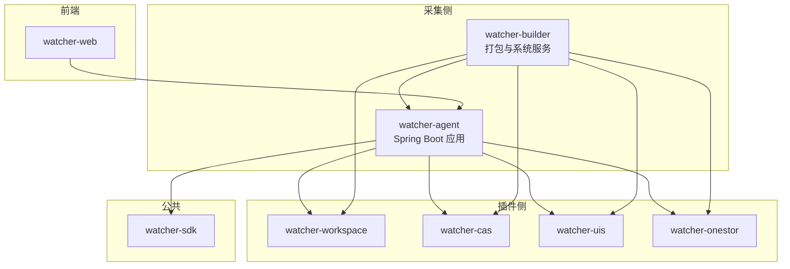
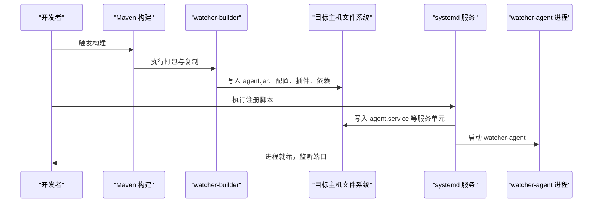
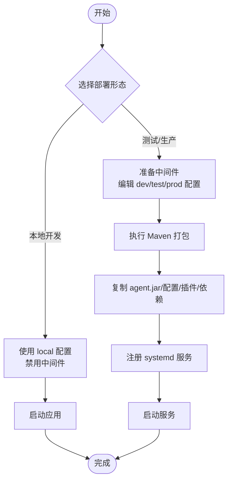
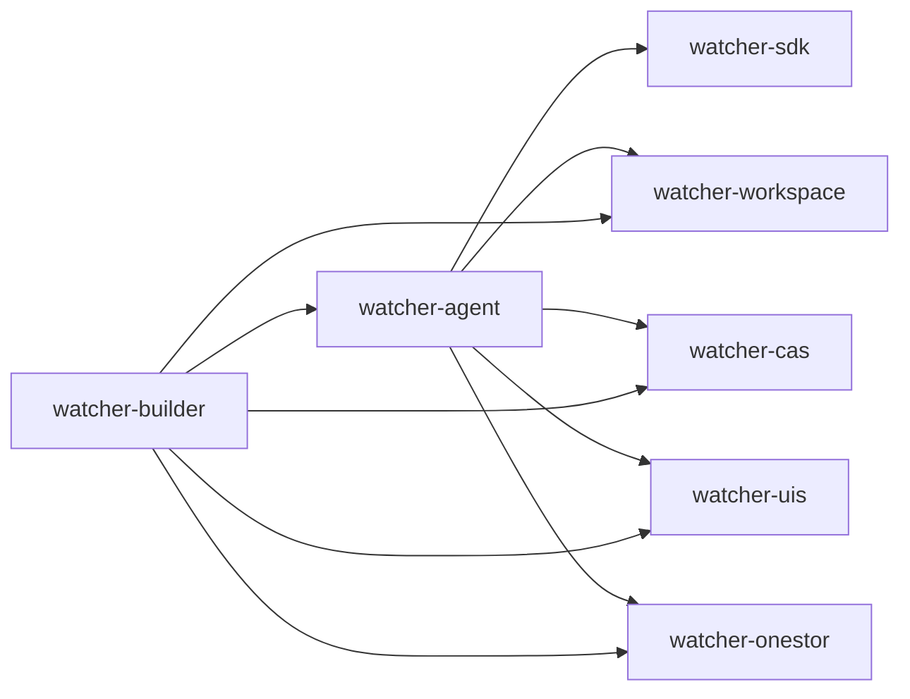

# 快速开始

<cite>
**本文引用的文件**
- [Readme.md](file://Readme.md)
- [WatcherAgentApplication.java](file://watcher-agent/src/main/java/com/virtual/cloud/om/agent/WatcherAgentApplication.java)
- [application-local.properties](file://watcher-agent/src/main/resources/application-local.properties)
- [application-dev.properties](file://watcher-agent/src/main/resources/application-dev.properties)
- [application-test.properties](file://watcher-agent/src/main/resources/application-test.properties)
- [application-prod.properties](file://watcher-agent/src/main/resources/application-prod.properties)
- [startup.sh](file://watcher-builder/assembly/bin/startup.sh)
- [register_as_system_service_and_start.sh](file://watcher-builder/assembly/bin/register_as_system_service_and_start.sh)
- [init.sh](file://watcher-builder/assembly/bin/init.sh)
- [agent.service](file://watcher-builder/assembly/conf/agent.service)
- [pom.xml（watcher-builder）](file://watcher-builder/pom.xml)
- [pom.xml（watcher-agent）](file://watcher-agent/pom.xml)
- [schema-mysql.sql](file://watcher-agent/src/main/resources/schema-mysql.sql)
- [init.sql](file://watcher-agent/src/main/resources/database/init.sql)
</cite>

## 目录
1. [简介](#简介)
2. [项目结构](#项目结构)
3. [核心组件](#核心组件)
4. [架构总览](#架构总览)
5. [详细组件分析](#详细组件分析)
6. [依赖分析](#依赖分析)
7. [性能考虑](#性能考虑)
8. [故障排查指南](#故障排查指南)
9. [结论](#结论)
10. [附录](#附录)

## 简介
本指南面向首次接触 ShowTime 监控系统的新用户，帮助你在最短时间内完成环境准备、安装部署与基础使用。ShowTime 是一套围绕日志与指标的时间序列数据监控体系，采用多模块聚合工程，核心由“采集代理”“数据处理与展示”“插件化采集扩展”等部分组成。系统支持本地开发、测试与生产三种部署形态，通过 Maven 构建打包与 systemd 服务管理实现一键启动。

## 项目结构
- 采集代理（watcher-agent）：Spring Boot 应用，负责资源管理、定时采集、策略下发、与外部中间件（MongoDB、Kafka、ES、ClickHouse）交互。
- 打包与运维（watcher-builder）：提供统一打包、复制配置与依赖、注册系统服务的能力。
- 插件模块（watcher-workspace、watcher-cas、watcher-uis、watcher-onestor 等）：按产品线扩展采集能力。
- 前端（watcher-web）：Vue3 前端，用于资源与策略配置、监控数据展示。
- 公共 SDK（watcher-sdk）：公共 DTO、常量、工具类与配置。

图表来源
- [Readme.md:29-38](file://Readme.md#L29-L38)
- [pom.xml（watcher-builder）:12-13](file://watcher-builder/pom.xml#L12-L13)
- [pom.xml（watcher-agent）:24-50](file://watcher-agent/pom.xml#L24-L50)

章节来源
- [Readme.md:27-45](file://Readme.md#L27-L45)
- [pom.xml（watcher-builder）:12-13](file://watcher-builder/pom.xml#L12-L13)
- [pom.xml（watcher-agent）:24-50](file://watcher-agent/pom.xml#L24-L50)

## 核心组件
- 采集代理应用入口：定义扫描包范围、关闭 Quartz 自动装配、启用调度，作为多模块聚合工程的启动入口。
- 配置文件族：提供 local/dev/test/prod 四套环境配置，分别覆盖中间件开关、数据源、插件服务地址、端口等。
- 启动与系统服务：提供 systemd 服务模板与注册脚本，配合启动脚本完成进程与中间件的托管。
- 打包与复制：在打包阶段将各模块 JAR、配置、插件与依赖复制到统一目录，便于部署。

章节来源
- [WatcherAgentApplication.java:14-27](file://watcher-agent/src/main/java/com/virtual/cloud/om/agent/WatcherAgentApplication.java#L14-L27)
- [application-local.properties:1-61](file://watcher-agent/src/main/resources/application-local.properties#L1-L61)
- [application-dev.properties:1-72](file://watcher-agent/src/main/resources/application-dev.properties#L1-L72)
- [application-test.properties:1-66](file://watcher-agent/src/main/resources/application-test.properties#L1-L66)
- [application-prod.properties:1-70](file://watcher-agent/src/main/resources/application-prod.properties#L1-L70)
- [startup.sh:78](file://watcher-builder/assembly/bin/startup.sh#L78)
- [agent.service:1-14](file://watcher-builder/assembly/conf/agent.service#L1-L14)
- [pom.xml（watcher-builder）:25-199](file://watcher-builder/pom.xml#L25-L199)

## 架构总览
下图展示了从本地开发到生产部署的关键路径：本地配置 → Maven 打包 → 复制配置与依赖 → 注册系统服务 → 启动进程与中间件。

图表来源
- [pom.xml（watcher-builder）:25-199](file://watcher-builder/pom.xml#L25-L199)
- [register_as_system_service_and_start.sh:17-38](file://watcher-builder/assembly/bin/register_as_system_service_and_start.sh#L17-L38)
- [startup.sh:78](file://watcher-builder/assembly/bin/startup.sh#L78)

## 详细组件分析

### 环境准备与依赖
- JDK：启动脚本要求 Java 1.8 及以上版本；建议使用 1.8+。
- 数据库：MySQL（本地开发模式默认使用），生产/测试可选 MongoDB、ClickHouse 等。
- 消息队列：Kafka（可选启用）。
- 搜索引擎：Elasticsearch（可选启用）。
- 其他：Nginx（可选）、ZooKeeper（Kafka 依赖）、Filebeat（日志采集，随打包提供）。

章节来源
- [startup.sh:3-25](file://watcher-builder/assembly/bin/startup.sh#L3-L25)
- [application-local.properties:33-42](file://watcher-agent/src/main/resources/application-local.properties#L33-L42)
- [application-dev.properties:3-29](file://watcher-agent/src/main/resources/application-dev.properties#L3-L29)
- [application-test.properties:3-26](file://watcher-agent/src/main/resources/application-test.properties#L3-L26)
- [application-prod.properties:3-29](file://watcher-agent/src/main/resources/application-prod.properties#L3-L29)

### 安装与部署流程
- 本地开发（无中间件依赖）
  - 使用本地配置文件，禁用中间件，启用必要的插件服务地址。
  - 启动应用后，访问前端页面进行资源与策略配置。
- 测试/生产（启用中间件）
  - 准备 MongoDB、Kafka、ES、ClickHouse 等中间件，并在对应环境配置文件中填写连接信息。
  - 使用 watcher-builder 打包，复制 agent.jar、配置、插件与依赖至目标主机。
  - 通过注册脚本将 agent.service 等服务单元写入系统并启动。

图表来源
- [application-local.properties:14-20](file://watcher-agent/src/main/resources/application-local.properties#L14-L20)
- [application-dev.properties:3-29](file://watcher-agent/src/main/resources/application-dev.properties#L3-L29)
- [application-test.properties:3-26](file://watcher-agent/src/main/resources/application-test.properties#L3-L26)
- [application-prod.properties:3-29](file://watcher-agent/src/main/resources/application-prod.properties#L3-L29)
- [pom.xml（watcher-builder）:25-199](file://watcher-builder/pom.xml#L25-L199)
- [register_as_system_service_and_start.sh:17-38](file://watcher-builder/assembly/bin/register_as_system_service_and_start.sh#L17-L38)

章节来源
- [application-local.properties:14-20](file://watcher-agent/src/main/resources/application-local.properties#L14-L20)
- [application-dev.properties:3-29](file://watcher-agent/src/main/resources/application-dev.properties#L3-L29)
- [application-test.properties:3-26](file://watcher-agent/src/main/resources/application-test.properties#L3-L26)
- [application-prod.properties:3-29](file://watcher-agent/src/main/resources/application-prod.properties#L3-L29)
- [pom.xml（watcher-builder）:25-199](file://watcher-builder/pom.xml#L25-L199)
- [register_as_system_service_and_start.sh:17-38](file://watcher-builder/assembly/bin/register_as_system_service_and_start.sh#L17-L38)

### 基本使用示例
- 启动监控代理
  - 本地开发：直接运行应用入口类，或使用 IDE 启动。
  - 测试/生产：通过 systemd 服务启动 agent。
- 配置资源
  - 在前端页面添加被监控资源，设置采集策略与告警规则。
- 查看监控数据
  - 通过前端页面查看指标与日志检索结果；如启用 ES，可在 Kibana 中进行可视化。

章节来源
- [WatcherAgentApplication.java:24-27](file://watcher-agent/src/main/java/com/virtual/cloud/om/agent/WatcherAgentApplication.java#L24-L27)
- [startup.sh:78](file://watcher-builder/assembly/bin/startup.sh#L78)
- [agent.service:6-10](file://watcher-builder/assembly/conf/agent.service#L6-L10)

### 初始化配置要点
- 本地开发
  - 关闭中间件开关，启用必要的插件服务地址（CAS/UIS/WS/OneStor）。
  - 配置 MySQL 数据源与 MyBatis-Plus 映射。
- 测试/生产
  - 填写 MongoDB/Kafka/ES/ClickHouse 的连接参数。
  - 设置批量采集日志根路径、REST 客户端开关与端口变量。
- 数据库初始化
  - 使用 schema-mysql.sql 初始化 MySQL 表结构。
  - 使用 init.sql 初始化 MongoDB/ES/ClickHouse 的初始数据与索引（如适用）。

章节来源
- [application-local.properties:14-20](file://watcher-agent/src/main/resources/application-local.properties#L14-L20)
- [application-local.properties:33-54](file://watcher-agent/src/main/resources/application-local.properties#L33-L54)
- [application-dev.properties:3-69](file://watcher-agent/src/main/resources/application-dev.properties#L3-L69)
- [application-test.properties:3-65](file://watcher-agent/src/main/resources/application-test.properties#L3-L65)
- [application-prod.properties:3-70](file://watcher-agent/src/main/resources/application-prod.properties#L3-L70)
- [schema-mysql.sql](file://watcher-agent/src/main/resources/schema-mysql.sql)
- [init.sql](file://watcher-agent/src/main/resources/database/init.sql)

### 不同部署场景配置差异
- 本地开发（local）
  - 禁用中间件，使用本地 MySQL，启用插件服务地址。
- 测试（test）
  - 连接测试集群的 MongoDB/Kafka/ES/ClickHouse，开启相关开关。
- 生产（prod）
  - 连接生产集群的 MongoDB/Kafka/ES/ClickHouse，设置批量采集根路径与 REST 客户端参数。

章节来源
- [application-local.properties:14-20](file://watcher-agent/src/main/resources/application-local.properties#L14-L20)
- [application-local.properties:33-54](file://watcher-agent/src/main/resources/application-local.properties#L33-L54)
- [application-test.properties:3-65](file://watcher-agent/src/main/resources/application-test.properties#L3-L65)
- [application-prod.properties:3-70](file://watcher-agent/src/main/resources/application-prod.properties#L3-L70)

## 依赖分析
- 组件耦合
  - watcher-agent 依赖 watcher-sdk 与多个插件模块，形成松耦合的插件化架构。
  - watcher-builder 负责统一打包与复制，降低部署复杂度。
- 外部依赖
  - 中间件（MongoDB、Kafka、ES、ClickHouse）通过配置文件注入。
  - Nginx/ZooKeeper 通过 systemd 管理，随服务启动。

图表来源
- [pom.xml（watcher-agent）:24-50](file://watcher-agent/pom.xml#L24-L50)
- [pom.xml（watcher-builder）:116-162](file://watcher-builder/pom.xml#L116-L162)

章节来源
- [pom.xml（watcher-agent）:24-50](file://watcher-agent/pom.xml#L24-L50)
- [pom.xml（watcher-builder）:116-162](file://watcher-builder/pom.xml#L116-L162)

## 性能考虑
- JVM 参数：启动脚本中设置了堆大小与 GC 日志轮转策略，可根据实际负载调整。
- 中间件连接：合理设置 ES 的连接超时、最大连接数与每路由最大连接数，避免高并发下的连接瓶颈。
- 采集策略：在测试/生产配置中控制批量采集根路径与开关，减少不必要的 IO 压力。

章节来源
- [startup.sh:62-72](file://watcher-builder/assembly/bin/startup.sh#L62-L72)
- [application-dev.properties:21-31](file://watcher-agent/src/main/resources/application-dev.properties#L21-L31)
- [application-test.properties:17-26](file://watcher-agent/src/main/resources/application-test.properties#L17-L26)
- [application-prod.properties:21-29](file://watcher-agent/src/main/resources/application-prod.properties#L21-L29)

## 故障排查指南
- Java 版本不满足
  - 现象：启动失败并提示 Java 版本过低。
  - 处理：安装 Java 1.8 或更高版本，并确保 PATH 或 JAVA_HOME 正确。
- 中间件连接异常
  - 现象：应用启动后无法连接 MongoDB/Kafka/ES/ClickHouse。
  - 处理：检查对应环境配置文件中的连接参数与网络连通性。
- 系统服务未启动
  - 现象：systemd 服务已注册但进程未运行。
  - 处理：查看服务状态与错误日志，确认 agent.service 中的 ExecStart 路径与权限。
- 数据库初始化失败
  - 现象：应用启动报表不存在或索引缺失。
  - 处理：执行 schema-mysql.sql 初始化 MySQL 表结构；按需执行 init.sql 初始化其他存储。

章节来源
- [startup.sh:3-25](file://watcher-builder/assembly/bin/startup.sh#L3-L25)
- [application-dev.properties:3-29](file://watcher-agent/src/main/resources/application-dev.properties#L3-L29)
- [application-test.properties:3-26](file://watcher-agent/src/main/resources/application-test.properties#L3-L26)
- [application-prod.properties:3-29](file://watcher-agent/src/main/resources/application-prod.properties#L3-L29)
- [agent.service:6-10](file://watcher-builder/assembly/conf/agent.service#L6-L10)
- [schema-mysql.sql](file://watcher-agent/src/main/resources/schema-mysql.sql)
- [init.sql](file://watcher-agent/src/main/resources/database/init.sql)

## 结论
通过本快速开始指南，你可以在本地或生产环境中完成 ShowTime 监控系统的环境准备、安装部署与基础使用。建议优先在本地开发模式验证功能，再逐步迁移到测试/生产环境。遇到问题时，结合配置文件与系统服务日志进行定位，通常能快速解决常见问题。

## 附录
- 快速命令参考
  - 本地启动：运行应用入口类或使用 IDE 启动。
  - 打包：在根目录执行 Maven 构建，生成统一部署包。
  - 注册服务：在目标主机执行注册脚本，完成 systemd 服务注册与启动。
  - 查看状态：使用 systemctl 查看服务状态与日志。

章节来源
- [WatcherAgentApplication.java:24-27](file://watcher-agent/src/main/java/com/virtual/cloud/om/agent/WatcherAgentApplication.java#L24-L27)
- [pom.xml（watcher-builder）:25-199](file://watcher-builder/pom.xml#L25-L199)
- [register_as_system_service_and_start.sh:17-38](file://watcher-builder/assembly/bin/register_as_system_service_and_start.sh#L17-L38)