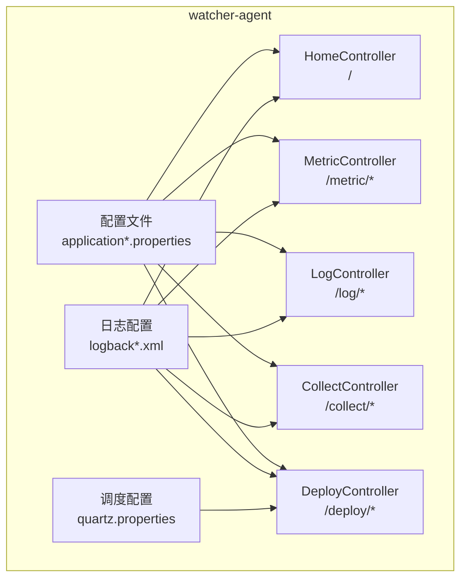
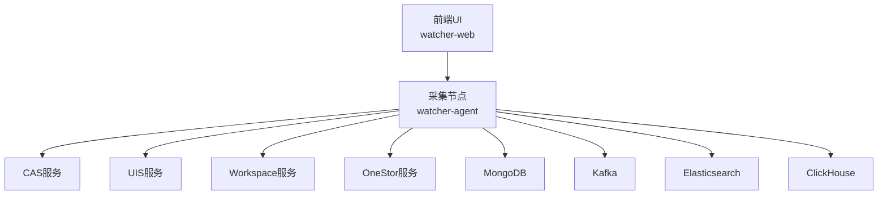
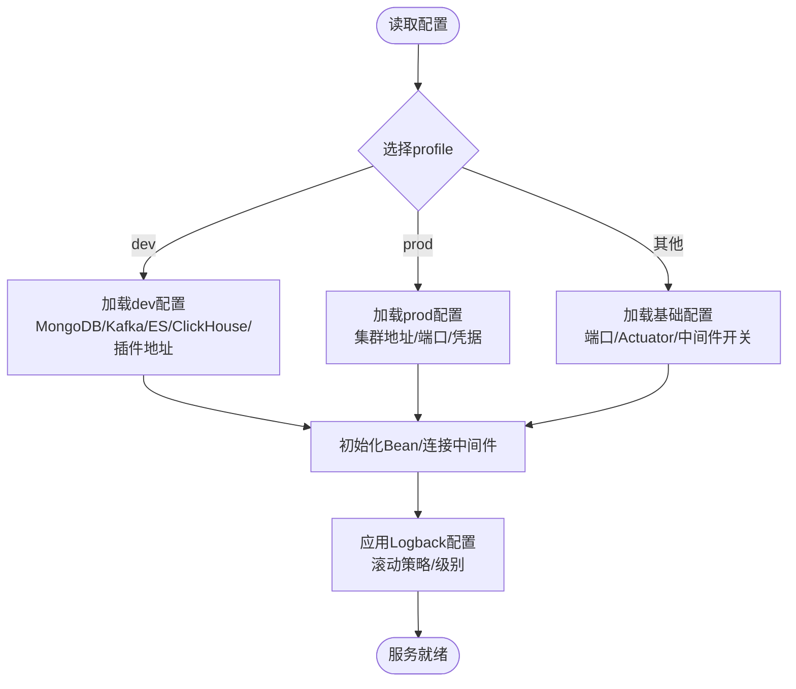
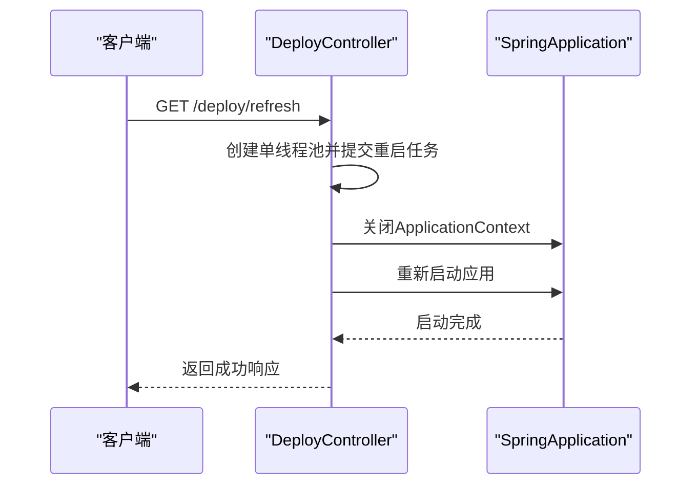
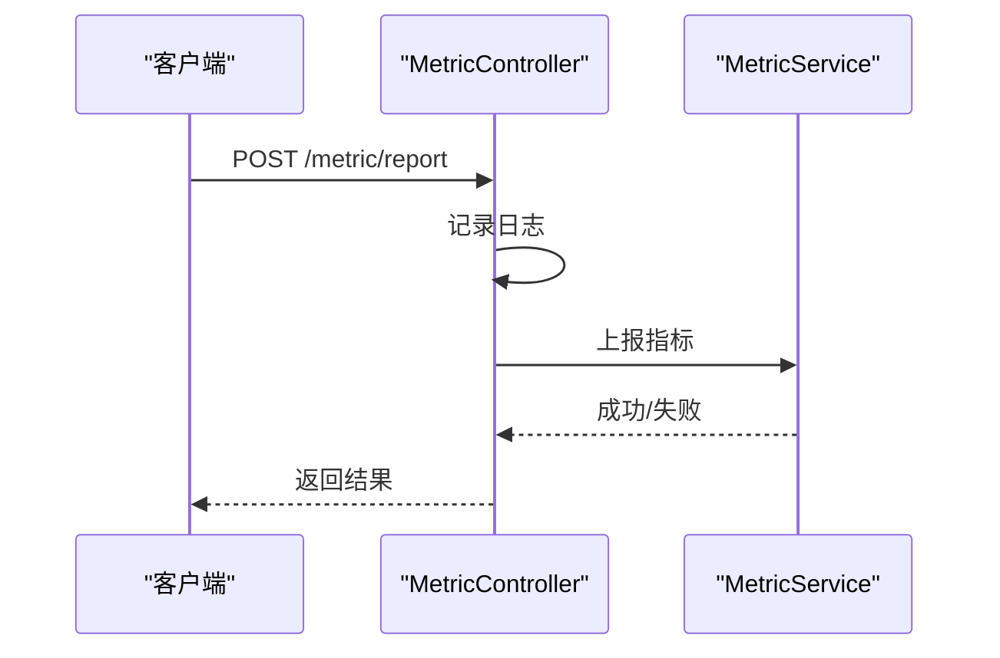
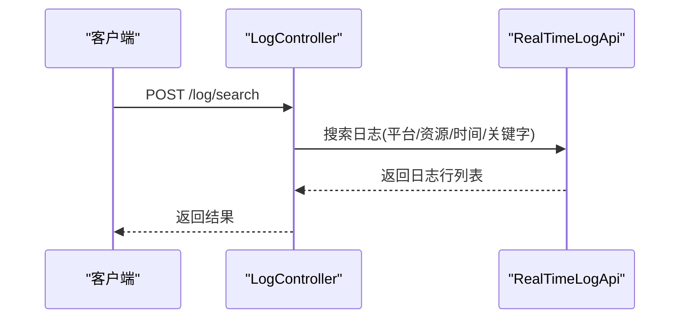
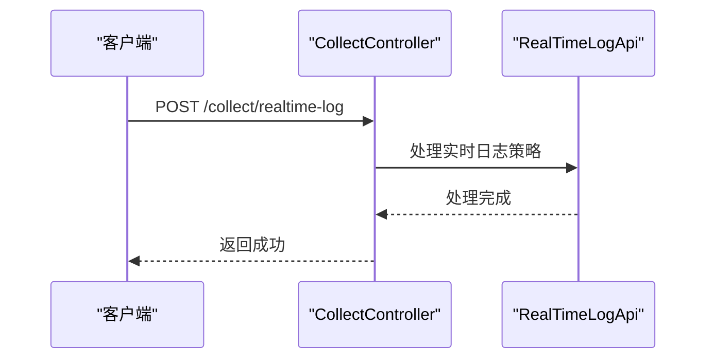
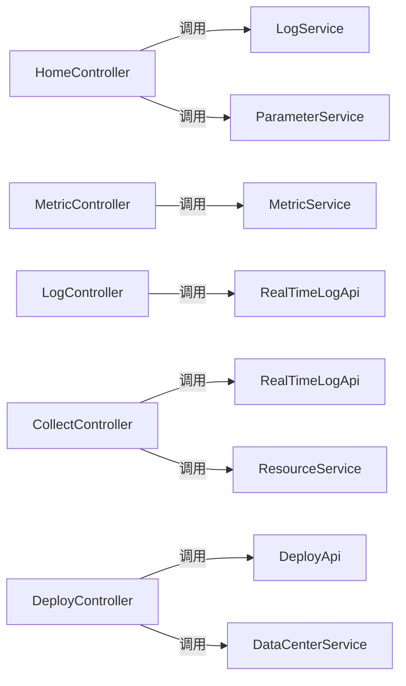

# 故障排查与调试

<cite>
**本文引用的文件**
- [Readme.md](file://Readme.md)
- [application.properties](file://watcher-agent/src/main/resources/application.properties)
- [application-dev.properties](file://watcher-agent/src/main/resources/application-dev.properties)
- [application-prod.properties](file://watcher-agent/src/main/resources/application-prod.properties)
- [logback-dev.xml](file://watcher-agent/src/main/resources/logback-dev.xml)
- [logback-prod.xml](file://watcher-agent/src/main/resources/logback-prod.xml)
- [quartz.properties](file://watcher-agent/src/main/resources/quartz.properties)
- [HomeController.java](file://watcher-agent/src/main/java/com/virtual/cloud/om/agent/controller/HomeController.java)
- [MetricController.java](file://watcher-agent/src/main/java/com/virtual/cloud/om/agent/controller/MetricController.java)
- [LogController.java](file://watcher-agent/src/main/java/com/virtual/cloud/om/agent/controller/LogController.java)
- [CollectController.java](file://watcher-agent/src/main/java/com/virtual/cloud/om/agent/controller/CollectController.java)
- [DeployController.java](file://watcher-agent/src/main/java/com/virtual/cloud/om/agent/controller/DeployController.java)
</cite>

## 目录
1. [简介](#简介)
2. [项目结构](#项目结构)
3. [核心组件](#核心组件)
4. [架构总览](#架构总览)
5. [详细组件分析](#详细组件分析)
6. [依赖关系分析](#依赖关系分析)
7. [性能考量](#性能考量)
8. [故障排查指南](#故障排查指南)
9. [结论](#结论)
10. [附录](#附录)

## 简介
本指南面向ShowTime监控系统的运维与开发人员，聚焦“watcher-agent”采集节点的故障排查与调试。内容涵盖系统启动失败、服务无响应、数据采集异常、性能瓶颈的诊断步骤；日志分析技巧（级别配置、关键信息识别、聚合分析）；性能优化策略（系统监控、瓶颈定位与建议）；调试工具与方法（远程调试、性能分析、内存泄漏检测）；监控告警配置与使用（规则、通知、自愈）；系统健康检查清单；以及紧急故障处理流程（重启、数据恢复、网络故障排除）。

## 项目结构
- 系统采用多模块单体架构，核心模块包括：
  - watcher-agent：采集程序主入口、资源管理、定时指标采集、日志收集策略下发、MySQL数据源、Quartz定时任务、MongoDB、Kafka、Elasticsearch、ClickHouse等中间件开关与插件开关集中配置。
  - watcher-sdk：公共配置、DTO、工具类与AOP切面。
  - watcher-builder：打包与系统服务注册脚本。
  - watcher-web：前端Vue3界面。
  - watcher-cas/uis/onestor/workspace：各产品线的指标采集、日志解析与告警上报。
- 本指南重点围绕watcher-agent的配置与控制器行为进行故障排查与调试。

图表来源
- [application.properties:1-80](file://watcher-agent/src/main/resources/application.properties#L1-L80)
- [application-dev.properties:1-72](file://watcher-agent/src/main/resources/application-dev.properties#L1-L72)
- [application-prod.properties:1-70](file://watcher-agent/src/main/resources/application-prod.properties#L1-L70)
- [logback-dev.xml:1-44](file://watcher-agent/src/main/resources/logback-dev.xml#L1-L44)
- [logback-prod.xml:1-35](file://watcher-agent/src/main/resources/logback-prod.xml#L1-L35)
- [quartz.properties:1-45](file://watcher-agent/src/main/resources/quartz.properties#L1-L45)
- [HomeController.java:1-100](file://watcher-agent/src/main/java/com/virtual/cloud/om/agent/controller/HomeController.java#L1-L100)
- [MetricController.java:1-103](file://watcher-agent/src/main/java/com/virtual/cloud/om/agent/controller/MetricController.java#L1-L103)
- [LogController.java:1-36](file://watcher-agent/src/main/java/com/virtual/cloud/om/agent/controller/LogController.java#L1-L36)
- [CollectController.java:1-67](file://watcher-agent/src/main/java/com/virtual/cloud/om/agent/controller/CollectController.java#L1-L67)
- [DeployController.java:1-325](file://watcher-agent/src/main/java/com/virtual/cloud/om/agent/controller/DeployController.java#L1-L325)

章节来源
- [Readme.md:1-45](file://Readme.md#L1-L45)
- [application.properties:1-80](file://watcher-agent/src/main/resources/application.properties#L1-L80)

## 核心组件
- 配置体系
  - 应用基础配置：端口、上下文路径、应用名、watcher.home、循环依赖允许、Actuator暴露、中间件与插件开关、数据源与MyBatis配置、服务地址等。
  - 环境配置：dev/prod/test/local等profile覆盖项，如MongoDB/Kafka/ES/ClickHouse、UIS/CAS/OneStor服务地址、批量采集日志根路径等。
  - 日志配置：Logback RollingFileAppender与ConsoleAppender，按大小与时间滚动，生产环境默认INFO级别。
  - 调度配置：Quartz线程池大小、集群模式等。
- 控制器层
  - HomeController：系统基本信息、参数配置、日志查询与清理、Kafka调试开关（当前禁用）。
  - MetricController：指标类型/平台查询、指标列表/最新值/趋势/上报、汇总。
  - LogController：日志在线检索。
  - CollectController：实时日志策略下发、资源同步、批量部署。
  - DeployController：批量/单点部署、节点状态查询、组件管理、应用刷新、主机与IP、keepalived通知、网络配置、路由管理、WiFi扫描等。

章节来源
- [application.properties:1-80](file://watcher-agent/src/main/resources/application.properties#L1-L80)
- [application-dev.properties:1-72](file://watcher-agent/src/main/resources/application-dev.properties#L1-L72)
- [application-prod.properties:1-70](file://watcher-agent/src/main/resources/application-prod.properties#L1-L70)
- [logback-dev.xml:1-44](file://watcher-agent/src/main/resources/logback-dev.xml#L1-L44)
- [logback-prod.xml:1-35](file://watcher-agent/src/main/resources/logback-prod.xml#L1-L35)
- [quartz.properties:1-45](file://watcher-agent/src/main/resources/quartz.properties#L1-L45)
- [HomeController.java:1-100](file://watcher-agent/src/main/java/com/virtual/cloud/om/agent/controller/HomeController.java#L1-L100)
- [MetricController.java:1-103](file://watcher-agent/src/main/java/com/virtual/cloud/om/agent/controller/MetricController.java#L1-L103)
- [LogController.java:1-36](file://watcher-agent/src/main/java/com/virtual/cloud/om/agent/controller/LogController.java#L1-L36)
- [CollectController.java:1-67](file://watcher-agent/src/main/java/com/virtual/cloud/om/agent/controller/CollectController.java#L1-L67)
- [DeployController.java:1-325](file://watcher-agent/src/main/java/com/virtual/cloud/om/agent/controller/DeployController.java#L1-L325)

## 架构总览
- 组件交互概览：客户端通过watcher-web访问后端API；watcher-agent提供采集、指标与日志能力，并可调用CAS/UIS/Workspace/OneStor等插件服务；中间件包括MongoDB、Kafka、Elasticsearch、ClickHouse等，但默认在单机版中处于禁用状态，需按环境开启。
- 关键控制流：部署/刷新/网络配置/路由管理等均通过DeployController对外暴露REST接口；指标与日志查询通过MetricController与LogController；HomeController提供系统级参数与日志管理。

图表来源
- [application.properties:40-71](file://watcher-agent/src/main/resources/application.properties#L40-L71)
- [Readme.md:27-39](file://Readme.md#L27-L39)

## 详细组件分析

### 配置与日志组件
- 配置要点
  - Actuator健康检查与详情：management端点暴露与健康详情显示。
  - 中间件开关：elasticsearch.enable、kafka.enable、mongodb.enable、clickhouse.enable、quartz.enable等，默认禁用。
  - 插件开关：rest-client.cas.enable、rest-client.uis.enable、rest-client.ws.enable、rest-client.onestor.enable，默认禁用。
  - 数据源与MyBatis：MariaDB/JDBC驱动、Mapper扫描、驼峰映射、日志实现。
  - 服务地址：CAS/UIS/Workspace/OneStor服务URL。
  - 批量采集日志根目录：batch.collect.log.dir.name。
- 日志配置
  - 文件滚动：按日期与大小滚动压缩，保留历史数量与总容量上限。
  - 生产环境默认INFO级别，开发环境可调整。
  - Quartz相关日志抑制至WARN，避免噪声。

图表来源
- [application.properties:1-80](file://watcher-agent/src/main/resources/application.properties#L1-L80)
- [application-dev.properties:1-72](file://watcher-agent/src/main/resources/application-dev.properties#L1-L72)
- [application-prod.properties:1-70](file://watcher-agent/src/main/resources/application-prod.properties#L1-L70)
- [logback-dev.xml:1-44](file://watcher-agent/src/main/resources/logback-dev.xml#L1-L44)
- [logback-prod.xml:1-35](file://watcher-agent/src/main/resources/logback-prod.xml#L1-L35)

章节来源
- [application.properties:1-80](file://watcher-agent/src/main/resources/application.properties#L1-L80)
- [application-dev.properties:1-72](file://watcher-agent/src/main/resources/application-dev.properties#L1-L72)
- [application-prod.properties:1-70](file://watcher-agent/src/main/resources/application-prod.properties#L1-L70)
- [logback-dev.xml:1-44](file://watcher-agent/src/main/resources/logback-dev.xml#L1-L44)
- [logback-prod.xml:1-35](file://watcher-agent/src/main/resources/logback-prod.xml#L1-L35)

### 控制器组件与典型流程

#### 应用刷新流程（DeployController.refreshApplication）
- 触发条件：/deploy/refresh
- 处理逻辑：单线程池异步关闭ApplicationContext并重新启动，确保优雅重启。
- 故障点：线程池拒绝策略、命令执行超时、Spring上下文重建失败。

图表来源
- [DeployController.java:92-102](file://watcher-agent/src/main/java/com/virtual/cloud/om/agent/controller/DeployController.java#L92-L102)

章节来源
- [DeployController.java:92-102](file://watcher-agent/src/main/java/com/virtual/cloud/om/agent/controller/DeployController.java#L92-L102)

#### 指标上报流程（MetricController.report）
- 触发条件：POST /metric/report
- 处理逻辑：记录请求日志，调用服务层上报指标，异常捕获并返回错误信息。
- 故障点：服务层异常、目标存储不可用、请求体格式不正确。

图表来源
- [MetricController.java:80-91](file://watcher-agent/src/main/java/com/virtual/cloud/om/agent/controller/MetricController.java#L80-L91)

章节来源
- [MetricController.java:80-91](file://watcher-agent/src/main/java/com/virtual/cloud/om/agent/controller/MetricController.java#L80-L91)

#### 日志在线检索流程（LogController.search）
- 触发条件：POST /log/search
- 处理逻辑：调用RealTimeLogApi执行跨平台/资源/时间范围检索，返回日志行集合。
- 故障点：ES/Kafka/ClickHouse未启用或不可达、参数缺失、权限不足。

图表来源
- [LogController.java:27-34](file://watcher-agent/src/main/java/com/virtual/cloud/om/agent/controller/LogController.java#L27-L34)

章节来源
- [LogController.java:27-34](file://watcher-agent/src/main/java/com/virtual/cloud/om/agent/controller/LogController.java#L27-L34)

#### 实时日志策略下发流程（CollectController.realtime-log）
- 触发条件：POST /collect/realtime-log
- 处理逻辑：调用RealTimeLogApi处理策略请求，返回成功。
- 故障点：策略参数非法、目标节点不可达、服务内部异常。

图表来源
- [CollectController.java:45-51](file://watcher-agent/src/main/java/com/virtual/cloud/om/agent/controller/CollectController.java#L45-L51)

章节来源
- [CollectController.java:45-51](file://watcher-agent/src/main/java/com/virtual/cloud/om/agent/controller/CollectController.java#L45-L51)

## 依赖关系分析
- 组件耦合
  - 控制器依赖服务层与SDK API，服务层依赖DAO与外部中间件。
  - 配置文件集中定义中间件与插件开关，影响运行期可用性。
- 外部依赖
  - MongoDB、Kafka、Elasticsearch、ClickHouse默认禁用，需按环境启用。
  - Quartz用于调度，线程池大小与集群模式需结合负载评估。
- 潜在环路
  - 允许循环依赖，需谨慎设计以避免复杂耦合。

图表来源
- [HomeController.java:37-44](file://watcher-agent/src/main/java/com/virtual/cloud/om/agent/controller/HomeController.java#L37-L44)
- [MetricController.java:26-27](file://watcher-agent/src/main/java/com/virtual/cloud/om/agent/controller/MetricController.java#L26-L27)
- [LogController.java:24-25](file://watcher-agent/src/main/java/com/virtual/cloud/om/agent/controller/LogController.java#L24-L25)
- [CollectController.java:32-36](file://watcher-agent/src/main/java/com/virtual/cloud/om/agent/controller/CollectController.java#L32-L36)
- [DeployController.java:38-42](file://watcher-agent/src/main/java/com/virtual/cloud/om/agent/controller/DeployController.java#L38-L42)

章节来源
- [HomeController.java:37-44](file://watcher-agent/src/main/java/com/virtual/cloud/om/agent/controller/HomeController.java#L37-L44)
- [MetricController.java:26-27](file://watcher-agent/src/main/java/com/virtual/cloud/om/agent/controller/MetricController.java#L26-L27)
- [LogController.java:24-25](file://watcher-agent/src/main/java/com/virtual/cloud/om/agent/controller/LogController.java#L24-L25)
- [CollectController.java:32-36](file://watcher-agent/src/main/java/com/virtual/cloud/om/agent/controller/CollectController.java#L32-L36)
- [DeployController.java:38-42](file://watcher-agent/src/main/java/com/virtual/cloud/om/agent/controller/DeployController.java#L38-L42)

## 性能考量
- 线程池与调度
  - Quartz线程池大小为10，集群模式可提升高可用性，需结合任务复杂度与并发需求评估。
- 日志滚动与IO
  - 滚动策略限制单文件大小与总容量，避免磁盘打满；生产环境默认INFO级别，减少冗余日志。
- 中间件启用策略
  - 默认禁用ES/Kafka/MongoDB/ClickHouse，仅在需要时启用，避免无效连接与资源占用。
- 指标与日志查询
  - 指标查询支持分页与时间范围，建议合理设置分页大小与时间窗口，避免大查询导致延迟。

章节来源
- [quartz.properties:15-40](file://watcher-agent/src/main/resources/quartz.properties#L15-L40)
- [logback-dev.xml:17-26](file://watcher-agent/src/main/resources/logback-dev.xml#L17-L26)
- [logback-prod.xml:18-27](file://watcher-agent/src/main/resources/logback-prod.xml#L18-L27)
- [application.properties:16-29](file://watcher-agent/src/main/resources/application.properties#L16-L29)
- [MetricController.java:41-57](file://watcher-agent/src/main/java/com/virtual/cloud/om/agent/controller/MetricController.java#L41-L57)

## 故障排查指南

### 系统启动失败
- 常见原因
  - profile配置缺失或错误，导致Actuator端点不可用或中间件地址为空。
  - 循环依赖被滥用导致容器初始化失败。
  - 数据源连接失败（MariaDB/JDBC驱动）。
- 排查步骤
  - 检查spring.profiles.active与对应profile文件是否存在。
  - 查看Actuator健康检查端点与详情输出。
  - 校验数据源URL、用户名、密码与驱动类。
  - 临时关闭中间件开关，逐步启用定位问题模块。
- 参考路径
  - [application.properties:1-12](file://watcher-agent/src/main/resources/application.properties#L1-L12)
  - [application.properties:48-51](file://watcher-agent/src/main/resources/application.properties#L48-L51)
  - [application-dev.properties:3-31](file://watcher-agent/src/main/resources/application-dev.properties#L3-L31)
  - [application-prod.properties:3-29](file://watcher-agent/src/main/resources/application-prod.properties#L3-L29)

章节来源
- [application.properties:1-12](file://watcher-agent/src/main/resources/application.properties#L1-L12)
- [application.properties:48-51](file://watcher-agent/src/main/resources/application.properties#L48-L51)
- [application-dev.properties:3-31](file://watcher-agent/src/main/resources/application-dev.properties#L3-L31)
- [application-prod.properties:3-29](file://watcher-agent/src/main/resources/application-prod.properties#L3-L29)

### 服务无响应
- 常见原因
  - 端口占用或防火墙阻断。
  - Actuator健康检查失败。
  - 应用刷新后上下文未完全重建。
- 排查步骤
  - 使用netstat/ss查看端口监听状态。
  - 访问/health端点查看详细健康信息。
  - 通过/refresh触发应用刷新，观察日志输出。
- 参考路径
  - [application.properties:1-4](file://watcher-agent/src/main/resources/application.properties#L1-L4)
  - [application.properties:10-11](file://watcher-agent/src/main/resources/application.properties#L10-L11)
  - [DeployController.java:92-102](file://watcher-agent/src/main/java/com/virtual/cloud/om/agent/controller/DeployController.java#L92-L102)

章节来源
- [application.properties:1-4](file://watcher-agent/src/main/resources/application.properties#L1-L4)
- [application.properties:10-11](file://watcher-agent/src/main/resources/application.properties#L10-L11)
- [DeployController.java:92-102](file://watcher-agent/src/main/java/com/virtual/cloud/om/agent/controller/DeployController.java#L92-L102)

### 数据采集异常
- 指标上报失败
  - 检查MetricController日志与异常返回。
  - 确认目标存储（如ClickHouse）已启用且可达。
- 日志检索异常
  - 确认ES/Kafka/ClickHouse开关与地址配置。
  - 校验请求参数（平台、资源ID、时间范围、关键字）。
- 实时日志策略下发失败
  - 检查策略参数合法性与目标节点状态。
- 参考路径
  - [MetricController.java:80-91](file://watcher-agent/src/main/java/com/virtual/cloud/om/agent/controller/MetricController.java#L80-L91)
  - [LogController.java:27-34](file://watcher-agent/src/main/java/com/virtual/cloud/om/agent/controller/LogController.java#L27-L34)
  - [CollectController.java:45-51](file://watcher-agent/src/main/java/com/virtual/cloud/om/agent/controller/CollectController.java#L45-L51)
  - [application.properties:16-29](file://watcher-agent/src/main/resources/application.properties#L16-L29)

章节来源
- [MetricController.java:80-91](file://watcher-agent/src/main/java/com/virtual/cloud/om/agent/controller/MetricController.java#L80-L91)
- [LogController.java:27-34](file://watcher-agent/src/main/java/com/virtual/cloud/om/agent/controller/LogController.java#L27-L34)
- [CollectController.java:45-51](file://watcher-agent/src/main/java/com/virtual/cloud/om/agent/controller/CollectController.java#L45-L51)
- [application.properties:16-29](file://watcher-agent/src/main/resources/application.properties#L16-L29)

### 性能瓶颈
- 调度与线程池
  - Quartz线程池大小为10，若任务重则考虑扩容或拆分任务。
- 日志与IO
  - 检查滚动策略与磁盘空间，避免频繁滚动造成IO压力。
- 中间件启用
  - 仅启用必要中间件，避免无效连接与资源争用。
- 查询优化
  - 指标查询使用分页与合理时间窗口，避免全量扫描。
- 参考路径
  - [quartz.properties:15-40](file://watcher-agent/src/main/resources/quartz.properties#L15-L40)
  - [logback-dev.xml:17-26](file://watcher-agent/src/main/resources/logback-dev.xml#L17-L26)
  - [application.properties:16-29](file://watcher-agent/src/main/resources/application.properties#L16-L29)
  - [MetricController.java:41-57](file://watcher-agent/src/main/java/com/virtual/cloud/om/agent/controller/MetricController.java#L41-L57)

章节来源
- [quartz.properties:15-40](file://watcher-agent/src/main/resources/quartz.properties#L15-L40)
- [logback-dev.xml:17-26](file://watcher-agent/src/main/resources/logback-dev.xml#L17-L26)
- [application.properties:16-29](file://watcher-agent/src/main/resources/application.properties#L16-L29)
- [MetricController.java:41-57](file://watcher-agent/src/main/java/com/virtual/cloud/om/agent/controller/MetricController.java#L41-L57)

### 日志分析技巧
- 级别配置
  - 开发环境可适当降低级别以便排查；生产环境保持INFO，避免日志风暴。
- 关键信息识别
  - 请求UUID与远端地址字段可用于跨组件追踪。
  - 控制器入口与异常堆栈是定位问题的关键。
- 日志聚合分析
  - 使用滚动策略与压缩归档，结合时间窗口进行聚合统计与趋势分析。
- 参考路径
  - [logback-dev.xml:10-15](file://watcher-agent/src/main/resources/logback-dev.xml#L10-L15)
  - [logback-prod.xml:10-16](file://watcher-agent/src/main/resources/logback-prod.xml#L10-L16)
  - [HomeController.java:67-71](file://watcher-agent/src/main/java/com/virtual/cloud/om/agent/controller/HomeController.java#L67-L71)
  - [MetricController.java:83-90](file://watcher-agent/src/main/java/com/virtual/cloud/om/agent/controller/MetricController.java#L83-L90)

章节来源
- [logback-dev.xml:10-15](file://watcher-agent/src/main/resources/logback-dev.xml#L10-L15)
- [logback-prod.xml:10-16](file://watcher-agent/src/main/resources/logback-prod.xml#L10-L16)
- [HomeController.java:67-71](file://watcher-agent/src/main/java/com/virtual/cloud/om/agent/controller/HomeController.java#L67-L71)
- [MetricController.java:83-90](file://watcher-agent/src/main/java/com/virtual/cloud/om/agent/controller/MetricController.java#L83-L90)

### 调试工具与方法
- 远程调试
  - 在启动参数中启用JVM远程调试选项，连接IDE进行断点调试。
- 性能分析
  - 结合JProfiler/Arthas等工具对热点方法与线程进行采样分析。
- 内存泄漏检测
  - 使用Heap Dump与GC日志分析，关注长时间存活对象与缓存堆积。
- 参考路径
  - [DeployController.java:92-102](file://watcher-agent/src/main/java/com/virtual/cloud/om/agent/controller/DeployController.java#L92-L102)

章节来源
- [DeployController.java:92-102](file://watcher-agent/src/main/java/com/virtual/cloud/om/agent/controller/DeployController.java#L92-L102)

### 监控告警配置与使用
- 告警规则设置
  - 基于指标阈值、日志关键字、服务可用性等维度设定规则。
- 告警通知
  - 通过插件服务向CAS/UIS/Workspace/OneStor上报告警。
- 故障自愈机制
  - 结合/refresh接口实现快速重启，或通过路由/网络配置接口进行网络层面修复。
- 参考路径
  - [application.properties:60-71](file://watcher-agent/src/main/resources/application.properties#L60-L71)
  - [DeployController.java:92-102](file://watcher-agent/src/main/java/com/virtual/cloud/om/agent/controller/DeployController.java#L92-L102)
  - [DeployController.java:139-180](file://watcher-agent/src/main/java/com/virtual/cloud/om/agent/controller/DeployController.java#L139-L180)

章节来源
- [application.properties:60-71](file://watcher-agent/src/main/resources/application.properties#L60-L71)
- [DeployController.java:92-102](file://watcher-agent/src/main/java/com/virtual/cloud/om/agent/controller/DeployController.java#L92-L102)
- [DeployController.java:139-180](file://watcher-agent/src/main/java/com/virtual/cloud/om/agent/controller/DeployController.java#L139-L180)

### 系统健康检查清单
- 关键指标监控
  - CPU/内存/磁盘IO/网络带宽；指标查询接口可用性。
- 依赖服务检查
  - MongoDB/Kafka/ES/ClickHouse连通性与可用性。
- 服务状态验证
  - Actuator健康端点、端口监听状态、应用上下文状态。
- 参考路径
  - [application.properties:10-11](file://watcher-agent/src/main/resources/application.properties#L10-L11)
  - [application.properties:16-29](file://watcher-agent/src/main/resources/application.properties#L16-L29)
  - [MetricController.java:29-39](file://watcher-agent/src/main/java/com/virtual/cloud/om/agent/controller/MetricController.java#L29-L39)

章节来源
- [application.properties:10-11](file://watcher-agent/src/main/resources/application.properties#L10-L11)
- [application.properties:16-29](file://watcher-agent/src/main/resources/application.properties#L16-L29)
- [MetricController.java:29-39](file://watcher-agent/src/main/java/com/virtual/cloud/om/agent/controller/MetricController.java#L29-L39)

### 紧急故障处理流程
- 系统重启
  - 通过/refresh接口触发应用刷新，观察日志确认重启完成。
- 数据恢复
  - 若涉及MongoDB/ClickHouse，优先检查数据目录与备份策略。
- 网络故障排除
  - 使用/refresh接口验证服务可用性；通过/keepalived/notify切换主备；使用/network接口配置/编辑网络与路由。
- 参考路径
  - [DeployController.java:92-102](file://watcher-agent/src/main/java/com/virtual/cloud/om/agent/controller/DeployController.java#L92-L102)
  - [DeployController.java:118-130](file://watcher-agent/src/main/java/com/virtual/cloud/om/agent/controller/DeployController.java#L118-L130)
  - [DeployController.java:139-180](file://watcher-agent/src/main/java/com/virtual/cloud/om/agent/controller/DeployController.java#L139-L180)

章节来源
- [DeployController.java:92-102](file://watcher-agent/src/main/java/com/virtual/cloud/om/agent/controller/DeployController.java#L92-L102)
- [DeployController.java:118-130](file://watcher-agent/src/main/java/com/virtual/cloud/om/agent/controller/DeployController.java#L118-L130)
- [DeployController.java:139-180](file://watcher-agent/src/main/java/com/virtual/cloud/om/agent/controller/DeployController.java#L139-L180)

## 结论
本指南基于watcher-agent的配置与控制器行为，提供了从启动、运行到性能与故障处理的完整排查路径。建议在生产环境中严格区分配置文件与日志级别，启用必要的中间件并定期进行健康检查与性能压测，以保障系统稳定运行。

## 附录
- 快速参考
  - 配置文件：application.properties、application-dev.properties、application-prod.properties
  - 日志配置：logback-dev.xml、logback-prod.xml
  - 调度配置：quartz.properties
  - 控制器：HomeController、MetricController、LogController、CollectController、DeployController