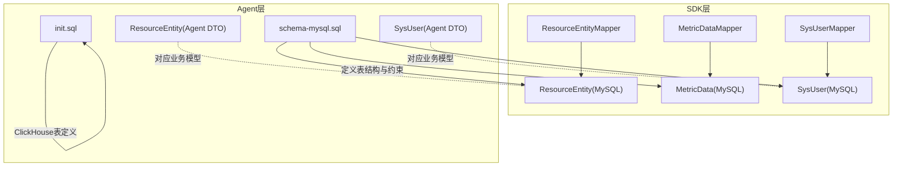
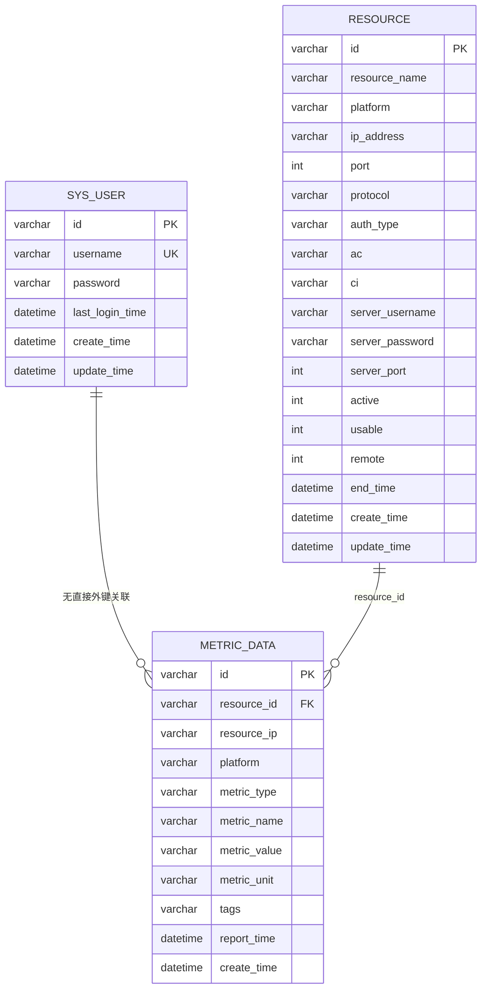
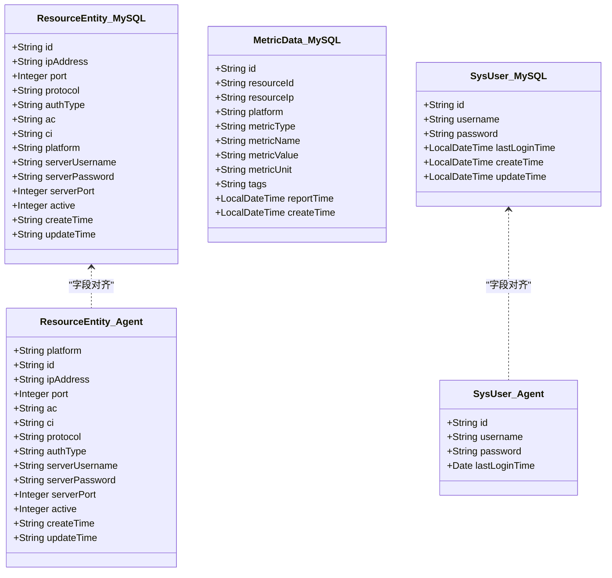
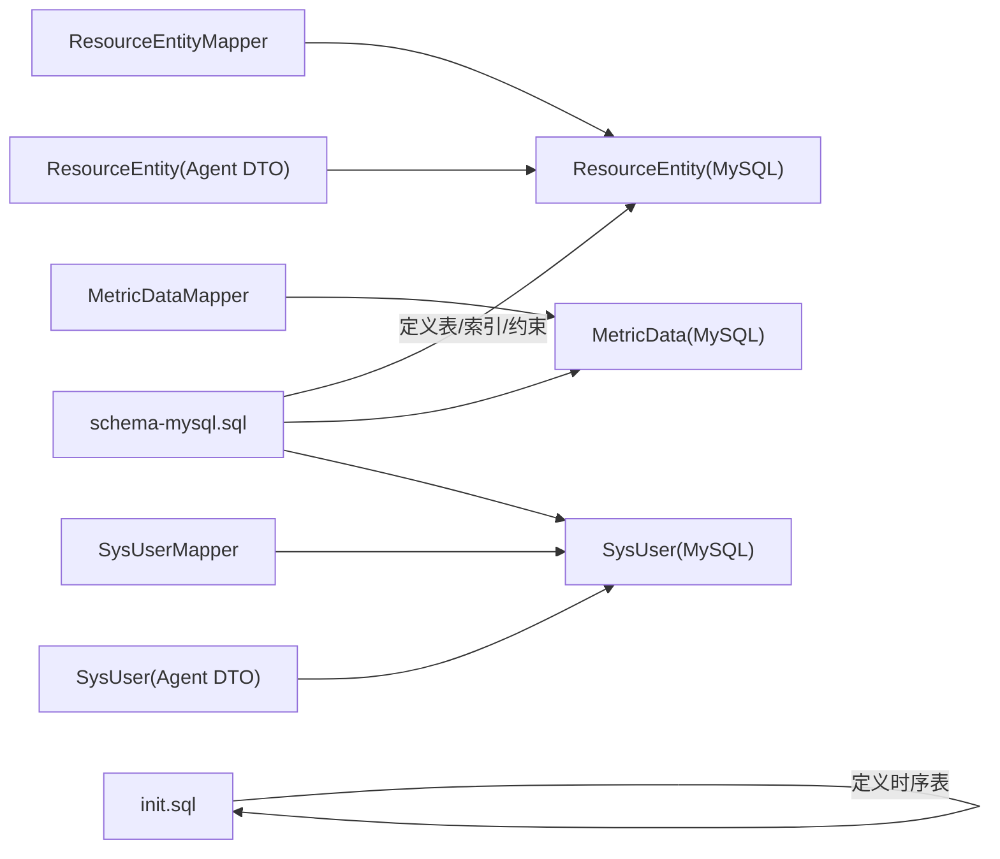

# 实体关系设计

<cite>
**本文引用的文件**
- [watcher-sdk/src/main/java/com/virtual/cloud/om/sdk/entity/mysql/ResourceEntity.java](file://watcher-sdk/src/main/java/com/virtual/cloud/om/sdk/entity/mysql/ResourceEntity.java)
- [watcher-sdk/src/main/java/com/virtual/cloud/om/sdk/entity/mysql/MetricData.java](file://watcher-sdk/src/main/java/com/virtual/cloud/om/sdk/entity/mysql/MetricData.java)
- [watcher-sdk/src/main/java/com/virtual/cloud/om/sdk/entity/mysql/SysUser.java](file://watcher-sdk/src/main/java/com/virtual/cloud/om/sdk/entity/mysql/SysUser.java)
- [watcher-agent/src/main/java/com/virtual/cloud/om/agent/entity/ResourceEntity.java](file://watcher-agent/src/main/java/com/virtual/cloud/om/agent/entity/ResourceEntity.java)
- [watcher-agent/src/main/java/com/virtual/cloud/om/agent/entity/SysUser.java](file://watcher-agent/src/main/java/com/virtual/cloud/om/agent/entity/SysUser.java)
- [watcher-sdk/src/main/java/com/virtual/cloud/om/sdk/mapper/ResourceEntityMapper.java](file://watcher-sdk/src/main/java/com/virtual/cloud/om/sdk/mapper/ResourceEntityMapper.java)
- [watcher-sdk/src/main/java/com/virtual/cloud/om/sdk/mapper/MetricDataMapper.java](file://watcher-sdk/src/main/java/com/virtual/cloud/om/sdk/mapper/MetricDataMapper.java)
- [watcher-sdk/src/main/java/com/virtual/cloud/om/sdk/mapper/SysUserMapper.java](file://watcher-sdk/src/main/java/com/virtual/cloud/om/sdk/mapper/SysUserMapper.java)
- [watcher-agent/src/main/resources/schema-mysql.sql](file://watcher-agent/src/main/resources/schema-mysql.sql)
- [watcher-agent/src/main/resources/database/init.sql](file://watcher-agent/src/main/resources/database/init.sql)
</cite>

## 目录
1. [简介](#简介)
2. [项目结构](#项目结构)
3. [核心组件](#核心组件)
4. [架构总览](#架构总览)
5. [详细组件分析](#详细组件分析)
6. [依赖分析](#依赖分析)
7. [性能考虑](#性能考虑)
8. [故障排查指南](#故障排查指南)
9. [结论](#结论)
10. [附录](#附录)

## 简介
本文件面向ShowTime监控系统，聚焦于核心实体模型与实体关系设计，重点覆盖以下目标：
- 明确核心实体：ResourceEntity（资源）、MetricData（指标数据）、SysUser（系统用户）的设计理念与业务含义
- 描述实体间的一对一、一对多、多对多关系建模方式
- 展示实体继承与多态设计思路，以及如何通过实体关系实现灵活扩展
- 总结实体完整性约束（主键、外键、唯一性、检查约束）
- 提供ER图绘制与解读方法，帮助开发者快速理解数据结构
- 给出实体关系变更的影响分析与迁移策略建议

## 项目结构
围绕实体关系设计，本项目在SDK与Agent两端分别提供了MySQL实体与Mapper层，并在Agent侧提供数据库初始化脚本与ClickHouse相关初始化脚本，形成“实体定义—持久化映射—数据库模式”的完整链路。

图表来源
- [watcher-sdk/src/main/java/com/virtual/cloud/om/sdk/mapper/ResourceEntityMapper.java:1-14](file://watcher-sdk/src/main/java/com/virtual/cloud/om/sdk/mapper/ResourceEntityMapper.java#L1-L14)
- [watcher-sdk/src/main/java/com/virtual/cloud/om/sdk/mapper/MetricDataMapper.java:1-14](file://watcher-sdk/src/main/java/com/virtual/cloud/om/sdk/mapper/MetricDataMapper.java#L1-L14)
- [watcher-sdk/src/main/java/com/virtual/cloud/om/sdk/mapper/SysUserMapper.java:1-14](file://watcher-sdk/src/main/java/com/virtual/cloud/om/sdk/mapper/SysUserMapper.java#L1-L14)
- [watcher-sdk/src/main/java/com/virtual/cloud/om/sdk/entity/mysql/ResourceEntity.java:1-48](file://watcher-sdk/src/main/java/com/virtual/cloud/om/sdk/entity/mysql/ResourceEntity.java#L1-L48)
- [watcher-sdk/src/main/java/com/virtual/cloud/om/sdk/entity/mysql/MetricData.java:1-43](file://watcher-sdk/src/main/java/com/virtual/cloud/om/sdk/entity/mysql/MetricData.java#L1-L43)
- [watcher-sdk/src/main/java/com/virtual/cloud/om/sdk/entity/mysql/SysUser.java:1-56](file://watcher-sdk/src/main/java/com/virtual/cloud/om/sdk/entity/mysql/SysUser.java#L1-L56)
- [watcher-agent/src/main/java/com/virtual/cloud/om/agent/entity/ResourceEntity.java:1-53](file://watcher-agent/src/main/java/com/virtual/cloud/om/agent/entity/ResourceEntity.java#L1-L53)
- [watcher-agent/src/main/java/com/virtual/cloud/om/agent/entity/SysUser.java:1-36](file://watcher-agent/src/main/java/com/virtual/cloud/om/agent/entity/SysUser.java#L1-L36)
- [watcher-agent/src/main/resources/schema-mysql.sql:1-204](file://watcher-agent/src/main/resources/schema-mysql.sql#L1-L204)
- [watcher-agent/src/main/resources/database/init.sql:1-12](file://watcher-agent/src/main/resources/database/init.sql#L1-L12)

章节来源
- [watcher-sdk/src/main/java/com/virtual/cloud/om/sdk/entity/mysql/ResourceEntity.java:1-48](file://watcher-sdk/src/main/java/com/virtual/cloud/om/sdk/entity/mysql/ResourceEntity.java#L1-L48)
- [watcher-sdk/src/main/java/com/virtual/cloud/om/sdk/entity/mysql/MetricData.java:1-43](file://watcher-sdk/src/main/java/com/virtual/cloud/om/sdk/entity/mysql/MetricData.java#L1-L43)
- [watcher-sdk/src/main/java/com/virtual/cloud/om/sdk/entity/mysql/SysUser.java:1-56](file://watcher-sdk/src/main/java/com/virtual/cloud/om/sdk/entity/mysql/SysUser.java#L1-L56)
- [watcher-agent/src/main/java/com/virtual/cloud/om/agent/entity/ResourceEntity.java:1-53](file://watcher-agent/src/main/java/com/virtual/cloud/om/agent/entity/ResourceEntity.java#L1-L53)
- [watcher-agent/src/main/java/com/virtual/cloud/om/agent/entity/SysUser.java:1-36](file://watcher-agent/src/main/java/com/virtual/cloud/om/agent/entity/SysUser.java#L1-L36)
- [watcher-sdk/src/main/java/com/virtual/cloud/om/sdk/mapper/ResourceEntityMapper.java:1-14](file://watcher-sdk/src/main/java/com/virtual/cloud/om/sdk/mapper/ResourceEntityMapper.java#L1-L14)
- [watcher-sdk/src/main/java/com/virtual/cloud/om/sdk/mapper/MetricDataMapper.java:1-14](file://watcher-sdk/src/main/java/com/virtual/cloud/om/sdk/mapper/MetricDataMapper.java#L1-L14)
- [watcher-sdk/src/main/java/com/virtual/cloud/om/sdk/mapper/SysUserMapper.java:1-14](file://watcher-sdk/src/main/java/com/virtual/cloud/om/sdk/mapper/SysUserMapper.java#L1-L14)
- [watcher-agent/src/main/resources/schema-mysql.sql:1-204](file://watcher-agent/src/main/resources/schema-mysql.sql#L1-L204)
- [watcher-agent/src/main/resources/database/init.sql:1-12](file://watcher-agent/src/main/resources/database/init.sql#L1-L12)

## 核心组件
本节从“实体定义—映射接口—数据库模式”三个维度梳理核心实体及关系。

- ResourceEntity（资源）
  - 业务含义：抽象各平台（如workspace/uis/cas/onestor）的可被监控资源，包含访问凭据、协议、端口、激活状态等元数据
  - 设计要点：使用字符串型主键；字段涵盖网络连接、认证信息、平台类型、激活状态与时间戳
  - 数据库映射：对应resource表，具备唯一性约束（ip_address+platform），并建立索引提升查询效率

- MetricData（指标数据）
  - 业务含义：承载各资源上报的指标数据，包含指标类型、名称、值、单位、标签、上报时间等
  - 设计要点：字符串主键；与资源存在直接关联（resource_id），支持按类型、上报时间、平台进行检索
  - 数据库映射：对应metric_data表，建立多维索引以支撑高频查询

- SysUser（系统用户）
  - 业务含义：系统用户账户，用于登录与鉴权，包含用户名、密码（加密存储）、最近登录时间与时间戳
  - 设计要点：字符串主键；用户名唯一；提供额外字段last_login_time用于会话追踪
  - 数据库映射：对应sys_user表，用户名唯一，具备标准的增改时间戳

章节来源
- [watcher-sdk/src/main/java/com/virtual/cloud/om/sdk/entity/mysql/ResourceEntity.java:1-48](file://watcher-sdk/src/main/java/com/virtual/cloud/om/sdk/entity/mysql/ResourceEntity.java#L1-L48)
- [watcher-sdk/src/main/java/com/virtual/cloud/om/sdk/entity/mysql/MetricData.java:1-43](file://watcher-sdk/src/main/java/com/virtual/cloud/om/sdk/entity/mysql/MetricData.java#L1-L43)
- [watcher-sdk/src/main/java/com/virtual/cloud/om/sdk/entity/mysql/SysUser.java:1-56](file://watcher-sdk/src/main/java/com/virtual/cloud/om/sdk/entity/mysql/SysUser.java#L1-L56)
- [watcher-agent/src/main/resources/schema-mysql.sql:11-198](file://watcher-agent/src/main/resources/schema-mysql.sql#L11-L198)

## 架构总览
下图展示了实体与数据库表之间的映射关系，以及实体与Mapper层的交互路径。

图表来源
- [watcher-agent/src/main/resources/schema-mysql.sql:11-198](file://watcher-agent/src/main/resources/schema-mysql.sql#L11-L198)
- [watcher-sdk/src/main/java/com/virtual/cloud/om/sdk/entity/mysql/ResourceEntity.java:1-48](file://watcher-sdk/src/main/java/com/virtual/cloud/om/sdk/entity/mysql/ResourceEntity.java#L1-L48)
- [watcher-sdk/src/main/java/com/virtual/cloud/om/sdk/entity/mysql/MetricData.java:1-43](file://watcher-sdk/src/main/java/com/virtual/cloud/om/sdk/entity/mysql/MetricData.java#L1-L43)
- [watcher-sdk/src/main/java/com/virtual/cloud/om/sdk/entity/mysql/SysUser.java:1-56](file://watcher-sdk/src/main/java/com/virtual/cloud/om/sdk/entity/mysql/SysUser.java#L1-L56)

## 详细组件分析

### ResourceEntity（资源）分析
- 字段与业务含义
  - 主键：id（字符串）
  - 访问信息：ipAddress、port、protocol
  - 认证信息：authType、ac、ci（REST凭据，可能加密）
  - 平台与运行信息：platform、serverUsername、serverPassword、serverPort、active
  - 时间戳：createTime、updateTime
- 关系建模
  - 与MetricData：一对多（一个资源可产生多条指标数据）
  - 与SysUser：无直接外键关联（可通过业务流程或平台级策略间接关联）
- 完整性约束
  - 唯一性：resource表对(ip_address, platform)建立唯一索引
  - 激活与可用：active、usable字段控制资源生命周期与可用性
- 复杂度与性能
  - 查询通常按platform、ip_address、usable过滤，需确保相应索引命中
- 迁移策略
  - 新增字段时，优先在数据库层面添加非空默认值或允许NULL，并配合应用层兼容逻辑
  - 若调整唯一键组合，需评估历史数据并执行清洗与重命名

章节来源
- [watcher-sdk/src/main/java/com/virtual/cloud/om/sdk/entity/mysql/ResourceEntity.java:1-48](file://watcher-sdk/src/main/java/com/virtual/cloud/om/sdk/entity/mysql/ResourceEntity.java#L1-L48)
- [watcher-agent/src/main/resources/schema-mysql.sql:153-181](file://watcher-agent/src/main/resources/schema-mysql.sql#L153-L181)

### MetricData（指标数据）分析
- 字段与业务含义
  - 主键：id（字符串）
  - 关联键：resource_id、resource_ip、platform
  - 指标键：metric_type、metric_name、metric_value、metric_unit
  - 元数据：tags（JSON格式）、report_time、create_time
- 关系建模
  - 与Resource：多对一（多条指标数据来自同一资源）
  - 与SysUser：无直接外键关联
- 完整性约束
  - resource_id非空；report_time用于时序分析与归档
  - 建立多维索引：resource_id、metric_type、report_time、platform
- 复杂度与性能
  - 指标数据体量大，建议按时间分区或采用列式存储（如ClickHouse）以优化写入与查询
- 迁移策略
  - 指标键扩展（新增指标类型/名称）无需破坏现有数据，但需同步更新查询与可视化层
  - 若引入外键，需评估跨库事务与一致性成本

章节来源
- [watcher-sdk/src/main/java/com/virtual/cloud/om/sdk/entity/mysql/MetricData.java:1-43](file://watcher-sdk/src/main/java/com/virtual/cloud/om/sdk/entity/mysql/MetricData.java#L1-L43)
- [watcher-agent/src/main/resources/schema-mysql.sql:182-204](file://watcher-agent/src/main/resources/schema-mysql.sql#L182-L204)
- [watcher-agent/src/main/resources/database/init.sql:1-12](file://watcher-agent/src/main/resources/database/init.sql#L1-L12)

### SysUser（系统用户）分析
- 字段与业务含义
  - 主键：id（字符串）
  - 唯一标识：username（唯一）
  - 安全信息：password（加密存储）
  - 会话追踪：last_login_time
  - 时间戳：create_time、update_time
- 关系建模
  - 与Resource/MetricData：无直接外键关联（可通过平台策略或审计日志间接关联）
- 完整性约束
  - username唯一；密码字段非空
- 复杂度与性能
  - 登录与鉴权查询频繁，建议对username建立索引
- 迁移策略
  - 密码策略演进（如加密算法升级）需提供平滑迁移方案与回滚机制

章节来源
- [watcher-sdk/src/main/java/com/virtual/cloud/om/sdk/entity/mysql/SysUser.java:1-56](file://watcher-sdk/src/main/java/com/virtual/cloud/om/sdk/entity/mysql/SysUser.java#L1-L56)
- [watcher-agent/src/main/resources/schema-mysql.sql:8-19](file://watcher-agent/src/main/resources/schema-mysql.sql#L8-L19)

### 类与映射关系（代码级）

图表来源
- [watcher-sdk/src/main/java/com/virtual/cloud/om/sdk/entity/mysql/ResourceEntity.java:1-48](file://watcher-sdk/src/main/java/com/virtual/cloud/om/sdk/entity/mysql/ResourceEntity.java#L1-L48)
- [watcher-sdk/src/main/java/com/virtual/cloud/om/sdk/entity/mysql/MetricData.java:1-43](file://watcher-sdk/src/main/java/com/virtual/cloud/om/sdk/entity/mysql/MetricData.java#L1-L43)
- [watcher-sdk/src/main/java/com/virtual/cloud/om/sdk/entity/mysql/SysUser.java:1-56](file://watcher-sdk/src/main/java/com/virtual/cloud/om/sdk/entity/mysql/SysUser.java#L1-L56)
- [watcher-agent/src/main/java/com/virtual/cloud/om/agent/entity/ResourceEntity.java:1-53](file://watcher-agent/src/main/java/com/virtual/cloud/om/agent/entity/ResourceEntity.java#L1-L53)
- [watcher-agent/src/main/java/com/virtual/cloud/om/agent/entity/SysUser.java:1-36](file://watcher-agent/src/main/java/com/virtual/cloud/om/agent/entity/SysUser.java#L1-L36)

## 依赖分析
- 实体到Mapper
  - ResourceEntityMapper、MetricDataMapper、SysUserMapper均为MyBatis-Plus基础Mapper接口，负责对各自实体的CRUD操作
- 实体到数据库
  - schema-mysql.sql定义了三张核心表及其索引与约束；init.sql定义了ClickHouse的时序表结构
- 代码到实体
  - Agent层的ResourceEntity与SysUser为DTO模型，用于API交互与业务处理，与MySQL实体在字段上保持一致，便于序列化与传输

图表来源
- [watcher-sdk/src/main/java/com/virtual/cloud/om/sdk/mapper/ResourceEntityMapper.java:1-14](file://watcher-sdk/src/main/java/com/virtual/cloud/om/sdk/mapper/ResourceEntityMapper.java#L1-L14)
- [watcher-sdk/src/main/java/com/virtual/cloud/om/sdk/mapper/MetricDataMapper.java:1-14](file://watcher-sdk/src/main/java/com/virtual/cloud/om/sdk/mapper/MetricDataMapper.java#L1-L14)
- [watcher-sdk/src/main/java/com/virtual/cloud/om/sdk/mapper/SysUserMapper.java:1-14](file://watcher-sdk/src/main/java/com/virtual/cloud/om/sdk/mapper/SysUserMapper.java#L1-L14)
- [watcher-agent/src/main/resources/schema-mysql.sql:1-204](file://watcher-agent/src/main/resources/schema-mysql.sql#L1-L204)
- [watcher-agent/src/main/resources/database/init.sql:1-12](file://watcher-agent/src/main/resources/database/init.sql#L1-L12)

章节来源
- [watcher-sdk/src/main/java/com/virtual/cloud/om/sdk/mapper/ResourceEntityMapper.java:1-14](file://watcher-sdk/src/main/java/com/virtual/cloud/om/sdk/mapper/ResourceEntityMapper.java#L1-L14)
- [watcher-sdk/src/main/java/com/virtual/cloud/om/sdk/mapper/MetricDataMapper.java:1-14](file://watcher-sdk/src/main/java/com/virtual/cloud/om/sdk/mapper/MetricDataMapper.java#L1-L14)
- [watcher-sdk/src/main/java/com/virtual/cloud/om/sdk/mapper/SysUserMapper.java:1-14](file://watcher-sdk/src/main/java/com/virtual/cloud/om/sdk/mapper/SysUserMapper.java#L1-L14)
- [watcher-agent/src/main/resources/schema-mysql.sql:1-204](file://watcher-agent/src/main/resources/schema-mysql.sql#L1-L204)
- [watcher-agent/src/main/resources/database/init.sql:1-12](file://watcher-agent/src/main/resources/database/init.sql#L1-L12)

## 性能考虑
- 索引策略
  - resource表：对platform、ip_address、usable建立索引，加速资源发现与可用性筛选
  - metric_data表：对resource_id、metric_type、report_time、platform建立索引，支撑指标聚合与时间窗口查询
- 写入与存储
  - 指标数据高吞吐，建议结合分区或列式存储（如ClickHouse）优化写入与压缩
- 缓存与热点
  - 用户登录与资源列表可引入缓存，注意失效策略与一致性

## 故障排查指南
- 登录失败
  - 检查SysUser表username是否存在且未被锁定；确认密码字段加密方式与客户端一致
- 资源不可用
  - 核查resource表active/usable字段；确认ip_address+platform唯一性是否冲突
- 指标缺失
  - 检查metric_data表索引是否生效；核对report_time范围与resource_id是否匹配
- ClickHouse写入异常
  - 检查init.sql中表结构与字段类型；确认时序数据写入通道与分区键设置

章节来源
- [watcher-agent/src/main/resources/schema-mysql.sql:11-198](file://watcher-agent/src/main/resources/schema-mysql.sql#L11-L198)
- [watcher-agent/src/main/resources/database/init.sql:1-12](file://watcher-agent/src/main/resources/database/init.sql#L1-L12)

## 结论
本设计以ResourceEntity、MetricData、SysUser为核心，构建了清晰的监控数据链路：资源元数据驱动指标采集，指标数据沉淀为时序事实表，用户体系保障系统安全。通过唯一性约束、索引与分区分区策略，兼顾了查询性能与扩展性。后续可在平台策略层引入更多实体与关系，以支持更复杂的监控场景。

## 附录

### 实体完整性约束清单
- 主键
  - sys_user.id、resource.id、metric_data.id
- 唯一性
  - sys_user.username唯一
  - resource.ip_address + resource.platform唯一
- 外键
  - metric_data.resource_id指向resource.id（建议在数据库层面显式声明外键）
- 检查约束
  - resource.active/usable取值域限定（0/1）
  - metric_data.metric_type、metric_name非空

章节来源
- [watcher-agent/src/main/resources/schema-mysql.sql:11-198](file://watcher-agent/src/main/resources/schema-mysql.sql#L11-L198)

### ER图绘制与解读方法
- 绘制步骤
  - 识别实体与属性，标注主键与唯一键
  - 标注实体间关系（一对一、一对多、多对多），并在关系线上标注基数
  - 在数据库脚本中核验索引与约束，补充到ER图中
- 解读要点
  - 从SysUser出发，关注其与资源与指标的间接关联路径
  - 从Resource出发，关注其与MetricData的生成关系与查询路径
  - 从MetricData出发，关注时间维度与类型维度的索引与分区策略

### 实体关系变更影响分析与迁移策略
- 影响分析
  - 新增字段：需评估数据库DDL、Mapper映射、前端展示与后端兼容逻辑
  - 删除字段：需评估历史数据保留策略与查询兼容性
  - 修改唯一键：需评估历史数据清洗与重命名策略
  - 引入外键：需评估跨库事务与一致性成本
- 迁移策略
  - 分阶段发布：先加列、再迁移数据、最后启用新逻辑
  - 回滚机制：保留旧字段与兼容查询路径，确保灰度期间可回退
  - 测试验证：覆盖单元测试、集成测试与压测，确保索引与分区策略有效