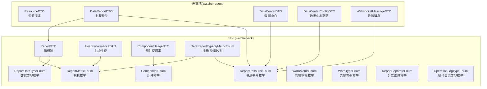
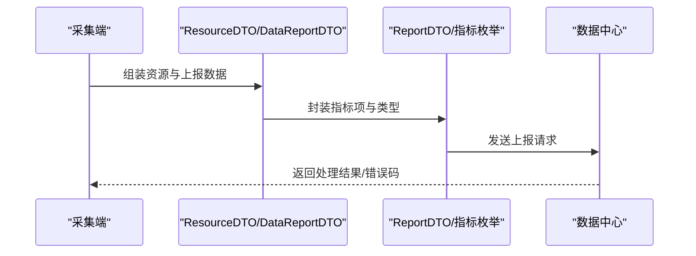
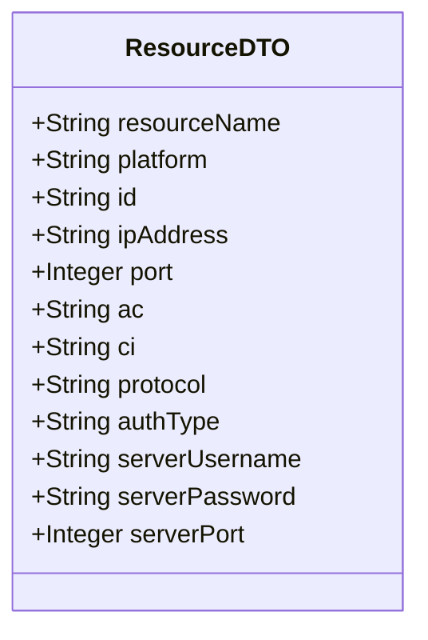
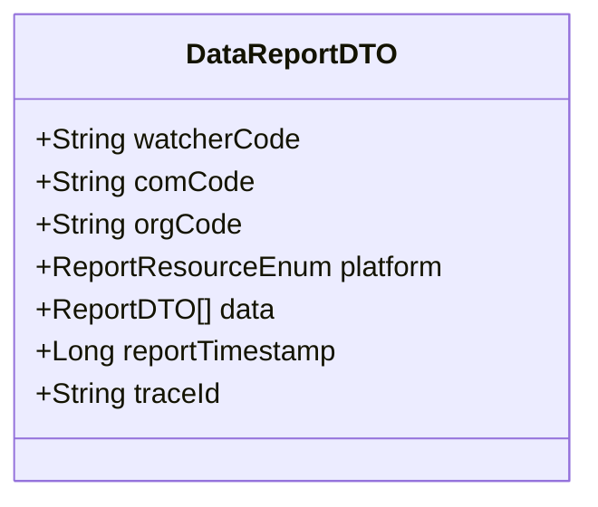
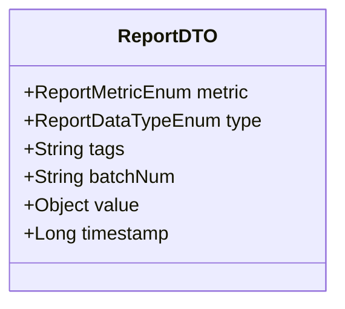
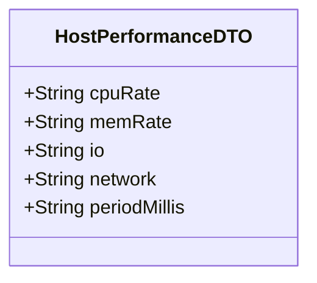
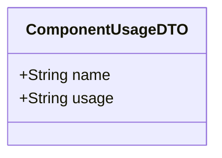
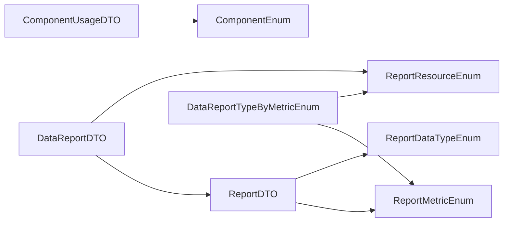

# 数据字典

<cite>
**本文引用的文件**
- [ResourceDTO.java](file://watcher-agent/src/main/java/com/virtual/cloud/om/agent/dto/ResourceDTO.java)
- [DataReportDTO.java](file://watcher-agent/src/main/java/com/virtual/cloud/om/agent/dto/DataReportDTO.java)
- [ReportDTO.java](file://watcher-sdk/src/main/java/com/virtual/cloud/om/sdk/dto/dataReport/workspace/ReportDTO.java)
- [HostPerformanceDTO.java](file://watcher-sdk/src/main/java/com/virtual/cloud/om/sdk/dto/dataReport/cas/HostPerformanceDTO.java)
- [ComponentUsageDTO.java](file://watcher-sdk/src/main/java/com/virtual/cloud/om/sdk/dto/dataReport/watcher/ComponentUsageDTO.java)
- [ReportMetricEnum.java](file://watcher-sdk/src/main/java/com/virtual/cloud/om/sdk/constant/report/ReportMetricEnum.java)
- [ReportDataTypeEnum.java](file://watcher-sdk/src/main/java/com/virtual/cloud/om/sdk/constant/report/ReportDataTypeEnum.java)
- [ReportResourceEnum.java](file://watcher-sdk/src/main/java/com/virtual/cloud/om/sdk/constant/ReportResourceEnum.java)
- [DataReportTypeByMetricEnum.java](file://watcher-sdk/src/main/java/com/virtual/cloud/om/sdk/constant/DataReportTypeByMetricEnum.java)
- [ComponentEnum.java](file://watcher-sdk/src/main/java/com/virtual/cloud/om/sdk/constant/ComponentEnum.java)
- [WarnMetricEnum.java](file://watcher-sdk/src/main/java/com/virtual/cloud/om/sdk/constant/WarnMetricEnum.java)
- [WarnTypeEnum.java](file://watcher-sdk/src/main/java/com/virtual/cloud/om/sdk/constant/WarnTypeEnum.java)
- [WebsocketMessageDTO.java](file://watcher-agent/src/main/java/com/virtual/cloud/om/agent/dto/WebsocketMessageDTO.java)
- [DataCenterDTO.java](file://watcher-agent/src/main/java/com/virtual/cloud/om/agent/dto/DataCenterDTO.java)
- [DataCenterConfigDTO.java](file://watcher-agent/src/main/java/com/virtual/cloud/om/agent/dto/DataCenterConfigDTO.java)
- [ReportSeparateEnum.java](file://watcher-sdk/src/main/java/com/virtual/cloud/om/sdk/constant/ReportSeparateEnum.java)
- [OperationLogTypeEnum.java](file://watcher-sdk/src/main/java/com/virtual/cloud/om/sdk/constant/OperationLogTypeEnum.java)
</cite>

## 目录
1. 引言
2. 项目结构
3. 核心组件
4. 架构总览
5. 详细组件分析
6. 依赖分析
7. 性能考量
8. 故障排查指南
9. 结论
10. 附录

## 引言
本数据字典面向ShowTime监控系统，聚焦数据传输对象（DTO）与业务枚举的设计与用途，覆盖资源上报、指标采集、告警与组件状态等关键数据结构。文档从字段命名规范、数据类型选择、取值范围与约束、数据验证规则、版本管理与向后兼容等方面进行系统化梳理，帮助开发者与运维人员准确理解并正确使用数据模型，支撑系统的持续演进。

## 项目结构
围绕数据字典的核心文件主要分布在以下模块：
- watcher-agent：采集端对外暴露的DTO，如资源、上报、DC配置、WebSocket消息等
- watcher-sdk：跨平台通用的数据模型与业务枚举，如指标、数据类型、资源平台、策略映射等

图表来源
- [ResourceDTO.java:1-35](file://watcher-agent/src/main/java/com/virtual/cloud/om/agent/dto/ResourceDTO.java#L1-L35)
- [DataReportDTO.java:1-27](file://watcher-agent/src/main/java/com/virtual/cloud/om/agent/dto/DataReportDTO.java#L1-L27)
- [ReportDTO.java:1-25](file://watcher-sdk/src/main/java/com/virtual/cloud/om/sdk/dto/dataReport/workspace/ReportDTO.java#L1-L25)
- [HostPerformanceDTO.java:1-42](file://watcher-sdk/src/main/java/com/virtual/cloud/om/sdk/dto/dataReport/cas/HostPerformanceDTO.java#L1-L42)
- [ComponentUsageDTO.java:1-11](file://watcher-sdk/src/main/java/com/virtual/cloud/om/sdk/dto/dataReport/watcher/ComponentUsageDTO.java#L1-L11)
- [ReportMetricEnum.java:1-118](file://watcher-sdk/src/main/java/com/virtual/cloud/om/sdk/constant/report/ReportMetricEnum.java#L1-L118)
- [ReportDataTypeEnum.java:1-17](file://watcher-sdk/src/main/java/com/virtual/cloud/om/sdk/constant/report/ReportDataTypeEnum.java#L1-L17)
- [ReportResourceEnum.java:1-6](file://watcher-sdk/src/main/java/com/virtual/cloud/om/sdk/constant/ReportResourceEnum.java#L1-L6)
- [DataReportTypeByMetricEnum.java:1-23](file://watcher-sdk/src/main/java/com/virtual/cloud/om/sdk/constant/DataReportTypeByMetricEnum.java#L1-L23)
- [ComponentEnum.java:1-14](file://watcher-sdk/src/main/java/com/virtual/cloud/om/sdk/constant/ComponentEnum.java#L1-L14)
- [WarnMetricEnum.java:1-21](file://watcher-sdk/src/main/java/com/virtual/cloud/om/sdk/constant/WarnMetricEnum.java#L1-L21)
- [WarnTypeEnum.java:1-7](file://watcher-sdk/src/main/java/com/virtual/cloud/om/sdk/constant/WarnTypeEnum.java#L1-L7)
- [ReportSeparateEnum.java:1-10](file://watcher-sdk/src/main/java/com/virtual/cloud/om/sdk/constant/ReportSeparateEnum.java#L1-L10)
- [OperationLogTypeEnum.java:1-20](file://watcher-sdk/src/main/java/com/virtual/cloud/om/sdk/constant/OperationLogTypeEnum.java#L1-L20)

章节来源
- [ResourceDTO.java:1-35](file://watcher-agent/src/main/java/com/virtual/cloud/om/agent/dto/ResourceDTO.java#L1-L35)
- [DataReportDTO.java:1-27](file://watcher-agent/src/main/java/com/virtual/cloud/om/agent/dto/DataReportDTO.java#L1-L27)
- [ReportDTO.java:1-25](file://watcher-sdk/src/main/java/com/virtual/cloud/om/sdk/dto/dataReport/workspace/ReportDTO.java#L1-L25)

## 核心组件
本节对关键DTO与枚举进行逐项说明，包括字段语义、数据类型、取值范围与约束、典型用法与注意事项。

- 资源描述（ResourceDTO）
  - 用途：描述被监控资源的基本信息，用于采集端识别与认证
  - 关键字段与约束
    - resourceName：字符串，必填；资源名称
    - platform：字符串，必填；资源平台类型，常见取值见资源平台枚举
    - id：字符串，可选；资源唯一标识，要求全局唯一
    - ipAddress/port/protocol：必填；访问地址、端口与协议
    - ac/ci/authType：认证相关，ci建议加密存储；authType默认统一为Digest
    - serverUsername/serverPassword/serverPort：服务器后台访问凭据
  - 典型场景：注册/发现资源时携带该DTO发起认证与初始化

- 上报聚合（DataReportDTO）
  - 用途：封装一次上报的上下文与数据集合
  - 关键字段与约束
    - watcherCode：字符串，租户标识
    - platform：枚举，资源平台类型
    - data：列表，元素为ReportDTO；至少包含一个指标项
    - reportTimestamp：长整型，毫秒级时间戳，建议与采集时间一致
    - traceId：字符串，链路追踪标识，便于问题定位
  - 约束与校验
    - data不能为空或空列表
    - timestamp需为有效时间戳
    - platform与data中指标类型应匹配

- 指标项（ReportDTO）
  - 用途：单个指标的采集结果载体
  - 关键字段与约束
    - metric：指标枚举，必须在ReportMetricEnum中定义
    - type：数据类型枚举，决定value的序列化方式
    - tags：字符串，用于资源打标与过滤
    - batchNum：字符串，批次号，便于分片与幂等
    - value：对象，具体值由type决定（如JSON字符串、数值、直方图等）
    - timestamp：长整型，毫秒级时间戳
  - 约束与校验
    - metric/type/tags/batchNum/timestamp均应存在
    - value需与type一致（例如type为gauge时value应为数值）

- 主机性能（HostPerformanceDTO）
  - 用途：CAS平台主机实时性能信息
  - 关键字段与约束
    - cpuRate/memRate/io/network：字符串，建议为百分比或速率形式
    - periodMillis：字符串，采样周期（毫秒），用于计算瞬时/平均指标
  - 约束与校验
    - 各字段建议为非负数字符串，periodMillis需为正整数

- 组件使用率（ComponentUsageDTO）
  - 用途：采集端内部组件的CPU/内存使用率
  - 关键字段与约束
    - name：字符串，组件名称，取值来自ComponentEnum
    - usage：字符串，使用率，建议为百分比
  - 约束与校验
    - name需在ComponentEnum中定义

- WebSocket消息（WebsocketMessageDTO）
  - 用途：服务端向客户端推送的消息载体
  - 关键字段与约束
    - type：字符串，消息类型
    - data：字符串，消息体（可为JSON或其他格式）
  - 约束与校验
    - type与data需同时存在

- 数据中心（DataCenterDTO）
  - 用途：数据中心接入凭证与标识
  - 关键字段与约束
    - username/ci/publicKey/ip/master/watcherCode：按需填写，ci建议加密
  - 约束与校验
    - watcherCode需唯一且与平台侧一致

- 数据中心配置（DataCenterConfigDTO）
  - 用途：数据中心基础配置信息
  - 关键字段与约束
    - username/password/comName/orgName：按需填写，password建议加密
  - 约束与校验
    - 所有字段均为字符串，注意敏感信息保护

章节来源
- [ResourceDTO.java:1-35](file://watcher-agent/src/main/java/com/virtual/cloud/om/agent/dto/ResourceDTO.java#L1-L35)
- [DataReportDTO.java:1-27](file://watcher-agent/src/main/java/com/virtual/cloud/om/agent/dto/DataReportDTO.java#L1-L27)
- [ReportDTO.java:1-25](file://watcher-sdk/src/main/java/com/virtual/cloud/om/sdk/dto/dataReport/workspace/ReportDTO.java#L1-L25)
- [HostPerformanceDTO.java:1-42](file://watcher-sdk/src/main/java/com/virtual/cloud/om/sdk/dto/dataReport/cas/HostPerformanceDTO.java#L1-L42)
- [ComponentUsageDTO.java:1-11](file://watcher-sdk/src/main/java/com/virtual/cloud/om/sdk/dto/dataReport/watcher/ComponentUsageDTO.java#L1-L11)
- [WebsocketMessageDTO.java:1-23](file://watcher-agent/src/main/java/com/virtual/cloud/om/agent/dto/WebsocketMessageDTO.java#L1-L23)
- [DataCenterDTO.java:1-32](file://watcher-agent/src/main/java/com/virtual/cloud/om/agent/dto/DataCenterDTO.java#L1-L32)
- [DataCenterConfigDTO.java:1-27](file://watcher-agent/src/main/java/com/virtual/cloud/om/agent/dto/DataCenterConfigDTO.java#L1-L27)

## 架构总览
下图展示数据从采集端到上报层的关键流转与数据结构关系：

图表来源
- [DataReportDTO.java:1-27](file://watcher-agent/src/main/java/com/virtual/cloud/om/agent/dto/DataReportDTO.java#L1-L27)
- [ReportDTO.java:1-25](file://watcher-sdk/src/main/java/com/virtual/cloud/om/sdk/dto/dataReport/workspace/ReportDTO.java#L1-L25)
- [ReportMetricEnum.java:1-118](file://watcher-sdk/src/main/java/com/virtual/cloud/om/sdk/constant/report/ReportMetricEnum.java#L1-L118)
- [ReportDataTypeEnum.java:1-17](file://watcher-sdk/src/main/java/com/virtual/cloud/om/sdk/constant/report/ReportDataTypeEnum.java#L1-L17)

## 详细组件分析

### ResourceDTO 分析
- 设计要点
  - 使用Swagger注解标注字段含义，便于前端与文档生成
  - 平台字段与认证字段分离，便于扩展不同平台与认证方式
- 复杂度与性能
  - 对象简单，序列化开销低
- 错误处理与边界
  - 缺失必要字段会导致认证失败或无法识别资源
  - 建议在入站校验阶段强制校验必填字段

图表来源
- [ResourceDTO.java:1-35](file://watcher-agent/src/main/java/com/virtual/cloud/om/agent/dto/ResourceDTO.java#L1-L35)

章节来源
- [ResourceDTO.java:1-35](file://watcher-agent/src/main/java/com/virtual/cloud/om/agent/dto/ResourceDTO.java#L1-L35)

### DataReportDTO 分析
- 设计要点
  - 聚合一次上报的所有指标项，统一上下文（租户、平台、时间戳、追踪ID）
  - data字段采用泛型对象，便于承载多种指标类型
- 复杂度与性能
  - 列表长度影响序列化与网络传输成本
- 错误处理与边界
  - 必须保证data非空；timestamp需合理；traceId用于问题回溯

图表来源
- [DataReportDTO.java:1-27](file://watcher-agent/src/main/java/com/virtual/cloud/om/agent/dto/DataReportDTO.java#L1-L27)
- [ReportDTO.java:1-25](file://watcher-sdk/src/main/java/com/virtual/cloud/om/sdk/dto/dataReport/workspace/ReportDTO.java#L1-L25)

章节来源
- [DataReportDTO.java:1-27](file://watcher-agent/src/main/java/com/virtual/cloud/om/agent/dto/DataReportDTO.java#L1-L27)
- [ReportDTO.java:1-25](file://watcher-sdk/src/main/java/com/virtual/cloud/om/sdk/dto/dataReport/workspace/ReportDTO.java#L1-L25)

### ReportDTO 分析
- 设计要点
  - 通过metric/type明确指标语义与序列化方式
  - tags与batchNum用于分组与幂等控制
- 复杂度与性能
  - value为对象，可能带来较大的序列化开销
- 错误处理与边界
  - metric/type必须匹配；value需与type一致

图表来源
- [ReportDTO.java:1-25](file://watcher-sdk/src/main/java/com/virtual/cloud/om/sdk/dto/dataReport/workspace/ReportDTO.java#L1-L25)
- [ReportMetricEnum.java:1-118](file://watcher-sdk/src/main/java/com/virtual/cloud/om/sdk/constant/report/ReportMetricEnum.java#L1-L118)
- [ReportDataTypeEnum.java:1-17](file://watcher-sdk/src/main/java/com/virtual/cloud/om/sdk/constant/report/ReportDataTypeEnum.java#L1-L17)

章节来源
- [ReportDTO.java:1-25](file://watcher-sdk/src/main/java/com/virtual/cloud/om/sdk/dto/dataReport/workspace/ReportDTO.java#L1-L25)
- [ReportMetricEnum.java:1-118](file://watcher-sdk/src/main/java/com/virtual/cloud/om/sdk/constant/report/ReportMetricEnum.java#L1-L118)
- [ReportDataTypeEnum.java:1-17](file://watcher-sdk/src/main/java/com/virtual/cloud/om/sdk/constant/report/ReportDataTypeEnum.java#L1-L17)

### HostPerformanceDTO 分析
- 设计要点
  - 字段命名直观，适合快速解析与展示
- 复杂度与性能
  - 字符串字段便于序列化，但需要上层做数值转换
- 错误处理与边界
  - 建议对periodMillis进行正数校验

图表来源
- [HostPerformanceDTO.java:1-42](file://watcher-sdk/src/main/java/com/virtual/cloud/om/sdk/dto/dataReport/cas/HostPerformanceDTO.java#L1-L42)

章节来源
- [HostPerformanceDTO.java:1-42](file://watcher-sdk/src/main/java/com/virtual/cloud/om/sdk/dto/dataReport/cas/HostPerformanceDTO.java#L1-L42)

### ComponentUsageDTO 分析
- 设计要点
  - 链式赋值风格，便于构建
- 复杂度与性能
  - 对象极小，序列化成本低
- 错误处理与边界
  - name需来自ComponentEnum，避免非法值

图表来源
- [ComponentUsageDTO.java:1-11](file://watcher-sdk/src/main/java/com/virtual/cloud/om/sdk/dto/dataReport/watcher/ComponentUsageDTO.java#L1-L11)
- [ComponentEnum.java:1-14](file://watcher-sdk/src/main/java/com/virtual/cloud/om/sdk/constant/ComponentEnum.java#L1-L14)

章节来源
- [ComponentUsageDTO.java:1-11](file://watcher-sdk/src/main/java/com/virtual/cloud/om/sdk/dto/dataReport/watcher/ComponentUsageDTO.java#L1-L11)
- [ComponentEnum.java:1-14](file://watcher-sdk/src/main/java/com/virtual/cloud/om/sdk/constant/ComponentEnum.java#L1-L14)

### 枚举类型详解

#### 指标枚举（ReportMetricEnum）
- 定义与取值
  - 覆盖桌面池、主机、集群、存储池、虚拟机、健康度、采集端组件等多个维度
  - 部分指标标记为静态指标（如基本信息类），部分为动态指标（如利用率、吞吐量）
- 使用建议
  - 上报前校验metric是否在枚举范围内
  - 静态指标与动态指标的采集频率与存储策略应区分

章节来源
- [ReportMetricEnum.java:1-118](file://watcher-sdk/src/main/java/com/virtual/cloud/om/sdk/constant/report/ReportMetricEnum.java#L1-L118)

#### 数据类型枚举（ReportDataTypeEnum）
- 定义与取值
  - json、text、gauge、counter、histogra、summary等
- 使用建议
  - gauge/counter用于数值型指标；json用于复杂结构；text用于纯文本

章节来源
- [ReportDataTypeEnum.java:1-17](file://watcher-sdk/src/main/java/com/virtual/cloud/om/sdk/constant/report/ReportDataTypeEnum.java#L1-L17)

#### 资源平台枚举（ReportResourceEnum）
- 定义与取值
  - cas、uis、workspace、onestor、hccAgent、normal_host、redis、kafka、mysql、nginx、opengauss、rabbitmq
- 使用建议
  - DataReportDTO.platform与各采集器实现需保持一致

章节来源
- [ReportResourceEnum.java:1-6](file://watcher-sdk/src/main/java/com/virtual/cloud/om/sdk/constant/ReportResourceEnum.java#L1-L6)

#### 指标-类型映射（DataReportTypeByMetricEnum）
- 定义与取值
  - 将数据中心下发的metric与具体实现类绑定，支持同一指标在多平台的差异化实现
- 使用建议
  - 若metric不唯一，需指定platform以避免歧义

章节来源
- [DataReportTypeByMetricEnum.java:1-23](file://watcher-sdk/src/main/java/com/virtual/cloud/om/sdk/constant/DataReportTypeByMetricEnum.java#L1-L23)

#### 组件枚举（ComponentEnum）
- 定义与取值
  - kafka、zookeeper、nginx、mongodb、agent、keepalived
- 使用建议
  - ComponentUsageDTO.name必须来自此枚举

章节来源
- [ComponentEnum.java:1-14](file://watcher-sdk/src/main/java/com/virtual/cloud/om/sdk/constant/ComponentEnum.java#L1-L14)

#### 告警指标枚举（WarnMetricEnum）
- 定义与取值
  - ws实时告警、cas实时告警、uis实时告警、终端告警、VIP桌面告警、onestor实时告警、采集端CPU/内存/磁盘利用率告警
- 使用建议
  - 告警规则与指标需一一对应

章节来源
- [WarnMetricEnum.java:1-21](file://watcher-sdk/src/main/java/com/virtual/cloud/om/sdk/constant/WarnMetricEnum.java#L1-L21)

#### 告警类型枚举（WarnTypeEnum）
- 定义与取值
  - realTime、vipDesk、terminal
- 使用建议
  - 用于区分告警来源与级别

章节来源
- [WarnTypeEnum.java:1-7](file://watcher-sdk/src/main/java/com/virtual/cloud/om/sdk/constant/WarnTypeEnum.java#L1-L7)

#### 分离维度枚举（ReportSeparateEnum）
- 定义与取值
  - cluster、host、domain
- 使用建议
  - 用于指标聚合与展示的维度划分

章节来源
- [ReportSeparateEnum.java:1-10](file://watcher-sdk/src/main/java/com/virtual/cloud/om/sdk/constant/ReportSeparateEnum.java#L1-L10)

#### 操作日志类型枚举（OperationLogTypeEnum）
- 定义与取值
  - vm（虚拟机动作）
- 使用建议
  - 日志采集与分类需与枚举保持一致

章节来源
- [OperationLogTypeEnum.java:1-20](file://watcher-sdk/src/main/java/com/virtual/cloud/om/sdk/constant/OperationLogTypeEnum.java#L1-L20)

## 依赖分析
- 组件耦合
  - DataReportDTO依赖ReportDTO与ReportResourceEnum
  - ReportDTO依赖ReportMetricEnum与ReportDataTypeEnum
  - ComponentUsageDTO依赖ComponentEnum
  - DataReportTypeByMetricEnum依赖ReportMetricEnum与ReportResourceEnum
- 外部依赖
  - 枚举间通过名称/取值建立逻辑关联，需在版本升级时保持兼容

图表来源
- [DataReportDTO.java:1-27](file://watcher-agent/src/main/java/com/virtual/cloud/om/agent/dto/DataReportDTO.java#L1-L27)
- [ReportDTO.java:1-25](file://watcher-sdk/src/main/java/com/virtual/cloud/om/sdk/dto/dataReport/workspace/ReportDTO.java#L1-L25)
- [ReportMetricEnum.java:1-118](file://watcher-sdk/src/main/java/com/virtual/cloud/om/sdk/constant/report/ReportMetricEnum.java#L1-L118)
- [ReportDataTypeEnum.java:1-17](file://watcher-sdk/src/main/java/com/virtual/cloud/om/sdk/constant/report/ReportDataTypeEnum.java#L1-L17)
- [ReportResourceEnum.java:1-6](file://watcher-sdk/src/main/java/com/virtual/cloud/om/sdk/constant/ReportResourceEnum.java#L1-L6)
- [ComponentUsageDTO.java:1-11](file://watcher-sdk/src/main/java/com/virtual/cloud/om/sdk/dto/dataReport/watcher/ComponentUsageDTO.java#L1-L11)
- [ComponentEnum.java:1-14](file://watcher-sdk/src/main/java/com/virtual/cloud/om/sdk/constant/ComponentEnum.java#L1-L14)
- [DataReportTypeByMetricEnum.java:1-23](file://watcher-sdk/src/main/java/com/virtual/cloud/om/sdk/constant/DataReportTypeByMetricEnum.java#L1-L23)

章节来源
- [DataReportDTO.java:1-27](file://watcher-agent/src/main/java/com/virtual/cloud/om/agent/dto/DataReportDTO.java#L1-L27)
- [ReportDTO.java:1-25](file://watcher-sdk/src/main/java/com/virtual/cloud/om/sdk/dto/dataReport/workspace/ReportDTO.java#L1-L25)
- [ReportMetricEnum.java:1-118](file://watcher-sdk/src/main/java/com/virtual/cloud/om/sdk/constant/report/ReportMetricEnum.java#L1-L118)
- [ReportDataTypeEnum.java:1-17](file://watcher-sdk/src/main/java/com/virtual/cloud/om/sdk/constant/report/ReportDataTypeEnum.java#L1-L17)
- [ReportResourceEnum.java:1-6](file://watcher-sdk/src/main/java/com/virtual/cloud/om/sdk/constant/ReportResourceEnum.java#L1-L6)
- [ComponentUsageDTO.java:1-11](file://watcher-sdk/src/main/java/com/virtual/cloud/om/sdk/dto/dataReport/watcher/ComponentUsageDTO.java#L1-L11)
- [ComponentEnum.java:1-14](file://watcher-sdk/src/main/java/com/virtual/cloud/om/sdk/constant/ComponentEnum.java#L1-L14)
- [DataReportTypeByMetricEnum.java:1-23](file://watcher-sdk/src/main/java/com/virtual/cloud/om/sdk/constant/DataReportTypeByMetricEnum.java#L1-L23)

## 性能考量
- 序列化成本
  - ReportDTO的value为对象，建议在采集端尽量压缩或简化结构
  - HostPerformanceDTO与ComponentUsageDTO字段为字符串，序列化开销较低
- 网络与存储
  - DataReportDTO中data列表长度直接影响上报体积，建议按批处理与去重
  - timestamp与traceId为高频字段，建议保持紧凑表示
- 计算与转换
  - periodMillis用于性能指标换算，建议在采集端完成单位换算，减少下游计算压力

## 故障排查指南
- 常见问题与定位
  - 缺失必填字段：检查ResourceDTO/DataReportDTO/ReportDTO的必填项是否完整
  - 类型不匹配：确认ReportDTO的value与type一致
  - 平台不一致：核对DataReportDTO.platform与ReportResourceEnum取值
  - 指标未定义：确认ReportDTO.metric在ReportMetricEnum范围内
  - 组件名非法：确认ComponentUsageDTO.name在ComponentEnum内
- 排查步骤
  - 校验timestamp与reportTimestamp是否合理
  - 检查traceId是否贯穿上报链路
  - 对异常指标进行隔离与降级处理，避免影响整体上报

章节来源
- [ReportDTO.java:1-25](file://watcher-sdk/src/main/java/com/virtual/cloud/om/sdk/dto/dataReport/workspace/ReportDTO.java#L1-L25)
- [ReportMetricEnum.java:1-118](file://watcher-sdk/src/main/java/com/virtual/cloud/om/sdk/constant/report/ReportMetricEnum.java#L1-L118)
- [ReportResourceEnum.java:1-6](file://watcher-sdk/src/main/java/com/virtual/cloud/om/sdk/constant/ReportResourceEnum.java#L1-L6)
- [ComponentEnum.java:1-14](file://watcher-sdk/src/main/java/com/virtual/cloud/om/sdk/constant/ComponentEnum.java#L1-L14)

## 结论
本数据字典系统性梳理了ShowTime监控系统中的核心DTO与业务枚举，明确了字段语义、数据类型、取值范围与约束，并提供了架构视图与故障排查建议。通过严格的字段命名规范、类型选择与版本管理策略，可显著提升系统的可维护性与稳定性。

## 附录

### 字段命名规范与数据类型选择
- 命名规范
  - 使用驼峰命名，语义清晰；必要时添加注释说明
  - 平台/组件/指标等关键字段使用枚举限定取值
- 数据类型选择
  - 数值型指标优先使用数值类型；复杂结构使用JSON字符串
  - 时间戳统一使用毫秒级Long类型
  - 字符串字段用于标签、描述与追踪ID

### 数据验证规则与业务约束
- 必填字段
  - ResourceDTO：resourceName、platform、ipAddress、port、protocol
  - DataReportDTO：watcherCode、platform、data、reportTimestamp
  - ReportDTO：metric、type、tags、batchNum、value、timestamp
- 取值范围
  - port：1-65535
  - periodMillis：正整数
  - usage：建议0-100的百分比字符串
- 一致性约束
  - DataReportDTO.platform需与各采集器实现一致
  - ReportDTO.metric与type需匹配
  - ComponentUsageDTO.name需来自ComponentEnum

### 版本管理与向后兼容
- 版本策略
  - 枚举新增采用“保留旧值+新增值”的方式，避免破坏既有规则
  - DTO字段新增遵循“可选+默认值”原则，确保老版本解析不失败
- 升级流程
  - 新增指标：先在ReportMetricEnum中添加，再在DataReportTypeByMetricEnum中绑定
  - 新增平台：在ReportResourceEnum中添加，同步更新采集端实现
  - 新增组件：在ComponentEnum中添加，同步更新ComponentUsageDTO使用处
- 回滚策略
  - 通过版本号与traceId快速定位问题批次，必要时进行数据回放与补偿