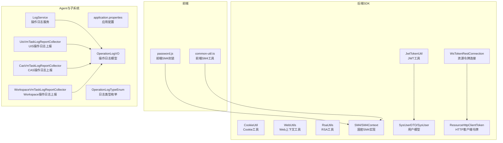
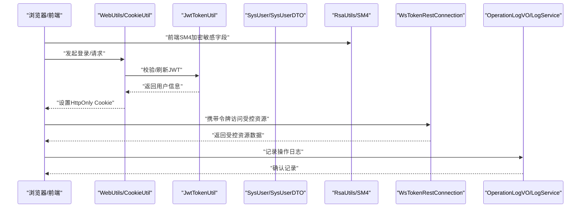
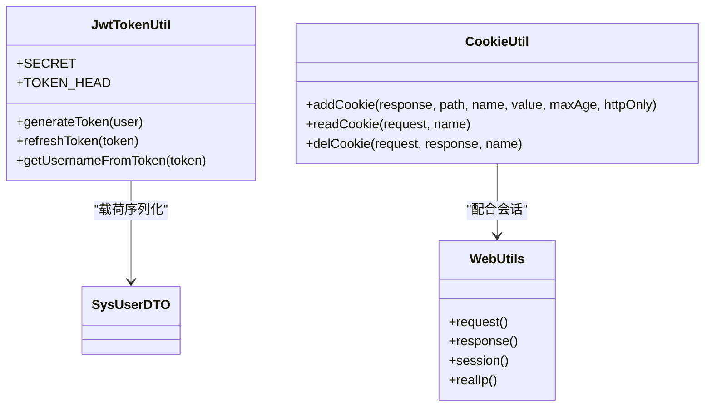
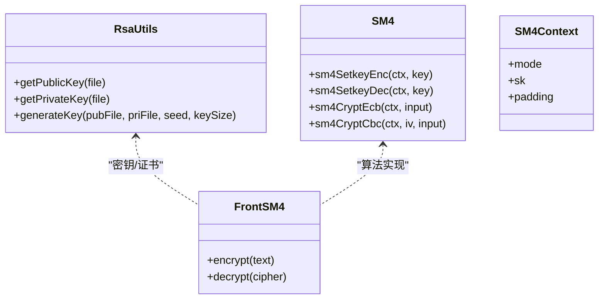
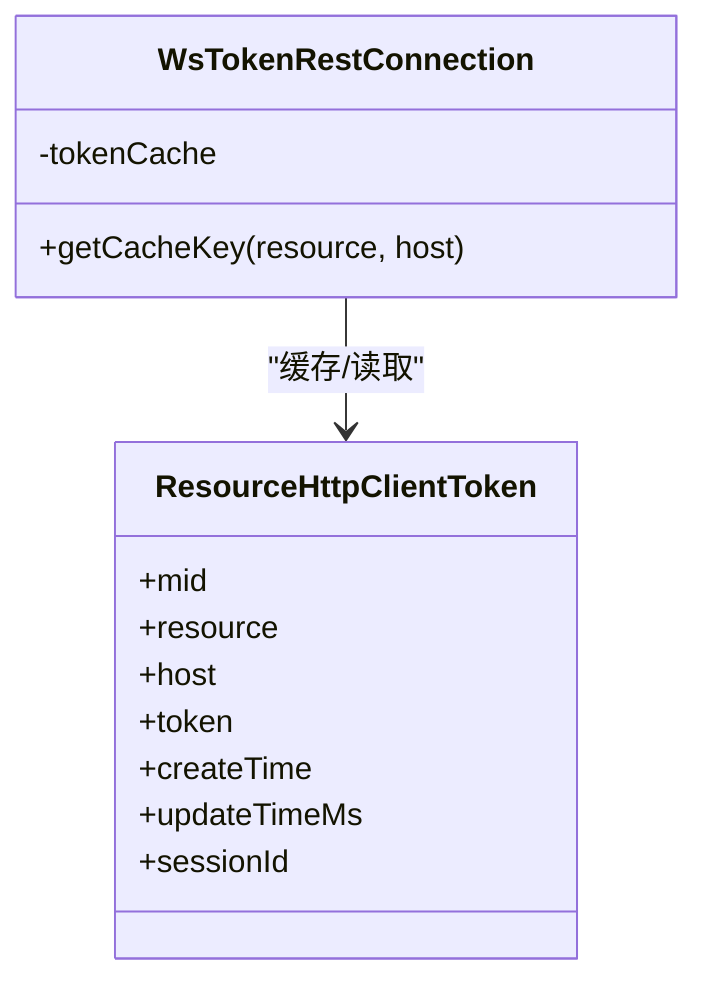
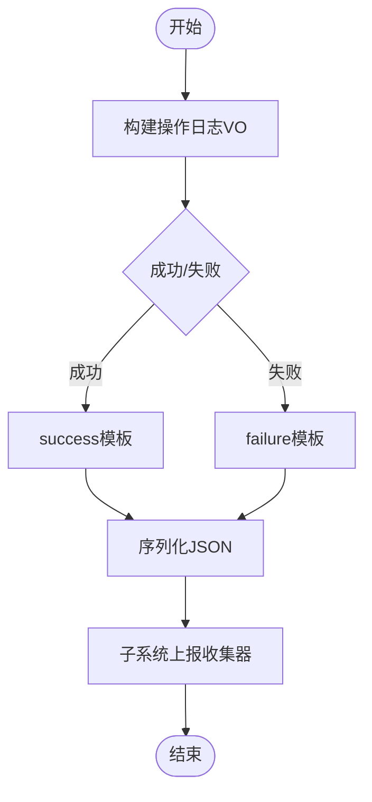
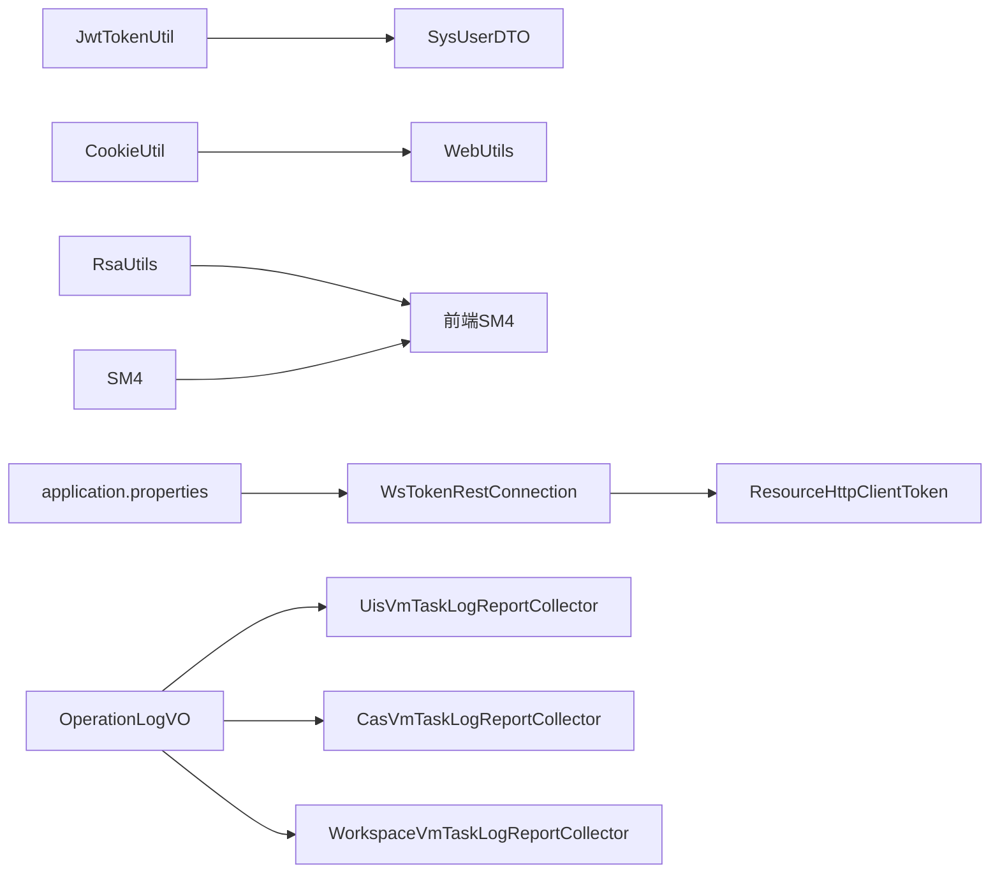

# 数据安全与隐私

<cite>
**本文引用的文件**
- [JwtTokenUtil.java](file://watcher-sdk/src/main/java/com/virtual/cloud/om/sdk/utils/JwtTokenUtil.java)
- [CookieUtil.java](file://watcher-sdk/src/main/java/com/virtual/cloud/om/sdk/utils/CookieUtil.java)
- [WebUtils.java](file://watcher-sdk/src/main/java/com/virtual/cloud/om/sdk/utils/WebUtils.java)
- [SysUser.java](file://watcher-sdk/src/main/java/com/virtual/cloud/om/sdk/entity/mysql/SysUser.java)
- [SysUserDTO.java](file://watcher-sdk/src/main/java/com/virtual/cloud/om/sdk/dto/SysUserDTO.java)
- [RsaUtils.java](file://watcher-sdk/src/main/java/com/virtual/cloud/om/sdk/utils/RsaUtils.java)
- [SM4.java](file://watcher-sdk/src/main/java/com/virtual/cloud/om/sdk/utils/sm4/SM4.java)
- [SM4Context.java](file://watcher-sdk/src/main/java/com/virtual/cloud/om/sdk/utils/sm4/SM4Context.java)
- [password.js](file://watcher-web/src/utils/system/password.js)
- [common-util.ts](file://watcher-web/src/utils/system/common-util.ts)
- [WsTokenRestConnection.java](file://watcher-sdk/src/main/java/com/virtual/cloud/om/sdk/config/token/workspace/WsTokenRestConnection.java)
- [ResourceHttpClientToken.java](file://watcher-sdk/src/main/java/com/virtual/cloud/om/sdk/dto/token/ResourceHttpClientToken.java)
- [application.properties](file://watcher-agent/src/main/resources/application.properties)
- [LogService.java](file://watcher-agent/src/main/java/com/virtual/cloud/om/agent/service/logs/LogService.java)
- [OperationLogVO.java](file://watcher-sdk/src/main/java/com/virtual/cloud/om/sdk/dto/OperationLogVO.java)
- [OperationLogTypeEnum.java](file://watcher-sdk/src/main/java/com/virtual/cloud/om/sdk/constant/OperationLogTypeEnum.java)
- [UisVmTaskLogReportCollector.java](file://watcher-uis/src/main/java/com/virtual/cloud/om/uis/service/report/UisVmTaskLogReportCollector.java)
- [CasVmTaskLogReportCollector.java](file://watcher-cas/src/main/java/com/virtual/cloud/om/cas/service/report/CasVmTaskLogReportCollector.java)
- [WorkspaceVmTaskLogReportCollector.java](file://watcher-workspace/src/main/java/com/virtual/cloud/om/workspace/service/report/WorkspaceVmTaskLogReportCollector.java)
</cite>

## 目录
1. 引言
2. 项目结构
3. 核心组件
4. 架构总览
5. 详细组件分析
6. 依赖分析
7. 性能考虑
8. 故障排查指南
9. 结论
10. 附录

## 引言
本文件面向ShowTime监控系统的数据安全与隐私保护，围绕以下目标展开：传输加密、存储加密与密钥管理；身份认证与授权（含JWT、会话与权限控制）；数据脱敏与隐私保护；审计日志与监控；数据访问控制（最小权限、角色与动态授权）；合规性与最佳实践。文档基于仓库中实际实现进行分析，并在必要处给出改进建议。

## 项目结构
- 后端SDK与工具：提供JWT、Cookie、Web上下文、加解密工具等通用能力。
- 前端工具：提供SM4加密封装与前端密码处理逻辑。
- Agent与各子系统：提供日志采集、报告上报、资源令牌缓存等能力。
- 配置文件：定义运行参数、中间件开关、服务地址等。

**图示来源**
- [JwtTokenUtil.java:1-88](file://watcher-sdk/src/main/java/com/virtual/cloud/om/sdk/utils/JwtTokenUtil.java#L1-L88)
- [CookieUtil.java:1-95](file://watcher-sdk/src/main/java/com/virtual/cloud/om/sdk/utils/CookieUtil.java#L1-L95)
- [WebUtils.java:1-82](file://watcher-sdk/src/main/java/com/virtual/cloud/om/sdk/utils/WebUtils.java#L1-L82)
- [RsaUtils.java:1-102](file://watcher-sdk/src/main/java/com/virtual/cloud/om/sdk/utils/RsaUtils.java#L1-L102)
- [SM4.java:1-310](file://watcher-sdk/src/main/java/com/virtual/cloud/om/sdk/utils/sm4/SM4.java#L1-L310)
- [SM4Context.java:1-39](file://watcher-sdk/src/main/java/com/virtual/cloud/om/sdk/utils/sm4/SM4Context.java#L1-L39)
- [SysUser.java:1-56](file://watcher-sdk/src/main/java/com/virtual/cloud/om/sdk/entity/mysql/SysUser.java#L1-L56)
- [SysUserDTO.java:1-27](file://watcher-sdk/src/main/java/com/virtual/cloud/om/sdk/dto/SysUserDTO.java#L1-L27)
- [WsTokenRestConnection.java:36-52](file://watcher-sdk/src/main/java/com/virtual/cloud/om/sdk/config/token/workspace/WsTokenRestConnection.java#L36-L52)
- [ResourceHttpClientToken.java:1-29](file://watcher-sdk/src/main/java/com/virtual/cloud/om/sdk/dto/token/ResourceHttpClientToken.java#L1-L29)
- [password.js:331-387](file://watcher-web/src/utils/system/password.js#L331-L387)
- [common-util.ts:1-30](file://watcher-web/src/utils/system/common-util.ts#L1-L30)
- [application.properties:1-80](file://watcher-agent/src/main/resources/application.properties#L1-L80)
- [LogService.java:1-50](file://watcher-agent/src/main/java/com/virtual/cloud/om/agent/service/logs/LogService.java#L1-L50)
- [OperationLogVO.java:1-58](file://watcher-sdk/src/main/java/com/virtual/cloud/om/sdk/dto/OperationLogVO.java#L1-L58)
- [OperationLogTypeEnum.java:1-19](file://watcher-sdk/src/main/java/com/virtual/cloud/om/sdk/constant/OperationLogTypeEnum.java#L1-L19)
- [UisVmTaskLogReportCollector.java:54-76](file://watcher-uis/src/main/java/com/virtual/cloud/om/uis/service/report/UisVmTaskLogReportCollector.java#L54-L76)
- [CasVmTaskLogReportCollector.java:65-89](file://watcher-cas/src/main/java/com/virtual/cloud/om/cas/service/report/CasVmTaskLogReportCollector.java#L65-L89)
- [WorkspaceVmTaskLogReportCollector.java:54-76](file://watcher-workspace/src/main/java/com/virtual/cloud/om/workspace/service/report/WorkspaceVmTaskLogReportCollector.java#L54-L76)

**章节来源**
- [application.properties:1-80](file://watcher-agent/src/main/resources/application.properties#L1-L80)

## 核心组件
- 身份认证与令牌
  - JWT工具：生成、刷新、解析与提取用户信息。
  - Cookie工具：设置与读取Cookie，支持HttpOnly。
  - Web上下文工具：获取请求、响应、Session与真实IP。
  - 用户模型：数据库实体与DTO，承载用户名与密码字段。
- 加密与密钥管理
  - RSA工具：加载公私钥、生成密钥对。
  - 国密SM4：ECB/CBC模式加解密、填充与轮密钥。
  - 前端SM4：统一密钥与模式配置，用于密码等敏感字段传输。
- 令牌与会话
  - 资源HTTP客户端令牌：跨系统调用时携带的令牌信息。
  - 资源令牌REST连接：内存缓存替代MongoDB，避免持久化风险。
- 审计与日志
  - 操作日志模型与类型枚举。
  - 各子系统日志上报收集器，输出到指标或报告通道。

**章节来源**
- [JwtTokenUtil.java:1-88](file://watcher-sdk/src/main/java/com/virtual/cloud/om/sdk/utils/JwtTokenUtil.java#L1-L88)
- [CookieUtil.java:1-95](file://watcher-sdk/src/main/java/com/virtual/cloud/om/sdk/utils/CookieUtil.java#L1-L95)
- [WebUtils.java:1-82](file://watcher-sdk/src/main/java/com/virtual/cloud/om/sdk/utils/WebUtils.java#L1-L82)
- [SysUser.java:1-56](file://watcher-sdk/src/main/java/com/virtual/cloud/om/sdk/entity/mysql/SysUser.java#L1-L56)
- [SysUserDTO.java:1-27](file://watcher-sdk/src/main/java/com/virtual/cloud/om/sdk/dto/SysUserDTO.java#L1-L27)
- [RsaUtils.java:1-102](file://watcher-sdk/src/main/java/com/virtual/cloud/om/sdk/utils/RsaUtils.java#L1-L102)
- [SM4.java:1-310](file://watcher-sdk/src/main/java/com/virtual/cloud/om/sdk/utils/sm4/SM4.java#L1-L310)
- [SM4Context.java:1-39](file://watcher-sdk/src/main/java/com/virtual/cloud/om/sdk/utils/sm4/SM4Context.java#L1-L39)
- [password.js:331-387](file://watcher-web/src/utils/system/password.js#L331-L387)
- [common-util.ts:1-30](file://watcher-web/src/utils/system/common-util.ts#L1-L30)
- [ResourceHttpClientToken.java:1-29](file://watcher-sdk/src/main/java/com/virtual/cloud/om/sdk/dto/token/ResourceHttpClientToken.java#L1-L29)
- [WsTokenRestConnection.java:36-52](file://watcher-sdk/src/main/java/com/virtual/cloud/om/sdk/config/token/workspace/WsTokenRestConnection.java#L36-L52)
- [OperationLogVO.java:1-58](file://watcher-sdk/src/main/java/com/virtual/cloud/om/sdk/dto/OperationLogVO.java#L1-L58)
- [OperationLogTypeEnum.java:1-19](file://watcher-sdk/src/main/java/com/virtual/cloud/om/sdk/constant/OperationLogTypeEnum.java#L1-L19)
- [UisVmTaskLogReportCollector.java:54-76](file://watcher-uis/src/main/java/com/virtual/cloud/om/uis/service/report/UisVmTaskLogReportCollector.java#L54-L76)
- [CasVmTaskLogReportCollector.java:65-89](file://watcher-cas/src/main/java/com/virtual/cloud/om/cas/service/report/CasVmTaskLogReportCollector.java#L65-L89)
- [WorkspaceVmTaskLogReportCollector.java:54-76](file://watcher-workspace/src/main/java/com/virtual/cloud/om/workspace/service/report/WorkspaceVmTaskLogReportCollector.java#L54-L76)

## 架构总览
下图展示ShowTime在“认证—授权—加密—审计”方面的整体流程与关键组件交互。

**图示来源**
- [WebUtils.java:1-82](file://watcher-sdk/src/main/java/com/virtual/cloud/om/sdk/utils/WebUtils.java#L1-L82)
- [CookieUtil.java:1-95](file://watcher-sdk/src/main/java/com/virtual/cloud/om/sdk/utils/CookieUtil.java#L1-L95)
- [JwtTokenUtil.java:1-88](file://watcher-sdk/src/main/java/com/virtual/cloud/om/sdk/utils/JwtTokenUtil.java#L1-L88)
- [SysUser.java:1-56](file://watcher-sdk/src/main/java/com/virtual/cloud/om/sdk/entity/mysql/SysUser.java#L1-L56)
- [SysUserDTO.java:1-27](file://watcher-sdk/src/main/java/com/virtual/cloud/om/sdk/dto/SysUserDTO.java#L1-L27)
- [RsaUtils.java:1-102](file://watcher-sdk/src/main/java/com/virtual/cloud/om/sdk/utils/RsaUtils.java#L1-L102)
- [SM4.java:1-310](file://watcher-sdk/src/main/java/com/virtual/cloud/om/sdk/utils/sm4/SM4.java#L1-L310)
- [WsTokenRestConnection.java:36-52](file://watcher-sdk/src/main/java/com/virtual/cloud/om/sdk/config/token/workspace/WsTokenRestConnection.java#L36-L52)
- [OperationLogVO.java:1-58](file://watcher-sdk/src/main/java/com/virtual/cloud/om/sdk/dto/OperationLogVO.java#L1-L58)
- [LogService.java:1-50](file://watcher-agent/src/main/java/com/virtual/cloud/om/agent/service/logs/LogService.java#L1-L50)

## 详细组件分析

### 组件A：JWT与会话管理
- 功能要点
  - 使用对称签名算法签发与验证JWT，设定过期时间。
  - 提供刷新令牌能力，从载荷重建用户上下文。
  - Cookie工具支持HttpOnly，降低XSS影响面。
  - WebUtils提供请求、响应、Session与真实IP获取。
- 安全建议
  - 将密钥从硬编码迁移到安全配置中心或环境变量。
  - 引入HTTPS与SameSite Cookie属性，强化传输与防劫持。
  - 对刷新令牌与会话实施黑名单与滑动窗口策略。

**图示来源**
- [JwtTokenUtil.java:1-88](file://watcher-sdk/src/main/java/com/virtual/cloud/om/sdk/utils/JwtTokenUtil.java#L1-L88)
- [CookieUtil.java:1-95](file://watcher-sdk/src/main/java/com/virtual/cloud/om/sdk/utils/CookieUtil.java#L1-L95)
- [WebUtils.java:1-82](file://watcher-sdk/src/main/java/com/virtual/cloud/om/sdk/utils/WebUtils.java#L1-L82)
- [SysUserDTO.java:1-27](file://watcher-sdk/src/main/java/com/virtual/cloud/om/sdk/dto/SysUserDTO.java#L1-L27)

**章节来源**
- [JwtTokenUtil.java:1-88](file://watcher-sdk/src/main/java/com/virtual/cloud/om/sdk/utils/JwtTokenUtil.java#L1-L88)
- [CookieUtil.java:1-95](file://watcher-sdk/src/main/java/com/virtual/cloud/om/sdk/utils/CookieUtil.java#L1-L95)
- [WebUtils.java:1-82](file://watcher-sdk/src/main/java/com/virtual/cloud/om/sdk/utils/WebUtils.java#L1-L82)

### 组件B：传输加密与密钥管理
- 功能要点
  - RSA工具：从文件加载公私钥、生成密钥对，支持随机种子。
  - 前端SM4：统一密钥与模式（ECB），用于敏感字段传输。
  - 后端SM4：ECB/CBC模式、PKCS#7填充、轮密钥计算。
- 安全建议
  - 前端默认ECB模式存在分组重用风险，建议改为CBC并引入随机IV。
  - 密钥与证书应由安全设备或密管系统管理，定期轮换。
  - 所有敏感数据传输必须走TLS，禁止明文传输。

**图示来源**
- [RsaUtils.java:1-102](file://watcher-sdk/src/main/java/com/virtual/cloud/om/sdk/utils/RsaUtils.java#L1-L102)
- [SM4.java:1-310](file://watcher-sdk/src/main/java/com/virtual/cloud/om/sdk/utils/sm4/SM4.java#L1-L310)
- [SM4Context.java:1-39](file://watcher-sdk/src/main/java/com/virtual/cloud/om/sdk/utils/sm4/SM4Context.java#L1-L39)
- [password.js:331-387](file://watcher-web/src/utils/system/password.js#L331-L387)
- [common-util.ts:1-30](file://watcher-web/src/utils/system/common-util.ts#L1-L30)

**章节来源**
- [RsaUtils.java:1-102](file://watcher-sdk/src/main/java/com/virtual/cloud/om/sdk/utils/RsaUtils.java#L1-L102)
- [SM4.java:1-310](file://watcher-sdk/src/main/java/com/virtual/cloud/om/sdk/utils/sm4/SM4.java#L1-L310)
- [SM4Context.java:1-39](file://watcher-sdk/src/main/java/com/virtual/cloud/om/sdk/utils/sm4/SM4Context.java#L1-L39)
- [password.js:331-387](file://watcher-web/src/utils/system/password.js#L331-L387)
- [common-util.ts:1-30](file://watcher-web/src/utils/system/common-util.ts#L1-L30)

### 组件C：令牌与会话（资源访问）
- 功能要点
  - 资源HTTP客户端令牌封装了mid、resource、host、token、sessionId等字段。
  - 资源令牌REST连接采用内存缓存替代MongoDB，减少持久化风险。
- 安全建议
  - 令牌有效期与刷新策略需与后端一致，避免长期有效令牌。
  - 缓存层需限制并发与容量，防止缓存击穿与滥用。

**图示来源**
- [ResourceHttpClientToken.java:1-29](file://watcher-sdk/src/main/java/com/virtual/cloud/om/sdk/dto/token/ResourceHttpClientToken.java#L1-L29)
- [WsTokenRestConnection.java:36-52](file://watcher-sdk/src/main/java/com/virtual/cloud/om/sdk/config/token/workspace/WsTokenRestConnection.java#L36-L52)

**章节来源**
- [ResourceHttpClientToken.java:1-29](file://watcher-sdk/src/main/java/com/virtual/cloud/om/sdk/dto/token/ResourceHttpClientToken.java#L1-L29)
- [WsTokenRestConnection.java:36-52](file://watcher-sdk/src/main/java/com/virtual/cloud/om/sdk/config/token/workspace/WsTokenRestConnection.java#L36-L52)

### 组件D：审计日志与监控
- 功能要点
  - 操作日志模型与成功/失败模板方法。
  - 各子系统（UIS/CAS/Workspace）的日志上报收集器，按资源过滤增量上报。
  - Agent侧日志服务在单机版中已禁用，便于降低风险暴露面。
- 安全建议
  - 审计日志应落盘并开启只追加权限，避免篡改。
  - 上报通道需TLS保护，日志内容脱敏后再上报。
  - 异常检测与告警联动，建立自动化处置流程。

**图示来源**
- [OperationLogVO.java:1-58](file://watcher-sdk/src/main/java/com/virtual/cloud/om/sdk/dto/OperationLogVO.java#L1-L58)
- [UisVmTaskLogReportCollector.java:54-76](file://watcher-uis/src/main/java/com/virtual/cloud/om/uis/service/report/UisVmTaskLogReportCollector.java#L54-L76)
- [CasVmTaskLogReportCollector.java:65-89](file://watcher-cas/src/main/java/com/virtual/cloud/om/cas/service/report/CasVmTaskLogReportCollector.java#L65-L89)
- [WorkspaceVmTaskLogReportCollector.java:54-76](file://watcher-workspace/src/main/java/com/virtual/cloud/om/workspace/service/report/WorkspaceVmTaskLogReportCollector.java#L54-L76)
- [LogService.java:1-50](file://watcher-agent/src/main/java/com/virtual/cloud/om/agent/service/logs/LogService.java#L1-L50)

**章节来源**
- [OperationLogVO.java:1-58](file://watcher-sdk/src/main/java/com/virtual/cloud/om/sdk/dto/OperationLogVO.java#L1-L58)
- [OperationLogTypeEnum.java:1-19](file://watcher-sdk/src/main/java/com/virtual/cloud/om/sdk/constant/OperationLogTypeEnum.java#L1-L19)
- [UisVmTaskLogReportCollector.java:54-76](file://watcher-uis/src/main/java/com/virtual/cloud/om/uis/service/report/UisVmTaskLogReportCollector.java#L54-L76)
- [CasVmTaskLogReportCollector.java:65-89](file://watcher-cas/src/main/java/com/virtual/cloud/om/cas/service/report/CasVmTaskLogReportCollector.java#L65-L89)
- [WorkspaceVmTaskLogReportCollector.java:54-76](file://watcher-workspace/src/main/java/com/virtual/cloud/om/workspace/service/report/WorkspaceVmTaskLogReportCollector.java#L54-L76)
- [LogService.java:1-50](file://watcher-agent/src/main/java/com/virtual/cloud/om/agent/service/logs/LogService.java#L1-L50)

## 依赖分析
- 组件耦合
  - JWT工具与用户模型紧密耦合，用于令牌签发与解析。
  - Cookie工具与Web上下文工具共同支撑会话生命周期。
  - 前端SM4与后端SM4形成对称实现，但前端默认ECB模式存在风险。
  - 资源令牌连接与令牌DTO构成令牌访问闭环。
- 外部依赖
  - 配置文件控制中间件与服务开关，便于在不同环境隔离风险。
  - 各子系统通过上报收集器将操作日志聚合至监控体系。

**图示来源**
- [JwtTokenUtil.java:1-88](file://watcher-sdk/src/main/java/com/virtual/cloud/om/sdk/utils/JwtTokenUtil.java#L1-L88)
- [SysUserDTO.java:1-27](file://watcher-sdk/src/main/java/com/virtual/cloud/om/sdk/dto/SysUserDTO.java#L1-L27)
- [CookieUtil.java:1-95](file://watcher-sdk/src/main/java/com/virtual/cloud/om/sdk/utils/CookieUtil.java#L1-L95)
- [WebUtils.java:1-82](file://watcher-sdk/src/main/java/com/virtual/cloud/om/sdk/utils/WebUtils.java#L1-L82)
- [RsaUtils.java:1-102](file://watcher-sdk/src/main/java/com/virtual/cloud/om/sdk/utils/RsaUtils.java#L1-L102)
- [SM4.java:1-310](file://watcher-sdk/src/main/java/com/virtual/cloud/om/sdk/utils/sm4/SM4.java#L1-L310)
- [WsTokenRestConnection.java:36-52](file://watcher-sdk/src/main/java/com/virtual/cloud/om/sdk/config/token/workspace/WsTokenRestConnection.java#L36-L52)
- [ResourceHttpClientToken.java:1-29](file://watcher-sdk/src/main/java/com/virtual/cloud/om/sdk/dto/token/ResourceHttpClientToken.java#L1-L29)
- [application.properties:1-80](file://watcher-agent/src/main/resources/application.properties#L1-L80)
- [OperationLogVO.java:1-58](file://watcher-sdk/src/main/java/com/virtual/cloud/om/sdk/dto/OperationLogVO.java#L1-L58)
- [UisVmTaskLogReportCollector.java:54-76](file://watcher-uis/src/main/java/com/virtual/cloud/om/uis/service/report/UisVmTaskLogReportCollector.java#L54-L76)
- [CasVmTaskLogReportCollector.java:65-89](file://watcher-cas/src/main/java/com/virtual/cloud/om/cas/service/report/CasVmTaskLogReportCollector.java#L65-L89)
- [WorkspaceVmTaskLogReportCollector.java:54-76](file://watcher-workspace/src/main/java/com/virtual/cloud/om/workspace/service/report/WorkspaceVmTaskLogReportCollector.java#L54-L76)

**章节来源**
- [application.properties:1-80](file://watcher-agent/src/main/resources/application.properties#L1-L80)

## 性能考虑
- JWT解析与签名开销较小，适合高频认证场景；建议缓存常用用户信息以降低重复解析成本。
- SM4 ECB模式性能优于CBC，但在安全性上存在隐患；如需兼顾性能与安全，可评估硬件加速或更优的分块策略。
- 前端SM4仅用于传输前加密，不应替代后端严格的身份与权限校验。
- 令牌缓存采用内存结构，容量与并发需结合业务规模评估，避免内存压力。

## 故障排查指南
- 登录失败/令牌无效
  - 检查JWT密钥是否与签发端一致，确认时钟偏差参数设置。
  - 核对Cookie HttpOnly与域路径配置，避免跨域或被浏览器拒绝。
- 传输异常/解密失败
  - 确认前后端SM4密钥与模式一致，前端默认ECB需与后端一致。
  - 检查IV长度与填充规则，CBC模式必须匹配。
- 会话丢失/无法获取用户信息
  - 使用WebUtils获取当前请求与Session，确认会话未过期。
- 审计日志缺失
  - Agent单机版日志服务已禁用，属预期行为；生产环境需启用持久化与只追加写入。

**章节来源**
- [JwtTokenUtil.java:1-88](file://watcher-sdk/src/main/java/com/virtual/cloud/om/sdk/utils/JwtTokenUtil.java#L1-L88)
- [CookieUtil.java:1-95](file://watcher-sdk/src/main/java/com/virtual/cloud/om/sdk/utils/CookieUtil.java#L1-L95)
- [WebUtils.java:1-82](file://watcher-sdk/src/main/java/com/virtual/cloud/om/sdk/utils/WebUtils.java#L1-L82)
- [SM4.java:1-310](file://watcher-sdk/src/main/java/com/virtual/cloud/om/sdk/utils/sm4/SM4.java#L1-L310)
- [LogService.java:1-50](file://watcher-agent/src/main/java/com/virtual/cloud/om/agent/service/logs/LogService.java#L1-L50)

## 结论
ShowTime在数据安全方面具备基础能力：JWT认证、Cookie会话、RSA与SM4加解密、资源令牌缓存与操作日志上报。建议进一步强化密钥管理、传输加密策略与前端加密模式，完善审计日志落地与只追加机制，并在生产环境启用持久化日志与异常监控联动，以满足更高的数据安全与合规要求。

## 附录
- 配置项参考
  - 应用端口、上下文路径、激活环境、MySQL数据源等。
- 建议的合规与最佳实践清单
  - 强制HTTPS与安全Cookie属性。
  - 密钥与证书集中管理与轮换。
  - 前端加密模式升级为CBC+随机IV。
  - 审计日志落盘并开启只追加权限。
  - 异常检测与自动化处置流程。

**章节来源**
- [application.properties:1-80](file://watcher-agent/src/main/resources/application.properties#L1-L80)