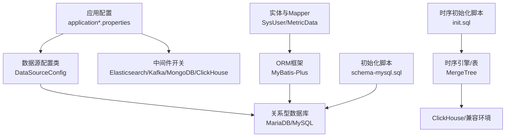
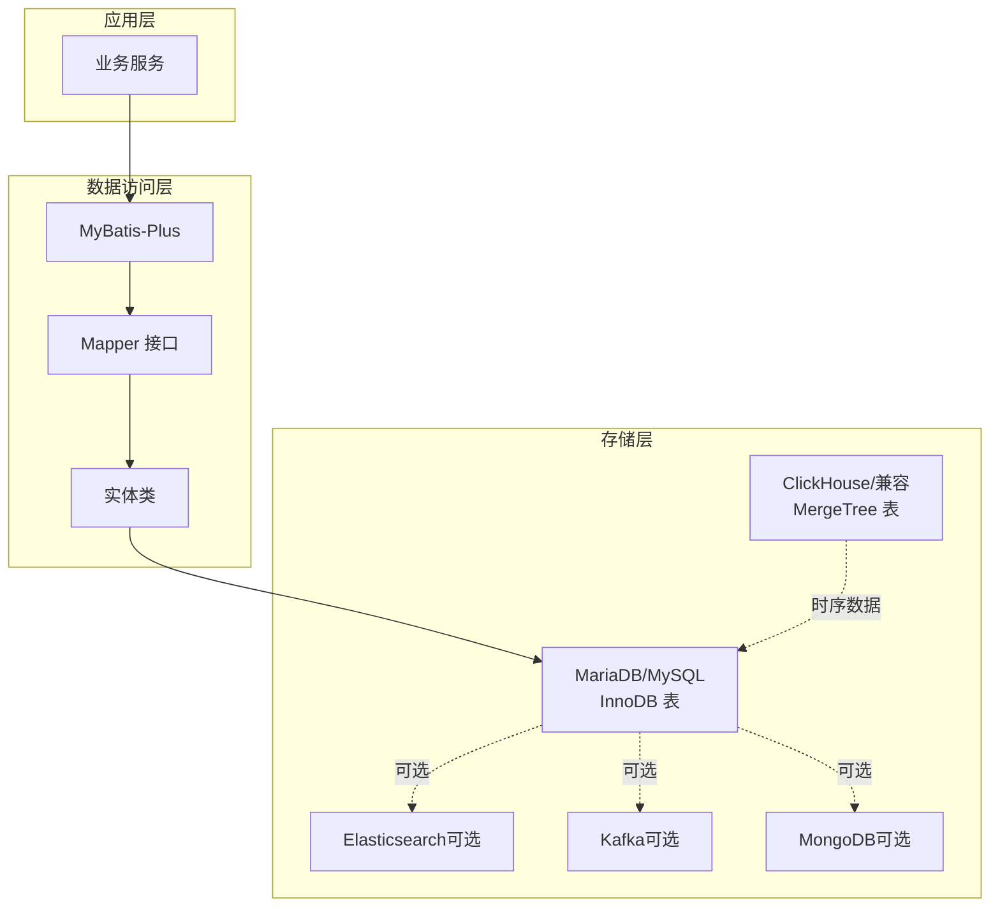
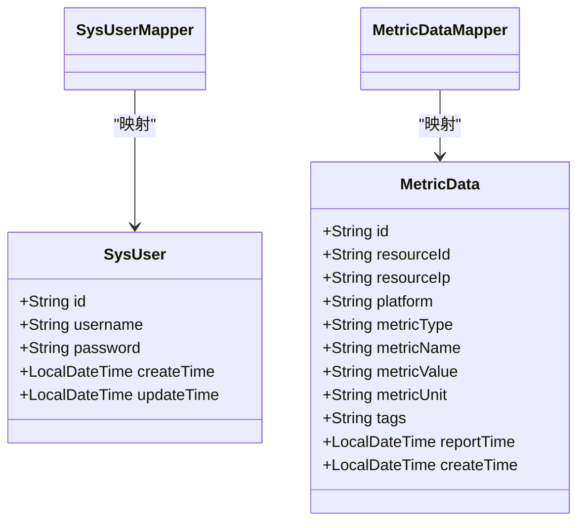

# 数据库设计

<cite>
**本文引用的文件**
- [init.sql](file://watcher-agent/src/main/resources/database/init.sql)
- [schema-mysql.sql](file://watcher-agent/src/main/resources/schema-mysql.sql)
- [application.properties](file://watcher-agent/src/main/resources/application.properties)
- [application-dev.properties](file://watcher-agent/src/main/resources/application-dev.properties)
- [application-prod.properties](file://watcher-agent/src/main/resources/application-prod.properties)
- [SysUser.java](file://watcher-sdk/src/main/java/com/virtual/cloud/om/sdk/entity/mysql/SysUser.java)
- [MetricData.java](file://watcher-sdk/src/main/java/com/virtual/cloud/om/sdk/entity/mysql/MetricData.java)
- [SysUserMapper.java](file://watcher-sdk/src/main/java/com/virtual/cloud/om/sdk/mapper/SysUserMapper.java)
- [MetricDataMapper.java](file://watcher-sdk/src/main/java/com/virtual/cloud/om/sdk/mapper/MetricDataMapper.java)
- [DataSourceConfig.java](file://watcher-agent/src/main/java/com/virtual/cloud/om/agent/config/DataSourceConfig.java)
</cite>

## 目录
1. [简介](#简介)
2. [项目结构](#项目结构)
3. [核心组件](#核心组件)
4. [架构总览](#架构总览)
5. [详细组件分析](#详细组件分析)
6. [依赖分析](#依赖分析)
7. [性能考虑](#性能考虑)
8. [故障排查指南](#故障排查指南)
9. [结论](#结论)
10. [附录](#附录)

## 简介
本文件面向 ShowTime 监控系统的数据库设计与实现，基于仓库中的实际代码与配置进行梳理与总结。当前系统在本地开发与生产环境中主要采用关系型数据库（MySQL 兼容的 MariaDB）作为核心存储，并通过 MyBatis-Plus 进行 ORM 映射；同时保留了对 Elasticsearch、Kafka、MongoDB、ClickHouse 等中间件的配置开关，便于未来扩展。本文将从数据库选型、表结构设计、索引与分区策略、连接池与事务管理、并发控制、备份与高可用、性能监控以及初始化与版本管理等方面进行全面说明。

## 项目结构
围绕数据库相关的关键文件与位置如下：
- 关系型数据库初始化脚本：schema-mysql.sql
- ClickHouse/时序数据初始化脚本：init.sql
- 应用配置（含数据源与中间件开关）：application*.properties
- 实体与 Mapper（MyBatis-Plus）：SysUser、MetricData 及其 Mapper
- 数据源配置类：DataSourceConfig

图表来源
- [application.properties:46-58](file://watcher-agent/src/main/resources/application.properties#L46-L58)
- [application-dev.properties:3-31](file://watcher-agent/src/main/resources/application-dev.properties#L3-L31)
- [application-prod.properties:3-29](file://watcher-agent/src/main/resources/application-prod.properties#L3-L29)
- [schema-mysql.sql:1-204](file://watcher-agent/src/main/resources/schema-mysql.sql#L1-L204)
- [init.sql:1-12](file://watcher-agent/src/main/resources/database/init.sql#L1-L12)
- [SysUser.java:1-56](file://watcher-sdk/src/main/java/com/virtual/cloud/om/sdk/entity/mysql/SysUser.java#L1-L56)
- [MetricData.java:1-43](file://watcher-sdk/src/main/java/com/virtual/cloud/om/sdk/entity/mysql/MetricData.java#L1-L43)
- [SysUserMapper.java:1-14](file://watcher-sdk/src/main/java/com/virtual/cloud/om/sdk/mapper/SysUserMapper.java#L1-L14)
- [MetricDataMapper.java:1-14](file://watcher-sdk/src/main/java/com/virtual/cloud/om/sdk/mapper/MetricDataMapper.java#L1-L14)

章节来源
- [application.properties:1-80](file://watcher-agent/src/main/resources/application.properties#L1-L80)
- [application-dev.properties:1-72](file://watcher-agent/src/main/resources/application-dev.properties#L1-L72)
- [application-prod.properties:1-70](file://watcher-agent/src/main/resources/application-prod.properties#L1-L70)
- [schema-mysql.sql:1-204](file://watcher-agent/src/main/resources/schema-mysql.sql#L1-L204)
- [init.sql:1-12](file://watcher-agent/src/main/resources/database/init.sql#L1-L12)

## 核心组件
- 关系型数据库（MySQL 兼容）：用于存储系统用户、参数配置、任务、部署、资源、指标数据、告警、操作日志等结构化数据。
- 时序数据库（ClickHouse/兼容）：用于存储高吞吐量的指标数据，使用 MergeTree 引擎并按时间列排序。
- 中间件开关：Elasticsearch、Kafka、MongoDB、ClickHouse、Quartz 等在配置中可按需启用或禁用。
- ORM 层：MyBatis-Plus 通过实体类与 Mapper 接口映射关系型表，简化 CRUD 与分页查询。
- 数据源配置：通过 application.properties 配置 JDBC 连接、驱动与 MyBatis-Plus 参数。

章节来源
- [schema-mysql.sql:1-204](file://watcher-agent/src/main/resources/schema-mysql.sql#L1-L204)
- [init.sql:1-12](file://watcher-agent/src/main/resources/database/init.sql#L1-L12)
- [application.properties:46-58](file://watcher-agent/src/main/resources/application.properties#L46-L58)
- [SysUser.java:1-56](file://watcher-sdk/src/main/java/com/virtual/cloud/om/sdk/entity/mysql/SysUser.java#L1-L56)
- [MetricData.java:1-43](file://watcher-sdk/src/main/java/com/virtual/cloud/om/sdk/entity/mysql/MetricData.java#L1-L43)

## 架构总览
下图展示了数据库层在系统中的位置与交互关系：

图表来源
- [application.properties:14-29](file://watcher-agent/src/main/resources/application.properties#L14-L29)
- [application-dev.properties:3-31](file://watcher-agent/src/main/resources/application-dev-properties#L3-L31)
- [application-prod.properties:3-29](file://watcher-agent/src/main/resources/application-prod.properties#L3-L29)
- [schema-mysql.sql:1-204](file://watcher-agent/src/main/resources/schema-mysql.sql#L1-L204)
- [init.sql:1-12](file://watcher-agent/src/main/resources/database/init.sql#L1-L12)

## 详细组件分析

### 关系型数据库（MySQL 兼容）设计
- 数据库与字符集：统一使用 UTF-8 宽字符集，保证多语言与特殊符号支持。
- 表设计原则：
  - 主键策略：统一使用长度合理的字符串主键，便于跨系统拼接与追踪。
  - 外键约束：当前脚本未显式添加外键约束，通过应用层逻辑与唯一索引保障一致性。
  - 索引设计：针对高频查询字段建立单列或复合索引，如参数表的类型+名称组合唯一索引、任务/部署/告警的状态索引、资源表的平台/IP/可用性索引、指标表的资源ID/类型/上报时间/平台等。
  - 时间字段：普遍包含创建时间与更新时间字段，便于审计与统计。
- 典型表概览（节选）：
  - 系统用户表：存储管理员账户信息，包含用户名唯一性与密码字段。
  - 参数配置表：键值型配置，联合唯一索引避免重复配置。
  - 任务表：CRON 调度与处理器类名，便于任务编排。
  - 部署记录表：部署名称、类型、状态、主机与配置 JSON 字段。
  - 操作日志表：模块、操作、操作人、结果、时间等字段。
  - 数据中心配置表：键值配置与描述。
  - 告警记录表：级别、标题、内容、来源、状态、告警与解决时间。
  - 资源表：平台类型、IP/端口/协议、认证信息、SSH 权限与有效期、激活/可用状态。
  - 指标数据表：资源ID/IP/平台、指标类型/名称/值/单位、标签 JSON、上报时间。

章节来源
- [schema-mysql.sql:8-204](file://watcher-agent/src/main/resources/schema-mysql.sql#L8-L204)

### 时序数据库（ClickHouse/兼容）设计
- 表结构：使用字符串字段承载平台、traceId、指标名、批次号、标签与值，时间字段默认当前时间。
- 引擎与排序：采用 MergeTree 引擎，按时间列排序，适合高写入与时间序列查询。
- 适用场景：海量指标数据的快速写入与聚合查询，配合应用侧的批量上报与定时归档策略。

章节来源
- [init.sql:1-12](file://watcher-agent/src/main/resources/database/init.sql#L1-L12)

### 非关系型数据库（MongoDB）设计方案
- 配置开关：在开发与生产配置中提供了 MongoDB 的连接串与索引自动创建开关，表明系统具备集成能力。
- 设计要点：结合现有日志与指标上报流程，可将原始日志或明细数据落盘至 MongoDB，再由下游处理服务进行清洗与聚合，最终写入关系型或时序数据库。

章节来源
- [application-dev.properties:3-5](file://watcher-agent/src/main/resources/application-dev.properties#L3-L5)
- [application-prod.properties:3-5](file://watcher-agent/src/main/resources/application-prod.properties#L3-L5)

### Elasticsearch 查询优化建议
- 当前配置中已开启连接参数（集群名、用户名、密码、超时、最大连接数等），但未在脚本中看到具体索引模板与映射定义。
- 建议：为日志与指标构建合适的索引模板，设置分片与副本，启用字段映射与动态模板，结合查询 DSL 进行过滤与聚合，以提升检索性能。

章节来源
- [application-dev.properties:10-31](file://watcher-agent/src/main/resources/application-dev.properties#L10-L31)
- [application-prod.properties:9-29](file://watcher-agent/src/main/resources/application-prod.properties#L9-L29)

### 数据库连接池与事务管理
- 连接池：通过 JDBC URL 与驱动配置连接参数，结合应用配置中的连接超时设置，确保连接稳定性。
- 事务管理：MyBatis-Plus 默认在单次会话内执行事务，对于批量写入与复杂业务可结合 Spring 声明式事务进行控制。
- 并发控制：利用数据库层面的唯一索引与应用层幂等设计，避免重复写入；对热点表采用读写分离与缓存策略降低压力。

章节来源
- [application.properties:48-51](file://watcher-agent/src/main/resources/application.properties#L48-L51)
- [SysUser.java:27-28](file://watcher-sdk/src/main/java/com/virtual/cloud/om/sdk/entity/mysql/SysUser.java#L27-L28)
- [MetricData.java:20-21](file://watcher-sdk/src/main/java/com/virtual/cloud/om/sdk/entity/mysql/MetricData.java#L20-L21)

### 数据备份与高可用
- 备份策略：建议对关系型数据库与时序数据库分别制定增量/全量备份计划，结合 binlog/归档日志与快照机制，确保可回溯与恢复。
- 高可用：关系型数据库可采用主从复制或集群方案；时序数据库可采用副本与分片；中间件（ES/Kafka/MongoDB）按官方推荐配置副本与分区。

章节来源
- [application-dev.properties:3-31](file://watcher-agent/src/main/resources/application-dev.properties#L3-L31)
- [application-prod.properties:3-29](file://watcher-agent/src/main/resources/application-prod.properties#L3-L29)

### 性能监控与调优
- 指标采集：结合关系型与时序数据库的慢查询日志、锁等待、缓冲池命中率等指标，持续监控性能瓶颈。
- 查询优化：遵循现有索引策略，避免全表扫描；对大表采用分区或分桶策略；对高频查询引入缓存与物化视图。

章节来源
- [schema-mysql.sql:112-204](file://watcher-agent/src/main/resources/schema-mysql.sql#L112-L204)

### 数据库初始化与版本管理
- 初始化脚本：提供完整的数据库与表初始化 SQL，包含默认管理员、密码策略、各业务表与索引。
- 版本管理：建议引入数据库迁移工具（如 Flyway/Liquibase），将初始化脚本拆分为版本化的变更集，确保升级过程可追踪、可回滚。

章节来源
- [schema-mysql.sql:1-204](file://watcher-agent/src/main/resources/schema-mysql.sql#L1-L204)

## 依赖分析
- 实体与 Mapper 的映射关系：SysUser 与 MetricData 分别映射到 sys_user 与 metric_data 表，通过 MyBatis-Plus 的注解与接口完成 ORM。
- 数据源配置：应用配置中声明 JDBC URL、用户名、密码与驱动，供连接池与 ORM 使用。
- 中间件开关：通过配置项控制各中间件启用与否，便于在不同环境灵活切换。

图表来源
- [SysUser.java:18-55](file://watcher-sdk/src/main/java/com/virtual/cloud/om/sdk/entity/mysql/SysUser.java#L18-L55)
- [MetricData.java:14-42](file://watcher-sdk/src/main/java/com/virtual/cloud/om/sdk/entity/mysql/MetricData.java#L14-L42)
- [SysUserMapper.java:10-13](file://watcher-sdk/src/main/java/com/virtual/cloud/om/sdk/mapper/SysUserMapper.java#L10-L13)
- [MetricDataMapper.java:10-13](file://watcher-sdk/src/main/java/com/virtual/cloud/om/sdk/mapper/MetricDataMapper.java#L10-L13)

章节来源
- [SysUser.java:1-56](file://watcher-sdk/src/main/java/com/virtual/cloud/om/sdk/entity/mysql/SysUser.java#L1-L56)
- [MetricData.java:1-43](file://watcher-sdk/src/main/java/com/virtual/cloud/om/sdk/entity/mysql/MetricData.java#L1-L43)
- [SysUserMapper.java:1-14](file://watcher-sdk/src/main/java/com/virtual/cloud/om/sdk/mapper/SysUserMapper.java#L1-L14)
- [MetricDataMapper.java:1-14](file://watcher-sdk/src/main/java/com/virtual/cloud/om/sdk/mapper/MetricDataMapper.java#L1-L14)

## 性能考虑
- 写入性能：关系型表采用 InnoDB，具备良好的并发写入能力；时序表采用 MergeTree，适合高吞吐写入与时间序列查询。
- 查询性能：为高频查询字段建立索引，避免不必要的 SELECT *；对大字段使用 JSON 存储时注意查询路径与索引策略。
- 缓存策略：对只读配置与热点数据引入缓存，减少数据库压力。
- 分区与分片：对历史数据量大的表（如指标表）可考虑按时间分区或水平分片，提升查询效率。

章节来源
- [schema-mysql.sql:112-204](file://watcher-agent/src/main/resources/schema-mysql.sql#L112-L204)
- [init.sql:1-12](file://watcher-agent/src/main/resources/database/init.sql#L1-L12)

## 故障排查指南
- 连接问题：检查 JDBC URL、用户名、密码与驱动是否正确，确认网络连通性与防火墙策略。
- 索引缺失：对慢查询语句补充必要索引，避免全表扫描。
- 数据不一致：核对唯一索引与应用层幂等逻辑，确保重复写入不会发生。
- 中间件异常：根据配置开关判断是否启用对应中间件，逐步定位连接参数与权限问题。

章节来源
- [application.properties:48-51](file://watcher-agent/src/main/resources/application.properties#L48-L51)
- [application-dev.properties:3-31](file://watcher-agent/src/main/resources/application-dev.properties#L3-L31)
- [application-prod.properties:3-29](file://watcher-agent/src/main/resources/application-prod.properties#L3-L29)

## 结论
ShowTime 监控系统当前以关系型数据库为核心，辅以时序数据库与中间件的可选集成。通过统一的初始化脚本、ORM 映射与配置开关，系统实现了清晰的数据流与可扩展的架构。建议后续引入数据库迁移工具完善版本管理，并结合中间件的最佳实践进一步优化查询与写入性能。

## 附录
- 初始化脚本路径：schema-mysql.sql、init.sql
- 应用配置路径：application.properties、application-dev.properties、application-prod.properties
- 实体与 Mapper 路径：SysUser.java、MetricData.java、SysUserMapper.java、MetricDataMapper.java
- 数据源配置类：DataSourceConfig