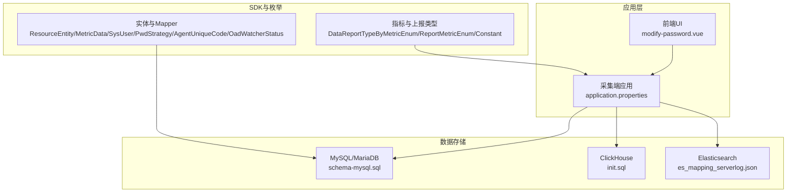
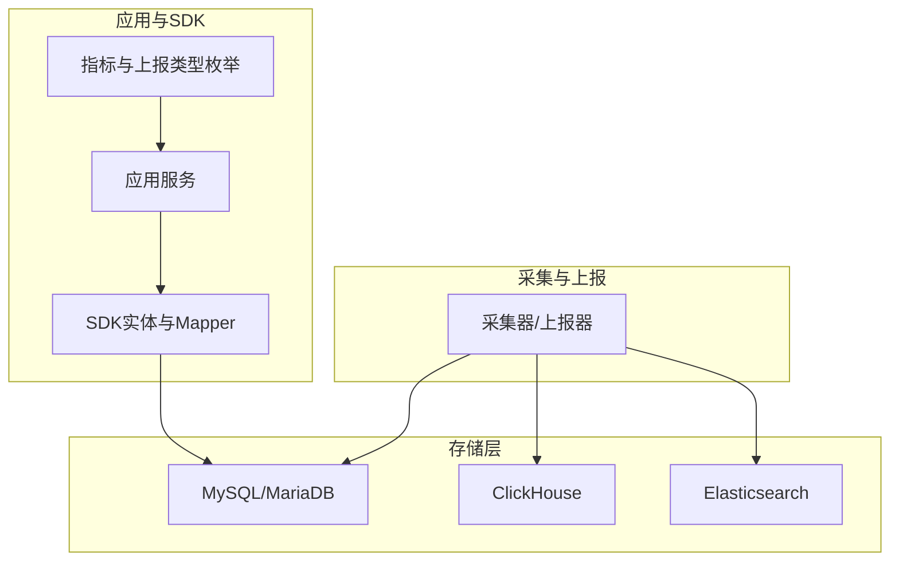
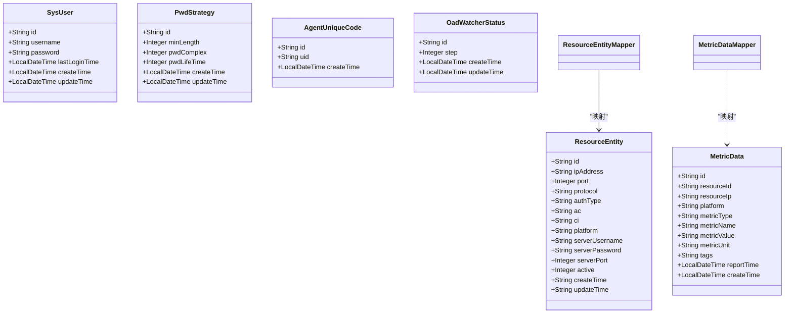
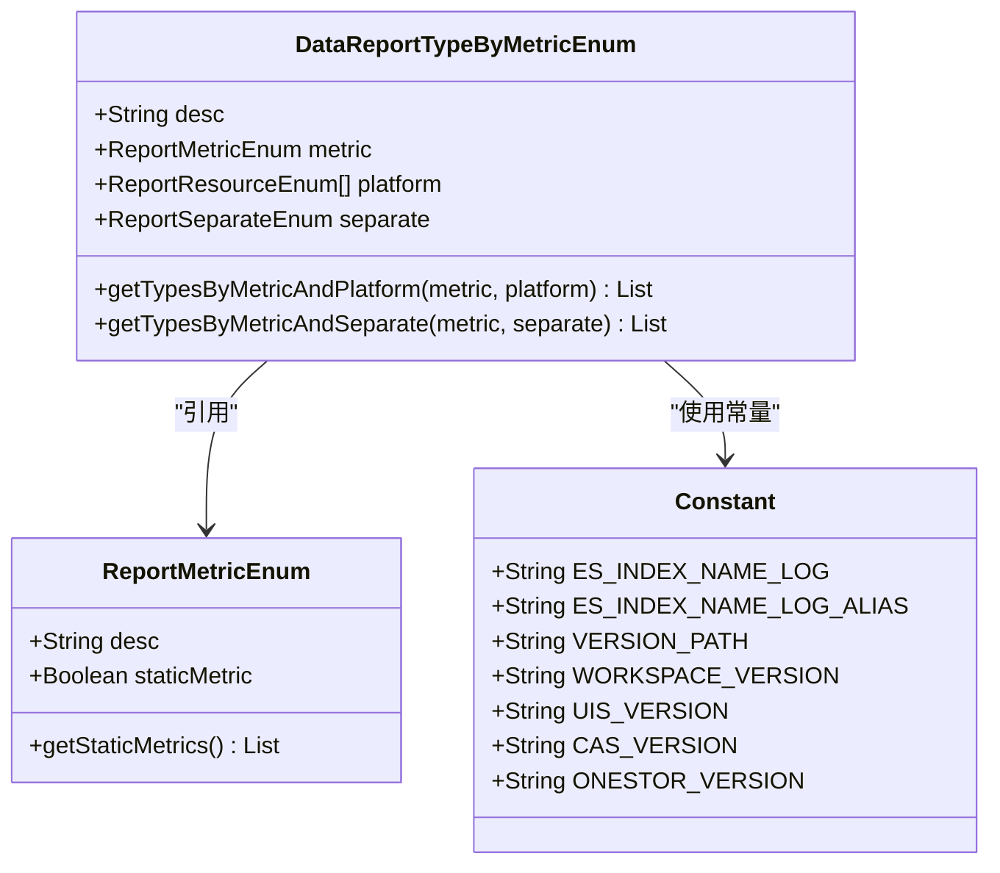
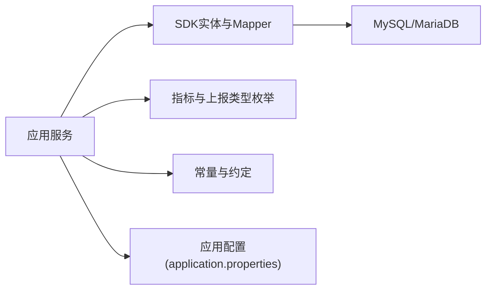

# 数据模型设计

<cite>
**本文引用的文件**
- [schema-mysql.sql](file://watcher-agent/src/main/resources/schema-mysql.sql)
- [init.sql](file://watcher-agent/src/main/resources/database/init.sql)
- [es_mapping_serverlog.json](file://watcher-agent/src/main/resources/es_mapping_serverlog.json)
- [application.properties](file://watcher-agent/src/main/resources/application.properties)
- [ResourceEntity.java](file://watcher-sdk/src/main/java/com/virtual/cloud/om/sdk/entity/mysql/ResourceEntity.java)
- [MetricData.java](file://watcher-sdk/src/main/java/com/virtual/cloud/om/sdk/entity/mysql/MetricData.java)
- [SysUser.java](file://watcher-sdk/src/main/java/com/virtual/cloud/om/sdk/entity/mysql/SysUser.java)
- [PwdStrategy.java](file://watcher-sdk/src/main/java/com/virtual/cloud/om/sdk/entity/mysql/PwdStrategy.java)
- [AgentUniqueCode.java](file://watcher-sdk/src/main/java/com/virtual/cloud/om/sdk/entity/mysql/AgentUniqueCode.java)
- [OadWatcherStatus.java](file://watcher-sdk/src/main/java/com/virtual/cloud/om/sdk/entity/mysql/OadWatcherStatus.java)
- [ResourceEntityMapper.java](file://watcher-sdk/src/main/java/com/virtual/cloud/om/sdk/mapper/ResourceEntityMapper.java)
- [MetricDataMapper.java](file://watcher-sdk/src/main/java/com/virtual/cloud/om/sdk/mapper/MetricDataMapper.java)
- [DataReportTypeByMetricEnum.java](file://watcher-sdk/src/main/java/com/virtual/cloud/om/sdk/constant/DataReportTypeByMetricEnum.java)
- [ReportMetricEnum.java](file://watcher-sdk/src/main/java/com/virtual/cloud/om/sdk/constant/report/ReportMetricEnum.java)
- [Constant.java](file://watcher-sdk/src/main/java/com/virtual/cloud/om/sdk/constant/Constant.java)
- [TaskRepositoryImpl.java](file://watcher-agent/src/main/java/com/virtual/cloud/om/agent/repository/TaskRepositoryImpl.java)
- [modify-password.vue](file://watcher-web/src/layout/Header/modify-password.vue)
</cite>

## 目录
1. [简介](#简介)
2. [项目结构](#项目结构)
3. [核心组件](#核心组件)
4. [架构总览](#架构总览)
5. [详细组件分析](#详细组件分析)
6. [依赖分析](#依赖分析)
7. [性能考虑](#性能考虑)
8. [故障排查指南](#故障排查指南)
9. [结论](#结论)
10. [附录](#附录)

## 简介
本文件面向ShowTime监控系统，提供全面的数据模型设计文档。内容涵盖关系型数据库与非关系型数据库的选择依据、表结构与索引策略、实体关系图、数据字典、数据访问模式（ORM映射、查询优化、缓存策略）、数据生命周期管理（创建、更新、归档、清理）、数据验证与业务规则、数据迁移与版本管理策略，以及数据安全与隐私保护措施（加密、访问控制、审计日志）。

## 项目结构
围绕数据模型的关键位置与文件如下：
- 关系型数据库（MySQL/MariaDB）初始化与表结构：schema-mysql.sql
- 实时指标存储（ClickHouse）建表脚本：init.sql
- 日志检索（Elasticsearch）索引映射：es_mapping_serverlog.json
- 应用数据源与MyBatis-Plus配置：application.properties
- SDK侧实体与Mapper（MySQL ORM映射）：ResourceEntity、MetricData、SysUser、PwdStrategy、AgentUniqueCode、OadWatcherStatus 及其 Mapper
- 平台指标枚举与上报类型映射：DataReportTypeByMetricEnum、ReportMetricEnum
- 常量与平台约定：Constant
- 采集端任务仓库（MySQL单机版禁用实现）：TaskRepositoryImpl
- 前端密码复杂度校验（业务规则示例）：modify-password.vue

图表来源
- [application.properties:46-58](file://watcher-agent/src/main/resources/application.properties#L46-L58)
- [schema-mysql.sql:1-204](file://watcher-agent/src/main/resources/schema-mysql.sql#L1-L204)
- [init.sql:1-12](file://watcher-agent/src/main/resources/database/init.sql#L1-L12)
- [es_mapping_serverlog.json:1-155](file://watcher-agent/src/main/resources/es_mapping_serverlog.json#L1-L155)
- [ResourceEntity.java:1-47](file://watcher-sdk/src/main/java/com/virtual/cloud/om/sdk/entity/mysql/ResourceEntity.java#L1-L47)
- [MetricData.java:1-43](file://watcher-sdk/src/main/java/com/virtual/cloud/om/sdk/entity/mysql/MetricData.java#L1-L43)
- [DataReportTypeByMetricEnum.java:1-190](file://watcher-sdk/src/main/java/com/virtual/cloud/om/sdk/constant/DataReportTypeByMetricEnum.java#L1-L190)
- [ReportMetricEnum.java:89-117](file://watcher-sdk/src/main/java/com/virtual/cloud/om/sdk/constant/report/ReportMetricEnum.java#L89-L117)
- [Constant.java:1-312](file://watcher-sdk/src/main/java/com/virtual/cloud/om/sdk/constant/Constant.java#L1-L312)

章节来源
- [application.properties:1-80](file://watcher-agent/src/main/resources/application.properties#L1-L80)
- [schema-mysql.sql:1-204](file://watcher-agent/src/main/resources/schema-mysql.sql#L1-L204)
- [init.sql:1-12](file://watcher-agent/src/main/resources/database/init.sql#L1-L12)
- [es_mapping_serverlog.json:1-155](file://watcher-agent/src/main/resources/es_mapping_serverlog.json#L1-L155)

## 核心组件
- 关系型数据库（MySQL/MariaDB）：用于存储系统用户、资源、指标元数据、参数配置、部署记录、任务、告警、Agent唯一码、密码策略等结构化数据。
- 实时指标存储（ClickHouse）：用于高吞吐写入与快速聚合查询的时序指标数据。
- 日志检索（Elasticsearch）：用于结构化日志的全文检索与分析。
- SDK实体与Mapper：通过MyBatis-Plus映射MySQL表，提供统一的CRUD与查询能力。
- 指标与上报类型枚举：统一抽象不同资源平台的指标类型与上报实现，支撑策略与平台解耦。

章节来源
- [schema-mysql.sql:8-204](file://watcher-agent/src/main/resources/schema-mysql.sql#L8-L204)
- [init.sql:1-12](file://watcher-agent/src/main/resources/database/init.sql#L1-L12)
- [es_mapping_serverlog.json:1-155](file://watcher-agent/src/main/resources/es_mapping_serverlog.json#L1-L155)
- [ResourceEntity.java:1-47](file://watcher-sdk/src/main/java/com/virtual/cloud/om/sdk/entity/mysql/ResourceEntity.java#L1-L47)
- [MetricData.java:1-43](file://watcher-sdk/src/main/java/com/virtual/cloud/om/sdk/entity/mysql/MetricData.java#L1-L43)
- [DataReportTypeByMetricEnum.java:1-190](file://watcher-sdk/src/main/java/com/virtual/cloud/om/sdk/constant/DataReportTypeByMetricEnum.java#L1-L190)

## 架构总览
ShowTime监控系统采用“关系型数据库+时序数据库+日志检索引擎”的混合存储架构：
- 关系型数据库承载系统管理与元数据；通过MyBatis-Plus进行ORM映射。
- ClickHouse承载高并发指标写入与聚合查询；按时间列排序以优化时间序列查询。
- Elasticsearch承载结构化日志，支持全文检索与分析。
- SDK侧通过枚举与常量规范指标类型与上报策略，保证跨平台一致性。

图表来源
- [application.properties:46-58](file://watcher-agent/src/main/resources/application.properties#L46-L58)
- [schema-mysql.sql:1-204](file://watcher-agent/src/main/resources/schema-mysql.sql#L1-L204)
- [init.sql:1-12](file://watcher-agent/src/main/resources/database/init.sql#L1-L12)
- [es_mapping_serverlog.json:1-155](file://watcher-agent/src/main/resources/es_mapping_serverlog.json#L1-L155)
- [DataReportTypeByMetricEnum.java:1-190](file://watcher-sdk/src/main/java/com/virtual/cloud/om/sdk/constant/DataReportTypeByMetricEnum.java#L1-L190)

## 详细组件分析

### 关系型数据库表结构与索引策略
- 系统用户表（sys_user）：主键ID、用户名唯一、密码加密、最近登录时间、创建/更新时间。
- 密码策略表（pwd_strategy）：主键ID、最小长度、复杂度等级、密码有效期。
- Agent唯一码表（agent_unique_code）：主键ID、唯一标识uid、创建时间。
- 部署记录表（deploy）：主键ID、部署名称/类型/状态、主机地址、配置JSON、创建/更新时间。
- 参数配置表（parameter）：主键ID、类型+名称唯一、参数值、描述、创建/更新时间。
- 任务表（task）：主键ID、任务名称/类型/状态、CRON表达式、处理器类名、参数JSON、创建/更新时间。
- 操作日志表（operation_log）：主键ID、模块/操作/操作人/结果、时间戳、软删除标记、创建时间；建立deleted与time索引。
- 数据中心配置表（data_center_config）：主键ID、配置键唯一、配置值、描述、创建/更新时间。
- 告警记录表（warn）：主键ID、级别/标题/内容/来源、状态、告警/解决时间、创建/更新时间；建立status与level索引。
- 资源表（resource）：主键ID、资源名称、平台类型、IP/端口/协议、认证信息、管理节点凭据、SSH权限与有效期、激活/可用状态、唯一索引(ip, platform)；建立platform/ip/usable索引。
- 指标数据表（metric_data）：主键ID、资源ID/IP/平台、指标类型/名称/值/单位、标签JSON、上报时间、创建时间；建立resource_id、metric_type、report_time、platform索引。

章节来源
- [schema-mysql.sql:8-204](file://watcher-agent/src/main/resources/schema-mysql.sql#L8-L204)

### 实时指标存储（ClickHouse）
- awesome_metrics表：字段包含平台、traceId、指标名、批次号、标签、数值、创建时间；使用MergeTree引擎并按创建时间排序，适合时间序列查询与聚合。

章节来源
- [init.sql:1-12](file://watcher-agent/src/main/resources/database/init.sql#L1-L12)

### 日志检索（Elasticsearch）
- serverlog索引映射：包含hostId/hostIp/hostName/level/line/message/method/path/platform/requestIp/requestPort/requestUuid/resourceId/targetType/thread/time等字段；message使用ik_max_word分词器；设置分片与副本数。

章节来源
- [es_mapping_serverlog.json:1-155](file://watcher-agent/src/main/resources/es_mapping_serverlog.json#L1-L155)

### SDK实体与Mapper（MySQL ORM映射）
- ResourceEntity：映射resource_entity表，包含ID、IP、端口、协议、认证类型、AC/CI、平台、服务器凭据、端口、激活状态、创建/更新时间。
- MetricData：映射metric_data表，包含ID、资源ID/IP/平台、指标类型/名称/值/单位、标签JSON、上报时间、创建时间。
- SysUser：映射sys_user表，包含ID、用户名、加密密码、最近登录时间、创建/更新时间。
- PwdStrategy：映射pwd_strategy表，包含ID、最小长度、复杂度、有效期、创建/更新时间。
- AgentUniqueCode：映射agent_unique_code表，包含ID、唯一码、创建时间。
- OadWatcherStatus：映射oad_watcher_status表，包含ID、步骤、创建/更新时间。
- ResourceEntityMapper、MetricDataMapper：MyBatis-Plus基础Mapper接口，提供通用CRUD能力。

图表来源
- [ResourceEntity.java:1-47](file://watcher-sdk/src/main/java/com/virtual/cloud/om/sdk/entity/mysql/ResourceEntity.java#L1-L47)
- [MetricData.java:1-43](file://watcher-sdk/src/main/java/com/virtual/cloud/om/sdk/entity/mysql/MetricData.java#L1-L43)
- [SysUser.java:1-55](file://watcher-sdk/src/main/java/com/virtual/cloud/om/sdk/entity/mysql/SysUser.java#L1-L55)
- [PwdStrategy.java:1-54](file://watcher-sdk/src/main/java/com/virtual/cloud/om/sdk/entity/mysql/PwdStrategy.java#L1-L54)
- [AgentUniqueCode.java:1-39](file://watcher-sdk/src/main/java/com/virtual/cloud/om/sdk/entity/mysql/AgentUniqueCode.java#L1-L39)
- [OadWatcherStatus.java:1-44](file://watcher-sdk/src/main/java/com/virtual/cloud/om/sdk/entity/mysql/OadWatcherStatus.java#L1-L44)
- [ResourceEntityMapper.java:1-13](file://watcher-sdk/src/main/java/com/virtual/cloud/om/sdk/mapper/ResourceEntityMapper.java#L1-L13)
- [MetricDataMapper.java:1-14](file://watcher-sdk/src/main/java/com/virtual/cloud/om/sdk/mapper/MetricDataMapper.java#L1-L14)

章节来源
- [ResourceEntity.java:1-47](file://watcher-sdk/src/main/java/com/virtual/cloud/om/sdk/entity/mysql/ResourceEntity.java#L1-L47)
- [MetricData.java:1-43](file://watcher-sdk/src/main/java/com/virtual/cloud/om/sdk/entity/mysql/MetricData.java#L1-L43)
- [SysUser.java:1-55](file://watcher-sdk/src/main/java/com/virtual/cloud/om/sdk/entity/mysql/SysUser.java#L1-L55)
- [PwdStrategy.java:1-54](file://watcher-sdk/src/main/java/com/virtual/cloud/om/sdk/entity/mysql/PwdStrategy.java#L1-L54)
- [AgentUniqueCode.java:1-39](file://watcher-sdk/src/main/java/com/virtual/cloud/om/sdk/entity/mysql/AgentUniqueCode.java#L1-L39)
- [OadWatcherStatus.java:1-44](file://watcher-sdk/src/main/java/com/virtual/cloud/om/sdk/entity/mysql/OadWatcherStatus.java#L1-L44)
- [ResourceEntityMapper.java:1-13](file://watcher-sdk/src/main/java/com/virtual/cloud/om/sdk/mapper/ResourceEntityMapper.java#L1-L13)
- [MetricDataMapper.java:1-14](file://watcher-sdk/src/main/java/com/virtual/cloud/om/sdk/mapper/MetricDataMapper.java#L1-L14)

### 指标与上报类型映射
- DataReportTypeByMetricEnum：将数据中心下发的指标名与具体平台实现类进行映射，支持同一指标在不同平台的不同实现，同时支持按分离维度（如host/cluster/domain）选择实现。
- ReportMetricEnum：定义具体的指标类型枚举及其静态标志，用于策略与实现的解耦。
- Constant：提供平台常量、日志索引名、版本路径等约定，保障跨模块一致性。

图表来源
- [DataReportTypeByMetricEnum.java:1-190](file://watcher-sdk/src/main/java/com/virtual/cloud/om/sdk/constant/DataReportTypeByMetricEnum.java#L1-L190)
- [ReportMetricEnum.java:89-117](file://watcher-sdk/src/main/java/com/virtual/cloud/om/sdk/constant/report/ReportMetricEnum.java#L89-L117)
- [Constant.java:212-233](file://watcher-sdk/src/main/java/com/virtual/cloud/om/sdk/constant/Constant.java#L212-L233)

章节来源
- [DataReportTypeByMetricEnum.java:1-190](file://watcher-sdk/src/main/java/com/virtual/cloud/om/sdk/constant/DataReportTypeByMetricEnum.java#L1-L190)
- [ReportMetricEnum.java:89-117](file://watcher-sdk/src/main/java/com/virtual/cloud/om/sdk/constant/report/ReportMetricEnum.java#L89-L117)
- [Constant.java:1-312](file://watcher-sdk/src/main/java/com/virtual/cloud/om/sdk/constant/Constant.java#L1-L312)

### 数据访问模式与查询优化
- ORM映射：通过MyBatis-Plus的BaseMapper接口与注解@TableId/@TableName实现自动映射，减少手写SQL工作量。
- 查询优化：
  - 在MySQL侧，针对高频查询字段建立索引（如operation_log的deleted与time，parameter的type+name组合唯一索引，warn的status与level，resource的platform/ip/usable，metric_data的resource_id/metric_type/report_time/platform）。
  - 在ClickHouse侧，按时间列排序（order by createTime）以提升时间序列查询效率。
  - 在Elasticsearch侧，message使用ik_max_word分词器，便于中文日志检索。
- 缓存策略：当前配置禁用中间件（如Redis），可结合业务热点数据在应用层引入轻量缓存（如Guava/Caffeine）或数据库层面的查询缓存（如MyBatis二级缓存）。

章节来源
- [schema-mysql.sql:112-204](file://watcher-agent/src/main/resources/schema-mysql.sql#L112-L204)
- [init.sql:1-12](file://watcher-agent/src/main/resources/database/init.sql#L1-L12)
- [es_mapping_serverlog.json:52-55](file://watcher-agent/src/main/resources/es_mapping_serverlog.json#L52-L55)
- [application.properties:53-58](file://watcher-agent/src/main/resources/application.properties#L53-L58)

### 数据生命周期管理
- 创建：所有新增记录均包含创建时间字段，默认CURRENT_TIMESTAMP；部分表包含唯一键约束，避免重复。
- 更新：更新时间字段默认CURRENT_TIMESTAMP ON UPDATE CURRENT_TIMESTAMP，确保变更追踪。
- 归档与清理：
  - MySQL：建议基于report_time或create_time对历史数据进行冷热分离与定期归档；对operation_log、warn、metric_data等大表制定保留周期策略。
  - ClickHouse：利用分区与TTL策略按时间归档或删除旧数据，降低查询成本。
  - Elasticsearch：基于索引生命周期管理（ILM）或滚动索引，定期删除过期日志索引。
- 任务仓库（MySQL单机版禁用）：当前实现仅记录日志，不执行实际CRUD，后续演进需明确任务持久化策略与清理规则。

章节来源
- [schema-mysql.sql:11-204](file://watcher-agent/src/main/resources/schema-mysql.sql#L11-L204)
- [init.sql:1-12](file://watcher-agent/src/main/resources/database/init.sql#L1-L12)
- [TaskRepositoryImpl.java:1-52](file://watcher-agent/src/main/java/com/virtual/cloud/om/agent/repository/TaskRepositoryImpl.java#L1-L52)

### 数据验证与业务规则
- 前端密码复杂度校验：根据复杂度等级匹配数字、大小写字母、特殊字符，确保密码强度符合策略。
- 后端策略约束：pwd_strategy表定义最小长度、复杂度、有效期；SysUser表存储加密后的密码。
- 唯一性约束：parameter(type,name)唯一、resource(ip,platform)唯一、sys_user(username)唯一、agent_unique_code(uid)唯一。
- 平台常量与枚举：通过Constant与枚举类约束平台类型、日志索引名、版本路径等，避免硬编码带来的不一致。

章节来源
- [modify-password.vue:113-160](file://watcher-web/src/layout/Header/modify-password.vue#L113-L160)
- [PwdStrategy.java:1-54](file://watcher-sdk/src/main/java/com/virtual/cloud/om/sdk/entity/mysql/PwdStrategy.java#L1-L54)
- [SysUser.java:1-55](file://watcher-sdk/src/main/java/com/virtual/cloud/om/sdk/entity/mysql/SysUser.java#L1-L55)
- [schema-mysql.sql:28-80](file://watcher-agent/src/main/resources/schema-mysql.sql#L28-L80)
- [Constant.java:1-312](file://watcher-sdk/src/main/java/com/virtual/cloud/om/sdk/constant/Constant.java#L1-L312)

### 数据迁移与版本管理
- 版本路径与版本文件：通过Constant定义各平台版本文件路径，便于集中管理与升级检测。
- 迁移策略建议：
  - 使用数据库迁移工具（如Flyway/Liquibase）管理schema变更，确保版本一致性。
  - 对ClickHouse与Elasticsearch的schema变更，采用向后兼容策略与灰度发布。
  - 对于枚举与常量的变更，遵循向后兼容原则，提供过渡期的双读逻辑。

章节来源
- [Constant.java:222-233](file://watcher-sdk/src/main/java/com/virtual/cloud/om/sdk/constant/Constant.java#L222-L233)
- [DataReportTypeByMetricEnum.java:1-190](file://watcher-sdk/src/main/java/com/virtual/cloud/om/sdk/constant/DataReportTypeByMetricEnum.java#L1-L190)

### 数据安全与隐私保护
- 数据加密：SysUser与resource表中涉及密码与敏感认证信息的字段采用加密存储；前端密码复杂度校验与后端策略共同保障密码强度。
- 访问控制：通过平台常量与枚举约束访问路径与策略，结合鉴权机制限制未授权访问。
- 审计日志：operation_log表记录操作模块、操作描述、操作人、结果与时间，配合deleted软删除字段实现审计追踪。

章节来源
- [SysUser.java:1-55](file://watcher-sdk/src/main/java/com/virtual/cloud/om/sdk/entity/mysql/SysUser.java#L1-L55)
- [schema-mysql.sql:98-110](file://watcher-agent/src/main/resources/schema-mysql.sql#L98-L110)
- [Constant.java:1-312](file://watcher-sdk/src/main/java/com/virtual/cloud/om/sdk/constant/Constant.java#L1-L312)

## 依赖分析
- 组件耦合与内聚：
  - SDK实体与Mapper与MySQL表强耦合，通过注解与MyBatis-Plus实现低耦合高内聚的CRUD层。
  - 指标与上报类型枚举与平台实现解耦，通过枚举映射实现策略与实现分离。
- 外部依赖：
  - 应用通过application.properties配置数据源与MyBatis-Plus，当前禁用中间件开关，便于单机版部署与测试。
- 潜在风险：
  - 采集端任务仓库在MySQL单机版被禁用，若未来需要任务持久化，需重新评估与重构。

图表来源
- [application.properties:46-58](file://watcher-agent/src/main/resources/application.properties#L46-L58)
- [ResourceEntityMapper.java:1-13](file://watcher-sdk/src/main/java/com/virtual/cloud/om/sdk/mapper/ResourceEntityMapper.java#L1-L13)
- [MetricDataMapper.java:1-14](file://watcher-sdk/src/main/java/com/virtual/cloud/om/sdk/mapper/MetricDataMapper.java#L1-L14)
- [DataReportTypeByMetricEnum.java:1-190](file://watcher-sdk/src/main/java/com/virtual/cloud/om/sdk/constant/DataReportTypeByMetricEnum.java#L1-L190)
- [Constant.java:1-312](file://watcher-sdk/src/main/java/com/virtual/cloud/om/sdk/constant/Constant.java#L1-L312)

章节来源
- [application.properties:1-80](file://watcher-agent/src/main/resources/application.properties#L1-L80)
- [ResourceEntityMapper.java:1-13](file://watcher-sdk/src/main/java/com/virtual/cloud/om/sdk/mapper/ResourceEntityMapper.java#L1-L13)
- [MetricDataMapper.java:1-14](file://watcher-sdk/src/main/java/com/virtual/cloud/om/sdk/mapper/MetricDataMapper.java#L1-L14)
- [DataReportTypeByMetricEnum.java:1-190](file://watcher-sdk/src/main/java/com/virtual/cloud/om/sdk/constant/DataReportTypeByMetricEnum.java#L1-L190)
- [Constant.java:1-312](file://watcher-sdk/src/main/java/com/virtual/cloud/om/sdk/constant/Constant.java#L1-L312)

## 性能考虑
- MySQL索引：针对高频过滤字段建立复合索引与唯一索引，减少全表扫描。
- ClickHouse排序：按时间列排序，优化时间序列查询与聚合性能。
- Elasticsearch分词：message使用ik_max_word，兼顾中文分词与检索性能。
- 缓存与异步：在当前禁用中间件的情况下，可通过应用层缓存与异步写入缓解压力；上线后可引入Redis等缓存与消息队列。

## 故障排查指南
- 数据库连接问题：检查application.properties中的数据源URL、用户名、密码与驱动类名。
- 索引缺失导致慢查询：核对schema-mysql.sql中的索引定义，补充缺失索引。
- ClickHouse写入异常：确认awesome_metrics表结构与数据类型匹配，检查order by与分区策略。
- Elasticsearch日志检索失败：核对es_mapping_serverlog.json的字段映射与分词器配置。

章节来源
- [application.properties:46-58](file://watcher-agent/src/main/resources/application.properties#L46-L58)
- [schema-mysql.sql:112-204](file://watcher-agent/src/main/resources/schema-mysql.sql#L112-L204)
- [init.sql:1-12](file://watcher-agent/src/main/resources/database/init.sql#L1-L12)
- [es_mapping_serverlog.json:1-155](file://watcher-agent/src/main/resources/es_mapping_serverlog.json#L1-L155)

## 结论
ShowTime监控系统采用混合存储架构，结合关系型数据库、时序数据库与时序日志检索引擎，满足监控场景下的高并发写入与高效查询需求。通过SDK实体与Mapper、指标与上报类型枚举、常量与平台约定，实现跨平台的一致性与可扩展性。建议在生产环境中完善中间件接入、缓存策略与数据生命周期管理，并持续通过迁移工具与版本管理保障系统演进的稳定性与安全性。

## 附录
- 数据字典（节选）
  - sys_user：主键ID、用户名唯一、密码加密、最近登录时间、创建/更新时间。
  - pwd_strategy：主键ID、最小长度、复杂度、有效期、创建/更新时间。
  - agent_unique_code：主键ID、唯一码uid、创建时间。
  - deploy：主键ID、部署名称/类型/状态、主机地址、配置JSON、创建/更新时间。
  - parameter：主键ID、类型+名称唯一、参数值、描述、创建/更新时间。
  - task：主键ID、任务名称/类型/状态、CRON表达式、处理器类名、参数JSON、创建/更新时间。
  - operation_log：主键ID、模块/操作/操作人/结果、时间戳、软删除标记、创建时间。
  - data_center_config：主键ID、配置键唯一、配置值、描述、创建/更新时间。
  - warn：主键ID、级别/标题/内容/来源、状态、告警/解决时间、创建/更新时间。
  - resource：主键ID、资源名称、平台类型、IP/端口/协议、认证信息、管理节点凭据、SSH权限与有效期、激活/可用状态、唯一索引(ip,platform)。
  - metric_data：主键ID、资源ID/IP/平台、指标类型/名称/值/单位、标签JSON、上报时间、创建时间。

章节来源
- [schema-mysql.sql:8-204](file://watcher-agent/src/main/resources/schema-mysql.sql#L8-L204)