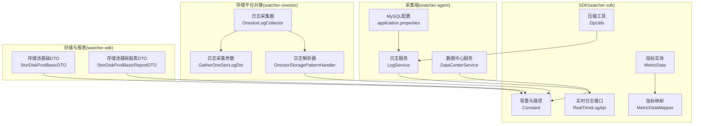
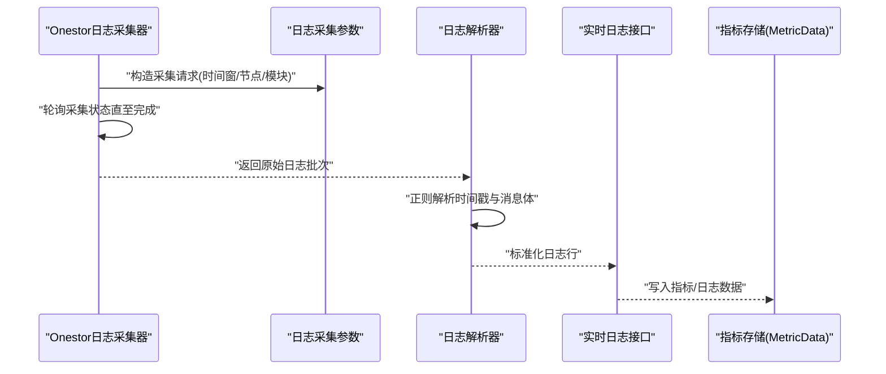
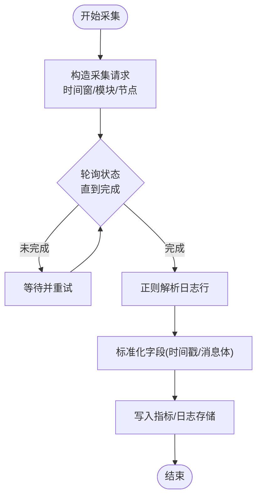
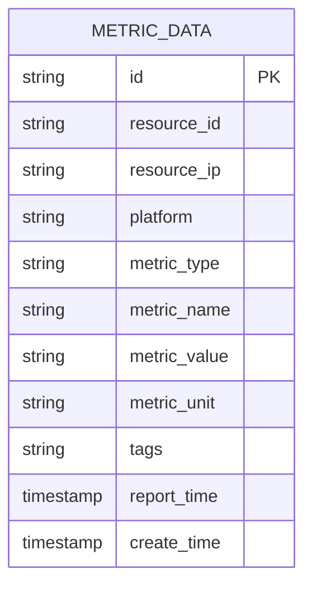
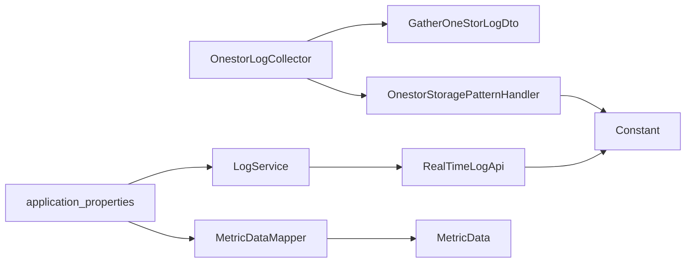

# 数据生命周期管理

<cite>
**本文引用的文件**
- [application.properties](file://watcher-agent/src/main/resources/application.properties)
- [Constant.java](file://watcher-sdk/src/main/java/com/virtual/cloud/om/sdk/constant/Constant.java)
- [ZipUtils.java](file://watcher-sdk/src/main/java/com/virtual/cloud/om/sdk/utils/ZipUtils.java)
- [GatherOneStorLogDto.java](file://watcher-sdk/src/main/java/com/virtual/cloud/om/sdk/dto/GatherOneStorLogDto.java)
- [OnestorLogCollector.java](file://watcher-onestor/src/main/java/com/virtual/cloud/om/onestor/service/log/OnestorLogCollector.java)
- [OnestorStoragePatternHandler.java](file://watcher-onestor/src/main/java/com/virtual/cloud/om/onestor/service/OnestorStoragePatternHandler.java)
- [RealTimeLogApi.java](file://watcher-sdk/src/main/java/com/virtual/cloud/om/sdk/api/RealTimeLogApi.java)
- [LogService.java](file://watcher-agent/src/main/java/com/virtual/cloud/om/agent/service/logs/LogService.java)
- [MetricData.java](file://watcher-sdk/src/main/java/com/virtual/cloud/om/sdk/entity/mysql/MetricData.java)
- [MetricDataMapper.java](file://watcher-sdk/src/main/java/com/virtual/cloud/om/sdk/mapper/MetricDataMapper.java)
- [DataCenterService.java](file://watcher-agent/src/main/java/com/virtual/cloud/om/agent/service/datacenter/DataCenterService.java)
- [KafkaConsumerOffsetLog.java](file://watcher-agent/src/main/java/com/virtual/cloud/om/agent/entity/KafkaConsumerOffsetLog.java)
- [StorDiskPoolBasicDTO.java](file://watcher-sdk/src/main/java/com/virtual/cloud/om/sdk/dto/dataReport/onestor/basic/StorDiskPoolBasicDTO.java)
- [StorDiskPoolBasicReportDTO.java](file://watcher-sdk/src/main/java/com/virtual/cloud/om/sdk/dto/dataReport/onestor/basic/StorDiskPoolBasicReportDTO.java)
</cite>

## 目录
1. [引言](#引言)
2. [项目结构](#项目结构)
3. [核心组件](#核心组件)
4. [架构总览](#架构总览)
5. [详细组件分析](#详细组件分析)
6. [依赖关系分析](#依赖关系分析)
7. [性能考量](#性能考量)
8. [故障排查指南](#故障排查指南)
9. [结论](#结论)
10. [附录](#附录)

## 引言
本文件面向ShowTime监控系统的数据生命周期管理，系统性梳理从“数据采集—存储—处理—归档—清理”的全链路策略，并结合仓库中现有实现，给出可落地的保留策略、压缩与归档机制、冷热分离与分层存储建议、清理与回收策略、备份与恢复方案以及监控与报告能力。由于部分中间件在本地配置中处于禁用状态，本文同时提供在禁用场景下的替代实现与建议，帮助运维人员在不同环境下维持数据健康与合规。

## 项目结构
围绕数据生命周期的关键模块分布于以下子系统：
- watcher-agent：采集端服务，负责日志与指标的采集、落库与基础清理；本地配置中禁用了多种中间件，采用简化实现。
- watcher-sdk：SDK层，定义常量、实体、接口与工具类，统一数据格式与处理规范。
- watcher-onestor：存储平台对接，负责日志批量采集、解析与上报。
- watcher-cas、watcher-workspace：其他平台对接模块，补充指标与报表采集。

图表来源
- [application.properties:1-80](file://watcher-agent/src/main/resources/application.properties#L1-L80)
- [Constant.java:1-312](file://watcher-sdk/src/main/java/com/virtual/cloud/om/sdk/constant/Constant.java#L1-L312)
- [LogService.java:1-50](file://watcher-agent/src/main/java/com/virtual/cloud/om/agent/service/logs/LogService.java#L1-L50)
- [OnestorLogCollector.java:1-58](file://watcher-onestor/src/main/java/com/virtual/cloud/om/onestor/service/log/OnestorLogCollector.java#L1-L58)
- [OnestorStoragePatternHandler.java:1-51](file://watcher-onestor/src/main/java/com/virtual/cloud/om/onestor/service/OnestorStoragePatternHandler.java#L1-L51)
- [GatherOneStorLogDto.java:1-33](file://watcher-sdk/src/main/java/com/virtual/cloud/om/sdk/dto/GatherOneStorLogDto.java#L1-L33)
- [RealTimeLogApi.java:47-58](file://watcher-sdk/src/main/java/com/virtual/cloud/om/sdk/api/RealTimeLogApi.java#L47-L58)
- [ZipUtils.java:1-89](file://watcher-sdk/src/main/java/com/virtual/cloud/om/sdk/utils/ZipUtils.java#L1-L89)
- [MetricData.java:1-42](file://watcher-sdk/src/main/java/com/virtual/cloud/om/sdk/entity/mysql/MetricData.java#L1-L42)
- [MetricDataMapper.java:1-14](file://watcher-sdk/src/main/java/com/virtual/cloud/om/sdk/mapper/MetricDataMapper.java#L1-L14)
- [StorDiskPoolBasicDTO.java:1-134](file://watcher-sdk/src/main/java/com/virtual/cloud/om/sdk/dto/dataReport/onestor/basic/StorDiskPoolBasicDTO.java#L1-L134)
- [StorDiskPoolBasicReportDTO.java:128-204](file://watcher-sdk/src/main/java/com/virtual/cloud/om/sdk/dto/dataReport/onestor/basic/StorDiskPoolBasicReportDTO.java#L128-L204)

章节来源
- [application.properties:1-80](file://watcher-agent/src/main/resources/application.properties#L1-L80)
- [Constant.java:1-312](file://watcher-sdk/src/main/java/com/virtual/cloud/om/sdk/constant/Constant.java#L1-L312)

## 核心组件
- 日志与指标采集
  - 实时日志接口定义了日志检索、主题创建、资源日志清理等能力，便于统一接入与扩展。
  - 日志服务在本地禁用了持久化、查询与删除逻辑，仅保留占位行为，适合在禁用中间件场景下稳定运行。
  - Onestor日志采集器支持按时间段批量拉取系统日志并轮询状态，最终返回采集结果。
  - Onestor日志解析器基于正则提取时间戳与消息体，形成标准化日志行。
- 数据存储与建模
  - 指标数据实体与映射用于MySQL持久化，统一了指标的字段与入库方式。
  - 常量中定义了日志临时目录、导出目录、日志过期天数等关键路径与策略参数。
- 数据压缩与归档
  - 压缩工具提供ZIP打包能力，可用于离线归档与传输。
- 平台基础数据
  - 存储池基础DTO与报表DTO描述了分层存储、缓存策略、健康状态等字段，为数据分层与冷热分离提供依据。

章节来源
- [RealTimeLogApi.java:47-58](file://watcher-sdk/src/main/java/com/virtual/cloud/om/sdk/api/RealTimeLogApi.java#L47-L58)
- [LogService.java:1-50](file://watcher-agent/src/main/java/com/virtual/cloud/om/agent/service/logs/LogService.java#L1-L50)
- [OnestorLogCollector.java:1-58](file://watcher-onestor/src/main/java/com/virtual/cloud/om/onestor/service/log/OnestorLogCollector.java#L1-L58)
- [OnestorStoragePatternHandler.java:1-51](file://watcher-onestor/src/main/java/com/virtual/cloud/om/onestor/service/OnestorStoragePatternHandler.java#L1-L51)
- [MetricData.java:1-42](file://watcher-sdk/src/main/java/com/virtual/cloud/om/sdk/entity/mysql/MetricData.java#L1-L42)
- [MetricDataMapper.java:1-14](file://watcher-sdk/src/main/java/com/virtual/cloud/om/sdk/mapper/MetricDataMapper.java#L1-L14)
- [Constant.java:243-312](file://watcher-sdk/src/main/java/com/virtual/cloud/om/sdk/constant/Constant.java#L243-L312)
- [ZipUtils.java:1-89](file://watcher-sdk/src/main/java/com/virtual/cloud/om/sdk/utils/ZipUtils.java#L1-L89)
- [StorDiskPoolBasicDTO.java:1-134](file://watcher-sdk/src/main/java/com/virtual/cloud/om/sdk/dto/dataReport/onestor/basic/StorDiskPoolBasicDTO.java#L1-L134)
- [StorDiskPoolBasicReportDTO.java:128-204](file://watcher-sdk/src/main/java/com/virtual/cloud/om/sdk/dto/dataReport/onestor/basic/StorDiskPoolBasicReportDTO.java#L128-L204)

## 架构总览
下图展示数据从采集到落库与处理的整体流程，以及与中间件配置的关系。

图表来源
- [OnestorLogCollector.java:1-58](file://watcher-onestor/src/main/java/com/virtual/cloud/om/onestor/service/log/OnestorLogCollector.java#L1-L58)
- [GatherOneStorLogDto.java:1-33](file://watcher-sdk/src/main/java/com/virtual/cloud/om/sdk/dto/GatherOneStorLogDto.java#L1-L33)
- [OnestorStoragePatternHandler.java:1-51](file://watcher-onestor/src/main/java/com/virtual/cloud/om/onestor/service/OnestorStoragePatternHandler.java#L1-L51)
- [RealTimeLogApi.java:47-58](file://watcher-sdk/src/main/java/com/virtual/cloud/om/sdk/api/RealTimeLogApi.java#L47-L58)
- [MetricData.java:1-42](file://watcher-sdk/src/main/java/com/virtual/cloud/om/sdk/entity/mysql/MetricData.java#L1-L42)

## 详细组件分析

### 日志采集与处理
- 批量日志采集
  - Onestor日志采集器通过REST调用平台接口，构造采集请求并轮询状态，最终获取日志结果。
  - 采集参数包含起止时间、语言、模块集合与目标节点列表，支持多模块历史日志聚合。
- 日志解析
  - 解析器基于正则提取时间、时间戳与消息体，形成标准化日志行，便于后续统一处理。
- 实时日志接口
  - 提供日志检索、主题创建、资源日志清理与缓存清理等能力，便于集中管理。
- 日志服务（禁用实现）
  - 在本地禁用状态下，日志的保存、查询与删除均返回占位行为，适合轻量化部署。

图表来源
- [OnestorLogCollector.java:1-58](file://watcher-onestor/src/main/java/com/virtual/cloud/om/onestor/service/log/OnestorLogCollector.java#L1-L58)
- [GatherOneStorLogDto.java:1-33](file://watcher-sdk/src/main/java/com/virtual/cloud/om/sdk/dto/GatherOneStorLogDto.java#L1-L33)
- [OnestorStoragePatternHandler.java:1-51](file://watcher-onestor/src/main/java/com/virtual/cloud/om/onestor/service/OnestorStoragePatternHandler.java#L1-L51)
- [RealTimeLogApi.java:47-58](file://watcher-sdk/src/main/java/com/virtual/cloud/om/sdk/api/RealTimeLogApi.java#L47-L58)

章节来源
- [OnestorLogCollector.java:1-58](file://watcher-onestor/src/main/java/com/virtual/cloud/om/onestor/service/log/OnestorLogCollector.java#L1-L58)
- [OnestorStoragePatternHandler.java:1-51](file://watcher-onestor/src/main/java/com/virtual/cloud/om/onestor/service/OnestorStoragePatternHandler.java#L1-L51)
- [GatherOneStorLogDto.java:1-33](file://watcher-sdk/src/main/java/com/virtual/cloud/om/sdk/dto/GatherOneStorLogDto.java#L1-L33)
- [RealTimeLogApi.java:47-58](file://watcher-sdk/src/main/java/com/virtual/cloud/om/sdk/api/RealTimeLogApi.java#L47-L58)
- [LogService.java:1-50](file://watcher-agent/src/main/java/com/virtual/cloud/om/agent/service/logs/LogService.java#L1-L50)

### 指标数据存储与建模
- 指标实体
  - 统一字段包括资源标识、平台、指标类型与名称、数值、单位、标签、上报时间与创建时间，便于后续查询与统计。
- 映射接口
  - 基于MyBatis-Plus的Mapper接口，提供标准的CRUD能力，适配MySQL存储。
- 配置要点
  - application.properties中定义了MySQL数据源与MyBatis-Plus配置，确保指标数据可持久化。

图表来源
- [MetricData.java:1-42](file://watcher-sdk/src/main/java/com/virtual/cloud/om/sdk/entity/mysql/MetricData.java#L1-L42)
- [MetricDataMapper.java:1-14](file://watcher-sdk/src/main/java/com/virtual/cloud/om/sdk/mapper/MetricDataMapper.java#L1-L14)
- [application.properties:48-58](file://watcher-agent/src/main/resources/application.properties#L48-L58)

章节来源
- [MetricData.java:1-42](file://watcher-sdk/src/main/java/com/virtual/cloud/om/sdk/entity/mysql/MetricData.java#L1-L42)
- [MetricDataMapper.java:1-14](file://watcher-sdk/src/main/java/com/virtual/cloud/om/sdk/mapper/MetricDataMapper.java#L1-L14)
- [application.properties:48-58](file://watcher-agent/src/main/resources/application.properties#L48-L58)

### 数据保留策略
- 日志过期天数
  - 常量中定义了日志默认过期天数，适用于短期日志的自动清理与空间回收。
- 采集参数中的“保留”标志
  - Onestor采集参数包含“reserved”字段，用于控制是否清理已收集的历史日志，便于合规与审计场景下的保留策略。
- 指标数据保留
  - 指标实体包含report_time与create_time，可据此制定按时间窗口的清理策略。

章节来源
- [Constant.java:286-312](file://watcher-sdk/src/main/java/com/virtual/cloud/om/sdk/constant/Constant.java#L286-L312)
- [GatherOneStorLogDto.java:30-33](file://watcher-sdk/src/main/java/com/virtual/cloud/om/sdk/dto/GatherOneStorLogDto.java#L30-L33)
- [MetricData.java:39-42](file://watcher-sdk/src/main/java/com/virtual/cloud/om/sdk/entity/mysql/MetricData.java#L39-L42)

### 压缩与归档机制
- 压缩工具
  - 提供ZIP打包能力，支持保留目录结构或扁平化，适合离线归档与跨系统传输。
- 归档路径
  - 常量中定义了日志导出与上传目录，配合压缩工具可实现定期归档与清理。

章节来源
- [ZipUtils.java:1-89](file://watcher-sdk/src/main/java/com/virtual/cloud/om/sdk/utils/ZipUtils.java#L1-L89)
- [Constant.java:284-289](file://watcher-sdk/src/main/java/com/virtual/cloud/om/sdk/constant/Constant.java#L284-L289)

### 冷热数据分离与分层存储
- 存储池分层
  - 存储池基础DTO与报表DTO包含分层存储标记、缓存策略、健康状态等字段，为冷热分离与分层存储提供数据基础。
- 访问性能平衡
  - 结合分层标记与缓存策略，在高热数据走高性能介质、低热数据下沉至低成本介质的同时，保持查询与写入性能。

章节来源
- [StorDiskPoolBasicDTO.java:1-134](file://watcher-sdk/src/main/java/com/virtual/cloud/om/sdk/dto/dataReport/onestor/basic/StorDiskPoolBasicDTO.java#L1-L134)
- [StorDiskPoolBasicReportDTO.java:128-204](file://watcher-sdk/src/main/java/com/virtual/cloud/om/sdk/dto/dataReport/onestor/basic/StorDiskPoolBasicReportDTO.java#L128-L204)

### 清理与回收策略
- 日志清理
  - 实时日志接口提供资源日志清理能力，可在合规或容量压力下执行定向清理。
  - 日志服务在禁用状态下返回占位行为，避免误删或误写。
- Kafka消费者偏移量
  - 消费者偏移量实体用于跟踪消费进度，便于在清理任务中定位与回收无效偏移。
- 指标数据清理
  - 建议按report_time或create_time进行周期性清理，结合保留策略与存储成本进行权衡。

章节来源
- [RealTimeLogApi.java:53-53](file://watcher-sdk/src/main/java/com/virtual/cloud/om/sdk/api/RealTimeLogApi.java#L53-L53)
- [LogService.java:39-42](file://watcher-agent/src/main/java/com/virtual/cloud/om/agent/service/logs/LogService.java#L39-L42)
- [KafkaConsumerOffsetLog.java:1-42](file://watcher-agent/src/main/java/com/virtual/cloud/om/agent/entity/KafkaConsumerOffsetLog.java#L1-L42)
- [MetricData.java:39-42](file://watcher-sdk/src/main/java/com/virtual/cloud/om/sdk/entity/mysql/MetricData.java#L39-L42)

### 备份与恢复机制
- 备份范围
  - 指标数据与日志数据是备份重点，需覆盖MySQL与日志导出目录。
- 备份策略
  - 建议采用增量+全量结合的方式，结合压缩工具进行离线归档。
- 恢复流程
  - 通过标准SQL导入与目录回放实现快速恢复，验证点包括数据完整性与时序一致性。

章节来源
- [ZipUtils.java:1-89](file://watcher-sdk/src/main/java/com/virtual/cloud/om/sdk/utils/ZipUtils.java#L1-L89)
- [application.properties:48-58](file://watcher-agent/src/main/resources/application.properties#L48-L58)
- [Constant.java:284-289](file://watcher-sdk/src/main/java/com/virtual/cloud/om/sdk/constant/Constant.java#L284-L289)

### 监控与报告
- 数据中心服务
  - 提供WebSocket状态查询与初始化步骤查询能力，便于监控采集端状态。
- 日志服务
  - 在禁用状态下返回占位行为，避免影响上层监控。
- 指标数据
  - 通过指标实体与Mapper，可构建统一的监控看板与告警规则。

章节来源
- [DataCenterService.java:1-51](file://watcher-agent/src/main/java/com/virtual/cloud/om/agent/service/datacenter/DataCenterService.java#L1-L51)
- [LogService.java:1-50](file://watcher-agent/src/main/java/com/virtual/cloud/om/agent/service/logs/LogService.java#L1-L50)
- [MetricData.java:1-42](file://watcher-sdk/src/main/java/com/virtual/cloud/om/sdk/entity/mysql/MetricData.java#L1-L42)

## 依赖关系分析
- 组件耦合
  - Onestor日志采集器依赖采集参数与解析器，解析器依赖常量中的日志索引与时间字段定义。
  - 日志服务与实时日志接口存在直接交互，接口定义了清理与查询能力。
  - 指标数据通过Mapper与MySQL交互，受application.properties中的数据源配置影响。
- 外部依赖
  - 中间件开关集中在application.properties中，当前处于禁用状态，系统采用简化实现以保证稳定性。

图表来源
- [OnestorLogCollector.java:1-58](file://watcher-onestor/src/main/java/com/virtual/cloud/om/onestor/service/log/OnestorLogCollector.java#L1-L58)
- [GatherOneStorLogDto.java:1-33](file://watcher-sdk/src/main/java/com/virtual/cloud/om/sdk/dto/GatherOneStorLogDto.java#L1-L33)
- [OnestorStoragePatternHandler.java:1-51](file://watcher-onestor/src/main/java/com/virtual/cloud/om/onestor/service/OnestorStoragePatternHandler.java#L1-L51)
- [Constant.java:1-312](file://watcher-sdk/src/main/java/com/virtual/cloud/om/sdk/constant/Constant.java#L1-L312)
- [LogService.java:1-50](file://watcher-agent/src/main/java/com/virtual/cloud/om/agent/service/logs/LogService.java#L1-L50)
- [RealTimeLogApi.java:47-58](file://watcher-sdk/src/main/java/com/virtual/cloud/om/sdk/api/RealTimeLogApi.java#L47-L58)
- [MetricData.java:1-42](file://watcher-sdk/src/main/java/com/virtual/cloud/om/sdk/entity/mysql/MetricData.java#L1-L42)
- [MetricDataMapper.java:1-14](file://watcher-sdk/src/main/java/com/virtual/cloud/om/sdk/mapper/MetricDataMapper.java#L1-L14)
- [application.properties:1-80](file://watcher-agent/src/main/resources/application.properties#L1-L80)

章节来源
- [application.properties:1-80](file://watcher-agent/src/main/resources/application.properties#L1-L80)
- [Constant.java:1-312](file://watcher-sdk/src/main/java/com/virtual/cloud/om/sdk/constant/Constant.java#L1-L312)

## 性能考量
- 采集与解析
  - 正则解析与批量下载可能带来CPU与带宽压力，建议在采集器侧增加限速与并发控制。
- 存储与查询
  - 指标数据按时间字段建立索引，有助于提升查询性能；同时应控制单次查询范围，避免超大结果集。
- 压缩与传输
  - 使用压缩工具进行离线归档，减少传输与存储成本，但需评估压缩/解压对CPU的影响。

## 故障排查指南
- 中间件禁用导致的功能缺失
  - 当前配置禁用了Elasticsearch、Kafka、MongoDB、ClickHouse与Quartz等中间件，日志服务与数据中心服务均采用简化实现。若业务需要，请在application.properties中启用相应开关并完善依赖。
- 日志清理无效
  - 若发现日志未被清理，检查实时日志接口的清理调用与日志过期天数配置，确认是否处于禁用状态。
- 指标数据无法入库
  - 检查MySQL数据源配置与MyBatis-Plus映射是否正确，确认指标实体字段与表结构一致。

章节来源
- [application.properties:14-30](file://watcher-agent/src/main/resources/application.properties#L14-L30)
- [LogService.java:24-49](file://watcher-agent/src/main/java/com/virtual/cloud/om/agent/service/logs/LogService.java#L24-L49)
- [DataCenterService.java:20-49](file://watcher-agent/src/main/java/com/virtual/cloud/om/agent/service/datacenter/DataCenterService.java#L20-L49)
- [application.properties:48-58](file://watcher-agent/src/main/resources/application.properties#L48-L58)

## 结论
ShowTime监控系统在当前配置下采用“轻量化+可扩展”的数据生命周期设计：采集端通过简化实现保障稳定运行，SDK层提供统一的数据格式与接口，存储层以MySQL为主并辅以压缩归档能力。结合平台基础数据的分层标记，可在不启用中间件的前提下实现冷热分离与成本优化。建议在生产环境中逐步启用中间件与完善清理策略，以进一步提升性能与合规性。

## 附录
- 关键路径与参数
  - 日志导出/上传目录、日志过期天数、实时日志索引与时间字段、指标实体字段与表结构、压缩工具使用方式。
- 建议的保留策略模板
  - 日志：短期(7天)、中期(3个月)、长期(1年)分级保留；指标：按业务重要性与合规要求设定保留周期。
- 建议的清理流程
  - 周期性扫描：按时间字段筛选过期数据；执行清理：先软删除标记，再异步物理删除；回收空间：触发数据库VACUUM/OPTIMIZE。