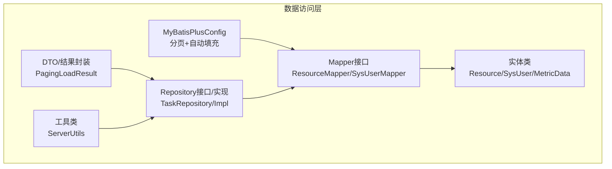
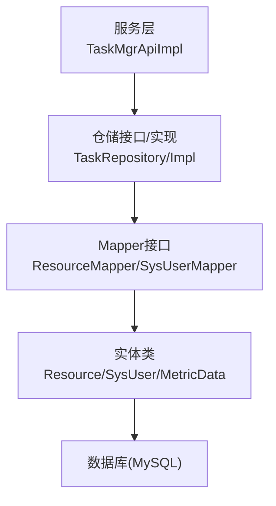
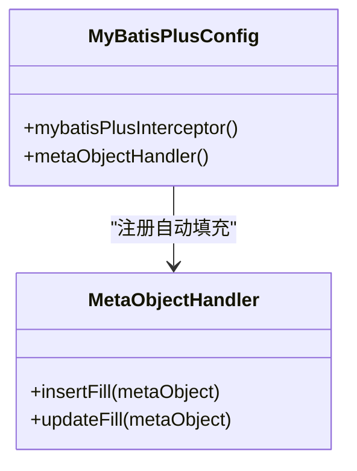
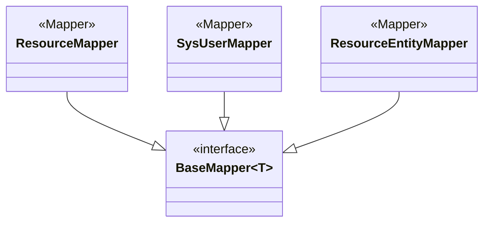
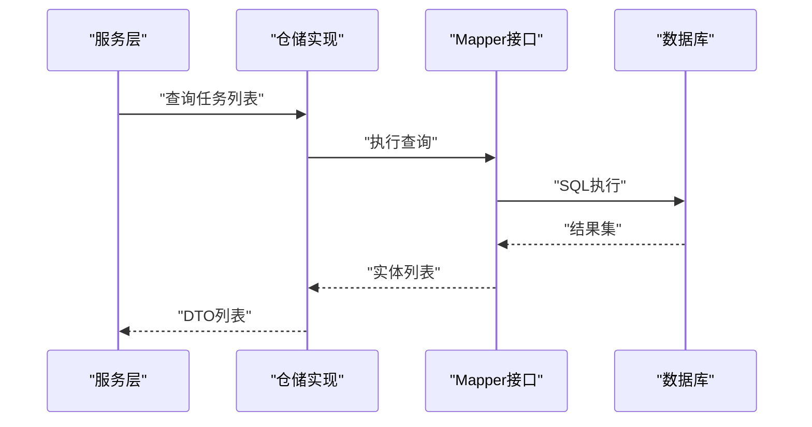
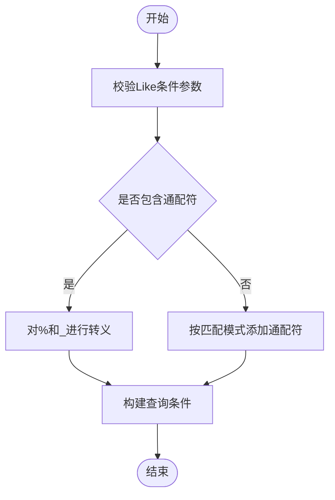
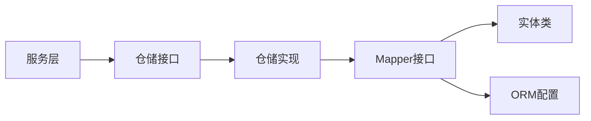

# 数据访问模式

<cite>
**本文引用的文件**
- [MyBatisPlusConfig.java](file://watcher-sdk/src/main/java/com/virtual/cloud/om/sdk/config/mybatis/MyBatisPlusConfig.java)
- [application.properties](file://watcher-agent/src/main/resources/application.properties)
- [TaskRepository.java](file://watcher-agent/src/main/java/com/virtual/cloud/om/agent/repository/TaskRepository.java)
- [TaskRepositoryImpl.java](file://watcher-agent/src/main/java/com/virtual/cloud/om/agent/repository/TaskRepositoryImpl.java)
- [ResourceEntityMapper.java](file://watcher-sdk/src/main/java/com/virtual/cloud/om/sdk/mapper/ResourceEntityMapper.java)
- [ResourceMapper.java](file://watcher-sdk/src/main/java/com/virtual/cloud/om/sdk/mapper/ResourceMapper.java)
- [SysUserMapper.java](file://watcher-sdk/src/main/java/com/virtual/cloud/om/sdk/mapper/SysUserMapper.java)
- [ResourceEntity.java](file://watcher-sdk/src/main/java/com/virtual/cloud/om/sdk/entity/mysql/ResourceEntity.java)
- [Resource.java](file://watcher-sdk/src/main/java/com/virtual/cloud/om/sdk/entity/mysql/Resource.java)
- [SysUser.java](file://watcher-sdk/src/main/java/com/virtual/cloud/om/sdk/entity/mysql/SysUser.java)
- [MetricData.java](file://watcher-sdk/src/main/java/com/virtual/cloud/om/sdk/entity/mysql/MetricData.java)
- [ServerUtils.java](file://watcher-sdk/src/main/java/com/virtual/cloud/om/sdk/utils/ServerUtils.java)
- [TaskMgrApiImpl.java](file://watcher-agent/src/main/java/com/virtual/cloud/om/agent/service/task/TaskMgrApiImpl.java)
- [PagingLoadResult.java](file://watcher-sdk/src/main/java/com/virtual/cloud/om/sdk/dto/PagingLoadResult.java)
- [ListLoadResult.java](file://watcher-sdk/src/main/java/com/virtual/cloud/om/sdk/dto/ListLoadResult.java)
- [DataReportAspect.java](file://watcher-sdk/src/main/java/com/virtual/cloud/om/sdk/aop/DataReportAspect.java)
</cite>

## 目录
1. [简介](#简介)
2. [项目结构](#项目结构)
3. [核心组件](#核心-components)
4. [架构总览](#架构总览)
5. [详细组件分析](#详细组件分析)
6. [依赖分析](#依赖分析)
7. [性能考虑](#性能考虑)
8. [故障排查指南](#故障排查指南)
9. [结论](#结论)
10. [附录](#附录)

## 简介
本文件面向ShowTime监控系统，聚焦数据访问层的设计与实现，系统化梳理ORM框架MyBatis-Plus的配置与使用、注解与动态SQL实践、Repository与DAO模式、CRUD最佳实践、查询优化策略（索引、分页、批量、缓存）、事务管理（传播与隔离）以及性能监控与调优方法，并给出单元测试与集成测试策略建议。文档以代码为依据，结合图示帮助读者快速理解并落地到实际开发中。

## 项目结构
围绕数据访问层的关键位置与职责如下：
- ORM配置：MyBatis-Plus拦截器与自动填充配置
- 数据模型：MySQL实体类及注解映射
- 访问接口：Mapper接口继承BaseMapper
- 仓储实现：Repository接口与实现（在MySQL单机模式下部分功能被禁用）
- 配置文件：数据源与MyBatis-Plus相关属性
- 工具与DTO：分页结果、模糊查询转义工具等



图表来源
- [MyBatisPlusConfig.java:1-50](file://watcher-sdk/src/main/java/com/virtual/cloud/om/sdk/config/mybatis/MyBatisPlusConfig.java#L1-L50)
- [ResourceMapper.java:1-13](file://watcher-sdk/src/main/java/com/virtual/cloud/om/sdk/mapper/ResourceMapper.java#L1-L13)
- [SysUserMapper.java:1-13](file://watcher-sdk/src/main/java/com/virtual/cloud/om/sdk/mapper/SysUserMapper.java#L1-L13)
- [Resource.java:1-57](file://watcher-sdk/src/main/java/com/virtual/cloud/om/sdk/entity/mysql/Resource.java#L1-L57)
- [SysUser.java:1-56](file://watcher-sdk/src/main/java/com/virtual/cloud/om/sdk/entity/mysql/SysUser.java#L1-L56)
- [TaskRepository.java:1-33](file://watcher-agent/src/main/java/com/virtual/cloud/om/agent/repository/TaskRepository.java#L1-L33)
- [TaskRepositoryImpl.java:1-77](file://watcher-agent/src/main/java/com/virtual/cloud/om/agent/repository/TaskRepositoryImpl.java#L1-L77)
- [PagingLoadResult.java:1-38](file://watcher-sdk/src/main/java/com/virtual/cloud/om/sdk/dto/PagingLoadResult.java#L1-L38)
- [ServerUtils.java:272-299](file://watcher-sdk/src/main/java/com/virtual/cloud/om/sdk/utils/ServerUtils.java#L272-L299)

章节来源
- [MyBatisPlusConfig.java:1-50](file://watcher-sdk/src/main/java/com/virtual/cloud/om/sdk/config/mybatis/MyBatisPlusConfig.java#L1-L50)
- [application.properties:46-59](file://watcher-agent/src/main/resources/application.properties#L46-L59)

## 核心组件
- ORM配置
  - 分页插件：基于MyBatis-Plus拦截器，针对MySQL的分页内核
  - 自动填充：插入/更新时自动填充时间字段
- Mapper接口
  - 统一继承BaseMapper，获得标准CRUD能力
- 实体类
  - 使用@TableId、@TableName等注解映射数据库表
- Repository接口与实现
  - 定义业务域查询契约；在MySQL单机模式下，实现类对写操作进行了禁用或降级
- 配置文件
  - 数据源、MyBatis-Plus扫描路径、驼峰映射、日志实现等

章节来源
- [MyBatisPlusConfig.java:19-50](file://watcher-sdk/src/main/java/com/virtual/cloud/om/sdk/config/mybatis/MyBatisPlusConfig.java#L19-L50)
- [ResourceEntityMapper.java:1-13](file://watcher-sdk/src/main/java/com/virtual/cloud/om/sdk/mapper/ResourceEntityMapper.java#L1-L13)
- [ResourceMapper.java:1-13](file://watcher-sdk/src/main/java/com/virtual/cloud/om/sdk/mapper/ResourceMapper.java#L1-L13)
- [SysUserMapper.java:1-13](file://watcher-sdk/src/main/java/com/virtual/cloud/om/sdk/mapper/SysUserMapper.java#L1-L13)
- [ResourceEntity.java:13-47](file://watcher-sdk/src/main/java/com/virtual/cloud/om/sdk/entity/mysql/ResourceEntity.java#L13-L47)
- [Resource.java:14-56](file://watcher-sdk/src/main/java/com/virtual/cloud/om/sdk/entity/mysql/Resource.java#L14-L56)
- [SysUser.java:18-55](file://watcher-sdk/src/main/java/com/virtual/cloud/om/sdk/entity/mysql/SysUser.java#L18-L55)
- [TaskRepository.java:12-33](file://watcher-agent/src/main/java/com/virtual/cloud/om/agent/repository/TaskRepository.java#L12-L33)
- [TaskRepositoryImpl.java:18-77](file://watcher-agent/src/main/java/com/virtual/cloud/om/agent/repository/TaskRepositoryImpl.java#L18-L77)
- [application.properties:46-59](file://watcher-agent/src/main/resources/application.properties#L46-L59)

## 架构总览
数据访问层采用“实体-映射-仓储-服务”的分层设计：
- 实体类负责表结构映射
- Mapper接口通过BaseMapper提供CRUD
- Repository抽象业务查询契约，屏蔽具体实现
- 服务层组合Repository与Mapper完成业务逻辑



图表来源
- [TaskMgrApiImpl.java:126-164](file://watcher-agent/src/main/java/com/virtual/cloud/om/agent/service/task/TaskMgrApiImpl.java#L126-L164)
- [TaskRepository.java:12-33](file://watcher-agent/src/main/java/com/virtual/cloud/om/agent/repository/TaskRepository.java#L12-L33)
- [TaskRepositoryImpl.java:18-77](file://watcher-agent/src/main/java/com/virtual/cloud/om/agent/repository/TaskRepositoryImpl.java#L18-L77)
- [ResourceMapper.java:1-13](file://watcher-sdk/src/main/java/com/virtual/cloud/om/sdk/mapper/ResourceMapper.java#L1-L13)
- [SysUserMapper.java:1-13](file://watcher-sdk/src/main/java/com/virtual/cloud/om/sdk/mapper/SysUserMapper.java#L1-L13)
- [Resource.java:14-56](file://watcher-sdk/src/main/java/com/virtual/cloud/om/sdk/entity/mysql/Resource.java#L14-L56)
- [SysUser.java:18-55](file://watcher-sdk/src/main/java/com/virtual/cloud/om/sdk/entity/mysql/SysUser.java#L18-L55)

## 详细组件分析

### ORM配置与使用（MyBatis-Plus）
- 分页插件
  - 在拦截器中注册PaginationInnerInterceptor，适配MySQL方言
- 自动填充
  - MetaObjectHandler统一处理插入/更新时间字段，保证数据一致性
- 配置项
  - mapper扫描路径、类型别名包、驼峰映射、日志实现等



图表来源
- [MyBatisPlusConfig.java:22-49](file://watcher-sdk/src/main/java/com/virtual/cloud/om/sdk/config/mybatis/MyBatisPlusConfig.java#L22-L49)

章节来源
- [MyBatisPlusConfig.java:19-50](file://watcher-sdk/src/main/java/com/virtual/cloud/om/sdk/config/mybatis/MyBatisPlusConfig.java#L19-L50)
- [application.properties:53-58](file://watcher-agent/src/main/resources/application.properties#L53-L58)

### 数据模型与注解使用
- 实体类注解
  - @TableName：映射表名
  - @TableId：主键定义，IdType可按需设置
  - @TableField：非物理字段或特殊字段控制
- 字段命名
  - 建议遵循数据库命名规范，配合map-underscore-to-camel-case实现自动映射

```mermaid
classDiagram
class Resource {
+id : String
+resourceName : String
+platform : String
+ipAddress : String
+port : Integer
+protocol : String
+authType : String
+ac : String
+ci : String
+serverUsername : String
+serverPassword : String
+serverPort : Integer
+active : Integer
+usable : Integer
+remote : Integer
+endTime : LocalDateTime
+createTime : LocalDateTime
+updateTime : LocalDateTime
}
class SysUser {
+id : String
+username : String
+password : String
+lastLoginTime : LocalDateTime
+createTime : LocalDateTime
+updateTime : LocalDateTime
}
class MetricData {
+id : String
+resourceId : String
+resourceIp : String
+platform : String
+metricType : String
+metricName : String
+metricValue : String
+metricUnit : String
+tags : String
+reportTime : LocalDateTime
+createTime : LocalDateTime
}
Resource ..> "@TableName/@TableId/@TableField"
SysUser ..> "@TableName/@TableId/@TableField"
MetricData ..> "@TableName/@TableId/@TableField"
```

图表来源
- [Resource.java:14-56](file://watcher-sdk/src/main/java/com/virtual/cloud/om/sdk/entity/mysql/Resource.java#L14-L56)
- [SysUser.java:18-55](file://watcher-sdk/src/main/java/com/virtual/cloud/om/sdk/entity/mysql/SysUser.java#L18-L55)
- [MetricData.java:14-42](file://watcher-sdk/src/main/java/com/virtual/cloud/om/sdk/entity/mysql/MetricData.java#L14-L42)

章节来源
- [Resource.java:14-56](file://watcher-sdk/src/main/java/com/virtual/cloud/om/sdk/entity/mysql/Resource.java#L14-L56)
- [SysUser.java:18-55](file://watcher-sdk/src/main/java/com/virtual/cloud/om/sdk/entity/mysql/SysUser.java#L18-L55)
- [MetricData.java:14-42](file://watcher-sdk/src/main/java/com/virtual/cloud/om/sdk/entity/mysql/MetricData.java#L14-L42)

### Mapper接口与DAO模式
- DAO模式
  - Mapper接口作为DAO，继承BaseMapper即可获得标准CRUD
- 典型接口
  - ResourceMapper、SysUserMapper、ResourceEntityMapper等



图表来源
- [ResourceMapper.java:1-13](file://watcher-sdk/src/main/java/com/virtual/cloud/om/sdk/mapper/ResourceMapper.java#L1-L13)
- [SysUserMapper.java:1-13](file://watcher-sdk/src/main/java/com/virtual/cloud/om/sdk/mapper/SysUserMapper.java#L1-L13)
- [ResourceEntityMapper.java:1-13](file://watcher-sdk/src/main/java/com/virtual/cloud/om/sdk/mapper/ResourceEntityMapper.java#L1-L13)

章节来源
- [ResourceMapper.java:1-13](file://watcher-sdk/src/main/java/com/virtual/cloud/om/sdk/mapper/ResourceMapper.java#L1-L13)
- [SysUserMapper.java:1-13](file://watcher-sdk/src/main/java/com/virtual/cloud/om/sdk/mapper/SysUserMapper.java#L1-L13)
- [ResourceEntityMapper.java:1-13](file://watcher-sdk/src/main/java/com/virtual/cloud/om/sdk/mapper/ResourceEntityMapper.java#L1-L13)

### 仓储与CRUD最佳实践
- 仓储接口
  - 抽象业务查询契约，如任务查询、过滤条件等
- 实现类
  - 在MySQL单机模式下，写操作被禁用或降级，查询返回空集合或默认对象，便于系统在特定环境下稳定运行
- 服务层组合
  - 服务层通过仓储接口与Mapper协作，完成业务流程



图表来源
- [TaskMgrApiImpl.java:126-164](file://watcher-agent/src/main/java/com/virtual/cloud/om/agent/service/task/TaskMgrApiImpl.java#L126-L164)
- [TaskRepository.java:12-33](file://watcher-agent/src/main/java/com/virtual/cloud/om/agent/repository/TaskRepository.java#L12-L33)
- [TaskRepositoryImpl.java:18-77](file://watcher-agent/src/main/java/com/virtual/cloud/om/agent/repository/TaskRepositoryImpl.java#L18-L77)

章节来源
- [TaskRepository.java:12-33](file://watcher-agent/src/main/java/com/virtual/cloud/om/agent/repository/TaskRepository.java#L12-L33)
- [TaskRepositoryImpl.java:18-77](file://watcher-agent/src/main/java/com/virtual/cloud/om/agent/repository/TaskRepositoryImpl.java#L18-L77)
- [TaskMgrApiImpl.java:126-164](file://watcher-agent/src/main/java/com/virtual/cloud/om/agent/service/task/TaskMgrApiImpl.java#L126-L164)

### 动态SQL与查询优化
- 模糊查询转义
  - 提供通用的Like条件转义工具，支持自定义匹配模式，避免SQL注入与错误匹配
- 分页查询
  - 通过分页插件实现，建议在高并发场景下结合索引与合理排序字段
- 批量操作
  - 可结合批量插入/更新策略，减少往返次数
- 缓存机制
  - 可在应用层引入轻量缓存（如内存Map），降低热点查询压力（注意缓存一致性）



图表来源
- [ServerUtils.java:286-299](file://watcher-sdk/src/main/java/com/virtual/cloud/om/sdk/utils/ServerUtils.java#L286-L299)

章节来源
- [ServerUtils.java:272-299](file://watcher-sdk/src/main/java/com/virtual/cloud/om/sdk/utils/ServerUtils.java#L272-L299)
- [MyBatisPlusConfig.java:22-27](file://watcher-sdk/src/main/java/com/virtual/cloud/om/sdk/config/mybatis/MyBatisPlusConfig.java#L22-L27)

### 事务管理策略
- 事务传播
  - 建议在服务层使用@Transactional标注关键业务方法，确保跨多个Mapper/仓储的原子性
- 隔离级别
  - 默认隔离级别满足大多数场景；对强一致需求可显式指定
- 异常处理
  - 结合全局异常处理与业务异常，确保回滚与日志记录完整

[本节为通用指导，不直接分析具体文件，故无章节来源]

### 性能监控与调优
- SQL日志
  - 通过配置启用SQL日志输出，定位慢查询
- 分页与索引
  - 合理使用分页插件，确保查询条件命中索引
- 批量与缓存
  - 批量写入与热点数据缓存相结合，降低数据库压力
- AOP埋点
  - 可扩展AOP切面统计接口耗时与异常情况

章节来源
- [application.properties:56-58](file://watcher-agent/src/main/resources/application.properties#L56-L58)
- [DataReportAspect.java:1-59](file://watcher-sdk/src/main/java/com/virtual/cloud/om/sdk/aop/DataReportAspect.java#L1-L59)

### 测试策略
- 单元测试
  - 针对仓储接口与Mapper的CRUD方法编写单元测试，使用嵌入式数据库或内存数据库
- 集成测试
  - 在MySQL单机模式下验证查询行为与禁用写操作的正确性
- 分页与模糊查询
  - 验证分页插件与Like转义工具的行为

[本节为通用指导，不直接分析具体文件，故无章节来源]

## 依赖分析
- 组件耦合
  - 服务层依赖仓储接口，仓储实现依赖Mapper接口，Mapper依赖实体类
- 外部依赖
  - MyBatis-Plus、Spring Data、MySQL驱动
- 循环依赖
  - 通过构造器注入与延迟初始化避免循环依赖问题



图表来源
- [TaskMgrApiImpl.java:126-164](file://watcher-agent/src/main/java/com/virtual/cloud/om/agent/service/task/TaskMgrApiImpl.java#L126-L164)
- [TaskRepository.java:12-33](file://watcher-agent/src/main/java/com/virtual/cloud/om/agent/repository/TaskRepository.java#L12-L33)
- [TaskRepositoryImpl.java:18-77](file://watcher-agent/src/main/java/com/virtual/cloud/om/agent/repository/TaskRepositoryImpl.java#L18-L77)
- [ResourceMapper.java:1-13](file://watcher-sdk/src/main/java/com/virtual/cloud/om/sdk/mapper/ResourceMapper.java#L1-L13)
- [SysUserMapper.java:1-13](file://watcher-sdk/src/main/java/com/virtual/cloud/om/sdk/mapper/SysUserMapper.java#L1-L13)
- [MyBatisPlusConfig.java:22-49](file://watcher-sdk/src/main/java/com/virtual/cloud/om/sdk/config/mybatis/MyBatisPlusConfig.java#L22-L49)

章节来源
- [TaskMgrApiImpl.java:126-164](file://watcher-agent/src/main/java/com/virtual/cloud/om/agent/service/task/TaskMgrApiImpl.java#L126-L164)
- [TaskRepository.java:12-33](file://watcher-agent/src/main/java/com/virtual/cloud/om/agent/repository/TaskRepository.java#L12-L33)
- [TaskRepositoryImpl.java:18-77](file://watcher-agent/src/main/java/com/virtual/cloud/om/agent/repository/TaskRepositoryImpl.java#L18-L77)
- [ResourceMapper.java:1-13](file://watcher-sdk/src/main/java/com/virtual/cloud/om/sdk/mapper/ResourceMapper.java#L1-L13)
- [SysUserMapper.java:1-13](file://watcher-sdk/src/main/java/com/virtual/cloud/om/sdk/mapper/SysUserMapper.java#L1-L13)
- [MyBatisPlusConfig.java:22-49](file://watcher-sdk/src/main/java/com/virtual/cloud/om/sdk/config/mybatis/MyBatisPlusConfig.java#L22-L49)

## 性能考虑
- 分页与索引
  - 使用分页插件时，确保查询条件与排序字段建立合适索引
- 批量写入
  - 合理批次大小，避免单次事务过大导致锁竞争
- 自动填充
  - 统一时间字段填充，减少业务层重复逻辑
- 日志与监控
  - 开启SQL日志与慢查询监控，定期分析热点SQL

[本节为通用指导，不直接分析具体文件，故无章节来源]

## 故障排查指南
- 写操作被禁用
  - 在MySQL单机模式下，仓储实现对写操作进行禁用或降级，属于预期行为
- 分页无效
  - 检查分页插件是否正确注册与数据库方言配置
- Like查询异常
  - 使用Like转义工具处理通配符，避免误匹配
- 自动填充未生效
  - 检查MetaObjectHandler是否被正确注册

章节来源
- [TaskRepositoryImpl.java:22-46](file://watcher-agent/src/main/java/com/virtual/cloud/om/agent/repository/TaskRepositoryImpl.java#L22-L46)
- [MyBatisPlusConfig.java:22-49](file://watcher-sdk/src/main/java/com/virtual/cloud/om/sdk/config/mybatis/MyBatisPlusConfig.java#L22-L49)
- [ServerUtils.java:286-299](file://watcher-sdk/src/main/java/com/virtual/cloud/om/sdk/utils/ServerUtils.java#L286-L299)

## 结论
ShowTime监控系统在数据访问层采用了清晰的分层与约定：实体类注解映射、Mapper继承BaseMapper、仓储接口抽象、服务层编排。在MySQL单机模式下，系统通过禁用写操作与降级实现保障稳定性；同时借助MyBatis-Plus的分页与自动填充能力提升开发效率与数据一致性。建议在生产环境中进一步完善索引、分页与缓存策略，并通过AOP与日志体系加强性能监控与问题定位。

## 附录
- 分页结果接口
  - PagingLoadResult与ListLoadResult用于封装分页查询结果
- 配置要点
  - 数据源URL、用户名、密码、驱动类名
  - MyBatis-Plus的mapper扫描路径、类型别名包、驼峰映射、日志实现

章节来源
- [PagingLoadResult.java:8-38](file://watcher-sdk/src/main/java/com/virtual/cloud/om/sdk/dto/PagingLoadResult.java#L8-L38)
- [ListLoadResult.java:10-19](file://watcher-sdk/src/main/java/com/virtual/cloud/om/sdk/dto/ListLoadResult.java#L10-L19)
- [application.properties:48-58](file://watcher-agent/src/main/resources/application.properties#L48-L58)